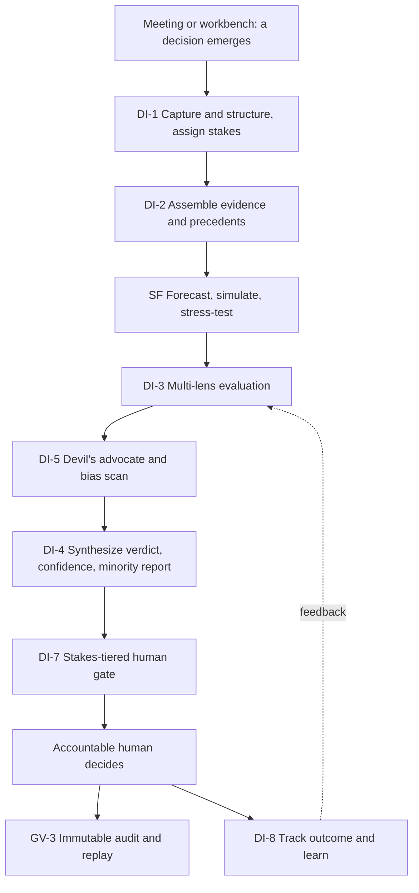

# TrueNorth — Master plan

## 1. Executive summary

TrueNorth is an enterprise **Decision-Intelligence Operating System**: an "AI OS" that takes input from every department of a large company, understands the company's current goals, watches the decisions teams make (typically in meetings), and tells them whether following a given decision is a good idea — with reasoning, evidence, confidence, and the strongest argument against itself. It is designed for Fortune-500 scale (Tesla used as the mental model: manufacturing, supply chain, engineering, finance, HR, sales, legal) but is industry-generic and deployable as SaaS, VPC, on-prem, or air-gapped.

The product rests on one hard invariant: **humans always decide.** TrueNorth advises on the canonical scale — **Endorse / Endorse-with-conditions / Caution / Oppose** — routes each decision through human gates sized to its stakes (S1 existential → S4 routine), records everything immutably, learns from what actually happened, and never makes autonomous people decisions or surveils individuals.

This plan decomposes TrueNorth into **12 pillars**, each broken to L1→L2→L3→L4 (and L5 where warranted), supported by a four-level C4 architecture, fifteen stakeholder perspectives spanning the board to the factory floor, and a responsible-AI program and delivery roadmap. The canonical taxonomy, ID rules, and authoring conventions live in the [shared specification](00-shared-specification.md); the full list of authored documents and their owners is in the [work-unit roster](01-work-unit-roster.md).

## 2. The twelve pillars

| Pillar | Name | What it does |
|---|---|---|
| DF | Data & Integration Fabric | Connects to every system of record and external feed; ingests, privacy-filters, and tracks lineage |
| KG | Organizational Knowledge Graph | A living, time-aware graph of goals, decisions, people, and institutional memory |
| MI | Meeting & Communication Intelligence | Hears the company think: captures meetings, extracts decisions, commitments, and dissent |
| GA | Goal & Strategy Alignment | The OKR cascade; detects conflicts; scores every decision against strategy |
| DI | Decision Intelligence Engine | The judgment core: structures, evidences, judges, and recommends on decisions |
| SF | Simulation & Forecasting | Forecasts, scenarios, Monte Carlo, the org digital twin, and war-gaming |
| WB | Department Workbenches | Finance, HR, ops, GTM, engineering, legal, customer, corp-dev decision surfaces |
| SX | Surfaces & Workflow Integration | Where people meet TrueNorth: command centers, chat, plugins, frontline devices |
| GV | Governance, Risk, Compliance & Responsible AI | Decision rights, human gates, audit/replay, explainability, red lines |
| SC | Security, Identity & Trust | Identity, data protection, AI-specific defenses, isolation, certifications |
| PL | Platform, AI Infrastructure & MLOps | Model gateway, retrieval, agent orchestration, evaluation harness |
| AD | Adoption, Value Realization & Analytics | Onboarding, change management, ROI attribution, feedback loops |

## 3. The hero flow — a decision's lifecycle

## 4. Document map

### Foundations
- [Shared specification](00-shared-specification.md) — canonical pillar map, assumptions, ID and Mermaid rules
- [Work-unit roster](01-work-unit-roster.md) — all units, owners, and the workbench ownership map
- Templates: [perspective](templates/perspective-template.md), [feature catalog](templates/feature-catalog-template.md), [architecture](templates/architecture-template.md)

### Architecture (C4)
- [L1 — System context](architecture/L1-system-context.md)
- [L2 — Containers](architecture/L2-containers.md)
- [L3 — Components](architecture/L3-components.md)
- [L4 — Data & APIs](architecture/L4-data-and-apis.md)

### Feature catalogs (the L1→L4 detail)
- [Data & knowledge (DF + KG)](features/data-and-knowledge.md)
- [Meetings & alignment (MI + GA)](features/meetings-and-alignment.md)
- [Decision & simulation (DI + SF)](features/decision-and-simulation.md) — the judgment core
- [Surfaces & workbench framework (SX + WB-0)](features/surfaces-and-workbench-framework.md)
- [Governance & responsible AI (GV)](features/governance-responsible-ai.md)
- [Security & trust (SC)](features/security-trust.md)
- [Platform & adoption (PL + AD)](features/platform-and-adoption.md)

### Perspectives (board to frontline)
- [CEO, board & investors](perspectives/ceo-board-investors.md) (owns WB-CDV)
- [CTO](perspectives/cto.md)
- [AI/ML engineering](perspectives/ai-ml-engineering.md)
- [CIO & CDO / data platform](perspectives/cio-cdo-data-platform.md)
- [CISO](perspectives/ciso-security.md)
- [Legal & compliance](perspectives/legal-compliance.md) (owns WB-LGL)
- [CFO & finance](perspectives/cfo-finance.md) (owns WB-FIN)
- [CHRO & HR](perspectives/chro-hr.md) (owns WB-HR)
- [COO & operations / supply chain](perspectives/coo-operations-supply-chain.md) (owns WB-OPS)
- [CMO, GTM & customer](perspectives/cmo-gtm-customer.md) (owns WB-GTM, WB-CS)
- [Engineering team leader](perspectives/engineering-team-leader.md) (owns WB-ENG)
- [Senior IC](perspectives/senior-ic.md)
- [Frontline & entry-level](perspectives/frontline-entry-level.md)
- [Product & UX](perspectives/product-ux.md)

### Delivery
- [Responsible-AI deep dive](delivery/responsible-ai-deep-dive.md)
- [Roadmap & delivery](delivery/roadmap-and-delivery.md)

## 5. Glossary

- **Decision record** — the structured artifact at the heart of TrueNorth: context, options, criteria, assumptions, stakes tier, verdict, conditions, sign-offs, outcome.
- **Verdict** — one of Endorse / Endorse-with-conditions / Caution / Oppose.
- **Stakes tier** — S1 (existential/board) → S2 (executive) → S3 (departmental) → S4 (team/routine); drives evaluation depth and human gates.
- **Lens** — a domain-specific judge (financial, strategic, risk, legal, people, customer, ESG) contributing to a verdict.
- **Minority report** — the strongest argument against the issued verdict, always attached.
- **Calibration** — measured agreement between TrueNorth's stated confidence and realized outcomes.
- **Workbench** — a department-specific surface and feature pack built on the WB-0 framework.
- **Org digital twin** — a model that propagates a candidate decision's effects across departments (SF-4).
- **Red lines** — immutable prohibitions: no covert monitoring, no individual surveillance scoring, no autonomous people decisions.

## 6. Top risks (cross-cutting)

| Risk | Where addressed |
|---|---|
| Automation bias — humans rubber-stamp the AI | [Responsible-AI deep dive](delivery/responsible-ai-deep-dive.md); minority report (DI-4), anti-abdication UX ([product & UX](perspectives/product-ux.md)) |
| Surveillance creep / red-line breach | [Governance catalog](features/governance-responsible-ai.md) (GV-6), [CHRO works-council lens](perspectives/chro-hr.md), [frontline perspective](perspectives/frontline-entry-level.md) |
| Confident-but-wrong on novel decisions | Calibration (DI-6), stakes gates (DI-7), [AI/ML engineering perspective](perspectives/ai-ml-engineering.md) |
| Integration drag / foundation underinvestment | [Roadmap](delivery/roadmap-and-delivery.md) Phase 0; [CIO & CDO perspective](perspectives/cio-cdo-data-platform.md) |
| Trust collapse from an early high-stakes miss | [Roadmap](delivery/roadmap-and-delivery.md) stakes ramp; [CEO/board/investors](perspectives/ceo-board-investors.md) |
| AI-specific attack (injection, poisoning, exfiltration) | [Security catalog](features/security-trust.md) (SC-3); [CISO perspective](perspectives/ciso-security.md) |
| ROI skepticism — paying for "AI judgment" | Value realization (AD-4); [CFO](perspectives/cfo-finance.md) and [CEO/board/investors](perspectives/ceo-board-investors.md) |

## 7. North-star metrics

- **Decision-quality lift** — better realized outcomes on decisions where TrueNorth advised, separating advice-followed from advice-overridden.
- **Trust calibration** — reliance tracks correctness (neither over- nor under-trust).
- **Time-to-decision** reduced at constant or improved quality.
- **Strategy alignment** — share of decisions scored aligned to current strategy rises.
- **Minority-report engagement** on S1/S2 decisions.
- **Zero red-line incidents** — a hard gate, never a tradeoff.
- **Adoption in-flow** — active decision-makers and decisions-under-management, not seat licenses.

## 8. How this plan was produced

This plan was authored as 27 work units. Twenty-six produced the architecture, feature catalogs, and perspectives in parallel; this master plan was written last to synthesize and link them. The canonical taxonomy and authoring rules that kept 27 independent authors coherent are in the [shared specification](00-shared-specification.md), and the unit/owner mapping is in the [work-unit roster](01-work-unit-roster.md).
