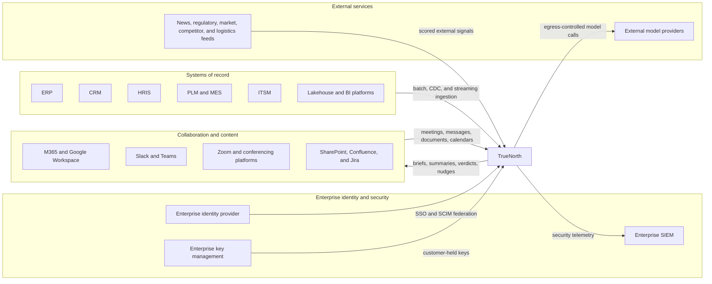
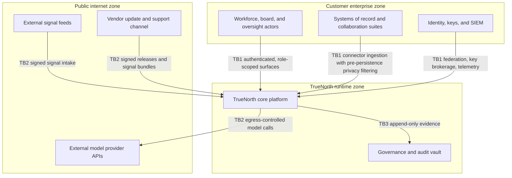

# TrueNorth architecture — C4 level 1 system context

## 1. Front matter

| Field | Value |
|---|---|
| Doc ID | ARCH-L1 |
| C4 level | 1 System context |
| Owning unit | U1 Architecture C4 L1+L2 |
| Version | 1.0 |

## 2. Scope & imported assumptions

This document is the C4 level 1 view of TrueNorth. It treats TrueNorth as a single software system and describes everything that touches it from the outside: the human actors who use, oversee, and operate it; the enterprise systems it ingests from and writes back to; the external feeds and services it depends on; the trust boundaries that separate those parties; and the four deployment models that determine where each boundary physically sits. This level deliberately stops at the system's skin. The internal containers that realize the twelve pillars are defined in the C4 level 2 document; components and code-level schemas belong to lower levels owned by other units. Element identifiers in this document use the `CTX-` architecture namespace; this document mints no L3 or lower feature IDs and cites platform capabilities exclusively by their canonical L2 IDs.

The design imports the canonical assumptions block from the shared specification verbatim and unchanged:

- **Verdict scale:** Endorse / Endorse-with-conditions / Caution / Oppose
- **Stakes tiers:** S1 (existential/board-level) → S2 (executive) → S3 (departmental) → S4 (team/routine); human-in-the-loop gates scale with stakes
- **Invariant:** humans always retain decision authority; TrueNorth advises, records, and learns from outcomes
- **Deployment:** SaaS / VPC / on-prem / air-gapped; multi-tenant with hard isolation options; data residency honored
- **Red lines:** no covert monitoring, no individual surveillance scoring, no autonomous people decisions

These assumptions are load-bearing at this level: the human-decides invariant fixes TrueNorth's posture toward every enterprise system as advisory and read-mostly; the deployment assumption forces every external relationship in this document to remain valid when the internet, the vendor, or both are unreachable; and the red lines constrain which signals may cross the system boundary at all.

## 3. Diagrams

### 3.1 People and the system

TrueNorth shall serve every level of the organization with the same underlying system, differentiated by role-aware surfaces (SX-1 through SX-4) and stakes-tiered controls (GV-2). The first diagram shows the human actors and their primary relationship to the system.

```mermaid
flowchart TD
    BRD["Board members and investors"] -->|"review S1 decision packets and portfolio views"| TN
    EXE["CEO and executive leadership"] -->|"decide S1 and S2, steward strategy"| TN
    DLD["Department and functional leaders"] -->|"decide S2 and S3 via workbenches"| TN
    TLD["Team leads and line managers"] -->|"decide S3 and S4, run meetings"| TN
    ICS["Senior ICs and analysts"] -->|"draft decisions, contribute evidence"| TN
    FLW["Frontline and deskless workers"] -->|"receive digests, log commitments"| TN
    FAC["Decision facilitators and chiefs of staff"] -->|"operate decision workflows"| TN
    STW["Knowledge stewards and SMEs"] -->|"validate and curate graph facts"| TN
    GOV["Ethics board, compliance, and internal audit"] -->|"set policy, replay decisions"| TN
    OPS["Platform operators and IT"] -->|"administer tenants, connectors, models"| TN
    WCL["Works councils and employee representatives"] -->|"verify consent and red lines"| TN
    REG["External auditors and regulators"] -->|"inspect audit evidence"| TN
    TN["TrueNorth decision-intelligence operating system"]
```

**TrueNorth (the system).** The single system in scope. It ingests signals, maintains the organizational knowledge graph, evaluates proposed decisions against strategy, data, precedent, simulation, and risk, and returns a structured recommendation on the canonical verdict scale with reasoning, citations, confidence, and a minority report. It never executes a decision.

**Board members and investors.** Consume governance-grade summaries of S1 decisions, outcome track records, and the initiative portfolio. Their access is read-and-annotate; they trigger no system actions beyond review and sign-off participation where the decision-rights matrix (GV-1) grants it.

**CEO and executive leadership.** Own the strategy graph that everything else aligns to (GA-1), receive S1/S2 verdicts with full evaluation context, and retain final authority on every recommendation at their tier.

**Department and functional leaders.** The heaviest verdict consumers. They propose and decide S2/S3 decisions inside department workbenches, monitor goal health, and respond to conflict and drift alerts (GA-2, GA-5).

**Team leads and line managers.** Run the meetings that generate most decision raw material, confirm extracted decisions and commitments (MI-2), and decide S3/S4 items with lightweight gates.

**Senior ICs and analysts.** Draft decision records, attach evidence, run what-if scenarios, and challenge recommendations. TrueNorth shall treat them as evidence producers as well as consumers.

**Frontline and deskless workers.** Interact through mobile and notification surfaces (SX-4): commitments assigned to them, digests relevant to their work cell, and a channel to raise signals upward. The red lines apply with special force here — no individual surveillance scoring.

**Decision facilitators and chiefs of staff.** Operate decision workflows on behalf of executives: scheduling reviews, chasing sign-offs, ensuring conditions attached to Endorse-with-conditions verdicts are tracked to closure (DI-7).

**Knowledge stewards and subject-matter experts.** Resolve contested facts and validate machine-constructed graph content through curation queues (KG-5). They are the human quality gate on institutional memory.

**Ethics board, compliance, and internal audit.** Encode the decision-rights matrix and prohibited uses (GV-1, GV-6), audit and replay past recommendations (GV-3), and monitor model risk. They hold administrative power over what TrueNorth may evaluate.

**Platform operators and IT.** Administer tenancy, connectors, identity federation, model configuration, and deployment lifecycle. In on-prem and air-gapped models they operate the entire runtime.

**Works councils and employee representatives.** A first-class actor wherever codetermination law applies. They verify consent regimes for meeting capture (MI-6) and confirm red-line enforcement; TrueNorth shall expose evidence to them without exposing individual-level behavioral data.

**External auditors and regulators.** Receive scoped, supervised access to immutable audit evidence and explainability artifacts (GV-3, GV-4), typically through export rather than interactive use.

### 3.2 Enterprise systems and external feeds

The second diagram shows the software systems TrueNorth connects to. Inbound flows dominate by design; outbound flows are limited to TrueNorth-authored artifacts pushed into collaboration tools and APIs exposed for extension.

**Systems of record.** ERP (financials, supply chain), CRM (pipeline, customers), HRIS (org structure, workforce — ingested under strict minimization, DF-4), PLM and MES (product definitions, manufacturing execution), ITSM (incidents, changes), and the corporate lakehouse and BI platforms (curated metrics and history). TrueNorth shall ingest from these through the connector library (DF-1) and pipelines (DF-2) and shall treat them as authoritative for their domains; it does not master their data, and it cites them through lineage (DF-5) in every recommendation.

**Collaboration and content systems.** M365 and Google Workspace supply mail, calendars, and documents; Slack and Teams supply channel context; Zoom and conferencing platforms supply meetings for capture and transcription (MI-1) under per-jurisdiction consent governance (MI-6); SharePoint, Confluence, and Jira supply documents and work items. These systems are bidirectional: TrueNorth shall deliver pre-meeting briefs, summaries, follow-through nudges, and verdicts back into them through in-flow plugins (SX-3) so that the system meets people where they already work.

**Enterprise identity provider.** The customer's IdP is the source of authentication truth. TrueNorth shall federate sign-on and provisioning (SC-1) rather than maintaining standalone credentials, and shall consume reporting lines and role data to keep authorization aligned with the org model (KG-6).

**Enterprise key management.** Customers holding their own keys (SC-2) is a contractual norm at Fortune-500 scale. The boundary relationship is key brokerage: TrueNorth requests cryptographic operations or key material per deployment policy and shall fail closed when keys are revoked.

**Enterprise SIEM.** TrueNorth shall export authentication, authorization, administration, and anomaly telemetry to the customer's security operations stack so that TrueNorth is observable by, not opaque to, the customer's defenders.

**External signal feeds.** News, regulatory, market and commodity, competitor, and logistics feeds enter through external signal ingestion with source-reliability scoring (DF-7). These feeds are the only routinely internet-sourced data; in air-gapped deployments they arrive as signed offline bundles or not at all.

**External model providers.** Frontier LLM APIs used where the deployment model and customer policy permit (PL-1). This is the most scrutinized boundary in the system: all traffic crosses a single egress-controlled gateway, and air-gapped deployments substitute self-hosted models entirely.

### 3.3 Trust boundaries

Three trust boundaries structure the context, and their physical placement is the principal variable across deployment models.

**TB1 — enterprise ↔ TrueNorth runtime.** Everything crossing inbound is authenticated against the federated identity provider, authorized against role and decision-rights context, and — for data — passed through privacy filtering and minimization (DF-4) before persistence, with residency routing (DF-6) deciding which region may store it. Everything crossing outbound to humans is permission-trimmed to the requester's entitlements.

**TB2 — TrueNorth runtime ↔ public internet.** Covers external feeds, external model providers, and the vendor's update channel. All three are deny-by-default, allow-by-policy: feeds are signed and reliability-scored, model calls pass through one gateway with AI-specific security screening (SC-3), and updates are signed artifacts. In air-gapped deployments this boundary is physically severed and replaced by an offline signed-bundle process.

**TB3 — runtime ↔ governance and audit vault.** An internal boundary elevated to system-context significance because regulators and auditors depend on it: evidence flows into the vault append-only (GV-3), and nothing in the runtime — including platform operators — can rewrite it.

In multi-tenant SaaS a fourth boundary, tenant isolation (SC-4), separates customer cells from one another and from shared vendor control services; it collapses to nothing in single-tenant models.

### 3.4 Deployment models

TrueNorth shall ship one product across four deployment models, with the system context invariant and only boundary placement changing:

1. **SaaS.** Vendor-operated, multi-tenant, cell-based with region pinning; hard-isolation cells available for customers requiring dedicated infrastructure. TB1 runs over the internet via private connectivity options; TB2 is vendor-managed.
2. **VPC.** Single-tenant deployment into the customer's cloud account, vendor-managed through a constrained management channel. Customer data never leaves customer-controlled infrastructure; TB2 egress is governed by customer cloud policy.
3. **On-prem.** Customer data center, customer-operated with vendor support. External model use is optional and policy-gated; otherwise self-hosted models serve all inference.
4. **Air-gapped.** No connectivity across TB2. Self-hosted models only; external signals (DF-7) and product updates arrive as signed bundles through a controlled transfer process; all actors and enterprise systems sit inside the same physical security perimeter.

## 4. Element catalog

| ID | Name | Responsibility | Pillar mapping | Technology class |
|---|---|---|---|---|
| CTX-01 | TrueNorth | Ingest signals, maintain knowledge graph, evaluate decisions, issue advisory verdicts, record outcomes | All pillars | Software system |
| CTX-02 | Board members and investors | Review S1 packets, portfolio and outcome track records | SX-1, GV-3, WB-CDV | Person |
| CTX-03 | CEO and executive leadership | Steward strategy graph, decide S1/S2 | GA-1, DI-7, SX-1 | Person |
| CTX-04 | Department and functional leaders | Decide S2/S3 in workbenches, manage goal health | WB-0, GA-3, DI-7 | Person |
| CTX-05 | Team leads and line managers | Run meetings, confirm extractions, decide S3/S4 | MI-2, MI-3, DI-1 | Person |
| CTX-06 | Senior ICs and analysts | Draft decisions, contribute evidence, run scenarios | DI-1, DI-2, SF-2 | Person |
| CTX-07 | Frontline and deskless workers | Receive digests and commitments, raise signals | SX-4, MI-3 | Person |
| CTX-08 | Decision facilitators and chiefs of staff | Operate review workflows, track conditions to closure | DI-7, DI-4 | Person |
| CTX-09 | Knowledge stewards and SMEs | Validate graph facts, resolve contested entries | KG-5 | Person |
| CTX-10 | Ethics board, compliance, internal audit | Set policy, enforce red lines, replay decisions | GV-1, GV-3, GV-6 | Person |
| CTX-11 | Platform operators and IT | Administer tenants, connectors, identity, models | SC-1, PL-1, DF-1 | Person |
| CTX-12 | Works councils and employee representatives | Verify consent regimes and red-line enforcement | MI-6, GV-6 | Person |
| CTX-13 | External auditors and regulators | Inspect audit evidence and explainability artifacts | GV-3, GV-4, GV-5 | Person (external) |
| CTX-14 | ERP | Financials, supply chain, procurement source of record | DF-1, DF-2 | Software system (external) |
| CTX-15 | CRM | Customer and pipeline source of record | DF-1, DF-2 | Software system (external) |
| CTX-16 | HRIS | Org structure and workforce source of record, minimized at ingestion | DF-1, DF-4, KG-6 | Software system (external) |
| CTX-17 | PLM and MES | Product definitions and manufacturing execution data | DF-1, DF-2 | Software system (external) |
| CTX-18 | ITSM | Incidents, changes, service operations data | DF-1, DF-2 | Software system (external) |
| CTX-19 | Lakehouse and BI platforms | Curated enterprise metrics and history | DF-1, DF-2, GA-3 | Software system (external) |
| CTX-20 | M365 and Google Workspace | Mail, calendar, and document signals; brief delivery | DF-1, MI-1, SX-3 | Software system (external) |
| CTX-21 | Slack, Teams, Zoom | Channel and meeting capture; in-flow delivery | MI-1, MI-6, SX-3 | Software system (external) |
| CTX-22 | SharePoint, Confluence, Jira | Document stores and work tracking ingestion | DF-1, DF-2 | Software system (external) |
| CTX-23 | Enterprise identity provider | Authentication truth, SSO/SCIM federation | SC-1 | Software system (external) |
| CTX-24 | Enterprise key management | Customer-held keys and cryptographic operations | SC-2 | Software system (external) |
| CTX-25 | Enterprise SIEM | Receives TrueNorth security telemetry | SC-5, GV-3 | Software system (external) |
| CTX-26 | External signal feeds | News, regulatory, market, competitor, logistics signals | DF-7 | Software system (external) |
| CTX-27 | External model providers | Frontier LLM inference where policy permits | PL-1, SC-3 | Software system (external) |

## 5. Interfaces & contracts

At system-context level TrueNorth shall expose and consume the following named interfaces. Purposes only are stated here; schemas and API shapes are owned by the C4 level 4 unit.

- **Connector ingestion interface.** Inbound pull, CDC, and streaming acquisition from systems of record and content stores (DF-1, DF-2); the sole path by which enterprise record data enters the system.
- **Collaboration capture interface.** Inbound meeting, chat, calendar, and mail capture under explicit consent and recording governance (MI-1, MI-6).
- **In-flow delivery interface.** Outbound briefs, summaries, verdicts, and nudges into collaboration tools (SX-3) — the only routine writes TrueNorth makes into customer systems, always as TrueNorth-authored artifacts.
- **Surface interface.** Web, conversational, and mobile interaction for all human actors, role-trimmed at every request (SX-1, SX-2, SX-4).
- **Extension API interface.** Outbound-facing APIs and webhooks for customer integrations and marketplace extensions (SX-5).
- **Identity federation interface.** SSO authentication and SCIM provisioning against the enterprise IdP (SC-1).
- **Key brokerage interface.** BYOK key material and cryptographic operation requests against enterprise key management (SC-2).
- **Security telemetry interface.** Outbound audit-relevant security events to the enterprise SIEM (SC-5).
- **External signal interface.** Inbound scored third-party feeds (DF-7); in air-gapped form, signed offline bundles.
- **Model invocation interface.** Outbound inference traffic to external model providers, crossing TB2 only through the model gateway (PL-1) with AI-security screening (SC-3).
- **Oversight evidence interface.** Scoped export of immutable audit records and explainability artifacts to auditors and regulators (GV-3, GV-4).

## 6. Quality attributes

**Deployment symmetry.** Every relationship above survives all four deployment models. The architecture forbids context-level dependencies that exist only in SaaS — no feature may require vendor-side processing of customer data — so the air-gapped model is a configuration of the same system, not a fork. Capability differences (notably live DF-7 feeds and frontier-model access) degrade explicitly and visibly rather than silently.

**Residency and sovereignty.** Data crossing TB1 is region-routed before persistence (DF-6); the system context places residency enforcement at the boundary, not inside analytic components, so no downstream element can violate it.

**Auditability.** Every verdict shall be reconstructable: which sources crossed the boundary, under which consents, evaluated by which model versions, seen and signed by which humans. TB3's append-only property is the context-level guarantee on which GV-3 replay rests.

**Stakes-tiered human control.** The system context contains no actuation path: TrueNorth holds no write credentials capable of executing business decisions in any system of record. Escalating human gates (GV-2, DI-7) operate entirely on the advisory flow, making the human-decides invariant structural rather than procedural.

**Scale.** The context must sustain Fortune-500 magnitudes: order of 100,000+ workforce identities federated through SC-1, thousands of meetings per day across capture interfaces, and continuous CDC from dozens of systems of record — with ingestion backpressure isolated from interactive surfaces.

**Privacy and red lines.** Minimization happens at the boundary (DF-4): signals that would enable covert monitoring or individual surveillance scoring are filtered before persistence, so the prohibition is enforced where data enters rather than where it is used.

## 7. Architecture decisions

| # | Decision | Alternatives | Rationale |
|---|---|---|---|
| 1 | TrueNorth is one logical system with a single knowledge graph and governance spine, not a suite of point products | Federated suite of department apps; loosely coupled best-of-breed assembly | Cross-department decision evaluation is the core value; a federation re-creates the silo problem TrueNorth exists to solve and fragments audit and identity |
| 2 | Advisory, read-mostly integration posture: no actuation credentials against systems of record; writes limited to TrueNorth-authored artifacts in collaboration tools | Closed-loop automation; write-back of decisions into ERP/CRM workflows | The human-decides invariant is immutable; removing actuation paths makes it structurally unviolable and materially shrinks the security blast radius |
| 3 | One codebase across SaaS, VPC, on-prem, and air-gapped, varied by deployment profile | Separate air-gapped fork; SaaS-only with contractual assurances | Forks diverge and starve; regulated and sovereign customers are a primary market, so portability is a first-class constraint, not an edition |
| 4 | Privacy filtering and minimization applied at the ingestion boundary, pre-persistence | Ingest raw, mask at query time; per-feature redaction | Boundary enforcement makes red lines auditable at one choke point and survives every future feature added downstream (DF-4) |
| 5 | All external model traffic crosses TB2 through a single egress-controlled gateway; air-gapped uses self-hosted models only | Per-service provider SDKs; vendor-proxied inference for all deployments | One gateway gives one place for routing, screening, cost control, and provider substitution (PL-1, SC-3); vendor proxying would break VPC and on-prem data promises |
| 6 | Connector-based acquisition from systems of record rather than installed agents on source systems | In-system agents or database triggers; lakehouse-only ingestion | Connectors (DF-1) keep TrueNorth out of source systems' change-management and failure domains; lakehouse-only would miss collaboration and operational immediacy |
| 7 | Works councils, auditors, and regulators modeled as first-class actors with dedicated evidence interfaces | Treat oversight access as ad-hoc reporting | Oversight access shapes data flows and consent design from day one in EU and regulated industries; retrofitting it is the costlier path |

## 8. Risks & open questions

- **Consent fragmentation.** Per-jurisdiction meeting-capture consent (MI-6) may leave large portions of the meeting corpus uncaptured in some regions, weakening decision extraction coverage; the architecture must remain valuable on partial capture.
- **Air-gapped model parity.** Self-hosted models will trail frontier external models in judgment quality; the gap's effect on verdict reliability at S1/S2 stakes is unquantified. Candidate global assumption — minimum self-hosted model capability floor for air-gapped certification — is recorded here, not asserted.
- **Source data quality dependence.** Verdict quality is bounded by enterprise data quality (DF-3); customers with weak master data may experience confident-looking recommendations on poor foundations.
- **Shadow decision-making.** Actors can simply decide outside TrueNorth; the context offers no enforcement, by design. Adoption mechanics are owned elsewhere (AD pillar) but the architectural value case depends on them.
- **Vendor management channel in VPC.** The constrained management plane crossing into customer cloud accounts is a sensitive boundary; its exact privilege set needs definition at lower levels.
- **Regulator access norms.** Whether regulators will accept exported evidence versus demanding interactive or continuous access differs by regime and may force a new interface class.
- **HRIS ingestion scope.** The minimum workforce attribute set needed for org-model awareness (KG-6) without approaching surveillance red lines requires explicit definition with works-council input.

## 9. Dependencies & references

| Reference | Type | Why |
|---|---|---|
| DF-1, DF-2, DF-3 | Canonical L2 | Connector, pipeline, and quality capabilities behind the ingestion interfaces |
| DF-4, DF-6 | Canonical L2 | Boundary privacy filtering and residency routing decisions 4 and quality attributes rest on |
| DF-7 | Canonical L2 | External signal feeds actor and interface |
| KG-5, KG-6 | Canonical L2 | Steward actor role and org-model dependence on HRIS/IdP |
| MI-1, MI-2, MI-3, MI-6 | Canonical L2 | Collaboration capture interface and consent governance |
| GA-1, GA-3 | Canonical L2 | Strategy and goal-health relationships of executive actors |
| DI-1, DI-2, DI-4, DI-7 | Canonical L2 | Decision lifecycle roles of the human actors |
| SF-2 | Canonical L2 | Analyst scenario interaction |
| SX-1, SX-2, SX-3, SX-4, SX-5 | Canonical L2 | Surface and delivery interfaces |
| GV-1, GV-2, GV-3, GV-4, GV-5, GV-6 | Canonical L2 | Oversight actors, gates, and evidence interfaces |
| SC-1, SC-2, SC-3, SC-4, SC-5 | Canonical L2 | Identity, key, AI-security, isolation, and telemetry boundaries |
| PL-1 | Canonical L2 | Model gateway as the sole TB2 inference crossing |
| WB-0, WB-CDV | Canonical WB | Workbench surfaces referenced for leader and board actors |
| U2 Architecture C4 L3 | Work unit | Decomposes the containers this context encloses |
| U3 Architecture C4 L4 | Work unit | Owns schemas and API shapes for all interfaces named here |
| U8 Catalog GV | Work unit | Specifies governance capabilities cited at this boundary |
| U9 Catalog SC | Work unit | Specifies security capabilities cited at this boundary |
| U25 Responsible-AI Deep Dive | Work unit | Red-line and oversight design this context must admit |
| U26 Roadmap & Delivery | Work unit | Sequencing of the four deployment models |
