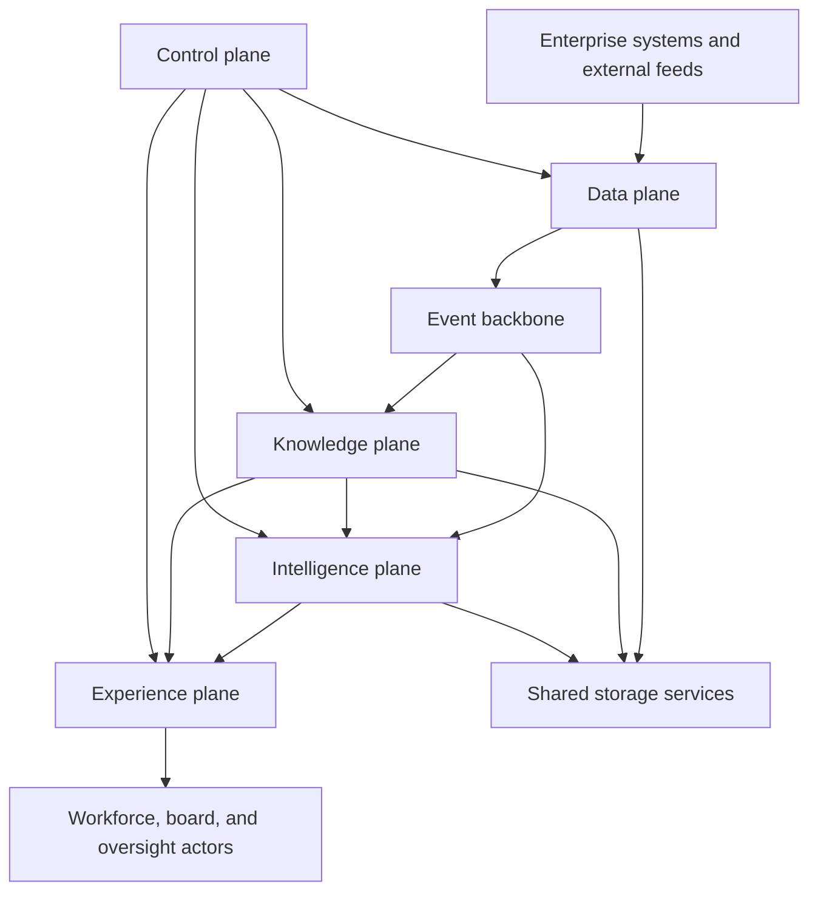
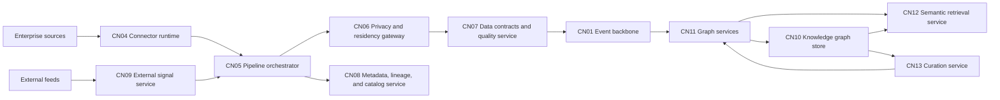
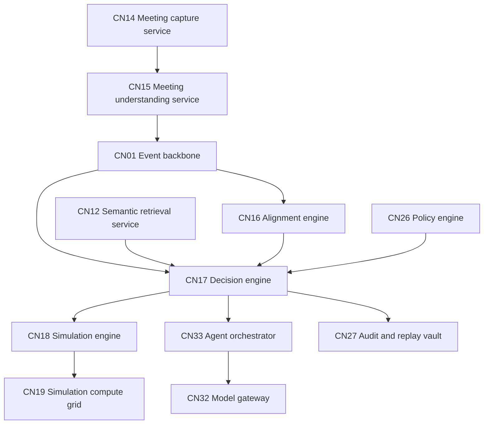
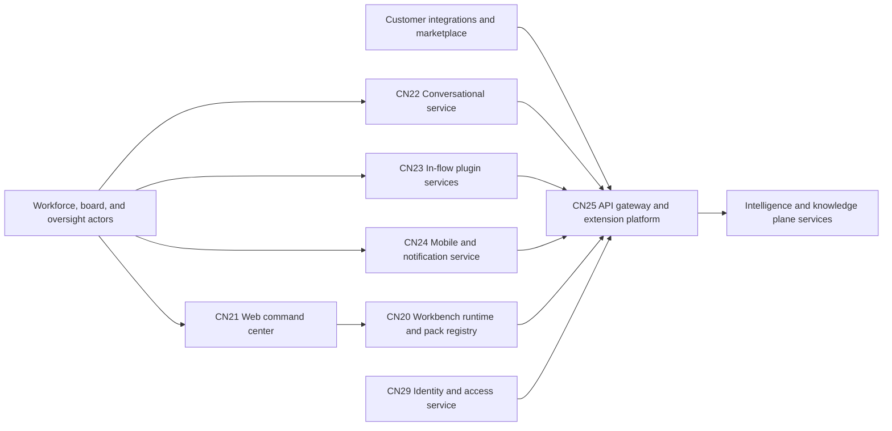
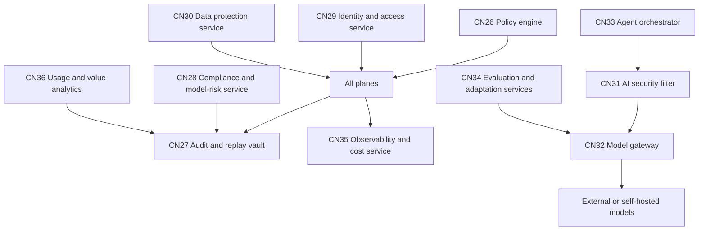
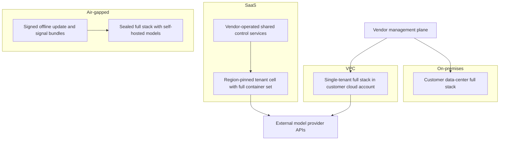

# TrueNorth architecture — C4 level 2 containers

## 1. Front matter

| Field | Value |
|---|---|
| Doc ID | ARCH-L2 |
| C4 level | 2 Containers |
| Owning unit | U1 Architecture C4 L1+L2 |
| Version | 1.0 |

## 2. Scope & imported assumptions

This document is the C4 level 2 view of TrueNorth: the deployable containers inside the system boundary established at level 1, the responsibilities each carries, the pillar capabilities each realizes, and how the set is arranged across the four deployment models. Containers are organized into five planes — data, knowledge, intelligence, experience, and control — over a shared foundation. This level stops at container granularity: internal components belong to the C4 level 3 unit, and all schemas, API shapes, and message formats belong to the C4 level 4 unit. Container identifiers use the `CN-` architecture namespace; this document mints no L3 or lower feature IDs and cites platform capabilities exclusively by their canonical L2 IDs.

The design imports the canonical assumptions block from the shared specification verbatim and unchanged:

- **Verdict scale:** Endorse / Endorse-with-conditions / Caution / Oppose
- **Stakes tiers:** S1 (existential/board-level) → S2 (executive) → S3 (departmental) → S4 (team/routine); human-in-the-loop gates scale with stakes
- **Invariant:** humans always retain decision authority; TrueNorth advises, records, and learns from outcomes
- **Deployment:** SaaS / VPC / on-prem / air-gapped; multi-tenant with hard isolation options; data residency honored
- **Red lines:** no covert monitoring, no individual surveillance scoring, no autonomous people decisions

Two structural consequences follow. First, every container below must run in all four deployment models, so no container may hard-depend on a vendor-proprietary managed service; technology classes are stated vendor-neutrally and bind at packaging time. Second, the control plane is not optional middleware: policy, audit, identity, and model-governance containers sit on the request path of every verdict-affecting action, because the assumptions make governance a functional requirement.

## 3. Diagrams

### 3.1 Plane overview

**Data plane.** Acquires, filters, scores, and routes every inbound signal; nothing reaches storage without passing through it. **Knowledge plane.** Turns signals into the living organizational graph and serves permission-aware retrieval over it. **Intelligence plane.** The judgment machinery: meeting understanding, alignment, decision evaluation, and simulation. **Experience plane.** Delivers role-aware surfaces and workbenches and hosts the extension APIs. **Control plane.** Governance spine, identity and security services, the model gateway and MLOps services, and analytics — cross-cutting by construction. **Event backbone.** The asynchronous spine all planes publish to and consume from. **Shared storage services.** Object, relational, and index storage underpinning the planes.

### 3.2 Data and knowledge planes

**CN04 Connector runtime.** Hosts the versioned connector library (DF-1) as isolated workers per source system; owns credentials, rate limits, and incremental state for each connection.

**CN05 Pipeline orchestrator.** Executes batch, CDC, and streaming pipelines with schema mapping and document parsing (DF-2); normalizes every source into typed change events.

**CN06 Privacy and residency gateway.** The mandatory pre-persistence checkpoint applying PII redaction, minimization, consent zones, and purpose tags (DF-4), and pinning each record to its lawful storage region (DF-6). Architecturally, it is the only path between raw acquisition and durable storage.

**CN07 Data contracts and quality service.** Enforces contract SLAs, quarantines anomalies, and stamps quality scores onto events (DF-3) so downstream judges can weight evidence by reliability.

**CN08 Metadata, lineage, and catalog service.** Records source-field-to-citation lineage for every transformation (DF-5); the container the audit vault and explainability services interrogate when a recommendation must show its sources.

**CN09 External signal service.** Terminates third-party feeds, applies source-reliability scoring (DF-7), and — in air-gapped profiles — validates signed offline bundles in place of live feeds.

**CN01 Event backbone.** A partitioned, replayable distributed log carrying all inter-plane events; provides ordering, backpressure isolation, and the replay substrate audit reconstruction depends on.

**CN11 Graph services.** Stateless services performing graph construction, entity resolution (KG-2), and org-model maintenance (KG-6); the sole writer to the graph store, so every mutation is validated, attributed, and emitted as an event.

**CN10 Knowledge graph store.** The bitemporal property graph holding the canonical ontology (KG-1) with as-of versioning, decision genealogy, and departure-resilient retention (KG-3).

**CN12 Semantic retrieval service.** GraphRAG retrieval combining graph traversal with vector and keyword indexes, trimming every result to the caller's entitlements before return (KG-4, PL-2). All AI-facing reads of organizational knowledge flow through it.

**CN13 Curation service.** Runs SME validation queues and contested-fact resolution (KG-5), feeding human verdicts back to graph services as authoritative corrections.

### 3.3 Intelligence plane

**CN14 Meeting capture service.** Calendar-aware capture, diarized multilingual transcription (MI-1), and consent enforcement including off-the-record zones and retention rules (MI-6). Consent checks execute here, before any audio or text persists.

**CN15 Meeting understanding service.** Extracts decisions, commitments, owners, deadlines, and dissent (MI-2), produces summaries and follow-through tracking (MI-3), pre-meeting briefs (MI-4), and cross-meeting threading (MI-5). Its outputs are events: candidate decisions and commitments that flow to the graph and the decision engine.

**CN16 Alignment engine.** Maintains the strategy and OKR graph (GA-1), detects conflicts, overlaps, and orphans (GA-2), tracks progress and health from bound metrics (GA-3), computes alignment scores for decisions and projects (GA-4), monitors drift (GA-5), and manages the initiative portfolio (GA-6).

**CN17 Decision engine.** The judgment core realizing DI-1 through DI-8: structures decision records, assembles cited evidence and precedent through CN12, orchestrates multi-lens evaluation and the devil's advocate via the agent orchestrator, synthesizes verdicts with confidence and minority reports, runs stakes-tiered review workflows, and closes the loop on outcomes. It is the only container that issues verdicts.

**CN18 Simulation engine.** Hosts the forecasting library (SF-1), scenario and what-if modeling (SF-2), the org digital twin (SF-4), and backtesting (SF-6); plans simulation work and interprets results for the decision engine.

**CN19 Simulation compute grid.** Elastic batch workers executing Monte Carlo runs, sensitivity sweeps, and war-gaming workloads (SF-3, SF-5) in isolation, so long-running compute never contends with interactive evaluation.

**CN33 Agent orchestrator / CN32 Model gateway / CN26 Policy engine / CN27 Audit and replay vault.** Control-plane containers shown here because they sit on the verdict path; they are described in section 3.5.

### 3.4 Experience plane

**CN20 Workbench runtime and pack registry.** The WB-0 framework: a runtime executing declarative department packs — ontology extensions, KPI packs, lens packs — and the registry that versions and distributes them. Department workbenches are content on this runtime, not separate applications.

**CN21 Web command center.** The role-aware web application for exec, lead, and IC views (SX-1); renders workbenches via the runtime and the decision lifecycle via the decision engine.

**CN22 Conversational service.** The org-aware assistant (SX-2), grounding dialogue through the semantic retrieval service and acting strictly within the caller's entitlements.

**CN23 In-flow plugin services.** Slack, Teams, Outlook, and calendar integrations (SX-3) delivering briefs, nudges, and verdict notifications inside existing tools and accepting lightweight responses back.

**CN24 Mobile and notification service.** Deskless and factory-floor surfaces, digests, and interruption budgets (SX-4); owns notification policy so that every other container requests, never sends, user-facing notifications.

**CN25 API gateway and extension platform.** The single ingress for every surface and external integration (SX-5): authentication enforcement, rate limiting, API versioning, webhooks, and marketplace extension mediation. Accessibility and internationalization (SX-6) are cross-cutting obligations on all experience containers rather than a container of their own.

### 3.5 Control plane

**CN26 Policy engine.** Encodes the decision-rights matrix (GV-1) and stakes-based HITL gates (GV-2) as a synchronous policy decision point; verdict-affecting actions in any plane call it before proceeding.

**CN27 Audit and replay vault.** Hash-chained, append-only storage of every evaluation input, model version, intermediate artifact, and sign-off (GV-3), plus the explainability artifacts surfaced to users and oversight (GV-4). Physically separated from operational stores so no runtime credential can rewrite history.

**CN28 Compliance and model-risk service.** Manages regulatory compliance packs (GV-5), ethics-board tooling and red-line registries (GV-6), and the model risk inventory (GV-7); generates certification evidence (SC-6) from vault and observability data.

**CN29 Identity and access service.** Federates SSO and SCIM with the enterprise IdP and evaluates RBAC plus ABAC, including decision-rights-aware authorization (SC-1). Issues the entitlement context every other container trims by.

**CN30 Data protection service.** Brokers encryption and customer-held keys, applies DLP and classification-aware controls (SC-2), and hosts insider-risk and abuse monitoring (SC-5) within red-line constraints.

**CN31 AI security filter.** Inline screening on the model path for prompt injection, retrieval poisoning, and output exfiltration (SC-3); inspects both retrieval payloads entering prompts and model outputs leaving them.

**CN32 Model gateway.** The single chokepoint for all inference: multi-LLM routing by stakes, cost, and policy (PL-1), provider abstraction, and per-deployment substitution of self-hosted models. No container calls a model except through it.

**CN33 Agent orchestrator.** Runs multi-step agentic workflows (PL-3) — evaluation lenses, devil's advocate, evidence assembly agents — under budgets, tool allowlists, and full trace capture.

**CN34 Evaluation and adaptation services.** The evaluation harness with golden decision sets, judge calibration, and regression evals (PL-4), plus fine-tuning and domain adaptation pipelines (PL-5) that gate any model or prompt promotion through the gateway.

**CN35 Observability and cost service.** Platform telemetry, tracing, and cost management (PL-6) across all containers, feeding both operators and the compliance service.

**CN36 Usage and value analytics.** Usage and health analytics (AD-3) and decision-ROI value realization (AD-4), computed over aggregated, red-line-compliant data; also serves adoption tooling needs (AD-1, AD-2, AD-5) with in-product instrumentation.

### 3.6 Deployment topology variants

**SaaS.** Cell-based multi-tenancy: each cell is a region-pinned, complete instance of the container set serving a bounded set of tenants, with hard-isolation cells (one tenant per cell) as the SC-4 premium option. Only deployment automation, billing, and anonymized fleet telemetry live in vendor-shared control services; customer data never does.

**VPC.** The identical container set deployed single-tenant into the customer's cloud account. The vendor management plane reaches in through a constrained channel for lifecycle operations; model egress follows customer cloud policy.

**On-premises.** The same set packaged for customer-operated container platforms; the simulation compute grid (CN19) sizes to fixed capacity instead of elastic scale, and the model gateway (CN32) routes to self-hosted models by default with policy-gated external use.

**Air-gapped.** TB2 is severed: CN32 serves only self-hosted models, CN09 consumes signed signal bundles, and releases, model weights, and compliance-pack updates (GV-5) arrive through the same offline bundle process. Everything else is unchanged — deployment symmetry is the design goal, not an aspiration.

## 4. Element catalog

| ID | Name | Responsibility | Pillar mapping | Technology class |
|---|---|---|---|---|
| CN-01 | Event backbone | Partitioned, replayable event transport between planes | DF-2, PL-7 | Distributed log / stream platform |
| CN-02 | Object store | Documents, transcripts, model artifacts, simulation outputs | DF-2, MI-1 | Object storage |
| CN-03 | Operational data stores | Transactional state per service; decision records of record | DI-1, PL-7 | Relational database |
| CN-04 | Connector runtime | Versioned source connectors, credentials, incremental state | DF-1 | Integration runtime |
| CN-05 | Pipeline orchestrator | Batch/CDC/stream pipelines, schema mapping, parsing | DF-2 | Stream processor + workflow engine |
| CN-06 | Privacy and residency gateway | Pre-persistence redaction, minimization, purpose tags, region routing | DF-4, DF-6 | Policy-enforcing data gateway |
| CN-07 | Data contracts and quality service | Contract SLAs, anomaly quarantine, quality scoring | DF-3 | Data quality service |
| CN-08 | Metadata, lineage, and catalog service | Field-to-citation lineage, catalog, classifications | DF-5 | Metadata catalog |
| CN-09 | External signal service | Feed termination, reliability scoring, offline bundle validation | DF-7 | Feed ingestion service |
| CN-10 | Knowledge graph store | Bitemporal organizational graph, decision genealogy | KG-1, KG-3 | Graph database |
| CN-11 | Graph services | Construction, entity resolution, org model; sole graph writer | KG-2, KG-6 | Stateless service tier |
| CN-12 | Semantic retrieval service | Permission-aware GraphRAG over graph plus indexes | KG-4, PL-2 | Retrieval service + vector index |
| CN-13 | Curation service | SME validation queues, contested-fact resolution | KG-5 | Workflow service |
| CN-14 | Meeting capture service | Calendar-aware capture, transcription, consent enforcement | MI-1, MI-6 | Media capture + ASR service |
| CN-15 | Meeting understanding service | Decision/commitment extraction, summaries, briefs, threading | MI-2, MI-3, MI-4, MI-5 | NLP service tier |
| CN-16 | Alignment engine | Strategy graph, conflict detection, health, alignment scoring, portfolio | GA-1, GA-2, GA-3, GA-4, GA-5, GA-6 | Analytical service tier |
| CN-17 | Decision engine | Decision records, evidence assembly, lens orchestration, verdict synthesis, review workflows, outcome loop | DI-1, DI-2, DI-3, DI-4, DI-5, DI-6, DI-7, DI-8 | Orchestrating service tier |
| CN-18 | Simulation engine | Forecast library, scenarios, digital twin, backtesting | SF-1, SF-2, SF-4, SF-6 | Modeling service tier |
| CN-19 | Simulation compute grid | Monte Carlo, sensitivity, war-gaming batch execution | SF-3, SF-5 | Elastic batch compute |
| CN-20 | Workbench runtime and pack registry | Executes and distributes department packs | WB-0 | Application runtime + registry |
| CN-21 | Web command center | Role-aware exec/lead/IC web application | SX-1 | Web application |
| CN-22 | Conversational service | Org-aware assistant over governed retrieval | SX-2 | Conversational AI service |
| CN-23 | In-flow plugin services | Slack/Teams/Outlook/calendar delivery and capture | SX-3 | Integration micro-apps |
| CN-24 | Mobile and notification service | Deskless surfaces, digests, interruption budgets | SX-4 | Mobile backend + notification hub |
| CN-25 | API gateway and extension platform | Single ingress, APIs, webhooks, marketplace mediation | SX-5, SX-6 | API gateway |
| CN-26 | Policy engine | Decision-rights matrix and stakes-tiered HITL gates as a PDP | GV-1, GV-2 | Policy decision point |
| CN-27 | Audit and replay vault | Hash-chained append-only evidence and explainability artifacts | GV-3, GV-4 | Immutable log store |
| CN-28 | Compliance and model-risk service | Compliance packs, red-line registry, model risk inventory, certification evidence | GV-5, GV-6, GV-7, SC-6 | GRC service |
| CN-29 | Identity and access service | SSO/SCIM federation, RBAC+ABAC, decision-rights-aware authz | SC-1 | Identity and authorization service |
| CN-30 | Data protection service | Key brokerage, DLP, classification controls, insider-risk monitoring | SC-2, SC-5 | Data security service |
| CN-31 | AI security filter | Prompt injection, poisoning, and exfiltration screening | SC-3 | Inline inspection service |
| CN-32 | Model gateway | Stakes/cost model routing, provider abstraction, sole inference path | PL-1 | LLM gateway |
| CN-33 | Agent orchestrator | Budgeted, traced multi-agent workflows for lenses and evidence | PL-3 | Agent orchestration framework |
| CN-34 | Evaluation and adaptation services | Golden-set evals, judge calibration, fine-tuning pipelines | PL-4, PL-5 | ML evaluation + training pipeline |
| CN-35 | Observability and cost service | Telemetry, tracing, cost management across containers | PL-6 | Observability platform |
| CN-36 | Usage and value analytics | Usage health, decision-ROI attribution, adoption instrumentation | AD-3, AD-4 | Analytics service |

Tenant and deployment isolation (SC-4) and scale/reliability (PL-7) are realized by the topology in section 3.6 and the foundation containers rather than by a dedicated container.

## 5. Interfaces & contracts

Interfaces are named with purpose only; the C4 level 4 unit owns all schemas and API shapes.

- **Ingestion event interface** (CN-05/CN-07 → CN-01). Normalized, quality-scored change events; the contract every downstream consumer reads.
- **Privacy clearance interface** (CN-06). The mandatory pre-persistence checkpoint; acquisition containers submit, and only cleared, region-routed records continue.
- **Lineage recording interface** (CN-08). Transformation and citation lineage registration from any pipeline or engine.
- **Graph mutation interface** (CN-11). Validated, attributed writes to the knowledge graph; the only write path to CN-10.
- **Graph query interface** (CN-11/CN-10). As-of temporal traversal and org-model queries for engines and surfaces.
- **Retrieval interface** (CN-12). Entitlement-trimmed evidence retrieval for the decision engine, conversational service, and meeting understanding.
- **Curation queue interface** (CN-13). Validation tasks to stewards; authoritative corrections back to graph services.
- **Capture consent interface** (CN-14). Consent and retention verification before any meeting capture proceeds.
- **Decision lifecycle interface** (CN-17). Create, structure, evaluate, review, sign off, and close decision records; consumed by every surface.
- **Lens evaluation interface** (CN-17 → CN-33). Requests judge, devil's-advocate, and bias-check workflows; returns assessments with traces.
- **Simulation request interface** (CN-18, CN-19). Scenario and forecast jobs with budgets; results with uncertainty bounds.
- **Alignment scoring interface** (CN-16). Decision-against-strategy scoring and conflict context for the decision engine and workbenches.
- **Policy decision interface** (CN-26). Allow/deny/gate rulings with required-approver context; synchronous on verdict-affecting actions.
- **Audit append interface** (CN-27). Hash-chained evidence writes from all containers; read access only via oversight-scoped queries.
- **Authorization interface** (CN-29). Entitlement context issuance and authorization checks for every request.
- **Model invocation interface** (CN-32). All inference calls, with stakes/cost routing metadata; screened by CN-31 inline.
- **Pack distribution interface** (CN-20). Versioned workbench pack publication, validation, and installation.
- **Extension API interface** (CN-25). Public APIs and webhooks for customer integrations and the marketplace.
- **Telemetry interface** (CN-35). Metrics, traces, and cost events from all containers.

## 6. Quality attributes

**Deployment symmetry and portability.** Every container ships as the same artifact set across SaaS, VPC, on-prem, and air-gapped profiles. Technology classes were chosen to have credible self-managed implementations — a distributed log, a graph database, an object store, a batch grid — so no plane silently requires a hyperscaler-managed service. Profile differences are confined to three seams: model routing in CN-32, signal intake mode in CN-09, and elasticity of CN-19.

**Residency and isolation.** Residency is enforced once, at CN-06, before persistence; storage containers are region-pinned per cell so downstream engines cannot relocate data. Tenant isolation (SC-4) is cell-based: the unit of isolation is an entire container set, not row-level filtering, which makes the hard-isolation option a deployment decision rather than a code path.

**Auditability and reproducibility.** The event backbone's replayable log plus the vault's hash-chained captures of inputs, retrieval results, prompts, model versions, and sign-offs make any past verdict reconstructable (GV-3). The architecture's single chokepoints — one graph writer, one retrieval path, one model gateway, one audit sink — exist precisely so reproducibility has a bounded surface to capture.

**Stakes-tiered human control.** CN-26 is synchronous on the decision lifecycle: an S1 evaluation cannot reach a verdict surface without the gates the policy engine demands, and gate outcomes are themselves vault evidence. No container holds actuation credentials against customer systems, preserving the level 1 advisory posture.

**Scale and performance.** Targets at Fortune-500 magnitude: continuous CDC from dozens of sources, thousands of captured meetings per day, and graph scale in the hundreds of millions of nodes and edges. The backbone isolates ingestion bursts from interactive work; retrieval serves from read-optimized indexes; simulation runs on the isolated grid; and lens evaluation is asynchronous with progress surfaced, since multi-lens S1/S2 evaluations are minutes-long by nature while retrieval and surface interactions must remain interactive.

**Availability and recovery.** Stateless service tiers scale horizontally; stateful containers (CN-01, CN-02, CN-03, CN-10, CN-27) define the recovery story with replication and multi-region options (PL-7). The vault carries the strictest durability objective in the system: audit evidence outlives everything else.

**Security posture.** All inter-container traffic is mutually authenticated and encrypted; entitlement context from CN-29 propagates end to end so retrieval trimming happens at the data, not at the UI. The AI-specific attack surface is concentrated where it can be inspected: CN-31 sits inline on the only model path.

## 7. Architecture decisions

| # | Decision | Alternatives | Rationale |
|---|---|---|---|
| 1 | Event backbone as the integration spine; planes communicate through replayable events plus explicit service interfaces | Point-to-point REST mesh; enterprise service bus; shared database integration | Replayability is an audit requirement, not just a scaling tactic; backpressure isolation protects interactive surfaces from ingestion bursts; point-to-point coupling at 36 containers is unmanageable |
| 2 | Bitemporal property graph store with a separate vector/keyword index, fronted by one retrieval service | RDF triple store; relational star schema; vector-only RAG | As-of queries and decision genealogy (KG-3) demand bitemporality; property graphs fit the ontology and operator skills better than RDF; vector-only retrieval cannot answer structural questions like reporting lines or goal cascades |
| 3 | Single permission-aware retrieval service (CN-12) for all AI-facing reads | Per-engine retrieval stacks; direct graph access from engines | One enforcement point for entitlement trimming and one capture point for citation lineage; divergent retrieval stacks would drift in both security and answer quality |
| 4 | All inference through one model gateway with the AI security filter inline | Per-service provider SDKs; sidecar filters per container | Stakes/cost routing (PL-1), provider substitution per deployment, and SC-3 screening each need a chokepoint; three separate chokepoints would be worse than one shared |
| 5 | Evaluation lenses and devil's advocate run as orchestrated agents (CN-33) invoked by the decision engine | Hard-coded evaluation pipeline inside CN-17; one monolithic prompt per verdict | Lenses evolve per department via workbench lens packs; orchestration gives budgets, traces, and independent judge calibration (PL-4); a monolithic prompt is unauditable and uncalibratable |
| 6 | Policy engine as a synchronous decision point on verdict-affecting actions; authorization kept separate in CN-29 | Library-embedded policy checks; merging policy and authz into one container | Decision-rights policy (GV-1) changes on governance cadence and needs centralized audit of rulings; authorization (SC-1) is request-rate identity infrastructure — different change cadence, different load profile |
| 7 | Audit vault as a physically separate, hash-chained append-only store | Conventional centralized logging; audit tables in operational databases | Operator-proof immutability is a regulatory expectation (GV-3); operational stores share credentials with the runtime and cannot prove non-tampering |
| 8 | Workbenches as declarative packs on one runtime (CN-20) | Separate application per department; forks of the web app | Nine-plus departments times four deployment models makes per-department apps combinatorially unaffordable; packs keep governance, identity, and audit uniform while departments customize ontology, KPIs, and lenses |
| 9 | Simulation split into engine and elastic compute grid | One simulation monolith; running Monte Carlo inside the decision engine | Batch compute has opposite scaling and isolation needs from interactive modeling; the split also lets the grid go fixed-capacity in on-prem and air-gapped profiles without redesign |
| 10 | Cell-based multi-tenancy with full-stack cells; hard isolation equals dedicated cell | Pooled multi-tenant services with row-level isolation; namespace-per-tenant in shared clusters | Cells make the SaaS/VPC/on-prem spectrum one packaging continuum, bound blast radius, and turn the SC-4 hard-isolation commitment into topology rather than trust in query filters |
| 11 | Notification authority centralized in CN-24 | Each container notifies users directly | Interruption budgets (SX-4) are only enforceable with a single send path; scattered senders guarantee notification fatigue and untraceable nudges |

## 8. Risks & open questions

- **Bitemporal graph at scale.** Few off-the-shelf graph engines offer mature bitemporality at hundreds of millions of elements; CN-10 may require a versioning layer above a conventional property graph, which the C4 level 3 design must resolve.
- **Permission-aware retrieval latency.** Entitlement trimming inside CN-12 adds per-result authorization work on the hot path; meeting interactive latency at enterprise corpus scale is a primary performance risk.
- **Air-gapped footprint.** The full container set including self-hosted models implies a substantial minimum hardware and GPU footprint. Candidate global assumption — a defined minimum infrastructure profile for air-gapped deployments — is recorded here, not asserted.
- **Operational burden in customer-operated profiles.** A distributed log, graph store, and batch grid are nontrivial to operate; on-prem viability depends on packaging that holds the customer's operational skill requirement near commodity container-platform level.
- **Cost of multi-lens evaluation.** Running seven lenses plus a devil's advocate per decision is expensive at S3/S4 volume; stakes-based routing in CN-32 mitigates but the cost envelope per verdict tier needs validation against the evaluation harness (PL-4).
- **Policy/authorization seam.** The boundary between decision-rights policy rulings (CN-26) and decision-rights-aware authorization (CN-29) must be drawn precisely at level 3 to avoid double evaluation or, worse, gaps.
- **Pack sandboxing.** Workbench packs execute customer- and vendor-authored logic on a shared runtime; the isolation model for pack code is a security design item for lower levels (WB-0, SC-3).
- **Analytics red-line compliance.** Usage analytics (AD-3) must aggregate without enabling individual surveillance scoring; the aggregation floor and access rules need explicit definition with governance review (GV-6).
- **Event backbone as single point of coupling.** The spine concentrates failure and upgrade risk; multi-cluster and replay-window strategies belong to the level 3 reliability design (PL-7).

## 9. Dependencies & references

| Reference | Type | Why |
|---|---|---|
| DF-1, DF-2, DF-3, DF-4, DF-5, DF-6, DF-7 | Canonical L2 | Capabilities realized by data plane containers CN-04 through CN-09 |
| KG-1, KG-2, KG-3, KG-4, KG-5, KG-6 | Canonical L2 | Capabilities realized by knowledge plane containers CN-10 through CN-13 |
| MI-1, MI-2, MI-3, MI-4, MI-5, MI-6 | Canonical L2 | Capabilities realized by CN-14 and CN-15 |
| GA-1, GA-2, GA-3, GA-4, GA-5, GA-6 | Canonical L2 | Capabilities realized by CN-16 |
| DI-1, DI-2, DI-3, DI-4, DI-5, DI-6, DI-7, DI-8 | Canonical L2 | Capabilities realized by CN-17 |
| SF-1, SF-2, SF-3, SF-4, SF-5, SF-6 | Canonical L2 | Capabilities realized by CN-18 and CN-19 |
| WB-0 | Canonical WB | Framework realized by CN-20 |
| SX-1, SX-2, SX-3, SX-4, SX-5, SX-6 | Canonical L2 | Capabilities realized by experience plane containers CN-21 through CN-25 |
| GV-1, GV-2, GV-3, GV-4, GV-5, GV-6, GV-7 | Canonical L2 | Capabilities realized by CN-26 through CN-28 |
| SC-1, SC-2, SC-3, SC-4, SC-5, SC-6 | Canonical L2 | Capabilities realized by CN-29 through CN-31 and the cell topology |
| PL-1, PL-2, PL-3, PL-4, PL-5, PL-6, PL-7 | Canonical L2 | Capabilities realized by CN-32 through CN-35 and foundation containers |
| AD-1, AD-2, AD-3, AD-4, AD-5 | Canonical L2 | Capabilities realized or instrumented by CN-36 |
| U2 Architecture C4 L3 | Work unit | Decomposes these containers into components |
| U3 Architecture C4 L4 | Work unit | Owns schemas and API shapes for every interface named here |
| U4 Catalog DF+KG | Work unit | Specifies data and knowledge plane capabilities |
| U5 Catalog MI+GA | Work unit | Specifies meeting and alignment capabilities |
| U6 Catalog DI+SF | Work unit | Specifies decision and simulation capabilities |
| U7 Catalog SX+WB-0 | Work unit | Specifies surface and workbench framework capabilities |
| U8 Catalog GV | Work unit | Specifies governance spine capabilities |
| U9 Catalog SC | Work unit | Specifies identity and security capabilities |
| U10 Catalog PL+AD | Work unit | Specifies model gateway, MLOps, and analytics capabilities |
| U13 Perspective AI/ML Engineering | Work unit | Deep requirements on CN-32 through CN-34 |
| U26 Roadmap & Delivery | Work unit | Sequencing of deployment topology variants |
