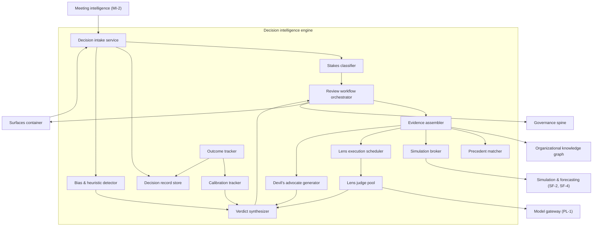
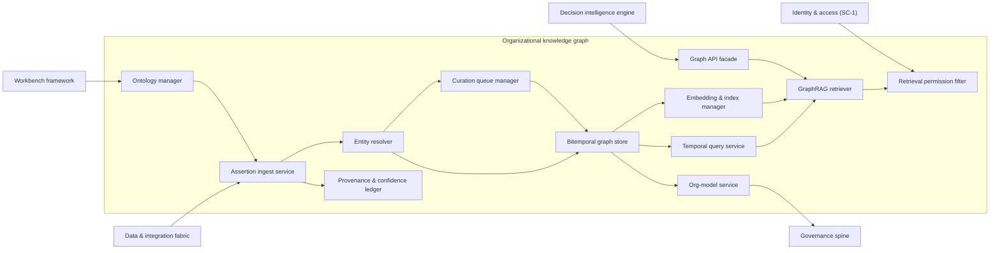
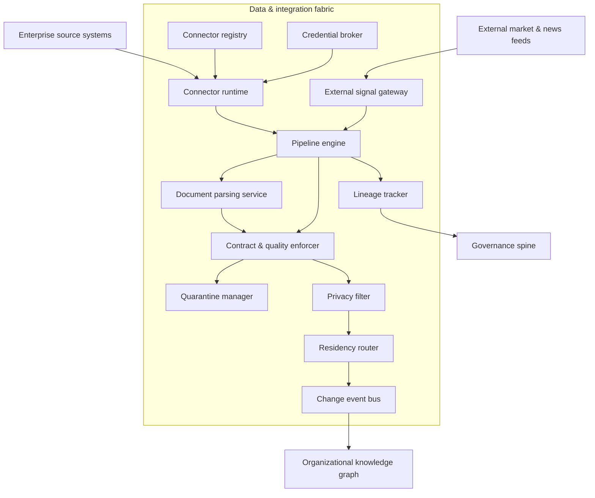
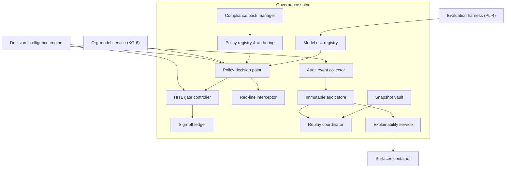
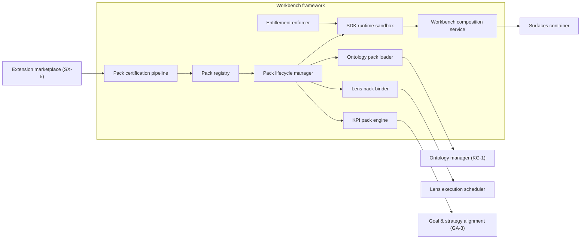
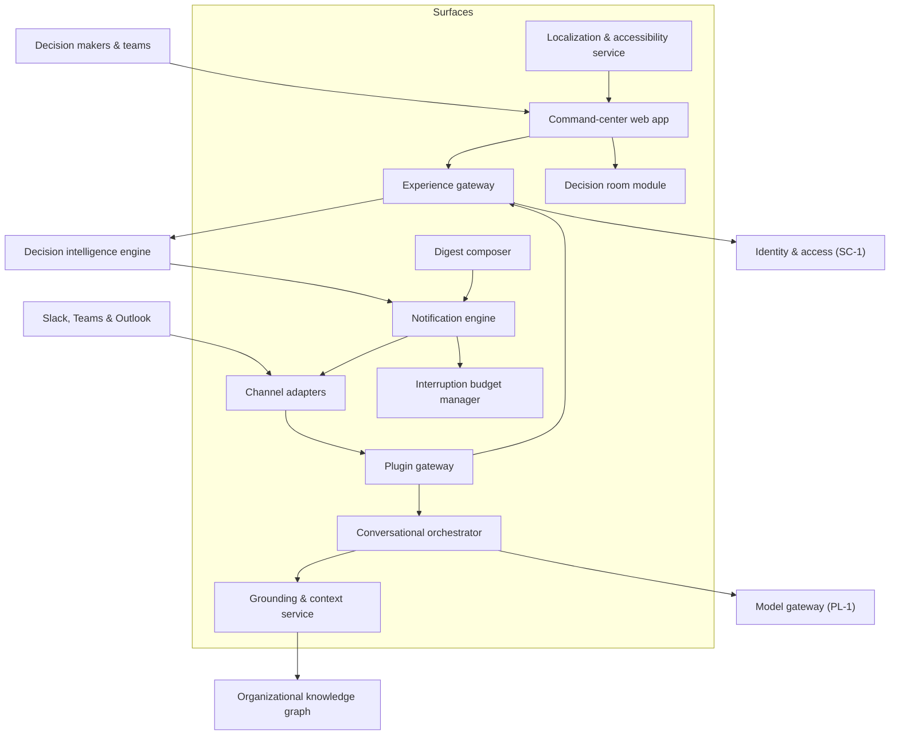

# TrueNorth architecture — C4 level 3 (components)

## 1. Front matter

| Field | Value |
|---|---|
| Doc ID | ARCH-L3 |
| C4 level | 3 Components |
| Owning unit | U2 Architecture C4 L3 |
| Version | 1.0 |

## 2. Scope & imported assumptions

This document decomposes six core containers of the TrueNorth platform into components: (1) the Decision Intelligence Engine, (2) the Organizational Knowledge Graph, (3) the Data & Integration Fabric, (4) the Governance spine, (5) the Workbench framework, and (6) Surfaces. A component here is a deployable-grouping of cohesive responsibilities behind a named interface — larger than a class, smaller than a container. The document stops at component boundaries and named interfaces: it does not define schemas, API shapes, message formats, or persistence models (those belong to the C4 level 4 unit), and it does not specify feature behavior beyond what the architecture requires (feature behavior belongs to the catalog units). Containers not decomposed here — among them Simulation & Forecasting, Meeting & Communication Intelligence, Goal & Strategy Alignment, and the Platform/MLOps substrate — appear only as external elements referenced by their canonical pillar or L2 IDs.

This document mints no feature IDs. Architecture element identifiers use a dotted container namespace (for example `DIE.03`) that is deliberately distinct from the canonical feature ID grammar; every capability mapping in the element catalog cites canonical L2 IDs only.

The design imports the following canonical assumptions verbatim from the shared specification:

- **Verdict scale:** Endorse / Endorse-with-conditions / Caution / Oppose
- **Stakes tiers:** S1 (existential/board-level) → S2 (executive) → S3 (departmental) → S4 (team/routine); human-in-the-loop gates scale with stakes
- **Invariant:** humans always retain decision authority; TrueNorth advises, records, and learns from outcomes
- **Deployment:** SaaS / VPC / on-prem / air-gapped; multi-tenant with hard isolation options; data residency honored
- **Red lines:** no covert monitoring, no individual surveillance scoring, no autonomous people decisions

## 3. Diagrams

Each diagram shows one container's components (inside the subgraph) and its immediate external collaborators (outside). Arrows denote the dominant direction of invocation or data flow; full interaction contracts are named in section 5.

### 3.1 Decision intelligence engine

The judgment core. TrueNorth shall treat every recommendation as a pipeline over an immutable, versioned decision record: intake, stakes classification, evidence assembly, parallel multi-lens evaluation, adversarial challenge, deterministic verdict synthesis, and stakes-tiered human review.

**Decision intake service (DIE.01).** Accepts decision proposals from meeting extraction (MI-2), surfaces, and the API platform; normalizes them into structured decision records (context, options, criteria, assumptions) and validates completeness before evaluation begins. Incomplete proposals are returned with a required-information checklist rather than evaluated on thin evidence.

**Stakes classifier (DIE.02).** Assigns the S1–S4 stakes tier from decision attributes (financial magnitude, reversibility, blast radius, policy flags) plus decision-rights context obtained from the org-model. Its output is advisory until confirmed or overridden by a human reviewer; the assigned tier drives every downstream gate, model-routing, and review choice.

**Evidence assembler (DIE.03).** Orchestrates retrieval of citation-backed evidence: it queries the knowledge graph's GraphRAG retriever, requests precedents, brokers simulations, and compiles a versioned evidence bundle in which every item carries provenance and a retrieval snapshot reference so the bundle can be reproduced during replay.

**Precedent matcher (DIE.04).** Finds structurally similar past decisions and their realized outcomes using graph-pattern and embedding similarity over the decision genealogy, ranking precedents by similarity, recency, and outcome-data quality.

**Lens execution scheduler (DIE.05).** Resolves which lenses apply to a given decision (core seven plus any department lenses registered by the Workbench framework), fans them out in parallel with the shared evidence bundle, and enforces per-lens timeouts and budget limits supplied by the stakes tier.

**Lens judge pool (DIE.06).** The runtime that executes individual lens judges — financial, strategic, risk, legal, people, customer, ESG, and pack-contributed lenses. Each judge produces a structured assessment (position, severity, cited evidence, confidence) via the model gateway; judges never call models directly and never see one another's outputs.

**Verdict synthesizer (DIE.07).** Aggregates structured lens assessments into one of the four canonical verdicts with conditions and confidence. Aggregation is rule- and weight-based and fully deterministic given its inputs; a language model drafts the reasoning narrative afterward, but the verdict itself is computed, not generated (ADR-6).

**Devil's advocate generator (DIE.08).** Constructs the strongest argument against the emerging recommendation. It runs in an isolated context seeded only with the evidence bundle — never the draft verdict — to avoid anchoring, and its minority report is attached to every issued recommendation without exception.

**Bias & heuristic detector (DIE.09).** Screens deliberation signals (meeting dissent patterns, option-set shape, sunk-cost markers, anchoring indicators) and raises named bias flags that the synthesizer must address in conditions or reasoning. Flags operate at decision level only, never as judgments of individuals, per the red lines.

**Calibration tracker (DIE.10).** Maintains the engine's confidence-versus-outcome record, computes calibration adjustments fed back as priors to the synthesizer, and produces the what-would-change-my-mind sensitivity list by perturbing the highest-weight evidence items.

**Review workflow orchestrator (DIE.11).** Drives the stakes-tiered human review state machine: routes recommendations to the right approvers via Governance gate checks, manages sign-off sequences, handles the expedited crisis path, and guarantees that no decision record reaches "decided" status without a human action recorded.

**Outcome tracker (DIE.12).** Watches realized outcomes after a decision is enacted — bound metrics, follow-through signals, and explicit reviewer judgments — and writes outcome annotations to the decision record and the calibration tracker, closing the learning loop.

**Simulation broker (DIE.13).** The single egress point from the engine to Simulation & Forecasting: it translates evidence-assembly needs into scenario and digital-twin requests, caches results within an evaluation, and tags simulation outputs with model-version provenance.

**Decision record store (DIE.14).** Owns the working and historical state of decision records as append-only versions. It is the engine's system of record; the knowledge graph holds a projected, linked view for retrieval, and the audit store holds the immutable event trail.

External elements: Meeting intelligence (MI-2) supplies extracted decisions; Surfaces submit proposals and render recommendations; the knowledge graph serves evidence and precedents; Simulation & Forecasting (SF-2, SF-4) serves scenario results; the Governance spine adjudicates gates; the model gateway (PL-1) serves all model inference.

### 3.2 Organizational knowledge graph

The institutional memory. TrueNorth shall maintain a bitemporal graph in which every assertion carries provenance, confidence, and both valid-time and transaction-time, so any past recommendation can be re-grounded "as of" the knowledge the organization had then.

**Ontology manager (OKG.01).** Governs the core ontology (Person, Team, Goal, Decision, Meeting, Project, Metric, Risk, Asset, Customer, Supplier, Policy, Contract) and versioned tenant extensions, including department ontology packs applied through the Workbench framework. Schema changes are migrations with compatibility checks, never in-place mutations.

**Assertion ingest service (OKG.02).** Consumes change events from the fabric and converts them into candidate graph assertions typed against the active ontology version, stamping each with source, extraction method, and initial confidence before resolution.

**Entity resolver (OKG.03).** Deduplicates and links entity mentions across sources using deterministic keys first, probabilistic matching second. Merges above a confidence threshold are automatic and reversible; ambiguous merges are routed to curation rather than guessed.

**Bitemporal graph store (OKG.04).** The persistent property graph recording valid-time and transaction-time on every node and edge. Nothing is physically deleted within retention policy; corrections supersede. Regional shards honor residency pinning decided in the fabric.

**Temporal query service (OKG.05).** Answers as-of queries ("what did the organization know on date X"), decision-genealogy traversals, and change-history queries, providing the reproducibility substrate that Governance replay depends on.

**Embedding & index manager (OKG.06).** Maintains vector and full-text indexes derived from graph content as rebuildable sidecars to the store (ADR-2), re-embedding on content or embedding-model change with versioned index generations.

**GraphRAG retriever (OKG.07).** The semantic retrieval engine combining graph traversal, vector similarity, and keyword search into evidence sets with explicit citation paths back to source assertions. It is the only retrieval path the Decision Intelligence Engine and conversational surfaces use.

**Retrieval permission filter (OKG.08).** Enforces permission-aware retrieval by trimming results to the caller's effective entitlements (RBAC+ABAC plus classification labels, per SC-1/SC-2) before results leave the container — security trimming at the source, not at the surface.

**Curation queue manager (OKG.09).** Operates SME validation queues for low-confidence assertions, contested facts, and ambiguous merges; adjudications are written back as superseding assertions with curator provenance.

**Provenance & confidence ledger (OKG.10).** Records, per assertion, the full derivation chain (source field, pipeline run, extraction model) and a maintained confidence score, supplying the lineage half that joins with the fabric's lineage tracker (DF-5) to give field-to-citation traceability.

**Org-model service (OKG.11).** Serves the organizational projection — reporting lines, RACI, committees, decision-rights assignments — as a fast, versioned read model consumed by the Governance policy engine and the stakes classifier.

**Graph API facade (OKG.12).** The single named entry point for graph reads and administrative writes, routing to retriever, temporal service, or org-model and shielding consumers from store topology.

External elements: the fabric is the sole bulk writer; the Workbench framework applies ontology packs; the engine and surfaces are principal readers; SC-1 supplies entitlement context; the Governance spine consumes the org-model.

### 3.3 Data & integration fabric

The ingestion frontier. TrueNorth shall apply privacy filtering and residency routing before persistence — data that should not exist in the platform is dropped or redacted at the boundary, not filtered on read.

**Connector registry (DIF.01).** Catalogs prebuilt, versioned connectors (DF-1) with their capability manifests, required scopes, and certification status; tenants enable connectors per source with declared purpose tags.

**Connector runtime (DIF.02).** Executes connectors in isolated sandboxes with egress restricted to their declared source, supporting batch pulls, CDC subscriptions, and streaming receivers. Connector failures are contained per-connector, never cascading across the fleet.

**Credential broker (DIF.03).** Holds and rotates source-system credentials, issuing short-lived, scope-limited tokens to connector sandboxes so no connector ever persists a long-lived secret; integrates with tenant key management per SC-2.

**Pipeline engine (DIF.04).** Runs declarative transformation DAGs over batch, CDC, and streaming inputs — schema mapping, normalization, enrichment — with checkpointed, idempotent, replayable runs.

**Document parsing service (DIF.05).** Converts unstructured artifacts (documents, decks, wikis, transcripts) into typed structured fragments with layout-aware extraction, emitting them into the same pipeline path as structured data.

**Contract & quality enforcer (DIF.06).** Validates flowing data against registered data contracts (DF-3): schema conformance, freshness SLAs, statistical anomaly checks. Violations score down quality or divert records to quarantine; quality scores travel with the data into provenance.

**Quarantine manager (DIF.07).** Holds contract-violating or anomalous records for steward review with replay-on-release, so a fixed upstream defect can be reprocessed without manual re-ingestion.

**Privacy filter (DIF.08).** The pre-persistence enforcement point for DF-4: PII detection and redaction, consent-zone exclusion, and purpose-tag stamping. Configured by policy from the Governance spine, executed here so unfiltered data never reaches downstream stores (ADR-3).

**Residency router (DIF.09).** Routes records to region-pinned storage and processing per residency policy (DF-6) and blocks cross-border transfers that lack an authorized basis, emitting routing decisions to lineage.

**Lineage tracker (DIF.10).** Captures field-level lineage events across connector, pipeline, filter, and routing stages, publishing them to the Governance audit trail and to the graph's provenance ledger to complete source-field-to-citation traceability (DF-5).

**External signal gateway (DIF.11).** Ingests news, regulatory, market/commodity, competitor, and logistics feeds (DF-7), normalizes them, and attaches source-reliability scores so external evidence is weighted distinctly from systems of record.

**Change event bus (DIF.12).** The ordered, durable change feed by which cleared, filtered, residency-routed data reaches the knowledge graph and other subscribers; replayable per subscriber to support rebuilds.

External elements: enterprise source systems (ERP/CRM/HRIS/PLM/MES/ITSM/lakehouse/collaboration suites) feed the connector runtime; external feeds enter only through the signal gateway; the knowledge graph subscribes to the event bus; the Governance spine receives lineage and configures the privacy filter.

### 3.4 Governance spine

The control plane for trust. TrueNorth shall route every consequential platform action through a policy decision point and record it in an immutable, replayable audit trail; the spine is a separate runtime dependency, not a library suggestion (ADR-4).

**Policy registry & authoring (GOV.01).** Stores governance policies — the encoded decision-rights matrix (GV-1), gate definitions, privacy rules, red-line rules — as versioned policy-as-code with simulation-before-publish so administrators can test a policy change against historical traffic before activating it.

**Policy decision point (GOV.02).** Evaluates policy queries ("may this actor take this action on this decision in this context") by combining the active policy set with org-model context from KG-6 and model-risk constraints. It is synchronous, low-latency, and fail-closed for S1/S2 actions.

**HITL gate controller (GOV.03).** Instantiates and tracks the human-in-the-loop gates required for a given stakes tier (GV-2): who must review, in what order, with what quorum and expiry. It owns gate state; the engine's review orchestrator drives user-facing flow against it.

**Sign-off ledger (GOV.04).** Records every human approval, rejection, override, and recorded dissent with identity, timestamp, and the exact artifact version seen — the evidentiary backbone of the human-decides invariant.

**Red-line interceptor (GOV.05).** Enforces prohibited-use rules (GV-6) inline: requests matching red-line patterns (individual surveillance scoring, covert monitoring, autonomous people decisions) are refused at the policy layer with an explained, audited denial that cannot be overridden by tenant configuration.

**Audit event collector (GOV.06).** Receives structured audit events from all containers, validates envelope integrity, and orders them for durable append; backpressure here degrades emitters' actions rather than dropping audit data.

**Immutable audit store (GOV.07).** The append-only, tamper-evident (hash-chained) store for audit events with litigation-hold and retention-policy support (GV-3); cryptographic verification allows external auditors to confirm integrity without platform trust.

**Replay coordinator (GOV.08).** Reconstructs a past recommendation: it assembles the decision record version, evidence bundle, retrieval snapshot, prompt/policy/model versions from the snapshot vault, and re-renders the full reasoning chain. Replay is faithful reconstruction of recorded artifacts, with optional re-execution clearly labeled as such (ADR-5).

**Snapshot vault (GOV.09).** Pins and stores the version references — model IDs and parameters, prompt templates, lens weights, retrieval index generations, policy versions — that a faithful replay requires, written at evaluation time by the engine.

**Explainability service (GOV.10).** Renders the recorded reasoning chain into audience-appropriate explanations (GV-4): executive summary, reviewer detail, auditor trace — assembling explanation views from recorded artifacts rather than generating post-hoc rationales.

**Compliance pack manager (GOV.11).** Installs and updates regulatory compliance packs (GV-5) that compile into policy registry entries, evidence-collection schedules, and reporting templates per jurisdiction and sector.

**Model risk registry (GOV.12).** Tracks every model in use, its intended scope, evaluation results from PL-4, and approval status (GV-7); the policy decision point consults it so that an unapproved or degraded model cannot serve S1/S2 evaluations.

External elements: the engine is the highest-volume policy client; KG-6 supplies decision-rights context; PL-4 feeds evaluation evidence into model risk; surfaces render explanations and gate experiences.

### 3.5 Workbench framework

The extensibility chassis (WB-0). TrueNorth shall let department workbenches extend the platform through declarative, signed packs executed under capability-based sandboxing — packs configure the platform's engines; they do not bypass them (ADR-7).

**Pack registry (WBF.01).** The tenant-visible catalog of installable packs — ontology packs, KPI packs, lens packs, and workbench surface bundles — with versions, signatures, dependency declarations, and certification status.

**Pack certification pipeline (WBF.02).** Validates submitted packs before registry admission: signature verification, capability-manifest review, ontology compatibility checks, lens-quality evaluation against golden decision sets via PL-4, and red-line scanning. Marketplace distribution itself is SX-5; certification is the framework's gate.

**SDK runtime sandbox (WBF.03).** Executes pack-provided logic (custom KPI computations, lens pre-processors, workbench widgets) in isolated runtimes with capability-scoped access tokens, resource quotas, and no direct network or store access — all effects flow through named platform interfaces.

**Entitlement enforcer (WBF.04).** Issues and checks the capability grants a pack holds at runtime, derived from its manifest and tenant administrator approval; a pack requesting data outside its grant is denied and the denial audited.

**Ontology pack loader (WBF.05).** Applies department ontology extensions as versioned tenant extensions through the ontology manager's administration interface (KG-1), running compatibility migration checks and supporting rollback.

**KPI pack engine (WBF.06).** Materializes pack-defined KPI definitions and binds them to live metrics through Goal & Strategy Alignment progress tracking (GA-3), keeping KPI semantics versioned alongside the pack.

**Lens pack binder (WBF.07).** Registers pack-contributed lens judges with the engine's lens execution scheduler, including applicability rules (which decision types and stakes tiers), evaluation rubric version, and calibration baseline; unregistration is immediate on pack disable.

**Workbench composition service (WBF.08).** Assembles a department workbench experience — layouts, widgets, KPI views, decision queues — from certified pack components and platform surface primitives, delivered through the Surfaces container rather than as standalone apps.

**Pack lifecycle manager (WBF.09).** Orchestrates per-tenant install, upgrade, pinning, and rollback of packs across the loader/engine/binder, ensuring partially applied packs converge or roll back atomically from the tenant's perspective.

External elements: the marketplace (SX-5) is the distribution channel; KG-1 receives ontology extensions; the engine receives lens registrations; GA-3 receives KPI bindings; Surfaces host composed workbenches.

### 3.6 Surfaces

The delivery layer. TrueNorth shall meet users where decisions happen — command center, conversation, chat plugins, mobile and frontline notifications — with one experience gateway so every surface obeys identical authorization and audit behavior.

**Experience gateway (SRF.01).** The backend-for-frontend through which every surface reaches platform services: it authenticates via SC-1, attaches user/role/tenant context, composes responses from engine and graph interfaces, and emits surface-level audit events. No surface calls a core container directly.

**Command-center web app (SRF.02).** The role-aware web application (SX-1) delivering executive, lead, and IC views: decision queues, goal and portfolio dashboards, calibration views, and governance consoles, composed from platform primitives and workbench layouts.

**Decision room module (SRF.03).** The focused experience for one decision record: evidence bundle, lens assessments, verdict and conditions, minority report, what-would-change-my-mind list, and the sign-off flow driven by the review orchestrator and gate controller.

**Conversational orchestrator (SRF.04).** Manages org-aware assistant sessions (SX-2): interprets requests, plans tool invocations against named platform interfaces via the agent framework (PL-3), and streams grounded, citation-bearing answers. All inference flows through PL-1; retrieved content is treated as untrusted input per SC-3.

**Grounding & context service (SRF.05).** Maintains conversational session state — the user's identity, role, active decisions, and recent context — and resolves references ("that supplier decision") into graph entities through permission-aware retrieval.

**Plugin gateway (SRF.06).** The single integration point for in-flow plugins (SX-3): normalizes platform-specific events into common interaction primitives (propose decision, fetch brief, approve gate) and enforces that plugin interactions carry the same identity context as first-party surfaces.

**Channel adapters (SRF.07).** Per-platform adapters for Slack, Teams, and Outlook/calendar handling each vendor's event model, formatting limits, and credential flows, kept thin so product logic lives in the plugin gateway.

**Notification engine (SRF.08).** Routes recommendation events, gate requests, follow-through reminders, and digests to the right channel for each recipient (SX-4), with delivery-state tracking and escalation when a stakes-critical gate request goes unacknowledged.

**Interruption budget manager (SRF.09).** Enforces per-user and per-role interruption budgets: batching, quiet hours, and stakes-based override rules so that only S1/S2 gate requests may break a quiet window.

**Digest composer (SRF.10).** Builds periodic role-aware digests (decisions awaiting you, outcomes recorded, drift alerts) as a notification-class product, with composition rules versioned for audit.

**Localization & accessibility service (SRF.11).** Provides locale bundles, translation routing, and accessibility metadata (SX-6) to all surfaces so internationalization is a platform service, not a per-surface effort.

External elements: users reach TrueNorth through the web app and chat platforms; chat platforms connect via channel adapters; the engine and graph serve content; PL-1 serves inference; SC-1 governs identity.

## 4. Element catalog

| ID | Name | Responsibility | Pillar mapping | Technology class |
|---|---|---|---|---|
| DIE.01 | Decision intake service | Normalize proposals into structured decision records; completeness validation | DI-1 | Stateless API service |
| DIE.02 | Stakes classifier | Assign S1–S4 tier from decision attributes and decision-rights context | DI-1, GV-2 | Rules engine + ML classifier |
| DIE.03 | Evidence assembler | Compile versioned, citation-backed evidence bundles | DI-2 | Orchestration service |
| DIE.04 | Precedent matcher | Rank similar past decisions with outcomes | DI-2, KG-3 | Similarity search service |
| DIE.05 | Lens execution scheduler | Resolve applicable lenses; parallel fan-out with budgets | DI-3 | Task orchestrator |
| DIE.06 | Lens judge pool | Execute lens judges producing structured assessments | DI-3 | LLM agent runtime |
| DIE.07 | Verdict synthesizer | Deterministic aggregation into verdict, conditions, confidence | DI-4 | Rules/weights engine + LLM narration |
| DIE.08 | Devil's advocate generator | Independent strongest-counterargument and minority report | DI-5 | LLM agent runtime (isolated) |
| DIE.09 | Bias & heuristic detector | Flag groupthink, sunk-cost, anchoring patterns at decision level | DI-5 | Pattern detection service |
| DIE.10 | Calibration tracker | Confidence-vs-outcome ledger; calibration priors; sensitivity lists | DI-6 | Analytics service + time-series store |
| DIE.11 | Review workflow orchestrator | Stakes-tiered review state machine, sign-off flow, crisis path | DI-7, GV-2 | Workflow engine |
| DIE.12 | Outcome tracker | Bind realized outcomes back to decision records | DI-8, GA-3 | Event-driven service |
| DIE.13 | Simulation broker | Mediate scenario/digital-twin requests to SF | DI-2, SF-2, SF-4 | Integration service |
| DIE.14 | Decision record store | Append-only versioned decision record persistence | DI-1 | Document store (versioned) |
| OKG.01 | Ontology manager | Core ontology + versioned tenant extensions; migrations | KG-1 | Schema registry service |
| OKG.02 | Assertion ingest service | Convert fabric events to typed candidate assertions | KG-2 | Stream consumer service |
| OKG.03 | Entity resolver | Deduplicate and link entities; route ambiguity to curation | KG-2 | Entity-resolution engine |
| OKG.04 | Bitemporal graph store | Valid-time/transaction-time property graph persistence | KG-3 | Graph database (bitemporal) |
| OKG.05 | Temporal query service | As-of queries, decision genealogy, change history | KG-3 | Query service |
| OKG.06 | Embedding & index manager | Sidecar vector/full-text indexes; versioned generations | KG-4, PL-2 | Vector index + search engine |
| OKG.07 | GraphRAG retriever | Hybrid graph+vector+keyword retrieval with citation paths | KG-4, PL-2 | Retrieval engine |
| OKG.08 | Retrieval permission filter | Entitlement- and classification-aware result trimming | KG-4, SC-1, SC-2 | Authorization filter service |
| OKG.09 | Curation queue manager | SME validation and contested-fact adjudication queues | KG-5 | Workflow service |
| OKG.10 | Provenance & confidence ledger | Per-assertion derivation chain and confidence scores | KG-5, DF-5 | Ledger store |
| OKG.11 | Org-model service | Reporting lines, RACI, committees, decision rights read model | KG-6 | Read-model service |
| OKG.12 | Graph API facade | Single entry point for graph reads and admin writes | KG-4 | API facade |
| DIF.01 | Connector registry | Versioned connector catalog with capability manifests | DF-1 | Artifact registry |
| DIF.02 | Connector runtime | Sandboxed connector execution; batch/CDC/streaming | DF-1, DF-2 | Container sandbox runtime |
| DIF.03 | Credential broker | Short-lived scoped credentials for connectors | DF-1, SC-2 | Secrets management service |
| DIF.04 | Pipeline engine | Declarative transformation DAGs; checkpointed and replayable | DF-2 | Stream/batch processor |
| DIF.05 | Document parsing service | Unstructured-to-structured extraction of documents | DF-2 | Document AI service |
| DIF.06 | Contract & quality enforcer | Data-contract validation, SLA and anomaly checks, scoring | DF-3 | Data-quality engine |
| DIF.07 | Quarantine manager | Hold, steward review, and replay of violating records | DF-3 | Quarantine store + workflow |
| DIF.08 | Privacy filter | Pre-persistence PII redaction, consent zones, purpose tags | DF-4 | Policy-driven redaction engine |
| DIF.09 | Residency router | Region pinning and cross-border transfer control | DF-6 | Routing service |
| DIF.10 | Lineage tracker | Field-level lineage event capture and publication | DF-5 | Metadata/lineage service |
| DIF.11 | External signal gateway | External feed ingestion with source-reliability scoring | DF-7 | Feed ingestion service |
| DIF.12 | Change event bus | Ordered, durable, replayable change feed to subscribers | DF-2 | Distributed log |
| GOV.01 | Policy registry & authoring | Versioned policy-as-code with pre-publish simulation | GV-1 | Policy repository + authoring service |
| GOV.02 | Policy decision point | Synchronous policy evaluation with org-model context | GV-1 | Policy engine (PDP) |
| GOV.03 | HITL gate controller | Stakes-tiered gate instantiation and state tracking | GV-2 | Workflow/state service |
| GOV.04 | Sign-off ledger | Immutable record of approvals, overrides, dissent | GV-2, GV-3 | Append-only ledger |
| GOV.05 | Red-line interceptor | Inline refusal of prohibited uses; non-overridable | GV-6 | Policy enforcement service |
| GOV.06 | Audit event collector | Validated, ordered intake of audit events platform-wide | GV-3 | Event ingestion service |
| GOV.07 | Immutable audit store | Hash-chained tamper-evident audit persistence | GV-3 | Append-only store (tamper-evident) |
| GOV.08 | Replay coordinator | Faithful reconstruction of past recommendations | GV-3, GV-4 | Orchestration service |
| GOV.09 | Snapshot vault | Pinned model/prompt/index/policy version references | GV-3, PL-1 | Versioned artifact store |
| GOV.10 | Explainability service | Audience-appropriate explanation rendering from records | GV-4 | Rendering service |
| GOV.11 | Compliance pack manager | Jurisdiction/sector packs compiled into policies and reports | GV-5 | Configuration management service |
| GOV.12 | Model risk registry | Model inventory, scope, eval status, approval state | GV-7, PL-4 | Registry service |
| WBF.01 | Pack registry | Catalog of signed packs with versions and certification | WB-0 | Artifact registry |
| WBF.02 | Pack certification pipeline | Signature, capability, compatibility, and quality gating | WB-0, PL-4 | CI/validation pipeline |
| WBF.03 | SDK runtime sandbox | Capability-scoped execution of pack logic | WB-0, SC-3 | Sandboxed plugin runtime |
| WBF.04 | Entitlement enforcer | Issue and check pack capability grants at runtime | WB-0, SC-1 | Authorization service |
| WBF.05 | Ontology pack loader | Apply department ontology extensions via KG-1 | WB-0, KG-1 | Migration/loader service |
| WBF.06 | KPI pack engine | Materialize KPI definitions; bind to GA-3 metrics | WB-0, GA-3 | Metric definition engine |
| WBF.07 | Lens pack binder | Register department lenses with the engine scheduler | WB-0, DI-3 | Registration service |
| WBF.08 | Workbench composition service | Assemble department workbench experiences for Surfaces | WB-0, SX-1 | UI composition service |
| WBF.09 | Pack lifecycle manager | Atomic per-tenant install/upgrade/rollback of packs | WB-0 | Lifecycle orchestrator |
| SRF.01 | Experience gateway | Backend-for-frontend; authn context; response composition | SX-1, SX-5 | API gateway/BFF |
| SRF.02 | Command-center web app | Role-aware exec/lead/IC web experience | SX-1 | Web application |
| SRF.03 | Decision room module | Single-decision evidence, verdict, minority report, sign-off UI | SX-1, DI-7 | Web application module |
| SRF.04 | Conversational orchestrator | Org-aware assistant sessions; planned tool invocation | SX-2, PL-3 | Conversational AI orchestrator |
| SRF.05 | Grounding & context service | Session state and entity reference resolution | SX-2, KG-4 | Session/context service |
| SRF.06 | Plugin gateway | Normalize in-flow plugin interactions to common primitives | SX-3 | Integration gateway |
| SRF.07 | Channel adapters | Slack/Teams/Outlook protocol and formatting adapters | SX-3 | Protocol adapter services |
| SRF.08 | Notification engine | Event-to-channel routing, delivery tracking, escalation | SX-4 | Notification service |
| SRF.09 | Interruption budget manager | Budgets, quiet hours, stakes-based overrides | SX-4 | Policy/throttling service |
| SRF.10 | Digest composer | Versioned role-aware periodic digests | SX-4 | Composition service |
| SRF.11 | Localization & accessibility service | Locale bundles, translation routing, a11y metadata | SX-6 | Localization service |

## 5. Interfaces & contracts

Schemas and API shapes are owned by the C4 level 4 unit. This level names the interfaces and their purpose only.

| Interface | Provider | Principal consumers | Purpose |
|---|---|---|---|
| Decision evaluation interface | DIE.01 | Surfaces, MI-2 extraction, SX-5 API platform | Submit a proposal and obtain an evaluation lifecycle handle |
| Recommendation delivery interface | DIE.11 | Surfaces, notification engine | Deliver verdicts, conditions, minority reports, and review tasks |
| Outcome annotation interface | DIE.12 | GA-3 metric binding, surfaces | Attach realized outcomes and reviewer judgments to decisions |
| Lens registration interface | DIE.05 | WBF.07 | Register/unregister department lens judges with applicability rules |
| Simulation request interface | SF (SF-2, SF-4) | DIE.13 | Request scenarios, sensitivities, and twin propagation results |
| Evidence retrieval interface | OKG.12 / OKG.07 | DIE.03, SRF.05 | Permission-aware GraphRAG evidence queries with citation paths |
| Temporal query interface | OKG.05 | GOV.08, DIE.04 | As-of state, decision genealogy, change history |
| Graph assertion interface | OKG.02 | DIF.12 subscribers | Deliver typed candidate assertions from the fabric |
| Ontology administration interface | OKG.01 | WBF.05, tenant admins | Versioned ontology extension and migration |
| Org-model query interface | OKG.11 | GOV.02, DIE.02 | Reporting lines, RACI, decision-rights context |
| Curation task interface | OKG.09 | Surfaces | SME validation and contested-fact adjudication tasks |
| Connector management interface | DIF.01 / DIF.02 | Tenant admins, surfaces | Enable, configure, and monitor connectors |
| Change feed interface | DIF.12 | OKG.02, other subscribers | Ordered, replayable consumption of cleared data |
| Lineage event interface | DIF.10 | GOV.06, OKG.10 | Publish field-level lineage for audit and provenance |
| Policy decision interface | GOV.02 | All containers | Synchronous allow/deny/conditions for consequential actions |
| Gate lifecycle interface | GOV.03 | DIE.11, surfaces | Create, query, and progress HITL gates and sign-offs |
| Audit event interface | GOV.06 | All containers | Append structured audit events to the immutable trail |
| Replay interface | GOV.08 | Auditor surfaces, GV-5 reporting | Reconstruct a past recommendation and its reasoning chain |
| Explanation interface | GOV.10 | Surfaces | Audience-appropriate explanation views of a decision |
| Snapshot pinning interface | GOV.09 | DIE.03, DIE.06, PL-1 | Record version pins required for faithful replay |
| Pack lifecycle interface | WBF.09 | Tenant admins, SX-5 marketplace | Install, upgrade, pin, and roll back packs |
| Workbench composition interface | WBF.08 | SRF.02 | Serve composed department workbench experiences |
| Conversation session interface | SRF.04 | SRF.06, web app | Org-aware assistant sessions across surfaces |
| Notification dispatch interface | SRF.08 | DIE.11, GOV.03, GA-3 | Route events to channels under interruption budgets |
| Model inference interface | PL-1 | DIE.06, DIE.08, SRF.04, DIF.05 | All model calls, stakes/cost-routed; no direct model access |
| Identity & entitlement interface | SC-1 | SRF.01, OKG.08, WBF.04 | Authentication, RBAC+ABAC entitlement context |

## 6. Quality attributes

**Multi-deployment portability.** Every component above is packaged as a tenant-agnostic service with declarative configuration; nothing assumes shared-cloud services that lack on-prem equivalents. The pack system (WBF) is declarative and signed, so air-gapped deployments install packs from offline media through the same certification pipeline. The model gateway dependency (PL-1) isolates model-vendor variance from all six containers, which is what makes air-gapped model substitution feasible without component change.

**Residency and sovereignty.** Residency is enforced at the earliest possible point: DIF.09 routes records to region-pinned storage before graph construction, and OKG.04 shards regionally in alignment with those pins. Retrieval (OKG.07/OKG.08) executes within region; cross-region evidence requires an authorized-transfer policy decision from GOV.02, which is itself audited.

**Auditability and reproducibility.** Three mutually reinforcing mechanisms: the hash-chained audit store (GOV.07) records what happened; the snapshot vault (GOV.09) records the exact versions of everything that produced a recommendation; and the deterministic verdict synthesizer (DIE.07) ensures the verdict is a computable function of recorded inputs. Together they make "show me why" (GOV.10) and "prove it" (GOV.08) distinct, satisfiable queries.

**Stakes-tiered human control.** The stakes tier assigned at DIE.02 propagates as context on every interface call: it selects gate templates in GOV.03, model routing in PL-1, lens budgets in DIE.05, and interruption overrides in SRF.09. The human-decides invariant is structurally enforced — DIE.11 cannot transition a decision record to "decided" without a sign-off ledger entry (GOV.04), and GOV.05 refusals are non-overridable.

**Scale and resilience.** High-volume paths (ingestion, graph writes, notifications) are asynchronous behind the change event bus and notification queues; evaluation fan-out (DIE.05/DIE.06) is parallel with per-lens timeouts so one slow lens degrades, not blocks, a recommendation. Read-heavy services (OKG.11 org-model, OKG.07 retrieval) are replicated read models. Components degrade explicitly: if the policy decision point is unreachable, S1/S2 actions fail closed while S4 routine reads continue from cached policy with audit flags.

**Security posture.** Trust boundaries are concentrated where data and code enter: connector sandboxes (DIF.02), the privacy filter (DIF.08), the pack sandbox (WBF.03), and the plugin gateway (SRF.06). Retrieval results are permission-trimmed at source (OKG.08), so no surface can over-fetch. Conversational and document-parsing paths treat ingested content as untrusted with respect to prompt injection per SC-3.

## 7. Architecture decisions

| # | Decision | Alternatives | Rationale |
|---|---|---|---|
| ADR-1 | Lens judges run as independent, parallel evaluators over a shared evidence bundle, blind to each other's outputs | Single multi-perspective prompt; sequential debate among judges | Independence preserves genuine disagreement for the synthesizer and minority report, enables per-lens calibration and pack extensibility, and parallelism bounds latency; debate-style designs converge prematurely and are harder to audit |
| ADR-2 | Bitemporal property graph as the system of record, with vector/full-text indexes as rebuildable sidecars | Vector-native store as primary; unified multi-model database | As-of reproducibility and decision genealogy are graph-and-time problems first; sidecar indexes can be regenerated per embedding-model version without touching the record of truth |
| ADR-3 | Privacy filtering and residency routing execute pre-persistence in the fabric, as the single choke point | Per-consumer redaction at read time; duplicate filtering in each container | Read-time filtering must be re-implemented per consumer and fails open on a missed path; a boundary choke point makes DF-4/DF-6 guarantees provable and keeps red-line data out of every downstream store |
| ADR-4 | Governance is a synchronous runtime spine (PDP, gates, interceptor) that containers must call, not a shared library | Embedded policy libraries per container; advisory-only governance service | A library cannot be centrally upgraded, audited, or proven invoked; a runtime dependency makes policy version, decision, and refusal observable per action — the price is a latency budget, managed via caching and fail-closed tiers |
| ADR-5 | Replay is faithful reconstruction from pinned artifacts; live re-execution is optional and labeled | Replay by re-running models at audit time | Model nondeterminism and provider drift make re-execution unverifiable as evidence; pinned snapshots give auditors a stable ground truth, with re-execution available for analysis rather than proof |
| ADR-6 | Verdicts are computed by a deterministic rules/weights aggregator over structured lens outputs; LLMs draft narrative only | LLM synthesizes verdict end-to-end; pure scoring with no narrative | The verdict is the highest-liability output; determinism makes it replayable, calibratable, and contestable, while the LLM-drafted narrative keeps reasoning readable without deciding anything |
| ADR-7 | Workbench packs are declarative, signed artifacts executed under capability-based sandboxing; packs configure platform engines and cannot bypass them | Arbitrary-code plugins with privileged SDK; fork-per-department product lines | Department depth without nine codebases or an unbounded attack surface; certification (WBF.02) plus capability grants (WBF.04) keep tenant trust and red-line enforcement intact |
| ADR-8 | Devil's advocate runs in an isolated context seeded with evidence only, never the draft verdict | Critique pass over the draft recommendation | A critic shown the verdict anchors on it and produces token objections; isolation yields a genuinely independent strongest-counterargument, which is the point of the minority report |
| ADR-9 | All surfaces reach core containers exclusively through one experience gateway; all model calls flow through PL-1 | Per-surface direct service access; surfaces calling model APIs directly | Uniform authorization, audit, and stakes context attachment in one place; prevents surface-level drift in security behavior and uncontrolled model spend |
| ADR-10 | The engine owns decision-record working state (DIE.14); the graph holds a linked projection; audit holds the event trail | Knowledge graph as the single store for decision records | Evaluation needs transactional, low-latency state transitions that a shared graph store should not serve; projection keeps retrieval and genealogy rich while separating operational from analytical concerns |
| ADR-11 | Stakes classification is engine-owned but advisory until human confirmation at S1/S2 | Fully automatic tiering; fully manual tiering | Automatic tiering alone misclassifies novel existential decisions; manual alone invites gaming toward lighter gates; advisory-plus-confirmation puts a human on exactly the judgment that determines how much human oversight follows |

## 8. Risks & open questions

- **Entity-resolution precision at enterprise scale.** OKG.03 merge errors silently corrupt evidence and precedent quality. Mitigation is reversible merges and curation routing, but the acceptable auto-merge threshold per entity type is unresolved and likely tenant-specific.
- **Policy decision point latency budget.** ADR-4 places GOV.02 on the synchronous path of consequential actions. The cache-coherence design for policy updates versus fail-closed behavior under partition needs L4-level treatment; an overly aggressive fail-closed posture could stall routine S4 work.
- **Lens-weight governance.** DIE.07's deterministic aggregation requires someone to own lens weights and their change control. This design assumes weights are versioned policy artifacts under GV-1 change control with PL-4 regression evidence; if the program instead requires a standing cross-functional weights committee, that is a new global assumption and is recorded here rather than asserted.
- **Calibration sparsity at high stakes.** S1 decisions are rare and slow to resolve, so DIE.10 may never accumulate statistically meaningful calibration data for the tier where it matters most. Cross-tenant pooling would help but conflicts with hard isolation options; treated as an open question, not assumed.
- **Replay fidelity versus retention cost.** GOV.09 snapshot pinning of retrieval index generations is storage-expensive at scale. The compromise between full index snapshots, result-set capture, and reconstruction-by-log needs quantitative study at L4.
- **Bitemporal graph technology maturity.** Few off-the-shelf graph stores natively support bitemporality at the required scale; the realistic build is application-managed bitemporality over a standard property graph, which raises correctness risk concentrated in OKG.04/OKG.05.
- **Pack sandbox escape.** WBF.03 is a code-execution surface inside the trust boundary. Capability grants reduce blast radius, but the certification pipeline's depth (static analysis versus behavioral testing) is an open security-engineering question shared with SC-3.
- **Prompt injection through evidence.** Evidence bundles include ingested documents and external signals; lens judges and the conversational orchestrator consume them via models. Layered mitigation (DF-7 reliability scoring, SC-3 controls, structured judge outputs) is designed in, but residual risk remains and warrants red-team coverage.
- **Bias detector false positives.** DIE.09 flags deliberation patterns; over-flagging erodes trust and could be perceived as monitoring individuals. The detector is scoped to decision-level signals, but the boundary between "deliberation quality" and "people analytics" needs explicit review against the red lines.

## 9. Dependencies & references

| Reference | Type | Why |
|---|---|---|
| U1 Architecture C4 L1+L2 | Work unit | Defines the container boundaries this document decomposes |
| U3 Architecture C4 L4 | Work unit | Owns schemas, API shapes, and sequences for every interface named in section 5 |
| DI-1 … DI-8 | Pillar L2 | Capability groups realized by the Decision Intelligence Engine components |
| KG-1 … KG-6 | Pillar L2 | Capability groups realized by the Organizational Knowledge Graph components |
| DF-1 … DF-7 | Pillar L2 | Capability groups realized by the Data & Integration Fabric components |
| GV-1 … GV-7 | Pillar L2 | Capability groups realized by the Governance spine components |
| WB-0 | Pillar L2 | Workbench framework capability realized by WBF components |
| SX-1 … SX-6 | Pillar L2 | Surface capabilities realized by SRF components |
| SF-2, SF-4 | Pillar L2 | Simulation capabilities consumed via the simulation request interface |
| MI-2 | Pillar L2 | Decision/commitment extraction feeding the decision intake service |
| GA-3 | Pillar L2 | Metric binding consumed by outcome tracking and KPI packs |
| PL-1, PL-2, PL-3, PL-4 | Pillar L2 | Model gateway, retrieval infrastructure, agent framework, and evaluation harness dependencies |
| SC-1, SC-2, SC-3 | Pillar L2 | Identity, data protection, and AI-security controls enforced at named components |
| U4 Catalog DF+KG | Work unit | Specifies feature behavior for DF and KG capabilities mapped here |
| U5 Catalog MI+GA | Work unit | Specifies feature behavior for MI and GA capabilities referenced here |
| U6 Catalog DI+SF | Work unit | Specifies feature behavior for DI and SF capabilities mapped here |
| U7 Catalog SX+WB-0 | Work unit | Specifies feature behavior for SX and WB-0 capabilities mapped here |
| U8 Catalog GV | Work unit | Specifies feature behavior for GV capabilities mapped here |
| U9 Catalog SC | Work unit | Specifies security capabilities enforced at component trust boundaries |
| U10 Catalog PL+AD | Work unit | Specifies platform capabilities all six containers depend on |
