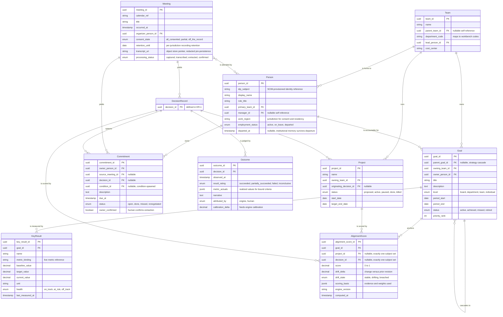
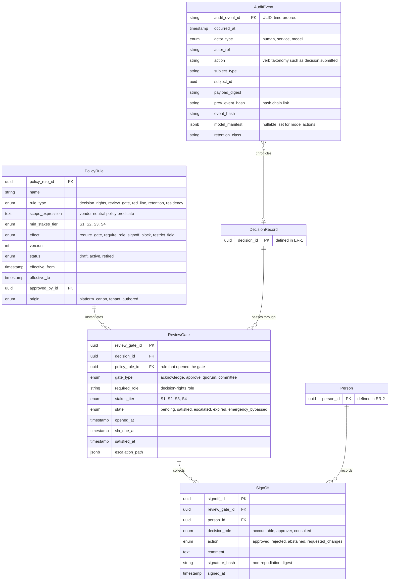
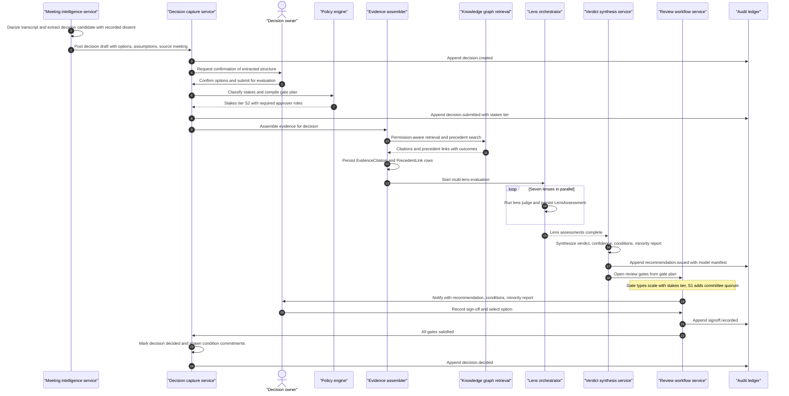
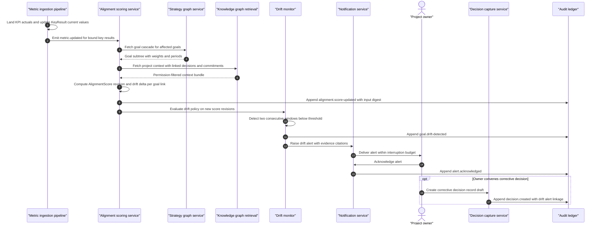

# TrueNorth architecture — C4 level 4

## 1. Front matter

| Field | Value |
|---|---|
| Doc ID | ARCH-L4 |
| C4 level | 4 Code & data |
| Owning unit | U3 Architecture C4 L4 |
| Version | 1.0 |

## 2. Scope & imported assumptions

This document is the C4 level-4 view of TrueNorth: the logical data model and the externally consumable contract surface. It is the only document in the plan permitted to define schemas and API shapes; every other architecture or catalog document names interfaces and cites this level for their structure. It covers three things: (a) the core data schemas, expressed as entity-relationship diagrams with attribute lists and relationships; (b) the API surface, expressed as resource groups with purpose, key operations, and event topics; and (c) two hero sequences that show the schemas and contracts working end to end — the meeting-to-audited-decision path, and goal-alignment scoring of an in-flight project with a drift alert.

The document deliberately stops short of physical design. It does not specify DDL, index strategy, partitioning keys per vendor, full OpenAPI or AsyncAPI files, or internal service-to-service RPC signatures; those belong to implementation, and component boundaries are imported from the level-3 view. Feature behavior is owned by the catalog documents and is referenced here only by canonical L2 ID where a schema or contract exists to serve it.

This design imports the canonical assumptions block from the shared specification verbatim and unchanged:

- **Verdict scale:** Endorse / Endorse-with-conditions / Caution / Oppose
- **Stakes tiers:** S1 (existential/board-level) → S2 (executive) → S3 (departmental) → S4 (team/routine); human-in-the-loop gates scale with stakes
- **Invariant:** humans always retain decision authority; TrueNorth advises, records, and learns from outcomes
- **Deployment:** SaaS / VPC / on-prem / air-gapped; multi-tenant with hard isolation options; data residency honored
- **Red lines:** no covert monitoring, no individual surveillance scoring, no autonomous people decisions

Two consequences of the assumptions are treated as schema-level requirements. First, the verdict scale and stakes tiers appear in the schemas exactly as canon defines them, as closed enumerations — they are not tenant-configurable reference data. Second, the red lines are enforced structurally, not merely by policy: the Person entity defines no behavioral or performance scoring attributes, and no schema in this document provides a place to persist an individual surveillance score.

## 3. Diagrams

The data model is presented as three entity-relationship diagrams — the decision core (ER-1), the organizational context (ER-2), and governance and audit (ER-3) — followed by the two hero sequences (SEQ-1, SEQ-2). One convention keeps the diagrams legible: every table carries the common columns `tenant_id`, `residency_region`, `created_at`, `updated_at`, and `row_version`; they are shown only on `DecisionRecord` and omitted everywhere else. Entities that appear in more than one diagram are drawn with their primary key only on their second appearance and are described once, in the diagram that owns them.

### 3.1 Decision core schema (ER-1)

ER-1 models the decision record and everything the engine attaches to it: options, assumptions, criteria, evaluation output, evidence, and precedent. This is the schema behind DI-1 through DI-6.

```mermaid
erDiagram
    DecisionRecord {
        uuid decision_id PK
        uuid tenant_id "common column, shown here only"
        string residency_region "common column, shown here only"
        string title
        text context_summary
        string decision_type "tenant-extensible code list"
        enum stakes_tier "S1, S2, S3, S4"
        enum status "draft, submitted, evaluating, recommended, in_review, decided, enacted, outcome_recorded, withdrawn, archived"
        uuid decision_owner_id FK "accountable human"
        uuid proposing_team_id FK
        uuid source_meeting_id FK "nullable"
        uuid decided_option_id FK "nullable until decided"
        enum classification "public, internal, confidential, restricted"
        timestamp due_by
        timestamp decided_at
        int row_version "optimistic concurrency"
        timestamp created_at
        timestamp updated_at
    }
    Option {
        uuid option_id PK
        uuid decision_id FK
        string label
        text description
        boolean is_status_quo
        enum origin "human, extracted, engine_suggested"
        jsonb expected_impact "metric deltas by horizon"
    }
    Assumption {
        uuid assumption_id PK
        uuid decision_id FK
        text statement
        enum criticality "load_bearing, supporting"
        decimal stated_confidence "0 to 1"
        enum validation_status "unvalidated, supported, contradicted, expired"
        timestamp recheck_at "sentinel re-test schedule"
    }
    Criterion {
        uuid criterion_id PK
        uuid decision_id FK
        string name
        decimal weight
        enum direction "maximize, minimize, threshold"
        string metric_binding "catalog metric reference"
    }
    Recommendation {
        uuid recommendation_id PK
        uuid decision_id FK
        int revision
        enum verdict "Endorse, Endorse-with-conditions, Caution, Oppose"
        uuid recommended_option_id FK "nullable"
        decimal confidence "0 to 1, calibrated"
        text reasoning_summary
        text change_my_mind "falsifiers that would alter the verdict"
        jsonb model_manifest "models, versions, prompt bundle hashes"
        enum status "issued, superseded, withdrawn"
        uuid superseded_by_id FK "nullable self reference"
        timestamp issued_at
    }
    LensAssessment {
        uuid assessment_id PK
        uuid recommendation_id FK
        uuid decision_id FK "denormalized for query"
        enum lens "financial, strategic, risk, legal, people, customer, esg"
        enum stance "favor, favor_with_conditions, concern, object"
        decimal score "0 to 1"
        decimal confidence "0 to 1"
        text rationale
        jsonb option_scores "per-option scoring detail"
        string judge_version "lens judge model and version"
    }
    Condition {
        uuid condition_id PK
        uuid recommendation_id FK
        text description
        enum condition_type "precondition, guardrail, milestone_review, metric_threshold"
        jsonb verification_binding "metric or attestation source"
        timestamp due_by
        enum status "open, satisfied, breached, waived"
        uuid waived_by_id FK "nullable, waiver requires sign-off"
    }
    MinorityReport {
        uuid minority_report_id PK
        uuid recommendation_id FK "exactly one per recommendation"
        enum counter_verdict "Endorse, Endorse-with-conditions, Caution, Oppose"
        text argument
        jsonb bias_flags "groupthink, sunk_cost, anchoring"
        enum origin "engine, human_dissent, hybrid"
    }
    EvidenceCitation {
        uuid citation_id PK
        uuid decision_id FK
        enum cited_by_type "lens_assessment, recommendation, minority_report, assumption"
        uuid cited_by_id "polymorphic pointer"
        string source_system
        string source_uri
        string lineage_ref "field-level lineage pointer"
        string snippet_hash "content integrity digest"
        decimal reliability_score "0 to 1"
        enum classification "public, internal, confidential, restricted"
        timestamp retrieved_at
    }
    PrecedentLink {
        uuid precedent_link_id PK
        uuid decision_id FK
        uuid precedent_decision_id FK
        decimal similarity_score "0 to 1"
        jsonb match_basis "semantic, structural, shared goal, shared team"
        enum outcome_at_link_time "succeeded, mixed, failed, unknown"
        boolean sme_affirmed "curation flag"
    }
    DecisionRecord ||--o{ Option : "weighs"
    DecisionRecord ||--o{ Assumption : "rests on"
    DecisionRecord ||--o{ Criterion : "is judged against"
    DecisionRecord ||--o{ Recommendation : "receives revisions of"
    DecisionRecord ||--o{ EvidenceCitation : "anchors"
    DecisionRecord ||--o{ PrecedentLink : "learns from"
    PrecedentLink }o--|| DecisionRecord : "cites as precedent"
    Recommendation ||--|{ LensAssessment : "synthesizes"
    Recommendation ||--o{ Condition : "is bound by"
    Recommendation ||--|| MinorityReport : "is challenged by"
    Recommendation }o--o| Option : "favors"
```



**DecisionRecord** is the root aggregate of the platform (DI-1): one row per decision under consideration or decided, carrying the stakes tier, lifecycle status, the accountable human owner, and — only after a human acts — the decided option. The `decided_option_id` is the schema's expression of the human-decides invariant: no service other than the review workflow acting on a recorded sign-off may populate it.

**Option** captures each course of action under consideration, including an explicit status-quo option so that "do nothing" is always evaluable. The `origin` attribute distinguishes options proposed by humans, extracted from meetings (MI-2), or suggested by the engine, so downstream analytics never conflate machine suggestions with human intent.

**Assumption** records the load-bearing beliefs a decision rests on. `recheck_at` and `validation_status` make assumptions monitorable artifacts rather than static prose: when fresh evidence contradicts a load-bearing assumption after the decision is made, the platform can reopen the conversation (DI-6).

**Criterion** holds the explicit evaluation dimensions and weights for the decision, optionally bound to a catalog metric so that outcome scoring (DI-8) can later compare promised against realized values mechanically.

**Recommendation** is the engine's immutable output artifact (DI-4): verdict on the canonical four-point scale, calibrated confidence, reasoning summary, the falsifiers that would change the verdict, and a complete `model_manifest` for reproducibility. Recommendations are never edited; a re-evaluation issues a new revision and links it through `superseded_by_id`.

**LensAssessment** stores one row per lens per recommendation revision for the canonical seven lenses (DI-3). The lens-level `stance` vocabulary is deliberately distinct from the verdict scale: lenses advise the synthesizer; only the synthesized Recommendation speaks the canonical verdict language.

**Condition** carries the obligations attached to an Endorse-with-conditions verdict, each with a verification binding so satisfaction or breach can be detected from data rather than asserted. Waivers are first-class and gated.

**MinorityReport** is mandatory — exactly one per recommendation, enforced as a one-to-one relationship — and records the strongest argument against the issued verdict together with detected bias flags (DI-5). Its `origin` attribute preserves whether the dissent came from the engine, from recorded human dissent in the source meeting, or both.

**EvidenceCitation** is the universal citation row (DI-2): every claim made by a lens, a recommendation, a minority report, or an assumption points at a source through `source_uri`, a content-integrity `snippet_hash`, and a `lineage_ref` that resolves into field-level lineage (DF-5). The citing artifact is identified polymorphically through `cited_by_type` and `cited_by_id`; the trade-off is examined in section 7.

**PrecedentLink** connects a live decision to similar past decisions and snapshots the precedent's outcome at link time, so the recommendation's reasoning remains interpretable even after the precedent's outcome record evolves. `sme_affirmed` records curation by a human expert (KG-5).

### 3.2 Organizational context schema (ER-2)

ER-2 models the organization the decisions live in: people, teams, goals and key results, meetings, commitments, projects, outcomes, and the alignment scores that bind them to strategy. This is the schema behind GA-1, GA-3, GA-4, MI-2, and DI-8, and it is the relational source from which the knowledge graph projection (KG-2, KG-3) is built.



**Person** is a directory entity provisioned from the identity provider (SC-1), never authored inside TrueNorth. It deliberately carries role, team, reporting line, and jurisdiction — and nothing evaluative. Departure sets `employment_status` and `departed_at` but does not delete the row: decisions, sign-offs, and commitments keep their authorship so institutional memory survives turnover (KG-3), while PII minimization rules (DF-4) govern what remains queryable.

**Team** carries the organizational hierarchy through `parent_team_id` and maps each team to a department code, which is how workbench surfaces select their ontology and KPI packs. The reporting and committee structures used for decision-rights resolution (KG-6) are projected from Person and Team into the graph.

**Goal** and **KeyResult** form the strategy cascade (GA-1): goals nest from board level to individual level via `parent_goal_id`, and each key result binds to a live metric (GA-3) so `current_value` and `health` are computed, not self-reported. Goal periods make the cascade time-boxed, which is what gives alignment scores a defensible denominator.

**Meeting** stores capture metadata and a pointer to the redacted transcript in the artifact store — never the raw recording in the relational store. `consent_state` and `retention_until` encode the recording-governance rules (MI-6); an `off_the_record` meeting yields no transcript pointer at all.

**Commitment** is the follow-through unit (MI-2, MI-3): extracted from meetings or spawned from accepted recommendation conditions, owned by exactly one person, and only binding once `owner_confirmed` is true — extraction never creates obligations silently. Commitment status is queryable per commitment; the schema defines no person-level aggregate of missed commitments, by red-line design.

**Outcome** closes the loop (DI-8): what actually happened after a decision, rated and attributed, with realized metric values aligned to the decision's criteria and a `calibration_delta` that feeds engine self-calibration (DI-6).

**Project** is the execution vehicle a decision authorizes; it exists in this schema chiefly so that in-flight work can be alignment-scored and drift-checked between decision points.

**AlignmentScore** is a revisioned scoring fact (GA-4): one subject — a project or a decision, exactly one of the two foreign keys set, enforced by a check constraint — scored against one goal, with the evidence basis recorded and a drift state maintained against prior revisions (GA-5).

### 3.3 Governance and audit schema (ER-3)

ER-3 models how the platform constrains and remembers itself: policy rules, the review gates they open, the human sign-offs that satisfy them, and the append-only audit ledger. This is the schema behind GV-1, GV-2, GV-3, and DI-7.



**PolicyRule** encodes the decision-rights matrix and platform red lines as data (GV-1). Rules are versioned with effective periods, require an approving human, and distinguish platform canon (red lines, which tenants cannot retire) from tenant-authored rules. The `scope_expression` is a vendor-neutral predicate evaluated against decision attributes — stakes tier, decision type, department, classification — at submission time.

**ReviewGate** is a policy rule instantiated against a specific decision: the concrete checkpoint a decision must pass, with the gate type scaling by stakes tier (GV-2, DI-7). An `emergency_bypassed` state exists for the crisis fast path, and bypass is itself audited and triggers a mandatory retrospective gate.

**SignOff** is the human act, attributed to a person with their decision role, carrying a non-repudiation digest of exactly what was approved — the recommendation revision, the conditions, and the selected option are all inside the signed payload.

**AuditEvent** is the append-only, hash-chained ledger row (GV-3). Every state transition in the platform — human, service, or model — appends one event; model actions carry the full `model_manifest` so any recommendation can be replayed against the same model versions and prompt bundles. The subject reference is polymorphic; the relationship to DecisionRecord shown here is the dominant case, not a constraint.

### 3.4 Hero sequence SEQ-1 — meeting to audited decision

SEQ-1 traces the canonical path: a meeting produces a decision candidate, a human confirms and submits it, evidence is assembled, seven lenses evaluate, a verdict is synthesized with its minority report, stakes-tiered review gates collect human sign-off, and every step lands in the audit ledger.



The participants map directly to level-3 components. The **meeting intelligence service** (MI-1, MI-2) produces structured candidates, never records of authority — note that the human owner confirms the extracted structure before anything is evaluated. The **decision capture service** (DI-1) owns the DecisionRecord aggregate and its state machine. The **policy engine** (GV-1, GV-2) classifies stakes and compiles the gate plan before evaluation begins, so reviewers are known up front. The **evidence assembler** (DI-2) and **knowledge graph retrieval** (KG-4) produce permission-aware, citation-backed context; nothing reaches a lens that the requesting decision context is not entitled to see. The **lens orchestrator** (DI-3) fans out to the seven judges in parallel and persists one LensAssessment per lens. The **verdict synthesis service** (DI-4, DI-5) issues the immutable Recommendation with its mandatory MinorityReport. The **review workflow service** (DI-7) collects sign-offs against gates; the **decision owner** — a human — is the only actor who selects the decided option. The **audit ledger** (GV-3) appends at every transition; by the end of the sequence the decision is replayable from first extraction to final sign-off.

### 3.5 Hero sequence SEQ-2 — goal-alignment scoring with drift alert

SEQ-2 traces the steady-state loop that runs between decision points: fresh metrics land, an in-flight project is re-scored against the goals it serves, drift is detected across consecutive scoring windows, and the project owner is alerted with the option to convene a corrective decision — which would re-enter SEQ-1.



The **metric ingestion pipeline** (DF-2) is the trigger: it maintains `KeyResult.current_value` from bound source metrics, so alignment scoring always works from measured rather than reported progress. The **alignment scoring service** (GA-4) recomputes an AlignmentScore revision per project-goal link, recording its `scoring_basis` and the input digest in the audit ledger so a score can be explained months later. The **strategy graph service** (GA-1) supplies the goal cascade with weights and periods; the **drift monitor** (GA-5) applies tenant-configured drift policy — here, two consecutive windows below threshold — before raising anything, so a single noisy metric refresh never pages an owner. The **notification service** (SX-4) honors interruption budgets and digest preferences. The **project owner** decides what to do; the platform's strongest move is to pre-draft a corrective DecisionRecord linked to the drift alert, which then flows through SEQ-1 with full evidence of why it was convened. Nothing in this loop acts autonomously on the project.

## 4. Element catalog

| ID | Name | Responsibility | Pillar mapping | Technology class |
|---|---|---|---|---|
| E01 | Decision core schema | System of record for ER-1: decision records, options, assumptions, criteria, recommendations, lens assessments, conditions, minority reports, citations, precedent links | DI-1, DI-2, DI-3, DI-4, DI-5, DI-6 | Relational database (ACID) |
| E02 | Organizational context schema | System of record for ER-2: people, teams, goals, key results, meetings, commitments, projects, outcomes, alignment scores | KG-1, GA-1, GA-3, GA-4, MI-2, DI-8 | Relational database (ACID) |
| E03 | Governance schema and audit ledger | System of record for ER-3: policy rules, review gates, sign-offs; append-only hash-chained audit events | GV-1, GV-2, GV-3, DI-7 | Relational database plus append-only ledger table |
| E04 | Knowledge graph projection | Bitemporal property-graph projection of E01 and E02 built by change-data-capture; serves as-of queries, decision genealogy, org-model traversals | KG-2, KG-3, KG-6 | Property graph database |
| E05 | Semantic index | Embedding and hybrid-search index over decision artifacts, transcripts, documents; permission filters applied at query time | KG-4, PL-2 | Vector index with hybrid retrieval |
| E06 | Artifact store | Immutable storage for redacted transcripts, source documents, replay bundles, model manifests | MI-1, DF-2, GV-3 | Object store with WORM option |
| E07 | Event backbone | Tenant- and region-partitioned topics carrying the event contracts of section 5.4 | DF-2, SX-5 | Distributed log / stream processor |
| E08 | Public API gateway | Hosts the resource groups of section 5.3; authentication, authorization, rate limiting, residency routing | SX-5, SC-1, DF-6 | API gateway |
| E09 | Schema and contract registry | Versioned registry of event schemas, API contracts, and tenant ontology extensions; compatibility checks on publish | DF-3, KG-1 | Schema registry |
| E10 | Query read models | Denormalized projections for command centers, alignment dashboards, and audit search | SX-1, GA-3, GV-3 | Materialized views / OLAP store |

## 5. Interfaces & contracts

### 5.1 Schema conventions and field semantics

**Identifiers.** Entity primary keys are UUIDv7 — time-ordered for index locality without exposing sequence-derived row counts across tenants. Audit events use ULIDs for strict lexicographic time ordering within a partition. Natural-key uniqueness is always scoped by `tenant_id`.

**Common columns.** Every table carries `tenant_id`, `residency_region`, `created_at`, `updated_at`, and `row_version`. `tenant_id` participates in every unique constraint and every foreign key, which makes row-level tenant isolation enforceable in the storage engine and makes per-tenant export and erasure tractable. `residency_region` pins the row to the region that produced it (DF-6); cross-region replication policy is evaluated against this column, never inferred.

**Temporal model.** All E01–E03 tables are system-versioned: the store retains prior row versions with system-time periods, which is what audit replay reads. Entities that carry organizational truth that changes meaning over time — Goal, Team, Person, PolicyRule — additionally carry explicit validity periods. The graph projection (E04) indexes both dimensions, so KG-3 as-of queries ("what did we believe on March 3, and what had actually been decided by then") resolve without reconstructing state in application code.

**Closed enumerations.** `verdict` and `counter_verdict` accept exactly four values, and `stakes_tier` exactly four; both are stored and transmitted using the canonical surface strings — `Endorse`, `Endorse-with-conditions`, `Caution`, `Oppose`, and `S1` through `S4`. They are compile-time enums, not tenant reference data: a tenant can configure when each tier's gates apply, never what the tiers or verdicts are. All other enumerations use lower-snake tokens and may grow additively.

**Immutability classes.** Three write disciplines exist. *Mutable aggregates* (DecisionRecord, Goal, Project, Commitment, Condition status) update in place under optimistic concurrency via `row_version`. *Immutable revisions* (Recommendation, LensAssessment, MinorityReport, EvidenceCitation, AlignmentScore) are write-once; corrections create new revisions linked to their predecessors. *Append-only ledger* (AuditEvent, SignOff) rows are never updated or deleted inside their retention class; the audit chain's `prev_event_hash` makes silent removal detectable.

**Decision lifecycle.** `DecisionRecord.status` follows a single state machine: `draft → submitted → evaluating → recommended → in_review → decided → enacted → outcome_recorded → archived`, with `withdrawn` reachable from any state before `decided`. Transitions into `decided` require all ReviewGates satisfied and a SignOff from the accountable owner; the API rejects the transition otherwise. Transitions are events: each one appends to the audit ledger and publishes to the event backbone.

**Red lines in schema.** Person defines no scoring, ranking, sentiment, or productivity attributes. Commitment and Outcome facts are attributable to people because accountability requires it, but the schema provides no person-keyed aggregate tables, and analytical exports pseudonymize `actor_ref` (DF-4). Policy rules of type `red_line` originate as `platform_canon` and cannot be retired by tenant administrators (GV-6).

**Tenant ontology extensions.** Tenants extend the ontology (KG-1) through a registered, namespaced `ext` JSON column present on DecisionRecord, Goal, Project, and Meeting — never through new physical columns on core tables. Extension fields must be declared in the schema and contract registry (E09) with a type and purpose tag before writes are accepted, which keeps extensions queryable, documentable, and privacy-reviewable.

### 5.2 API conventions

TrueNorth shall expose one public, versioned, resource-oriented HTTPS/JSON surface through the API gateway (SX-5); internal service-to-service contracts are out of scope here. Conventions, applied uniformly:

- **Versioning:** major version in the path (`/v1`); within a major version, changes are additive only. Deprecations carry a published sunset window enforced by the registry (E09).
- **Authentication and authorization:** OAuth 2.1 — user tokens via enterprise SSO and client-credential tokens for services (SC-1). Authorization is scope-based per resource group, then attribute-based per row and field: responses are shaped by the caller's classification clearance, so a citation the caller cannot read arrives as a sealed stub with lineage intact (SC-2).
- **Tenancy and residency:** tenant identity comes from the token, never from the path. Each tenant is pinned to a regional base endpoint; the gateway rejects requests routed against the wrong region rather than forwarding them (DF-6).
- **Concurrency and idempotency:** mutable aggregates return `row_version` as an ETag and require `If-Match` on update; all POST operations require an `Idempotency-Key` header, retained for 72 hours.
- **Pagination and errors:** cursor pagination on all collections; errors use RFC 7807 problem details with a stable machine-readable `type`.
- **Events:** all webhooks and consumer-API events use a CloudEvents 1.0 envelope, HMAC-signed, with at-least-once delivery and a replay endpoint scoped by topic and time range.

### 5.3 Resource groups

| ID | Resource group | Base paths | Purpose |
|---|---|---|---|
| RG-01 | Decisions | `/v1/decisions`, `/v1/decisions/{id}/options`, `/v1/decisions/{id}/assumptions`, `/v1/decisions/{id}/criteria` | Author and manage decision records through their lifecycle (DI-1) |
| RG-02 | Evaluations and recommendations | `/v1/decisions/{id}/evaluations`, `/v1/recommendations/{id}`, `/v1/recommendations/{id}/minority-report`, `/v1/recommendations/{id}/conditions` | Trigger evaluation and read verdicts, lens assessments, conditions, citations (DI-2 through DI-6) |
| RG-03 | Goals and alignment | `/v1/goals`, `/v1/goals/{id}/key-results`, `/v1/alignment-scores`, `/v1/drift-alerts` | Maintain the strategy cascade and read alignment and drift facts (GA-1, GA-4, GA-5) |
| RG-04 | Meetings and commitments | `/v1/meetings`, `/v1/meetings/{id}/extractions`, `/v1/commitments` | Review extraction results, confirm or reject them, track follow-through (MI-2, MI-3) |
| RG-05 | Graph and precedents | `/v1/graph/entities/{type}/{id}`, `/v1/graph/as-of`, `/v1/precedents/search` | Read-only, permission-aware graph access and precedent retrieval (KG-3, KG-4) |
| RG-06 | Directory | `/v1/people`, `/v1/teams` | Read-mostly org directory; writes arrive only via SCIM provisioning (SC-1) |
| RG-07 | Governance | `/v1/policy-rules`, `/v1/review-gates`, `/v1/sign-offs`, `/v1/audit-events` | Policy lifecycle, gate actions, audit query and replay-bundle export (GV-1, GV-2, GV-3) |
| RG-08 | Events and subscriptions | `/v1/webhooks`, `/v1/subscriptions`, `/v1/events/replay` | Manage event delivery to external systems (SX-5) |

Key operations, by group:

- **RG-01 Decisions.** Create draft; update draft under `If-Match`; `submit` (validates structure, invokes policy classification, freezes the option set for evaluation); `withdraw`; `decide` (records `decided_option_id`; rejected unless every gate is satisfied and the caller holds the accountable role); `record-outcome`. Deletion does not exist — decisions are withdrawn or archived, never erased, except under legally mandated erasure executed as a governed redaction.
- **RG-02 Evaluations and recommendations.** `request-evaluation` is idempotent per evidence snapshot digest: requesting twice against unchanged evidence returns the existing recommendation revision rather than re-running the lenses. Reads return the recommendation with verdict, confidence, reasoning, conditions, minority report, lens assessments, and citations; every citation resolves through RG-05 subject to the caller's clearance. `waive-condition` requires a sign-off and is gated like any review action.
- **RG-03 Goals and alignment.** Goal CRUD with cascade validation (a goal cannot close its period with unresolved child goals silently); key-result metric binding; alignment-score reads are revision-listing by subject or by goal; drift alerts support acknowledge and convene-decision actions, the latter pre-drafting an RG-01 record with linkage.
- **RG-04 Meetings and commitments.** Extraction results are proposals: `confirm` and `reject` per extracted decision or commitment, owner-scoped. Commitment updates are status-only for the owner; renegotiation records the prior due date. Meeting writes are produced by the capture pipeline, not the public API; consent state is read-only here (MI-6).
- **RG-05 Graph and precedents.** Entity reads by type and ID; `as-of` accepts both a valid-time and a system-time instant; precedent search accepts a decision ID or a free-text candidate and returns scored PrecedentLink proposals that become persistent only when attached to a decision via RG-01.
- **RG-06 Directory.** List and read with field-level shaping; no write verbs exist on this surface by design.
- **RG-07 Governance.** Policy rules move `draft → active → retired` with an approving sign-off; red-line rules of platform origin reject retirement. Review gates expose `approve`, `reject`, `request-changes`, `escalate`; audit events expose query by subject, actor, time, and action, plus `export-replay-bundle`, which assembles the evidence snapshot, model manifest, and event chain for a decision into a sealed artifact (GV-3, GV-4).
- **RG-08 Events and subscriptions.** Register webhook endpoints with secrets and topic filters; manage consumer-group subscriptions; replay by topic and time window, idempotent on the consumer side via event IDs.

### 5.4 Event topics

All topics are tenant- and region-partitioned, carry CloudEvents 1.0 envelopes, and are versioned independently of the REST surface (a topic's major version appears in its name). Payloads carry entity IDs and minimal denormalized context, never full documents; consumers fetch detail through the REST surface under their own authorization.

| Topic | Producer | Representative event types | Primary consumers |
|---|---|---|---|
| `truenorth.decision.v1` | Decision capture service | `decision.created`, `decision.submitted`, `decision.decided`, `decision.outcome-recorded`, `decision.withdrawn` | Workbenches, read models, external workflow tools |
| `truenorth.recommendation.v1` | Verdict synthesis service | `recommendation.issued`, `recommendation.superseded` | Review workflow, notification service, analytics |
| `truenorth.review.v1` | Review workflow service | `gate.opened`, `signoff.recorded`, `gate.escalated`, `gate.emergency-bypassed` | Notification service, audit consumers, command centers |
| `truenorth.meeting.v1` | Meeting intelligence service | `meeting.processed`, `extraction.confirmed`, `extraction.rejected` | Decision capture, commitment tracker, read models |
| `truenorth.commitment.v1` | Commitment tracker | `commitment.created`, `commitment.at-risk`, `commitment.completed`, `commitment.renegotiated` | Notification service, workbenches, alignment scoring |
| `truenorth.goal.v1` | Strategy graph service | `goal.updated`, `key-result.measured`, `goal.drift-detected` | Alignment scoring, drift monitor, command centers |
| `truenorth.alignment.v1` | Alignment scoring service | `alignment.score-updated` | Drift monitor, read models, value analytics |
| `truenorth.policy.v1` | Policy engine | `policy.activated`, `policy.retired` | Gateway authorization cache, audit consumers |

A representative envelope, abbreviated:

```json
{
  "specversion": "1.0",
  "id": "01JD8Z9T6N4Q2R8V5W3X1Y0Z7A",
  "type": "truenorth.recommendation.issued",
  "source": "/tenants/{tenant}/synthesis",
  "subject": "recommendation/8f1c2e4a",
  "time": "2026-06-11T14:09:00Z",
  "dataschema": "registry:truenorth.recommendation.v1#issued.3",
  "data": {
    "decision_id": "0190f3a2",
    "recommendation_id": "8f1c2e4a",
    "revision": 2,
    "verdict": "Endorse-with-conditions",
    "stakes_tier": "S2",
    "confidence": 0.74,
    "condition_count": 3
  }
}
```

### 5.5 Contract governance

Every event schema, REST contract, and tenant extension field is registered in E09 with semantic-version metadata. Publishing a change runs compatibility checks: additive within a major version, breaking changes require a new major version with a declared sunset for the old one (DF-3). Consumer-driven contract tests run in the platform evaluation harness against golden payloads (PL-4), so a schema change that would break a workbench or an external subscriber fails before deployment, not after.

## 6. Quality attributes

**Portability across deployment models.** The schemas use ANSI-conservative types (the `jsonb` columns degrade to validated text where necessary) and no storage-engine-specific features are load-bearing, so the same logical model deploys to SaaS, VPC, on-prem, and air-gapped targets. The graph projection and semantic index are rebuildable from the relational system of record plus the artifact store, which is what makes air-gapped restore and region migration tractable: only E01–E03, E06, and the ledger need to move.

**Residency.** `residency_region` on every row, regional event partitions, and region-pinned gateway endpoints make residency a property of the data path rather than a deployment-time promise (DF-6). Cross-region flows are explicit, enumerated, and policy-checked; the default for every new table and topic is no cross-region replication.

**Auditability and reproducibility.** The combination of system-versioned tables, immutable recommendation revisions, content-hashed citations, model manifests, and the hash-chained ledger means any issued verdict can be replayed: same evidence snapshot, same model versions, same policy versions (GV-3). The replay bundle export in RG-07 packages this for external auditors without granting them live system access (GV-4).

**Stakes-tiered human control.** The human-decides invariant is enforced at three layers of this design: the schema (only a sign-off-bearing transition can populate `decided_option_id`), the API (the `decide` verb validates gates and roles server-side), and the event model (no topic carries an event type that asserts an autonomous decision). Gate strictness scales with the stakes tier through PolicyRule and ReviewGate, exactly as GV-2 and DI-7 require.

**Scale.** The write path is sized for organizational decision tempo — thousands of decisions and tens of thousands of commitments per tenant per quarter — which is modest; the demanding loads are retrieval (E05), graph traversal (E04), and metric-driven rescoring (SEQ-2). Those run on projections fed by change-data-capture, so analytical and retrieval load never contends with the transactional system of record. AlignmentScore and AuditEvent, the two genuinely high-volume tables, are time-partitioned with hot-cold tiering into the artifact store.

**Privacy.** Redaction happens before persistence (DF-4): the relational store and the index only ever see the redacted transcript. Consent state gates capture itself (MI-6), purpose tags travel with extension fields, and the schema's refusal to define person-level scoring aggregates makes the red lines structural rather than aspirational.

## 7. Architecture decisions

| # | Decision | Alternatives | Rationale |
|---|---|---|---|
| 1 | Relational system of record; knowledge graph and semantic index are CDC-fed projections | Graph-native system of record; dual-write to relational and graph | ACID guarantees for the decision lifecycle and gate enforcement; portability across all four deployment models; projections are rebuildable, so graph and index technology can evolve without migration of the record of truth |
| 2 | Single polymorphic EvidenceCitation table (`cited_by_type` + `cited_by_id`) | Per-citer join tables; citations embedded as JSON arrays on each artifact | One uniform path for lineage queries, classification shaping, and audit; the integrity cost of a polymorphic key is contained by service-layer validation and a nightly referential checker, and is examined in section 8 |
| 3 | Recommendations, lens assessments, and minority reports are immutable revisions | Update-in-place with history triggers | Replay and calibration need stable referents; a sign-off must point at exactly the artifact the human saw; supersession chains make re-evaluation visible rather than silent |
| 4 | Verdict scale and stakes tiers as closed enums carrying canonical surface strings on the wire | Tenant-extensible lookup tables; integer codes with display mapping | The shared specification fixes both vocabularies as immutable canon; closed enums make drift impossible and contracts self-describing |
| 5 | UUIDv7 entity keys; ULID audit-event keys | Sequential bigints; UUIDv4 | Time-ordered keys give index locality and natural partition pruning without leaking per-tenant volumes; ULIDs give the ledger lexicographic ordering within partitions |
| 6 | Bitemporal modeling: system versioning everywhere, explicit validity periods only on memory-bearing entities (Goal, Team, Person, PolicyRule) | Event-source every aggregate; snapshot tables on a schedule | As-of queries (KG-3) get full fidelity where organizational meaning shifts, without imposing event-sourcing complexity on every aggregate; the audit ledger already provides the event narrative |
| 7 | REST/JSON public surface plus CloudEvents topics; no public GraphQL | GraphQL-first gateway; public gRPC | Contract governance, field-level authorization, and partner ecosystem tooling (SX-5) favor resource contracts; graph-shaped reads are served by purpose-built RG-05 endpoints instead of an open query language whose authorization surface is hard to bound |
| 8 | Hash-chained append-only audit ledger inside the platform, with optional periodic external anchoring | External WORM store only; distributed ledger technology | Tamper-evidence with operational simplicity in all deployment models including air-gapped; external anchoring satisfies auditors who require independence without importing consensus infrastructure |
| 9 | Accepted recommendation conditions spawn Commitment rows | Separate condition-tracking subsystem | Conditions and meeting commitments share one follow-through pipeline (MI-3), one owner-confirmation discipline, and one at-risk alerting path; the `condition_id` back-reference preserves provenance |
| 10 | AlignmentScore uses two nullable foreign keys (project, decision) with an exactly-one check constraint | Polymorphic subject pointer; separate score tables per subject type | Both subjects are known and stable, so real foreign keys are available — unlike citations, where the citer set is wider; one table keeps drift policy uniform |

## 8. Risks & open questions

- **Cross-residency precedent retrieval.** Precedent search is most valuable across the whole enterprise, but DecisionRecords are region-pinned. Whether anonymized, feature-level precedent representations may cross residency boundaries is a global policy question this document cannot decide; until ruled on, precedent search operates within-region, and the schema carries `residency_region` on PrecedentLink-reachable entities so either ruling is implementable. Recorded here as an open question, not asserted.
- **Polymorphic citation integrity.** Decision 2 trades referential enforcement for uniformity. The mitigations (service validation, nightly checker, immutability of citers) bound the risk, but orphaned citations remain possible in crash windows and would surface in audit replay. The severity is contained because citations are append-only and never silently rewritten.
- **Lens vocabulary evolution.** `LensAssessment.lens` is a closed enum over the canonical seven lenses. Department workbench lens packs (WB-0) imply tenant-scoped additional judges eventually; that would force a migration from enum to registered reference data with governance over judge provenance. The decision is deferred until the workbench framework's requirements are concrete.
- **Extension-field sprawl.** The registered `ext` mechanism is designed to prevent ungoverned columns, but at Fortune-500 scale the registry itself becomes a governance workload: hundreds of tenant fields with purpose tags to review. Mitigation is procedural (registry approval workflow), and the residual risk is contract erosion in analytics rather than in the core lifecycle.
- **Bitemporal graph projection cost.** Indexing both time dimensions over a graph with hundreds of millions of edges is the most expensive component of this design. The fallback — serving as-of queries from the system-versioned relational store with degraded traversal performance — is functional but slow, and should be treated as the contingency, not the plan.
- **Retention conflicts between memory and privacy.** Meeting retention limits (MI-6) will eventually expire transcripts that EvidenceCitations point into, while decision genealogy (KG-3) wants citations resolvable indefinitely. The design answer is citation tombstoning — the citation row, snippet hash, and lineage survive; the underlying content does not — but whether a tombstoned citation satisfies audit obligations in every jurisdiction is open.
- **Event ordering across regions.** Topics are region-partitioned, so global consumers (analytics, value realization) observe interleavings without a total order. Consumers are required to be commutative over entity revisions, which is achievable but easy to get wrong; contract tests in PL-4 should include out-of-order delivery cases.
- **Calibration data shape.** DI-6 self-calibration needs confidence-versus-outcome curves per stakes tier and per lens over time. `calibration_delta` on Outcome is the raw feed, but the aggregate calibration store is not yet designed; it likely belongs to the platform evaluation layer rather than this schema, and is flagged for that owner.

## 9. Dependencies & references

| Reference | Type | Why |
|---|---|---|
| U1 Architecture C4 L1+L2 | Work unit | System context and container boundaries this level refines |
| U2 Architecture C4 L3 | Work unit | Component decomposition; SEQ-1 and SEQ-2 participants map to its components |
| U4 Catalog DF+KG | Work unit | Feature behavior behind DF-2, DF-3, DF-4, DF-5, DF-6 and KG-1 through KG-6 served by these schemas |
| U5 Catalog MI+GA | Work unit | Feature behavior behind MI-1, MI-2, MI-3, MI-6 and GA-1, GA-3, GA-4, GA-5 |
| U6 Catalog DI+SF | Work unit | Feature behavior behind DI-1 through DI-8; decision core schema exists to serve it |
| U7 Catalog SX+WB-0 | Work unit | API and event surface consumers (SX-1, SX-4, SX-5); workbench extension requirements |
| U8 Catalog GV | Work unit | Governance semantics behind GV-1, GV-2, GV-3, GV-4, GV-6 encoded in ER-3 |
| U9 Catalog SC | Work unit | Identity, classification, and isolation controls (SC-1, SC-2, SC-4) assumed by the contract conventions |
| U10 Catalog PL+AD | Work unit | Model gateway, retrieval infrastructure, evaluation harness (PL-1, PL-2, PL-4) referenced by manifests and contract tests |
| DI-1, DI-4, DI-7 | Canonical L2 ID | Decision lifecycle, recommendation artifact, and review gates are the schema's core obligations |
| KG-3, KG-4 | Canonical L2 ID | Bitemporal as-of queries and permission-aware retrieval drive the temporal model and projection design |
| GA-4, GA-5 | Canonical L2 ID | AlignmentScore and drift semantics in ER-2 and SEQ-2 |
| GV-3 | Canonical L2 ID | Audit ledger, replay bundles, and immutability classes |
| DF-4, DF-6 | Canonical L2 ID | Pre-persistence redaction and residency pinning conventions |
| SX-5 | Canonical L2 ID | Public API gateway and webhook surface defined in section 5 |
