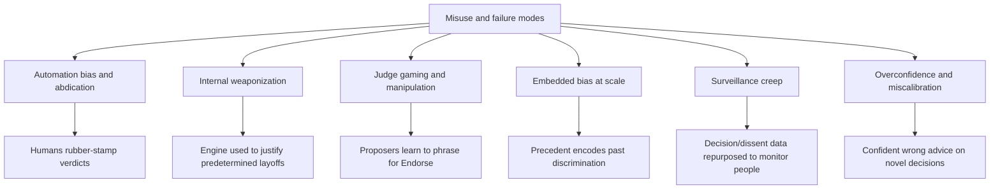
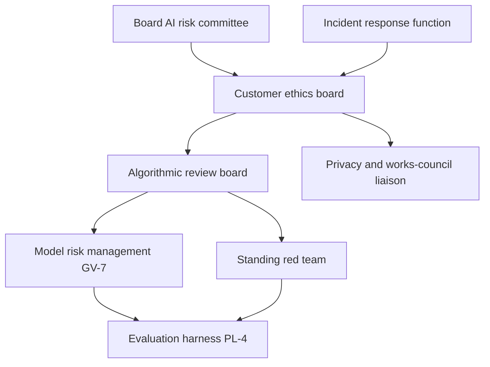
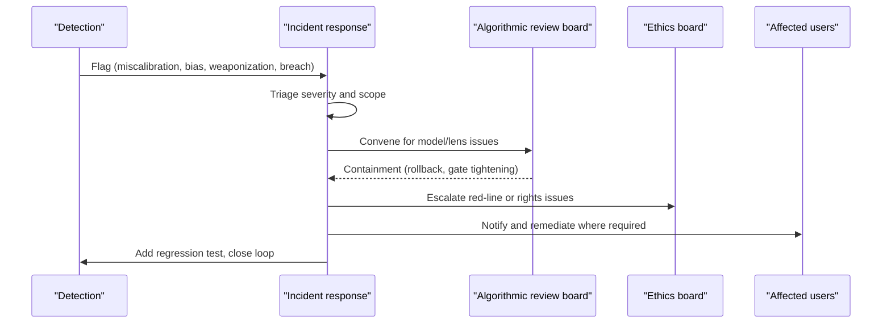

# Responsible-AI deep dive

## 1. Front matter

| Field | Value |
|---|---|
| Doc ID | DLV-RAI |
| Authoring unit | U25 Responsible-AI Deep Dive |
| Voice | Chief ethics officer |
| Pillars referenced | GV-1..GV-7, DI-5, DI-6, DI-7, DI-8, SC-3, SC-5, DF-4, MI-6, AD-2 |
| Version | 1.0 |

## 2. Purpose & scope

TrueNorth advises on the decisions that shape billions of dollars and tens of thousands of careers. That power is the product's reason to exist and its largest liability. This document is the chief ethics officer's account of how TrueNorth is kept safe and trustworthy in practice: the specific ways it could go wrong, the organization and controls that prevent that, the regulatory regime it must satisfy, and the playbooks for when something fails anyway. It does not introduce new pillars or features; it reasons over the governance (GV), decision-engine (DI), and security (SC) capabilities defined elsewhere and explains how they combine into a responsible system. The canonical assumptions — the Endorse/Endorse-with-conditions/Caution/Oppose verdict scale, stakes tiers S1–S4, the invariant that humans always decide, the deployment models, and the red lines (no covert monitoring, no individual surveillance scoring, no autonomous people decisions) — are treated as immutable constraints this program enforces.

## 3. Threat model: how TrueNorth could go wrong

### 3.1 Automation bias and abdication
The most likely harm is not a dramatic rogue decision; it is thousands of humans quietly ceding judgment to a usually-right system and stopping thinking. Mitigations: the mandatory, equally-weighted minority report (DI-4-2-2); the anti-automation-bias requirement that S1/S2 sign-off requires engaging with the minority report (a product/UX principle); calibration disclosure (DI-6, GV-4) so users learn where the engine is weak; and explicit "advice followed vs. overridden" separation in outcome scoring (DI-8-2-1) so the human's role stays visible.

### 3.2 Internal weaponization
A leader could try to use TrueNorth to manufacture a justification for a decision already made — most dangerously a layoff or a punitive action. Mitigations: the red lines forbidding autonomous or AI-justified people decisions (GV-6); decision-rights enforcement (GV-1) so the engine cannot be invoked outside legitimate authority; the people and legal lenses are mandatory for employee-affecting decisions (DI-3-1-2); immutable audit (GV-3) makes manufactured-justification patterns visible to oversight; and the works-council/employee-privacy protections honored across HR usage.

### 3.3 Judge gaming and manipulation
Once people know what earns an Endorse, some will learn to phrase decisions to game the lenses, and adversaries may attempt prompt injection or precedent/retrieval poisoning to skew verdicts. Mitigations: lens independence (DI-3-1-1) and the evaluation harness calibration sets that detect sycophancy (PL-4); devil's-advocate runs independent of the synthesis path (DI-5-1-1); and the AI-specific security controls against prompt injection, retrieval poisoning, and output exfiltration (SC-3), plus insider-risk monitoring at the system level (SC-5, which monitors abuse of the platform, not individuals' decision quality).

### 3.4 Embedded bias at scale
Because TrueNorth retrieves precedent and learns from outcomes, it can encode and amplify historical bias — e.g., recommending against options that pattern-match to past decisions made for discriminatory reasons. Mitigations: precedent is evidence, not verdict, and outcomes are scored for decision quality not mere repetition; the people lens is tuned for fairness concerns; model risk management (GV-7) includes bias evaluation on golden sets; and high-risk people/credit/sensitive decisions are mapped as EU AI Act high-risk (section 5) with required bias testing.

### 3.5 Surveillance creep
The single fastest way to destroy TrueNorth's social license is to let decision, meeting, and dissent data be repurposed into individual monitoring. Mitigations: the red lines (GV-6) are enforced as product invariants, not policy aspirations; bias/dissent detection operates on decision process, never individuals, and cannot emit per-person scores (DI-5-2-1); privacy minimization at ingest (DF-4) and meeting consent/off-the-record zones (MI-6); and purpose tags that make repurposing detectable and blockable.

### 3.6 Overconfidence on novel decisions
The engine is most dangerous when confidently wrong on a decision unlike anything in its history. Mitigations: calibration that reduces confidence where DI-6 shows weakness; explicit "no comparable precedent" and "insufficient evidence" states that cap confidence; what-would-change-my-mind (DI-6-1) to expose fragility; and stakes-tiered gates (DI-7) that force more human scrutiny exactly where stakes are highest.

## 4. Oversight organization

- **Board AI risk committee:** owns ultimate accountability; reviews S1-class usage patterns and material incidents.
- **Customer ethics board:** the deploying enterprise's own body, equipped with GV-6 tooling (red-line configuration, prohibited-use registry, escalation review); approves high-risk use cases and red lines.
- **Algorithmic review board:** approves new lenses, verdict-mapping policy changes, and model deployments before production, on evidence from GV-7 and the red team.
- **Model risk management (GV-7):** runs continuous evaluation, calibration supervision, and bias testing over every model touching a verdict.
- **Standing red team:** continuously attempts judge gaming, prompt injection, and weaponization scenarios against staging.
- **Privacy & works-council liaison:** ensures employee-affecting usage honors consent and co-determination.
- **Incident response function:** owns the playbooks in section 6.

## 5. EU AI Act high-risk mapping

TrueNorth is a general decision-support platform; risk classification follows the use case, not the platform. The compliance packs (GV-5) carry this mapping and adjust controls per deployment jurisdiction.

| Use case | EU AI Act posture | Required controls (canonical) |
|---|---|---|
| Employment, worker management, layoffs | High-risk | Mandatory human oversight (DI-7), people+legal lenses (DI-3), bias testing (GV-7), logging/traceability (GV-3), transparency to affected workers (GV-4), works-council process |
| Access to essential services / creditworthiness-like internal allocations | High-risk | As above, plus documented accuracy and non-discrimination evidence |
| General strategic, operational, financial decision support | Limited/minimal risk | Transparency that output is AI-assisted (GV-4), human-decides invariant (DI-7), audit (GV-3) |
| Any prohibited practice (social scoring of individuals, covert manipulation) | Prohibited | Blocked by red lines (GV-6); not buildable in TrueNorth |

The platform ships "high-risk mode" defaults (stricter gates, mandatory bias evaluation, enhanced logging) that the ethics board can require for designated use cases, and a prohibited-use registry that hard-blocks red-line scenarios regardless of configuration.

## 6. Incident playbooks

- **Miscalibration incident:** DI-6 detects a decision class where confidence diverged from outcomes; IR tightens that class's confidence, ARB reviews, PL-4 adds a regression set, GV-4 discloses the correction.
- **Bias incident:** disparate-impact pattern detected in a use case; IR suspends the affected lens/use case, GV-7 runs bias evaluation, ethics board reviews before reinstatement, affected decisions are flagged for human re-review.
- **Weaponization attempt:** audit (GV-3) reveals the engine invoked to manufacture justification; IR alerts the ethics board, decision-rights (GV-1) are reviewed, and the pattern becomes a monitored signal.
- **Security incident (injection/poisoning/exfiltration):** handed to the SC-3/SC-5 response; verdicts produced during the window are quarantined and re-evaluated.
- **Red-line breach:** any detected covert-monitoring or individual-scoring usage triggers immediate containment, board notification, and a mandatory post-incident review; red-line breaches are never "accepted risk."

## 7. Open questions

- How is the verdict-mapping policy change-controlled across tenants so a single change cannot silently alter the risk profile of thousands of decisions?
- What is the minimum independent-evaluation cadence for a lens before it may influence S1 decisions?
- How should the platform handle a jurisdiction whose law conflicts with another where the same multinational operates (e.g., monitoring permitted in one, prohibited in another)?
- Who owns the decision to suspend a use case company-wide, and how fast can it be executed?

## 8. Dependencies & references

| Reference | Type | Why |
|---|---|---|
| GV-1..GV-7 | Canonical L2 | Policy, gates, audit, explainability, compliance packs, red lines, model risk |
| DI-3, DI-5, DI-6, DI-7, DI-8 | Canonical L2 | Lenses, devil's advocate, calibration, gates, learning loop |
| SC-3, SC-5 | Canonical L2 | AI-specific security and abuse monitoring |
| DF-4 | Canonical L2 | Privacy minimization at ingest |
| MI-6 | Canonical L2 | Meeting consent and off-the-record zones |
| AD-2 | Canonical L2 | Change management and trust building |
| U8 Catalog GV | Work unit | Owns the governance machinery this program runs on |
| U9 Catalog SC | Work unit | Owns the security controls referenced |
| U6 Catalog DI+SF | Work unit | Owns the decision engine being governed |
