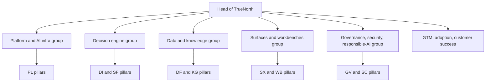

# Roadmap & delivery

## 1. Front matter

| Field | Value |
|---|---|
| Doc ID | DLV-ROADMAP |
| Authoring unit | U26 Roadmap & Delivery |
| Voice | VP of program management |
| Pillars referenced | all (delivery sequencing) |
| Version | 1.0 |

## 2. Delivery thesis

TrueNorth cannot be delivered as a big bang. Its value compounds — the decision engine is only as good as the knowledge graph, which is only as good as the data fabric — but its trust is earned incrementally, decision by decision. The delivery strategy therefore front-loads the unglamorous foundation (data fabric, knowledge graph, governance spine, security) and the meeting/alignment layer that produces early, visible value, then turns on the judgment engine in a tightly-scoped pilot before expanding to department workbenches, then simulation and the org twin, and finally the ecosystem. Every phase ships something a real user relies on; nothing is built purely as scaffolding for a later phase.

## 3. Phases

### Phase 0 — Foundation & pilot (months 0–6)
Stand up the data fabric (DF-1..6), the knowledge graph core (KG-1..4), the governance spine (GV-1..3) and security baseline (SC-1, SC-2, SC-4), the model gateway and evaluation harness (PL-1, PL-2, PL-4), and meeting intelligence (MI-1..3). Deliverable: meeting capture, institutional memory, and goal/alignment tracking (GA-1..3) for one pilot business unit. No verdicts yet — the system listens, remembers, and aligns. This phase earns the right to judge by first proving it understands.

### Phase 1 — Decision engine GA (months 6–12)
Turn on the judgment core: DI-1..8 at S3/S4 stakes first, with the full governance gates (GV-2, GV-4), audit/replay (GV-3), and model risk program (GV-7). Add evidence/precedent assembly and the multi-lens panel with a conservative initial lens set (financial, strategic, risk, legal, people). Deliverable: TrueNorth issues governed recommendations with minority reports on departmental decisions in the pilot unit, with calibration tracking running from day one.

### Phase 2 — Workbench expansion (months 12–20)
Build the WB-0 framework and roll out department workbenches (WB-FIN, WB-OPS, WB-ENG, WB-HR, WB-GTM, WB-CS, WB-LGL, WB-CDV) across the enterprise, with the surfaces (SX-1..4) and in-flow plugins that make them usable where people work. Raise the engine to S1/S2 stakes with board-level gates. Add full compliance packs (GV-5) and certifications (SC-6). Deliverable: every department has decision support in its own workflow; adoption machinery (AD-1..3) drives usage.

### Phase 3 — Simulation & org twin (months 20–28)
Deliver the full SF pillar — forecasting library, scenarios, Monte Carlo, the org digital twin (SF-4), war-gaming (SF-5), and backtesting (SF-6) — wired into the lenses and pre-mortems. Add external/market signals (DF-7) and initiative/bet portfolio (GA-6). Deliverable: decisions are evaluated against simulated cross-department consequences and stress scenarios; value realization (AD-4) attributes ROI.

### Phase 4 — Ecosystem (months 28+)
Open the API and extension platform (SX-5), partner/marketplace, fine-tuning and domain adaptation (PL-5), advanced reliability and multi-region DR (PL-7), and co-design loops (AD-5). Deliverable: TrueNorth is an extensible platform third parties and the customer's own teams build on.

```mermaid
gantt
  title TrueNorth delivery roadmap (months)
  dateFormat X
  axisFormat %s
  section Phase 0 Foundation
  Data fabric and KG core      :p0a, 0, 6
  Governance and security base :p0b, 0, 6
  Meeting and alignment        :p0c, 2, 4
  section Phase 1 Decision engine
  DI engine S3 S4 plus gates   :p1a, 6, 6
  Calibration and model risk   :p1b, 8, 4
  section Phase 2 Workbenches
  WB framework and rollout     :p2a, 12, 8
  S1 S2 stakes and compliance  :p2b, 14, 6
  section Phase 3 Simulation
  Forecasting and org twin     :p3a, 20, 8
  External signals and ROI     :p3b, 22, 6
  section Phase 4 Ecosystem
  API platform and fine-tuning :p4a, 28, 8
```

## 4. Build organization

Six groups, each owning coherent pillars: Platform/AI-infra (PL), Decision engine (DI, SF), Data & knowledge (DF, KG), Surfaces & workbenches (SX, WB, MI, GA split with engine), Governance/security/responsible-AI (GV, SC), and GTM/adoption (AD). A standing red team and model-risk function (GV-7) report into governance but evaluate all groups.

## 5. TCO envelope (order-of-magnitude, deployment-dependent)

| Cost driver | Notes |
|---|---|
| Engineering build | The dominant cost through Phase 2; ~6 pillar groups for ~30 months |
| LLM inference | Model gateway routing by stakes (PL-1) is the key cost lever; S4 routine decisions use cheaper models, S1 the most capable |
| Data integration | Connector build and per-tenant integration; the largest hidden enterprise cost |
| Infrastructure | Graph store, retrieval infra, simulation compute; multiplies for VPC/on-prem/air-gapped |
| Compliance & certification | SOC 2 / ISO / FedRAMP programs (SC-6), ongoing |
| Customer success & change management | Heavy through rollout; the difference between adoption and shelfware |

Cost discipline is enforced by PL-6 observability and stakes-based model routing: most decisions are S3/S4 and must run on economical models, reserving frontier-model spend for high-stakes evaluations.

## 6. Buy-vs-build

| Component | Stance | Rationale |
|---|---|---|
| Foundation LLMs | Buy (via gateway PL-1) | Frontier models are not a differentiator to build; keep multi-vendor optionality and exit paths |
| Decision engine, lenses, calibration (DI) | Build | This is the core IP and differentiator |
| Org knowledge graph & GraphRAG (KG) | Build core, buy components | Graph store and vector infra can be bought; the ontology and decision genealogy are proprietary |
| Connectors (DF-1) | Buy/partner where mature, build for gaps | Don't rebuild commodity connectors; build the privacy-filtering and lineage layer |
| Identity, encryption primitives (SC) | Buy/integrate | Standard enterprise security building blocks |
| Simulation/forecasting libraries (SF) | Buy/open-source base, build the twin | Forecasting methods are commodities; the org digital twin is proprietary |
| Audit/observability infra | Buy base, build the decision-replay layer | Generic logging is bought; reproducible verdict replay (GV-3) is built |

## 7. GTM & pricing sketch

- **Beachhead:** land in one decision-heavy function (often finance or operations) in one business unit, prove decision-quality lift and time saved, expand laterally.
- **Packaging:** platform fee (fabric, graph, governance, engine) plus per-workbench modules plus usage-based inference component; high-stakes tiers priced higher to reflect deeper evaluation.
- **Deployment tiers:** SaaS (fastest, lowest cost) → VPC → on-prem → air-gapped (regulated/defense), each a price step.
- **Proof model:** value realization (AD-4) attributes ROI to decisions, giving the CFO a defensible payback case — essential given the activist-investor skepticism about paying for "AI judgment."
- **Land-and-expand metric:** decisions-under-management and active decision-makers, not seat licenses.

## 8. Top delivery risks

- Foundation underinvestment: rushing to verdicts before the graph and data are trustworthy produces confident garbage and burns trust irrecoverably. Mitigation: Phase 0 has no verdicts.
- Integration drag: enterprise data integration is where the schedule dies. Mitigation: buy mature connectors, staff integration heavily, set realistic per-tenant SLAs.
- Trust collapse from an early high-stakes miss: a wrong S1 endorse early would be fatal to adoption. Mitigation: stakes ramp (S3/S4 before S1/S2), calibration from day one, mandatory minority reports.
- Cost runaway on inference: Mitigation: stakes-based routing (PL-1) and PL-6 cost governance from Phase 1.
- Change-management failure: the best engine is worthless unused. Mitigation: in-flow surfaces, AD program funded as a first-class workstream, not an afterthought.

## 9. Open questions

- Should Phase 1 GA be single-pilot-unit or multi-unit to gather broader calibration data sooner, accepting more rollout risk?
- How aggressively should S1/S2 stakes be enabled — gated per customer ethics-board approval, or on a fixed schedule?
- What is the minimum certification set (SC-6) required before regulated-industry sales, and does it gate Phase 2?

## 10. Dependencies & references

| Reference | Type | Why |
|---|---|---|
| DF, KG, GV, SC, PL | Canonical pillars | Phase 0 foundation |
| MI, GA | Canonical pillars | Phase 0 early value |
| DI | Canonical pillar | Phase 1 judgment core GA |
| SX, WB, AD | Canonical pillars | Phase 2 workbench rollout and adoption |
| SF | Canonical pillar | Phase 3 simulation and twin |
| PL-1, PL-6 | Canonical L2 | Cost governance via stakes-based routing |
| GV-5, SC-6 | Canonical L2 | Compliance packs and certifications gating regulated sales |
| AD-4 | Canonical L2 | ROI attribution for the value case |
| U25 Responsible-AI Deep Dive | Work unit | Stakes ramp and oversight gating delivery |
| All catalog and perspective units | Work unit | Source of the capabilities being sequenced |
