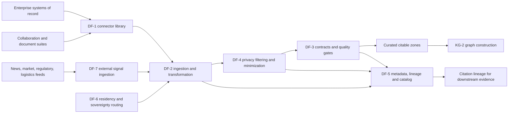
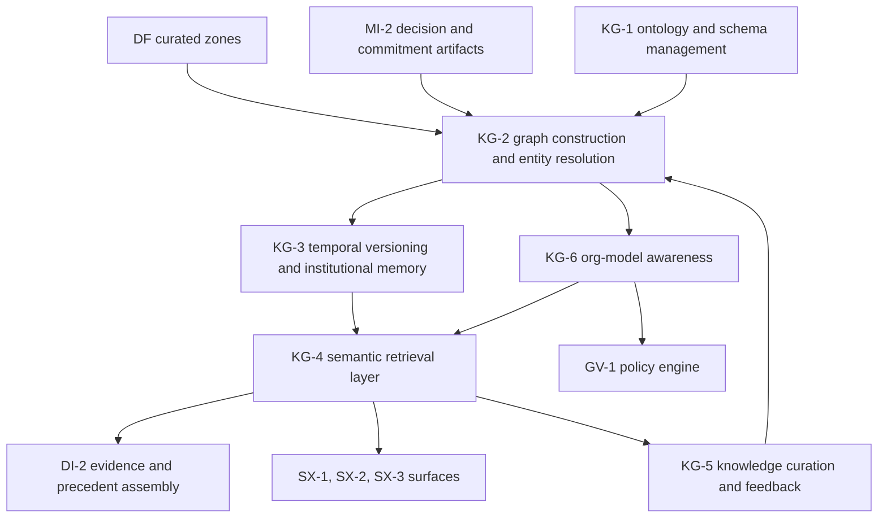
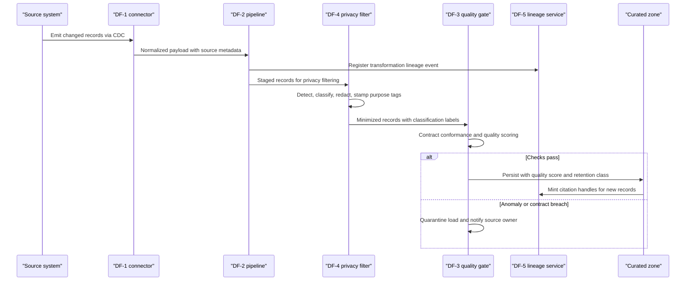
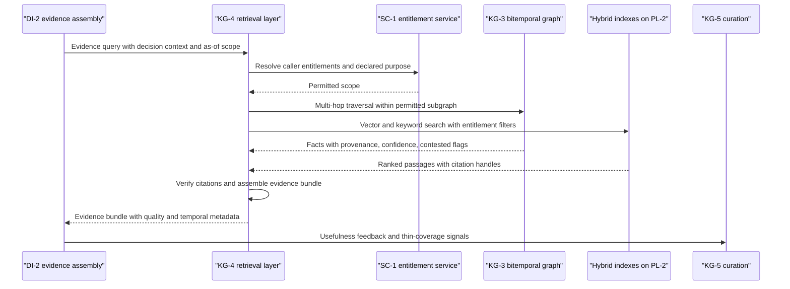

# Data & Integration Fabric (DF) and Organizational Knowledge Graph (KG) feature catalog

## 1. Front matter

| Field | Value |
|---|---|
| Doc ID | CAT-DF-KG |
| Pillars covered | DF, KG |
| Owning unit | U4 Catalog DF+KG |
| Version | 1.0 |

## 2. Pillar overview & scope boundary

**DF — Data & Integration Fabric.** DF is the supply chain that turns every enterprise signal — ERP postings, CRM opportunities, HRIS movements, MES telemetry, documents, chat threads, and external market feeds — into governed, privacy-filtered, quality-scored, residency-compliant data that downstream pillars can cite with confidence. Every recommendation TrueNorth issues is only as defensible as the evidence beneath it; DF therefore treats citability as a first-class product requirement: each persisted record carries provenance, a quality score, purpose tags, and a resolvable lineage handle from source field to eventual recommendation citation. DF shall operate identically across SaaS, VPC, on-prem, and air-gapped deployments, with sovereignty routing as an enforcement layer rather than a documentation exercise.

**KG — Organizational Knowledge Graph & Institutional Memory.** KG is the living model of the organization: who exists, what they are trying to achieve, what they decided, what they committed to, and what actually happened. It converts DF's curated outputs and meeting artifacts into a bitemporal graph of People, Teams, Goals, Decisions, Meetings, Projects, Metrics, Risks, Assets, Customers, Suppliers, Policies, and Contracts, resolves duplicate entities across systems, preserves decision genealogy even as employees depart, and exposes a permission-aware semantic retrieval layer that assembles citable evidence bundles for the decision engine and every surface. KG is the institutional memory that makes precedent retrieval, alignment scoring, and outcome learning possible.

**NOT in this pillar (DF and KG combined):**

- Meeting capture, transcription, and decision/commitment extraction from conversations — MI-1 and MI-2 (KG-2 consumes their outputs as artifacts).
- Recording consent and per-jurisdiction meeting privacy controls — MI-6 (DF-4 enforces purpose tags MI-6 supplies).
- Strategy and OKR graph semantics, cascade logic, and alignment scoring — GA-1 and GA-4 (KG stores the nodes; GA defines their meaning and scoring).
- Evidence weighing, precedent ranking inside a verdict, and recommendation synthesis — DI-2 and DI-4 (KG-4 delivers evidence bundles; DI judges them).
- Vector database serving, embedding model hosting, and retrieval infrastructure operations — PL-2 (KG-4 is the semantic product layer on that infrastructure).
- Identity, RBAC/ABAC policy administration, and credential vaulting — SC-1 and SC-2 (KG-4 and DF-1 enforce entitlements those pillars define).
- Prompt-injection and retrieval-poisoning defense — SC-3 (DF and KG expose hooks; SC-3 owns the controls).
- Immutable audit logging and replay tooling — GV-3 (DF-5 and KG-3 supply the lineage and as-of substrate GV-3 replays against).
- Forecast models and simulation runs that read the graph — SF-1 through SF-6.
- Public APIs, webhooks, and admin console surfaces — SX-5 and SX-1 (DF and KG define the capabilities those surfaces expose).

## 3. L2 index & capability map

| L2 ID | Name (canonical) |
|---|---|
| DF-1 | Connector library |
| DF-2 | Ingestion & transformation pipelines |
| DF-3 | Data contracts & quality |
| DF-4 | Privacy filtering & minimization |
| DF-5 | Metadata, lineage & catalog |
| DF-6 | Residency & sovereignty routing |
| DF-7 | External & market signal ingestion |

| L2 ID | Name (canonical) |
|---|---|
| KG-1 | Ontology & schema management |
| KG-2 | Graph construction & entity resolution |
| KG-3 | Temporal versioning & institutional memory |
| KG-4 | Semantic retrieval layer |
| KG-5 | Knowledge curation & feedback |
| KG-6 | Org-model awareness |

## 4. Feature trees (per L2 group)

### DF-1 Connector library

Prebuilt, versioned connectors to enterprise systems of record and collaboration suites (ERP/CRM/HRIS/PLM/MES/ITSM/lakehouse/M365/Google/Slack/Teams/Zoom/SharePoint/Confluence/Jira).

#### DF-1-1 Prebuilt connector catalog

- **User story:** As a data platform administrator, I want certified connectors for our ERP, CRM, HRIS, PLM, MES, ITSM, lakehouse, and collaboration systems, so that I can connect TrueNorth to systems of record in days without custom integration engineering.
- **Description:** TrueNorth shall ship a catalog of maintained connectors covering, at general availability: SAP S/4HANA and ECC, Oracle Fusion/EBS, Microsoft Dynamics 365 (ERP); Salesforce, HubSpot, Dynamics Sales (CRM); Workday, SAP SuccessFactors (HRIS); Siemens Teamcenter, PTC Windchill (PLM); OPC UA gateways and major MES/historian platforms (MES); ServiceNow, Jira Service Management (ITSM); Snowflake, Databricks, BigQuery, Redshift, generic JDBC (lakehouse); Microsoft 365 including SharePoint, Exchange, and Teams; Google Workspace; Slack; Zoom; Confluence; Jira. Each connector declares its capabilities and minimum permission scopes so administrators never over-grant access.

##### DF-1-1-1 Connector capability manifest

- **Behavior:** Every connector publishes a machine-readable manifest declaring supported sync modes (batch, CDC, streaming, webhook, document crawl), auth modes, schema-discovery support, upstream rate limits, data domains touched, and residency constraints; the platform refuses configurations the manifest does not support.
- **Data touched:** Connector metadata only; no tenant business data.
- **Model/AI involvement:** None.
- **UX surface:** SX-1 admin console; SX-5 for programmatic catalog queries.
- **Acceptance criteria:** Manifest schema validates for 100% of shipped connectors; an unsupported mode selection is blocked with a manifest-cited reason; manifests are queryable via API.

##### DF-1-1-2 Guided connection setup

- **Behavior:** A setup flow recommends least-privilege scopes per declared use, runs a test connection, performs schema discovery, and shows a sample-data preview (privacy-masked) before any persistent ingestion is enabled.
- **Data touched:** Connection configuration; transient sample records (never persisted).
- **Model/AI involvement:** None.
- **UX surface:** SX-1.
- **Acceptance criteria:** Setup completes without documentation for a trained admin in under 30 minutes per source; sample preview applies DF-4 masking; zero records persist before explicit activation.
- **L5 notes:** Failure mode — upstream scope insufficient mid-setup: the flow must name the missing scope exactly rather than failing generically.

##### DF-1-1-3 Connector certification tiers

- **Behavior:** Connectors are labeled certified (TrueNorth-maintained, full conformance suite), partner (vendor-maintained, conformance-verified), or community (unverified, blocked by default in regulated tenants); conformance results are published per version.
- **Data touched:** Certification metadata.
- **Model/AI involvement:** None.
- **UX surface:** SX-1.
- **Acceptance criteria:** Tier visible at selection time; tenant policy can restrict installable tiers; conformance reports downloadable.

#### DF-1-2 Connector lifecycle & versioning

- **User story:** As a data platform administrator, I want connectors versioned and upgraded on my schedule, so that upstream API changes never silently break the evidence supply for live decisions.
- **Description:** TrueNorth shall version every connector semantically, support side-by-side versions per tenant, detect upstream API changes proactively, and manage deprecations with explicit migration windows.

##### DF-1-2-1 Version pinning & staged rollout

- **Behavior:** Tenants pin connector versions per connection; upgrades roll out to a sandbox connection first with output-diff comparison against the pinned version before promotion.
- **Data touched:** Connection configs; shadow ingestion outputs (sandbox-scoped).
- **Model/AI involvement:** None.
- **UX surface:** SX-1.
- **Acceptance criteria:** No connector auto-upgrades without tenant opt-in; output diff report produced for every staged upgrade; rollback to prior version completes in under 15 minutes.

##### DF-1-2-2 Upstream API change detection

- **Behavior:** Scheduled probes compare upstream schemas and API behavior against the manifest; detected drift raises a DF-5-4 change notification and, where breaking, pauses affected pipelines with a quarantine notice rather than ingesting malformed data.
- **Data touched:** Probe results; pipeline state.
- **Model/AI involvement:** None.
- **UX surface:** SX-1 alerts; SX-3 notifications to owning admins.
- **Acceptance criteria:** Breaking upstream change detected before corrupted records reach curated zones in 100% of conformance-suite scenarios; alert includes affected downstream datasets from DF-5 lineage.

##### DF-1-2-3 Deprecation & migration assistant

- **Behavior:** When a connector version is end-of-lifed, the assistant lists affected connections, generates a migration plan, and tracks completion; hard cutoffs require explicit tenant acknowledgment.
- **Data touched:** Connection configs, migration plan records.
- **Model/AI involvement:** None.
- **UX surface:** SX-1.
- **Acceptance criteria:** Minimum 180-day deprecation window for certified connectors; no connection disabled without two acknowledged notices.

#### DF-1-3 Custom connector SDK

- **User story:** As an integration engineer, I want an SDK and declarative spec for connecting in-house systems, so that proprietary sources participate in the fabric with the same governance as certified connectors.
- **Description:** TrueNorth shall provide a connector SDK (declarative configuration for REST/JDBC/file sources; code-level SDK for complex protocols) whose outputs are indistinguishable from certified connectors at the pipeline boundary: same manifests, same lineage events, same privacy hooks.

##### DF-1-3-1 Declarative connector specification

- **Behavior:** A YAML/JSON specification defines endpoints, pagination, incremental keys, auth, and field mappings; the platform compiles it into a runnable connector with a generated manifest.
- **Data touched:** Connector spec; tenant source data at runtime.
- **Model/AI involvement:** Generative — optional drafting of a spec skeleton from API documentation supplied by the engineer, always human-reviewed before activation.
- **UX surface:** SX-1 spec editor; SX-5 for CI-driven deployment.
- **Acceptance criteria:** A REST source with cursor pagination is connectable with spec-only (no code); generated manifest passes the same validation as certified connectors.

##### DF-1-3-2 Conformance test harness

- **Behavior:** Custom connectors must pass a conformance suite (schema stability, incremental correctness, rate-limit behavior, error taxonomy, lineage emission) before production activation; results attach to the connector record.
- **Data touched:** Test fixtures; conformance reports.
- **Model/AI involvement:** None.
- **UX surface:** SX-5 (CI integration); SX-1 results view.
- **Acceptance criteria:** Production activation blocked on conformance failure; suite runs in under 20 minutes for declarative connectors.

##### DF-1-3-3 Sandboxed execution runtime

- **Behavior:** Custom connector code executes in an isolated runtime with no access to other tenants, other connections' credentials, or curated zones; egress is restricted to declared endpoints. Isolation primitives are consumed from SC-4.
- **Data touched:** Connector runtime state only.
- **Model/AI involvement:** None.
- **UX surface:** SX-1 runtime monitoring.
- **Acceptance criteria:** Undeclared egress attempt is blocked and alerted; resource limits enforced per connector.
- **L5 notes:** Air-gapped deployments disable any connector whose manifest declares external endpoints.

#### DF-1-4 Connector health & observability

- **User story:** As a data platform operator, I want per-connection health, throughput, and error visibility, so that I can fix supply problems before stale evidence reaches decision evaluations.
- **Description:** TrueNorth shall expose connection-level health states, sync histories, error taxonomies, and credential-expiry warnings, with alert routing to owning teams.

##### DF-1-4-1 Health dashboard & alerting

- **Behavior:** Each connection shows status (healthy, degraded, failed, paused), last successful sync, records moved, error breakdown by taxonomy class, and trend lines; threshold and anomaly alerts route to configured owners.
- **Data touched:** Operational telemetry; no business data content.
- **Model/AI involvement:** Extractive — anomaly detection on sync-volume time series.
- **UX surface:** SX-1; SX-3 alert delivery.
- **Acceptance criteria:** Failed sync alerts within 5 minutes; every error carries a taxonomy class and remediation hint; telemetry exportable to tenant observability stacks via SX-5.

##### DF-1-4-2 Credential expiry & rotation warnings

- **Behavior:** The platform tracks credential and certificate expiry per connection and warns at 30/14/3 days; rotation is performed against the secrets capability of SC-2 without pipeline downtime where the source supports overlapping credentials.
- **Data touched:** Credential metadata only (never secret values, which SC-2 vaults).
- **Model/AI involvement:** None.
- **UX surface:** SX-1; SX-3.
- **Acceptance criteria:** Zero unplanned expiry outages for connections with rotation warnings acknowledged; secret values never appear in DF logs or telemetry.

### DF-2 Ingestion & transformation pipelines

Batch, CDC, and streaming ingestion with schema mapping and document parsing, producing canonical staged records ready for privacy filtering and quality gating.

#### DF-2-1 Batch ingestion & scheduling

- **User story:** As a data engineer, I want dependency-aware scheduled batch loads with safe backfills, so that periodic sources land completely and predictably.
- **Description:** TrueNorth shall run full and incremental batch loads on cron or event triggers, with dependency ordering, idempotent re-runs, and managed backfill.

##### DF-2-1-1 Incremental watermark management

- **Behavior:** Per-source watermarks (timestamps, cursors, sequence keys) are tracked transactionally; failed runs resume from the last committed watermark with no gaps or duplicates.
- **Data touched:** Watermark state; staged records.
- **Model/AI involvement:** None.
- **UX surface:** SX-1 pipeline detail.
- **Acceptance criteria:** Kill-and-resume conformance test yields zero duplicates and zero gaps; watermark manually adjustable with an audited reason.

##### DF-2-1-2 Backfill & replay orchestration

- **Behavior:** Operators can backfill a date range or replay from raw landing storage through current transformation, privacy, and quality logic; replays are labeled so downstream consumers can distinguish reprocessed records, and DF-5 lineage records the replay generation.
- **Data touched:** Raw landing zone; staged and curated records.
- **Model/AI involvement:** None.
- **UX surface:** SX-1.
- **Acceptance criteria:** Replay applies current DF-4 privacy policy (not the historical one); downstream KG-2 receives replay markers; throughput supports 1 TB/day/tenant backfill (assumption, see section 6).

#### DF-2-2 Change data capture

- **User story:** As a data engineer, I want log-based CDC from transactional systems, so that the knowledge graph reflects operational reality within minutes, not days.
- **Description:** TrueNorth shall capture inserts, updates, and deletes from source transaction logs or vendor change APIs, preserving ordering and propagating deletions.

##### DF-2-2-1 Log-based capture adapters

- **Behavior:** CDC adapters consume database logs or vendor change feeds per the DF-1-1-1 manifest, emit ordered change events with before/after images where available, and checkpoint offsets durably.
- **Data touched:** Change events; offset state.
- **Model/AI involvement:** None.
- **UX surface:** SX-1.
- **Acceptance criteria:** End-to-end change latency p95 under 5 minutes for supported sources; ordering preserved per entity key.

##### DF-2-2-2 Ordering & effectively-once delivery

- **Behavior:** Per-key ordering is guaranteed into staging; duplicate suppression via change-event identity keys yields effectively-once semantics into curated zones.
- **Data touched:** Staged change streams.
- **Model/AI involvement:** None.
- **UX surface:** None (infrastructure behavior surfaced in SX-1 metrics).
- **Acceptance criteria:** Out-of-order injection tests resolve to correct final state; duplicate-delivery tests produce single curated records.

##### DF-2-2-3 Deletion & erasure propagation

- **Behavior:** Source deletions propagate as tombstones through staging into curated zones and KG-2; privacy-erasure requests (e.g., GDPR right to erasure, executed under GV-5 procedures) propagate as hard erasure including derived KG assertions and DF-5 citation tombstoning.
- **Data touched:** Tombstones; curated records; derived graph assertions.
- **Model/AI involvement:** None.
- **UX surface:** SX-1 erasure tracking.
- **Acceptance criteria:** Erasure completes across fabric, graph, and indexes within 72 hours of request execution; DF-5-3-3 marks affected citations rather than leaving dangling references.
- **L5 notes:** Edge case — erased evidence cited by a closed decision record: the decision record retains the citation handle and verdict, but the handle resolves to a tombstone explaining lawful erasure; the decision artifact itself is governed by GV-3 retention.

#### DF-2-3 Streaming ingestion

- **User story:** As an operations data engineer, I want event-stream and webhook ingestion with windowing and late-arrival handling, so that telemetry and operational events are usable as near-real-time evidence.
- **Description:** TrueNorth shall ingest from message buses (Kafka and equivalents), webhooks, and MES/IoT gateways, applying windowed aggregation and late-event correction before staging.

##### DF-2-3-1 Stream adapter & webhook gateway

- **Behavior:** Managed consumers subscribe to declared topics; an authenticated webhook gateway validates signatures and applies per-source throttles; both emit into the same staging contract as batch and CDC.
- **Data touched:** Event payloads; consumer offsets.
- **Model/AI involvement:** None.
- **UX surface:** SX-1; SX-5 webhook endpoint management.
- **Acceptance criteria:** Sustained 10k events/second/tenant (assumption, see section 6); webhook replay attack rejected by signature and timestamp checks.

##### DF-2-3-2 Late & out-of-order event handling

- **Behavior:** Configurable lateness windows; late events trigger recomputation of affected aggregates and corrective updates downstream, flagged as revisions in lineage.
- **Data touched:** Windowed aggregates; revision markers.
- **Model/AI involvement:** None.
- **UX surface:** SX-1.
- **Acceptance criteria:** Aggregate correctness restored after late-arrival injection within one processing cycle; revisions visible in DF-5 lineage.

#### DF-2-4 Schema mapping & transformation studio

- **User story:** As a data engineer, I want visual and code-based mapping from source schemas to canonical staging schemas with AI-suggested mappings and dry runs, so that onboarding a new source is fast and verifiably correct.
- **Description:** TrueNorth shall provide a mapping studio binding discovered source schemas to canonical staging entities, with versioned, reviewable, testable transformations.

##### DF-2-4-1 AI-assisted mapping suggestions

- **Behavior:** A model proposes field mappings and type conversions from schema names, profiled values, and prior tenant mappings; every suggestion shows rationale and confidence and requires human acceptance before activation.
- **Data touched:** Source schema metadata; profiled samples (transient, DF-4-masked).
- **Model/AI involvement:** Generative — mapping proposal via the PL-1 model gateway; never auto-applied.
- **UX surface:** SX-1 studio.
- **Acceptance criteria:** ≥80% of fields correctly suggested on conformance sources; acceptance/rejection captured for suggestion-quality tracking; zero unaccepted suggestions executed.

##### DF-2-4-2 Transformation dry run & diff

- **Behavior:** Mapping changes execute against a sample or full snapshot in dry-run mode, producing record-level diffs versus current outputs before promotion.
- **Data touched:** Snapshot copies in an isolated workspace.
- **Model/AI involvement:** None.
- **UX surface:** SX-1.
- **Acceptance criteria:** Diff report covers added/removed/changed fields and row-level deltas; promotion blocked until dry run reviewed for contract-bound datasets (DF-3-1).

##### DF-2-4-3 Reusable mapping templates

- **Behavior:** Mappings for common source families (e.g., a standard SAP module to canonical finance staging) ship as templates, parameterized per tenant customization.
- **Data touched:** Mapping definitions.
- **Model/AI involvement:** None.
- **UX surface:** SX-1.
- **Acceptance criteria:** Template instantiation plus parameter fill completes a standard source mapping in under one day of engineer effort.

#### DF-2-5 Document parsing & enrichment

- **User story:** As a knowledge platform owner, I want documents parsed with layout awareness and enriched for retrieval, so that contracts, specs, and slide decks become citable evidence at paragraph granularity.
- **Description:** TrueNorth shall parse PDF, Office, HTML, email, and image formats with OCR, layout analysis, table extraction, language detection, and retrieval-ready chunking, preserving anchors back to exact source spans.

##### DF-2-5-1 Layout-aware parsing & OCR

- **Behavior:** Parsers reconstruct reading order, headings, lists, footnotes, and page anchors; scanned documents pass through OCR with per-span confidence; low-confidence spans flagged rather than silently included.
- **Data touched:** Source documents; parsed structural representation.
- **Model/AI involvement:** Extractive — layout and OCR models.
- **UX surface:** SX-1 parse-quality review.
- **Acceptance criteria:** Span-level anchors resolve to page/coordinates for citation rendering; OCR confidence below threshold routes to a review queue.

##### DF-2-5-2 Table & figure extraction

- **Behavior:** Tables extract to structured rows with header inference; figures and charts capture captions and, where extractable, underlying series; extraction confidence is stamped per artifact.
- **Data touched:** Parsed tables/figures linked to source spans.
- **Model/AI involvement:** Extractive.
- **UX surface:** SX-1.
- **Acceptance criteria:** ≥95% cell-accuracy on the table-extraction golden set (assumption); failed extractions degrade to cited image spans, never fabricated values.

##### DF-2-5-3 Retrieval-ready chunking & pre-tagging

- **Behavior:** Parsed documents are chunked along structural boundaries with overlap policies, pre-tagged with detected entities and topics to accelerate KG-2 extraction, and registered with DF-5 lineage at chunk granularity.
- **Data touched:** Chunk store; pre-tag annotations.
- **Model/AI involvement:** Extractive — entity/topic pre-tagging.
- **UX surface:** None directly; consumed by KG-2 and PL-2 indexing.
- **Acceptance criteria:** Every chunk carries a resolvable source-span anchor; re-chunking on policy change is replayable via DF-2-1-2.

#### DF-2-6 Pipeline orchestration & failure management

- **User story:** As a platform operator, I want unified orchestration with retries, dead-letter handling, and SLA-aware prioritization, so that the fabric degrades predictably under partial failure.
- **Description:** TrueNorth shall orchestrate all DF-2 workloads with dependency graphs, classed retry policies, dead-letter queues with triage tooling, and priority lanes for decision-critical datasets.

##### DF-2-6-1 Retry classes & dead-letter triage

- **Behavior:** Errors classify as transient (auto-retry with backoff), structural (pause and alert), or data-level (route record to dead-letter queue); a triage console supports inspect, fix-and-replay, or discard-with-reason on dead-lettered records.
- **Data touched:** Dead-letter records; triage decisions (audited).
- **Model/AI involvement:** None.
- **UX surface:** SX-1.
- **Acceptance criteria:** No silent record drops — every non-persisted record is dead-lettered or tombstoned with a reason; replay from triage preserves original lineage identity.

##### DF-2-6-2 Priority lanes & degradation policy

- **Behavior:** Datasets feeding active decision evaluations (signaled via DF-3-4 SLAs) get priority compute lanes; under resource pressure the orchestrator sheds low-priority loads first and reports degradation status to DF-5 and consuming pillars.
- **Data touched:** Scheduling state.
- **Model/AI involvement:** None.
- **UX surface:** SX-1.
- **Acceptance criteria:** Under simulated 50% capacity loss, S1/S2-supporting datasets (per stakes-tier tagging) maintain freshness SLAs while routine loads queue.

### DF-3 Data contracts & quality

Source-owner contracts, quality scoring, anomaly quarantine, and freshness SLAs so downstream consumers always know how much to trust a dataset.

#### DF-3-1 Data contract registry

- **User story:** As a source-system owner, I want an explicit contract for what TrueNorth consumes from my system, so that schema, semantics, freshness, and change expectations are agreed rather than assumed.
- **Description:** TrueNorth shall maintain versioned data contracts per consumed dataset covering schema, semantics, freshness, completeness, ownership, and change-notification policy, signed by the source owner and the platform team.

##### DF-3-1-1 Contract authoring & negotiation workflow

- **Behavior:** Contracts draft from observed schemas and proposed SLAs; the source owner reviews, amends, and signs; renegotiation triggers on upstream change detection (DF-1-2-2) or repeated breach.
- **Data touched:** Contract documents; signature records.
- **Model/AI involvement:** Generative — first-draft contract text from schema and profiling, human-edited.
- **UX surface:** SX-1; SX-3 review notifications.
- **Acceptance criteria:** No dataset reaches curated zones without an active contract or an explicit, audited waiver; contract history immutable.

##### DF-3-1-2 Contract conformance checking

- **Behavior:** Every pipeline run validates payloads against the active contract (schema, nullability, enumerations, semantic checks); violations route to DF-3-3 quarantine and notify both parties.
- **Data touched:** Validation results.
- **Model/AI involvement:** None.
- **UX surface:** SX-1.
- **Acceptance criteria:** 100% of curated writes are contract-validated; violation alerts identify the breached clause.

#### DF-3-2 Quality rule engine & scoring

- **User story:** As a decision-evidence consumer, I want field- and dataset-level quality scores, so that evidence reliability is quantified rather than guessed.
- **Description:** TrueNorth shall evaluate completeness, validity, consistency, timeliness, and uniqueness rules per dataset, compose them into weighted quality scores at field and dataset levels, and publish scores into DF-5 metadata for every consumer.

##### DF-3-2-1 Rule library & custom rules

- **Behavior:** A standard rule library (null ratios, range/format checks, referential integrity, cross-field consistency, distribution checks) plus tenant-defined rules in a safe expression language; rules version with the contract.
- **Data touched:** Rule definitions; per-run results.
- **Model/AI involvement:** None (statistical profiling assists rule suggestion, human-approved).
- **UX surface:** SX-1.
- **Acceptance criteria:** Rule evaluation overhead under 10% of pipeline runtime at p95; rule changes are versioned and replayable.

##### DF-3-2-2 Composite quality scores

- **Behavior:** Weighted scores (0–100) compute per field and dataset per run, with trend history; weights are tenant-tunable per data domain; scores stamp onto curated records and propagate to KG-2 assertion confidence.
- **Data touched:** Score time series; curated record stamps.
- **Model/AI involvement:** None.
- **UX surface:** SX-1 dashboards.
- **Acceptance criteria:** Every curated record carries its dataset's score at write time; score history retained ≥24 months.

##### DF-3-2-3 Quality propagation to evidence consumers

- **Behavior:** Quality scores travel with citations so that evidence assembly under DI-2 and retrieval under KG-4 can weight or caveat low-quality evidence; sub-threshold datasets are flagged "use with caution" in every evidence bundle.
- **Data touched:** Citation metadata.
- **Model/AI involvement:** None.
- **UX surface:** Surfaced through DI and SX consumers of evidence bundles.
- **Acceptance criteria:** A quality downgrade reflects in newly assembled evidence bundles within one pipeline cycle; no evidence bundle omits available quality metadata.

#### DF-3-3 Anomaly detection & quarantine

- **User story:** As a data platform operator, I want anomalous loads quarantined automatically, so that corrupted or suspicious data never silently becomes decision evidence.
- **Description:** TrueNorth shall detect volume, distribution, and schema-drift anomalies per dataset and divert affected loads to a quarantine zone pending human release, with downstream consumers notified of the gap.

##### DF-3-3-1 Drift & volume anomaly detectors

- **Behavior:** Statistical baselines per dataset flag volume spikes/collapses, distribution shifts, and unexpected categorical values; sensitivity is tunable per dataset criticality; detections explain which baseline broke.
- **Data touched:** Profiling baselines; detection events.
- **Model/AI involvement:** Extractive — time-series and distribution models; no generative content.
- **UX surface:** SX-1; SX-3 alerts.
- **Acceptance criteria:** Seeded anomaly suite detection recall ≥95% with false-positive rate ≤5% at default sensitivity (assumption); every detection links the broken baseline.

##### DF-3-3-2 Quarantine & release workflow

- **Behavior:** Quarantined loads are inspectable with masked previews; release options are approve (with reason), discard, or reprocess-after-fix; repeated quarantines auto-open a contract renegotiation (DF-3-1-1). Quarantine events also notify SC-3 as a potential poisoning signal.
- **Data touched:** Quarantine zone; release decisions (audited).
- **Model/AI involvement:** None.
- **UX surface:** SX-1.
- **Acceptance criteria:** Quarantined data is never retrievable by KG-4 or any consumer; release actions are dual-controlled for S1/S2-feeding datasets.

#### DF-3-4 Freshness SLAs & breach management

- **User story:** As a decision facilitator, I want to know when evidence is stale, so that recommendations are never silently based on outdated data.
- **Description:** TrueNorth shall track freshness SLAs per dataset, alert on breach, and push staleness flags to all downstream consumers including active decision evaluations.

##### DF-3-4-1 SLA definition & tracking

- **Behavior:** Freshness targets (e.g., "financial actuals ≤24h old") bind to contracts; a freshness clock per dataset is queryable by any consumer; breach states are first-class dataset statuses.
- **Data touched:** SLA definitions; freshness telemetry.
- **Model/AI involvement:** None.
- **UX surface:** SX-1.
- **Acceptance criteria:** Freshness queryable via SX-5 API at ≤1-minute staleness of the freshness signal itself.

##### DF-3-4-2 Breach escalation & consumer notification

- **Behavior:** Breaches alert the source owner and platform team, and publish staleness flags so KG-4 evidence bundles and DI evaluations display "evidence stale as of X"; persistent breach escalates per contract terms.
- **Data touched:** Breach events; consumer notifications.
- **Model/AI involvement:** None.
- **UX surface:** SX-1; SX-3.
- **Acceptance criteria:** An in-flight evaluation consuming a breached dataset receives the staleness flag before verdict issuance; breach-to-alert latency under 5 minutes.

### DF-4 Privacy filtering & minimization

PII redaction, consent zones, and purpose tags applied pre-persistence, so that data that should not exist in TrueNorth never does.

#### DF-4-1 Sensitive-data detection & classification

- **User story:** As a privacy officer, I want every inbound record and document scanned for personal and sensitive data before persistence, so that minimization is enforced structurally, not procedurally.
- **Description:** TrueNorth shall detect PII, special-category data, financial account data, credentials/secrets, and tenant-defined sensitive classes across structured fields, documents, and transcripts, in all supported languages, and stamp classification labels that drive every downstream control.

##### DF-4-1-1 Multi-method detection engine

- **Behavior:** Layered detection — deterministic patterns, dictionaries/identifiers, and NER models — runs in-pipeline before any persistent write; per-detection confidence recorded; detection policies version per jurisdiction.
- **Data touched:** Transient inbound payloads; detection annotations.
- **Model/AI involvement:** Extractive — multilingual NER via models approved under GV-7.
- **UX surface:** SX-1 policy administration.
- **Acceptance criteria:** PII recall ≥99% on the per-language golden corpus (assumption, see section 6); detection runs in-line with ≤15% pipeline latency overhead at p95.
- **L5 notes:** Failure mode — detector outage: pipelines feeding people-related domains fail closed (hold at staging); non-personal telemetry may proceed under a tenant-set policy.

##### DF-4-1-2 Classification taxonomy & labeling

- **Behavior:** A layered taxonomy (public/internal/confidential/restricted × personal-data categories × tenant classes) labels every field, chunk, and record; labels are immutable facts in DF-5 metadata and drive DF-4-2 actions, retention classes, and SC-2 classification-aware controls.
- **Data touched:** Classification labels.
- **Model/AI involvement:** Extractive.
- **UX surface:** SX-1.
- **Acceptance criteria:** 100% of curated records carry classification labels; label disputes route to a review queue with audited overrides.

#### DF-4-2 Redaction & pseudonymization engine

- **User story:** As a privacy officer, I want policy-driven redaction and reversible pseudonymization, so that analytical and decision value is preserved without exposing identities beyond purpose.
- **Description:** TrueNorth shall apply per-class actions — drop, irreversible redaction, format-preserving masking, or reversible pseudonymization under tenant key control — before persistence, preserving document structure and referential integrity of pseudonyms across sources.

##### DF-4-2-1 Policy-driven redaction actions

- **Behavior:** Privacy policies map classification labels × purpose × jurisdiction to actions; actions execute deterministically in-pipeline; redacted spans remain visibly marked so readers know content was removed rather than absent.
- **Data touched:** Inbound payloads; action logs (content-free).
- **Model/AI involvement:** None at action time.
- **UX surface:** SX-1 policy editor with dry-run preview.
- **Acceptance criteria:** Policy dry run shows affected-record counts before activation; no curated record contains a class whose policy says drop/redact (verified by re-scan sampling).

##### DF-4-2-2 Reversible pseudonymization under key control

- **Behavior:** Stable per-tenant pseudonyms preserve joinability across sources; re-identification requires an authorized, dual-controlled, audited operation with keys held under SC-2 (BYOK honored); works-council-restricted zones may disable reversibility entirely.
- **Data touched:** Pseudonym vault mappings (isolated store).
- **Model/AI involvement:** None.
- **UX surface:** SX-1 (re-identification requests).
- **Acceptance criteria:** Same person → same pseudonym across all sources ≥99.5% (depends on KG-2 resolution); every re-identification event is audited with requester, approver, and purpose.

##### DF-4-2-3 Aggregation thresholds for people data

- **Behavior:** People-related metrics expose only above a configurable k-anonymity floor (default k=5); below-floor queries return suppressed results with an explanation; this guard enforces the red line against individual surveillance scoring at the data layer.
- **Data touched:** Aggregate query results.
- **Model/AI involvement:** None.
- **UX surface:** Enforced wherever people aggregates surface (consumed by KG-4 and workbenches).
- **Acceptance criteria:** No people-aggregate response below the floor in penetration-style query testing, including via repeated differencing queries (basic differencing defense documented).

#### DF-4-3 Consent zones & purpose tags

- **User story:** As a works council representative or DPO, I want data use bound to declared purposes and consent zones, so that information collected for one purpose cannot silently fuel another.
- **Description:** TrueNorth shall stamp purpose tags on all persisted data at ingest, maintain consent-zone definitions per jurisdiction and workforce agreement, and expose both for query-time enforcement by KG-4 and SC-1; meeting-derived data inherits consent state from MI-6.

##### DF-4-3-1 Purpose tag taxonomy & stamping

- **Behavior:** A tenant-configurable purpose taxonomy (e.g., decision-support, financial-reporting, workforce-planning) is stamped per dataset and inheritable per record; purposes are declared in the data contract and cannot be widened without renegotiation.
- **Data touched:** Purpose tags in DF-5 metadata and on records.
- **Model/AI involvement:** None.
- **UX surface:** SX-1.
- **Acceptance criteria:** Every curated record resolves to ≥1 purpose tag; purpose widening requires contract amendment with owner signature.

##### DF-4-3-2 Consent zone administration

- **Behavior:** Zones encode jurisdiction- or agreement-specific rules (e.g., a works-council zone excluding individual productivity signals); zone membership derives from org and location data in KG-6; rule changes apply prospectively with documented effective dates.
- **Data touched:** Zone definitions; zone-membership mappings.
- **Model/AI involvement:** None.
- **UX surface:** SX-1.
- **Acceptance criteria:** A record from a zone-restricted population is ingested only with the zone's permitted classes and purposes; zone rule changes produce a DF-5-4 impact report before activation.
- **L5 notes:** Red-line enforcement — no covert monitoring: any source whose manifest indicates individual behavioral telemetry requires an explicit, visible tenant policy plus consent-zone clearance, and is blocked by default.

#### DF-4-4 Minimization & retention pre-filters

- **User story:** As a privacy officer, I want default-deny field selection and ingest-time retention classes, so that TrueNorth holds the minimum data for the shortest justified time.
- **Description:** TrueNorth shall ingest only explicitly selected fields (default-deny), apply exclusion lists for never-ingest content, and assign retention classes at write time that downstream stores must honor.

##### DF-4-4-1 Field-level selection & exclusion policies

- **Behavior:** Connection setup requires explicit field selection justified against purpose tags; global exclusion lists (e.g., free-text health fields, credentials) override selections; periodic minimization reviews flag fields ingested but never consumed.
- **Data touched:** Selection policies; field-usage telemetry.
- **Model/AI involvement:** None.
- **UX surface:** SX-1.
- **Acceptance criteria:** Unselected fields never leave the connector boundary; quarterly minimization report lists zero-consumption fields with one-click deselection.

##### DF-4-4-2 Retention class assignment

- **Behavior:** Every record receives a retention class (e.g., transient-30d, operational-2y, decision-evidence-7y) derived from policy; expiry triggers deletion workflows across curated zones, KG assertions, and indexes, subject to legal holds managed under GV-5.
- **Data touched:** Retention class stamps; deletion job records.
- **Model/AI involvement:** None.
- **UX surface:** SX-1.
- **Acceptance criteria:** Expired-data sweep completes within 7 days of expiry; deletion certificates available for audit; legal holds suspend deletion with full audit trail.

### DF-5 Metadata, lineage & catalog

End-to-end metadata, field-level lineage, and the source-field → recommendation-citation lineage chain that makes every TrueNorth claim traceable.

#### DF-5-1 Unified metadata catalog

- **User story:** As a data steward, I want one searchable catalog of every dataset, field, owner, contract, and quality score in the fabric, so that consumers can discover and trust data without tribal knowledge.
- **Description:** TrueNorth shall maintain an automatically harvested catalog of datasets, fields, owners, classifications, purposes, contracts, quality scores, and freshness states, searchable by humans and queryable by services.

##### DF-5-1-1 Automated metadata harvesting

- **Behavior:** Catalog entries create and update automatically from connector manifests, mapping definitions, contract records, and pipeline runs; manual curation adds descriptions and stewards; staleness of catalog entries is itself tracked.
- **Data touched:** Metadata records only.
- **Model/AI involvement:** Generative — draft field descriptions from names and profiles, marked as drafts until steward approval.
- **UX surface:** SX-1; SX-2 (natural-language catalog questions); SX-5.
- **Acceptance criteria:** New curated dataset appears in catalog within one pipeline cycle; 100% of entries show owner, classification, purpose, quality, and freshness.

##### DF-5-1-2 Business glossary binding

- **Behavior:** Glossary terms (e.g., "net revenue," "active customer") bind to physical fields with steward-approved definitions; conflicting bindings are flagged for resolution; KG-1 ontology attributes reference glossary terms for semantic consistency.
- **Data touched:** Glossary terms; bindings.
- **Model/AI involvement:** Extractive — candidate binding suggestions.
- **UX surface:** SX-1.
- **Acceptance criteria:** A glossary term resolves to its physical fields and all dependent metrics; binding conflicts surface in steward queues.

#### DF-5-2 Field-level lineage capture

- **User story:** As a platform auditor, I want field-level lineage across every transformation, so that any curated value can be traced to its sources mechanically.
- **Description:** TrueNorth shall emit lineage events for every pipeline step at field granularity, compatible with open lineage standards, forming a queryable lineage graph spanning connector to curated zone to graph assertion.

##### DF-5-2-1 Transformation-level lineage events

- **Behavior:** Each run emits inputs, outputs, transformation version, mapping version, privacy-policy version, and quality results as lineage events; events are append-only and feed the GV-3 audit substrate.
- **Data touched:** Lineage event store.
- **Model/AI involvement:** None.
- **UX surface:** SX-1 lineage explorer.
- **Acceptance criteria:** Any curated field traces to source fields plus every transformation version applied; lineage emission failure blocks the pipeline write (no unlineaged curated data).

##### DF-5-2-2 Lineage graph queries & visualization

- **Behavior:** Upstream/downstream traversal queries and visual exploration support impact analysis, debugging, and audit; traversals filter by time so historical lineage reflects the versions active at that time.
- **Data touched:** Lineage graph (read).
- **Model/AI involvement:** None.
- **UX surface:** SX-1; SX-5.
- **Acceptance criteria:** Downstream impact query for a source field returns within 10 seconds at p95 on a graph of 10M lineage edges (assumption).

#### DF-5-3 Citation lineage resolution

- **User story:** As a decision reviewer, I want every citation in a recommendation to resolve to the exact source data as it existed when cited, so that I can verify evidence rather than trust assertions.
- **Description:** TrueNorth shall mint stable citation handles for curated records and document spans, and resolve any handle — including from years-old decision records — to the cited content, its as-of state, its quality score at citation time, and its full lineage; this is the substrate for GV-4 explainability and GV-3 replay.

##### DF-5-3-1 Citation handle minting

- **Behavior:** On curated write, each record and chunk receives an immutable handle encoding dataset, key, version, and span anchor; handles are the only reference form permitted in evidence bundles (KG-4-4) and decision records.
- **Data touched:** Handle registry.
- **Model/AI involvement:** None.
- **UX surface:** None directly (consumed by every citing surface).
- **Acceptance criteria:** Handles are globally unique per tenant and survive backfills/replays via generation mapping; minting adds ≤5ms p95 per record.

##### DF-5-3-2 As-of source resolution

- **Behavior:** Resolving a handle with an as-of timestamp returns the value/span as it existed then, the quality and freshness state at that moment, and the lineage chain active at that time, leveraging versioned curated storage and KG-3 bitemporality for graph-derived citations.
- **Data touched:** Versioned curated zones; lineage store.
- **Model/AI involvement:** None.
- **UX surface:** Rendered in decision records and evidence views via consuming pillars; SX-5 API.
- **Acceptance criteria:** Resolution p95 ≤2 seconds; resolution reproduces byte-identical document spans for unerased content.

##### DF-5-3-3 Broken-citation detection & tombstones

- **Behavior:** When cited content is erased (DF-2-2-3) or its retention expires, the handle resolves to a tombstone stating the lawful reason, erasure date, and surviving metadata (classification, quality score, dataset identity); scheduled sweeps detect and report citation breakage rates.
- **Data touched:** Tombstone records.
- **Model/AI involvement:** None.
- **UX surface:** Consuming decision views; SX-1 breakage reports.
- **Acceptance criteria:** Zero handles resolve to errors — every handle yields content or a tombstone; breakage rate per pillar reported monthly.

#### DF-5-4 Impact analysis & change notification

- **User story:** As a downstream capability owner, I want advance notice when upstream changes will affect my datasets, graph entities, or metrics, so that breakage is planned, not discovered.
- **Description:** TrueNorth shall compute downstream impact (datasets, KG entity types, metrics, active decision evaluations) for any proposed schema, mapping, contract, or privacy-policy change, and notify subscribers before activation.

##### DF-5-4-1 Downstream impact computation

- **Behavior:** Impact reports traverse the lineage graph from the changed element to all consumers, including KG assertions and bound metrics, with severity classification (cosmetic, additive, breaking).
- **Data touched:** Lineage graph (read); impact reports.
- **Model/AI involvement:** None.
- **UX surface:** SX-1.
- **Acceptance criteria:** Breaking changes cannot activate without an acknowledged impact report for contract-bound datasets.

##### DF-5-4-2 Change subscriptions & alerts

- **Behavior:** Teams and services subscribe to datasets, fields, or glossary terms; changes notify via SX-3 and SX-5 webhooks with the impact report attached.
- **Data touched:** Subscription records; notifications.
- **Model/AI involvement:** None.
- **UX surface:** SX-3; SX-5.
- **Acceptance criteria:** Notification delivered ≥5 business days before scheduled breaking change for contract-bound datasets (contract-configurable).

### DF-6 Residency & sovereignty routing

Region pinning and cross-border transfer controls so data location and movement obey law and tenant policy across all deployment models.

#### DF-6-1 Data zones & region pinning

- **User story:** As a CIO in a regulated multinational, I want datasets and tenants pinned to geographic zones, so that residency obligations are enforced by the platform rather than promised by policy.
- **Description:** TrueNorth shall define data zones (e.g., EU, US, country-specific), pin datasets/tenants/populations to zones, and place storage, pipeline compute, and index shards accordingly across SaaS, VPC, on-prem, and air-gapped deployments.

##### DF-6-1-1 Zone policy administration

- **Behavior:** Administrators define zones, assign datasets and populations (via classification and KG-6 location data), and set default zones per source; policies validate against the deployment's available regions before activation.
- **Data touched:** Zone policies; placement metadata.
- **Model/AI involvement:** None.
- **UX surface:** SX-1.
- **Acceptance criteria:** Zone assignment is mandatory for datasets containing personal data; policy validation rejects unsatisfiable pins (e.g., zone with no provisioned region).

##### DF-6-1-2 Placement enforcement for storage and compute

- **Behavior:** The fabric schedules pipeline execution, persistence, embedding computation, and index shards in-zone for pinned data; cross-zone scheduling attempts fail closed with an audited event; model inference placement constraints are delegated to PL-1 with the zone context attached.
- **Data touched:** Scheduling and placement state.
- **Model/AI involvement:** None.
- **UX surface:** SX-1 placement evidence views.
- **Acceptance criteria:** Placement audit shows zero out-of-zone bytes-at-rest for pinned datasets; enforcement holds during failover (DR replicas restricted to in-zone targets, coordination with PL-7).

#### DF-6-2 Cross-border transfer controls

- **User story:** As a privacy officer, I want every cross-zone data movement evaluated against transfer rules with a recorded legal basis, so that international transfers are lawful and provable.
- **Description:** TrueNorth shall evaluate any cross-zone read or replication against transfer rules (allow, deny, or transform-then-transfer), record the legal basis per allowed flow, and block-and-audit denied attempts.

##### DF-6-2-1 Transfer rule engine

- **Behavior:** Rules key on origin zone, destination zone, classification, and purpose; each allowed rule stores its legal basis (e.g., adequacy, SCCs, consent) and review date; rule evaluation is in-line on every cross-zone access path including retrieval queries spanning zones.
- **Data touched:** Transfer rules; per-flow evaluation logs.
- **Model/AI involvement:** None.
- **UX surface:** SX-1.
- **Acceptance criteria:** No cross-zone movement occurs without a matching allow rule; expired legal-basis reviews flip rules to deny with advance warning.

##### DF-6-2-2 Transform-on-transfer

- **Behavior:** Where rules require, a minimized derivative (redacted, pseudonymized, or aggregated per DF-4 policies) crosses the border instead of the source record; the derivative carries lineage back to the in-zone original.
- **Data touched:** Derivative datasets.
- **Model/AI involvement:** None.
- **UX surface:** SX-1.
- **Acceptance criteria:** Derivative generation reuses DF-4 engines (no second redaction implementation); cross-border evidence bundles cite the derivative, with in-zone reviewers able to resolve to the original.

#### DF-6-3 Residency attestation & reporting

- **User story:** As a compliance leader, I want exportable evidence of where data lived and how it moved, so that regulator and auditor requests are answered from records, not reconstructions.
- **Description:** TrueNorth shall maintain a residency ledger of placement and transfer events and generate attestation reports per zone, dataset, and period for consumption by GV-5 compliance packs.

##### DF-6-3-1 Residency ledger

- **Behavior:** Append-only ledger records placement decisions, transfers (with rule and legal basis), and denials; ledger integrity is verifiable (hash-chained) and feeds GV-3.
- **Data touched:** Ledger entries (metadata only).
- **Model/AI involvement:** None.
- **UX surface:** SX-1.
- **Acceptance criteria:** Ledger covers 100% of cross-zone events; tamper-evidence verifiable by external audit.

##### DF-6-3-2 Attestation report generation

- **Behavior:** Parameterized reports (zone, dataset family, period) summarize residency posture, transfer flows, legal bases, and exceptions, exportable in auditor-consumable formats.
- **Data touched:** Ledger (read).
- **Model/AI involvement:** None.
- **UX surface:** SX-1; SX-5.
- **Acceptance criteria:** Report generation ≤15 minutes for a 12-month period; figures reconcile exactly to ledger entries.

### DF-7 External & market signal ingestion

News, regulatory, market/commodity, competitor, and logistics feeds ingested with source-reliability scoring so external context informs decisions without polluting internal evidence.

#### DF-7-1 External feed connector set

- **User story:** As a strategy analyst, I want curated external feeds — news, regulatory registers, market and commodity prices, competitor filings, logistics and disruption indicators — flowing into TrueNorth, so that decisions weigh outside reality, not just internal data.
- **Description:** TrueNorth shall ship feed adapters for licensed news APIs, official regulatory registers and gazettes, market/commodity price providers, public filings (e.g., annual reports, patents), and logistics/weather/geopolitical risk feeds, each with deduplication and update semantics suited to the feed type.

##### DF-7-1-1 Feed adapters & scheduling

- **Behavior:** Adapters poll or subscribe per provider contract, normalize encoding and timestamps, deduplicate near-identical items (e.g., syndicated articles), and tag each item with provider, feed type, and retrieval time; external items are stored in zones segregated from internal curated data.
- **Data touched:** External item store (segregated).
- **Model/AI involvement:** Extractive — near-duplicate detection.
- **UX surface:** SX-1.
- **Acceptance criteria:** Duplicate cluster rate ≤2% post-dedup on the news conformance corpus; every item carries provider and license identity; external items never commingle with internal curated zones.

##### DF-7-1-2 Feed health & coverage monitoring

- **Behavior:** Per-feed monitors track volume, latency, and topical coverage against expectations; silent feed degradation (provider delivering but coverage shrinking) is detected via topic-distribution drift.
- **Data touched:** Feed telemetry.
- **Model/AI involvement:** Extractive — distribution drift detection.
- **UX surface:** SX-1.
- **Acceptance criteria:** Dead-feed detection within 2 polling cycles; coverage-drift alerts include the shrinking topic set.

#### DF-7-2 Source-reliability scoring

- **User story:** As a decision reviewer, I want every external claim weighted by its source's measured reliability, so that a rumor and a regulatory filing never carry equal evidentiary weight.
- **Description:** TrueNorth shall maintain per-source reliability scores derived from source type, historical accuracy where measurable, corroboration behavior, and tenant overrides, stamping the score on every external item for downstream weighting in evidence assembly under DI-2.

##### DF-7-2-1 Reliability model & tenant overrides

- **Behavior:** Baseline scores assign by source category (official register > primary filing > established press > aggregator > unverified); outcome-linked adjustments update scores when external claims are later confirmed or refuted (signal from DI-8 outcome tracking); tenants may override with audited justification.
- **Data touched:** Source registry; score history.
- **Model/AI involvement:** Extractive — score updating; no generative content.
- **UX surface:** SX-1.
- **Acceptance criteria:** Every external item carries a source score and category; score changes are versioned so historical citations show the score at citation time.

##### DF-7-2-2 Corroboration clustering

- **Behavior:** Items describing the same event cluster across sources; cluster-level corroboration count and source diversity feed a corroboration indicator distinct from single-source reliability.
- **Data touched:** Event clusters.
- **Model/AI involvement:** Extractive — event clustering.
- **UX surface:** Surfaced in evidence bundles via KG-4-4.
- **Acceptance criteria:** Cluster precision ≥90% on the event-clustering golden set (assumption); single-source high-impact claims are flagged "uncorroborated."

#### DF-7-3 Signal normalization & entity linking

- **User story:** As a knowledge platform owner, I want external signals normalized and linked to our suppliers, customers, competitors, and commodities, so that "supplier X plant fire" reaches the teams and decisions that depend on supplier X.
- **Description:** TrueNorth shall normalize external items into a common signal schema (event type, entities, geography, magnitude, time) and link mentions to KG entities through the KG-2 resolution services, enabling graph-aware routing and retrieval.

##### DF-7-3-1 Normalized signal schema

- **Behavior:** Extraction maps items to typed signals (regulatory change, price move, disruption, competitor action, leadership change) with structured attributes and the source span anchoring each extracted attribute.
- **Data touched:** Normalized signal records.
- **Model/AI involvement:** Extractive — typed event extraction with confidence.
- **UX surface:** None directly; consumed by retrieval and workbenches.
- **Acceptance criteria:** Every extracted attribute is span-anchored to the source item; extraction below confidence threshold stores the item untyped rather than mistyped.

##### DF-7-3-2 Entity linking to the graph

- **Behavior:** Signal entity mentions resolve against KG entities (Supplier, Customer, Competitor as tenant extension, Commodity as attribute) with confidence; ambiguous links route to KG-5 curation rather than auto-asserting.
- **Data touched:** Signal-to-entity link records.
- **Model/AI involvement:** Extractive — entity linking.
- **UX surface:** KG-5 curation queues for ambiguous links.
- **Acceptance criteria:** Linking precision ≥95% on the linking golden set (assumption); unlinked signals remain searchable and are re-linked when matching entities later appear.

#### DF-7-4 Licensing & usage-rights management

- **User story:** As a procurement and legal stakeholder, I want external-content licenses tracked and enforced, so that TrueNorth never displays, derives from, or retains content beyond its license.
- **Description:** TrueNorth shall register license terms per provider (display rights, excerpt limits, derivative-use rights, retention limits, user-count restrictions) and enforce them at storage, retrieval, and display time.

##### DF-7-4-1 License registry & enforcement points

- **Behavior:** Machine-readable license profiles bind to feeds; enforcement applies at retrieval (e.g., excerpt-length caps in evidence bundles), display (attribution requirements passed to consuming surfaces), and derivation (embedding/derivative permissions checked before indexing).
- **Data touched:** License profiles; enforcement logs.
- **Model/AI involvement:** None.
- **UX surface:** SX-1 license administration.
- **Acceptance criteria:** Content from a no-derivatives license is excluded from embedding indexes; excerpt caps enforced in 100% of evidence bundle assemblies.

##### DF-7-4-2 Expiry & purge workflows

- **Behavior:** License termination or retention expiry triggers purge of items, derived signals, and index entries, with citation tombstoning via DF-5-3-3; purge completion is certified.
- **Data touched:** External item store; indexes; tombstones.
- **Model/AI involvement:** None.
- **UX surface:** SX-1.
- **Acceptance criteria:** Purge completes within the license-mandated window; decision records citing purged items resolve to tombstones with license-expiry reason.

### KG-1 Ontology & schema management

Canonical entity and relationship schema — Person, Team, Goal, Decision, Meeting, Project, Metric, Risk, Asset, Customer, Supplier, Policy, Contract — with versioned tenant extensions.

#### KG-1-1 Core ontology definition

- **User story:** As a knowledge architect, I want a precise, documented core ontology of organizational entities and relationships, so that every pillar reads and writes the graph with shared semantics.
- **Description:** TrueNorth shall define the thirteen canonical entity types with required/optional attributes, identity rules, and a closed set of core relationship types (e.g., member-of, owns, supports, supersedes, supplies, governs, measures), each with cardinality and temporal semantics. The Decision entity's attribute structure mirrors the decision-record artifact whose authoring semantics belong to DI-1; KG-1 governs only its graph representation.

##### KG-1-1-1 Entity & relationship type definitions

- **Behavior:** Each type ships with attribute schemas, identity-key rules, lifecycle states (e.g., Goal: draft/active/achieved/abandoned), and documentation; relationship types declare permitted endpoint types, cardinality, and whether instances are asserted or inferable.
- **Data touched:** Ontology definition store.
- **Model/AI involvement:** None.
- **UX surface:** SX-1 ontology browser.
- **Acceptance criteria:** All thirteen canonical types fully specified; graph writes violating type, cardinality, or endpoint constraints are rejected with the violated rule cited.

##### KG-1-1-2 Glossary and metric binding

- **Behavior:** Ontology attributes that represent business measures bind to DF-5-1-2 glossary terms, and Metric entities bind to physical fields via DF-5 lineage, so a Metric node always knows its authoritative source.
- **Data touched:** Binding records.
- **Model/AI involvement:** None.
- **UX surface:** SX-1.
- **Acceptance criteria:** Every active Metric entity resolves to ≥1 governed source binding or is flagged "unbound" in knowledge health (KG-5-4).

##### KG-1-1-3 Constraint & validation rule set

- **Behavior:** Declarative graph constraints (uniqueness, mandatory relationships, temporal consistency such as "a Decision's meeting must precede its effective date") validate on write and via scheduled full-graph sweeps; violations open curation tasks rather than corrupting reads.
- **Data touched:** Constraint definitions; violation records.
- **Model/AI involvement:** None.
- **UX surface:** SX-1; KG-5 queues.
- **Acceptance criteria:** Write-time validation adds ≤20ms p95; sweep coverage 100% of constraints weekly.

#### KG-1-2 Tenant extension framework

- **User story:** As a tenant knowledge architect, I want to extend the ontology with our industry's entities and attributes without forking the core, so that upgrades remain safe while the graph speaks our language.
- **Description:** TrueNorth shall support namespaced tenant extensions — subtypes (e.g., Supplier→ToolingSupplier), additional attributes, and new relationship types — that cannot mutate core semantics; department ontology packs delivered through WB-0 install through this same mechanism.

##### KG-1-2-1 Extension authoring & namespacing

- **Behavior:** Extensions author in a schema editor with mandatory namespace prefixes, declared inheritance from core types, and documentation requirements; core attributes are read-only to extensions.
- **Data touched:** Extension definitions.
- **Model/AI involvement:** Generative — drafting attribute documentation, steward-approved.
- **UX surface:** SX-1.
- **Acceptance criteria:** Extension cannot redefine or remove core attributes (enforced, tested); all extension elements carry namespaces distinguishing them in every API response.

##### KG-1-2-2 Extension validation & conflict detection

- **Behavior:** Before activation, extensions validate against core constraints and against each other (name collisions, semantic overlaps flagged via embedding similarity of definitions); conflicts require resolution or explicit coexistence approval.
- **Data touched:** Validation reports.
- **Model/AI involvement:** Extractive — semantic-overlap detection between definitions.
- **UX surface:** SX-1.
- **Acceptance criteria:** Colliding extension activation is blocked; overlap warnings list the similar existing elements.

#### KG-1-3 Ontology versioning & migration

- **User story:** As a platform owner, I want ontology changes versioned with managed data migrations, so that schema evolution never strands or silently reinterprets existing knowledge.
- **Description:** TrueNorth shall version the ontology (core and extensions) semantically, generate migration plans for breaking changes, support dry runs against graph snapshots, and retain the ability to interpret historical data under the ontology version active at its assertion time.

##### KG-1-3-1 Version diff & migration planning

- **Behavior:** Ontology diffs classify changes (additive, narrowing, breaking); breaking changes require a migration plan (transform, default, or archive affected assertions) executed against a snapshot first with a result report.
- **Data touched:** Ontology versions; migration plans and reports.
- **Model/AI involvement:** None.
- **UX surface:** SX-1.
- **Acceptance criteria:** No breaking change applies without a dry-run report; migrations are resumable and reversible to the pre-migration snapshot.

##### KG-1-3-2 Historical interpretation compatibility

- **Behavior:** Assertions store the ontology version under which they were written; as-of queries (KG-3-1) interpret historical data under its original semantics, with mapping shims for renamed/retyped elements.
- **Data touched:** Version stamps on assertions.
- **Model/AI involvement:** None.
- **UX surface:** None directly.
- **Acceptance criteria:** An as-of query predating a breaking change returns results consistent with the historical schema; shim coverage tested per migration.

#### KG-1-4 Ontology governance workflow

- **User story:** As an ontology steward, I want proposed changes reviewed with impact previews and approvals, so that the graph's shared language evolves deliberately.
- **Description:** TrueNorth shall route ontology change proposals through a steward workflow with automated impact previews (affected assertion counts, dependent queries and lens configurations flagged to their owners) and recorded approval rationale.

##### KG-1-4-1 Change proposal & approval workflow

- **Behavior:** Proposals capture motivation, definition deltas, and examples; reviewers see DF-5-4-style impact previews scoped to the graph; approval requires designated stewards, with elevated approval for core-adjacent changes.
- **Data touched:** Proposal records; approvals.
- **Model/AI involvement:** None.
- **UX surface:** SX-1; SX-3 review notifications.
- **Acceptance criteria:** No ontology change activates without recorded approval; proposal history immutable and searchable.

##### KG-1-4-2 Ontology impact preview

- **Behavior:** Previews compute affected entity/relationship counts, dependent retrieval configurations, and downstream pillar consumers (e.g., GA-1 strategy nodes, KG-6 org structures) so approvers see blast radius before deciding.
- **Data touched:** Graph statistics (read).
- **Model/AI involvement:** None.
- **UX surface:** SX-1.
- **Acceptance criteria:** Preview completes ≤5 minutes for graphs to 1B assertions (assumption); preview counts reconcile with post-change actuals within 1%.

### KG-2 Graph construction & entity resolution

Turning curated fabric outputs and meeting artifacts into graph assertions, with cross-source entity resolution and full provenance.

#### KG-2-1 Entity & relationship extraction

- **User story:** As a knowledge platform owner, I want entities and relationships extracted from structured records and documents automatically, so that the graph stays current without manual modeling.
- **Description:** TrueNorth shall populate the graph through declarative mappings for structured curated data and model-based extraction for documents and communication artifacts; decision and commitment artifacts arrive pre-extracted from MI-2 and are graph-asserted here with their original provenance preserved.

##### KG-2-1-1 Declarative structured-to-graph mapping

- **Behavior:** Mapping definitions bind curated datasets to entity types and relationships (e.g., HRIS rows → Person and member-of edges); mappings are versioned, dry-runnable, and emit lineage continuing the DF-5 chain into graph assertions.
- **Data touched:** Curated zones (read); graph assertions.
- **Model/AI involvement:** None.
- **UX surface:** SX-1 mapping studio (shared paradigm with DF-2-4).
- **Acceptance criteria:** Curated change reflects in the graph within one propagation cycle (target ≤15 minutes for CDC-fed data); every assertion carries citation handles to its source records.

##### KG-2-1-2 Model-based extraction from documents

- **Behavior:** Extraction models identify entity mentions, attributes, and candidate relationships from parsed documents (DF-2-5 outputs) with span-level anchoring and per-assertion confidence; below-threshold extractions queue for KG-5 review instead of asserting.
- **Data touched:** Document chunks (read); candidate assertions.
- **Model/AI involvement:** Extractive — NER, relation extraction via PL-1-routed models under GV-7 oversight.
- **UX surface:** KG-5 queues for low-confidence output.
- **Acceptance criteria:** Asserted extractions meet precision ≥95% on the extraction golden set (assumption); 100% of assertions span-anchored to source.

##### KG-2-1-3 Confidence thresholds & assertion routing

- **Behavior:** Tenant-tunable thresholds per entity type and stakes context determine auto-assert vs. review-first; high-impact assertion classes (e.g., anything affecting decision-rights or active S1/S2 evaluations) always review-first.
- **Data touched:** Threshold policies; routing decisions.
- **Model/AI involvement:** None.
- **UX surface:** SX-1 policy; KG-5 queues.
- **Acceptance criteria:** Routing policy changes apply prospectively with audit; no auto-assertion in always-review classes.

#### KG-2-2 Entity resolution & deduplication

- **User story:** As a data steward, I want one resolved entity per real-world person, supplier, or customer across all sources, so that evidence about an entity is complete rather than fragmented.
- **Description:** TrueNorth shall match and merge entity references across sources using deterministic keys and probabilistic matching, govern attribute survivorship into a golden record, and keep every merge fully reversible.

##### KG-2-2-1 Matching engine

- **Behavior:** Blocking strategies reduce candidate pairs; deterministic rules (shared verified identifiers) and probabilistic models (name/attribute/context similarity) score matches; scores above auto-merge threshold merge, mid-band pairs queue for human adjudication, low scores remain separate.
- **Data touched:** Entity references; match scores.
- **Model/AI involvement:** Extractive — probabilistic matching.
- **UX surface:** KG-5 adjudication queue.
- **Acceptance criteria:** Auto-merge precision ≥99.5% on the resolution golden set (assumption); Person-type auto-merge additionally requires a deterministic identifier match (people-data safeguard).

##### KG-2-2-2 Survivorship & golden record policy

- **Behavior:** Per-attribute survivorship rules (most-reliable-source, most-recent, contract-designated authority) compose the golden record; all source values remain retrievable with their provenance; rule changes recompute survivorship reproducibly.
- **Data touched:** Golden records; source-value retention.
- **Model/AI involvement:** None.
- **UX surface:** SX-1 policy; entity detail views via consuming surfaces.
- **Acceptance criteria:** Any golden attribute traces to its winning source and rule; recomputation after rule change is deterministic and lineage-logged.

##### KG-2-2-3 Merge review & unmerge

- **Behavior:** Adjudicators see match evidence side-by-side and approve/reject; any merge — automatic or human — can unmerge with full restoration of pre-merge state and reassignment of post-merge assertions to the correct survivor.
- **Data touched:** Merge/unmerge event log; restored entities.
- **Model/AI involvement:** None.
- **UX surface:** KG-5 queue UX.
- **Acceptance criteria:** Unmerge restores byte-identical pre-merge assertions; post-merge assertions reassign with an adjudication record; merge history immutable.
- **L5 notes:** Edge case — merged entity cited in a decision record: citation handles remain valid through merge and unmerge via persistent reference identity.

#### KG-2-3 Relationship inference

- **User story:** As a decision evaluator, I want implicit relationships (this project supports that goal; this supplier feeds that product line) surfaced with confidence labels, so that impact analysis sees connections no one typed in.
- **Description:** TrueNorth shall infer candidate edges from co-occurrence, structural patterns, and model-based reasoning, always labeled inferred-with-confidence and never silently promoted to asserted; promotion requires KG-5 validation or corroborating direct evidence.

##### KG-2-3-1 Inference rule & model library

- **Behavior:** A library of inference producers — deterministic rules (e.g., shared cost-center implies team-project linkage candidates), graph-pattern miners, and LLM-assisted inference over document evidence — each registered with method identity and base confidence; tenants enable producers selectively.
- **Data touched:** Inferred edges with method stamps.
- **Model/AI involvement:** Extractive and generative (LLM-assisted inference, always evidence-cited) via PL-1.
- **UX surface:** SX-1 producer administration.
- **Acceptance criteria:** Every inferred edge cites its producing method and input evidence; disabling a producer retracts its uncorroborated inferences.

##### KG-2-3-2 Inferred-versus-asserted labeling

- **Behavior:** Retrieval and all consumers see the assertion class (asserted/inferred/contested) and confidence on every edge; evidence bundles must carry these labels so DI-2 weighting and GV-4 explanations distinguish knowledge from inference.
- **Data touched:** Assertion-class labels.
- **Model/AI involvement:** None.
- **UX surface:** Propagated through KG-4 to all consuming surfaces.
- **Acceptance criteria:** No API path returns an edge without its assertion class; class transitions (inferred→asserted) are evented for audit.

#### KG-2-4 Provenance & confidence stamping

- **User story:** As an auditor, I want every node and edge to carry its sources, extraction method, confidence, and timestamps, so that any graph fact is independently verifiable.
- **Description:** TrueNorth shall stamp every assertion with citation handles (DF-5-3), producing method and version, confidence score, and bitemporal timestamps, and shall recompute confidence as corroborating or contradicting evidence accrues.

##### KG-2-4-1 Provenance schema & write-path enforcement

- **Behavior:** The graph write API rejects assertions lacking complete provenance; provenance is immutable post-write (corrections create new assertions superseding old ones per KG-3 semantics).
- **Data touched:** Provenance fields on all assertions.
- **Model/AI involvement:** None.
- **UX surface:** None directly; visible in entity/edge inspection views via consumers.
- **Acceptance criteria:** Zero provenance-free assertions (write-path test); provenance immutability enforced and tested.

##### KG-2-4-2 Confidence recalculation on corroboration

- **Behavior:** When independent sources corroborate or contradict an assertion, confidence recalculates by a documented, monotonic-in-evidence function; contradictions beyond threshold flip status to contested and open KG-5-2 resolution.
- **Data touched:** Confidence histories.
- **Model/AI involvement:** None (deterministic function over evidence counts and source reliability from DF-7-2 / DF-3-2).
- **UX surface:** KG-5 queues on contestation.
- **Acceptance criteria:** Confidence changes are evented with the triggering evidence; recalculation is reproducible from the evidence log.

### KG-3 Temporal versioning & institutional memory

Bitemporal as-of queries, decision genealogy, and departure-resilient retention — the memory that outlives reorgs and attrition.

#### KG-3-1 Bitemporal storage & as-of queries

- **User story:** As a decision reviewer, I want to query what the organization knew at any past moment, distinct from what was true at that moment, so that past decisions are judged on the evidence available then.
- **Description:** TrueNorth shall store valid-time and transaction-time on every assertion and support as-of queries along both axes ("what was true on March 1" vs. "what did we know on March 1"), which underpins DF-5-3-2 citation resolution, GV-3 replay, and DI-8 outcome review.

##### KG-3-1-1 Bitemporal assertion model

- **Behavior:** Assertions carry valid-from/valid-to and recorded-at/superseded-at; updates supersede rather than overwrite; deletions are validity terminations except lawful erasure (DF-2-2-3), which physically removes content while leaving a metadata tombstone.
- **Data touched:** All graph assertions.
- **Model/AI involvement:** None.
- **UX surface:** None directly.
- **Acceptance criteria:** No in-place mutation of asserted content (storage-level test); both time axes queryable independently and together.

##### KG-3-1-2 As-of query API

- **Behavior:** Query API accepts as-of parameters on either axis; results carry the temporal context so consumers render "as known on date X" honestly; KG-4 retrieval exposes the same parameters for temporal-scoped evidence assembly.
- **Data touched:** Graph (read).
- **Model/AI involvement:** None.
- **UX surface:** SX-5 API; temporal views in consuming surfaces.
- **Acceptance criteria:** As-of results reproduce exactly across repeated queries (determinism); p95 latency ≤2× current-time queries.

##### KG-3-1-3 Retroactive correction handling

- **Behavior:** Corrections to past facts record new assertions with past valid-time and current transaction-time, so "we now know X was true then" is distinguishable from "we knew X then"; consumers of affected past-period queries can subscribe to correction events.
- **Data touched:** Correction assertions; correction events.
- **Model/AI involvement:** None.
- **UX surface:** SX-3 correction notifications for subscribed analyses.
- **Acceptance criteria:** A closed decision record's evidence view can show both original-knowledge and corrected-knowledge states side by side.

#### KG-3-2 Decision genealogy

- **User story:** As an executive, I want every decision linked to its predecessors, originating meetings, goals served, and eventual outcomes, so that precedent and consequence are navigable rather than archaeological.
- **Description:** TrueNorth shall maintain genealogy edges — supersedes, amends, depends-on, originated-in (Meeting), serves (Goal), resulted-in (Outcome) — populated from decision records, MI-2 meeting artifacts, and DI-8 outcome events, with traversal APIs that DI-2 uses for precedent assembly.

##### KG-3-2-1 Genealogy edge capture

- **Behavior:** Genealogy edges assert automatically where structured signals exist (explicit supersession in a decision record, meeting linkage from MI artifacts) and via inference (KG-2-3) for candidate predecessor links, which require validation before joining the asserted genealogy.
- **Data touched:** Genealogy edges.
- **Model/AI involvement:** Extractive — predecessor-candidate detection by similarity of decision context.
- **UX surface:** KG-5 validation for inferred links.
- **Acceptance criteria:** Every decision node with a recorded meeting origin carries originated-in; inferred predecessor links never appear as asserted genealogy without validation.

##### KG-3-2-2 Genealogy traversal & timeline views

- **Behavior:** Traversal API answers lineage questions (full ancestry of a decision, all decisions serving a goal, all decisions affected by a superseded policy) with depth and time bounds; data supports timeline rendering by consuming surfaces.
- **Data touched:** Graph (read).
- **Model/AI involvement:** None.
- **UX surface:** SX-1 and SX-2 consumption; SX-5 API.
- **Acceptance criteria:** Ancestry traversal to depth 10 returns ≤3 seconds p95; results include assertion class and confidence per edge.

#### KG-3-3 Departure-resilient retention

- **User story:** As a department head, I want the context, rationale, and commitments of departing employees preserved and reattached to roles and successors, so that institutional knowledge survives attrition.
- **Description:** TrueNorth shall anchor knowledge to roles and organizational entities in addition to persons, run an offboarding capture flow that snapshots a departing person's decision context (their authored decisions, open commitments, SME validations), and reassign open items to successors — all within DF-4 purpose-tag and consent-zone constraints.

##### KG-3-3-1 Role-anchored knowledge attachment

- **Behavior:** Assertions involving a person in an organizational capacity dual-anchor to the person and the role (from KG-6); when the person leaves, role-anchored knowledge remains active under the role with the personal anchor retained subject to retention class and privacy policy.
- **Data touched:** Dual-anchored assertions.
- **Model/AI involvement:** None.
- **UX surface:** None directly.
- **Acceptance criteria:** Post-departure, role-scoped queries return the retained knowledge; person-scoped data honors its retention class and erasure rights without breaking role-anchored context.

##### KG-3-3-2 Offboarding knowledge snapshot

- **Behavior:** Triggered by HRIS departure events, the flow compiles the person's open commitments, owned decisions pending outcomes, and uncurated knowledge contributions; managers review the package and reassign ownership; unresolvable items flag in knowledge health.
- **Data touched:** Snapshot packages; reassignment records.
- **Model/AI involvement:** Generative — summary of the departing person's open decision context, citation-backed.
- **UX surface:** SX-1 and SX-3 manager workflow.
- **Acceptance criteria:** Snapshot generated within 24 hours of departure event; 100% of open commitments either reassigned or explicitly closed with reason.
- **L5 notes:** Red-line check — the snapshot covers work artifacts and decision context only; it is not a performance assessment and is excluded from any individual evaluation purpose by purpose-tag enforcement.

#### KG-3-4 Snapshots, diffs & archival

- **User story:** As a platform operator, I want graph snapshots, time-range diffs, and policy-driven archival, so that memory is durable, comparable, and affordable.
- **Description:** TrueNorth shall produce consistent graph snapshots, compute semantic diffs between any two times (entities/edges added, retired, changed), and tier aged assertions to archival storage that honors retention classes (DF-4-4-2) and legal holds administered under GV-5 — archived knowledge remains as-of queryable with degraded latency.

##### KG-3-4-1 Snapshot & diff service

- **Behavior:** Scheduled and on-demand snapshots are transactionally consistent; diff reports summarize change by entity type and highlight high-impact deltas (decision-rights changes, goal retirements) for review.
- **Data touched:** Snapshots; diff reports.
- **Model/AI involvement:** None.
- **UX surface:** SX-1.
- **Acceptance criteria:** Snapshot consistency verified by invariant checks; diff of any two snapshots within 30 days completes ≤10 minutes (assumption at 1B-assertion scale).

##### KG-3-4-2 Tiered archival & hold honoring

- **Behavior:** Assertions past activity thresholds tier to cold storage with index stubs preserving discoverability; legal holds pin affected assertions in place; archived data participates in as-of queries with a documented latency penalty.
- **Data touched:** Archival tiers; hold markers.
- **Model/AI involvement:** None.
- **UX surface:** SX-1.
- **Acceptance criteria:** Held assertions never archive or delete; archived as-of queries complete ≤30 seconds p95 (assumption).

### KG-4 Semantic retrieval layer

GraphRAG and permission-aware retrieval — the single gateway through which every pillar reads organizational knowledge.

#### KG-4-1 GraphRAG query engine

- **User story:** As the decision engine, I want hybrid retrieval combining graph traversal, vector similarity, and keyword search planned per query, so that evidence assembly gets connected, relevant, current knowledge rather than isolated passages.
- **Description:** TrueNorth shall plan and execute hybrid retrieval — entity-anchored graph expansion, semantic vector search, and lexical search — over the serving infrastructure of PL-2, fusing results with source-aware ranking; KG-4 owns the semantic product behavior, PL-2 owns the infrastructure.

##### KG-4-1-1 Hybrid query planner

- **Behavior:** The planner decomposes a retrieval request (natural-language question, decision context, or structured query) into graph traversals, vector searches, and keyword filters; plans adapt to query shape (entity-centric vs. thematic) and are logged for tuning.
- **Data touched:** Query plans; retrieval logs (content-minimized).
- **Model/AI involvement:** Generative — query decomposition via PL-1; deterministic execution thereafter.
- **UX surface:** SX-5 retrieval API consumed by DI, SX-2, and workbenches.
- **Acceptance criteria:** Planner beats single-mode baselines by ≥15% recall on the retrieval golden set (assumption); plans are reproducible from logs.

##### KG-4-1-2 Multi-hop graph expansion

- **Behavior:** From anchor entities, bounded multi-hop expansion follows relationship types weighted by relevance to the query intent (e.g., decision evaluation expands supplier→component→product-line paths); expansion respects assertion-class weighting so inferred edges contribute with discounted strength.
- **Data touched:** Graph (read).
- **Model/AI involvement:** Extractive — relevance weighting of expansion paths.
- **UX surface:** Via retrieval API.
- **Acceptance criteria:** Expansion bounded by configurable hop and node budgets; contribution of each hop traceable in bundle provenance.

##### KG-4-1-3 Temporal-scoped retrieval

- **Behavior:** Retrieval accepts as-of parameters (KG-3-1-2) so precedent searches and replay (GV-3) retrieve only knowledge available at the specified time, including historical index states for vector search.
- **Data touched:** Temporal indexes.
- **Model/AI involvement:** None beyond the standard pipeline.
- **UX surface:** Via retrieval API.
- **Acceptance criteria:** As-of retrieval excludes later-arriving content in 100% of golden-set checks; temporal retrieval latency ≤2× current-time retrieval.

#### KG-4-2 Permission-aware retrieval enforcement

- **User story:** As a CISO, I want every retrieval filtered by the caller's entitlements, source-system ACLs, and purpose tags before ranking, so that the knowledge layer can never become a privilege-escalation path.
- **Description:** TrueNorth shall enforce deny-by-default retrieval: source ACLs mirrored from origin systems, RBAC/ABAC entitlements evaluated via SC-1, purpose tags (DF-4-3) checked against the query's declared purpose, and consent zones honored — all applied pre-ranking so unauthorized content never influences results; adversarial retrieval defenses are owned by SC-3 with enforcement hooks here.

##### KG-4-2-1 Source ACL mirroring & synchronization

- **Behavior:** Connectors capture source-system permissions (e.g., SharePoint item ACLs) alongside content; ACL changes propagate on a fast path separate from content sync; staleness of mirrored ACLs is monitored with a hard ceiling beyond which affected content is excluded from retrieval.
- **Data touched:** ACL mirrors.
- **Model/AI involvement:** None.
- **UX surface:** SX-1 ACL sync monitoring.
- **Acceptance criteria:** ACL revocation propagates to retrieval exclusion within 15 minutes p95 (assumption); content with ACL staleness beyond ceiling is fail-closed excluded.

##### KG-4-2-2 Query-time entitlement & purpose filtering

- **Behavior:** Each retrieval call carries caller identity and declared purpose; filters compose source ACLs, SC-1 entitlements, purpose-tag compatibility, and consent-zone rules into a permitted scope applied before any ranking or generation; the effective filter set is logged per query for audit.
- **Data touched:** Entitlement decisions (logged).
- **Model/AI involvement:** None.
- **UX surface:** Transparent to callers; audit views via GV-3 consumption.
- **Acceptance criteria:** Cross-caller leakage tests (querying for content visible only to others) return zero hits across the permission test matrix; filter logs reconstruct the permitted scope for any historical query.

##### KG-4-2-3 Aggregate & embedding leakage protection

- **Behavior:** People-data aggregation floors (DF-4-2-3) apply to retrieval-computed aggregates; embedding indexes partition by entitlement domain so vector neighbors never surface content the caller cannot read; restricted content is excluded from any cross-domain index.
- **Data touched:** Partitioned indexes.
- **Model/AI involvement:** None.
- **UX surface:** None directly.
- **Acceptance criteria:** Vector-neighbor probing tests recover no restricted content; people aggregates below floor are suppressed in retrieval responses.

#### KG-4-3 Index management

- **User story:** As a platform operator, I want embedding and index lifecycle managed — refresh, model migration, health — so that retrieval quality stays consistent as content and models evolve.
- **Description:** TrueNorth shall manage embedding generation and refresh on content change, staged re-embedding when models upgrade, and index health monitoring, executing on PL-2 infrastructure with placement constrained by DF-6 zones.

##### KG-4-3-1 Embedding & refresh pipelines

- **Behavior:** Content changes trigger incremental re-embedding and index updates within a freshness budget; embedding versions are tracked per item so mixed-version states are explicit during rollouts.
- **Data touched:** Embeddings; index entries.
- **Model/AI involvement:** Embedding models via PL-1/PL-2.
- **UX surface:** SX-1 index health.
- **Acceptance criteria:** Content-change-to-searchable p95 ≤30 minutes for documents, ≤15 minutes for graph-derived text (assumption); zone-pinned content embeds in-zone.

##### KG-4-3-2 Model-version migration

- **Behavior:** Embedding model upgrades run as staged shadow re-indexing with retrieval-quality comparison on the golden set before cutover; rollback retains the prior index until sign-off.
- **Data touched:** Shadow indexes; comparison reports.
- **Model/AI involvement:** Embedding models; evaluation via PL-4 harness.
- **UX surface:** SX-1.
- **Acceptance criteria:** No cutover without golden-set parity or improvement; rollback achievable ≤1 hour.

#### KG-4-4 Evidence bundle & citation packaging

- **User story:** As the evidence assembler (DI-2), I want retrieval results packaged with citations, quality scores, assertion classes, contested flags, and temporal context, so that judgment operates on transparent, weighted evidence.
- **Description:** TrueNorth shall return retrieval results as evidence bundles: ranked items each carrying citation handles (DF-5-3), dataset quality (DF-3-2), source reliability for external items (DF-7-2), assertion class and confidence (KG-2), contested status (KG-5-2), and as-of context — the contract by which all downstream reasoning cites knowledge.

##### KG-4-4-1 Evidence bundle schema

- **Behavior:** A versioned bundle schema defines item structure, required metadata, ranking explanations, and bundle-level summaries (coverage, freshness range, lowest-quality item); schema changes are backward-compatible or versioned with migration notes for consumers.
- **Data touched:** Bundle payloads (transient) and bundle logs.
- **Model/AI involvement:** None in packaging.
- **UX surface:** SX-5 API contract.
- **Acceptance criteria:** 100% of bundle items carry resolvable citation handles and required metadata; schema validation enforced on the serving path.

##### KG-4-4-2 Citation verification at assembly

- **Behavior:** Before a bundle leaves KG-4, citation handles are verified resolvable (or tombstone-explained) and metadata freshness is checked; unverifiable items are dropped with a logged reason rather than shipped broken.
- **Data touched:** Verification logs.
- **Model/AI involvement:** None.
- **UX surface:** None directly.
- **Acceptance criteria:** Zero unresolvable citations in shipped bundles (continuously sampled); verification adds ≤100ms p95 to bundle assembly.

### KG-5 Knowledge curation & feedback

SME validation queues and contested-fact resolution — the human quality loop that keeps the graph trustworthy.

#### KG-5-1 SME validation queues

- **User story:** As a domain expert, I want a prioritized, low-friction queue of facts needing my validation, so that expert review concentrates where it changes outcomes.
- **Description:** TrueNorth shall route low-confidence, high-impact, or policy-mandated assertions to the right experts based on KG-6 org data and topic affinity, with prioritization by downstream impact (e.g., feeds an active S1/S2 evaluation), queue SLAs, and one-tap validation in flow via SX-3.

##### KG-5-1-1 Routing & prioritization rules

- **Behavior:** Routing resolves the responsible expert from entity ownership, RACI (KG-6-2), and historical validation domains; priority scores combine confidence deficit, retrieval frequency, and active-decision linkage; load balancing avoids expert overload with configurable weekly caps.
- **Data touched:** Queue items; routing records.
- **Model/AI involvement:** Extractive — topic-to-expert affinity.
- **UX surface:** SX-3; SX-1 queue management.
- **Acceptance criteria:** Items linked to active evaluations route within 1 hour; expert weekly caps respected; misroute rate ≤5% by reassignment tracking.

##### KG-5-1-2 Validation UX & bulk actions

- **Behavior:** Validators see the assertion, its evidence (citation-resolved), and similar pending items; actions are confirm, correct (with new value and source), reject, or escalate; similar items support bulk action with per-item audit records.
- **Data touched:** Validation verdicts; corrected assertions.
- **Model/AI involvement:** Extractive — similar-item clustering for bulk action.
- **UX surface:** SX-3 in-flow cards; SX-1 full queue.
- **Acceptance criteria:** Median validation ≤60 seconds per item; every action audited with validator identity; corrections create superseding assertions with the validator as source.

#### KG-5-2 Contested-fact resolution

- **User story:** As a knowledge steward, I want disagreements between sources or people handled explicitly, so that the graph represents disputes honestly instead of hiding them.
- **Description:** TrueNorth shall flip assertions to contested status when sources conflict beyond threshold (KG-2-4-2) or a human disputes them, retain all positions with their evidence and stances, surface contested status in every retrieval, and run an adjudication workflow that records resolution rationale permanently.

##### KG-5-2-1 Contestation capture & propagation

- **Behavior:** Contestation records capture the conflicting positions, evidence, and disputants; contested status propagates immediately to retrieval (bundles flag the item and include all positions) and to any active evaluations consuming the fact.
- **Data touched:** Contestation records; status flags.
- **Model/AI involvement:** None.
- **UX surface:** Flags surface via consuming pillars; SX-3 notification to affected evaluation owners.
- **Acceptance criteria:** Contested flag visible in retrieval ≤5 minutes after contestation; active evaluations consuming the fact are notified before verdict issuance.

##### KG-5-2-2 Adjudication workflow & precedence rules

- **Behavior:** Adjudicators (designated stewards, with escalation paths from KG-6 governance bodies) review positions and rule: uphold one position, synthesize a corrected assertion, or sustain the dispute as unresolved-with-documented-positions; precedence defaults (e.g., system-of-record beats meeting recollection for transactional facts) accelerate common cases.
- **Data touched:** Adjudication records; resolved assertions.
- **Model/AI involvement:** Generative — neutral summarization of positions for the adjudicator, citation-backed.
- **UX surface:** SX-1 adjudication workspace.
- **Acceptance criteria:** Resolution rationale recorded and permanently attached; unresolved disputes remain visibly contested rather than defaulting silently; adjudication SLA tracked per stakes linkage.

#### KG-5-3 Staleness detection & re-verification

- **User story:** As a knowledge steward, I want aging facts flagged and re-verified before they mislead, so that the graph's confidence reflects time as well as sources.
- **Description:** TrueNorth shall apply decay models per fact type (org structure decays in weeks; contract terms in years), downgrade confidence as facts age past their refresh expectations, and run re-verification campaigns targeting high-impact stale knowledge.

##### KG-5-3-1 Staleness scoring & confidence decay

- **Behavior:** Each assertion type carries a tenant-tunable freshness half-life; staleness scores feed retrieval ranking penalties and bundle freshness metadata; facts past hard thresholds flag "stale — verify before reliance" in all consumers.
- **Data touched:** Staleness scores.
- **Model/AI involvement:** None (deterministic decay; refresh expectations may be informed by observed change rates).
- **UX surface:** Via bundle metadata; SX-1 staleness dashboards.
- **Acceptance criteria:** Staleness recomputation daily for the full graph; stale-flag presence verified in retrieval responses.

##### KG-5-3-2 Re-verification campaigns

- **Behavior:** Campaigns target stale facts by impact (retrieval frequency × decision linkage), batch them to owning experts via KG-5-1 routing, and track refresh completion; facts re-confirmed get refreshed valid-time without losing history.
- **Data touched:** Campaign records; refreshed assertions.
- **Model/AI involvement:** None.
- **UX surface:** SX-1 campaign management; SX-3 expert tasks.
- **Acceptance criteria:** Campaign coverage and completion reported; re-confirmation creates a new bitemporal assertion rather than mutating the old.

#### KG-5-4 Knowledge health analytics

- **User story:** As a knowledge platform owner, I want coverage, freshness, contestation, and curation-throughput metrics, so that investment in the graph is directed by measured weakness.
- **Description:** TrueNorth shall compute knowledge health metrics — entity coverage versus source-of-record counts, attribute completeness, staleness distribution, contested ratio, validation queue latency, unbound metrics — exposed as dashboards and an API, with usage signals shared to AD-3.

##### KG-5-4-1 Health metrics & dashboards

- **Behavior:** Metrics compute per entity type, department, and zone; trends and threshold alerts highlight degradation; each metric links to a drill-down list of offending items feeding curation queues.
- **Data touched:** Metric aggregates.
- **Model/AI involvement:** None.
- **UX surface:** SX-1; SX-5.
- **Acceptance criteria:** Daily metric refresh; every dashboard figure drills to itemized records; health API consumed by AD-3 without re-derivation.

##### KG-5-4-2 Coverage gap detection

- **Behavior:** Gap detection compares graph contents against source-system counts (via DF-5 catalog) and against retrieval misses (queries returning thin bundles), producing ranked gap reports (e.g., "supplier contracts for region X largely unparsed").
- **Data touched:** Gap reports.
- **Model/AI involvement:** Extractive — thin-bundle pattern mining over retrieval logs.
- **UX surface:** SX-1.
- **Acceptance criteria:** Gap reports name the missing source or pipeline action required; closing a gap is trackable to the report item.

### KG-6 Org-model awareness

Reporting lines, RACI, decision rights, and committees — the structural model that tells TrueNorth who decides what.

#### KG-6-1 Org structure modeling

- **User story:** As any consuming capability, I want an accurate, effective-dated model of reporting lines including matrix and dotted-line relationships, so that routing, permissions context, and analysis reflect the real organization.
- **Description:** TrueNorth shall build the org model from HRIS data (via DF-1 connectors), represent solid, matrix, and dotted-line relationships with effective dates, and reconcile conflicts between HRIS records and observed collaboration structure as curation flags — never as silent auto-corrections.

##### KG-6-1-1 HRIS-derived org graph

- **Behavior:** Person, Team, position, and reporting-line entities sync from HRIS with effective dating; multiple HRIS sources (post-merger) reconcile through KG-2-2 resolution with HRIS designated the survivorship authority for employment facts.
- **Data touched:** Org entities and edges.
- **Model/AI involvement:** None.
- **UX surface:** Org views in consuming surfaces; SX-1 sync monitoring.
- **Acceptance criteria:** Org changes reflect within one sync cycle (≤24h batch, ≤1h where HRIS supports events); every reporting edge carries effective dates and HRIS provenance.

##### KG-6-1-2 Matrix & dotted-line modeling

- **Behavior:** Secondary reporting relationships (functional vs. regional, project assignment lines) model as typed edges with explicit precedence rules per use (escalation follows solid line by default; domain validation may follow functional line); precedence is configurable per workflow consumer.
- **Data touched:** Secondary reporting edges; precedence configs.
- **Model/AI involvement:** None.
- **UX surface:** SX-1 configuration.
- **Acceptance criteria:** Routing consumers (KG-5-1, and escalation under DI-7) resolve a single accountable path per configured precedence; ambiguities flag rather than guess.

#### KG-6-2 RACI & decision-rights modeling

- **User story:** As a governance owner, I want decision rights and RACI captured as structured, versioned graph data, so that the GV-1 policy engine and DI-7 review routing operate on explicit authority rather than folklore.
- **Description:** TrueNorth shall model decision-rights records — decision domain, scope thresholds (e.g., spend limits), accountable role, consulted/informed parties, delegation rules — as first-class entities serving GV-1 enforcement and DI-7 routing, with inferred-rights suggestions from observed decision history that always require governance approval before assertion.

##### KG-6-2-1 Decision-rights schema & capture

- **Behavior:** Rights records bind decision domains (taxonomy shared with the decision-record structure of DI-1) to roles with scope conditions and effective dates; bulk import from existing delegation-of-authority documents is supported with extraction review.
- **Data touched:** Decision-rights entities.
- **Model/AI involvement:** Extractive — rights extraction from delegation documents, human-reviewed.
- **UX surface:** SX-1 rights administration.
- **Acceptance criteria:** Every rights record names accountable role, domain, scope, and effective dates; overlapping rights for the same domain/scope are flagged at write time.

##### KG-6-2-2 RACI inference & validation

- **Behavior:** Observed patterns (who consistently signs off, who is consulted in meeting records) generate candidate RACI suggestions labeled inferred; governance stewards confirm or reject; confirmed records become asserted rights with provenance citing both observation and approval.
- **Data touched:** Candidate and asserted RACI records.
- **Model/AI involvement:** Extractive — pattern mining over decision and meeting history.
- **UX surface:** KG-5 validation queues; SX-1.
- **Acceptance criteria:** No inferred right ever enforces routing or policy without confirmation; suggestion precision tracked against steward decisions.
- **L5 notes:** Red-line check — inference observes decision-process artifacts only; it must not derive from communication-volume or individual-productivity signals.

#### KG-6-3 Committee & governance-body modeling

- **User story:** As a chief of staff, I want committees, charters, memberships, and mandates modeled, so that decisions routed to bodies (not individuals) reach the right quorum with the right context.
- **Description:** TrueNorth shall model committees and governance bodies with charters (mandate, decision domains, thresholds), membership with roles and terms, quorum rules, and cadence, linking each body to its meetings (MI artifacts) and the decisions it owns.

##### KG-6-3-1 Committee registry & membership

- **Behavior:** Bodies register with charter documents (parsed and span-cited), member rosters with effective dates, and quorum definitions; membership changes follow effective dating and propagate to routing consumers.
- **Data touched:** Committee entities; membership edges.
- **Model/AI involvement:** Extractive — charter parsing with review.
- **UX surface:** SX-1.
- **Acceptance criteria:** Every registered body has a charter citation, current roster, and quorum rule; expired memberships drop from routing automatically.

##### KG-6-3-2 Mandate binding to decision domains

- **Behavior:** Charters bind bodies to decision domains and thresholds (e.g., capital expenditure above amount X), making the body the accountable party in KG-6-2 rights records; conflicts between body mandates and individual rights flag for governance resolution.
- **Data touched:** Mandate bindings.
- **Model/AI involvement:** None.
- **UX surface:** SX-1.
- **Acceptance criteria:** Domain coverage report shows every S1/S2 decision domain mapped to an accountable individual or body; mandate conflicts block silent dual-authority states.

#### KG-6-4 Org change & reorg handling

- **User story:** As a platform owner, I want reorgs applied as effective-dated transitions with continuity checks, so that history stays interpretable and no decision domain is orphaned mid-change.
- **Description:** TrueNorth shall apply reorganizations as effective-dated graph transitions preserving full history (KG-3), run decision-rights continuity checks that flag domains losing their accountable party, and handle vacancies and delegations explicitly.

##### KG-6-4-1 Effective-dated reorg application

- **Behavior:** Planned reorgs stage as future-dated change sets with preview (affected people, teams, rights, routing rules); on the effective date the change set applies atomically; historical queries before the date see the old structure.
- **Data touched:** Staged change sets; org assertions.
- **Model/AI involvement:** None.
- **UX surface:** SX-1 reorg staging.
- **Acceptance criteria:** Pre/post queries straddle the effective date correctly; no routing consumer observes a partially applied reorg.

##### KG-6-4-2 Vacancy & delegation handling

- **Behavior:** When an accountable role is vacant, rights resolve per delegation rules (named delegate, acting role, or escalation to the solid-line superior) with an explicit vacancy marker; long vacancies in decision domains raise governance alerts.
- **Data touched:** Vacancy markers; delegation records.
- **Model/AI involvement:** None.
- **UX surface:** SX-1; SX-3 alerts.
- **Acceptance criteria:** No rights lookup returns "no accountable party" without a vacancy marker and an escalation path; delegations are time-bounded and audited.

## 5. Cross-pillar dependencies

**Canonical L2 capabilities DF and KG consume:**

| Consumed L2 | Consuming feature(s) | One-sentence need |
|---|---|---|
| SC-1 | KG-4-2 | Entitlement evaluation (RBAC/ABAC, decision-rights-aware) for every retrieval call. |
| SC-2 | DF-1-4-2, DF-4-2-2 | Credential vaulting, encryption, and BYOK key control for connectors and pseudonymization. |
| SC-3 | DF-3-3-2, KG-4-2 | Adversarial defenses (retrieval poisoning, exfiltration) over fabric and retrieval hooks. |
| SC-4 | DF-1-3-3 | Isolation primitives for sandboxed custom connector execution and tenant separation. |
| MI-2 | KG-2-1, KG-3-2 | Pre-extracted decision and commitment artifacts as graph construction inputs. |
| MI-6 | DF-4-3 | Consent state and recording-governance signals inherited by meeting-derived data. |
| GV-5 | DF-2-2-3, DF-4-4-2, KG-3-4-2 | Erasure procedures, retention regulation mapping, and legal hold administration. |
| GV-7 | DF-4-1-1, KG-2-1-2 | Model risk approval for detection and extraction models in production. |
| PL-1 | DF-2-4-1, KG-2-3-1, KG-4-1-1 | Model gateway routing for all LLM-assisted fabric and graph features. |
| PL-2 | KG-4-1, KG-4-3 | Vector/index serving infrastructure beneath the semantic retrieval layer. |
| PL-4 | KG-4-3-2 | Golden-set evaluation harness for embedding and retrieval quality gates. |
| PL-7 | DF-6-1-2, KG-3-4 | Multi-region scheduling and DR consistent with zone pinning and archival. |
| DI-8 | DF-7-2-1, KG-3-2 | Outcome events that adjust source reliability and complete decision genealogy. |
| SX-1, SX-3, SX-5 | Throughout | Admin consoles, in-flow validation cards, and API/webhook exposure for all DF/KG capabilities. |

**What DF and KG provide that other pillars cite:**

| Provided capability | Provider L2 | Primary consumers |
|---|---|---|
| Curated, privacy-filtered, quality-scored datasets | DF-2, DF-3, DF-4 | KG-2, SF-1, GA-3, WB-0 and all workbenches |
| Citation handles and as-of source resolution | DF-5 | DI-2, DI-4, GV-3, GV-4 |
| Freshness/staleness signals on evidence | DF-3 | DI-2, DI-6, SX-1 |
| Residency placement and transfer attestation | DF-6 | GV-5, SC-4 |
| Reliability-scored external signals linked to entities | DF-7 | DI-2, SF-2, WB-OPS, WB-GTM, WB-CDV |
| Resolved entities, provenance-stamped assertions | KG-2 | DI-2, GA-1, SF-4, all workbenches |
| Bitemporal as-of queries and decision genealogy | KG-3 | DI-2, DI-8, GV-3, GA-5 |
| Permission-aware evidence bundles | KG-4 | DI-2, SX-2, MI-4, WB-0 |
| Curation queues and contested-fact states | KG-5 | DI-3 (lens caveats), AD-3, GV-4 |
| Org structure, RACI, decision rights, committees | KG-6 | GV-1, DI-7, MI-4, AD-2 |

## 6. Pillar-level NFRs

All numeric targets below are initial engineering targets, marked (A) where they are assumptions pending validation rather than contractual commitments.

**Availability.** KG-4 retrieval serving: 99.95% monthly (on the decision-evaluation critical path). DF control plane and DF-5 citation resolution: 99.9%. Ingestion pipelines: 99.5% with degradation policy DF-2-6-2 protecting S1/S2-supporting datasets first. Graph write path: 99.9%; retrieval remains read-available during write-path incidents.

**Latency.** Evidence bundle assembly (KG-4-4) p95 ≤1.5s for standard scope, ≤4s for multi-hop precedent queries (A). As-of queries p95 ≤2× current-time equivalents. CDC source-to-curated p95 ≤5 minutes; curated-to-graph ≤15 minutes; content-change-to-searchable ≤30 minutes (A). Citation resolution p95 ≤2s.

**Scale.** Per Fortune-500 tenant (A): ≥500 connected source systems; ≥150k employees; graph of 1B assertions (10^8 entities, low-10^9 edges at the high end); ≥50M parsed documents; sustained streaming 10k events/s with 5× burst; 1 TB/day batch backfill throughput.

**Accuracy & quality (golden-set gated via PL-4).** PII detection recall ≥99% per supported language (A); entity-resolution auto-merge precision ≥99.5%; extraction assertion precision ≥95%; external entity-linking precision ≥95%; citation resolvability in shipped bundles 100% (tombstones counted as resolved); retrieval golden-set recall improvement ≥15% over single-mode baseline (A).

**Privacy & sovereignty.** Zero out-of-zone bytes-at-rest for pinned datasets (continuously audited); ACL revocation to retrieval exclusion ≤15 minutes p95 (A); erasure completion across fabric, graph, and indexes ≤72 hours; k-anonymity floor enforced on 100% of people aggregates.

**Cost envelopes (A).** Ingestion and parsing compute budgeted per GB with per-tenant caps and alerting; embedding spend capped per tenant per month with re-embedding amortized over rollout windows; archival storage tiering targets ≥60% cost reduction for assertions older than 24 months; all cost telemetry flows to PL-6.

## 7. Open questions

1. **Default retention classes.** Should the platform ship opinionated default retention periods per data class (proposed: decision-evidence-7y), or require tenant legal teams to set all classes before activation? A canonical default would be a new global assumption — not asserted here.
2. **Pseudonym reversibility in works-council zones.** DF-4-2-2 allows zones to disable reversibility entirely; whether any S1 legal-emergency override should exist (and who approves it) needs a global ruling with GV-6 and the legal perspective.
3. **Embedding residency strictness.** DF-6-1-2 pins embedding computation in-zone; whether embeddings themselves are "personal data" requiring identical transfer controls as source text is a legal determination affecting index architecture cost.
4. **Source-system writeback.** This catalog treats DF as read-only against sources (no writeback of corrections to ERP/CRM). If any pillar requires writeback, that is a new global assumption with major contract and security implications.
5. **External-signal trust boundary.** Should external items (DF-7) ever be eligible for auto-asserted graph facts, or must all external-to-graph promotion pass KG-5 curation? Current spec requires curation for entity links; a global policy for fact promotion is needed.
6. **Cross-tenant precedent learning.** Anonymized cross-tenant patterns (e.g., source-reliability priors) could improve cold-start quality but interact with tenancy isolation guarantees; treated as out of scope pending a global ruling.
7. **Graph technology dual-store consistency.** The bitemporal store, vector indexes, and lineage store imply a multi-store consistency model; the acceptable staleness window between graph truth and index state (set at ≤30 minutes here) needs architecture-unit confirmation.
8. **MI artifact authority.** When an MI-2-extracted decision conflicts with a later structured decision record, which is survivorship authority? Proposed: the structured record, with the meeting artifact retained as genealogy evidence — needs confirmation with the MI and DI catalog owners.

## 8. Dependencies & references

| Reference | Type | Why |
|---|---|---|
| SC-1, SC-2, SC-3, SC-4 | Canonical L2 (consumed) | Entitlements, key control, adversarial defense, and isolation under fabric and retrieval. |
| U9 Catalog SC | Work unit | Owns the security capabilities above that DF/KG enforce against. |
| MI-2, MI-6 | Canonical L2 (consumed) | Meeting-derived artifacts and consent signals entering the fabric and graph. |
| U5 Catalog MI+GA | Work unit | Owns meeting extraction and the strategy graph semantics stored on KG. |
| DI-1, DI-2, DI-7, DI-8 | Canonical L2 (consumer/consumed) | Decision-record structure, evidence bundles, routing on decision rights, outcome events. |
| U6 Catalog DI+SF | Work unit | Owns decision-engine and simulation consumption of KG evidence and DF data. |
| GV-1, GV-3, GV-4, GV-5, GV-6, GV-7 | Canonical L2 (consumer/consumed) | Policy enforcement on KG-6 data; audit/replay and explainability on DF-5/KG-3; retention, ethics, and model-risk constraints. |
| U8 Catalog GV | Work unit | Owns governance capabilities that consume lineage and org-model data. |
| PL-1, PL-2, PL-4, PL-6, PL-7 | Canonical L2 (consumed) | Model gateway, retrieval infrastructure, evaluation harness, cost telemetry, multi-region reliability. |
| U10 Catalog PL+AD | Work unit | Owns platform infrastructure beneath KG-4 and DF AI features; AD-3 consumes knowledge health. |
| SX-1, SX-2, SX-3, SX-5 | Canonical L2 (consumed) | Admin consoles, assistant, in-flow validation, and API exposure for all DF/KG features. |
| U7 Catalog SX+WB-0 | Work unit | Owns surfaces and the workbench framework whose ontology packs install via KG-1-2. |
| GA-1, GA-3 | Canonical L2 (consumer) | Strategy graph and metric binding built on KG entities and DF-governed metrics. |
| SF-1, SF-2, SF-4 | Canonical L2 (consumer) | Forecasting and digital-twin reads of curated data and the org graph. |
| U3 Architecture C4 L4 | Work unit | ER schemas and API surfaces must align with the bundle schema, citation handles, and bitemporal model. |
| U14 Perspective CIO & CDO | Work unit | Primary stakeholder perspective on DF/KG requirements. |
| U16 Perspective Legal & Compliance | Work unit | Validates DF-4, DF-6, and retention/erasure open questions. |
| U18 Perspective CHRO & HR | Work unit | Validates works-council zones, people-data floors, and departure-resilient retention. |
