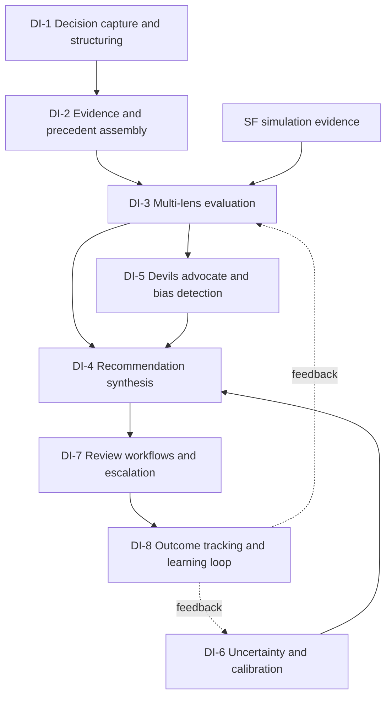
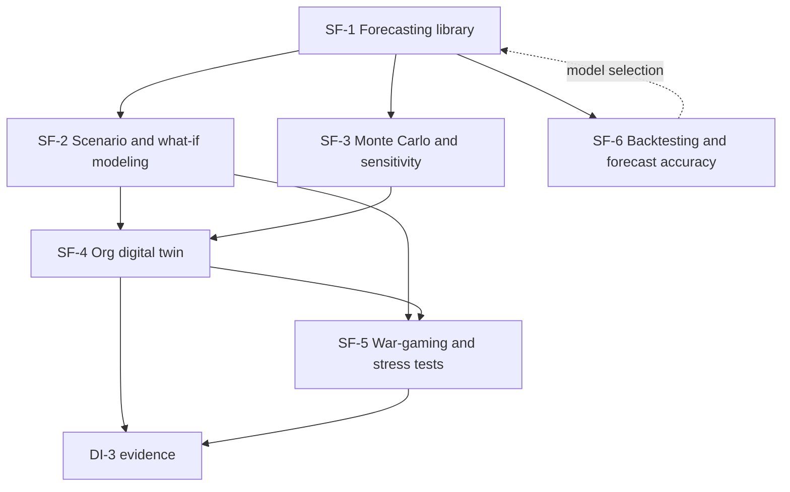
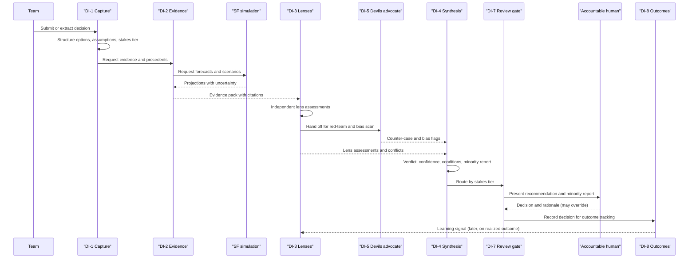
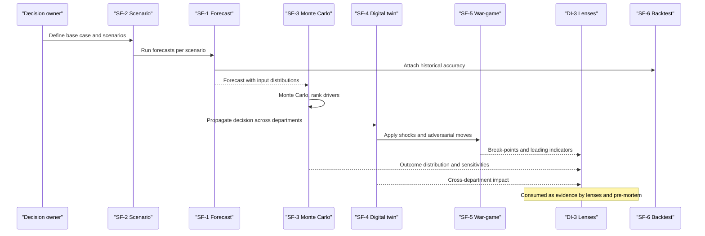

# Decision intelligence & simulation (DI, SF) feature catalog

## 1. Front matter

| Field | Value |
|---|---|
| Doc ID | CAT-DI-SF |
| Pillars covered | DI, SF |
| Owning unit | U6 Catalog DI+SF |
| Version | 1.0 |

## 2. Pillar overview & scope boundary

The DI pillar is the judgment core of TrueNorth — the part that takes a decision a team is about to make (or has just made in a meeting) and answers the question the whole product exists to answer: is following this a good idea? DI structures the decision (DI-1), assembles the evidence and the precedents that bear on it (DI-2), runs it through a panel of domain lenses (DI-3), synthesizes a single verdict on the canonical Endorse / Endorse-with-conditions / Caution / Oppose scale with reasoning, confidence, conditions, and an attached minority report (DI-4), actively argues against itself to surface bias and blind spots (DI-5), reports honestly on what it does not know and how well-calibrated it has been (DI-6), routes the decision through stakes-tiered human gates so a person always decides (DI-7), and then watches what actually happened and learns from it (DI-8). DI never decides; it advises, records, and improves.

The SF pillar is the quantitative imagination DI reasons over. Where DI judges, SF projects: it forecasts the futures a decision is betting on (SF-1), lets teams pose structured what-ifs (SF-2), quantifies the uncertainty and the drivers around those projections (SF-3), propagates a candidate decision's consequences across the whole organization through a digital twin (SF-4), stress-tests decisions against adversarial and crisis scenarios (SF-5), and holds itself accountable by scoring its own forecasts against what realized (SF-6). DI-3 and DI-5 consume SF outputs as evidence; SF without DI is a model library, and DI without SF is judgment without foresight.

NOT in this pillar:

- Decision-rights policy (who may decide what) — GV-1 (DI-7 enforces gates against GV-1 policy; it does not define authority).
- Human-in-the-loop gate policy and stakes-based control definitions — GV-2 (DI-7 executes review workflows against GV-2 policy).
- Immutable audit logging and replay sealing — GV-3 (DI emits the events; GV-3 seals them).
- Reviewer-facing explainability rendering and external transparency disclosures — GV-4 (DI-4 produces the reasoning; GV-4 renders and discloses it).
- Model risk management governance over the judge and forecast models — GV-7 (DI-6 measures calibration; GV-7 supervises the program).
- Evidence source data, lineage, and citations capture — DF-5 (DI-2 consumes lineage; it does not capture it).
- External and market signals used as evidence — DF-7.
- The organizational knowledge graph, precedent storage, and GraphRAG retrieval — KG-3, KG-4 (DI-2 queries them; KG owns them).
- Decision and commitment extraction from meetings — MI-2 (the upstream trigger; DI-1 ingests structured decisions from it).
- Goal/strategy graph and alignment scoring against strategy — GA-1, GA-4 (DI-3's strategic lens consumes GA-4 scores).
- Model gateway routing, RAG infrastructure, agent orchestration, and the evaluation harness that tests judge quality — PL-1, PL-2, PL-3, PL-4 (DI's models run on PL; PL-4 evaluates them).
- Surfaces that render decision records, recommendations, and simulations — SX-1, SX-2 (DI/SF supply content; SX renders it).

## 3. L2 index & capability map

### DI — Decision Intelligence Engine

| L2 ID | Name | Scope (canonical) |
|---|---|---|
| DI-1 | Decision capture & structuring | Records, options, criteria, assumptions, stakes S1–S4 |
| DI-2 | Evidence & precedent assembly | Citation-backed data/docs plus similar past decisions with outcomes |
| DI-3 | Multi-lens evaluation | Financial, strategic, risk, legal, people, customer, ESG judges |
| DI-4 | Recommendation synthesis | Verdict + reasoning + confidence + conditions + minority report |
| DI-5 | Devil's advocate & bias detection | Red-team arguments; groupthink/sunk-cost/anchoring flags; pre-mortems |
| DI-6 | Uncertainty & calibration | What-would-change-my-mind, engine self-calibration |
| DI-7 | Review workflows & escalation | Stakes-tiered HITL gates, sign-off, crisis/expedited fast path |
| DI-8 | Outcome tracking & learning loop | Outcome capture, recommendation-vs-result scoring, engine improvement |

### SF — Simulation & Forecasting

| L2 ID | Name | Scope (canonical) |
|---|---|---|
| SF-1 | Forecasting library | Demand, cashflow, headcount, capacity |
| SF-2 | Scenario & what-if modeling | Structured scenario authoring and comparison |
| SF-3 | Monte Carlo & sensitivity analysis | Probabilistic ranges, key-driver identification |
| SF-4 | Org digital twin | Cross-department impact propagation of a candidate decision |
| SF-5 | War-gaming & stress tests | Adversarial scenarios, crisis simulations |
| SF-6 | Backtesting & forecast accuracy | Realized-vs-forecast tracking, model selection, accuracy SLAs |

## 4. Feature trees (per L2 group)

### DI-1 Decision capture & structuring

Turns an informal intention into a structured decision record with options, criteria, assumptions, and a stakes classification, whether the decision arrives from a meeting, a workbench, or a person typing into the assistant.

#### DI-1-1 Decision record creation

- **User story:** As a team lead, I want a decision I am weighing to become a structured record automatically, so that TrueNorth can evaluate it without me filling in a form.
- **Description:** Creates the canonical decision record artifact — context, question, options, decision criteria, assumptions, owner, stakeholders, deadline — from a meeting-extracted decision, a workbench action, an API call, or a conversational prompt.

##### DI-1-1-1 Multi-source intake

- **Behavior:** Accepts a decision from four sources: an extracted decision handed off from meetings, a workbench "evaluate this" action, a conversational request, or a direct API submission. Each source maps to the same record schema.
- **Data touched:** Decision record (created); links to source meeting, project, goals, and owning team.
- **Model/AI involvement:** Extractive — parses free-text intent into the record's structured fields; proposes options and criteria the human can edit.
- **UX surface:** SX-2 conversational interface and SX-1 command centers.
- **Acceptance criteria:** A decision submitted from any of the four sources produces a record with all mandatory fields populated or explicitly flagged "missing"; the human can edit every field before evaluation.
- **L5 notes:** If the intent is ambiguous (multiple candidate decisions in one prompt), the system splits or asks one disambiguating question rather than guessing.

##### DI-1-1-2 Option and criterion structuring

- **Behavior:** Decomposes the decision into discrete options (including the implicit "do nothing" option, always added) and the criteria by which they should be judged; lets the human add, merge, or weight criteria.
- **Data touched:** Decision record options and criteria sub-entities.
- **Model/AI involvement:** Generative — proposes options and criteria; the human curates.
- **UX surface:** SX-1.
- **Acceptance criteria:** Every decision record carries at least two options (one being status quo) and at least one weighted criterion before it can advance to evaluation.

#### DI-1-2 Assumption surfacing

- **User story:** As a decision owner, I want the hidden assumptions behind my decision made explicit, so that we can test the ones that matter.
- **Description:** Extracts and lists the assumptions a decision depends on, tags each as factual/forecast/judgment, and marks which are load-bearing.

##### DI-1-2-1 Assumption extraction and classification

- **Behavior:** Identifies assumptions implicit in the decision framing and the meeting transcript, classifies each, and links load-bearing assumptions to the evidence or forecast that could confirm or refute them.
- **Data touched:** Assumption sub-entities; links to DF-5 lineage and SF forecasts.
- **Model/AI involvement:** Generative + extractive.
- **UX surface:** SX-1.
- **Acceptance criteria:** Each assumption is classified and flagged load-bearing or not; load-bearing assumptions without supporting evidence are visibly marked "untested."

#### DI-1-3 Stakes classification

- **User story:** As a governance owner, I want every decision automatically assigned a stakes tier, so that the right level of review and rigor is applied.
- **Description:** Classifies each decision into the canonical stakes tiers S1 (existential/board-level), S2 (executive), S3 (departmental), S4 (team/routine), driving evaluation depth, latency budget, and the human gates DI-7 enforces.

##### DI-1-3-1 Stakes scoring

- **Behavior:** Scores stakes from reversibility, financial magnitude, headcount/customer/safety impact, regulatory exposure, and strategic linkage; proposes a tier and lets an authorized human override with a recorded reason.
- **Data touched:** Decision record stakes field; override audit event.
- **Model/AI involvement:** Judge — a dedicated classifier with conservative defaults (ties round up to the higher-stakes tier).
- **UX surface:** SX-1.
- **Acceptance criteria:** Every record has a stakes tier; a downgrade override requires a reason and is logged for GV-3; tier drives DI-7 gate selection deterministically.
- **L5 notes:** Misclassifying an S1 as S4 is the most dangerous error; the classifier is tuned to over-escalate, and DI-6 tracks stakes-classification calibration separately.

### DI-2 Evidence & precedent assembly

Gathers the data, documents, forecasts, and similar past decisions that bear on the decision, every item carrying a citation back to its source, so the evaluation rests on evidence a human can inspect.

#### DI-2-1 Evidence gathering

- **User story:** As a decision owner, I want the relevant numbers and documents pulled together for me, so that I am not deciding on a half-remembered metric.
- **Description:** Assembles an evidence pack — metrics, documents, prior commitments, relevant goals — scoped to the decision and the requester's permissions.

##### DI-2-1-1 Permission-aware evidence retrieval

- **Behavior:** Queries the knowledge graph and retrieval layer for evidence relevant to the decision's options, criteria, and assumptions, filtered to what the requesting context is permitted to see.
- **Data touched:** Reads KG-4 retrieval results; constructs an evidence pack referencing DF-5 lineage.
- **Model/AI involvement:** Generative (query planning) over retrieved context; no fabrication — every claim must carry a citation.
- **UX surface:** SX-1.
- **Acceptance criteria:** Every evidence item displays a source citation resolvable to its origin field/document; items the requester cannot access are never surfaced, not even as titles.
- **L5 notes:** If a load-bearing assumption has no supporting evidence, the pack says so explicitly rather than omitting it.

##### DI-2-1-2 Evidence sufficiency check

- **Behavior:** Assesses whether the assembled evidence is sufficient for the stakes tier; for thin evidence, lowers confidence and recommends what to gather before deciding.
- **Data touched:** Evidence pack sufficiency score.
- **Model/AI involvement:** Judge.
- **Acceptance criteria:** Evidence sufficiency is scored and propagated into DI-4 confidence; an S1/S2 decision with insufficient evidence cannot receive an Endorse without a visible sufficiency warning.

#### DI-2-2 Precedent retrieval

- **User story:** As a decision owner, I want to see how similar decisions turned out before, so that I do not repeat a known mistake.
- **Description:** Finds prior decisions similar in shape and context, with their verdicts and — crucially — their realized outcomes from DI-8.

##### DI-2-2-1 Similar-decision matching

- **Behavior:** Retrieves past decision records similar by options, context, and entities involved; ranks by similarity and outcome relevance.
- **Data touched:** Reads decision records and outcomes (DI-8) via KG-3/KG-4.
- **Model/AI involvement:** Retrieval + judge (relevance).
- **Acceptance criteria:** Precedents show the original verdict and the realized outcome where known; "no comparable precedent" is stated explicitly rather than left blank.
- **L5 notes:** Precedent contamination — citing a precedent whose outcome is not yet known as if it validated the choice — is prohibited; unresolved precedents are labeled "outcome pending."

### DI-3 Multi-lens evaluation

Runs the decision through a panel of independent domain lenses — financial, strategic, risk, legal, people, customer, ESG — each producing a structured assessment, so the verdict reflects every angle and disagreement between angles is visible rather than averaged away.

#### DI-3-1 Lens panel execution

- **User story:** As a decision owner, I want my decision judged from every relevant angle, so that a finance-good, people-bad decision does not slip through.
- **Description:** Invokes each applicable lens as an independent evaluator over the same decision record and evidence pack; lenses do not see each other's outputs (to preserve independence).

##### DI-3-1-1 Independent lens assessment

- **Behavior:** Each lens scores the decision against its domain concerns, cites the evidence it relied on, states its own confidence, and flags domain-specific risks. The financial lens consumes SF forecasts; the strategic lens consumes GA-4 alignment scores; the risk lens consumes SF-3 and SF-5 outputs.
- **Data touched:** LensAssessment records (one per lens); reads evidence pack, SF outputs, GA-4 scores.
- **Model/AI involvement:** Judge — one specialized judge configuration per lens, independently prompted and independently evaluated by PL-4.
- **UX surface:** SX-1 (lens breakdown view).
- **Acceptance criteria:** Each lens produces a structured assessment with citations and confidence; lens independence is enforced (no lens output is an input to another lens at assessment time); lenses not applicable to a decision are explicitly marked "not applicable," not silently skipped.
- **L5 notes:** A sycophantic lens (one that agrees with the proposer regardless of evidence) is the core failure mode; PL-4 calibration sets and DI-6 track per-lens agreement-vs-correctness to detect it.

##### DI-3-1-2 Lens applicability selection

- **Behavior:** Determines which lenses apply to a given decision (a pricing change engages financial/customer/strategic; a layoff engages people/legal/financial/ESG) and always engages the risk lens.
- **Data touched:** Decision record lens-applicability map.
- **Model/AI involvement:** Judge.
- **Acceptance criteria:** Lens selection is recorded and overridable by an authorized human; the people and legal lenses are mandatory for any decision touching employees or regulated activity.

#### DI-3-2 Cross-lens conflict detection

- **User story:** As a decision owner, I want to know exactly where the angles disagree, so that I can make the tradeoff consciously.
- **Description:** Surfaces material disagreements between lenses as explicit tradeoffs rather than blending them into a single number.

##### DI-3-2-1 Tradeoff surfacing

- **Behavior:** Detects where lenses reach opposing conclusions and frames the underlying tradeoff (e.g., margin vs. churn risk), quantifying each side where SF data allows.
- **Data touched:** Conflict/tradeoff sub-entities on the recommendation.
- **Model/AI involvement:** Judge over the lens assessments.
- **Acceptance criteria:** Any case where one lens opposes and another endorses produces a named tradeoff in DI-4 output; tradeoffs are never silently averaged.

### DI-4 Recommendation synthesis

Combines the lens assessments into one verdict on the canonical scale, with reasoning, calibrated confidence, any conditions, and an always-attached minority report — the single artifact a human reviews.

#### DI-4-1 Verdict synthesis

- **User story:** As a decision owner, I want one clear recommendation with the reasoning behind it, so that I can act or push back.
- **Description:** Produces the verdict — Endorse / Endorse-with-conditions / Caution / Oppose — with a reasoning narrative grounded in cited lens assessments and evidence.

##### DI-4-1-1 Verdict determination

- **Behavior:** Maps the lens panel, conflicts, evidence sufficiency, and devil's-advocate findings to one of the four canonical verdicts using a documented, deterministic aggregation policy (not a free-form vibe). Endorse-with-conditions is selected when the case is positive but contingent on specific mitigations.
- **Data touched:** Recommendation record (verdict, reasoning, links to all LensAssessments).
- **Model/AI involvement:** Generative reasoning constrained by a deterministic verdict-mapping policy; the narrative may not assert anything uncited.
- **UX surface:** SX-1, SX-2.
- **Acceptance criteria:** Verdict is exactly one of the four canonical values; the reasoning cites at least the lenses that drove it; an Oppose or Caution names the specific disqualifying factor.
- **L5 notes:** The verdict-mapping policy is versioned and replayable (GV-3); two runs over identical inputs and model versions yield the same verdict.

##### DI-4-1-2 Conditions generation

- **Behavior:** For Endorse-with-conditions, generates specific, checkable conditions (with owners and checkpoints) that, if met, make the decision sound; conditions feed DI-8 follow-up tracking.
- **Data touched:** Condition sub-entities; links to DI-8.
- **Model/AI involvement:** Generative.
- **Acceptance criteria:** Each condition is specific and verifiable (not "monitor closely"); each has an owner and a checkpoint date.

#### DI-4-2 Confidence and minority report

- **User story:** As a decision owner, I want to know how sure the system is and the best argument against its own verdict, so that I am not lulled by false certainty.
- **Description:** Attaches a calibrated confidence and the strongest case against the issued verdict.

##### DI-4-2-1 Calibrated confidence

- **Behavior:** Emits a confidence grounded in evidence sufficiency, lens agreement, and DI-6 historical calibration for this decision class — not the model's raw token probability.
- **Data touched:** Recommendation confidence field; reads DI-6 calibration history.
- **Model/AI involvement:** Judge + calibration model.
- **Acceptance criteria:** Confidence is expressed on a documented scale; for decision classes where DI-6 shows the engine has been overconfident, confidence is adjusted down.

##### DI-4-2-2 Minority report attachment

- **Behavior:** Always attaches the strongest argument against the issued verdict, drawn from dissenting lenses and DI-5, regardless of how confident the verdict is.
- **Data touched:** MinorityReport sub-entity.
- **Model/AI involvement:** Generative (adversarial framing).
- **UX surface:** SX-1 (shown adjacent to the verdict, not buried).
- **Acceptance criteria:** Every recommendation, including high-confidence Endorse, carries a non-empty minority report; an empty or pro-forma minority report fails validation.

### DI-5 Devil's advocate & bias detection

Actively argues against the emerging recommendation and scans the decision process for cognitive biases, so the system challenges the room instead of flattering it.

#### DI-5-1 Red-team argumentation

- **User story:** As a decision owner, I want a credible argument for why we are wrong, so that we pressure-test before committing.
- **Description:** Generates the strongest good-faith case against the leading option and against the synthesized verdict.

##### DI-5-1-1 Counter-case generation

- **Behavior:** Constructs the best argument that the favored option fails, including the conditions under which it fails and the evidence that would reveal failure early; runs independently of the synthesis path so it is not anchored to the verdict.
- **Data touched:** Devil's-advocate findings feeding DI-4-2-2.
- **Model/AI involvement:** Generative (adversarial), separately evaluated.
- **Acceptance criteria:** The counter-case is specific and evidence-grounded, not a generic "there are risks"; for S1/S2 decisions it is mandatory.

#### DI-5-2 Bias and pre-mortem detection

- **User story:** As a facilitator, I want to be warned when the team is anchoring or chasing sunk costs, so that we catch it in the room.
- **Description:** Flags groupthink, sunk-cost, anchoring, confirmation, and overconfidence patterns in the decision framing and meeting dynamics, and runs structured pre-mortems.

##### DI-5-2-1 Bias pattern flags

- **Behavior:** Detects bias signatures (e.g., dissent recorded then ignored = groupthink risk; continued investment justified by prior spend = sunk cost) from the decision record and MI-2 dissent data, and surfaces a specific, non-judgmental prompt.
- **Data touched:** Reads decision record, MI-2 dissent; writes bias-flag annotations.
- **Model/AI involvement:** Judge.
- **Acceptance criteria:** Flags name the specific pattern and the evidence for it; flags are advisory and never block a human's decision (red-line respect: no scoring of individuals).
- **L5 notes:** Bias detection operates on decision process, never on individuals; it must not produce per-person bias scores.

##### DI-5-2-2 Structured pre-mortem

- **Behavior:** For S1/S2 decisions, runs a pre-mortem: assume the decision failed in 12 months, generate the most likely failure narratives and their leading indicators, and propose what to monitor.
- **Data touched:** Pre-mortem artifact linked to the recommendation; leading indicators feed DI-8.
- **Model/AI involvement:** Generative + SF-5 stress scenarios.
- **Acceptance criteria:** Produces at least two distinct failure narratives with monitorable leading indicators.

### DI-6 Uncertainty & calibration

Reports what would change the recommendation and tracks how well the engine's confidence has matched reality, making the system's own reliability inspectable.

#### DI-6-1 What-would-change-my-mind

- **User story:** As a decision owner, I want to know which fact, if different, would flip the verdict, so that I know where to focus diligence.
- **Description:** Identifies the smallest changes in evidence or assumptions that would change the verdict.

##### DI-6-1-1 Decision-flip sensitivity

- **Behavior:** Computes which assumptions or evidence items are pivotal — i.e., whose change would move the verdict across a threshold — and ranks them.
- **Data touched:** Sensitivity annotations; uses SF-3 sensitivity where quantitative.
- **Model/AI involvement:** Judge + SF-3.
- **Acceptance criteria:** Lists the pivotal factors in priority order; if no single factor flips the verdict, says the verdict is robust and why.

#### DI-6-2 Engine self-calibration

- **User story:** As a governance owner, I want to know whether the engine's confidence is trustworthy, so that I can weight its advice appropriately.
- **Description:** Measures, per decision class and per lens, whether stated confidence matched realized outcomes, and exposes the result.

##### DI-6-2-1 Calibration tracking

- **Behavior:** Joins past recommendation confidences (DI-4) with realized outcomes (DI-8) to compute calibration curves per decision class and per lens; feeds adjustments back into DI-4-2-1.
- **Data touched:** Calibration records; reads recommendations and outcomes.
- **Model/AI involvement:** Statistical calibration (non-generative).
- **UX surface:** SX-1 trust dashboard; disclosed via GV-4.
- **Acceptance criteria:** Calibration is reported per decision class with sample sizes; classes with too few outcomes are labeled "insufficient data," not shown as well-calibrated.
- **L5 notes:** Calibration measurement is supervised by GV-7 model risk management; DI-6 produces the numbers, GV-7 governs the program.

### DI-7 Review workflows & escalation

Routes each recommendation through human gates sized to its stakes tier, captures sign-off, escalates when needed, and provides a crisis fast-path — operationalizing the invariant that a human always decides.

#### DI-7-1 Stakes-tiered gates

- **User story:** As a reviewer, I want decisions to reach me with exactly the rigor their stakes demand, so that routine calls are fast and big calls are careful.
- **Description:** Enforces the human-in-the-loop gate appropriate to the stakes tier, against gate policy defined in GV-2 and decision rights in GV-1.

##### DI-7-1-1 Gate routing

- **Behavior:** Selects and sequences reviewers/approvers by stakes tier (S1 to board/CEO gate, S4 to team-lead acknowledgment), enforces required sign-offs, and blocks "decided" status until gates are satisfied.
- **Data touched:** Review workflow state; reads GV-1/GV-2 policy; emits sign-off events to GV-3.
- **Model/AI involvement:** None (policy-driven workflow); the recommendation it carries is AI-generated.
- **UX surface:** SX-1, SX-3 in-flow approvals.
- **Acceptance criteria:** No decision can be marked decided without its tier's required human sign-offs; the human can decide against the verdict, and doing so is recorded with a captured rationale (never blocked).
- **L5 notes:** The human-decides invariant is absolute: TrueNorth never auto-commits a decision, and an Oppose verdict can be overridden by an authorized human with a logged reason.

#### DI-7-2 Escalation and crisis fast-path

- **User story:** As an operations leader in a crisis, I want a compressed but still-governed review when minutes matter, so that speed does not mean no oversight.
- **Description:** Provides escalation paths for stuck or contested decisions and a crisis/expedited fast-path with compressed gates and a mandatory post-hoc review.

##### DI-7-2-1 Crisis fast-path

- **Behavior:** For declared crises, compresses evaluation and gates to a minimal safe set, marks the decision provisional, and schedules a mandatory full review and audit within a fixed window after the event.
- **Data touched:** Crisis-mode flag; provisional decision state; scheduled post-hoc review.
- **Model/AI involvement:** Judge (rapid evaluation with explicit reduced-confidence labeling).
- **Acceptance criteria:** Crisis mode requires authorized invocation, is fully logged, and always schedules a post-hoc review; it never removes the human decision-maker, only compresses the queue.

### DI-8 Outcome tracking & learning loop

Watches what actually happened after a decision, scores the recommendation against reality, and feeds that signal back into evaluation and calibration — the mechanism by which TrueNorth gets better.

#### DI-8-1 Outcome capture

- **User story:** As a decision owner, I want the result of my decision recorded against the original recommendation, so that we learn instead of forget.
- **Description:** Captures realized outcomes for decisions, linking metrics and events back to the originating recommendation and its conditions.

##### DI-8-1-1 Outcome binding

- **Behavior:** Binds post-decision metrics, milestones, and condition-completion to the decision record; detects when conditions from DI-4-1-2 were or were not met.
- **Data touched:** Outcome records linked to recommendations and conditions; reads live metrics via GA-3 bindings.
- **Model/AI involvement:** Extractive + judge (attributing outcomes to decisions, with uncertainty).
- **Acceptance criteria:** Outcomes link to the specific recommendation; unmet conditions are flagged; attribution uncertainty is stated, not hidden.

#### DI-8-2 Recommendation-vs-result scoring & learning

- **User story:** As a governance owner, I want to know whether following TrueNorth's advice led to better outcomes, so that we can trust it or fix it.
- **Description:** Scores recommendations against realized outcomes and routes the signal to DI-3 lens improvement, DI-6 calibration, and DI-2 precedent enrichment.

##### DI-8-2-1 Outcome scoring and feedback routing

- **Behavior:** Computes whether the realized outcome was consistent with the verdict and confidence; aggregates into the learning signals consumed by calibration (DI-6) and precedent (DI-2-2); supports the held-out evaluation sets used by PL-4.
- **Data touched:** Outcome scores; feedback links.
- **Model/AI involvement:** Statistical + judge.
- **Acceptance criteria:** Produces an auditable recommendation-quality metric over time; the metric distinguishes "advice followed" from "advice overridden" so the engine is not credited or blamed for human overrides.
- **L5 notes:** Guards against learning the wrong lesson: outcomes are confounded by execution quality and external shocks; scoring explicitly separates decision quality from outcome luck where possible (process vs. outcome).

### SF-1 Forecasting library

A governed library of forecast models for the quantities decisions bet on — demand, cashflow, headcount, capacity — usable as evidence by DI lenses and as the base layer for scenarios and the twin.

#### SF-1-1 Forecast model catalog

- **User story:** As an analyst, I want vetted forecast models I can apply to my decision, so that I am not hand-rolling a spreadsheet projection.
- **Description:** Provides versioned, governed forecast models per domain, each with documented method, inputs, and accuracy history from SF-6.

##### SF-1-1-1 Governed forecast execution

- **Behavior:** Runs a selected forecast over permitted data, returning point and interval estimates with method and input lineage; refuses to run on data the requester cannot access.
- **Data touched:** Reads source metrics (DF), writes forecast artifacts with lineage.
- **Model/AI involvement:** Simulation/forecast models (statistical/ML), governed under GV-7.
- **UX surface:** SX-1; consumed by DI-3 financial/risk lenses.
- **Acceptance criteria:** Every forecast returns an uncertainty interval, not just a point; method and accuracy history (SF-6) are attached.
- **L5 notes:** A point forecast presented without an interval is prohibited — false precision is a core decision-quality hazard.

### SF-2 Scenario & what-if modeling

Lets teams author and compare structured scenarios — alternative assumption sets — so a decision can be tested against more than the base case.

#### SF-2-1 Scenario authoring and comparison

- **User story:** As a planner, I want to compare "what if demand drops 20%" against base case, so that I can see how fragile my decision is.
- **Description:** Authors named scenarios as assumption overrides, runs forecasts under each, and compares decision implications side by side.

##### SF-2-1-1 Scenario definition and run

- **Behavior:** Captures scenario assumptions, runs the relevant SF-1 forecasts under them, and produces a comparison against base case with the decision-relevant deltas highlighted.
- **Data touched:** Scenario definitions; forecast runs; comparison artifacts.
- **Model/AI involvement:** Simulation; generative narrative summary of differences.
- **UX surface:** SX-1; feeds DI-3.
- **Acceptance criteria:** Scenarios are reproducible (same inputs, same outputs); comparisons show the decision-relevant metric under each scenario with intervals.

### SF-3 Monte Carlo & sensitivity analysis

Quantifies the uncertainty around a forecast or decision and identifies which drivers matter most, feeding DI-6 sensitivity and DI-3 risk.

#### SF-3-1 Probabilistic and sensitivity analysis

- **User story:** As a risk owner, I want the probability distribution of outcomes and the top drivers, so that I can judge tail risk, not just the average.
- **Description:** Runs Monte Carlo simulations over uncertain inputs and computes sensitivity to each driver.

##### SF-3-1-1 Monte Carlo run and driver ranking

- **Behavior:** Samples uncertain inputs across their distributions, produces an outcome distribution with tail statistics, and ranks drivers by their contribution to variance.
- **Data touched:** Simulation runs; driver-sensitivity outputs.
- **Model/AI involvement:** Simulation (Monte Carlo); statistical sensitivity.
- **UX surface:** SX-1; feeds DI-6-1-1 and DI-3 risk lens.
- **Acceptance criteria:** Reports tail percentiles (not just mean); ranks drivers; run is seeded and reproducible.

### SF-4 Org digital twin

A model of the organization that propagates a candidate decision's effects across departments, so a local decision's company-wide consequences are visible before it is made.

#### SF-4-1 Cross-department impact propagation

- **User story:** As an executive, I want to see how a plant-capacity decision ripples into finance, sales commitments, and hiring, so that I do not optimize one department at the company's expense.
- **Description:** Propagates a decision's first- and second-order effects through modeled dependencies between departments and resources.

##### SF-4-1-1 Impact graph simulation

- **Behavior:** Given a candidate decision, traverses the modeled dependency graph (capacity → output → revenue → cash → hiring, etc.) and reports affected departments, magnitudes, and timing, with uncertainty.
- **Data touched:** Twin dependency model; reads KG org/resource structure; writes impact projections.
- **Model/AI involvement:** Simulation over a graph model; generative narrative of cross-department effects.
- **UX surface:** SX-1; feeds DI-3 strategic and DI-5 pre-mortem.
- **Acceptance criteria:** Identifies affected departments beyond the originating one; second-order effects are labeled as such with lower confidence; the twin's known blind spots are disclosed.
- **L5 notes:** The twin is explicitly an approximation; its outputs are evidence, never ground truth, and DI-4 must not present twin projections as certainties.

### SF-5 War-gaming & stress tests

Tests decisions against adversarial moves and crisis conditions, including competitor responses and supply/demand shocks, feeding DI-5 pre-mortems.

#### SF-5-1 Adversarial and crisis scenarios

- **User story:** As a strategist, I want to see how a competitor or a shock could break my plan, so that I build in resilience.
- **Description:** Runs adversarial scenarios (competitor responses, supply shocks, regulatory shifts) and crisis simulations against a decision.

##### SF-5-1-1 Stress scenario execution

- **Behavior:** Applies predefined and custom shock scenarios to the decision's forecasts and twin, reporting where the decision breaks and the leading indicators of each break.
- **Data touched:** Stress scenario library; runs; break-point outputs.
- **Model/AI involvement:** Simulation; generative adversarial scenario construction.
- **UX surface:** SX-1; feeds DI-5-2-2.
- **Acceptance criteria:** Reports the conditions under which the decision fails and observable leading indicators; crisis scenarios connect to DI-7 crisis fast-path planning.

### SF-6 Backtesting & forecast accuracy

Holds SF accountable by comparing its past forecasts to what realized, driving model selection and feeding honest accuracy into every forecast SF-1 emits.

#### SF-6-1 Forecast accuracy tracking

- **User story:** As an analyst, I want to know how accurate a forecast model has been, so that I can trust or discount it.
- **Description:** Tracks realized-vs-forecast error per model and domain, enforces accuracy SLAs, and informs SF-1 model selection.

##### SF-6-1-1 Realized-vs-forecast scoring

- **Behavior:** Joins past forecasts with realized values, computes error metrics over time, flags models breaching accuracy SLAs, and recommends model changes.
- **Data touched:** Forecast records; realized metrics; accuracy scorecards.
- **Model/AI involvement:** Statistical (non-generative).
- **UX surface:** SX-1; attached to every SF-1 forecast.
- **Acceptance criteria:** Each forecast model exposes its historical accuracy with sample size; models breaching SLA are flagged and cannot be the silent default.
- **L5 notes:** Forecast accuracy is supervised under GV-7 alongside judge calibration; a model with no accuracy history is labeled "unvalidated."

## 5. Cross-pillar dependencies

### Consumed by DI/SF (canonical L2 IDs this pillar reads)

| L2 ID | What DI/SF consumes |
|---|---|
| MI-2 | Extracted decisions, commitments, and recorded dissent that trigger and inform decision records |
| KG-3 | Decision genealogy and institutional memory for precedent retrieval |
| KG-4 | Permission-aware semantic/graph retrieval for evidence assembly |
| DF-5 | Source-to-citation lineage for every evidence item and forecast input |
| DF-7 | External and market signals used as evidence and scenario inputs |
| GA-1 | Strategy/OKR graph the strategic lens evaluates against |
| GA-4 | Alignment scores consumed by the strategic lens |
| GA-3 | Live metric bindings used for outcome capture |
| GV-1 | Decision-rights policy enforced at review gates |
| GV-2 | HITL gate policy and stakes-based control definitions |
| PL-1 | Model gateway routing for judge/lens/forecast model calls |
| PL-2 | RAG/retrieval infrastructure underpinning evidence assembly |
| PL-3 | Agent orchestration for the multi-step evaluation pipeline |
| PL-4 | Evaluation harness that calibrates and regression-tests judges |

### Provided by DI/SF (what other pillars cite from this pillar)

| Provided | Consumers (canonical L2 IDs) |
|---|---|
| Decision records, verdicts, recommendations, minority reports | GV-3 (audit/replay), GV-4 (explainability), SX-1/SX-2 (rendering), all WB-* workbenches |
| Confidence and calibration data | GV-4, GV-7, AD-4 (value realization) |
| Outcome and recommendation-quality metrics | DI-internal learning, AD-3/AD-4, PL-4 golden sets |
| Forecasts, scenarios, twin impacts, stress results | All WB-* workbenches, GA-3 health inference |
| Stakes classification | GV-2 gate selection, DI-7 routing |

## 6. Pillar-level NFRs

- **Latency by stakes tier:** S4 routine evaluations return a recommendation within seconds (interactive); S3 within low minutes; S1/S2 may run deeper multi-lens and simulation passes over longer budgets, but always report partial progress. Crisis fast-path (DI-7-2-1) targets a compressed S2-equivalent evaluation in minutes.
- **Reproducibility:** Given identical inputs and pinned model/policy versions, verdict, conditions, and verdict-mapping output are deterministic and replayable via GV-3.
- **Calibration target:** Per high-volume decision class, stated confidence should track realized outcome frequency within a documented tolerance; classes below a minimum outcome sample are labeled "insufficient data" rather than asserted as calibrated.
- **Citation integrity:** 100% of asserted evidentiary claims in a recommendation carry a resolvable citation; uncited assertions fail validation and block synthesis.
- **Minority-report completeness:** 100% of recommendations carry a non-empty, substantive minority report.
- **Availability:** The evaluation pipeline targets high availability with graceful degradation — if simulation (SF) is unavailable, DI returns a recommendation with explicitly reduced confidence and a "simulation unavailable" flag rather than failing.
- **Forecast honesty:** Every forecast carries an uncertainty interval and accuracy history; every twin/stress output is labeled as approximation.

## 7. Open questions

- How should outcome attribution separate decision quality from execution quality and external luck at scale, given confounding? (Process-vs-outcome scoring is specified in principle in DI-8-2-1; the operational methodology needs validation.)
- What is the right minimum outcome sample size before a decision class's calibration is considered trustworthy, and does it vary by stakes tier?
- Should the verdict-mapping policy (DI-4-1-1) be tenant-configurable, or fixed to preserve cross-tenant comparability and auditability? (New global assumption candidate — not asserted here.)
- For S1 decisions where no comparable precedent exists, how much should absent precedent reduce confidence versus being treated as neutral?
- How are lens weights set and governed so that no single lens can be quietly tuned to dominate verdicts? (Interacts with GV-7.)

## 8. Dependencies & references

| Reference | Type | Why |
|---|---|---|
| MI-2 | Canonical L2 | Source of extracted decisions, commitments, and dissent that trigger DI-1 |
| KG-3, KG-4 | Canonical L2 | Institutional memory and retrieval for precedent and evidence |
| DF-5, DF-7 | Canonical L2 | Lineage for citations; external signals as evidence |
| GA-1, GA-3, GA-4 | Canonical L2 | Strategy graph, metric bindings, and alignment scores for the strategic lens and outcomes |
| GV-1, GV-2, GV-3, GV-4, GV-7 | Canonical L2 | Decision-rights, gate policy, audit/replay, explainability rendering, model risk supervision |
| PL-1, PL-2, PL-3, PL-4 | Canonical L2 | Model gateway, retrieval infra, agent orchestration, judge evaluation/calibration |
| SX-1, SX-2 | Canonical L2 | Surfaces that render recommendations, lens breakdowns, and simulations |
| WB-FIN, WB-HR, WB-OPS, WB-GTM, WB-ENG, WB-LGL, WB-CS, WB-CDV | Canonical WB codes | Department workbenches that invoke DI/SF on their decisions |
| U8 Catalog GV | Work unit | Owns the governance gates, audit, explainability, and model-risk program DI relies on |
| U4 Catalog DF+KG | Work unit | Owns the evidence, lineage, and knowledge graph DI-2 queries |
| U5 Catalog MI+GA | Work unit | Owns meeting extraction and the strategy/alignment graph DI consumes |
| U10 Catalog PL+AD | Work unit | Owns the platform and evaluation harness DI/SF models run on |
