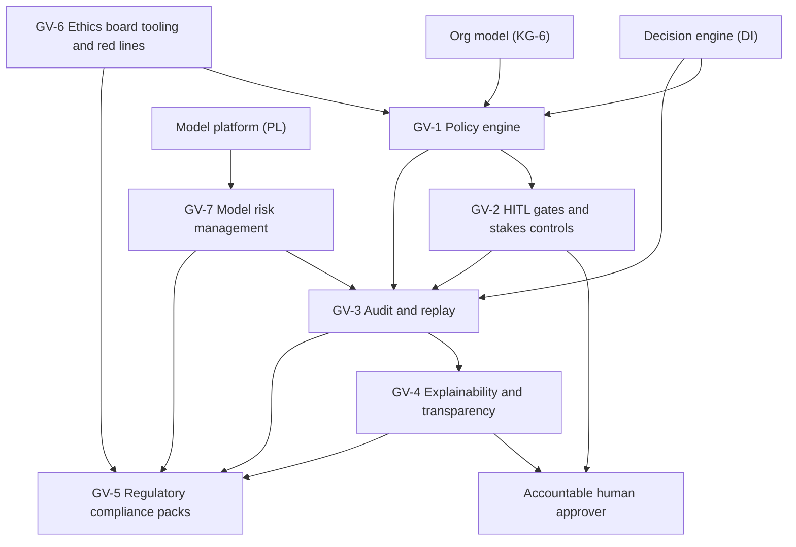
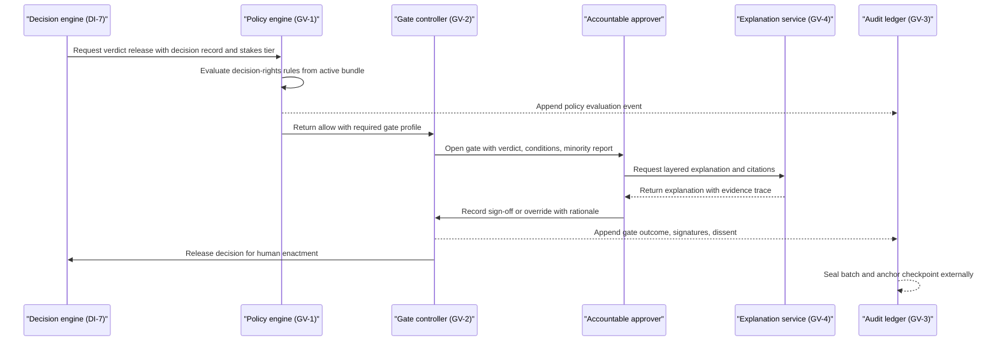

# Governance, risk, compliance & responsible AI (GV) feature catalog

## 1. Front matter

| Field | Value |
|---|---|
| Doc ID | CAT-GV |
| Pillars covered | GV |
| Owning unit | U8 Catalog GV |
| Version | 1.0 |

## 2. Pillar overview & scope boundary

The GV pillar is TrueNorth's license to operate. TrueNorth issues structured recommendations on decisions that can move billions of dollars and thousands of careers; no Fortune-500 enterprise will allow that without provable answers to four questions: who is allowed to decide what (GV-1), where humans must remain in the loop (GV-2), how every recommendation can be audited and reproduced later (GV-3), and why the system said what it said (GV-4). On top of those four foundations, GV packages regulatory conformity as maintainable product artifacts (GV-5), enforces the immutable red lines and gives the customer's ethics function real tooling (GV-6), and runs a disciplined model risk management program over every model and agentic pipeline that touches a verdict (GV-7). GV operationalizes the canonical assumptions exactly: the Endorse / Endorse-with-conditions / Caution / Oppose verdict scale, stakes tiers S1–S4 with human-in-the-loop gates that scale with stakes, the invariant that humans always retain decision authority, all four deployment models with residency honored, and the red lines (no covert monitoring, no individual surveillance scoring, no autonomous people decisions).

NOT in this pillar:

- Identity, SSO/SCIM, RBAC+ABAC authorization enforcement — SC-1 (GV-1 supplies decision-rights policy that SC-1 evaluates alongside access policy).
- Encryption, BYOK, DLP, classification-aware retrieval — SC-2.
- Prompt injection, retrieval poisoning, output exfiltration defenses — SC-3.
- Tenant and deployment isolation mechanics — SC-4.
- Insider risk and abuse monitoring — SC-5.
- External certification programs (SOC 2, ISO 27001/42001, FedRAMP) — SC-6 (GV-5 consumes their evidence; it does not run them).
- PII redaction, consent zones, purpose tags applied pre-persistence — DF-4.
- Source-to-citation lineage capture — DF-5 (GV-4 renders it; GV-3 seals it).
- Residency and sovereignty routing — DF-6.
- Decision capture, multi-lens evaluation, verdict synthesis, and the reviewer-facing review workflow surface — DI-1, DI-3, DI-4, DI-7 (GV-2 defines and enforces gate policy; DI-7 executes the review workflow against it).
- Engine self-calibration measurement — DI-6 (GV-4 discloses it; GV-7 supervises it).
- Meeting recording consent and retention — MI-6.
- Model gateway routing, evaluation harness mechanics, observability plumbing — PL-1, PL-4, PL-6 (GV-7 governs them; it does not implement them).

## 3. L2 index & capability map

| L2 ID | Name | Scope (canonical) |
|---|---|---|
| GV-1 | Policy engine | Decision-rights matrix encoded |
| GV-2 | HITL gates & stakes-based controls | Human-in-the-loop gates scaling with stakes tiers S1–S4 |
| GV-3 | Audit & replay | Immutable logs, reproducibility |
| GV-4 | Explainability & transparency | Reasoning, citations, disclosure |
| GV-5 | Regulatory compliance packs | EU AI Act, GDPR, SOX, sectoral, ESG disclosure |
| GV-6 | Ethics board tooling & red lines | Prohibited uses incl. employee-surveillance bans |
| GV-7 | Model risk management | Inventory, validation, monitoring, incidents |

## 4. Feature trees (per L2 group)

### GV-1 Policy engine

The policy engine encodes the enterprise decision-rights matrix and governance policies as versioned, machine-evaluable rules consulted on every decision lifecycle event.

#### GV-1-1 Decision-rights matrix authoring & encoding

- **User story:** As a chief of staff or governance lead, I want to express our delegation-of-authority and decision-rights matrix as structured, versioned policy, so that TrueNorth applies the same rules our board approved instead of an informal approximation.
- **Description:** Converts existing delegation-of-authority documents, committee charters, and RACI conventions into executable policy objects scoped by decision type, stakes tier, monetary threshold, business unit, geography, and role. This is the root artifact every other GV capability evaluates against.

##### GV-1-1-1 Policy authoring studio

- **Behavior:** TrueNorth shall provide a guided authoring environment where governance admins define policy rules from templates (spend thresholds, hiring approvals, contract signature authority, capital allocation, pricing changes), preview affected roles, and validate rules before publishing. Free-text policy documents may be drafted into candidate rules for human confirmation.
- **Data touched:** Policy rule store; role and committee definitions referenced from the org model; decision-type taxonomy.
- **Model/AI involvement:** Extractive — drafts candidate rules from uploaded delegation-of-authority documents; every drafted rule requires explicit human approval before activation.
- **UX surface:** SX-1 (governance admin workspace).
- **Acceptance criteria:**
  - An admin can author, preview, and publish a spend-threshold rule end to end without writing code.
  - Drafted rules from documents are visibly labeled as unconfirmed and cannot take effect until approved.
  - Every published rule carries owner, rationale, effective dates, and source citation.

##### GV-1-1-2 Org-model binding

- **Behavior:** TrueNorth shall bind policy rules to live organizational structures — reporting lines, committees, decision-rights roles — so that rules resolve to current people at evaluation time rather than hard-coded names, and re-resolve automatically on reorganizations. The need for current org structure, RACI, and committee data is met by KG-6.
- **Data touched:** Policy rule store; org-model references (read-only); binding resolution cache.
- **Model/AI involvement:** None — deterministic resolution.
- **UX surface:** SX-1.
- **Acceptance criteria:**
  - A rule referencing "VP Supply Chain" resolves to the incumbent at evaluation time, including during acting/interim assignments.
  - Reorg events trigger re-resolution and flag rules whose referenced roles no longer exist.
  - Unresolvable bindings fail closed: the affected decision routes to the policy owner, never silently passes.

##### GV-1-1-3 Policy-as-code compilation & static validation

- **Behavior:** TrueNorth shall compile authored rules into a deterministic, versioned policy bundle and run static checks: unreachable rules, contradictory rules (same predicate, conflicting outcomes), gaps (decision types with no applicable rule), and red-line conflicts (any rule that would contradict GV-6-1 is rejected at compile time).
- **Data touched:** Compiled policy bundles; validation reports.
- **Model/AI involvement:** None.
- **UX surface:** SX-1; SX-5 for CI-style policy validation via API.
- **Acceptance criteria:**
  - A bundle with a contradiction or red-line conflict cannot be published; the report names the conflicting rules.
  - Compiled bundles are content-addressed so a bundle hash uniquely identifies the rules in force.
- **L5 notes:** Compilation is fully deterministic; the same source rules always yield the same bundle hash. This is a precondition for GV-3-2 replay determinism.

#### GV-1-2 Runtime policy evaluation service

- **User story:** As a decision proposer, I want every decision I submit to be checked against the decision-rights matrix automatically, so that I learn immediately whether I have authority, need a different approver, or am outside policy.
- **Description:** The low-latency service that evaluates the active policy bundle on decision lifecycle events (submission, verdict release, sign-off, condition change) and returns an authorization outcome plus the required gate profile for GV-2.

##### GV-1-2-1 Decision-time authority check

- **Behavior:** TrueNorth shall evaluate, for each decision event, whether the acting human holds the required authority given decision type, stakes tier, amount, geography, and unit; outcomes are allow, allow-with-gate-profile, route-to-authorized-approver, or block-with-explanation.
- **Data touched:** Active policy bundle; decision record metadata (DI-1); org bindings.
- **Model/AI involvement:** None — rule evaluation is deterministic.
- **UX surface:** Inline in decision flows via SX-1, SX-2, SX-3.
- **Acceptance criteria:**
  - P99 evaluation latency ≤ 300 ms so the check is invisible inside decision submission.
  - Every outcome includes the rule IDs that fired, in human-readable form.
  - Fail-closed: if the engine is unavailable, S1/S2 decisions queue rather than proceed unchecked.

##### GV-1-2-2 Conflict precedence & ambiguity handling

- **Behavior:** When multiple rules apply, TrueNorth shall resolve them by explicit precedence (red lines > regulatory pack constraints > tenant policy > department policy > defaults) and most-specific-wins within a level; residual ambiguity routes to the policy owner with both candidate outcomes shown.
- **Data touched:** Policy bundle precedence metadata; ambiguity queue.
- **Model/AI involvement:** None.
- **UX surface:** SX-1 ambiguity queue for policy owners.
- **Acceptance criteria:**
  - Precedence order is documented, tenant-visible, and identical in simulation (GV-1-3) and runtime.
  - Ambiguous evaluations never auto-resolve; each creates a queue item with full context.

##### GV-1-2-3 Policy evaluation event emission

- **Behavior:** TrueNorth shall emit a structured event for every policy evaluation — inputs, bundle hash, rules fired, outcome, latency — to the GV-3 audit ledger.
- **Data touched:** Audit event stream.
- **Model/AI involvement:** None.
- **UX surface:** None directly; visible through GV-3-3 auditor workspace.
- **Acceptance criteria:**
  - 100% of evaluations produce a ledger event; event loss is an integrity incident (GV-3-4).
  - Events carry the policy bundle hash so any outcome can be re-derived later.

#### GV-1-3 Policy simulation & impact preview

- **User story:** As a governance lead, I want to dry-run a proposed policy change against past decisions, so that I can see who would have been blocked or re-routed before the change goes live.
- **Description:** Replays a candidate policy bundle against a historical decision corpus and reports outcome deltas, preventing governance changes from surprising the organization.

##### GV-1-3-1 Historical dry-run

- **Behavior:** TrueNorth shall evaluate a candidate bundle against a selectable window of historical decision events and produce a delta report: decisions whose outcome would change, affected roles and units, and projected gate-load changes for GV-2 approvers.
- **Data touched:** Historical decision metadata (read-only); candidate bundle; delta reports.
- **Model/AI involvement:** None for evaluation; generative for the natural-language summary of the delta report, clearly labeled per GV-4-3.
- **UX surface:** SX-1.
- **Acceptance criteria:**
  - Dry-run over 12 months of decision history completes within 15 minutes for a tenant with 100k decision events.
  - The delta report links each changed outcome to the specific rule change responsible.

##### GV-1-3-2 Coverage & gap analytics

- **Behavior:** TrueNorth shall continuously report which decision types, units, and stakes tiers are covered by explicit rules versus falling through to defaults, and trend the rate of ambiguity-queue items per GV-1-2-2.
- **Data touched:** Policy bundle; decision-type taxonomy; evaluation statistics.
- **Model/AI involvement:** None.
- **UX surface:** SX-1 governance dashboard.
- **Acceptance criteria:**
  - Coverage is expressed as a percentage of decision volume, not just rule counts.
  - Default-path decisions above S3 generate a weekly gap digest to the policy owner.

#### GV-1-4 Delegation & exception management

- **User story:** As an executive going on leave, I want to delegate my decision authority for a bounded period and scope, so that the organization keeps moving without my rights being permanently or informally transferred.
- **Description:** First-class, time-boxed delegation grants and a governed exception path for one-off out-of-policy decisions, replacing the email-based workarounds that defeat decision-rights regimes.

##### GV-1-4-1 Time-boxed delegation grants

- **Behavior:** TrueNorth shall let an authority holder grant a scoped delegation (decision types, thresholds, units, dates) to a named delegate; grants require the delegator's confirmation, auto-expire, are revocable, and are visible on every decision approved under them.
- **Data touched:** Delegation registry; policy evaluation context.
- **Model/AI involvement:** None.
- **UX surface:** SX-1, SX-3 (grant from calendar/leave context).
- **Acceptance criteria:**
  - Expired delegations stop applying within 60 seconds of expiry.
  - Sub-delegation is disabled by default and requires explicit policy enablement.
  - Decision records show "approved under delegation from X (grant ID)".

##### GV-1-4-2 Exception requests & approvals

- **Behavior:** TrueNorth shall provide a structured exception flow when a proposer requests an out-of-policy action: justification, risk acknowledgment, approval by the rule owner plus the next authority level, automatic expiry, and a standing report of exception frequency by rule (a high exception rate signals a bad rule, not bad people).
- **Data touched:** Exception registry; audit ledger.
- **Model/AI involvement:** None.
- **UX surface:** SX-1, SX-3.
- **Acceptance criteria:**
  - No exception can be granted to red-line rules (GV-6-1) under any approver combination.
  - Every exception appears in the rule's history and in GV-5 compliance evidence.

#### GV-1-5 Policy lifecycle & change governance

- **User story:** As an internal auditor, I want every change to governance policy to itself pass through a controlled, recorded change process, so that the rules governing decisions are as auditable as the decisions.
- **Description:** Draft → review → approve → publish workflow for policy bundles, with effective dating, scheduled activation, emergency rollback to a prior bundle, and a complete change history; policy changes at S1/S2 impact require dual approval.

##### GV-1-5-1 Versioned publication & effective dating

- **Behavior:** TrueNorth shall publish bundles with explicit effective timestamps, support scheduled future activation, retain every prior bundle immutably, and allow one-step rollback to any prior bundle with reason capture.
- **Data touched:** Bundle version store; change log (mirrored to GV-3).
- **Model/AI involvement:** None.
- **UX surface:** SX-1.
- **Acceptance criteria:**
  - As-of queries answer "which bundle was in force at time T" for any past T.
  - Rollback is itself a recorded, attributed change requiring stated rationale.

### GV-2 HITL gates & stakes-based controls

GV-2 defines and enforces the human-in-the-loop control points that scale with stakes tiers S1–S4, operationalizing the invariant that humans always retain decision authority.

#### GV-2-1 Stakes classification & validation

- **User story:** As a decision proposer, I want TrueNorth to suggest the correct stakes tier for my decision with clear reasoning, so that the right level of scrutiny applies without my gaming or guessing the tier.
- **Description:** Configurable rubric mapping decision attributes (financial exposure, reversibility, blast radius, regulatory sensitivity, people impact) to S1–S4, with assisted classification, mandatory human confirmation, and controlled tier changes. Misclassification is the cheapest way to defeat every downstream gate, so this feature is load-bearing.

##### GV-2-1-1 Stakes rubric configuration

- **Behavior:** TrueNorth shall ship a default S1–S4 rubric and let tenants tune attribute thresholds per dimension; rubric changes pass through GV-1-5 change governance and apply prospectively only.
- **Data touched:** Rubric definitions; decision-type taxonomy.
- **Model/AI involvement:** None.
- **UX surface:** SX-1.
- **Acceptance criteria:**
  - The rubric in force at classification time is recorded on every decision record.
  - Tenants cannot configure a rubric that classifies decisions meeting S1 default criteria (existential/board-level exposure) below S2.

##### GV-2-1-2 Assisted classification with human confirmation

- **Behavior:** TrueNorth shall propose a tier with attribute-level reasoning ("$40M exposure → financial dimension S2; irreversible → reversibility S2"); the proposer confirms or contests; contests route to the designated owning authority for that decision type.
- **Data touched:** Decision record metadata (DI-1); rubric; classification log.
- **Model/AI involvement:** Extractive/judge — attribute extraction from the decision record feeds deterministic rubric scoring; the tier itself is rule-derived, not model-derived.
- **UX surface:** SX-1, SX-2, SX-3 at decision capture.
- **Acceptance criteria:**
  - A tier is never finalized without an identified human confirmer.
  - Classification reasoning is stored and shown at every later gate.
  - Tier-proposal precision against a curated golden set ≥ 90% (evaluated via PL-4).

##### GV-2-1-3 Stakes change control & anti-gaming safeguards

- **Behavior:** TrueNorth shall require that any downgrade of a confirmed tier be approved by the authority of the original (higher) tier; it shall flag structural splitting patterns (e.g., one initiative decomposed into many just-below-threshold decisions) at the decision-portfolio level for governance review — reported on decisions and units, never as individual behavioral scores, per the red lines.
- **Data touched:** Classification log; decision-portfolio aggregates.
- **Model/AI involvement:** Extractive — similarity clustering of related decisions to surface splitting patterns; flags are advisory and reviewed by humans.
- **UX surface:** SX-1 governance dashboard.
- **Acceptance criteria:**
  - No path exists to lower a tier without higher-tier approval, including via API (SX-5).
  - Splitting flags cite the clustered decisions and are dismissible with recorded rationale.

#### GV-2-2 Gate definition & orchestration

- **User story:** As a governance lead, I want each stakes tier to carry a defined gate profile — who must review, in what order, with what quorum and timeout — so that scrutiny is proportionate, predictable, and enforceable.
- **Description:** Tiered gate templates and the runtime controller that instantiates them per decision and hands the reviewer experience to DI-7. Default profile: S1 requires multi-party sign-off including a designated executive body, mandatory minority-report review, and a cooling-off period; S2 requires named-approver sign-off plus one independent reviewer; S3 requires single accountable-owner sign-off; S4 requires acknowledgment with sampling-based retrospective review.

##### GV-2-2-1 Tiered gate templates

- **Behavior:** TrueNorth shall provide configurable gate templates per tier defining required roles, sequence/parallelism, quorum, evidence prerequisites (e.g., simulation attached for S1 capital decisions), cooling-off windows, and timeout policy; templates may tighten but never loosen below tier minimums.
- **Data touched:** Gate template store; policy bundle linkage.
- **Model/AI involvement:** None.
- **UX surface:** SX-1.
- **Acceptance criteria:**
  - A tenant attempt to configure S1 with single-person sign-off is rejected at save time.
  - Each instantiated gate records the template version used.

##### GV-2-2-2 Quorum, sign-off & dissent capture

- **Behavior:** TrueNorth shall capture each reviewer's attributed disposition (approve, approve-with-conditions, dissent, abstain) with rationale; dissent never blocks a quorum-satisfied outcome but is permanently attached to the decision record alongside the minority report from DI-4.
- **Data touched:** Sign-off records; decision record; audit ledger.
- **Model/AI involvement:** None.
- **UX surface:** DI-7 hosts the review workflow; gate state surfaces via SX-1, SX-3, SX-4.
- **Acceptance criteria:**
  - Sign-offs are non-repudiable: bound to authenticated identity (SC-1) and sealed in GV-3.
  - A recorded dissent can never be edited or deleted by anyone, including the dissenter.

##### GV-2-2-3 Expedited crisis path with retrospective review

- **Behavior:** TrueNorth shall support a declared-crisis mode in which S1/S2 gates compress to a designated crisis quorum with cooling-off waived; every expedited decision is automatically queued for full retrospective review within 14 days, and crisis-mode activation itself requires dual authorization and is ledger-sealed.
- **Data touched:** Crisis declarations; expedited decision queue; audit ledger.
- **Model/AI involvement:** None.
- **UX surface:** SX-1, SX-4 (crisis notifications).
- **Acceptance criteria:**
  - Crisis mode auto-expires (default 72 hours) unless re-authorized.
  - Retrospective review completion is tracked; overdue reviews escalate to the ethics/governance board (GV-6-2).

##### GV-2-2-4 Gate timeout & escalation handling

- **Behavior:** TrueNorth shall apply per-template timeout policies: remind, escalate to the approver's manager or committee chair, or re-route under valid delegation (GV-1-4-1); timeouts never auto-approve at any tier.
- **Data touched:** Gate state; escalation log.
- **Model/AI involvement:** None.
- **UX surface:** SX-3, SX-4 notifications within interruption budgets.
- **Acceptance criteria:**
  - No configuration exists in which timeout results in automatic approval.
  - Escalation chains terminate at a defined human owner; orphaned gates alert governance admins.

#### GV-2-3 Human-authority invariant enforcement

- **User story:** As a board member, I want architectural guarantees — not policy promises — that TrueNorth cannot execute a decision on its own, so that adopting the system never dilutes human accountability.
- **Description:** The platform-level controls that make the human-decides invariant non-bypassable: no autonomous execution, mandatory human attribution on enactment, and protected override.

##### GV-2-3-1 No-autonomous-execution enforcement

- **Behavior:** TrueNorth shall have no code path, API, or agent capability that enacts a business decision; outbound integrations (SX-5) are restricted to recording, notifying, and preparing artifacts. Any downstream write that would constitute enactment requires a signed human sign-off token from GV-2-2-2, verified at the egress boundary.
- **Data touched:** Egress action allowlist; sign-off token verification log.
- **Model/AI involvement:** None — this is a structural constraint on all model-driven components.
- **UX surface:** Not user-facing; attested in GV-4-4 system cards.
- **Acceptance criteria:**
  - Red-team test suites (security testing per SC-3 scope) include attempts to trigger enactment without a sign-off token; all must fail.
  - The egress allowlist is tenant-visible and changes pass GV-1-5 change governance.
- **L5 notes:** This control must hold in all deployment models including air-gapped; verification is local, with no dependency on a TrueNorth-operated service.

##### GV-2-3-2 Override & disagreement recording

- **Behavior:** TrueNorth shall make overriding any verdict a first-class, friction-appropriate act: a human may proceed against a Caution or Oppose verdict by recording rationale; the override is sealed, feeds the DI-8 learning loop, and carries no punitive framing. Override-rate reporting is at decision-type and unit aggregate only, never ranked by individual, per the red lines.
- **Data touched:** Override records; decision record; aggregates for DI-8.
- **Model/AI involvement:** None at capture.
- **UX surface:** SX-1, SX-3.
- **Acceptance criteria:**
  - Overriding an Oppose verdict at S1/S2 requires rationale text and confirms the verdict and minority report were displayed.
  - No surface, export, or API exposes per-individual override league tables.

##### GV-2-3-3 Meaningful-review safeguards

- **Behavior:** TrueNorth shall monitor gate health in aggregate — median review dwell time, share of approvals where reasoning/evidence panes were never opened, condition-acceptance without condition tracking — and alert governance owners when a gate's aggregate pattern suggests rubber-stamping, recommending gate redesign rather than individual sanction.
- **Data touched:** Gate interaction aggregates (k-anonymized, minimum cohort size enforced).
- **Model/AI involvement:** None — descriptive statistics only.
- **UX surface:** SX-1 governance dashboard.
- **Acceptance criteria:**
  - Metrics are computed only on cohorts ≥ 5 reviewers; below threshold, the metric is suppressed.
  - Alerts name gates and templates, never individuals.
- **L5 notes:** This feature sits closest to the surveillance red line; its data model shall make individual-level extraction impossible (pre-aggregation at write time), not merely prohibited.

#### GV-2-4 Gate analytics & friction management

- **User story:** As a COO sponsor, I want to see what governance costs in cycle time and where gates add scrutiny without value, so that controls stay proportionate and adoption survives.
- **Description:** Aggregate reporting on gate throughput, added latency per tier, escalation frequency, and exception pressure (GV-1-4-2), with recommendations to retune templates; outputs feed AD-3 adoption analytics needs by reference only.

##### GV-2-4-1 Gate friction reporting

- **Behavior:** TrueNorth shall report per-template cycle-time contribution, queue depth, timeout/escalation rates, and trend lines, with drill-down to decision type and unit.
- **Data touched:** Gate state history aggregates.
- **Model/AI involvement:** Generative for narrative summaries, labeled per GV-4-3.
- **UX surface:** SX-1.
- **Acceptance criteria:**
  - Tier-level latency added by gates is reported monthly against the NFR budgets in section 6.
  - Every retuning recommendation links the evidence behind it.

### GV-3 Audit & replay

GV-3 provides the immutable record of everything TrueNorth observed, evaluated, recommended, and was told, and the machinery to reproduce any recommendation after the fact.

#### GV-3-1 Immutable decision audit ledger

- **User story:** As an external auditor or regulator, I want a tamper-evident record of every recommendation, gate, sign-off, override, and policy evaluation, so that I can rely on TrueNorth's records as evidence.
- **Description:** An append-only, cryptographically chained ledger of canonical governance events, with WORM retention, legal hold, and defensible deletion that coexists with privacy obligations.

##### GV-3-1-1 Canonical event capture

- **Behavior:** TrueNorth shall define a versioned canonical event schema (decision lifecycle, policy evaluations, gate actions, verdict issuance, explanation views at S1/S2, model invocations in scope of GV-7, red-line refusals, admin/config changes) and append every instance to the ledger with actor, timestamp, tenant, and deployment region.
- **Data touched:** Audit ledger; event schema registry.
- **Model/AI involvement:** None.
- **UX surface:** GV-3-3 auditor workspace.
- **Acceptance criteria:**
  - Schema changes are additive and versioned; old events remain parseable forever.
  - Event write is on the critical path: a governance-relevant action that cannot be ledgered does not complete (fail-closed for S1/S2; queued-with-alarm for S3/S4).

##### GV-3-1-2 Cryptographic chaining & external anchoring

- **Behavior:** TrueNorth shall hash-chain ledger entries per tenant, periodically seal batches with a signed checkpoint, and anchor checkpoint digests to a store outside the production trust domain (customer-designated in VPC/on-prem/air-gapped deployments, e.g., customer HSM-signed offline store); verification tooling shall let auditors independently confirm chain integrity.
- **Data touched:** Ledger; checkpoint store; anchor digests.
- **Model/AI involvement:** None.
- **UX surface:** GV-3-3; verification CLI/API via SX-5.
- **Acceptance criteria:**
  - Any single-entry mutation is detectable by chain verification.
  - Anchoring interval ≤ 1 hour; verification of one year of one tenant's chain completes ≤ 4 hours.
- **L5 notes (immutability guarantees):** The guarantee provided is tamper-evidence plus operational immutability (no update/delete API exists; storage uses WORM/object-lock where available), not physical impossibility of tampering by a storage-layer adversary — that residual risk is mitigated by external anchoring and is stated honestly in GV-4-4 system cards. Encryption-key destruction used for crypto-deletion (GV-3-1-3) never applies to chain hashes themselves, preserving verifiability after deletion.

##### GV-3-1-3 Retention, legal hold & defensible deletion

- **Behavior:** TrueNorth shall apply per-jurisdiction, per-event-class retention schedules; legal holds freeze deletion for scoped matters; privacy-mandated erasure (e.g., data-subject requests routed from GV-5-3-2) is implemented by crypto-deletion of payload fields while retaining the event skeleton and hash, keeping the chain intact.
- **Data touched:** Retention policy store; hold registry; ledger payload keys.
- **Model/AI involvement:** None.
- **UX surface:** SX-1 (records management admin); GV-3-3.
- **Acceptance criteria:**
  - A deletion executed under privacy law leaves chain verification passing and records the deletion event itself.
  - Conflicts between hold and retention-expiry resolve to hold, with counsel notification.

#### GV-3-2 Recommendation replay & reproducibility

- **User story:** As a model risk officer responding to a challenge, I want to re-execute the exact recommendation pipeline that produced a past verdict, so that I can demonstrate what the system knew and why it concluded what it did.
- **Description:** Pins every artifact a recommendation depended on and re-executes the pipeline against those pinned artifacts, classifying any divergence. Replay is the backbone of incident response (GV-7-5), regulatory exam support (GV-5), and dispute resolution.

##### GV-3-2-1 Decision context snapshot & artifact pinning

- **Behavior:** For every issued verdict, TrueNorth shall persist a replay manifest: model identifiers and versions, prompt/template versions, retrieval result set identifiers (content hashes of evidence actually retrieved), policy bundle hash, gate template version, lens configuration, simulation seeds and scenario parameters, and feature/tooling versions. The need for versioned retrieval and model artifacts is met by PL-2 and PL-1; GV-3-2 defines what must be pinned.
- **Data touched:** Replay manifest store; content-addressed evidence snapshot references.
- **Model/AI involvement:** None at capture.
- **UX surface:** GV-3-3.
- **Acceptance criteria:**
  - 100% of S1/S2 verdicts have complete manifests; manifest completeness is monitored and alarmed.
  - Evidence is referenced by content hash so later source edits cannot silently alter the replayed context.

##### GV-3-2-2 Deterministic replay execution

- **Behavior:** TrueNorth shall re-execute a recommendation from its manifest in an isolated replay environment: deterministic components (policy evaluation, rubric scoring, retrieval against snapshots, simulations with pinned seeds) shall reproduce bit-identically; generative components shall re-run with pinned model version, parameters, and temperature 0 where the serving stack supports it.
- **Data touched:** Replay manifests; pinned artifacts; replay outputs.
- **Model/AI involvement:** Re-invocation of original models under pinned configuration.
- **UX surface:** GV-3-3; SX-5 API for programmatic replay.
- **Acceptance criteria:**
  - Deterministic-layer replay is bit-identical or the run is flagged as an integrity incident.
  - S1 replay completes ≤ 24 hours from request; S2 ≤ 72 hours.
- **L5 notes (replay determinism):** Full token-level determinism of LLM outputs cannot be guaranteed across hardware and serving-stack changes; the product guarantee is tiered — Tier A: bit-identical deterministic layers; Tier B: semantically equivalent generative outputs (same verdict, same cited evidence set, confidence within ±5 points) under pinned versions; Tier C: documented divergence when a pinned model version is no longer servable, in which case the manifest plus original sealed outputs remain the authoritative record. Retired model versions in scope for S1/S2 replay shall remain servable for the retention period or have archived original outputs designated as the replay substitute, governed under GV-7-4.

##### GV-3-2-3 Divergence classification & reporting

- **Behavior:** TrueNorth shall diff replay output against the original sealed output and classify divergence (none / formatting / reasoning-variant-same-verdict / verdict-changed / failed-to-replay), generating a signed replay report; verdict-changed divergences auto-open a GV-7-5 model incident.
- **Data touched:** Replay reports; incident queue.
- **Model/AI involvement:** Extractive/judge for semantic diffing; classification thresholds human-tuned.
- **UX surface:** GV-3-3.
- **Acceptance criteria:**
  - Every replay yields a signed report appended to the ledger.
  - Verdict-changed divergence on any S1/S2 replay pages the model risk owner within 1 hour.

#### GV-3-3 Auditor workspace & evidence export

- **User story:** As an internal audit lead, I want a scoped workspace to search the ledger, inspect decision genealogies, run replays, and export evidence packages, so that audits do not require engineering support or raw database access.
- **Description:** A purpose-built read-only surface for internal audit, external auditors, and regulators, with scoped grants, full activity logging of the auditors themselves, and standardized export formats.

##### GV-3-3-1 Scoped auditor access mode

- **Behavior:** TrueNorth shall support time-boxed auditor grants scoped by entity, period, unit, and event class; auditor sessions are themselves ledgered; access enforcement relies on SC-1 authorization.
- **Data touched:** Grant registry; ledger (read); auditor activity events.
- **Model/AI involvement:** None.
- **UX surface:** SX-1 (dedicated auditor view).
- **Acceptance criteria:**
  - An auditor cannot view events outside grant scope, verified by automated authorization tests.
  - Auditor activity is visible to the tenant's governance owner.

##### GV-3-3-2 Evidence package builder

- **Behavior:** TrueNorth shall assemble signed, hash-verified evidence packages for a decision or period — decision record, verdict, explanations, gate history, sign-offs, policy evaluations, replay reports — in human-readable and machine-readable forms aligned to GV-5 pack formats.
- **Data touched:** Ledger; manifests; export store.
- **Model/AI involvement:** Generative for the package narrative summary, labeled and excluded from the evidentiary core.
- **UX surface:** GV-3-3 workspace; SX-5 export API.
- **Acceptance criteria:**
  - Package integrity is independently verifiable offline from the package alone plus published checkpoints.
  - A standard S1 decision package assembles ≤ 30 minutes.

#### GV-3-4 Integrity monitoring & tamper alerting

- **User story:** As a CISO counterpart, I want continuous verification that the ledger and replay stores are intact, so that tampering or capture gaps are detected in hours, not at the next audit.
- **Description:** Scheduled chain verification, capture-completeness reconciliation (events emitted vs. sealed), anchor mismatch detection, and alerting into both governance and security channels; incident handling beyond detection is stated as a need on SC-5 and SC-2.

##### GV-3-4-1 Continuous verification & reconciliation

- **Behavior:** TrueNorth shall run rolling chain verification and emit completeness metrics (expected vs. ledgered events per source); any mismatch, anchor failure, or gap raises a severity-graded integrity alert.
- **Data touched:** Ledger; checkpoints; reconciliation counters.
- **Model/AI involvement:** None.
- **UX surface:** SX-1 governance dashboard; SX-4 alerts.
- **Acceptance criteria:**
  - Detection-to-alert ≤ 1 hour for chain verification failure.
  - Reconciliation runs at least daily per tenant and is itself ledgered.

### GV-4 Explainability & transparency

GV-4 makes every recommendation inspectable — reasoning, evidence, uncertainty, and provenance — at depths appropriate to each audience, and discloses how the system works at the tenant level.

#### GV-4-1 Layered recommendation explanations

- **User story:** As a decision approver, I want explanations I can absorb in thirty seconds or interrogate for an hour, so that my sign-off is informed at the depth the stakes demand.
- **Description:** Renders the DI-4 verdict rationale as progressively deeper layers: verdict line, key-drivers summary, per-lens assessments, full reasoning chain with assumptions, and raw evidence trail. GV-4 owns the governance contract for explanations (coverage, latency, fidelity); DI-4 owns synthesis.

##### GV-4-1-1 Audience-adaptive explanation layers

- **Behavior:** TrueNorth shall render four standard layers (L0 verdict + top-3 drivers; L1 narrative with conditions and minority report; L2 per-lens detail with assumptions and data freshness; L3 complete trace) and adapt vocabulary to the viewer's role without changing substance; substance-equivalence across renderings is evaluated in PL-4.
- **Data touched:** Verdict artifacts (DI-4); lens outputs (DI-3); rendering templates.
- **Model/AI involvement:** Generative for narrative layers, constrained to cite only artifacts present in the verdict record; labeled per GV-4-3.
- **UX surface:** SX-1, SX-2, SX-3, SX-4 (L0/L1 on mobile).
- **Acceptance criteria:**
  - Every verdict at every tier has at least L0–L1 available at issuance.
  - L2/L3 available for 100% of S1/S2 verdicts at issuance, and on demand for S3/S4.
  - No explanation layer may introduce a claim absent from the sealed verdict record (checked by automated faithfulness evals via PL-4).
- **L5 notes (explanation latency):** L0/L1 render ≤ 2 seconds P95 (pre-computed at issuance); L2 ≤ 10 seconds P95; L3 trace assembly ≤ 60 seconds P95. Explanations for sealed verdicts are themselves cached and sealed, so re-viewing is deterministic.

##### GV-4-1-2 Citation traceability viewer

- **Behavior:** TrueNorth shall let a viewer click any cited evidence item and traverse to its source, snapshot timestamp, transformation history, and quality score; lineage data is consumed from DF-5 and retrieval provenance from PL-2, subject to the viewer's permissions via KG-4 and SC-1.
- **Data touched:** Citation graph; lineage references (read-only).
- **Model/AI involvement:** None.
- **UX surface:** SX-1.
- **Acceptance criteria:**
  - 100% of citations in a verdict resolve to a source or to an explicit "source access restricted for your role" state — never to a dead end.
  - Citation resolution P95 ≤ 3 seconds.

##### GV-4-1-3 Counterfactual sensitivity view

- **Behavior:** TrueNorth shall display the what-would-change-my-mind conditions produced by DI-6 alongside each verdict — which assumption shifts or evidence changes would move the verdict across the Endorse/Caution/Oppose boundaries — so approvers see the verdict's stability, not just its direction.
- **Data touched:** Sensitivity artifacts (DI-6, read-only); verdict record.
- **Model/AI involvement:** None in GV (rendering only).
- **UX surface:** SX-1.
- **Acceptance criteria:**
  - Every S1/S2 verdict displays at least one quantified mind-change condition or an explicit statement that none was identified.

#### GV-4-2 Confidence & uncertainty communication

- **User story:** As a reviewer, I want confidence expressed in one consistent, calibrated vocabulary everywhere, so that "72% confident" means the same thing on every verdict I see.
- **Description:** A platform-standard confidence presentation (numeric score, qualitative band, and historical calibration context) governing every surface that shows a verdict.

##### GV-4-2-1 Standard confidence vocabulary

- **Behavior:** TrueNorth shall define fixed confidence bands with plain-language meanings, require all surfaces to use them, and prohibit surfaces from inventing alternative scales; the vocabulary is documented in the GV-4-4 system card.
- **Data touched:** Confidence values (DI-4); band definitions.
- **Model/AI involvement:** None.
- **UX surface:** All SX surfaces displaying verdicts (SX-1…SX-4).
- **Acceptance criteria:**
  - A surface-conformance checklist item blocks any verdict-displaying feature that bypasses the standard vocabulary.

##### GV-4-2-2 Calibration disclosure

- **Behavior:** TrueNorth shall show, beside any confidence score, the engine's realized calibration for comparable past decisions (consumed from DI-6), including sample size, and an explicit "insufficient history" state for thin cohorts.
- **Data touched:** Calibration aggregates (read-only).
- **Model/AI involvement:** None.
- **UX surface:** SX-1.
- **Acceptance criteria:**
  - Calibration context shown by default at S1/S2; one click away at S3/S4.
  - Cohorts under a minimum sample threshold display the insufficient-history state rather than a misleading number.

#### GV-4-3 AI disclosure & provenance labeling

- **User story:** As any employee reading TrueNorth output, I want unambiguous labeling of what is AI-generated, what model produced it, and what it was based on, so that I never mistake machine judgment for human judgment.
- **Description:** Mandatory, consistent AI-content labels and a per-artifact provenance record, satisfying transparency obligations under GV-5-2 and basic honesty.

##### GV-4-3-1 AI-content labels across surfaces

- **Behavior:** TrueNorth shall label all generated content (verdicts, summaries, explanations, drafted rules) with a standard marker that survives export, email, and in-flow embedding (SX-3); labels distinguish "AI-generated", "AI-assisted, human-edited", and "human-authored".
- **Data touched:** Artifact provenance metadata.
- **Model/AI involvement:** None.
- **UX surface:** All SX surfaces; export formats via SX-5.
- **Acceptance criteria:**
  - Label persistence verified for every export format in the conformance suite.
  - Human edits to AI drafts flip the label state automatically and record the editor.

##### GV-4-3-2 Model & pipeline provenance record

- **Behavior:** TrueNorth shall attach to each verdict a viewer-accessible provenance summary: model families and versions used per pipeline stage, lens configuration version, knowledge cutoffs and data freshness, and policy bundle hash — a human-readable projection of the GV-3-2-1 replay manifest.
- **Data touched:** Replay manifests (read-only); provenance rendering.
- **Model/AI involvement:** None.
- **UX surface:** SX-1.
- **Acceptance criteria:**
  - Provenance view available for 100% of verdicts within one click of the verdict.

#### GV-4-4 System cards & transparency reporting

- **User story:** As a customer's chief ethics officer, I want an accurate, current description of how TrueNorth works, its limits, and its governance performance, so that I can stand behind it to my board, regulators, and works councils.
- **Description:** Tenant-facing system cards (capabilities, model inventory summary, evaluation results, known limitations, red lines, human-oversight design) and periodic governance transparency reports (gate volumes, override aggregates, refusal counts, incident summaries).

##### GV-4-4-1 Tenant system card generator

- **Behavior:** TrueNorth shall generate and version a per-tenant system card reflecting that tenant's actual configuration (deployment model, enabled packs, gate templates, model inventory tier summary), regenerated on material configuration change and on each platform release.
- **Data touched:** Configuration registry; GV-7 inventory summaries; PL-4 evaluation summaries (referenced, not respecified).
- **Model/AI involvement:** Generative drafting against a fixed schema; governance-owner approval required before publication.
- **UX surface:** SX-1; exportable via SX-5.
- **Acceptance criteria:**
  - Card regeneration triggered automatically by configuration deltas in a defined material-change list.
  - Every published card is ledgered and diffable against its predecessor.

##### GV-4-4-2 Periodic governance transparency report

- **Behavior:** TrueNorth shall produce a quarterly tenant report of aggregate governance metrics — verdict distribution by tier, gate cycle times, override and dissent aggregates, red-line refusal counts, model incidents and resolutions — with all figures cohort-aggregated per the red lines.
- **Data touched:** Ledger aggregates.
- **Model/AI involvement:** Generative narrative, labeled.
- **UX surface:** SX-1.
- **Acceptance criteria:**
  - Report figures reconcile exactly to ledger queries (auditable via GV-3-3).
  - No metric in the report is attributable to a named individual.

### GV-5 Regulatory compliance packs

GV-5 packages regulatory conformity — EU AI Act, GDPR, SOX, sectoral regimes, ESG disclosure — as versioned, updatable product artifacts that map obligations to TrueNorth capabilities and automate evidence.

#### GV-5-1 Compliance pack framework

- **User story:** As a compliance officer, I want each regulation expressed as a maintained pack of mapped controls, configurations, and evidence queries, so that conformity is a product feature with a version number, not a bespoke consulting project.
- **Description:** The common machinery all packs share: an obligation→control→capability mapping registry, pack versioning with regulatory-change updates, and a posture dashboard with automated evidence collection.

##### GV-5-1-1 Obligation-to-capability mapping registry

- **Behavior:** TrueNorth shall maintain, per pack, a registry mapping each regulatory obligation to the platform controls and configurations that satisfy it, the evidence query that proves it, and the responsible role; unmapped or partially mapped obligations are explicitly flagged with compensating-control fields.
- **Data touched:** Mapping registry; control catalog; evidence query definitions.
- **Model/AI involvement:** None for the registry; extractive assistance for initial mapping drafts, human-confirmed.
- **UX surface:** SX-1 compliance workspace.
- **Acceptance criteria:**
  - Every obligation in an enabled pack is in exactly one state: satisfied-by-mapping, compensating-control, accepted-gap (with owner and expiry), or not-applicable (with rationale).
  - State changes are ledgered.

##### GV-5-1-2 Pack versioning & regulatory change updates

- **Behavior:** TrueNorth shall ship pack updates when regulations or guidance change, with a diff view of changed obligations and impact on the tenant's posture; regulatory change signals are consumed from DF-7. Tenants approve pack version upgrades through GV-1-5 change governance.
- **Data touched:** Pack versions; change diffs; posture recalculations.
- **Model/AI involvement:** Extractive for change summarization, human-validated by TrueNorth's regulatory team before release.
- **UX surface:** SX-1.
- **Acceptance criteria:**
  - A pack upgrade never silently changes tenant posture; deltas require acknowledgment.
  - Pack release notes identify obligation-level changes with citations to the legal source.

##### GV-5-1-3 Compliance posture dashboard & evidence automation

- **Behavior:** TrueNorth shall display live posture per enabled pack (obligation states, gap aging, upcoming attestation deadlines) and run scheduled evidence queries that pre-assemble GV-3-3-2 packages for recurring attestations.
- **Data touched:** Posture aggregates; scheduled evidence jobs; ledger.
- **Model/AI involvement:** None.
- **UX surface:** SX-1; SX-4 deadline notifications.
- **Acceptance criteria:**
  - Posture recomputation ≤ 24 hours after any relevant configuration or mapping change.
  - Evidence jobs produce verifiable packages without manual assembly for at least the SOX quarterly and EU AI Act logging obligations.

#### GV-5-2 EU AI Act pack

- **User story:** As a deployer of a high-risk-classified AI use case in the EU, I want TrueNorth to carry its share of AI Act obligations — risk classification, technical documentation, logging, human oversight, transparency — so that my conformity assessment can rely on platform evidence.
- **Description:** Treats decision-recommendation use cases as presumptively high-risk where they touch employment, credit, or essential services, and operationalizes provider/deployer obligations accordingly.

##### GV-5-2-1 Use-case risk classification workflow

- **Behavior:** TrueNorth shall classify each enabled use case against AI Act risk categories via a guided questionnaire (purpose, affected persons, sector, autonomy), record the determination with rationale, and route prohibited-practice findings to a hard block aligned with GV-6-1; classifications re-run when the use case or the pack version changes.
- **Data touched:** Use-case registry (shared with GV-6-3); classification records.
- **Model/AI involvement:** None — questionnaire-driven rules.
- **UX surface:** SX-1.
- **Acceptance criteria:**
  - No use case can move to production state without a recorded classification.
  - Classifications cite the pack version and questionnaire answers used.

##### GV-5-2-2 Technical documentation & record-keeping artifacts

- **Behavior:** TrueNorth shall generate and maintain the platform's contribution to required technical documentation (system description, model inventory excerpts from GV-7-1, evaluation summaries referencing PL-4, data governance description referencing DF-3/DF-4 by ID) and operate event logging satisfying record-keeping duties through GV-3-1.
- **Data touched:** Documentation artifacts; ledger; inventory.
- **Model/AI involvement:** Generative drafting against fixed templates, human-approved.
- **UX surface:** SX-1; export via SX-5.
- **Acceptance criteria:**
  - Documentation regenerates on material change and is versioned and diffable.
  - Logging coverage for in-scope use cases demonstrably satisfies the pack's record-keeping obligation mapping.

##### GV-5-2-3 Human oversight & transparency evidence

- **Behavior:** TrueNorth shall compile evidence that human oversight is real and exercised — gate configurations (GV-2-2), sign-off statistics, override aggregates (GV-2-3-2), meaningful-review safeguards (GV-2-3-3), and AI-disclosure conformance (GV-4-3) — into the oversight section of the pack's evidence set.
- **Data touched:** Ledger aggregates; gate templates.
- **Model/AI involvement:** None.
- **UX surface:** SX-1.
- **Acceptance criteria:**
  - Oversight evidence regenerates quarterly and on demand, reconciling to ledger queries.

#### GV-5-3 GDPR & global privacy pack

- **User story:** As a privacy officer, I want TrueNorth's processing mapped, risk-assessed, and able to honor data-subject rights within statutory deadlines, so that decision intelligence never becomes a privacy liability.
- **Description:** Records-of-processing and DPIA support, plus data-subject request orchestration across TrueNorth-held artifacts; actual redaction/minimization machinery is DF-4, retention is KG-3, residency is DF-6 — this pack maps, evidences, and orchestrates.

##### GV-5-3-1 RoPA & DPIA support

- **Behavior:** TrueNorth shall maintain a records-of-processing view of its own processing activities per tenant (purposes, categories, recipients, transfers, retention) and provide DPIA templates pre-populated with platform facts for high-risk processing, including the decision-recommendation use cases themselves.
- **Data touched:** Processing registry; DPIA artifacts.
- **Model/AI involvement:** Generative pre-population, human-completed.
- **UX surface:** SX-1.
- **Acceptance criteria:**
  - RoPA view updates automatically when connectors or purposes change (purpose tags consumed from DF-4 by reference).
  - DPIA artifacts are versioned, approvable, and ledgered.

##### GV-5-3-2 Data subject rights orchestration

- **Behavior:** TrueNorth shall orchestrate access/erasure/objection requests across its stores — locating a subject's appearances in decision records, meeting artifacts, and ledger payloads — and execute erasure through GV-3-1-3 crypto-deletion where legal bases permit, producing a completion certificate; conflicts with legal holds or statutory retention resolve per GV-3-1-3 and are documented in the response.
- **Data touched:** Subject index; deletion jobs; completion certificates.
- **Model/AI involvement:** Extractive for subject-appearance discovery, human-verified before destructive action.
- **UX surface:** SX-1 privacy operations queue.
- **Acceptance criteria:**
  - End-to-end fulfillment within 25 calendar days, leaving buffer inside the 30-day statutory window.
  - Erasure leaves ledger chain verification passing (GV-3-1-3) with the erasure ledgered.

#### GV-5-4 SOX & financial reporting controls pack

- **User story:** As a controller, I want decisions affecting financial reporting to flow through ICFR-recognizable controls with segregation of duties and complete audit trails, so that TrueNorth strengthens rather than complicates our SOX program.
- **Description:** Maps GV-1 authority rules and GV-2 gates onto ICFR control language for in-scope decision types (revenue recognition judgments, reserves, capitalization, material contracts), enforces segregation-of-duties checks at gate assignment, and feeds external-audit PBC requests from GV-3-3-2.

##### GV-5-4-1 ICFR control mapping & SoD enforcement

- **Behavior:** TrueNorth shall tag in-scope decision types, express their gates as named ICFR controls with frequency and owner, and block gate assignments violating segregation-of-duties rules (proposer ≠ approver; preparer ≠ reviewer), with violations routed for re-assignment.
- **Data touched:** Control mapping; SoD rule set; gate assignments.
- **Model/AI involvement:** None.
- **UX surface:** SX-1.
- **Acceptance criteria:**
  - SoD violations are prevented at assignment time, not detected after the fact.
  - Quarterly control-operation evidence exports reconcile to the ledger.

#### GV-5-5 Sectoral packs

- **User story:** As a compliance officer in a regulated sector, I want sector-specific obligations layered onto the same framework, so that one governance model serves banking model-risk guidance, GxP, energy reliability, or telecom rules.
- **Description:** A family of optional packs on the GV-5-1 framework — initial set: banking model risk (aligning GV-7 artifacts to supervisory model-risk-management expectations), life-sciences GxP (validation documentation and e-signature alignment for gate sign-offs), utilities/energy reliability, and public-sector procurement; each pack contributes obligation mappings, configuration baselines, and evidence queries only.

##### GV-5-5-1 Sector pack baseline configurations

- **Behavior:** TrueNorth shall let each sector pack declare required configuration baselines (e.g., GxP requires signature-meaning capture on sign-offs; banking pack requires GV-7-2 independent validation for all S1/S2-touching models) which the posture dashboard verifies continuously.
- **Data touched:** Pack baselines; configuration registry.
- **Model/AI involvement:** None.
- **UX surface:** SX-1.
- **Acceptance criteria:**
  - Baseline drift surfaces on the posture dashboard within 24 hours.
  - Conflicting baselines across enabled packs resolve to the strictest requirement and are reported.

#### GV-5-6 ESG & sustainability disclosure pack

- **User story:** As an ESG controller, I want decisions with material sustainability impact traceably linked to disclosure line items, so that our CSRD-style reporting can show governance over the judgments behind reported figures.
- **Description:** Tags decision types with ESG materiality, ensures the ESG lens (DI-3) assessment and its evidence are sealed for tagged decisions, and assembles decision-governance evidence supporting sustainability disclosures; metric computation itself is out of scope (stated need on GA-3 and DF-5).

##### GV-5-6-1 ESG materiality tagging & disclosure evidence

- **Behavior:** TrueNorth shall maintain a tenant-configurable mapping from decision types to disclosure topics, require ESG-lens participation for tagged decisions at S1–S3, and export per-topic decision-governance evidence aligned to the tenant's reporting calendar.
- **Data touched:** Materiality mapping; tagged decision aggregates; ledger.
- **Model/AI involvement:** None.
- **UX surface:** SX-1.
- **Acceptance criteria:**
  - Tagged decisions missing ESG-lens assessment cannot pass their gate without an explicit, ledgered waiver.

### GV-6 Ethics board tooling & red lines

GV-6 enforces the canonical red lines as non-overridable platform constraints and equips the customer's ethics function with real workflow tooling.

#### GV-6-1 Red-line policy enforcement

- **User story:** As a chief ethics officer, I want the prohibited uses — covert monitoring, individual surveillance scoring, autonomous people decisions — enforced in the platform's bones, so that no admin, executive, or API client can configure around them.
- **Description:** A vendor-controlled, non-overridable rule set evaluated above all tenant policy (GV-1-2-2 precedence), runtime refusal behavior, and aggregate-only monitoring of refusal patterns.

##### GV-6-1-1 Canonical red-line rule set

- **Behavior:** TrueNorth shall ship the red lines as signed, vendor-maintained rules: no processing or output that constitutes covert monitoring of individuals; no scoring, ranking, or profiling of named individuals' behavior or loyalty; no decision enactment without human sign-off anywhere, and specifically no automated adverse people decisions (termination, discipline, demotion) even with sign-off configured at S4. Tenants may add stricter prohibitions; none may weaken these. The rule set is published verbatim in the GV-4-4 system card.
- **Data touched:** Red-line rule store (read-only to tenants); policy compiler integration (GV-1-1-3).
- **Model/AI involvement:** None for the rules; classifier assistance in detection (GV-6-1-2).
- **UX surface:** SX-1 (visible, not editable).
- **Acceptance criteria:**
  - No tenant role, including super-admin, can disable or scope down a red-line rule in any deployment model including air-gapped.
  - GV-1-1-3 compilation rejects any tenant rule conflicting with a red line.

##### GV-6-1-2 Runtime refusal with explanation

- **Behavior:** TrueNorth shall detect red-line-violating requests at request time (e.g., "rank my team by flight risk", a workflow that would auto-execute a people decision) using rule matching plus a violation classifier, refuse with a clear explanation citing the specific red line, and suggest a permitted reformulation where one exists (e.g., aggregate attrition-driver analysis instead of individual scoring).
- **Data touched:** Request stream (transient); refusal events (ledgered with requester role but surfaced only in aggregate per GV-6-1-3).
- **Model/AI involvement:** Judge — violation classifier tuned for high recall on red-line categories; borderline cases refuse-by-default with an appeal path to GV-6-2.
- **UX surface:** SX-1, SX-2, SX-3 inline refusals.
- **Acceptance criteria:**
  - Red-team evaluation (scenario corpus maintained with the Responsible-AI Deep Dive unit) shows ≥ 99% refusal on known-violation prompts and paraphrases.
  - Every refusal explains which red line applied in plain language.
- **L5 notes:** False-positive refusals are a trust cost; the appeal path must resolve within 2 business days, and refusal precision is tracked as a GV-7-3 monitored metric for the classifier itself.

##### GV-6-1-3 Aggregate pattern monitoring & governance escalation

- **Behavior:** TrueNorth shall report refusal volumes and categories at tenant, unit, and use-case aggregates to the ethics board workspace; sustained or systemic patterns (e.g., repeated surveillance-adjacent requests from one department) escalate as a docket item naming the pattern and the unit — individual requesters are disclosed only under a formal ethics-board case with dual authorization, itself ledgered.
- **Data touched:** Refusal aggregates; escalation dockets.
- **Model/AI involvement:** None — thresholding on aggregates.
- **UX surface:** GV-6-2 workspace.
- **Acceptance criteria:**
  - Default reporting contains no individual identities.
  - Individual disclosure events require two authorized ethics-board members and are visible to the tenant's governance owner.

#### GV-6-2 Ethics board workspace

- **User story:** As an ethics board member, I want a workspace to intake cases, deliberate, rule, and publish precedents, so that ethical oversight is an operating process with institutional memory, not an ad hoc committee.
- **Description:** Case management for ethics matters — red-line appeals, escalations, use-case reviews, reported concerns — with deliberation records, rulings, and a searchable precedent registry that GV-1 policy authors and GV-6-3 reviewers consult.

##### GV-6-2-1 Case intake & docket management

- **Behavior:** TrueNorth shall intake cases from refusal appeals (GV-6-1-2), pattern escalations (GV-6-1-3), use-case reviews (GV-6-3), and concern reports (GV-6-4); each case carries type, urgency, affected parties, related decisions, and SLA clocks; conflicted members are recused by declared-interest checks.
- **Data touched:** Case registry; recusal declarations; ledger.
- **Model/AI involvement:** Extractive — case summarization and related-precedent retrieval, labeled.
- **UX surface:** SX-1 (dedicated ethics workspace).
- **Acceptance criteria:**
  - No case can be closed without a recorded disposition and rationale.
  - SLA breaches (default: appeals 2 business days, reviews 15) escalate to the board chair.

##### GV-6-2-2 Deliberation records & rulings registry

- **Behavior:** TrueNorth shall record deliberations (positions, votes, dissents) and publish rulings to a versioned precedent registry; rulings can bind future behavior by generating tenant policy rules (compiled via GV-1-1-3) or use-case conditions (GV-6-3-2).
- **Data touched:** Deliberation records; rulings registry; generated policy rules.
- **Model/AI involvement:** Generative drafting of ruling text, board-approved.
- **UX surface:** SX-1.
- **Acceptance criteria:**
  - Every ruling is ledgered, citable by ID, and surfaced to GV-6-3 reviewers evaluating similar use cases.
  - Ruling-generated policy rules trace back to the ruling that created them.

#### GV-6-3 Use-case ethical review & onboarding gate

- **User story:** As an ethics board chair, I want every new TrueNorth use case screened for ethical risk before activation, so that problems are caught at design time rather than after harm.
- **Description:** A mandatory pre-activation screen for new use cases, decision types, and workbench deployments, producing approval, conditional approval with a monitoring plan, or referral to full board review; shares the use-case registry with GV-5-2-1.

##### GV-6-3-1 Ethical pre-screen questionnaire

- **Behavior:** TrueNorth shall run a structured screen (affected populations, potential for disparate impact, proximity to red lines, reversibility of harms, transparency to affected persons) scoring use cases into auto-approve, conditional, or full-review tracks; screen logic is versioned and tenant-tunable only toward strictness.
- **Data touched:** Use-case registry; screen responses; track assignments.
- **Model/AI involvement:** None — questionnaire rules.
- **UX surface:** SX-1, embedded in use-case activation flow.
- **Acceptance criteria:**
  - No use case activates without a completed screen and recorded track outcome.
  - Any answer indicating red-line proximity forces the full-review track.

##### GV-6-3-2 Conditional approvals & monitoring plans

- **Behavior:** TrueNorth shall attach machine-checkable conditions to conditional approvals (e.g., "HR workbench attrition analysis runs only on cohorts ≥ 20", "verdicts in this use case capped at Caution pending six months of calibration data") and monitor compliance, alerting the board on breach and auto-suspending the use case for breach of red-line-proximate conditions.
- **Data touched:** Condition registry; monitoring checks; suspension events.
- **Model/AI involvement:** None.
- **UX surface:** SX-1.
- **Acceptance criteria:**
  - Condition breaches alert within 24 hours; red-line-proximate breaches suspend within 1 hour.
  - Suspensions and reinstatements are ledgered with rationale.

#### GV-6-4 Concern reporting & whistleblower channel

- **User story:** As any employee, I want a protected way to report a concern about how TrueNorth is being used or what it recommended, so that misuse surfaces from the people closest to it.
- **Description:** An in-product reporting channel (every verdict and surface carries a "raise a concern" affordance) with anonymous and named modes, anti-retaliation protections by design, routing into the GV-6-2 docket, and statutory whistleblower-channel alignment where required.

##### GV-6-4-1 Protected reporting intake

- **Behavior:** TrueNorth shall accept concern reports with optional anonymity (anonymous reports get a return-token channel for follow-up), strip reporter identity from the case file in anonymous mode, restrict identity access in named mode to the case handler, and prohibit any analytics over reporter identities.
- **Data touched:** Concern reports; tokenized follow-up channel; case registry.
- **Model/AI involvement:** Extractive triage suggestion (category, urgency), human-confirmed.
- **UX surface:** SX-1, SX-2, SX-3, SX-4 ("raise a concern" on every verdict view).
- **Acceptance criteria:**
  - Anonymous reports are technically unattributable in stored form (no IP, device, or session linkage retained).
  - Every report is acknowledged ≤ 1 business day and dispositioned through GV-6-2.

#### GV-6-5 Harm scenario & red-team finding registry

- **User story:** As a responsible-AI lead, I want identified harm scenarios and red-team findings tracked to closure against the features that mitigate them, so that ethical risk management is cumulative rather than episodic.
- **Description:** A living registry of harm scenarios and red-team findings (scenario corpus co-maintained with the Responsible-AI Deep Dive unit), each linked to affected use cases, mitigating controls (by GV/SC feature ID), residual-risk acceptance, and re-test cadence; feeds GV-7-3 monitoring requirements and the GV-6-1-2 refusal evaluation corpus.

##### GV-6-5-1 Finding lifecycle tracking

- **Behavior:** TrueNorth shall track each finding from intake through mitigation, verification re-test, and acceptance, with owners and due dates; overdue high-severity findings escalate to the ethics board and appear in GV-4-4-2 transparency reporting as counts.
- **Data touched:** Finding registry; control linkage; re-test results.
- **Model/AI involvement:** None.
- **UX surface:** SX-1.
- **Acceptance criteria:**
  - No high-severity finding can be closed without a recorded verification re-test.
  - Registry coverage is reportable per use case (findings considered vs. open).

### GV-7 Model risk management

GV-7 runs a formal model risk management program — inventory, independent validation, ongoing monitoring, change control, and incident response — over every model, prompt pipeline, lens, and agentic workflow that influences a verdict.

#### GV-7-1 Model & AI-system inventory with risk tiering

- **User story:** As a model risk officer, I want a complete, current inventory of every model artifact influencing recommendations, tiered by potential impact, so that nothing material operates outside the program.
- **Description:** Auto-registered inventory of models, prompts, lens configurations, retrieval pipelines, and simulation models, with a risk-tiering rubric aligned to stakes exposure.

##### GV-7-1-1 Inventory auto-registration

- **Behavior:** TrueNorth shall auto-register every model artifact deployed through the platform (registration data consumed from PL-1 and PL-3 by reference) with owner, purpose, training/adaptation summary, dependencies, and deployment scope; artifacts not in the inventory cannot be invoked on verdict-influencing paths.
- **Data touched:** Model inventory; deployment registry references.
- **Model/AI involvement:** None.
- **UX surface:** SX-1 model risk workspace.
- **Acceptance criteria:**
  - Invocation of an unregistered artifact on a verdict path is technically blocked, not just flagged.
  - Inventory completeness reconciles against gateway invocation logs weekly.

##### GV-7-1-2 Risk tiering rubric

- **Behavior:** TrueNorth shall tier inventory items by maximum stakes exposure (an artifact touching S1 verdicts is Tier 1), affected-population sensitivity (people-related lenses tier up), and autonomy of use; tier determines validation depth (GV-7-2), monitoring intensity (GV-7-3), and revalidation cadence (GV-7-4).
- **Data touched:** Inventory; tiering records.
- **Model/AI involvement:** None.
- **UX surface:** SX-1.
- **Acceptance criteria:**
  - Tier assignments are recorded with rationale and re-evaluated on scope change.
  - A Tier 1 artifact without current validation status cannot serve S1/S2 verdicts (enforced via gateway policy, need stated on PL-1).

#### GV-7-2 Independent validation & approval workflow

- **User story:** As a head of model validation, I want every material model artifact independently validated before production use, with documented effective challenge, so that our use of TrueNorth withstands supervisory scrutiny.
- **Description:** Validation workflow with tier-scaled depth: conceptual soundness review, evaluation evidence review (harness results consumed from PL-4 by reference), limitation documentation, and an approval decision by a validator independent of the developing/configuring team.

##### GV-7-2-1 Tier-scaled validation plans

- **Behavior:** TrueNorth shall generate a validation plan per artifact from tier templates (Tier 1: full conceptual review, challenger comparison, bias assessment, stress scenarios; Tier 3: documentation and sampled evaluation review), track execution, and block production promotion until the plan's mandatory items pass.
- **Data touched:** Validation plans; evidence links; approval records.
- **Model/AI involvement:** None in the workflow; the artifacts under validation are models.
- **UX surface:** SX-1.
- **Acceptance criteria:**
  - Validator independence is checked structurally (validator not in the artifact owner's reporting line per KG-6 data, by reference).
  - Approval records capture scope, conditions, expiry, and known limitations.

##### GV-7-2-2 Effective challenge documentation

- **Behavior:** TrueNorth shall capture the validator's challenges, the developer's responses, unresolved disagreements, and the final disposition as a permanent record attached to the artifact, exportable into GV-5-5 banking-pack evidence.
- **Data touched:** Challenge records; inventory linkage.
- **Model/AI involvement:** None.
- **UX surface:** SX-1.
- **Acceptance criteria:**
  - Every Tier 1/2 approval includes at least one documented challenge-response exchange or an explicit "no challenges raised" attestation by the validator.

#### GV-7-3 Ongoing monitoring: performance, drift, calibration & fairness

- **User story:** As a model risk officer, I want production monitoring of accuracy, drift, calibration, and disparate impact with defined thresholds and response playbooks, so that degradation is caught before it corrupts verdicts.
- **Description:** Defines what must be monitored per tier and the governance response to breaches; metric computation infrastructure is consumed from PL-6 and PL-4 by reference, calibration measurement from DI-6.

##### GV-7-3-1 Performance & calibration monitors

- **Behavior:** TrueNorth shall monitor, per Tier 1/2 artifact: input drift, output distribution shift, evaluation-set regression, verdict-flip rates across versions, and confidence calibration against realized outcomes (DI-8 outcome data by reference); thresholds and observation windows are set at validation time.
- **Data touched:** Monitoring metric streams (referenced); threshold registry; breach events.
- **Model/AI involvement:** None in GV (consumes metrics).
- **UX surface:** SX-1 model risk dashboard.
- **Acceptance criteria:**
  - Every Tier 1 artifact has live monitors for all five families; missing monitors block validation approval.
  - Calibration degradation beyond threshold on S1/S2-serving artifacts triggers GV-7-3-3 response within 1 hour of detection.

##### GV-7-3-2 Fairness & disparate-impact monitors

- **Behavior:** TrueNorth shall monitor verdict and lens-output distributions across protected-characteristic cohorts where lawful and configured (cohort definitions and lawful-basis sign-off by the tenant's legal owner), at aggregate cohort level only, with minimum cohort sizes enforced; findings route to the ethics board (GV-6-2) and model risk owner jointly.
- **Data touched:** Cohort-aggregate distributions; finding records. No individual-level fairness scores are produced, per the red lines.
- **Model/AI involvement:** None (statistical tests).
- **UX surface:** SX-1.
- **Acceptance criteria:**
  - Cohorts below minimum size are suppressed, never extrapolated.
  - Every people-relevant Tier 1 artifact has an active disparate-impact monitor or a documented, legally-signed-off exemption.

##### GV-7-3-3 Threshold breach alerting & response

- **Behavior:** TrueNorth shall execute breach playbooks defined at validation time: notify owners, annotate affected in-flight verdicts with a degradation warning visible at their gates, restrict the artifact's stakes scope (e.g., Tier 1 artifact in breach serves S3/S4 only), or suspend it pending GV-7-5; scope restrictions are enforced through gateway policy (need on PL-1).
- **Data touched:** Breach events; playbook executions; verdict annotations.
- **Model/AI involvement:** None.
- **UX surface:** SX-1; SX-4 alerts; gate annotations in DI-7 surfaces.
- **Acceptance criteria:**
  - In-flight verdicts produced during a breach window are identifiable and listed for retrospective review.
  - All playbook executions are ledgered with timing.

#### GV-7-4 Change management & re-validation triggers

- **User story:** As a model risk officer, I want every material change — model version, prompt, lens weighting, retrieval configuration — classified and, where material, re-validated before production, so that silent change never invalidates a standing approval.
- **Description:** Change classification (material/minor/editorial) with tier-scaled requirements: material changes to Tier 1 artifacts require GV-7-2 re-validation; minor changes require regression evidence (PL-4 by reference); all changes version the artifact and update GV-3-2-1 pinning. Scheduled re-validation also triggers on calendar expiry and on monitoring breaches.

##### GV-7-4-1 Change classification & gating

- **Behavior:** TrueNorth shall require a change record for any modification to a registered artifact, auto-classify materiality from a rule set (with human override upward only), and block production deployment of material changes lacking required re-validation or regression evidence.
- **Data touched:** Change records; classification rules; deployment gates.
- **Model/AI involvement:** None.
- **UX surface:** SX-1; SX-5 (CI integration).
- **Acceptance criteria:**
  - No registered artifact can change in production without a change record (reconciled against deployment logs).
  - Materiality overrides downward are impossible; upward overrides are one click.

#### GV-7-5 Model incident management & retirement

- **User story:** As an incident commander, I want defined severity grading, containment actions, and post-incident obligations for model failures, so that a bad model day is handled with the same discipline as a security incident.
- **Description:** Intake (from monitoring breaches, replay divergences GV-3-2-3, user reports GV-6-4, evaluation regressions), severity grading by stakes exposure and affected-verdict count, containment (suspend artifact, restrict scope, rollback via PL-1 by reference), affected-decision identification and re-review, root-cause analysis, and governed retirement preserving replay obligations.

##### GV-7-5-1 Incident intake & severity grading

- **Behavior:** TrueNorth shall open incidents automatically from defined triggers, grade severity (SEV1: S1/S2 verdicts affected or red-line control failure; SEV2: S3 verdicts or Tier 1 artifact degraded; SEV3: contained), and notify role-based responders with SLA clocks.
- **Data touched:** Incident registry; trigger linkage; ledger.
- **Model/AI involvement:** Extractive incident summarization, labeled.
- **UX surface:** SX-1; SX-4 paging.
- **Acceptance criteria:**
  - SEV1 acknowledgment ≤ 15 minutes, containment decision ≤ 1 hour.
  - Every incident closes with root cause, affected-verdict list, and corrective actions, ledgered.

##### GV-7-5-2 Affected-decision identification & re-review

- **Behavior:** TrueNorth shall identify all verdicts the incident artifact influenced during the exposure window (via GV-3-2-1 manifests), notify their decision owners with a plain-language impact statement, and open re-review items for decisions not yet enacted and retrospective items for enacted ones.
- **Data touched:** Manifest queries; notification records; re-review queue.
- **Model/AI involvement:** None.
- **UX surface:** SX-1, SX-3, SX-4 notifications.
- **Acceptance criteria:**
  - Affected-verdict identification completes ≤ 4 hours for SEV1.
  - Re-review completion is tracked and reported in GV-4-4-2.

##### GV-7-5-3 Governed retirement

- **Behavior:** TrueNorth shall retire artifacts through a checklist preserving GV-3-2 replay obligations (keep servable or designate archived outputs per the replay determinism tiers), updating inventory status, and notifying dependent use cases.
- **Data touched:** Inventory; retirement records; replay obligations registry.
- **Model/AI involvement:** None.
- **UX surface:** SX-1.
- **Acceptance criteria:**
  - No artifact with outstanding S1/S2 replay obligations can be deleted; retirement marks it archived-servable or archived-with-designated-outputs.

#### GV-7-6 Third-party & foundation model due diligence

- **User story:** As a model risk officer, I want vendor-supplied and foundation models assessed and continuously re-assessed like internal artifacts, so that externally sourced model risk is visible and managed.
- **Description:** Due-diligence records per external model (provider attestations, evaluation results on tenant-relevant benchmarks via PL-4 by reference, terms constraints such as data-use and residency compatibility with DF-6, deprecation risk), renewal cadence tied to tier, and inventory linkage so a provider deprecation automatically raises GV-7-4 re-validation triggers for dependent artifacts.

##### GV-7-6-1 External model assessment records

- **Behavior:** TrueNorth shall maintain a structured assessment per external model covering provider controls, evaluation evidence, contractual constraints, residency/deployment compatibility, and an overall fitness disposition with expiry; expired assessments degrade the dependent artifacts' status in GV-7-1.
- **Data touched:** Assessment registry; inventory linkage.
- **Model/AI involvement:** Extractive summarization of provider documentation, human-confirmed.
- **UX surface:** SX-1.
- **Acceptance criteria:**
  - No external model serves verdict paths without a current assessment.
  - Provider deprecation notices create re-validation triggers within 24 hours of ingestion.

## 5. Cross-pillar dependencies

L2 capabilities GV consumes:

| Canonical L2 ID | What GV needs from it |
|---|---|
| KG-6 | Current org structure, reporting lines, RACI, committees for policy binding and validator-independence checks |
| KG-3 | Bitemporal retention and as-of semantics underlying decision genealogy referenced in audits |
| KG-4 | Permission-aware retrieval honored in citation traversal |
| DI-1 | Decision records and stakes metadata as policy-evaluation and classification input |
| DI-3 | Lens outputs rendered in explanations and monitored for fairness |
| DI-4 | Verdict, confidence, conditions, minority report as explanation source material |
| DI-6 | Calibration measurements and what-would-change-my-mind artifacts for disclosure |
| DI-7 | Reviewer-facing workflow execution against GV-2 gate policy |
| DI-8 | Realized outcomes for calibration monitoring and override learning |
| DF-4 | PII redaction, purpose tags, consent zones underpinning privacy-pack orchestration |
| DF-5 | Source-to-citation lineage rendered by the traceability viewer |
| DF-6 | Residency routing constraints reflected in compliance posture |
| DF-7 | Regulatory change signals feeding pack updates |
| SC-1 | Authentication and authorization enforcement for sign-off non-repudiation and auditor scoping |
| SC-2 | Encryption and key management for ledger payloads and crypto-deletion |
| SC-3 | AI-security defenses red-teamed against the no-enactment boundary |
| SC-5 | Security incident response for tamper alerts beyond detection |
| SC-6 | Certification evidence consumed into compliance posture |
| PL-1 | Model registration, version pinning, scope restriction, and rollback enforcement at the gateway |
| PL-2 | Versioned retrieval snapshots for replay manifests |
| PL-3 | Agent workflow registration for inventory completeness |
| PL-4 | Evaluation harness results for validation, faithfulness checks, and refusal testing |
| PL-6 | Monitoring metric streams for GV-7-3 |
| MI-6 | Recording-consent state for meeting-derived evidence used in audits |

What GV provides that other pillars cite:

| GV L2 | Provided to other pillars |
|---|---|
| GV-1 | Authority outcomes and gate profiles consumed by DI-7 workflows; policy validation API for SX-5 clients |
| GV-2 | Stakes-tier gate requirements that DI-7, SX-1, and SX-3 surfaces must honor; sign-off tokens verified at egress |
| GV-3 | Ledger events and evidence packages cited by SC-6 certification audits and AD-4 value attribution; replay service for DI-8 retrospectives |
| GV-4 | Explanation layers, confidence vocabulary, and AI labels that every SX surface and WB workbench must render |
| GV-5 | Compliance posture and obligations that constrain DF connectors, WB-LGL workflows, and deployment configurations |
| GV-6 | Red-line constraints binding on all pillars' features; ethics rulings that generate policy |
| GV-7 | Artifact serve/suspend status that PL-1 must enforce; validation status consumed by PL-4 release processes |

## 6. Pillar-level NFRs

| Dimension | Target | Notes/assumptions |
|---|---|---|
| Policy evaluation latency | P99 ≤ 300 ms; P50 ≤ 80 ms | In-region evaluation; assumes compiled bundle cached locally |
| Policy engine availability | 99.95%; fail-closed for S1/S2, queue-with-alarm for S3/S4 | Availability below DI's so governance never silently bypassed |
| Gate added cycle time budget | S1 ≤ 5 business days, S2 ≤ 2, S3 ≤ 1, S4 ≤ 2 hours (median, excluding human deliberation beyond first response) | Tracked by GV-2-4-1; assumption marked: tenant-tunable ±50% |
| Ledger write durability | No acknowledged event lost; RPO 0 for ledger writes | WORM/object-lock storage where platform supports it |
| Ledger anchoring | Checkpoint interval ≤ 1 hour; tamper detection-to-alert ≤ 1 hour | External anchor location varies by deployment model |
| Replay turnaround | S1 ≤ 24 h, S2 ≤ 72 h, others ≤ 10 business days | Determinism tiers per GV-3-2-2 L5 notes |
| Explanation latency | L0/L1 ≤ 2 s P95; L2 ≤ 10 s P95; L3 ≤ 60 s P95 | L0/L1 precomputed at verdict issuance |
| Explanation faithfulness | ≥ 99% of sampled explanations contain no claim absent from the sealed verdict record | Measured via PL-4 evals, sampled monthly |
| Red-line refusal recall | ≥ 99% on maintained violation corpus; appeal resolution ≤ 2 business days | Corpus co-maintained with Responsible-AI Deep Dive unit |
| Stakes classification quality | ≥ 90% tier-proposal precision on golden set; 100% human confirmation | Golden set ≥ 500 decisions per tenant vertical, assumption marked |
| DSAR fulfillment | ≤ 25 calendar days end-to-end | Buffer inside 30-day statutory window |
| Compliance posture freshness | Recomputed ≤ 24 h after relevant change | Per enabled pack |
| Model incident response | SEV1 ack ≤ 15 min; containment decision ≤ 1 h; affected-verdict identification ≤ 4 h | Requires GV-3-2-1 manifest completeness at 100% for S1/S2 |
| Scale envelope | 100k decision events/tenant/year; 5k registered model artifacts; 10-year ledger retention | Assumption marked: largest-tenant sizing, Tesla-scale mental model |
| Cost envelope | GV runtime overhead ≤ 8% of per-verdict serving cost; ledger storage ≤ $0.02 per decision event over retention life | Assumption marked: indicative, to be validated in platform costing |

## 7. Open questions

1. Legal effect of sign-off records: should GV-2-2-2 sign-offs implement qualified electronic signature standards (eIDAS QES or equivalent) in some jurisdictions/sectors, or is platform-native non-repudiation via SC-1 sufficient for SOX and GxP contexts? Requires counsel input per market.
2. Replay servability economics: keeping retired Tier 1 model versions servable for the full retention period (GV-3-2-2 Tier B guarantee) may be costly for third-party hosted models with provider-controlled deprecation; is archived-original-output (Tier C) acceptable to banking-supervision-grade customers?
3. Red-line governance: who arbitrates vendor-maintained red-line rule updates in air-gapped deployments where TrueNorth cannot push updates — and is a customer's refusal to apply a red-line update a contract-termination matter?
4. Proposed new global assumption (not asserted elsewhere): a canonical decision-type taxonomy shared across pillars (GV-1 coverage analytics, GV-5 pack scoping, and stakes rubrics all presuppose one). If the taxonomy is tenant-defined instead, GV-5 pack mappings need a per-tenant mapping step that this catalog currently treats as implicit.
5. Fairness monitoring lawful basis: GV-7-3-2 requires processing protected-characteristic cohorts in some jurisdictions where that processing is itself restricted; default-on vs. default-off per jurisdiction needs a policy decision with privacy counsel.
6. Ethics board composition: is the GV-6-2 board a customer-only body, or should TrueNorth (vendor) hold a seat or veto for red-line interpretation disputes? Current catalog assumes customer-only with vendor-controlled red-line rules as the backstop.
7. Whether GV-2-1-3 splitting detection should ever block (rather than flag) decision submission; blocking risks false positives on legitimately decomposed programs.

## 8. Dependencies & references

| Reference | Type | Why |
|---|---|---|
| KG-3, KG-4, KG-6 | Canonical L2 | Org binding, retention semantics, permission-aware citation traversal |
| DI-1, DI-3, DI-4, DI-6, DI-7, DI-8 | Canonical L2 | Decision records, lenses, verdicts, calibration, review workflow, outcomes |
| DF-4, DF-5, DF-6, DF-7 | Canonical L2 | Privacy machinery, lineage, residency, regulatory signals |
| SC-1, SC-2, SC-3, SC-5, SC-6 | Canonical L2 | Identity, encryption, AI security, incident response, certifications |
| PL-1, PL-2, PL-3, PL-4, PL-6 | Canonical L2 | Gateway enforcement, retrieval snapshots, agent registry, evals, monitoring |
| MI-6 | Canonical L2 | Recording-consent state for audited meeting evidence |
| SX-1, SX-2, SX-3, SX-4, SX-5 | Canonical L2 | Surfaces rendering GV controls, explanations, labels, and APIs |
| GA-3 | Canonical L2 | Metric binding referenced by ESG disclosure evidence |
| U6 Catalog DI+SF | Work unit | Owns DI/SF feature specs that GV gates and explains |
| U9 Catalog SC | Work unit | Owns security capabilities GV depends on for enforcement |
| U10 Catalog PL+AD | Work unit | Owns platform capabilities enforcing GV-7 statuses and metrics |
| U4 Catalog DF+KG | Work unit | Owns data fabric and knowledge graph capabilities GV consumes |
| U7 Catalog SX+WB-0 | Work unit | Owns surfaces that must render GV vocabulary and labels |
| U16 Perspective Legal & Compliance | Work unit | Validates GV-5 pack scoping and auditor needs |
| U25 Responsible-AI Deep Dive | Work unit | Co-maintains red-team scenario corpus and oversight org design |
| U15 Perspective CISO | Work unit | Validates integrity monitoring and incident handoffs |
