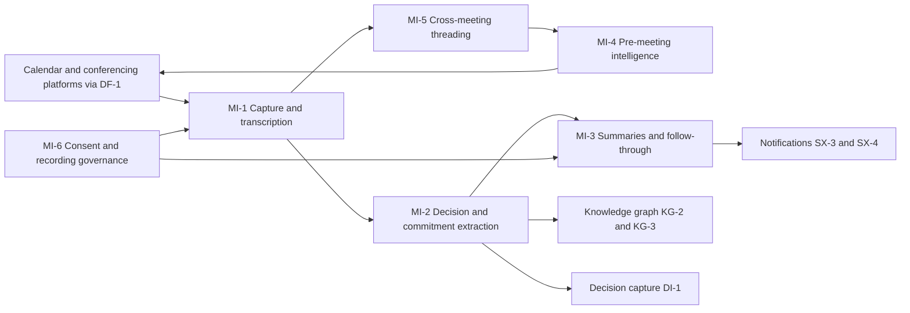
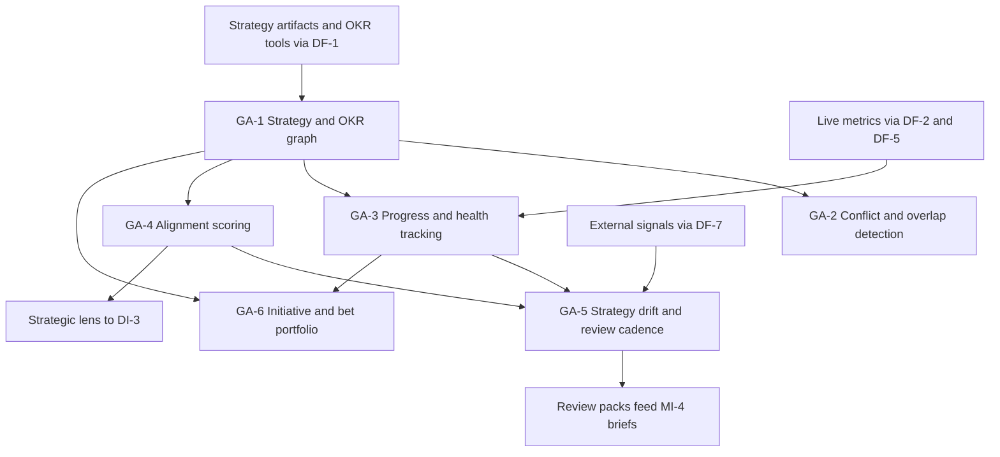
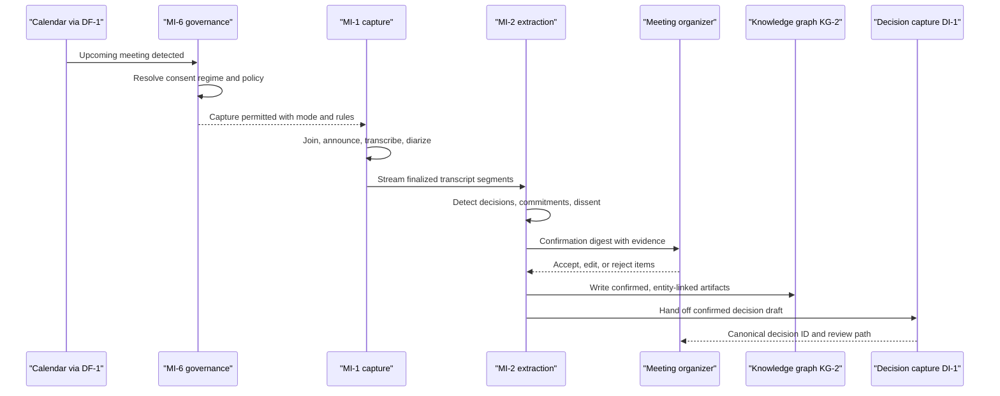

# Meeting & communication intelligence (MI) and goal & strategy alignment (GA) feature catalog

## 1. Front matter

| Field | Value |
|---|---|
| Doc ID | CAT-MI-GA |
| Pillars covered | MI, GA |
| Owning unit | U5 Catalog MI+GA |
| Version | 1.0 |

## 2. Pillar overview & scope boundary

**MI — Meeting & Communication Intelligence.** Meetings are where decisions are born, and most of an organization's reasoning never reaches a system of record. The MI pillar is how TrueNorth hears the company think: it captures meetings and adjacent communication with explicit consent, transcribes and diarizes them, extracts decisions, commitments, owners, deadlines, and recorded dissent, generates permission-aware summaries, tracks follow-through against what was promised, prepares participants before meetings, and threads topics across meetings and channels so that the third discussion of a subject starts from the first two instead of from zero. Every MI capability operates inside a consent and governance envelope (MI-6) that enforces the platform red lines: no covert monitoring, no individual surveillance scoring, no autonomous people decisions. MI is the highest-volume signal source feeding the knowledge graph and the decision engine; its value is converting ephemeral spoken intent into durable, linked, auditable organizational memory.

**GA — Goal & Strategy Alignment.** Strategy fails in the gap between what the board ratified and what ten thousand teams actually do. The GA pillar maintains a living, versioned graph of the company's strategy and OKR cascade from board to individual contributor, detects contradictions, duplicated effort, and orphan goals, tracks progress and goal health from live metrics and work signals rather than self-reported status alone, scores decisions and projects against the strategy graph, watches for strategy drift and stale assumptions, and manages the initiative and bet portfolio through stage gates with explicit kill/persevere signals. GA supplies the strategic lens that the decision engine applies to every proposal, so that a verdict of Endorse or Oppose always answers the question "does this move us toward the strategy we said we have."

**NOT in this pillar (MI):**

- Connectors to calendar, conferencing, chat, and email platforms, and the ingestion pipelines that move their payloads — DF-1, DF-2.
- PII redaction patterns, consent-zone definitions, and purpose tags applied before persistence — DF-4.
- Storage, entity resolution, bitemporal versioning, and retrieval of the knowledge graph that MI writes into — KG-2, KG-3, KG-4.
- Structuring of the canonical decision record, multi-lens evaluation, verdict and minority-report synthesis — DI-1, DI-3, DI-4.
- Rendering of chat plugins, notification delivery, digests, and interruption budgets — SX-3, SX-4.
- Encoding of decision-rights policy, HITL gates, and immutable audit/replay of recommendations — GV-1, GV-2, GV-3.
- Identity, RBAC/ABAC enforcement primitives, encryption, and DLP — SC-1, SC-2.

**NOT in this pillar (GA):**

- Metric ingestion, transformation, quality scoring, and lineage of the metrics goals bind to — DF-2, DF-3, DF-5.
- Forecasting models used to project KR attainment — SF-1; what-if modeling of strategy changes — SF-2; cross-department impact propagation — SF-4.
- Verdict synthesis on individual decisions — DI-4 (GA provides the strategic lens input consumed by DI-3, not the verdict).
- Department-specific KPI packs and workbench surfaces built on the workbench framework — WB-0.
- Executive command-center rendering and role-aware dashboards — SX-1.
- Decision-rights matrices and approval gate enforcement at review time — GV-1, GV-2.
- Org-structure, RACI, and committee modeling that the cascade rides on — KG-6.

## 3. L2 index & capability map

| L2 ID | Name | One-line scope |
|---|---|---|
| MI-1 | Capture & transcription | Calendar-aware, consented capture with diarization and multilingual transcription |
| MI-2 | Decision & commitment extraction | Decisions, action items, owners, deadlines, and recorded dissent from transcripts |
| MI-3 | Summaries & follow-through tracking | Permission-aware summaries and a ledger of commitments tracked to closure |
| MI-4 | Pre-meeting intelligence | Briefs, agenda quality, and required-data checklists before the meeting starts |
| MI-5 | Cross-meeting & cross-channel threading | Topic genealogy across meetings, chat, email, and documents |
| MI-6 | Consent, recording governance & privacy controls | Per-jurisdiction consent, off-the-record zones, retention, and participant rights |
| GA-1 | Strategy & OKR graph | Board-to-individual cascade of goals, key results, and strategy artifacts |
| GA-2 | Conflict & overlap detection | Contradictory goals, duplicated effort, orphan and unsupported goals |
| GA-3 | Progress & health tracking | Live metric binding and status inference for every goal |
| GA-4 | Alignment scoring | Decisions and projects scored against the strategy graph |
| GA-5 | Strategy drift & review cadence | Behavioral and environmental drift detection plus review orchestration |
| GA-6 | Initiative & bet portfolio | Innovation pipeline, stage gates, kill/persevere signals |

## 4. Feature trees (per L2 group)

### MI-1 Capture & transcription

Calendar-aware capture of meetings across conferencing platforms and rooms, with speaker diarization, multilingual transcription, and quality controls, always gated by MI-6 consent policy.

#### MI-1-1 Calendar-aware capture orchestration

- **User story:** As a meeting organizer, I want TrueNorth to know which of my meetings should be captured and to join them automatically under policy, so that capture happens reliably without per-meeting setup.
- **Description:** TrueNorth shall watch tenant calendars (via DF-1), classify upcoming meetings, resolve the applicable capture policy, and schedule capture agents accordingly. Orchestration is the difference between a demo recorder and an organizational nervous system: coverage must be predictable, policy-driven, and visible to participants.

##### MI-1-1-1 Meeting detection & classification

- **Behavior:** TrueNorth shall detect scheduled and ad-hoc meetings from calendar and conferencing events and classify them by type (decision review, standup, 1:1, all-hands, external, interview, board) using title, attendees, recurrence, and agenda text.
- **Data touched:** Calendar events, attendee rosters, conferencing join links, historical classification labels.
- **Model/AI involvement:** Extractive — a lightweight classifier with deterministic overrides from organizer-set meeting type.
- **UX surface:** SX-3 (calendar plugin badge showing detected type and capture status).
- **Acceptance criteria:**
  - ≥95% of policy-eligible scheduled meetings are detected at least 15 minutes before start.
  - Classification is editable by the organizer, and the edit persists for the series.
  - External-participant meetings are flagged distinctly and default to stricter MI-6 handling.

##### MI-1-1-2 Capture policy resolution

- **Behavior:** TrueNorth shall resolve, per meeting, whether capture is permitted and in what mode (full audio+transcript, transcript-only, notes-only, none) by combining tenant policy, meeting classification, jurisdiction rules from MI-6-1, and protected-category exclusions from MI-6-2-3. Resolution shall complete before any capture agent connects.
- **Data touched:** Tenant capture policies, MI-6 consent state, meeting classification, participant jurisdictions.
- **Model/AI involvement:** None — deterministic rule evaluation; ambiguity defaults to no capture.
- **UX surface:** SX-3 (pre-meeting capture-status indicator to all invitees).
- **Acceptance criteria:**
  - Zero captures occur without a resolved permit decision recorded for audit (GV-3 consumes the log).
  - Policy changes propagate to future meetings within 5 minutes.
- **L5 notes:** Fail-closed: any resolution error or timeout results in no capture; this invariant is non-configurable.

##### MI-1-1-3 Capture agent lifecycle management

- **Behavior:** TrueNorth shall join permitted meetings via platform-native bot or media APIs, announce its presence audibly and visually, maintain the session through reconnects, and leave when the meeting ends or when MI-6-2 controls dismiss it.
- **Data touched:** Join tokens, session state, capture health telemetry.
- **Model/AI involvement:** None.
- **UX surface:** SX-3 (in-meeting participant tile and status); SX-4 (organizer alert on join failure).
- **Acceptance criteria:**
  - Join success ≥99.5% of permitted meetings; failed joins alert the organizer within 60 seconds with a one-tap retry.
  - Bot identity names TrueNorth and the policy under which it joined.
- **L5 notes:** Platform API throttling and waiting-room flows are the dominant failure modes; the agent shall retry with backoff for up to 5 minutes, then mark the meeting "capture missed" so MI-3 summaries are not silently absent.

#### MI-1-2 Multi-platform & in-room capture

- **User story:** As an IT administrator, I want one capture capability that spans Zoom, Teams, Meet, telephony, and physical rooms, so that coverage does not depend on which tool a team happens to use.
- **Description:** TrueNorth shall capture audio (and optionally shared-screen text) from major conferencing platforms via their native APIs, from certified in-room devices for hybrid and in-person meetings, and from user-uploaded recordings, normalizing all sources into a single transcript pipeline. Connector transport itself is DF-1; this feature owns the capture semantics on top of it.

##### MI-1-2-1 Conferencing platform capture modes

- **Behavior:** TrueNorth shall support, per platform, the best available capture mode in priority order: native cloud-recording API pull, real-time media stream, visible bot participant. Mode selection is automatic per tenant entitlement and is recorded with the transcript.
- **Data touched:** Platform recordings, real-time media streams, platform participant metadata.
- **Model/AI involvement:** None.
- **UX surface:** SX-1 (admin coverage matrix by platform and mode).
- **Acceptance criteria:**
  - Zoom, Teams, Meet, and Webex supported at GA; mode downgrade (e.g., API outage → bot) is automatic and logged.
  - Captured media is encrypted in transit and at rest per SC-2 before any processing.

##### MI-1-2-2 In-room & hybrid capture

- **Behavior:** TrueNorth shall accept audio from certified room devices and dedicated room kits, merge it with the remote platform stream for hybrid meetings, and tag segments with room identity so diarization can separate in-room speakers.
- **Data touched:** Room device audio, room calendar bindings, device health telemetry.
- **Model/AI involvement:** Extractive — acoustic source separation for overlapping in-room speakers.
- **UX surface:** SX-4 (room panel showing capture-on state, satisfying MI-6-5-1 visibility).
- **Acceptance criteria:**
  - Hybrid meetings yield a single merged transcript with no duplicated utterances from dual capture paths.
  - Rooms display a physical capture indicator whenever audio leaves the room.
- **L5 notes:** Edge case — personal phones placed in rooms are explicitly unsupported as capture devices; only enrolled, labeled devices may capture, preserving the no-covert-monitoring red line.

##### MI-1-2-3 Ad-hoc & uploaded recording ingestion

- **Behavior:** TrueNorth shall let authorized users upload recordings or forward platform recordings for processing, requiring an attestation of participant consent and a meeting-context form (date, attendees, purpose) before ingestion.
- **Data touched:** Uploaded media files, attestation records, manual meeting metadata.
- **Model/AI involvement:** Extractive — same transcription pipeline; attendee roster inferred and then confirmed by uploader.
- **UX surface:** SX-1 (upload workspace); SX-2 (conversational "process this recording").
- **Acceptance criteria:**
  - Uploads without consent attestation are rejected; attestations are immutable audit records.
  - Uploaded meetings are visibly labeled "retrospectively ingested" in all downstream artifacts.

#### MI-1-3 Speech-to-text transcription

- **User story:** As any meeting participant, I want an accurate, timestamped transcript of what was said, so that every downstream extraction and citation rests on a faithful record.
- **Description:** TrueNorth shall produce word-level-timestamped transcripts in streaming and batch modes, adapted to tenant vocabulary, with per-segment confidence. Transcription accuracy is the load-bearing NFR of the entire MI pillar: extraction quality is bounded by it.

##### MI-1-3-1 Streaming transcription

- **Behavior:** TrueNorth shall transcribe live audio with partial hypotheses revised in place, making segments available to in-meeting surfaces and to MI-2 extraction within seconds of utterance.
- **Data touched:** Live audio frames, partial and final transcript segments.
- **Model/AI involvement:** Extractive — streaming ASR served through PL-1 model gateway with stakes/cost routing.
- **UX surface:** SX-3 (live transcript pane and live captions).
- **Acceptance criteria:**
  - p95 finalized-segment latency ≤2 seconds behind live audio.
  - Live captions meet SX-6 accessibility requirements for caption display.

##### MI-1-3-2 Batch high-accuracy re-pass

- **Behavior:** TrueNorth shall re-transcribe the full recording after the meeting with a higher-accuracy model and full-context decoding, reconciling the result against the streaming transcript and re-running affected MI-2 extractions when material diffs are found.
- **Data touched:** Recorded audio, streaming transcript, diff log, re-extraction queue.
- **Model/AI involvement:** Extractive — large ASR model, batch scheduled for cost efficiency via PL-6 budgets.
- **Acceptance criteria:**
  - Re-pass completes within 30 minutes of meeting end for 95% of meetings ≤2 hours.
  - Downstream artifacts display which transcript generation they cite.

##### MI-1-3-3 Domain vocabulary adaptation

- **Behavior:** TrueNorth shall bias transcription with tenant-specific vocabulary — product names, project codenames, acronyms, people and customer names — sourced from the knowledge graph ontology (KG-1) and a curated glossary, updated continuously.
- **Data touched:** Tenant glossary, KG entity name dictionary, correction history from MI-1-6-2.
- **Model/AI involvement:** Extractive — vocabulary boosting / shallow adaptation, no per-tenant model training unless PL-5 is engaged.
- **Acceptance criteria:**
  - Named-entity transcription accuracy improves measurably (target ≥30% relative error reduction on tenant entity names versus unadapted baseline) on a PL-4 golden set.
  - Glossary updates take effect on next meeting without redeployment.

#### MI-1-4 Speaker diarization & identity resolution

- **User story:** As a decision reviewer, I want every statement attributed to the right person, so that owners, deciders, and dissenters in MI-2 extractions are trustworthy.
- **Description:** TrueNorth shall segment audio by speaker, map segments to known participants using platform identity, roster context, and optional opt-in voice enrollment, and handle unknown or guest speakers conservatively.

##### MI-1-4-1 Speaker segmentation

- **Behavior:** TrueNorth shall partition each meeting's audio into speaker turns, including overlapped-speech handling, producing speaker-anonymous segment labels as the substrate for identity mapping.
- **Data touched:** Audio features, segment boundaries, overlap annotations.
- **Model/AI involvement:** Extractive — diarization model; no voiceprints persisted at this stage.
- **Acceptance criteria:**
  - Diarization error rate ≤10% on the PL-4 meeting benchmark; overlapped speech is flagged rather than misattributed.

##### MI-1-4-2 Identity mapping

- **Behavior:** TrueNorth shall map speaker segments to named participants using platform active-speaker signals, roster matching, self-introductions, and — only where the individual has explicitly opted in under MI-6 — voice enrollment. Attribution below a confidence threshold renders as "Unconfirmed: likely <name>."
- **Data touched:** Participant roster, platform speaker events, opt-in voice templates (stored per SC-2, deletable on demand).
- **Model/AI involvement:** Extractive — multimodal attribution scoring.
- **UX surface:** SX-3 (one-tap attribution correction in the transcript view).
- **Acceptance criteria:**
  - ≥95% attribution accuracy for platform-identified remote speakers; ≥90% for enrolled in-room speakers.
  - Voice templates are per-tenant, never shared, and deleted within 24 hours of opt-out.
- **L5 notes:** Voice enrollment is biometric data in several jurisdictions; enrollment is blocked unless the tenant has enabled the corresponding MI-6-1 jurisdiction module. See Open questions.

##### MI-1-4-3 Guest & unknown speaker handling

- **Behavior:** TrueNorth shall label non-resolvable speakers as numbered guests, never guessing identities from external directories, and shall let the organizer name guests post-meeting with that naming logged as human-asserted.
- **Data touched:** Guest segment labels, organizer assertions.
- **Model/AI involvement:** None beyond MI-1-4-2 scores.
- **Acceptance criteria:**
  - No automatic identity assignment for participants outside the tenant directory.
  - Organizer naming is editable and version-logged.

#### MI-1-5 Multilingual transcription & translation

- **User story:** As a leader of a global team, I want meetings in any major language — including mid-meeting language switches — transcribed and readable in my language, so that alignment does not stop at language borders.
- **Description:** TrueNorth shall identify spoken languages, transcribe in the source language, and produce translated renditions of transcripts and downstream summaries, with translation always labeled as such.

##### MI-1-5-1 Language identification & code-switching

- **Behavior:** TrueNorth shall detect the language per segment, supporting mid-meeting and mid-utterance switches among supported languages, and route segments to the correct ASR model.
- **Data touched:** Audio segments, language tags per segment.
- **Model/AI involvement:** Extractive — language-ID model upstream of ASR.
- **Acceptance criteria:**
  - ≥25 languages at GA; segment-level language tags ≥97% accurate on benchmark.

##### MI-1-5-2 Translated renditions

- **Behavior:** TrueNorth shall generate on-demand translated transcripts and translate MI-3 summaries into each recipient's preferred language, preserving citation anchors to the source-language transcript and marking machine translation visibly.
- **Data touched:** Source transcripts, translation memory, user language preferences.
- **Model/AI involvement:** Generative — translation via PL-1; quotations used as decision evidence link to source language.
- **UX surface:** SX-6 (language preference handling); SX-1 (toggle between source and translation).
- **Acceptance criteria:**
  - Any quoted evidence in a decision record cites the source-language span, with translation shown alongside.
  - Translation never substitutes for the source transcript in GV-3 audit replay.

#### MI-1-6 Transcript quality & correction

- **User story:** As a meeting participant, I want to fix transcription errors once and have every derived artifact update, so that the record converges on truth instead of fossilizing mistakes.
- **Description:** TrueNorth shall expose per-segment confidence, accept human corrections from authorized participants, and propagate corrections to summaries, extractions, and graph assertions.

##### MI-1-6-1 Confidence-scored segments

- **Behavior:** TrueNorth shall attach a confidence score to every transcript segment, visually de-emphasize low-confidence spans, and exclude spans below a tenant-set threshold from automatic MI-2 extraction (routing them to human confirmation instead).
- **Data touched:** Segment confidence metadata, extraction eligibility flags.
- **Model/AI involvement:** Extractive — ASR confidence calibration tracked by PL-4.
- **Acceptance criteria:**
  - Confidence calibration error ≤5 points on golden sets; low-confidence spans never silently feed decision evidence.

##### MI-1-6-2 Correction & propagation

- **Behavior:** TrueNorth shall let meeting participants (and only participants, by default) correct transcript text and speaker attribution; corrections shall version the transcript, trigger re-extraction of affected MI-2 items, flag affected summaries for regeneration, and feed MI-1-3-3 vocabulary adaptation.
- **Data touched:** Transcript versions, correction audit trail, downstream artifact dependency index.
- **Model/AI involvement:** None for the edit; extractive re-runs downstream.
- **UX surface:** SX-1 and SX-3 (inline correction).
- **Acceptance criteria:**
  - Propagation to summaries and open extractions completes within 10 minutes.
  - Original text remains retrievable in version history for GV-3 audit, subject to MI-6-3 retention.

### MI-2 Decision & commitment extraction

Extraction of decisions, action items, owners, deadlines, and recorded dissent from transcripts and linked channels, producing structured, human-confirmed artifacts wired into the knowledge graph and the decision engine.

#### MI-2-1 Decision detection & structuring

- **User story:** As a team lead, I want decisions made in meetings to become structured, citable records without me writing them up, so that nothing decided ever exists only in attendees' memories.
- **Description:** TrueNorth shall detect when a decision is made, proposed, or deferred in conversation; assemble it into a draft structured decision (what was decided, options discussed, rationale, decider, conditions); pre-classify stakes; and hand confirmed drafts to the decision engine. This is the single most important bridge in the platform: speech becomes a decision record.

##### MI-2-1-1 Decision utterance detection

- **Behavior:** TrueNorth shall identify decision events in transcripts — explicit ("we're going with option B"), implicit (convergence after debate), and negative (explicit deferral or rejection) — each with a transcript-anchored evidence span and a detection confidence.
- **Data touched:** Transcript segments, detection spans, confidence scores.
- **Model/AI involvement:** Generative/extractive — LLM extraction with structured output, evaluated against PL-4 golden meeting sets.
- **Acceptance criteria:**
  - Recall ≥90% and precision ≥85% for explicit decisions on the golden set; implicit decisions are always flagged "inferred" pending MI-2-4 confirmation.
  - Every detection carries at least one verbatim evidence span.

##### MI-2-1-2 Decision structuring

- **Behavior:** TrueNorth shall expand each detected decision into a draft record: decision statement, options considered, stated rationale, named decider(s), conditions or dependencies voiced, and links to entities resolved by MI-2-5. Fields the conversation did not cover are explicitly marked absent, not invented.
- **Data touched:** Draft decision records, evidence spans, entity links.
- **Model/AI involvement:** Generative — schema-constrained extraction; hallucination guard rejects fields lacking an evidence span.
- **UX surface:** SX-1 (draft review card); SX-3 (in-channel draft preview).
- **Acceptance criteria:**
  - 100% of populated fields carry transcript citations; uncited fields cannot be populated by the model.
  - Drafts render within 10 minutes of meeting end (p95).

##### MI-2-1-3 Stakes pre-classification

- **Behavior:** TrueNorth shall suggest a stakes tier (S1–S4) for each draft decision using blast-radius heuristics (budget mentioned, org scope, customer or regulatory exposure, reversibility) so the correct DI-7 review path engages; humans confirm or override, and overrides are logged.
- **Data touched:** Draft decisions, stakes heuristics, override history.
- **Model/AI involvement:** Judge — classification with rationale; calibration monitored via PL-4.
- **Acceptance criteria:**
  - Suggested tier matches the human-confirmed tier ≥80% of the time after the first quarter of tenant operation.
  - S1/S2 suggestions always require human confirmation before any downstream routing.

##### MI-2-1-4 Decision-engine handoff

- **Behavior:** TrueNorth shall transmit confirmed decision drafts to decision capture (DI-1) with full provenance (meeting, spans, confirmer), and shall receive back the canonical decision ID so the meeting record and the decision record permanently cross-reference each other.
- **Data touched:** Confirmed drafts, provenance envelope, cross-reference IDs.
- **Model/AI involvement:** None — contract-governed handoff.
- **Acceptance criteria:**
  - Handoff is exactly-once; duplicate meeting re-processing never creates duplicate decision records.
  - The meeting page shows the decision's current DI status and eventual verdict.

#### MI-2-2 Commitment & action item extraction

- **User story:** As a chief of staff, I want every "I'll do X by Friday" captured with owner and deadline, so that commitments survive contact with the next meeting.
- **Description:** TrueNorth shall extract commitments and action items with owner, deliverable, due date, and beneficiary, resolving ambiguity conservatively and syncing accepted items to the team's task systems.

##### MI-2-2-1 Commitment detection

- **Behavior:** TrueNorth shall detect commitment utterances — first-person promises, assigned actions, and conditional commitments ("if legal clears it, I'll ship Tuesday") — distinguishing them from hypotheticals and brainstorming, each with evidence spans and confidence.
- **Data touched:** Transcript segments, commitment candidates, condition annotations.
- **Model/AI involvement:** Generative/extractive — LLM extraction tuned for high recall, with MI-2-4 confirmation absorbing false positives.
- **Acceptance criteria:**
  - Recall ≥92% on golden sets; conditional commitments retain their condition as a structured field.

##### MI-2-2-2 Owner & deadline resolution

- **Behavior:** TrueNorth shall resolve "I/you/someone from platform team" to directory identities using diarization, roster, and org context (KG-6), and normalize relative dates ("end of quarter," "before the launch") to calendar dates using tenant calendars and linked project milestones; unresolvable owners or dates are flagged for the organizer rather than guessed.
- **Data touched:** Diarized spans, org directory, fiscal calendar, project milestones.
- **Model/AI involvement:** Extractive — coreference and temporal normalization.
- **Acceptance criteria:**
  - Owner resolution accuracy ≥95% where diarization is confirmed; zero auto-assignment to people not present or not named.
  - Ambiguous items appear in the MI-2-4 digest as "needs owner/date."

##### MI-2-2-3 Task system synchronization

- **Behavior:** TrueNorth shall create or link tasks in the team's tools (Jira, Asana, Planner — via DF-1) for accepted commitments, maintain bidirectional status sync, and record the external task ID on the commitment for MI-3-2 follow-through.
- **Data touched:** Commitment records, external task IDs, sync state.
- **Model/AI involvement:** None.
- **UX surface:** SX-3 (accept-and-sync action in chat); SX-5 (webhooks for custom task systems).
- **Acceptance criteria:**
  - Sync round-trip status changes reflect within 5 minutes; deletion in the external tool marks the commitment "externally removed," never silently deletes it.

#### MI-2-3 Dissent & concern capture

- **User story:** As a senior reviewer, I want documented dissent preserved alongside the decision it challenges, so that minority views are institutional memory, not casualties of consensus.
- **Description:** TrueNorth shall detect substantive disagreement and voiced risk concerns, attach them to the relevant decision or topic, and make them available to the decision engine's devil's-advocate machinery. Dissent capture serves the dissenter: it is attributed only with confirmation and is never aggregated into any individual metric.

##### MI-2-3-1 Dissent detection & confirmation

- **Behavior:** TrueNorth shall detect explicit objections, hedged concerns, and unresolved questions raised against a proposal; each detected dissent is routed privately to the speaker for confirmation, anonymization, or withdrawal before it attaches visibly to the record.
- **Data touched:** Dissent candidates, speaker confirmations, anonymization flags.
- **Model/AI involvement:** Generative/extractive — stance detection with evidence spans.
- **UX surface:** SX-3 (private confirmation prompt to the speaker); SX-4 (mobile confirmation).
- **Acceptance criteria:**
  - No attributed dissent appears on a record without speaker confirmation or explicit tenant policy permitting attributed capture in formal review meetings (policy state logged).
  - Anonymized dissent preserves content while severing attribution irreversibly in derived artifacts.
- **L5 notes:** This confirmation flow is a red-line safeguard: dissent must never become a surveillance signal; per the canonical red lines, no per-person dissent statistics are computed anywhere in the platform.

##### MI-2-3-2 Dissent linkage to decision records

- **Behavior:** TrueNorth shall attach confirmed dissents to the corresponding decision record so DI-5 can weigh them in devil's-advocate analysis and DI-4 can reflect them in the minority report; dissents that later prove predictive are surfaced by the outcome loop (DI-8) as institutional learning.
- **Data touched:** Decision-dissent links, dissent status (confirmed/anonymous), outcome annotations.
- **Model/AI involvement:** None — linkage and lifecycle only.
- **Acceptance criteria:**
  - Every decision record handed to DI-1 includes all confirmed dissents captured in its source meetings.
  - Dissent content is permission-scoped identically to the decision record it attaches to.

#### MI-2-4 Human confirmation & correction workflow

- **User story:** As a meeting organizer, I want a two-minute review of everything TrueNorth extracted before it becomes the record, so that the human, not the model, is the author of the organizational memory.
- **Description:** TrueNorth shall present a post-meeting confirmation digest of all extracted decisions, commitments, and dissents for accept/edit/reject, and shall learn from corrections. Nothing extracted enters the knowledge graph or the decision engine as confirmed fact without this human gate (drafts are visible but watermarked "unconfirmed").

##### MI-2-4-1 Post-meeting confirmation digest

- **Behavior:** TrueNorth shall deliver a single digest to the organizer (and optionally designated reviewers) listing every extraction with evidence spans, one-tap accept/edit/reject, bulk actions, and a deadline after which unreviewed items remain in "unconfirmed" state — they are never auto-promoted.
- **Data touched:** Extraction candidates, review actions, reviewer identity, digest delivery state.
- **Model/AI involvement:** None in the gate itself.
- **UX surface:** SX-3 (chat digest), SX-4 (mobile), SX-1 (full review workspace).
- **Acceptance criteria:**
  - Digest delivered within 10 minutes of meeting end (p95); median review time ≤3 minutes for a 60-minute meeting (AD-3 tracks this).
  - Unconfirmed items are visibly watermarked in every surface and excluded from GA-4 scoring inputs.

##### MI-2-4-2 Correction learning loop

- **Behavior:** TrueNorth shall log every edit and rejection as labeled data, aggregate it per tenant, and feed PL-4 evaluation and PL-5 adaptation so extraction quality measurably improves; per-user correction patterns are used only for model improvement, never for user evaluation.
- **Data touched:** Correction logs, anonymized training aggregates.
- **Model/AI involvement:** None at runtime; feeds offline evaluation and tuning.
- **Acceptance criteria:**
  - Quarterly extraction-quality report per tenant shows trend against baseline.
  - Correction data is excluded from any people-analytics export.

#### MI-2-5 Knowledge graph entity linking

- **User story:** As a knowledge platform owner, I want every extracted artifact linked to canonical graph entities, so that meetings enrich one connected memory instead of a pile of documents.
- **Description:** TrueNorth shall resolve mentions in extractions — people, teams, projects, goals, customers, suppliers, metrics, policies — to canonical knowledge-graph entities, and route unresolvable mentions to curation.

##### MI-2-5-1 Mention resolution

- **Behavior:** TrueNorth shall link entity mentions in confirmed extractions to KG entities via the resolution services of KG-2, attaching link confidence; links below threshold are marked tentative and shown with a distinct affordance.
- **Data touched:** Entity mentions, KG entity IDs, link confidence.
- **Model/AI involvement:** Extractive — candidate generation and ranking.
- **Acceptance criteria:**
  - ≥90% of person/team/project mentions in confirmed extractions resolve automatically; tentative links never silently feed GA-4 alignment scoring.

##### MI-2-5-2 New-entity proposal queue

- **Behavior:** TrueNorth shall propose new graph entities when meetings reveal projects, customers, or initiatives absent from the graph, submitting them to the KG-5 curation queue with meeting evidence attached rather than creating them unilaterally.
- **Data touched:** Entity proposals, evidence spans, curation status.
- **Model/AI involvement:** Generative — proposal drafting with cited evidence.
- **Acceptance criteria:**
  - Zero direct entity creation from MI; all go through KG-5 validation.
  - Accepted proposals retro-link the originating mentions automatically.

### MI-3 Summaries & follow-through tracking

Permission-aware meeting summaries in multiple formats, and a commitment ledger that tracks what was promised through to closure, renegotiation, or escalation.

#### MI-3-1 Role-aware meeting summaries

- **User story:** As an executive who missed a meeting, I want a summary scoped to what I am allowed to see and shaped for my role, so that I can absorb in two minutes what happened in sixty.
- **Description:** TrueNorth shall generate layered summaries — headline, decision-and-action digest, full narrative minutes, and absent-attendee catch-up — each permission-scoped per reader and anchored to transcript citations.

##### MI-3-1-1 Multi-format summary generation

- **Behavior:** TrueNorth shall produce, per meeting, a one-paragraph headline, a structured decisions/commitments/dissents digest, narrative minutes, and a "what you missed and what needs you" catch-up variant for invited absentees, regenerating affected formats when transcripts or extractions change.
- **Data touched:** Transcripts, confirmed extractions, summary artifacts and versions.
- **Model/AI involvement:** Generative — summarization via PL-1 with grounding checks; every factual sentence must map to a transcript span.
- **UX surface:** SX-1 (meeting page), SX-3 (digest in channel), SX-4 (mobile digest).
- **Acceptance criteria:**
  - All formats available within 15 minutes of meeting end (p95).
  - Grounding audit on PL-4 samples finds <2% unsupported statements.

##### MI-3-1-2 Permission-scoped rendition

- **Behavior:** TrueNorth shall render each summary against the reader's entitlements (SC-1) so that classified topics, protected segments, or restricted attachments are omitted — not blacked out conspicuously — and shall never leak restricted content through paraphrase.
- **Data touched:** Reader entitlements, content classifications, redaction maps from MI-6-4.
- **Model/AI involvement:** Generative with policy-constrained context: restricted spans are excluded from the model context entirely, not post-filtered.
- **Acceptance criteria:**
  - Red-team tests per SC-3 show zero restricted-content leakage through summaries.
  - Two readers with different entitlements get internally consistent but differently scoped summaries.

##### MI-3-1-3 Citation anchoring

- **Behavior:** TrueNorth shall hyperlink every summary claim to its transcript span (and recording timestamp where retained) so any reader can verify the source in one click; citation density is a quality metric, not an option.
- **Data touched:** Claim-to-span citation maps.
- **Model/AI involvement:** Extractive alignment of generated claims to source spans.
- **Acceptance criteria:**
  - ≥95% of summary sentences carry at least one resolvable citation; broken citations (e.g., post-deletion) render as "source expired under retention policy."

#### MI-3-2 Commitment follow-through ledger

- **User story:** As a program manager, I want one ledger of every open commitment with live status, so that follow-through stops depending on whoever kept the best notes.
- **Description:** TrueNorth shall maintain each commitment through an explicit state machine, infer progress from connected work signals, and treat renegotiation as a first-class outcome rather than silent slippage.

##### MI-3-2-1 Commitment state machine

- **Behavior:** TrueNorth shall track states open → in-progress → done / dropped / renegotiated / superseded, with transitions from owner action, task-system sync (MI-2-2-3), signal inference, or meeting mentions; every transition records its trigger and evidence.
- **Data touched:** Commitment records, state transitions, evidence references.
- **Model/AI involvement:** None for the state machine; inference inputs come from MI-3-2-2.
- **Acceptance criteria:**
  - No commitment can be closed without a recorded trigger; bulk closes require a stated reason.
  - State history is immutable and queryable as-of any date (storage via KG-3).

##### MI-3-2-2 Signal-based status inference

- **Behavior:** TrueNorth shall infer probable status from linked signals — task transitions, document edits, code merges, follow-up meeting mentions (via DF-2 feeds) — and present inferred status as a labeled suggestion to the owner, never overriding owner-asserted status.
- **Data touched:** Work-signal events, inference scores, owner assertions.
- **Model/AI involvement:** Judge — weak-supervision scoring of completion likelihood.
- **Acceptance criteria:**
  - Inferred "likely done" suggestions are ≥85% precise on confirmation; disagreements between inferred and asserted status are surfaced to the owner only.
- **L5 notes:** Anti-surveillance constraint: inference exists to reduce status-chasing, not to police individuals; per the red lines, no individual completion-rate metric is computed or exportable anywhere in MI-3.

##### MI-3-2-3 Renegotiation & supersession tracking

- **Behavior:** TrueNorth shall detect when a later meeting changes a commitment's deadline, owner, or scope, link the old and new versions, and notify affected stakeholders of the renegotiation; commitments orphaned by a reversed decision are flagged for explicit disposition.
- **Data touched:** Commitment versions, renegotiation links, stakeholder notification log.
- **Model/AI involvement:** Extractive — change detection across meetings via MI-5 threading.
- **Acceptance criteria:**
  - Renegotiated commitments never show as "missed"; the chain old→new is navigable in both directions.

#### MI-3-3 Nudges, reminders & escalation

- **User story:** As a commitment owner, I want well-timed, low-noise reminders — and as a team lead, I want stuck items raised at the team level — so that follow-through improves without nagging.
- **Description:** TrueNorth shall remind owners with respect for interruption budgets and escalate aging items as aggregate team signals, never as individual league tables.

##### MI-3-3-1 Owner reminders

- **Behavior:** TrueNorth shall send owners reminders ahead of due dates, tuned by item stakes and the owner's interruption budget (delivery via SX-4), with one-tap actions: done, update date (triggers MI-3-2-3), reassign, or drop with reason.
- **Data touched:** Commitment due dates, reminder schedules, response actions.
- **Model/AI involvement:** None beyond schedule heuristics.
- **Acceptance criteria:**
  - Reminder volume respects SX-4 budgets; every reminder is actionable in one tap; opt-out per commitment is honored.

##### MI-3-3-2 Aggregate escalation

- **Behavior:** TrueNorth shall surface overdue or stuck commitments to the owning team's lead and meeting series as an aggregate list ("4 items from the Q3 launch review are >2 weeks overdue"), and shall raise decision-blocking items into the relevant DI-7 review workflow; individual-level rollups across teams are not produced.
- **Data touched:** Aggregated overdue sets, escalation routing (team ownership from KG-6).
- **Model/AI involvement:** None.
- **UX surface:** SX-1 (team follow-through board), SX-3 (series-channel recap).
- **Acceptance criteria:**
  - Escalations identify items and blocking impact, not people-ranked statistics; GV-6 prohibited-use tests verify no individual scoring path exists.

#### MI-3-4 Meeting & follow-through analytics

- **User story:** As a COO, I want to know whether our meetings produce decisions and whether decisions produce action — at the organizational level — so that we fix the operating system, not blame individuals.
- **Description:** TrueNorth shall compute meeting-level and org-level effectiveness indicators (decision yield, agenda adherence, follow-through latency) as aggregates with k-anonymity floors, feeding AD-3 usage analytics and AD-4 value narratives.

##### MI-3-4-1 Meeting effectiveness indicators

- **Behavior:** TrueNorth shall score each captured meeting on decision yield (decisions per decision-intended meeting), agenda adherence, attendance fit versus MI-4-4 suggestions, and unresolved-topic carryover, reported to the organizer privately and to org views only in aggregate.
- **Data touched:** Meeting metadata, extraction counts, agenda comparisons.
- **Model/AI involvement:** Judge — rubric scoring with stated criteria.
- **Acceptance criteria:**
  - Organizer sees their own meeting scores; org dashboards show only cohorts ≥10 meetings and ≥5 distinct organizers.

##### MI-3-4-2 Org follow-through health

- **Behavior:** TrueNorth shall report org- and department-level follow-through health — median commitment closure time, renegotiation rate, decision-to-action latency — trended over time and linkable to GA-3 goal health for joint diagnosis.
- **Data touched:** Aggregated commitment statistics, department mapping from KG-6.
- **Model/AI involvement:** None — descriptive statistics.
- **UX surface:** SX-1 (org health view).
- **Acceptance criteria:**
  - All published aggregates satisfy the k-anonymity floor; drill-down stops at team level, per the red lines.

#### MI-4 Pre-meeting intelligence

- This L2's features prepare the meeting before it happens.

#### MI-4-1 Pre-meeting brief generation

- **User story:** As an attendee, I want a brief that tells me what this meeting is about, what has already been decided, and what is expected of me, so that the meeting starts at minute zero instead of minute twenty.
- **Description:** TrueNorth shall assemble per-meeting briefs from topic history (MI-5), related decisions and their verdicts, relevant goals (GA-1), open commitments among attendees, and attached documents, personalized per attendee and delivered at the right moment.

##### MI-4-1-1 Context assembly

- **Behavior:** TrueNorth shall retrieve, for each agenda topic, the topic genealogy thread, prior decisions with status, open related commitments, bound goal health (GA-3), and the most relevant documents via permission-aware retrieval (KG-4), composing them into a structured brief with citations.
- **Data touched:** Agenda items, topic threads, decision records, goal health snapshots, document references.
- **Model/AI involvement:** Generative — brief composition over retrieved, permission-filtered context.
- **Acceptance criteria:**
  - Brief generation completes ≥2 hours before meeting start for scheduled meetings; every claim carries a citation.
  - Briefs for decision meetings include the relevant prior verdicts and any unresolved conditions.

##### MI-4-1-2 Per-attendee personalization

- **Behavior:** TrueNorth shall tailor each attendee's brief to their role and entitlements: their open commitments for this topic, what they are expected to bring (from MI-4-3), and a "changes since you last engaged" delta; content the attendee cannot access is excluded at retrieval, not summarized around.
- **Data touched:** Attendee entitlements, engagement history, commitment ownership.
- **Model/AI involvement:** Generative over per-reader filtered context.
- **UX surface:** SX-3 (calendar-attached brief), SX-4 (mobile brief).
- **Acceptance criteria:**
  - Two attendees with different entitlements receive consistent but non-leaking briefs (SC-3 test class).

##### MI-4-1-3 Delivery & timing

- **Behavior:** TrueNorth shall deliver briefs at user-preferred lead times, refresh them if material context changes before the meeting, and mark stale briefs visibly; unread critical briefs for S1/S2 decision meetings are flagged to the organizer.
- **Data touched:** Delivery preferences, read receipts (meeting-scoped only), refresh triggers.
- **Model/AI involvement:** None.
- **Acceptance criteria:**
  - Refreshes never silently rewrite a brief a user already read — deltas are shown; read receipts are visible only to the meeting organizer for that meeting.

#### MI-4-2 Agenda quality & decision framing

- **User story:** As a meeting organizer, I want help writing an agenda that states intended outcomes and frames decisions properly, so that the meeting is built to decide rather than to talk.
- **Description:** TrueNorth shall score agenda completeness and convert vague decision items into structured decision frames compatible with DI-1.

##### MI-4-2-1 Agenda completeness scoring

- **Behavior:** TrueNorth shall evaluate agendas against a rubric — stated purpose, intended outcomes per item, time allocation, owner per item, pre-reads attached — returning a score with specific fixes; for meetings without an agenda, it shall propose one from the invite, the series history, and open threads.
- **Data touched:** Agenda text, invite metadata, series history.
- **Model/AI involvement:** Judge — rubric scoring; generative for proposed agendas.
- **UX surface:** SX-3 (calendar compose-time assistant).
- **Acceptance criteria:**
  - Scoring returns in <5 seconds at compose time; suggestions are dismissible and dismissal is never reported upward.

##### MI-4-2-2 Decision framing assistant

- **Behavior:** TrueNorth shall transform agenda items tagged "decision" into a draft decision frame — question, options known so far, criteria, decider per decision rights (KG-6, GV-1), stakes suggestion — so the meeting inherits a DI-1-compatible structure before it starts.
- **Data touched:** Agenda decision items, draft frames, decision-rights lookups.
- **Model/AI involvement:** Generative — framing draft with cited precedent from DI-2 where similar past decisions exist.
- **Acceptance criteria:**
  - Frames identify the accountable decider or explicitly state "decider unclear — resolve before meeting."
  - A frame accepted by the organizer pre-populates the eventual MI-2-1 draft.

#### MI-4-3 Required-data & readiness checklists

- **User story:** As a decision meeting chair, I want to know before the meeting whether the data and people needed to decide will be in the room, so that we stop convening meetings that cannot conclude.
- **Description:** TrueNorth shall derive, per decision item, the evidence and the stakeholders required, check their availability, and report a readiness status to the organizer.

##### MI-4-3-1 Evidence readiness checklist

- **Behavior:** TrueNorth shall list the data and documents a framed decision needs — drawing on evidence patterns for similar decisions (DI-2) — check which exist and are current, and flag gaps ("no updated cost model since the scope change") with owners asked to supply them.
- **Data touched:** Decision frames, evidence inventories, data freshness from DF-3 quality scores.
- **Model/AI involvement:** Generative — checklist derivation; deterministic freshness checks.
- **Acceptance criteria:**
  - Checklist issued ≥24 hours before meeting where scheduling allows; each gap names a requested owner and links the request.

##### MI-4-3-2 Stakeholder & decision-rights readiness

- **Behavior:** TrueNorth shall verify that the accountable decider and required consulted parties (per KG-6 RACI and GV-1 policy) are invited and have accepted, flagging "decision meeting without the decider" and suggesting delegates per the decision-rights matrix.
- **Data touched:** Invite/acceptance state, RACI mappings, delegation records.
- **Model/AI involvement:** None — deterministic checks against org model.
- **UX surface:** SX-3 (organizer readiness banner).
- **Acceptance criteria:**
  - 100% of S1–S2 framed decisions get a readiness check; suggestions are advisory only — humans control invites.

#### MI-4-4 Meeting necessity & format advisor

- **User story:** As an organizer, I want a gentle signal when a meeting could be an async thread or needs fewer people, so that we spend synchronous time only where it earns its cost.
- **Description:** TrueNorth shall advise — never enforce — on whether a meeting is needed and who is essential, based on the agenda's decision content and historical patterns of similar meetings.

##### MI-4-4-1 Async-alternative suggestion

- **Behavior:** TrueNorth shall flag agendas with no decision items and no discussion-dependent outcomes as async candidates, offering to spin up the equivalent async thread (posted via SX-3) with the same brief and follow-through tracking.
- **Data touched:** Agenda content, series outcome history.
- **Model/AI involvement:** Judge — async-suitability heuristic with stated reasons.
- **Acceptance criteria:**
  - Suggestion appears only to the organizer; acceptance rate is tracked in AD-3 as an advisory-quality metric, declines are never escalated.

##### MI-4-4-2 Attendee-fit suggestions

- **Behavior:** TrueNorth shall compare invite lists with the topic's RACI and past contribution patterns at the role level, suggesting missing required roles and flagging meetings whose size historically correlates with non-conclusion; it shall not score or report any individual's "meeting usefulness."
- **Data touched:** Invite lists, RACI mappings, anonymized series-size statistics.
- **Model/AI involvement:** None — rule and statistics based.
- **Acceptance criteria:**
  - Suggestions reference roles, not named individuals' past behavior; GV-6 review confirms no individual-contribution metric is produced.

### MI-5 Cross-meeting & cross-channel threading

Topic genealogy connecting meetings, chat, email, and documents into navigable threads, with detection of topics that circle without concluding.

#### MI-5-1 Topic genealogy graph

- **User story:** As a new initiative owner, I want the full lineage of how a topic evolved across every meeting that touched it, so that I inherit the reasoning, not just the latest conclusion.
- **Description:** TrueNorth shall detect topics, canonicalize them across phrasing variants, and maintain a genealogy of discussions, decisions, and forks navigable in time order; persistence and as-of queries ride on KG-3.

##### MI-5-1-1 Topic detection & canonicalization

- **Behavior:** TrueNorth shall segment meetings into topic spans, embed and cluster them across meetings, and bind clusters to canonical topic entities (existing KG entities where they match, new topic nodes via KG-5 proposal otherwise), merging aliases ("Phoenix pricing" = "EU price restructure").
- **Data touched:** Topic spans, embeddings, canonical topic bindings, alias maps.
- **Model/AI involvement:** Extractive — segmentation, embedding, clustering; merge suggestions above threshold auto-apply, below threshold queue for curation.
- **Acceptance criteria:**
  - Topic continuity across a recurring series ≥90% on golden sets; bad merges are splittable with full lineage repair.

##### MI-5-1-2 Thread linking & forking

- **Behavior:** TrueNorth shall link each topic's appearances in time order, recording what changed at each step (new option, new evidence, decision, reversal) and representing forks when one topic splits into several workstreams, each fork inheriting ancestry.
- **Data touched:** Thread edges, change annotations, fork relations.
- **Model/AI involvement:** Generative — change-summary annotation per link, citation-anchored.
- **Acceptance criteria:**
  - From any meeting, a reader reaches the topic's first recorded discussion in ≤3 navigation steps.

##### MI-5-1-3 Genealogy visualization & replay

- **Behavior:** TrueNorth shall render a topic's genealogy as an interactive timeline with decisions, dissents, and evidence milestones, supporting as-of replay ("what did we know when we chose the supplier") backed by KG-3 bitemporal queries.
- **Data touched:** Thread graph, decision references, as-of snapshots.
- **Model/AI involvement:** None for rendering; generative for the optional narrated recap.
- **UX surface:** SX-1 (topic page), SX-2 ("tell me the history of X").
- **Acceptance criteria:**
  - Replay shows only artifacts that existed at the as-of date; later corrections are visibly layered, not blended.

#### MI-5-2 Cross-channel signal weaving

- **User story:** As a team lead, I want the Slack thread, the email chain, and the meeting about the same issue connected, so that the record reflects where the conversation actually happened.
- **Description:** TrueNorth shall link chat threads, email chains, and documents (ingested via DF-1 within DF-4 consent zones) to topic threads and commitments, and identify which channel holds the authoritative state.

##### MI-5-2-1 Channel linkage

- **Behavior:** TrueNorth shall match chat/email/document discussions to existing topic threads using entities, participants, and content similarity, attaching them as thread evidence with the same confirmation watermarking as meeting extractions; only channels inside tenant-configured consent zones are read.
- **Data touched:** Channel messages within consent zones, linkage edges, confidence scores.
- **Model/AI involvement:** Extractive — cross-channel matching.
- **Acceptance criteria:**
  - Zero ingestion from channels outside DF-4 consent zones; links are removable by channel owners and removals propagate.

##### MI-5-2-2 Channel-of-record determination

- **Behavior:** TrueNorth shall identify, per topic, where the latest authoritative state lives (e.g., the decision was modified in Slack after the meeting) and surface divergence between the meeting record and later channel activity as a "record drift" flag prompting an MI-2-4-style confirmation.
- **Data touched:** Topic state versions, divergence flags.
- **Model/AI involvement:** Judge — divergence materiality scoring.
- **Acceptance criteria:**
  - A decision modified post-meeting in chat triggers a drift flag within 1 hour; the decision record is updated only through human confirmation.

#### MI-5-3 Stalled-topic & decision-debt detection

- **User story:** As a department head, I want to see topics we keep discussing without deciding, so that I can force resolution instead of paying the meeting tax indefinitely.
- **Description:** TrueNorth shall detect recurring discussion without decision, quantify the accumulated cost, and maintain a decision-debt register for leaders.

##### MI-5-3-1 Recurrence-without-decision detector

- **Behavior:** TrueNorth shall flag topics that recur ≥N times (tenant-configurable, default 3) across meetings without a confirmed decision or with repeated deferrals, estimating cumulative person-hours spent and listing the blocking factors voiced in each round.
- **Data touched:** Topic threads, decision absence markers, attendance time aggregates.
- **Model/AI involvement:** Generative — blocking-factor synthesis with citations.
- **Acceptance criteria:**
  - Flags include the recurrence trail and voiced blockers; false-positive rate <15% as judged by recipients (AD-5 feedback loop).

##### MI-5-3-2 Decision-debt register

- **Behavior:** TrueNorth shall maintain a ranked register of stalled topics per org unit — ranked by recurrence, stated stakes, and goal linkage (GA-1) — with one-click escalation into a framed decision meeting (MI-4-2-2) or an async DI-1 decision record.
- **Data touched:** Stalled-topic entries, ranking features, escalation actions.
- **Model/AI involvement:** Judge — ranking with stated rationale.
- **UX surface:** SX-1 (leader view), SX-2 (query "what are we failing to decide").
- **Acceptance criteria:**
  - Every register entry offers a concrete resolution path; resolved entries record time-to-resolution for AD-4 value attribution.

#### MI-5-4 Context handoff packets

- **User story:** As an incoming owner of a project, I want a curated packet of the decisions, commitments, and reasoning that brought it here, so that transitions stop destroying context.
- **Description:** TrueNorth shall compose handoff packets for new joiners and ownership transfers from topic genealogies, open commitments, and decision records, scoped to the recipient's entitlements.

##### MI-5-4-1 New-joiner catch-up packet

- **Behavior:** TrueNorth shall generate, for a person newly added to a team or topic, a packet: topic history narrative, active decisions and their conditions, open commitments they inherit visibility of, and the key dissents still unresolved — all permission-scoped and citation-anchored.
- **Data touched:** Topic threads, decision records, commitment ledger, entitlements.
- **Model/AI involvement:** Generative — narrative composition over retrieved context.
- **Acceptance criteria:**
  - Packet produced on demand in <60 seconds; recipients rate usefulness (AD-5), target ≥4/5 median.

##### MI-5-4-2 Ownership-transfer packet

- **Behavior:** TrueNorth shall support explicit ownership transfers: outgoing owner reviews an auto-drafted packet (open commitments to reassign, decisions awaiting their action, threads they anchor), confirms reassignments, and the transfer is recorded so accountability lineage survives departures (complementing KG-3 departure-resilient retention).
- **Data touched:** Ownership records, reassignment actions, transfer audit trail.
- **Model/AI involvement:** Generative draft; deterministic reassignment.
- **Acceptance criteria:**
  - No commitment is orphaned by a recorded departure: each is reassigned, dropped with reason, or escalated.

### MI-6 Consent, recording governance & privacy controls

The governance envelope around all MI capture: per-jurisdiction consent, off-the-record zones, retention and deletion, access control, and participant transparency. This L2 operationalizes the platform red lines inside the meeting domain.

#### MI-6-1 Consent capture & jurisdiction engine

- **User story:** As a privacy officer, I want recording consent enforced per the strictest applicable jurisdiction and provable after the fact, so that meeting intelligence never becomes a compliance incident.
- **Description:** TrueNorth shall resolve the consent regime applicable to each meeting from participant locations and tenant policy, collect and log consent, and enforce non-consent outcomes automatically.

##### MI-6-1-1 Jurisdiction resolution

- **Behavior:** TrueNorth shall determine applicable consent rules per meeting from participants' work locations and tenant-configured jurisdiction modules (e.g., two-party-consent regions, works-council agreements), applying the strictest rule present; unknown-location participants default to the strictest tenant rule.
- **Data touched:** Participant location attributes, jurisdiction rule modules, per-meeting consent regime record.
- **Model/AI involvement:** None — deterministic rules engine (rule content maintained with GV-5 compliance packs).
- **Acceptance criteria:**
  - Regime resolution recorded before capture for 100% of captured meetings; rule-module updates are versioned and auditable.

##### MI-6-1-2 Consent prompts & receipts

- **Behavior:** TrueNorth shall present consent prompts as required (join-time notice, explicit click-through, or verbal-consent capture per regime), store consent receipts per participant per meeting, and re-prompt when a new participant joins mid-meeting under a stricter regime.
- **Data touched:** Consent prompts, receipts (participant, timestamp, regime, mechanism).
- **Model/AI involvement:** None.
- **UX surface:** SX-3 (join-time consent UI), SX-4 (room display consent notice).
- **Acceptance criteria:**
  - Receipts are immutable, exportable for audit (GV-3), and retained beyond the media they authorize.
  - Mid-meeting joiner under stricter regime pauses capture within 5 seconds until satisfied.

##### MI-6-1-3 Non-consent handling

- **Behavior:** TrueNorth shall enforce graceful non-consent outcomes: capture does not start, or continues in degraded mode where lawful and configured (e.g., notes-only with the non-consenting speaker's audio excluded from processing), with the meeting record showing exactly what was and was not captured.
- **Data touched:** Non-consent events, degraded-mode capture maps.
- **Model/AI involvement:** None.
- **Acceptance criteria:**
  - A single non-consent in an all-or-nothing regime blocks capture entirely; degraded modes provably exclude the non-consenter's speech from transcripts and derived artifacts.
- **L5 notes:** Failure mode — speaker-exclusion depends on diarization; if attribution confidence for an excluded speaker's segments drops below threshold, the whole segment is discarded (fail-closed on privacy).

#### MI-6-2 Off-the-record zones & in-meeting controls

- **User story:** As any participant, I want to take a discussion off the record instantly and trust that it stays off, so that candor and capture can coexist.
- **Description:** TrueNorth shall support pre-declared off-the-record meeting categories and in-meeting controls to pause, resume, and retroactively strike content, honoring the canonical red line against covert monitoring.

##### MI-6-2-1 Off-the-record markers

- **Behavior:** TrueNorth shall honor off-the-record markers set on calendar events, meeting types, channels, or rooms; marked contexts are never captured, and the only artifact retained is the fact that an uncaptured meeting occurred (title and attendees only, per tenant policy).
- **Data touched:** OTR markers, minimal meeting-occurrence records.
- **Model/AI involvement:** None.
- **Acceptance criteria:**
  - OTR precedence beats every other policy including S1 decision-meeting capture defaults; attempted capture in an OTR context is technically blocked, not just discouraged.

##### MI-6-2-2 Pause, resume & retroactive strike

- **Behavior:** TrueNorth shall provide in-meeting controls — visible to all — to pause/resume capture, and a "strike that" command that deletes the preceding configurable window (default 2 minutes) from transcript and audio, with strikes themselves logged (time and invoker, not content) for governance.
- **Data touched:** Pause/strike events, deletion execution records.
- **Model/AI involvement:** Extractive — voice-command recognition for verbal controls.
- **UX surface:** SX-3 (in-meeting controls), SX-4 (room device button).
- **Acceptance criteria:**
  - Strike executes across raw audio, transcript, and any already-generated partials within 60 seconds; struck content is unrecoverable, including from backups within the backup-cycle SLA per SC-2.

##### MI-6-2-3 Protected meeting categories

- **Behavior:** TrueNorth shall ship default-off protected categories — works-council and labor-relations sessions, HR/employee-relations cases, legal-privileged discussions, whistleblower channels, health discussions — which cannot be enabled for capture except by explicit governance action recorded with GV-6 ethics-board tooling.
- **Data touched:** Protected-category registry, governance enablement records.
- **Model/AI involvement:** Extractive — classifier flags likely-protected meetings that lack the label, prompting the organizer (flag only; never auto-captures).
- **Acceptance criteria:**
  - Protected categories are excluded from capture, threading (MI-5), and analytics (MI-3-4) entirely; misclassification prompts err toward protection.

#### MI-6-3 Retention, deletion & legal hold

- **User story:** As a records manager, I want meeting media and derivatives retained exactly as long as policy requires and provably deleted afterward, so that the archive is an asset rather than a liability.
- **Description:** TrueNorth shall apply tiered retention to raw media, transcripts, and derived artifacts, propagate deletions through derivations, and honor legal holds.

##### MI-6-3-1 Tiered retention policies

- **Behavior:** TrueNorth shall apply distinct, tenant-configurable retention clocks per artifact tier — raw audio (shortest), transcripts, extractions and summaries, graph assertions — by meeting category and region (residency via DF-6), with defaults shipped per GV-5 compliance pack.
- **Data touched:** Retention policies, artifact tier tags, purge schedules.
- **Model/AI involvement:** None.
- **Acceptance criteria:**
  - Expired artifacts are purged within 24 hours of clock expiry; purge certificates are generated for audit.

##### MI-6-3-2 Deletion propagation to derivatives

- **Behavior:** TrueNorth shall maintain a derivation index from every source artifact to its derivatives (summaries, briefs, thread annotations, citations) so that deletion or erasure requests cascade correctly; confirmed decision records and commitment states persist as business records with citations marked "source expired," per tenant-ratified policy.
- **Data touched:** Derivation index, cascade execution logs, tombstoned citations.
- **Model/AI involvement:** None.
- **Acceptance criteria:**
  - No derivative quotes verbatim content whose source was erased; cascades complete within 72 hours including KG assertion review via KG-5.
- **L5 notes:** The boundary between erasable conversational content and persistent business records is jurisdiction-sensitive; see Open questions.

##### MI-6-3-3 Legal hold

- **Behavior:** TrueNorth shall accept legal-hold directives scoped by custodian, topic, or date range, suspending retention purges and strikes' backup erasure for held artifacts, with hold state visible to records administrators and invisible to general users.
- **Data touched:** Hold directives, held-artifact registry.
- **Model/AI involvement:** None.
- **Acceptance criteria:**
  - Holds override purges within 1 hour of issuance; release resumes normal clocks; all hold actions are GV-3 audited.

#### MI-6-4 Transcript access control & redaction

- **User story:** As a security administrator, I want meeting artifacts access-controlled by attendance and classification by default, so that capture never widens who can know what was said.
- **Description:** TrueNorth shall default artifact access to meeting attendees, support governed expansion, and apply classification-aware redaction; enforcement primitives come from SC-1/SC-2.

##### MI-6-4-1 Attendance-default ACLs

- **Behavior:** TrueNorth shall grant default access to a meeting's artifacts only to its attendees and invited absentees; expansions (manager chains, departments, org-wide) require the organizer's explicit action under tenant policy, and every expansion is logged with rationale.
- **Data touched:** Artifact ACLs, expansion grants, access logs.
- **Model/AI involvement:** None.
- **Acceptance criteria:**
  - Retrieval (KG-4) and summaries (MI-3-1-2) honor artifact ACLs in 100% of SC-3 leakage tests; expansion logs are reviewable per GV-3.

##### MI-6-4-2 Sensitive-content redaction

- **Behavior:** TrueNorth shall apply DF-4 redaction patterns (PII, payroll figures, health mentions, credentials) to transcripts post-capture and pre-derivation, with role-gated unredacted access where lawful and necessary, and redaction maps feeding MI-3-1-2 scoped rendition.
- **Data touched:** Redaction maps, role-gated reveal logs.
- **Model/AI involvement:** Extractive — entity-level sensitive-content detection beyond pattern matching.
- **Acceptance criteria:**
  - Redaction precedes any LLM derivation context assembly; reveal events are individually audited.

#### MI-6-5 Transparency & participant rights

- **User story:** As an employee, I want to always know when capture is happening and to see what the system holds from meetings I attended, so that I can trust the system enough to think out loud near it.
- **Description:** TrueNorth shall make capture unmistakably visible and give participants inspection and recourse rights over their meeting data. This is the consent system's trust dividend: adoption (AD-2) depends on it.

##### MI-6-5-1 Visible capture indicators

- **Behavior:** TrueNorth shall display persistent capture indicators on every surface — bot tile and banner in virtual meetings, lit indicator on room devices, channel notice for woven channels — and shall not offer any configuration that hides them, enforcing the no-covert-monitoring red line structurally.
- **Data touched:** Indicator state telemetry.
- **Model/AI involvement:** None.
- **Acceptance criteria:**
  - No tenant setting can disable indicators; indicator failure (e.g., room light fault) suspends capture (fail-closed).

##### MI-6-5-2 Participant inspection & recourse

- **Behavior:** TrueNorth shall give each participant a personal view of meetings they attended — what was captured, what was extracted that mentions or assigns them, consent receipts — with the ability to dispute attributions (routing to MI-2-4 re-review) and to file erasure requests routed per MI-6-3-2.
- **Data touched:** Per-participant artifact index, dispute and erasure request records.
- **Model/AI involvement:** None.
- **UX surface:** SX-1 (personal privacy page), SX-2 ("what does TrueNorth know from my meetings").
- **Acceptance criteria:**
  - Inspection view is complete against the artifact index; disputes get a human-reviewed disposition within a tenant-set SLA (default 10 business days).

The MI pillar's most important end-to-end flow — a meeting becoming confirmed organizational memory and a decision-engine handoff:

<!-- C2 -->
