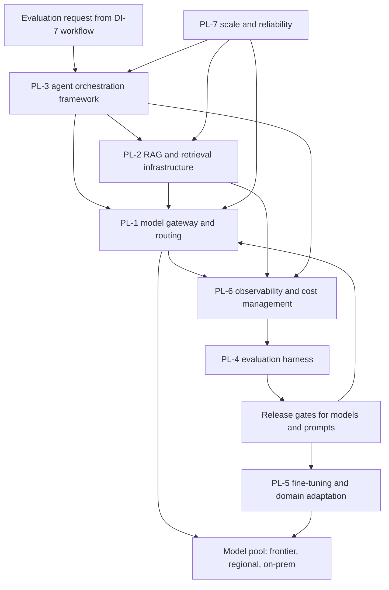
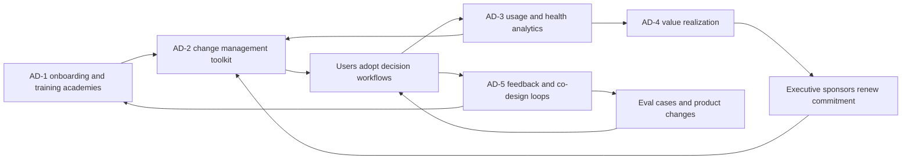
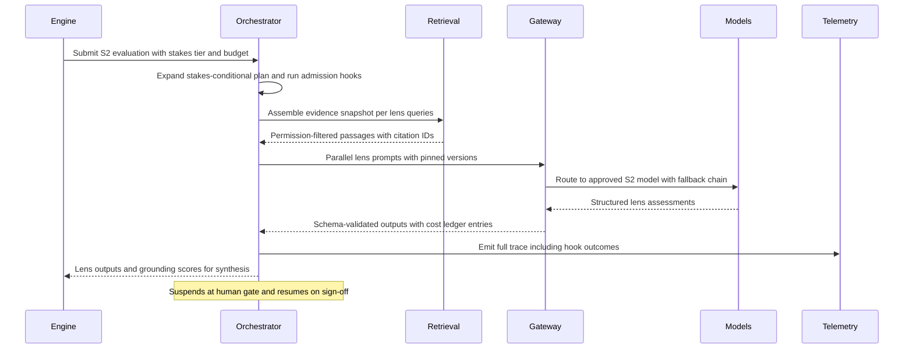
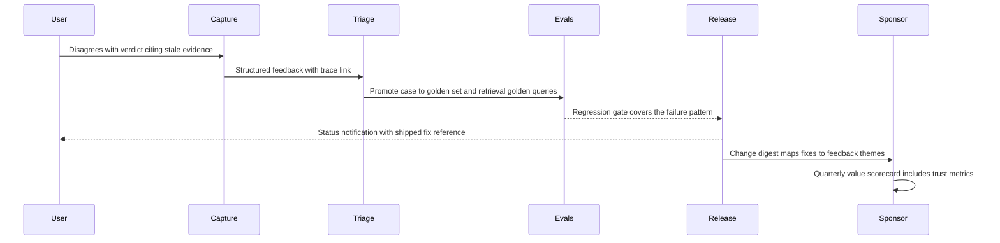

# Platform and adoption feature catalog

## 1. Front matter

| Field | Value |
|---|---|
| Doc ID | CAT-PL-AD |
| Pillars covered | PL, AD |
| Owning unit | U10 Catalog PL+AD |
| Version | 1.0 |

## 2. Pillar overview & scope boundary

**PL — Platform, AI Infrastructure & MLOps.** PL is the machinery beneath every TrueNorth recommendation: the model gateway that routes each request to the right model at the right cost for its stakes tier, the retrieval infrastructure that grounds every claim in citable evidence, the agent orchestration framework that runs multi-lens evaluations as durable workflows, the evaluation harness that gates every model, prompt, and pipeline change against golden decision sets, the fine-tuning facilities that adapt models to tenant vocabulary without leaking tenant data, and the observability, cost-management, and reliability layers that keep the whole system within budget and within SLO across SaaS, VPC, on-prem, and air-gapped deployments. PL's value proposition is simple: the judgment engine is only trustworthy if every output is reproducible, evaluated, traced, costed, and recoverable. PL turns "the model said so" into an engineered, audited, continuously improving production system.

**AD — Adoption, Value Realization & Analytics.** AD is the machinery that earns usage and proves worth. A decision-intelligence system fails silently: people simply route decisions around it. AD therefore covers role-based onboarding and a certification academy, a change-management toolkit built on champion networks and an explicit adoption maturity model, privacy-preserving usage and health analytics, a value-realization framework that attributes decision outcomes and cycle-time gains to TrueNorth, and feedback and co-design loops that convert user disagreement into evaluation cases and product improvements. AD's value proposition is that trust is built deliberately, measured honestly, and renewed every quarter with evidence — never assumed.

**NOT in this pillar (both pillars):**

- Source-system connectors, ingestion pipelines, and document parsing — DF-1, DF-2.
- Privacy filtering, PII redaction, and purpose tagging applied pre-persistence — DF-4.
- Residency policy definition and cross-border transfer rules — DF-6 (PL-7 implements the resulting topology).
- Ontology, graph construction, and the semantic retrieval layer's graph-aware query logic — KG-1, KG-2, KG-4 (PL-2 supplies the index, embedding, and ranking infrastructure that KG-4 composes).
- SME validation queues and contested-fact resolution — KG-5 (AD-5 routes knowledge feedback there).
- Lens logic, verdict synthesis, devil's-advocate generation, and engine self-calibration semantics — DI-3, DI-4, DI-5, DI-6 (PL-4 measures them; it does not define them).
- Outcome tracking of decisions — DI-8 (AD-4 consumes its outcome records).
- Decision-rights policy, HITL gate policy, immutable audit, explainability standards, and model risk governance — GV-1, GV-2, GV-3, GV-4, GV-7 (PL emits the traces and evaluation evidence these consume).
- Identity, authorization, encryption, AI-attack defense definitions, and tenant isolation requirements — SC-1, SC-2, SC-3, SC-4 (PL enforces them as supplied controls).
- Insider-risk and abuse monitoring — SC-5 (AD-3 telemetry is aggregate-only and is not a surveillance feed).
- All end-user surfaces: command centers, assistant, in-flow plugins, mobile, APIs — SX-1 through SX-6 (AD and PL features cite these surfaces; they do not own them).
- Simulation model content and forecasting libraries — SF-1 through SF-6 (PL-3 schedules their execution as tools).

## 3. L2 index & capability map

| L2 ID | Name | One-line scope |
|---|---|---|
| PL-1 | Model gateway & multi-LLM orchestration | Unified model access with stakes/cost routing across providers and deployments |
| PL-2 | RAG & retrieval infrastructure | Embedding, indexing, hybrid retrieval, grounding, and citation services |
| PL-3 | Agent orchestration framework | Durable multi-agent workflow execution with tools, state, and guardrail hooks |
| PL-4 | Evaluation harness | Golden decision sets, judge calibration, regression evals, release gates |
| PL-5 | Fine-tuning & domain adaptation | Tenant-safe adaptation of models, adapters, and embeddings |
| PL-6 | Observability & cost management | Tracing, token metering, budgets, SLO and drift monitoring |
| PL-7 | Scale & reliability | Multi-region topology, capacity, DR, degraded modes, release engineering |
| AD-1 | Onboarding & training academies | Role-based onboarding, academy curriculum, certification |
| AD-2 | Change management toolkit | Champions, maturity model, trust-building, barrier diagnostics |
| AD-3 | Usage & health analytics | Privacy-preserving adoption telemetry, health scores, benchmarks |
| AD-4 | Value realization | Decision ROI attribution, value scorecards, TCO tracking |
| AD-5 | Feedback & co-design loops | In-context feedback, triage to eval/product pipelines, co-design programs |

## 4. Feature trees (per L2 group)

### PL-1 Model gateway & multi-LLM orchestration

All model access flows through one gateway that normalizes providers, enforces stakes- and cost-aware routing, and manages prompts, fallbacks, and model lifecycle.

#### PL-1-1 Unified model gateway

- **User story:** As a TrueNorth platform engineer, I want every model call to pass through one gateway with a single contract, so that providers can be swapped, audited, and metered without touching pillar code.
- **Description:** A single internal API for completion, embedding, reranking, and structured-output calls. The gateway abstracts provider differences (hosted frontier APIs, regional providers, self-hosted open-weight models in VPC/on-prem/air-gapped deployments) behind one versioned contract, and is the sole egress point for model traffic, which makes SC-2 encryption and SC-3 output controls enforceable in one place.

##### PL-1-1-1 Provider adapter library

- **Behavior:** Versioned adapters translate the gateway contract to each provider or self-hosted runtime; adapters declare capabilities (context window, structured output, tool calling, modality) so callers never branch on provider.
- **Data touched:** Adapter registry, provider credentials (held per SC-2), capability manifests.
- **Model/AI involvement:** None — deterministic translation layer.
- **UX surface:** Admin console per SX-1; programmatic per SX-5.
- **Acceptance criteria:**
  - A new provider is added by registering an adapter, with zero changes to DI/KG/SF calling code.
  - Adapter capability mismatch (e.g., structured output unsupported) is rejected at request time with a typed error, never silently degraded.

##### PL-1-1-2 Request normalization and structured-output enforcement

- **Behavior:** Validates every request against a schema, enforces declared output schemas (JSON schema for lens assessments, citations, confidence fields), retries with repair prompts on schema violations, and rejects after a bounded repair budget.
- **Data touched:** Request/response payloads, schema registry, violation logs.
- **Model/AI involvement:** Generative — bounded schema-repair re-prompts.
- **UX surface:** SX-5 for schema registration; violations visible in PL-6 traces.
- **Acceptance criteria:**
  - ≥ 99.5% of structured calls return schema-valid output within the repair budget (≤ 2 repair attempts).
  - Schema violations are logged with the offending output for PL-4 triage.
- **L5 notes:** Repair attempts count against the request's token cost envelope; if the envelope would be exceeded, the call fails fast with a typed budget error rather than over-spending.

##### PL-1-1-3 Streaming and partial-result passthrough

- **Behavior:** Streams tokens and tool-call deltas to interactive surfaces while buffering complete outputs for validation and trace capture; supports cancellation that propagates to the provider.
- **Data touched:** Streaming buffers, cancellation tokens.
- **Model/AI involvement:** None beyond transport.
- **UX surface:** Consumed by SX-2 and SX-3 experiences.
- **Acceptance criteria:**
  - p95 first-token latency added by the gateway ≤ 150 ms over raw provider latency.
  - Cancelled streams stop provider billing within 2 s.

#### PL-1-2 Stakes- and cost-aware routing engine

- **User story:** As a platform administrator, I want each request routed by stakes tier, cost budget, latency need, and deployment constraint, so that S1 evaluations get maximum capability and S4 volume stays affordable.
- **Description:** A declarative routing policy maps request attributes (stakes tier S1–S4, pillar, lens, tenant, residency zone, deployment model) to model choices, cross-check requirements, and budget ceilings. Routing is the primary lever that keeps quality high where it matters and cost low everywhere else.

##### PL-1-2-1 Declarative routing policy

- **Behavior:** Tenant administrators define routing tables per stakes tier; S1/S2 routes mandate top-capability models and may require independent second-model cross-checks; S4 routes prefer cost-efficient models. Policies are versioned and changes require PL-4 gate evidence before activation.
- **Data touched:** Routing policy store, model registry (PL-1-3), tenant configuration.
- **Model/AI involvement:** None — rule evaluation.
- **UX surface:** SX-1 admin view; SX-5 API.
- **Acceptance criteria:**
  - Every routed request records the matched policy rule and version in its PL-6 trace.
  - A misconfigured policy (no eligible model) fails closed with a typed error, never falls through to an unapproved model.

##### PL-1-2-2 Budget guard and cost-ceiling enforcement

- **Behavior:** Each request carries a token cost envelope derived from stakes tier and tenant budget; the guard pre-estimates cost, blocks or downgrades requests that would breach ceilings per policy, and emits budget events to PL-6.
- **Data touched:** Budget ledgers, cost estimates, policy thresholds.
- **Model/AI involvement:** None.
- **UX surface:** Budget alerts surfaced via SX-3 and SX-1.
- **Acceptance criteria:**
  - No single S4 evaluation exceeds its cap without an explicit policy override recorded with requester identity.
  - Budget exhaustion produces a user-visible "deferred for budget" state, never a silent failure.
- **L5 notes:** Default cost envelopes (assumption, tenant-tunable): S4 ≤ $0.25 median / $1.00 cap per full evaluation; S3 ≤ $2 / $8; S2 ≤ $20 / $60; S1 ≤ $150 / $500. Recorded as an assumption in section 7.

##### PL-1-2-3 Deployment-constraint routing

- **Behavior:** Routes honor deployment model: air-gapped tenants resolve only to local model pools; residency-pinned tenants resolve only to in-region endpoints per DF-6 policy; SaaS tenants may opt out of any external provider.
- **Data touched:** Deployment manifests, residency tags, model endpoint registry.
- **Model/AI involvement:** None.
- **UX surface:** SX-1 admin attestation view.
- **Acceptance criteria:**
  - An air-gapped deployment can complete all S1–S4 flows with zero external network egress, verified by a conformance test.
  - Residency-violating routes are impossible by construction (no eligible endpoint), not merely flagged.

#### PL-1-3 Model registry & lifecycle management

- **User story:** As an AI platform lead, I want every model and version cataloged with capabilities, eval results, and approval status, so that only gated models serve production traffic.
- **Description:** A registry of all models (external, regional, self-hosted, fine-tuned adapters from PL-5) with model cards, PL-4 evaluation scorecards, approval state, pinning, and deprecation schedules; it is the system of record GV-7 audits.

##### PL-1-3-1 Model cards and approval workflow

- **Behavior:** Each model version carries a card (provider, training-data statement, capability profile, eval scores, known failure modes); promotion to production requires passing PL-4 gates and a recorded approval; GV-7 consumes the card trail.
- **Data touched:** Model card store, approval records, eval scorecards.
- **Model/AI involvement:** None.
- **UX surface:** SX-1 registry views.
- **Acceptance criteria:**
  - Production traffic to an unapproved model version is blocked at the gateway.
  - Every approval links to the exact eval run IDs that justified it.

##### PL-1-3-2 Version pinning and deprecation

- **Behavior:** Tenants pin model versions per stakes tier; provider-side silent upgrades are detected via fingerprint probes and trigger re-evaluation; deprecations follow a notice window with automated migration evals.
- **Data touched:** Pinning configuration, fingerprint probe results, deprecation calendar.
- **Model/AI involvement:** Extractive — fingerprint probes compare model behavior signatures.
- **UX surface:** SX-1; deprecation notices via SX-3.
- **Acceptance criteria:**
  - A detected upstream model change on a pinned route raises an incident within 24 h and freezes S1/S2 routing to that model pending re-evaluation.
  - No pinned version is removed before its tenant-visible deprecation window ends (default 90 days, assumption).

#### PL-1-4 Failover & degradation orchestration

- **User story:** As an SRE, I want automatic failover chains and honest degraded modes, so that provider outages reduce capability transparently instead of breaking decision workflows.
- **Description:** Ordered fallback chains per route, circuit breakers per provider/endpoint, and a degraded-mode protocol that downgrades capability only within policy and always discloses the downgrade on the output.

##### PL-1-4-1 Fallback chains and circuit breakers

- **Behavior:** Each route declares an ordered fallback list (same-capability first, then policy-permitted downgrades); circuit breakers trip on error-rate/latency thresholds and recover via half-open probes.
- **Data touched:** Route configurations, breaker state, provider health metrics.
- **Model/AI involvement:** None.
- **UX surface:** SX-1 health dashboard.
- **Acceptance criteria:**
  - Single-provider outage causes zero failed S1–S3 evaluations when an eligible fallback exists.
  - Breaker trips and recoveries are visible in PL-6 within 30 s.

##### PL-1-4-2 Degraded-mode disclosure

- **Behavior:** When a request is served by a downgraded model or with reduced cross-checks, the output is tagged "degraded" with reason; DI-4 must carry the tag into the recommendation, and S1/S2 degraded outputs require explicit acknowledgment under GV-2 gates.
- **Data touched:** Degradation tags on responses, disclosure records.
- **Model/AI involvement:** None.
- **UX surface:** Tag rendered by SX-1/SX-2 surfaces.
- **Acceptance criteria:**
  - 100% of downgraded responses carry the tag end-to-end into the trace and the recommendation artifact.
  - Policy can prohibit degradation entirely for S1 (fail and queue rather than downgrade).

#### PL-1-5 Prompt registry & context optimization

- **User story:** As a prompt engineer, I want prompts versioned, canaried, and context-budgeted like code, so that prompt changes are evaluated and reversible.
- **Description:** A registry of all production prompts and templates with variable contracts, environment promotion, and canary rollout; plus a context budget manager and caching layer that control token consumption per request class.

##### PL-1-5-1 Versioned prompt registry with canary rollout

- **Behavior:** Prompts are stored with typed variable contracts, owners, and changelogs; changes deploy to a canary fraction of eligible traffic, are auto-compared against baseline via PL-4 online metrics, and promote or roll back per gate result.
- **Data touched:** Prompt store, canary assignments, comparison metrics.
- **Model/AI involvement:** None directly; canary comparison uses PL-4 judges.
- **UX surface:** SX-1 admin; SX-5 API.
- **Acceptance criteria:**
  - No production prompt change without a registry version and an attached eval result.
  - Rollback to the prior version completes within 5 minutes, traffic-wide.

##### PL-1-5-2 Context budget manager and caching

- **Behavior:** Allocates per-request context budgets across system prompt, retrieved evidence, conversation history, and scratchpad; applies prefix and semantic caching for repeated context blocks (ontology fragments, policy preambles); evicts caches on source-data change events.
- **Data touched:** Context assembly plans, cache entries keyed by content hash and permission scope.
- **Model/AI involvement:** Extractive — salience scoring to trim evidence within budget.
- **UX surface:** None (internal); savings reported in PL-6.
- **Acceptance criteria:**
  - Cache hits never serve content the requesting principal could not retrieve directly (permission-scoped cache keys).
  - Measured token savings from caching reported per tenant per week.
- **L5 notes:** Stale-cache failure mode: caches keyed on lineage versions from DF-5; eviction on upstream change must complete ≤ 60 s after the change event or the cache entry self-expires.

### PL-2 RAG & retrieval infrastructure

PL-2 supplies the embedding, indexing, hybrid retrieval, permission filtering, and grounding services on which KG-4's semantic retrieval layer and all evidence assembly (DI-2) are built.

#### PL-2-1 Embedding & indexing pipeline

- **User story:** As a data platform engineer, I want every eligible document, transcript, and graph fragment chunked, embedded, and indexed incrementally, so that retrieval reflects the organization within minutes of change.
- **Description:** A managed pipeline from DF-2 outputs and KG-2 graph events to searchable indexes: configurable chunking, embedding model lifecycle, incremental re-indexing, and deletion propagation. Residency-aware index placement keeps embeddings in-region per DF-6.

##### PL-2-1-1 Chunking and enrichment strategies

- **Behavior:** Content-type-aware chunkers (contracts, meeting transcripts, spreadsheets, wiki pages) with overlap tuning; each chunk is enriched with source metadata, lineage pointers (DF-5), permission labels (SC-1/SC-2 classifications), and purpose tags (DF-4).
- **Data touched:** Source documents post-DF-4 filtering, chunk store, metadata.
- **Model/AI involvement:** Extractive — structure detection for chunk boundaries.
- **UX surface:** SX-1 pipeline admin.
- **Acceptance criteria:**
  - Every chunk carries lineage, permission, and purpose metadata; chunks missing any are quarantined, not indexed.
  - Chunker changes re-index affected corpora without full rebuilds.

##### PL-2-1-2 Embedding model lifecycle and re-embedding

- **Behavior:** Embedding models are registered in PL-1-3 and routed via PL-1; upgrades run dual-index (old/new) with PL-4 retrieval evals before cutover; backfills are rate-limited against budget.
- **Data touched:** Vector indexes, embedding version tags, eval results.
- **Model/AI involvement:** Embedding models.
- **UX surface:** SX-1 admin.
- **Acceptance criteria:**
  - Cutover requires retrieval eval parity or better on golden query sets (PL-4-1).
  - Mixed-version retrieval is impossible after cutover (atomic alias switch).

##### PL-2-1-3 Freshness and deletion propagation

- **Behavior:** Change-data events update indexes incrementally; deletions (right-to-erasure, retention expiry per MI-6/GV-5 policies) propagate to chunks, vectors, and caches with verifiable completion receipts.
- **Data touched:** Index entries, deletion ledger, cache invalidation events.
- **Model/AI involvement:** None.
- **UX surface:** Deletion receipts in SX-1 compliance view.
- **Acceptance criteria:**
  - p95 source-change-to-searchable latency ≤ 5 minutes for streaming sources, ≤ 1 h for batch.
  - Deletion propagation completes ≤ 24 h with a signed receipt; verification queries return zero hits.

#### PL-2-2 Hybrid retrieval service

- **User story:** As the decision engine, I want one retrieval API that fuses vector, lexical, and graph signals with reranking, so that evidence assembly gets the best passages, not just the nearest vectors.
- **Description:** A query-time service exposing hybrid search: dense + sparse retrieval fused with graph-neighborhood expansion supplied by KG-4, followed by cross-encoder reranking and diversity selection. Query planning decomposes complex evidence requests into sub-queries.

##### PL-2-2-1 Fusion ranking and reranking

- **Behavior:** Configurable fusion (reciprocal-rank or learned weights) across retrievers; cross-encoder rerank of top-k; diversity constraint to avoid near-duplicate evidence dominating a lens.
- **Data touched:** Indexes, rerank model scores, retrieval logs.
- **Model/AI involvement:** Embedding + reranker models via PL-1.
- **UX surface:** SX-5 API for workbench builders (WB-0 consumers).
- **Acceptance criteria:**
  - Recall@20 on golden query sets ≥ 0.9 (target, measured by PL-4); reranking adds ≤ 300 ms p95 at k=50.
  - Per-query retrieval trace records every retriever's contribution for replay.

##### PL-2-2-2 Query planning and decomposition

- **Behavior:** For composite evidence requests ("precedent decisions plus current metric state plus contract constraints"), a planner decomposes into typed sub-queries, executes in parallel, and merges results with provenance preserved per sub-query.
- **Data touched:** Query plans, sub-query results.
- **Model/AI involvement:** Generative — planner LLM produces typed plans validated against a schema.
- **UX surface:** Internal; plan visible in PL-6 traces.
- **Acceptance criteria:**
  - Invalid plans are rejected and retried within the request budget; fallback is single-query hybrid search.
  - Sub-query provenance survives merging into final evidence lists.

#### PL-2-3 Permission- and classification-aware retrieval enforcement

- **User story:** As a CISO's delegate, I want retrieval to enforce the caller's effective permissions and data classifications at query time, so that the AI never becomes a permission-bypass channel.
- **Description:** Mandatory enforcement layer applying SC-1 entitlements and SC-2 classification rules to every retrieval, including agent-initiated retrievals which execute under the requesting human's effective permissions, never a privileged service identity.

##### PL-2-3-1 Query-time ACL filtering

- **Behavior:** Permission labels indexed with each chunk are filtered against the caller's entitlements before ranking; post-filter top-up maintains result quality without leaking counts of hidden documents.
- **Data touched:** Permission labels, entitlement snapshots, filtered result sets.
- **Model/AI involvement:** None.
- **UX surface:** None (mandatory infrastructure).
- **Acceptance criteria:**
  - Zero retrieval results outside caller entitlements in continuous SC-3-aligned probe tests.
  - Entitlement changes take effect in retrieval ≤ 5 minutes.
- **L5 notes:** Failure mode: if the entitlement service is unreachable, retrieval fails closed (empty results with typed error), never open.

##### PL-2-3-2 Residency- and classification-scoped routing

- **Behavior:** Queries route only to indexes whose residency zone and classification ceiling match the request context per DF-6 policy; cross-region evidence requests return references with a residency notice rather than copying content.
- **Data touched:** Index placement registry, residency tags.
- **Model/AI involvement:** None.
- **UX surface:** Residency notices rendered by SX surfaces.
- **Acceptance criteria:**
  - No vector or chunk content crosses a residency boundary in retrieval; verified by network-level conformance tests.

#### PL-2-4 Grounding & citation service

- **User story:** As a decision reviewer, I want every claim in a recommendation traceable to a source span, so that I can verify evidence in one click.
- **Description:** Services that bind generated text to evidence: span-level attribution, groundedness scoring of drafted outputs, and freshness checks that flag stale evidence. DI-2 and GV-4 consume these primitives.

##### PL-2-4-1 Span-level citation binding

- **Behavior:** During generation, claims are bound to retrieved spans with stable citation IDs resolving through DF-5 lineage to the source field/document version; unbound claims are flagged for the synthesis layer to revise or label as inference.
- **Data touched:** Citation records, span offsets, lineage references.
- **Model/AI involvement:** Judge — an attribution model verifies claim-span support.
- **UX surface:** Citations rendered by SX-1/SX-2.
- **Acceptance criteria:**
  - ≥ 98% of citations resolve to a live, version-correct source span (broken-citation rate ≤ 2%, alerting at 1%).
  - Unsupported claims are machine-labeled before synthesis completes.

##### PL-2-4-2 Groundedness scoring and freshness checks

- **Behavior:** A groundedness judge scores each output section against its evidence; evidence older than per-type freshness thresholds (e.g., metrics ≥ 7 days, market signals ≥ 24 h — tenant-tunable) is flagged "stale" on the citation.
- **Data touched:** Groundedness scores, evidence timestamps, freshness policies.
- **Model/AI involvement:** Judge model.
- **UX surface:** Staleness badges via SX-1.
- **Acceptance criteria:**
  - Outputs below the groundedness threshold are returned to orchestration for revision, not delivered.
  - Freshness flags appear on 100% of stale citations in sampled audits.

#### PL-2-5 Retrieval quality monitoring

- **User story:** As an ML engineer, I want continuous retrieval quality measurement with drift alerts, so that silent retrieval degradation cannot quietly corrupt verdicts.
- **Description:** Golden query sets per tenant and per department, scheduled retrieval evals, embedding-space drift monitors, and alerting wired into PL-6 incidents.

##### PL-2-5-1 Golden query sets and scheduled evals

- **Behavior:** Curated query→expected-evidence pairs (seeded at onboarding, grown from AD-5 feedback) run nightly; recall/precision/nDCG trends feed PL-4 scorecards.
- **Data touched:** Golden query store, eval runs, trend metrics.
- **Model/AI involvement:** None beyond the retrieval under test.
- **UX surface:** SX-1 quality dashboard.
- **Acceptance criteria:**
  - Nightly runs complete for all tenants; ≥ 5% recall regression opens a PL-6 incident automatically.

##### PL-2-5-2 Drift and corpus anomaly detection

- **Behavior:** Monitors embedding distribution shift, index growth anomalies, and sudden permission-label changes that may indicate DF-3 quality issues or retrieval poisoning attempts (escalated to SC-3).
- **Data touched:** Index statistics, drift metrics, anomaly events.
- **Model/AI involvement:** Statistical detection; no generation.
- **UX surface:** Alerts via SX-3.
- **Acceptance criteria:**
  - Synthetic poisoning injections in staging are detected ≥ 95% of the time within 24 h.

### PL-3 Agent orchestration framework

PL-3 executes multi-step, multi-agent evaluation workflows — lens fan-out, evidence assembly, simulation calls, synthesis — as typed, durable, guarded executions.

#### PL-3-1 Agent registry & typed definitions

- **User story:** As a platform engineer, I want every agent declared with its model route, tools, input/output schemas, and permission scope, so that orchestrations are composable and auditable.
- **Description:** Agents (lens judges for DI-3, extraction agents for MI-2, simulation drivers for SF, workbench agents from WB-0 packs) are registered with typed manifests; the registry is the deployment unit PL-4 evaluates and GV-7 reviews.

##### PL-3-1-1 Agent manifest and capability scoping

- **Behavior:** Manifests declare model route class, allowed tools, max iterations, token budget share, output schema, and the stakes tiers the agent may serve; orchestrator refuses any unmanifested capability at runtime.
- **Data touched:** Agent manifests, scope grants.
- **Model/AI involvement:** None.
- **UX surface:** SX-1 registry; SX-5 for WB-0 builders.
- **Acceptance criteria:**
  - Runtime tool calls outside the manifest are blocked and logged 100% of the time.
  - Manifest changes require re-passing the agent's PL-4 eval suite.

##### PL-3-1-2 Agent versioning and dependency pinning

- **Behavior:** Agents pin prompt versions (PL-1-5), model routes, and tool versions; an orchestration records the full pinned set, enabling GV-3 replay with identical components.
- **Data touched:** Version pins, orchestration manifests.
- **Model/AI involvement:** None.
- **UX surface:** SX-1.
- **Acceptance criteria:**
  - Any historical orchestration can be re-instantiated with its exact pinned component set (subject to model availability, with documented substitution rules).

#### PL-3-2 Orchestration & execution engine

- **User story:** As the decision engine, I want evaluations to run as durable graphs with parallel lens fan-out, checkpoints, and human-gate suspension, so that long evaluations survive failures and pauses measured in days.
- **Description:** A graph executor running typed DAGs: parallel branches per lens, joins for synthesis, conditional branches by stakes tier, checkpointed state, and first-class suspension while awaiting GV-2 human gates or SF simulation completion.

##### PL-3-2-1 Typed DAG execution with parallel fan-out

- **Behavior:** Workflows declared as typed graphs; the engine schedules independent branches concurrently, enforces per-branch budgets, and propagates typed results to joins; partial-failure policy per node (retry, substitute, or degrade with disclosure via PL-1-4-2).
- **Data touched:** Workflow definitions, execution state, branch results.
- **Model/AI involvement:** Orchestrates generative/judge agents; engine itself deterministic.
- **UX surface:** Execution visible through SX-1 run views.
- **Acceptance criteria:**
  - A 7-lens S2 evaluation executes lenses in parallel with end-to-end orchestration overhead ≤ 10% of total latency.
  - Node failures follow declared policy; no undeclared partial results reach synthesis.

##### PL-3-2-2 Durable checkpointing and human-gate suspension

- **Behavior:** Execution state checkpoints at every node boundary; workflows suspend at GV-2 gates or long simulations and resume on signal — across process restarts, deploys, and region failover (PL-7).
- **Data touched:** Checkpoint store, suspension/resume events.
- **Model/AI involvement:** None.
- **UX surface:** Pending-gate status via SX-1/SX-3.
- **Acceptance criteria:**
  - Workflows suspended ≥ 30 days resume correctly with refreshed evidence staleness checks (PL-2-4-2) before synthesis.
  - Zero lost executions across a forced failover drill.
- **L5 notes:** On resume after ≥ 72 h suspension, evidence is re-validated; materially changed evidence re-triggers affected lenses rather than reusing stale assessments.

##### PL-3-2-3 Stakes-conditional execution plans

- **Behavior:** One workflow definition expands differently by stakes tier: S4 runs a minimal lens set single-pass; S1 adds cross-model verification, DI-5 red-team branch, SF-4 twin propagation, and mandatory minority-report depth — all declaratively configured.
- **Data touched:** Tier expansion rules, plan instances.
- **Model/AI involvement:** None (plan expansion is rule-based).
- **UX surface:** Plan preview in SX-1.
- **Acceptance criteria:**
  - Tier misclassification override (per DI-1 rules) re-expands the plan and re-runs only the delta nodes.

#### PL-3-3 Tool invocation & sandboxing

- **User story:** As a security engineer, I want every agent tool call validated, least-privileged, and sandboxed, so that agents cannot take un-mandated actions or exfiltrate data.
- **Description:** A mediated tool layer: typed tool contracts, parameter validation, per-stakes allowlists, sandboxed execution for computation, and read-only defaults — write actions exist only where a pillar explicitly defines them and always under GV-2 gating.

##### PL-3-3-1 Typed tool contracts and parameter validation

- **Behavior:** Tools (retrieval, graph queries, SF simulation launches, calculator/code execution, SX-5 API calls) declare schemas, side-effect class (read/compute/write), and cost class; calls validated pre-execution; write-class tools additionally require workflow-level authorization tokens.
- **Data touched:** Tool registry, call logs, validation errors.
- **Model/AI involvement:** None.
- **UX surface:** SX-5 for tool publishers.
- **Acceptance criteria:**
  - 100% of tool calls schema-validated; malformed calls never reach the tool.
  - Write-class calls without a valid authorization token are blocked and raised to SC-5-relevant logs.

##### PL-3-3-2 Sandboxed computation and egress control

- **Behavior:** Code/calculation tools run in network-isolated sandboxes with resource caps; sandbox egress only via the mediated tool layer; outputs scanned per SC-3 exfiltration rules before re-entering context.
- **Data touched:** Sandbox images, execution artifacts.
- **Model/AI involvement:** Generated code executes inside sandbox only.
- **UX surface:** None.
- **Acceptance criteria:**
  - Sandbox escape attempts in red-team tests fail; no direct network egress observed from sandboxes in conformance scans.

#### PL-3-4 Shared state & evidence memory

- **User story:** As a lens agent, I want a shared, permission-scoped evidence board for the current evaluation, so that lenses reason over a consistent evidence snapshot without re-retrieving or diverging.
- **Description:** Per-evaluation working memory: an immutable evidence snapshot assembled once (via DI-2 logic on PL-2 services), agent scratchpads, and cross-agent annotations — all scoped to the evaluation and the requesting principal's permissions, and all captured in the trace.

##### PL-3-4-1 Evaluation-scoped evidence snapshot

- **Behavior:** Evidence is frozen at assembly time with version stamps; all lenses read the same snapshot; late-arriving evidence triggers an explicit snapshot revision event rather than silent mutation.
- **Data touched:** Snapshot store, version stamps, revision events.
- **Model/AI involvement:** None.
- **UX surface:** Snapshot contents inspectable via SX-1 for reviewers.
- **Acceptance criteria:**
  - Two lenses citing the same source always cite the identical version within one evaluation.
  - Snapshot revisions re-trigger dependent lenses per PL-3-2 policy.

##### PL-3-4-2 Scratchpads and cross-agent annotations

- **Behavior:** Agents persist intermediate reasoning to private scratchpads; designated annotations (e.g., a risk lens flagging an assumption for the financial lens) are shared via typed channels; everything lands in the PL-6 trace for GV-3/GV-4 use.
- **Data touched:** Scratchpad store, annotation channel records.
- **Model/AI involvement:** Generative content stored; channel itself deterministic.
- **UX surface:** None directly (exposed through GV-4 explanations).
- **Acceptance criteria:**
  - Scratchpads are excluded from final outputs unless explicitly promoted; promotion is logged.

#### PL-3-5 Guardrail & policy enforcement hooks

- **User story:** As a governance officer, I want policy checks executed at defined points in every workflow, so that GV-1 policy and SC-3 defenses are enforced in the execution path, not advisory.
- **Description:** Pre/post hooks at workflow, node, and tool boundaries that invoke GV-1 policy evaluation, SC-3 input/output scanning, and red-line checks; hook outcomes (pass/block/modify-with-log) are mandatory execution semantics.

##### PL-3-5-1 Hook framework with mandatory outcomes

- **Behavior:** Hook points: workflow admission, pre-node, pre-tool, post-node, pre-delivery. Each hook returns pass/block/escalate; blocks halt the path with a typed reason; escalations suspend for GV-2 review. Hooks are non-bypassable — no execution path skips registered hooks.
- **Data touched:** Hook registry, outcome logs.
- **Model/AI involvement:** Hooks may invoke judge models (e.g., SC-3 classifiers).
- **UX surface:** Block/escalation reasons surfaced via SX-1/SX-3.
- **Acceptance criteria:**
  - Conformance tests prove zero hook-bypass paths per release.
  - Hook latency budget: p95 ≤ 200 ms per hook for deterministic checks; judge-based hooks ≤ 1.5 s.

##### PL-3-5-2 Red-line enforcement at execution time

- **Behavior:** Canonical red lines (no covert monitoring, no individual surveillance scoring, no autonomous people decisions) are encoded as non-overridable admission rules: workflows whose declared purpose or requested data match red-line patterns are refused with a recorded refusal.
- **Data touched:** Red-line rule set (read-only from GV-6), refusal records.
- **Model/AI involvement:** Classifier assists pattern matching; refusal is rule-based.
- **UX surface:** Refusal messaging via requesting surface.
- **Acceptance criteria:**
  - Red-line refusals cannot be overridden by any tenant role; attempts are logged for GV-6 review.

#### PL-3-6 Long-running task & schedule management

- **User story:** As a platform operator, I want recurring and long-horizon agent tasks (nightly portfolio re-scoring, weekly drift reviews, watchdog monitors for DI-8 outcome checkpoints) scheduled, deduplicated, and budget-capped, so that background intelligence is reliable and affordable.
- **Description:** A scheduler for recurring orchestrations and event-triggered tasks with dedupe keys, backfill policies, priority lanes versus interactive traffic, and per-schedule budget caps.

##### PL-3-6-1 Scheduled and event-triggered orchestrations

- **Behavior:** Cron-like schedules and event subscriptions (e.g., KG change events, GA-3 status changes) launch workflows with dedupe windows; missed windows follow declared catch-up policy.
- **Data touched:** Schedules, trigger events, run history.
- **Model/AI involvement:** None (scheduling).
- **UX surface:** SX-1 schedule admin.
- **Acceptance criteria:**
  - Duplicate triggers within the dedupe window launch exactly one run.
  - Background lanes never starve interactive S1–S4 evaluations (priority preemption verified under load test).

##### PL-3-6-2 Background budget caps and yield

- **Behavior:** Each schedule carries a token/compute budget; exhaustion pauses the schedule with an alert rather than degrading interactive capacity; background tasks yield to interactive surges per PL-7-2 signals.
- **Data touched:** Budget ledgers, yield events.
- **Model/AI involvement:** None.
- **UX surface:** Alerts via SX-3.
- **Acceptance criteria:**
  - Interactive p95 latency SLOs hold during maximum background load in load tests.

### PL-4 Evaluation harness

PL-4 is the quality gate for everything generative: golden decision sets, regression pipelines, judge calibration, online/shadow testing, and human evaluation — producing the evidence GV-7 and PL-1-3 approvals require.

#### PL-4-1 Golden decision set management

- **User story:** As an evaluation lead, I want curated, versioned benchmark sets of decisions with known-good evaluations and outcomes, so that every change is tested against representative judgment cases.
- **Description:** Three golden tiers: a TrueNorth-core set (industry-generic, synthetic plus anonymized), tenant-specific sets (seeded at onboarding from historical decisions, grown from DI-8 outcomes and AD-5 feedback), and adversarial sets (bias traps, groupthink scenarios, evidence-conflict cases co-designed with GV-6/U25 concerns).

##### PL-4-1-1 Set curation, versioning, and provenance

- **Behavior:** Cases carry full provenance (origin, consent basis per DF-4, anonymization state), expected verdict ranges, expected evidence, and rationale rubrics; sets are versioned; case additions require curator review.
- **Data touched:** Golden case store, provenance records, rubrics.
- **Model/AI involvement:** Generative assist for synthetic case drafting; human-curated.
- **UX surface:** SX-1 curation workspace.
- **Acceptance criteria:**
  - Every case has provenance and a consent basis; tenant cases never enter the core set without explicit opt-in (see section 7).
  - Set versions are immutable once referenced by a release gate.

##### PL-4-1-2 Coverage analysis and gap detection

- **Behavior:** Maps golden coverage across stakes tiers, departments, lens types, and failure modes; flags coverage gaps (e.g., no S1 supply-chain cases) and proposes synthetic candidates for curator review.
- **Data touched:** Coverage matrices, gap reports.
- **Model/AI involvement:** Extractive clustering plus generative candidate drafting.
- **UX surface:** SX-1 coverage dashboard.
- **Acceptance criteria:**
  - Release gates report coverage alongside scores; gates can require minimum coverage per tier.

#### PL-4-2 Regression evaluation pipeline & release gates

- **User story:** As a release manager, I want every model, prompt, retrieval, or agent change to run the regression suite and pass tier-appropriate gates before production, so that quality never regresses silently.
- **Description:** CI-integrated eval runs on every release candidate: verdict agreement, evidence quality, groundedness, calibration, latency, and cost versus baseline; declarative gate policies decide promote/block per stakes tier.

##### PL-4-2-1 Automated regression runs on change

- **Behavior:** Any change to gated components triggers the relevant suites; results are diffed against the active baseline with statistical significance tests; flaky-case detection quarantines unstable cases for curator review.
- **Data touched:** Eval run records, diffs, flake registry.
- **Model/AI involvement:** Judge models score outputs against rubrics.
- **UX surface:** SX-1 eval results; SX-5 CI integration.
- **Acceptance criteria:**
  - No gated component reaches production without a passing run recorded against the exact artifact hash.
  - Full S1/S2-relevant suite completes ≤ 4 h (assumption; parallelized).

##### PL-4-2-2 Declarative gate policies by stakes tier

- **Behavior:** Gates express thresholds per tier, e.g.: golden verdict agreement ≥ 95% overall; zero un-reviewed verdict flips toward more permissive verdicts on S1/S2 cases; citation validity ≥ 98%; calibration error within bounds (PL-4-3); cost delta ≤ +10% without explicit approval. Failing gates block promotion and notify owners.
- **Data touched:** Gate policies, gate outcomes.
- **Model/AI involvement:** None (policy evaluation).
- **UX surface:** SX-1 gate dashboard.
- **Acceptance criteria:**
  - Gate overrides require named approver and reason, and are reported to GV-7.
- **L5 notes:** "Permissive flip" is defined on the canonical verdict scale ordering Oppose → Caution → Endorse-with-conditions → Endorse; any flip in that direction on S1/S2 golden cases is gate-blocking by default.

#### PL-4-3 Judge & lens calibration suite

- **User story:** As a decision scientist, I want measured agreement between lens judges, human expert panels, and realized outcomes, so that confidence values mean what they say.
- **Description:** Calibration measurement for every judge/lens: agreement with expert panels (via PL-4-5), calibration curves of stated confidence versus realized outcomes (from DI-8), inter-lens consistency checks, and per-segment breakdowns (department, stakes tier, decision type). DI-6 owns calibration semantics; PL-4-3 supplies the measurement machinery.

##### PL-4-3-1 Confidence calibration measurement

- **Behavior:** Computes calibration curves and expected calibration error (ECE) per judge, per tier, per tenant, on rolling windows of outcome-resolved cases; drift beyond threshold opens incidents and can force a route downgrade pending recalibration.
- **Data touched:** Confidence records, outcome labels from DI-8, calibration metrics.
- **Model/AI involvement:** None (measurement).
- **UX surface:** SX-1 calibration dashboards (also consumed by GV-4 displays).
- **Acceptance criteria:**
  - Target ECE ≤ 0.05 on tiers S2–S4 with ≥ 200 resolved cases (assumption-marked); breaches alert within one daily cycle.

##### PL-4-3-2 Expert agreement and inter-lens consistency

- **Behavior:** Samples production evaluations for blinded expert re-review; computes judge–human agreement (Cohen's kappa target ≥ 0.7, assumption) and flags lens pairs with systematic contradiction patterns for DI-3 owners.
- **Data touched:** Expert review records, agreement statistics.
- **Model/AI involvement:** None.
- **UX surface:** SX-1.
- **Acceptance criteria:**
  - Quarterly agreement reports per lens delivered to GV-7 evidence packs.

#### PL-4-4 Online evaluation & shadow testing

- **User story:** As an ML engineer, I want candidate components evaluated on live traffic without affecting delivered recommendations, so that offline gates are confirmed by real-world behavior before cutover.
- **Description:** Shadow execution of candidate models/prompts/agents alongside production on sampled traffic, verdict/evidence diffing, and controlled interleaving experiments where surface-level (never verdict-level) variants are permitted.

##### PL-4-4-1 Shadow execution and diffing

- **Behavior:** Candidates run on mirrored requests under identical evidence snapshots; outputs are diffed (verdict, conditions, citations, cost, latency) and aggregated into promotion evidence; shadow outputs are never delivered to users.
- **Data touched:** Shadow run records, diff reports.
- **Model/AI involvement:** Candidate and judge models.
- **UX surface:** SX-1 experiment console.
- **Acceptance criteria:**
  - Shadow traffic adds zero user-visible latency (asynchronous execution) and respects tenant budget lanes.
  - Promotion requires shadow agreement metrics consistent with offline gate results.

##### PL-4-4-2 Guarded interleaving experiments

- **Behavior:** For non-verdict surfaces (summary phrasing, evidence ordering), randomized interleaving measures user preference; verdict-bearing logic is excluded from A/B exposure by policy — verdicts change only via gated releases.
- **Data touched:** Experiment assignments, preference metrics.
- **Model/AI involvement:** Variants generated by gated components.
- **UX surface:** Experiments run within SX-1/SX-2 surfaces.
- **Acceptance criteria:**
  - Policy check proves no experiment varies verdict, confidence, or conditions across arms.

#### PL-4-5 Human evaluation workflow tooling

- **User story:** As an evaluation program manager, I want rater queues, rubrics, and adjudication workflows, so that human judgment scales reliably as ground truth for the harness.
- **Description:** Tooling for expert raters (internal SMEs, tenant-designated reviewers per KG-5 rosters): task queues with blinding, rubric-driven scoring forms, inter-rater reliability tracking, and adjudication of disagreements.

##### PL-4-5-1 Rater queues, blinding, and rubric forms

- **Behavior:** Sampled cases are assigned to ≥ 2 raters with source/model identity blinded; rubric forms capture structured scores plus free-text rationale; rater workload and fatigue limits enforced.
- **Data touched:** Rating tasks, scores, rater rosters.
- **Model/AI involvement:** None (judges under test excluded from scoring their own outputs).
- **UX surface:** SX-1 rater workspace.
- **Acceptance criteria:**
  - Inter-rater reliability (Krippendorff's alpha) tracked per rubric; rubrics below 0.6 are revised (assumption threshold).

##### PL-4-5-2 Disagreement adjudication

- **Behavior:** Rater disagreements beyond threshold route to senior adjudicators; adjudicated labels become gold; systematic disagreement patterns feed rubric revision and PL-4-1 case annotation.
- **Data touched:** Adjudication records, gold labels.
- **Model/AI involvement:** None.
- **UX surface:** SX-1.
- **Acceptance criteria:**
  - 100% of gate-feeding labels are either agreed or adjudicated; no single-rater gold for S1/S2 cases.

### PL-5 Fine-tuning & domain adaptation

PL-5 adapts models to industry and tenant context — vocabulary, document styles, lens rubrics — under strict data governance, tenant isolation, and PL-4 gating.

#### PL-5-1 Training data curation & governance

- **User story:** As an ML engineer, I want adaptation datasets assembled only from consented, purpose-tagged, scrubbed data with full versioning, so that fine-tuning never becomes a privacy or leakage liability.
- **Description:** Dataset assembly pipelines that admit only data carrying DF-4 purpose tags permitting model improvement, apply additional PII scrubbing and deduplication, record dataset lineage to source (DF-5), and version every dataset immutably.

##### PL-5-1-1 Consent- and purpose-gated dataset assembly

- **Behavior:** Candidate examples are filtered by purpose tags and tenant adaptation consent; excluded categories (e.g., MI-6 off-the-record content, GV-6 red-line domains) are blocked at assembly; every dataset has a signed manifest of inclusion rules.
- **Data touched:** Candidate corpora, purpose tags, dataset manifests.
- **Model/AI involvement:** Extractive — quality and dedup filters.
- **UX surface:** SX-1 dataset console.
- **Acceptance criteria:**
  - Audit sampling finds zero examples lacking a valid purpose basis.
  - Right-to-erasure events propagate to datasets: affected examples removed and dependent adapters flagged for retrain or retirement (≤ 30 days, assumption).

##### PL-5-1-2 Dataset versioning and contamination screening

- **Behavior:** Datasets are content-hashed and immutable; screening removes overlap with PL-4 golden sets (no training on eval cases) and screens for secrets/credentials.
- **Data touched:** Dataset versions, contamination reports.
- **Model/AI involvement:** Classifier-based screening.
- **UX surface:** SX-1.
- **Acceptance criteria:**
  - Golden-set contamination is zero by construction (hash-level exclusion verified per build).

#### PL-5-2 Adaptation pipeline orchestration

- **User story:** As an ML engineer, I want managed fine-tuning jobs (LoRA/adapters, embedding fine-tunes, judge rubric tuning) with reproducible configs, so that adaptation is an engineering process, not an experiment loose in production.
- **Description:** Job orchestration for parameter-efficient tuning of self-hosted models, embedding model adaptation for tenant vocabulary, and reranker/judge tuning; full config capture (base model hash, dataset version, hyperparameters, seed) for reproducibility; GPU scheduling via PL-7-2 capacity pools.

##### PL-5-2-1 Parameter-efficient tuning jobs

- **Behavior:** Declarative job specs produce adapters bound to a base-model version; jobs are resumable, budget-capped, and emit training metrics to PL-6; output artifacts register in PL-1-3 as candidate versions.
- **Data touched:** Job specs, checkpoints, adapter artifacts.
- **Model/AI involvement:** Training of adapters/embeddings.
- **UX surface:** SX-1 job console; SX-5 API.
- **Acceptance criteria:**
  - Re-running a job spec reproduces metrics within declared tolerance.
  - Adapters cannot deploy without PL-1-3 registration and PL-4 gate passage.

##### PL-5-2-2 Tenant-isolated artifact management

- **Behavior:** Tenant-specific adapters and embeddings are stored, served, and cached strictly within tenant scope per SC-4 isolation class; multi-tenant serving uses per-request adapter loading with isolation attestation; air-gapped tenants receive adaptation tooling in the upgrade bundle (PL-7-5).
- **Data touched:** Artifact store, isolation attestations.
- **Model/AI involvement:** None (artifact management).
- **UX surface:** SX-1.
- **Acceptance criteria:**
  - Cross-tenant adapter access is impossible in penetration tests; serving logs prove per-request adapter binding matches tenant.

#### PL-5-3 Domain & tenant adaptation packs

- **User story:** As a deployment lead, I want curated adaptation packs (industry vocabulary, document-style models, lens rubric tuning) selectable per tenant, so that out-of-box quality is high before any tenant-specific training.
- **Description:** Prebuilt packs per industry (manufacturing, financial services, healthcare-adjacent, etc.) combining terminology lexicons, retrieval synonym maps, prompt-pack variants, and optional adapters — versioned, PL-4-gated, and composable with tenant-specific adaptation. The decision boundary between prompt-level adaptation, retrieval enrichment, and weight-level tuning is explicit in each pack's card.

##### PL-5-3-1 Industry pack composition and selection

- **Behavior:** Packs declare contents and expected eval deltas; tenants select packs at onboarding (with AD-1 guidance); conflicts between pack and tenant overrides resolve tenant-first with a recorded diff.
- **Data touched:** Pack registry, tenant pack bindings.
- **Model/AI involvement:** Pack contents include prompts/adapters.
- **UX surface:** SX-1 configuration.
- **Acceptance criteria:**
  - Pack activation shows measured before/after deltas on the tenant's golden sets within one evaluation cycle.

##### PL-5-3-2 Adaptation strategy advisor

- **Behavior:** Given observed failure patterns (from PL-4 and AD-5 signals), recommends the cheapest sufficient adaptation: prompt change vs. retrieval enrichment vs. adapter training — with projected cost and expected gain.
- **Data touched:** Failure clusters, adaptation history, cost models.
- **Model/AI involvement:** Generative analysis over eval evidence; advisory only.
- **UX surface:** SX-1 recommendations panel.
- **Acceptance criteria:**
  - Every advisor recommendation links the evidence cluster that motivated it; acceptance/rejection is tracked for advisor quality measurement.

#### PL-5-4 Adapted-model validation, promotion & rollback

- **User story:** As a release manager, I want adapted models held to the same (or stricter) gates as base models, with instant rollback, so that adaptation can only raise quality.
- **Description:** Candidate adapters run the full PL-4 regression plus adaptation-specific checks (catastrophic forgetting on core sets, tenant-set gains, safety regression screens per SC-3 probes); promotion follows PL-1-3 approval; rollback restores the prior route in minutes.

##### PL-5-4-1 Adaptation-specific gate suite

- **Behavior:** Gates require: tenant golden-set improvement ≥ declared target, core-set regression ≤ 1% (assumption), zero new SC-3 probe failures, calibration within PL-4-3 bounds; results attach to the model card.
- **Data touched:** Gate results, model cards.
- **Model/AI involvement:** Judge-scored evals.
- **UX surface:** SX-1 gate dashboard.
- **Acceptance criteria:**
  - No adapter serves production without the full suite recorded; gate evidence flows to GV-7.

##### PL-5-4-2 One-step rollback and incident linkage

- **Behavior:** Production issues attributed to an adapter (via PL-6 traces) allow one-step route restoration to the pre-adapter baseline; the incident links the adapter version for retraining triage.
- **Data touched:** Route history, incident records.
- **Model/AI involvement:** None.
- **UX surface:** SX-1 operations view.
- **Acceptance criteria:**
  - Rollback completes ≤ 10 minutes tenant-wide with confirmation in traces.

#### PL-5-5 Continual learning from outcome feedback

- **User story:** As a head of AI, I want outcome-resolved decisions and curated user feedback to become candidate training signal on a controlled cadence, so that the system improves with use without drifting or overfitting to noisy feedback.
- **Description:** A governed loop: DI-8 outcome records and AD-5 triaged feedback become candidate examples; curators accept/reject; accepted examples enter versioned datasets (PL-5-1) on a scheduled retrain cadence; every loop iteration is gated by PL-5-4. No online/automatic weight updates — ever (consistent with model risk posture; see GV-7).

##### PL-5-5-1 Candidate signal harvesting and curation queue

- **Behavior:** Heuristics propose high-value candidates (confident-but-wrong cases, human-overridden verdicts with documented outcomes, calibration outliers); curators review with full provenance before any dataset admission.
- **Data touched:** Candidate queues, curation decisions.
- **Model/AI involvement:** Extractive — candidate ranking.
- **UX surface:** SX-1 curation workspace.
- **Acceptance criteria:**
  - Zero candidates enter datasets without recorded human curation; queue SLA ≤ 14 days (assumption).

##### PL-5-5-2 Cadenced retraining with drift guards

- **Behavior:** Retrains run on a declared cadence (e.g., quarterly per tenant, assumption); each retrain compares against the prior adapter on frozen sets to detect drift/regression; consecutive-regression circuits pause the loop for engineering review.
- **Data touched:** Retrain schedules, comparison reports.
- **Model/AI involvement:** Training plus judge evals.
- **UX surface:** SX-1.
- **Acceptance criteria:**
  - Loop pauses automatically after two consecutive regressions; resumption requires named approval.

### PL-6 Observability & cost management

PL-6 makes every AI operation traceable, measurable, and affordable: end-to-end traces, token metering, budgets, SLO monitoring, and drift/incident detection.

#### PL-6-1 End-to-end AI pipeline tracing

- **User story:** As an engineer or auditor, I want one trace per recommendation spanning retrieval, every agent step, every model call, and every guardrail outcome, so that any output can be explained, debugged, and replayed.
- **Description:** Distributed tracing with AI-specific spans (prompt version, model version, token counts, evidence snapshot ID, hook outcomes, costs) correlated to the decision record ID; traces are the substrate GV-3 ingests for immutable audit and replay.

##### PL-6-1-1 AI-semantic trace schema

- **Behavior:** Standard span attributes for model calls (route, versions, tokens in/out, cost, latency, schema-validity), retrieval (query plan, indexes hit, filter outcomes), agents (manifest version, iterations), and hooks (policy decision); sampling is 100% for S1/S2, configurable for S3/S4 (default 100%, assumption).
- **Data touched:** Trace store, span attributes.
- **Model/AI involvement:** None.
- **UX surface:** SX-1 trace explorer.
- **Acceptance criteria:**
  - Every delivered recommendation links to a complete trace; broken/incomplete traces alert at ≥ 0.1% rate.
  - Trace export to GV-3 is lossless and ordered.

##### PL-6-1-2 Trace-linked replay handles

- **Behavior:** Traces capture the pinned component set (PL-3-1-2) and evidence snapshot ID so GV-3 replay can re-execute with identical inputs; redaction rules ensure traces respect DF-4 minimization (no raw PII beyond what the output itself carries).
- **Data touched:** Replay manifests, redaction rules.
- **Model/AI involvement:** None.
- **UX surface:** Replay launched from SX-1 (authorized roles).
- **Acceptance criteria:**
  - Replay of a sampled S2 evaluation reproduces the verdict and citations bit-compatibly where deterministic, and within declared tolerance bands where sampling is inherent.

#### PL-6-2 Token & cost metering and budget controls

- **User story:** As a platform owner, I want exact token/compute accounting allocated to tenants, departments, pillars, and individual decisions, with budgets and alerts, so that spend is predictable and chargeable.
- **Description:** Metering on every gateway call and sandbox execution, rolled up by tenant/department/workbench/decision/stakes tier; budget definitions with alerting, throttling, and showback/chargeback exports.

##### PL-6-2-1 Per-decision cost ledger

- **Behavior:** Every evaluation accumulates a cost ledger (model tokens by route, retrieval compute, simulation compute attributed from SF runs, sandbox time); the ledger attaches to the decision record and feeds AD-4 TCO views.
- **Data touched:** Cost ledgers, rate cards per provider/pool.
- **Model/AI involvement:** None.
- **UX surface:** SX-1 cost views.
- **Acceptance criteria:**
  - Ledger totals reconcile with provider invoices within 2% monthly (assumption).
  - Every decision record shows its evaluation cost.

##### PL-6-2-2 Budgets, alerts, throttles, and chargeback

- **Behavior:** Budget owners set monthly/quarterly envelopes at tenant/department levels; thresholds trigger alerts (50/80/95%), soft throttles (S4 background deferral first), and hard stops per policy; chargeback exports integrate via SX-5.
- **Data touched:** Budget definitions, consumption counters, export files.
- **Model/AI involvement:** None.
- **UX surface:** SX-1 budget console; alerts via SX-3.
- **Acceptance criteria:**
  - Throttle ordering is policy-defined and never silently blocks S1/S2 gated workflows without escalation.

##### PL-6-2-3 Cost optimization advisor

- **Behavior:** Analyzes spend patterns to recommend savings: route right-sizing (S4 traffic over-served by premium models), cache opportunities, prompt-length outliers, retrieval over-fetch; each recommendation carries projected savings and a PL-4 risk check before any routing change.
- **Data touched:** Spend analytics, recommendation records.
- **Model/AI involvement:** Generative analysis; advisory only.
- **UX surface:** SX-1.
- **Acceptance criteria:**
  - Accepted recommendations are tracked for realized savings versus projection.

#### PL-6-3 SLO monitoring & error budgets

- **User story:** As an SRE, I want latency/availability/quality SLOs by stakes tier with error budgets, so that reliability work is prioritized by user impact.
- **Description:** SLO definitions per request class and stakes tier, real-time dashboards, burn-rate alerting, and error-budget policy that gates risky releases when budgets are exhausted.

##### PL-6-3-1 Tiered SLO definitions and dashboards

- **Behavior:** Canonical SLO set (see section 6) instrumented at the gateway and orchestrator; dashboards slice by tenant, region, deployment model, and component; burn-rate alerts page on-call.
- **Data touched:** SLI streams, SLO configs.
- **Model/AI involvement:** None.
- **UX surface:** SX-1 operations dashboards.
- **Acceptance criteria:**
  - All SLOs alert before breach via multi-window burn-rate rules; monthly SLO reports export to tenants.

##### PL-6-3-2 Error-budget release gating

- **Behavior:** When a service's error budget is exhausted, non-essential releases to that service pause automatically; overrides require named approval; budget status feeds PL-7-5 rollout decisions.
- **Data touched:** Budget balances, release locks.
- **Model/AI involvement:** None.
- **UX surface:** SX-1.
- **Acceptance criteria:**
  - Release pipeline provably checks budget state per deploy.

#### PL-6-4 Drift, anomaly & incident detection

- **User story:** As an ML engineer, I want automatic detection of output drift, quality anomalies, and pipeline failures with incident workflows, so that degradation is caught before users report it.
- **Description:** Monitors over output distributions (verdict mix shifts, confidence drift, refusal-rate spikes, citation-validity drops), input drift (query/corpus shifts), and operational anomalies — feeding an incident pipeline integrated with on-call tooling via SX-5.

##### PL-6-4-1 Output and quality drift monitors

- **Behavior:** Rolling-window statistical monitors per tenant/tier compare verdict distributions, groundedness scores, schema-violation rates, and degraded-mode frequency against baselines; significant shifts open triaged incidents with linked traces and auto-run targeted PL-4 suites.
- **Data touched:** Metric streams, baselines, incident records.
- **Model/AI involvement:** Statistical detection; judge models for triage sampling.
- **UX surface:** SX-1 incidents; alerts via SX-3.
- **Acceptance criteria:**
  - Seeded synthetic degradations (staging) are detected ≥ 95% within 2 h.

##### PL-6-4-2 Incident lifecycle and learning linkage

- **Behavior:** Incidents carry severity, affected tiers/tenants, mitigation state, and postmortem links; recurring patterns feed PL-4-1 adversarial cases and PL-5-3-2 adaptation advice.
- **Data touched:** Incident lifecycle records, postmortems.
- **Model/AI involvement:** Generative assist for incident summaries.
- **UX surface:** SX-1; SX-5 webhook integration to tenant ITSM.
- **Acceptance criteria:**
  - 100% of S1/S2-impacting incidents have postmortems; action items tracked to closure.

### PL-7 Scale & reliability

PL-7 keeps TrueNorth available, recoverable, and performant at Fortune-500 scale across all deployment models, honoring residency and isolation constraints.

#### PL-7-1 Multi-region topology & residency-aware placement

- **User story:** As an infrastructure architect, I want services and data placed per region and residency policy with explicit failover semantics, so that sovereignty and availability are simultaneously satisfied.
- **Description:** Region topology management: tenant home regions, in-region inference pools, index/data placement per DF-6, and failover plans that never violate residency (fail-in-region or fail-degraded rather than fail-across-border without policy permission).

##### PL-7-1-1 Tenant placement and topology manifests

- **Behavior:** Each tenant has a placement manifest (regions, model pools, index locations, allowed failover targets) validated against DF-6 policy; topology changes are change-controlled and attested.
- **Data touched:** Placement manifests, attestation records.
- **Model/AI involvement:** None.
- **UX surface:** SX-1 deployment view.
- **Acceptance criteria:**
  - Conformance scans show all tenant data/model traffic within manifest bounds; violations page immediately.

##### PL-7-1-2 Residency-safe failover plans

- **Behavior:** Per-tenant failover declares the legal failover set; where no in-policy region exists, failover is to in-region degraded mode (PL-7-4) instead; failover decisions are logged with policy citations.
- **Data touched:** Failover plans, failover event logs.
- **Model/AI involvement:** None.
- **UX surface:** SX-1.
- **Acceptance criteria:**
  - Game-day drills demonstrate zero cross-border data movement for residency-pinned tenants during failover.

#### PL-7-2 Capacity management & autoscaling

- **User story:** As an SRE, I want inference and pipeline capacity to scale with demand patterns (meeting-hour surges, quarter-end planning waves) with priority lanes, so that interactive workloads stay within SLO at peak.
- **Description:** Capacity pools for inference (GPU/accelerator for self-hosted, rate-limit purchasing for hosted APIs), predictive scaling on organizational rhythms (calendar-correlated load from MI activity), priority lanes (interactive > gated workflows > background), and load shedding by declared shed order.

##### PL-7-2-1 Predictive scaling on organizational rhythm

- **Behavior:** Forecasts load from historical patterns and calendar signals (Monday meeting waves, month-end close); pre-warms pools ahead of predicted surges; scaling actions logged with prediction-vs-actual for tuning.
- **Data touched:** Load histories, scaling events.
- **Model/AI involvement:** Forecasting models (infrastructure-local, not SF library).
- **UX surface:** SX-1 capacity dashboard.
- **Acceptance criteria:**
  - Peak-hour p95 latency SLOs hold at 3x median load in load tests (assumption target).

##### PL-7-2-2 Priority lanes and declared shed order

- **Behavior:** Under saturation, sheds in declared order: exploratory background first, then S4 background re-scores, then S3 batch; interactive evaluations and gated S1/S2 workflows shed last and only with operator confirmation; all shedding is user-visible as "queued" states.
- **Data touched:** Lane configs, shed events.
- **Model/AI involvement:** None.
- **UX surface:** Queue states via SX-1/SX-3.
- **Acceptance criteria:**
  - Chaos tests confirm shed order; no silent drops — every shed request is queued or explicitly failed with reason.

#### PL-7-3 Backup & disaster recovery

- **User story:** As a platform owner, I want backups and DR that restore the platform — including graph, indexes, traces, and configuration — to consistent points, so that catastrophic failure does not destroy institutional memory.
- **Description:** Coordinated backup across heterogeneous stores (graph, vector indexes, object stores, configuration, prompt/model registries) with cross-store consistency points; DR runbooks and scheduled drills per deployment model, including air-gapped procedures.

##### PL-7-3-1 Cross-store consistent backup

- **Behavior:** Consistency-point snapshots align graph state, index aliases, and configuration versions so restores never pair mismatched components (e.g., new indexes with old graph); backups are encrypted per SC-2 and residency-placed.
- **Data touched:** Snapshots, consistency manifests.
- **Model/AI involvement:** None.
- **UX surface:** SX-1 backup console.
- **Acceptance criteria:**
  - Restore tests verify referential integrity (citations resolve, decision records complete) at every consistency point.

##### PL-7-3-2 DR tiers, drills, and air-gapped recovery

- **Behavior:** DR targets by deployment class (see section 6 for RPO/RTO); quarterly failover drills with measured RTO; air-gapped tenants get offline restore kits and drill procedures.
- **Data touched:** DR plans, drill reports.
- **Model/AI involvement:** None.
- **UX surface:** SX-1; drill reports exportable for tenant audits.
- **Acceptance criteria:**
  - Two consecutive drill cycles within RTO/RPO targets before any tier is declared GA for a deployment model.

#### PL-7-4 Degraded modes & dependency resilience

- **User story:** As an operator, I want defined degraded modes for every critical dependency (LLM providers, graph store, index, identity), so that partial failure yields predictable reduced service, never undefined behavior.
- **Description:** A degraded-mode catalog: provider outage → PL-1-4 fallback or queue-and-notify; index outage → graph-only retrieval with disclosure; identity outage → fail-closed (SC-1 dependency); full generative outage → read-only mode where existing decision records, briefs, and dashboards remain available with a banner. Each mode declares entry/exit criteria, user messaging, and prohibited operations.

##### PL-7-4-1 Degraded-mode catalog and automatic entry/exit

- **Behavior:** Health probes trigger catalog-defined mode transitions; transitions are announced on affected surfaces, logged, and reversed automatically when probes recover with hysteresis to prevent flapping.
- **Data touched:** Mode states, transition logs.
- **Model/AI involvement:** None.
- **UX surface:** Banners and statuses via SX-1/SX-2/SX-3/SX-4.
- **Acceptance criteria:**
  - Every critical dependency has a tested mode; chaos drills exercise each quarterly.
  - No degraded mode ever serves un-flagged generative output produced under reduced verification.

##### PL-7-4-2 Read-only institutional memory mode

- **Behavior:** When generation is unavailable, all persisted artifacts (decision records, past recommendations, KG queries that don't require generation) stay readable; queued evaluation requests persist and execute on recovery in priority order.
- **Data touched:** Read replicas, request queues.
- **Model/AI involvement:** None.
- **UX surface:** SX-1 read-only banner.
- **Acceptance criteria:**
  - Read-only mode sustains full read traffic with ≤ 1.5x normal read latency.

#### PL-7-5 Release engineering & upgrade trains

- **User story:** As a release engineer, I want zero-downtime, ring-based releases across SaaS/VPC/on-prem and bundle-based air-gapped upgrades, so that every deployment model stays current and reversible.
- **Description:** Blue/green or canary releases with tenant rings (internal → design partners → general), coordinated schema/index migrations, version skew tolerance windows, and signed offline upgrade bundles for air-gapped sites including model weights, packs, and eval suites.

##### PL-7-5-1 Ring-based zero-downtime rollout

- **Behavior:** Releases progress through rings with automated health/SLO checks and PL-4 online signals between rings; any ring failure halts and auto-rolls back; migrations are backward-compatible within a declared skew window.
- **Data touched:** Release manifests, ring assignments, rollout logs.
- **Model/AI involvement:** None.
- **UX surface:** SX-1 release console.
- **Acceptance criteria:**
  - Rollbacks complete without data loss; ring progression requires green gate evidence recorded per ring.

##### PL-7-5-2 Air-gapped upgrade bundles

- **Behavior:** Signed bundles package services, model weights/adapters, prompt packs, eval suites, and migration tools with integrity verification and offline gate execution (PL-4 runs locally before activation); bundle provenance is attestable for tenant security review (SC-6-relevant evidence).
- **Data touched:** Bundles, signatures, offline gate results.
- **Model/AI involvement:** None.
- **UX surface:** SX-1 offline installer.
- **Acceptance criteria:**
  - Tampered bundles are rejected; air-gapped activation requires local gate passage identical in policy to SaaS gates.

### AD-1 Onboarding & training academies

AD-1 takes every role from first login to confident, certified use through role-based journeys, an academy, in-product guidance, and structured tenant launches.

#### AD-1-1 Role-based onboarding journeys

- **User story:** As a new user (executive, team lead, IC, or frontline worker), I want an onboarding path tuned to my role and decisions, so that my first week with TrueNorth produces value, not confusion.
- **Description:** Journey templates per persona: executives learn verdict interpretation and gate duties; leads learn decision capture and meeting workflows; ICs learn evidence drill-down and feedback; frontline staff learn mobile/digest basics (SX-4). Journeys are sequenced checklists with embedded practice tasks against sandbox decisions.

##### AD-1-1-1 Persona journey templates and progress tracking

- **Behavior:** Journeys auto-assign on provisioning (role from SC-1/KG-6 attributes); steps mix micro-lessons, guided tasks, and verification checks; progress is visible to the user and, in aggregate only, to enablement admins.
- **Data touched:** Journey definitions, per-user progress (minimized; individual progress visible to the user and used for their own guidance only).
- **Model/AI involvement:** None.
- **UX surface:** SX-1 onboarding hub; nudges via SX-3/SX-4.
- **Acceptance criteria:**
  - ≥ 80% of new users complete their core journey within 14 days (target; tracked in AD-3).
  - Individual progress is never exposed to managers as a performance signal (red-line consistent).

##### AD-1-1-2 Sandbox decision environment

- **Behavior:** A tenant-safe sandbox with synthetic decision scenarios lets users run full evaluation flows (capture → evidence → verdict → feedback) without touching production data; scenarios localize to the tenant's industry pack (PL-5-3).
- **Data touched:** Synthetic scenario library, sandbox state.
- **Model/AI involvement:** Full pipeline on synthetic data.
- **UX surface:** SX-1 sandbox mode.
- **Acceptance criteria:**
  - Sandbox runs are excluded from production analytics, budgets (separate lane), and the knowledge graph.

#### AD-1-2 TrueNorth academy & certification

- **User story:** As an enablement lead, I want curriculum and certifications (decision facilitator, workbench specialist, platform administrator), so that expertise is built, recognized, and staffed deliberately.
- **Description:** A structured curriculum: foundations (how verdicts work, what confidence means, the human-decides invariant), role tracks, and certifications with practical assessments; content versioned with product releases so material never trails shipped behavior.

##### AD-1-2-1 Curriculum management and release-synced content

- **Behavior:** Courses bind to product capability versions; release notes trigger content review tasks; outdated lessons are flagged and blocked from certification paths until updated.
- **Data touched:** Course content, version bindings.
- **Model/AI involvement:** Generative assist for draft content updates; human-published.
- **UX surface:** SX-1 academy.
- **Acceptance criteria:**
  - Zero certification-path content older than one major release behind production.

##### AD-1-2-2 Certification assessments and registry

- **Behavior:** Practical assessments (e.g., facilitate a sandbox S3 decision end-to-end, correctly interpret a Caution verdict with minority report) grade against rubrics; certifications are recorded with expiry and renewal; certified-person coverage per department feeds AD-2 maturity scoring.
- **Data touched:** Assessment results, certification registry.
- **Model/AI involvement:** Judge-assisted rubric grading with human moderation for failures.
- **UX surface:** SX-1.
- **Acceptance criteria:**
  - Each department reaching maturity stage 3 (AD-2-2) has ≥ 1 certified decision facilitator per 25 active users (assumption-marked default).

#### AD-1-3 In-product guidance & contextual learning

- **User story:** As a user mid-task, I want just-in-time guidance keyed to what I'm doing, so that learning happens in flow instead of in a manual.
- **Description:** Contextual tours, inline explainers ("what does Endorse-with-conditions oblige me to do?"), progressive disclosure of advanced features, and an org-aware help assistant (powered through SX-2) answering product questions with citations into academy content.

##### AD-1-3-1 Contextual tours and progressive disclosure

- **Behavior:** First-use tours per surface; advanced features unlock prompts only after base proficiency signals; all guidance dismissible and re-discoverable; no dark-pattern nudging toward agreement with verdicts.
- **Data touched:** Guidance state per user (minimized).
- **Model/AI involvement:** None.
- **UX surface:** Overlays within SX-1/SX-3/SX-4.
- **Acceptance criteria:**
  - Guidance never obscures verdict, confidence, or minority report content.

##### AD-1-3-2 Product help assistant

- **Behavior:** Natural-language product help grounded exclusively in academy/help corpora (not tenant business data), with citations; unanswerable questions route to support with context.
- **Data touched:** Help corpus, Q&A logs (aggregate).
- **Model/AI involvement:** Generative RAG over help corpus via PL-2.
- **UX surface:** SX-2 assistant mode.
- **Acceptance criteria:**
  - Help-answer groundedness ≥ 98% citation validity; business-data questions are declined and redirected to the org assistant.

#### AD-1-4 Tenant launch playbooks & pilot configuration

- **User story:** As a deployment lead, I want a structured launch playbook (pilot scoping, cohort selection, success criteria, go/no-go gates), so that initial rollouts create reference wins instead of diffuse exposure.
- **Description:** Templated launch plans: pilot department selection guidance, decision-domain scoping (start at S3/S4 stakes), seeded golden sets (PL-4-1) and golden queries (PL-2-5), pre-launch readiness checks (connectors live per DF-1, consent configured per MI-6), and success criteria wired to AD-4 value hypotheses.

##### AD-1-4-1 Readiness checklist and go/no-go gates

- **Behavior:** Machine-verified readiness items (data sources connected, retrieval quality above floor, consent configured, champions identified) roll into a go/no-go review artifact; launches below readiness floor are flagged with specific remediation.
- **Data touched:** Readiness states, gate artifacts.
- **Model/AI involvement:** None.
- **UX surface:** SX-1 launch console.
- **Acceptance criteria:**
  - Every pilot launch has a recorded gate decision with named owner and baseline metrics captured for AD-4.

##### AD-1-4-2 Pilot scoping and expansion templates

- **Behavior:** Templates recommend pilot scope (1–2 departments, S3/S4 decisions, 6–12 weeks), expansion triggers (health score thresholds from AD-3-4), and stake-tier graduation criteria (S2 enablement only after calibration evidence accumulates per PL-4-3).
- **Data touched:** Scoping templates, expansion plans.
- **Model/AI involvement:** None.
- **UX surface:** SX-1.
- **Acceptance criteria:**
  - S2/S1 enablement for a tenant requires documented graduation criteria met, not just time elapsed.

### AD-2 Change management toolkit

AD-2 equips tenants to manage the human side: champions, an explicit maturity model, deliberate trust-building, and honest diagnosis of resistance.

#### AD-2-1 Champion network management

- **User story:** As a change lead, I want to recruit, equip, and support champions in every department, so that adoption spreads through trusted peers rather than mandates.
- **Description:** Tooling to nominate and enroll champions, equip them (early feature access, escalation channel, talking points, office-hours kits), and track network coverage by department — coverage, not individual performance.

##### AD-2-1-1 Champion enrollment and enablement kit

- **Behavior:** Champions opt in (or are nominated and accept); they receive a kit: advanced training path (AD-1-2), beta access flags, a direct feedback channel into AD-5-3, and ready-made demo scenarios; coverage maps show departments lacking champions.
- **Data touched:** Champion roster (consented), coverage maps.
- **Model/AI involvement:** None.
- **UX surface:** SX-1 champion hub; SX-3 community channel integration.
- **Acceptance criteria:**
  - Champion coverage visible per department; enrollment is consent-based and revocable.

##### AD-2-1-2 Champion activity support and recognition

- **Behavior:** Office-hours scheduling aids, question-routing from new users to champions (opt-in), and recognition mechanics (certification fast-tracks, advisory board invitations per AD-5-3) — no leaderboards ranking individuals' usage.
- **Data touched:** Office-hours schedules, routing preferences.
- **Model/AI involvement:** None.
- **UX surface:** SX-1/SX-3.
- **Acceptance criteria:**
  - Recognition mechanics contain no individual usage-volume rankings (red-line adjacent; aggregate department views only).

#### AD-2-2 Adoption maturity model & assessments

- **User story:** As an executive sponsor, I want a staged maturity model with periodic assessments per department, so that adoption progress is objective and next steps are explicit.
- **Description:** A five-stage model (assumption-marked): 1 Exposure (accounts active, briefs consumed) → 2 Capture (decisions recorded) → 3 Evaluation (recommendations requested pre-decision) → 4 Integration (gates and follow-through embedded in workflow) → 5 Learning (outcome loops and calibration reviewed routinely). Assessments combine AD-3 telemetry with structured self-assessments.

##### AD-2-2-1 Stage assessment engine

- **Behavior:** Computes per-department stage from observable criteria (telemetry thresholds plus survey inputs); shows evidence for the rating and the explicit criteria gap to the next stage; history shows trajectory.
- **Data touched:** Assessment criteria, department-level aggregates, survey responses.
- **Model/AI involvement:** None (rule-based scoring); generative drafting of narrative summaries.
- **UX surface:** SX-1 maturity dashboard.
- **Acceptance criteria:**
  - Every stage rating links its evidence; no individual-level data appears in assessments.

##### AD-2-2-2 Next-step playbook recommendations

- **Behavior:** For each department's stage gap, recommends playbook actions (e.g., "stage 2→3: enable pre-meeting briefs per MI-4 for the weekly portfolio review; train two facilitators") drawn from a curated playbook library with efficacy tracking.
- **Data touched:** Playbook library, action tracking.
- **Model/AI involvement:** Extractive matching of gaps to playbooks.
- **UX surface:** SX-1.
- **Acceptance criteria:**
  - Recommended actions are tracked accepted/completed and correlated with subsequent stage movement.

#### AD-2-3 Trust-building & transparency program

- **User story:** As a change lead, I want ready-made transparency materials and trust rituals (accuracy disclosures, "how TrueNorth reached this verdict" explainers, workforce briefings on red lines), so that trust grows from evidence and candor rather than assertion.
- **Description:** A program kit: tenant-facing accuracy and calibration disclosures (sourced from PL-4-3, presented per GV-4 standards), red-line and privacy briefings for the workforce (what TrueNorth will never do, aligned to GV-6 and MI-6), works-council and union briefing templates, executive sponsor communication sequences, and "first verdict" rituals where teams walk through an evaluation together.

##### AD-2-3-1 Accuracy and calibration disclosure kit

- **Behavior:** Generates tenant-scoped, plain-language disclosure pages: current calibration, known weak domains, recent incident summaries (from PL-6-4, suitably redacted), and how feedback changes the system; updated on a fixed cadence.
- **Data touched:** Calibration metrics, incident summaries, disclosure pages.
- **Model/AI involvement:** Generative drafting; human approval before publication.
- **UX surface:** SX-1 trust center page.
- **Acceptance criteria:**
  - Disclosures update at least quarterly and after any S1/S2-impacting incident; claims trace to PL-4 data.

##### AD-2-3-2 Workforce and stakeholder briefing templates

- **Behavior:** Localized, audience-specific templates (all-hands deck, works-council pack, manager FAQ) covering red lines, consent, data use, and the human-decides invariant; templates are versioned and legal-reviewable per tenant.
- **Data touched:** Template library, tenant customizations.
- **Model/AI involvement:** Generative localization assist; human-approved.
- **UX surface:** SX-1 downloads; delivery via tenant channels.
- **Acceptance criteria:**
  - Works-council pack exists for every supported jurisdiction tier at GA (assumption: EU works-council jurisdictions prioritized).

#### AD-2-4 Adoption barrier diagnostics

- **User story:** As a change lead, I want structured, privacy-respecting diagnosis of why adoption stalls (workflow friction, trust deficits, skill gaps, incentive conflicts), so that interventions target real causes.
- **Description:** Periodic anonymous pulse surveys, aggregate funnel analysis (where users drop out of decision workflows, from AD-3), and a barrier taxonomy that maps symptoms to interventions; explicitly aggregate-only — never individual sentiment profiling.

##### AD-2-4-1 Pulse surveys and barrier taxonomy

- **Behavior:** Short anonymous surveys (k-anonymity floor on all reporting cuts) classify barriers against a taxonomy (trust, usability, relevance, workload, incentive); results join aggregate funnel data into a barrier report per department.
- **Data touched:** Anonymous survey responses, aggregated funnels.
- **Model/AI involvement:** Extractive clustering of free-text into taxonomy (on anonymized text only).
- **UX surface:** SX-1 reports; surveys delivered via SX-3/SX-4.
- **Acceptance criteria:**
  - No report cut renders below the k-anonymity floor (default k=8, assumption).
  - Each barrier report proposes interventions linked to AD-2-2-2 playbooks.

##### AD-2-4-2 Override-pattern and verdict-trust analysis

- **Behavior:** Analyzes aggregate patterns of recommendation overrides and ignored verdicts (by department, stakes tier, lens — never by individual) to distinguish healthy human judgment from systematic distrust or systematic over-reliance; both extremes flag for review (over-reliance is escalated as a GV-2-relevant signal).
- **Data touched:** Aggregate override statistics from decision records.
- **Model/AI involvement:** Statistical analysis.
- **UX surface:** SX-1.
- **Acceptance criteria:**
  - Reports show both distrust and over-reliance indicators; individual-level override reporting is structurally impossible in this feature.

### AD-3 Usage & health analytics

AD-3 measures adoption honestly and safely: privacy-preserving telemetry, cohort dashboards, engagement-quality metrics, and health scores that trigger playbooks.

#### AD-3-1 Privacy-preserving adoption telemetry

- **User story:** As a product analytics engineer, I want instrumentation that captures product usage events under strict minimization and aggregation rules, so that adoption can be measured without building a surveillance apparatus.
- **Description:** An event schema for product interactions (feature use, workflow completion, surface engagement) with purpose-tagged collection (DF-4 alignment), role/department dimensions, k-anonymity flooring on all reads, differential retention (raw events short-lived, aggregates durable), and an explicit prohibition on exporting individual-level usage to tenant managers.

##### AD-3-1-1 Event schema and minimization rules

- **Behavior:** Versioned event taxonomy; events carry pseudonymous IDs resolvable only within the analytics boundary; collection toggles per tenant and per jurisdiction; raw event retention default 90 days (assumption), aggregates retained long-term.
- **Data touched:** Event streams, pseudonym maps (boundary-restricted), aggregates.
- **Model/AI involvement:** None.
- **UX surface:** SX-1 telemetry admin.
- **Acceptance criteria:**
  - Schema changes are reviewed against minimization rules; no event captures content of decisions, only interaction metadata.
  - Individual-level usage export APIs do not exist; conformance test verifies.

##### AD-3-1-2 Aggregation service with k-anonymity flooring

- **Behavior:** All queries from dashboards and APIs pass through an aggregation layer enforcing minimum cohort sizes; sub-floor cuts return suppressed cells with explanation.
- **Data touched:** Aggregate query results, suppression logs.
- **Model/AI involvement:** None.
- **UX surface:** Backing service for SX-1 dashboards.
- **Acceptance criteria:**
  - Penetration-style query probes cannot reconstruct individual behavior via differencing attacks (tested with automated probe suites).

#### AD-3-2 Adoption dashboards & cohort analytics

- **User story:** As an adoption manager, I want dashboards of active usage, funnel progression, and cohort retention by department and role, so that I can see where adoption is real versus nominal.
- **Description:** Standard views: activation funnel (account → first brief → first captured decision → first requested evaluation → habitual use), WAU/MAU by department/role-class, retention curves per onboarding cohort, feature-area penetration (briefs, evaluations, follow-through tracking), and surface mix (SX-1/SX-2/SX-3/SX-4 share).

##### AD-3-2-1 Activation funnel and cohort retention views

- **Behavior:** Funnels and retention computed on aggregates; cohort comparisons (launch wave, department, persona class) with statistical confidence indicators; export per SX-5 for tenant BI.
- **Data touched:** Aggregated telemetry.
- **Model/AI involvement:** None.
- **UX surface:** SX-1 analytics workspace.
- **Acceptance criteria:**
  - Funnel definitions are documented and stable across releases (versioned when changed); all views respect AD-3-1-2 flooring.

##### AD-3-2-2 Department penetration and surface-mix views

- **Behavior:** Shows which decision domains and departments use which capabilities, highlighting nominal adoption (logins without decision workflow completion) versus substantive adoption; surface-mix indicates whether in-flow integration (SX-3) is carrying usage as intended.
- **Data touched:** Aggregated telemetry.
- **Model/AI involvement:** None.
- **UX surface:** SX-1.
- **Acceptance criteria:**
  - "Substantive adoption" has a published, versioned definition (decision workflows completed per active user per month).

#### AD-3-3 Engagement quality metrics

- **User story:** As a product lead, I want metrics that distinguish meaningful engagement (evidence examined, conditions tracked, feedback given) from shallow exposure, so that we optimize for decision quality behaviors, not raw activity.
- **Description:** A curated metric set: verdict read-through depth (aggregate), evidence drill-down rate, minority-report open rate, condition-completion follow-through (with MI-3 linkage), recommendation request timing (pre-decision versus post-hoc ratification), and structured-feedback rate — each defined with anti-gaming notes.

##### AD-3-3-1 Quality metric computation and definitions registry

- **Behavior:** Metrics computed from aggregate telemetry joined with decision-record metadata (not content); each metric has a registered definition, owner, and known-gaming caveats; pre-decision versus post-hoc evaluation ratio is the headline "used as intended" indicator.
- **Data touched:** Aggregates, decision-record metadata.
- **Model/AI involvement:** None.
- **UX surface:** SX-1.
- **Acceptance criteria:**
  - Headline metrics reported with definitions attached; metric changes are versioned and back-computed where feasible.

##### AD-3-3-2 Quality-behavior alerting

- **Behavior:** Alerts when quality behaviors degrade (e.g., minority-report open rate collapses in a department, post-hoc ratification dominates), feeding AD-2-4 diagnostics and AD-2-2-2 playbooks.
- **Data touched:** Metric streams, alert rules.
- **Model/AI involvement:** None.
- **UX surface:** Alerts via SX-3; reports in SX-1.
- **Acceptance criteria:**
  - Each alert type maps to at least one playbook intervention.

#### AD-3-4 Health scoring, benchmarks & churn-risk alerts

- **User story:** As a customer success lead (vendor side) and executive sponsor (tenant side), I want a composite health score per tenant and department with early-warning alerts and opt-in benchmarks, so that decline is caught and addressed early.
- **Description:** A weighted health score combining adoption breadth, engagement quality (AD-3-3), maturity stage (AD-2-2), feedback sentiment (AD-5 aggregates), and value realization status (AD-4); decline triggers playbook alerts; opt-in anonymized cross-tenant benchmarks give context by industry and company size.

##### AD-3-4-1 Composite health score and decline alerts

- **Behavior:** Transparent score formula (published weights, tenant-tunable) computed monthly per department/tenant; sustained decline or sharp drops open success playbook tasks with the specific contributing factors named.
- **Data touched:** Component metrics, score history.
- **Model/AI involvement:** None (transparent formula, not a black-box model).
- **UX surface:** SX-1 health view.
- **Acceptance criteria:**
  - Every alert names its driving components; score formula changes are versioned with restatement of history.

##### AD-3-4-2 Opt-in anonymized benchmarking

- **Behavior:** Tenants opting in contribute anonymized aggregates to industry/size-banded benchmarks (adoption rates, maturity distribution, time-to-stage-3); contribution thresholds prevent deanonymization (minimum cohort of tenants per band); opt-out removes future contributions and published comparisons.
- **Data touched:** Anonymized aggregate contributions, benchmark bands.
- **Model/AI involvement:** None.
- **UX surface:** SX-1 benchmark views.
- **Acceptance criteria:**
  - No benchmark band renders with fewer than 5 contributing tenants (assumption); opt-in is explicit, recorded, and revocable.

### AD-4 Value realization

AD-4 proves worth: attributing decision outcomes and efficiency gains to TrueNorth honestly, reporting value to sponsors, and tracking cost-to-serve against value delivered.

#### AD-4-1 Decision ROI attribution framework

- **User story:** As an executive sponsor, I want a defensible framework attributing business outcomes to TrueNorth-supported decisions, so that renewal and expansion rest on evidence rather than anecdote.
- **Description:** A methodology layer over DI-8 outcome records: value hypotheses registered at launch (AD-1-4), baseline capture before rollout (decision cycle times, reversal rates, estimated decision losses), attribution rules with explicit counterfactual humility (contribution claims tiered: directly attributable / contributory / correlated), and conservative-by-default accounting reviewed with tenant finance.

##### AD-4-1-1 Value hypothesis registry and baseline capture

- **Behavior:** Each deployment registers hypotheses ("reduce S3 capital-request cycle time 30%", "cut repeated-mistake decisions in procurement") with metric definitions, owners, baselines, and measurement windows; hypotheses link to the departments and decision domains in scope.
- **Data touched:** Hypothesis registry, baseline measurements.
- **Model/AI involvement:** None.
- **UX surface:** SX-1 value workspace.
- **Acceptance criteria:**
  - Every active deployment has ≥ 3 registered hypotheses with baselines before go-live (enforced in AD-1-4-1 gate).

##### AD-4-1-2 Attribution engine with contribution tiers

- **Behavior:** Joins DI-8 outcomes with decision-record metadata (was TrueNorth consulted pre-decision, were conditions tracked, was the verdict followed/overridden) to compute tiered contribution claims; every claim carries its evidence chain and an explicitly stated counterfactual assumption; disputed claims are flagged rather than averaged away.
- **Data touched:** Outcome records, decision metadata, attribution records.
- **Model/AI involvement:** Generative drafting of attribution narratives over deterministic joins; human review before external reporting.
- **UX surface:** SX-1.
- **Acceptance criteria:**
  - No "directly attributable" claim without pre-decision consultation evidence; methodology page accompanies every report.

#### AD-4-2 Value scorecards & executive reporting

- **User story:** As a sponsor preparing a quarterly business review, I want a value scorecard assembling realized value, costs, adoption health, and notable decision stories, so that continued investment is an informed decision.
- **Description:** Templated scorecards: realized versus hypothesized value (AD-4-1), evaluation cost and TCO (AD-4-4), health and maturity summaries (AD-3-4, AD-2-2), calibration trend (PL-4-3 extract), and curated decision case studies (with owner consent) including at least one where TrueNorth's Caution/Oppose was vindicated and one where it was wrong — honesty as policy.

##### AD-4-2-1 Scorecard assembly and QBR pack generation

- **Behavior:** One-click assembly of period scorecards from live data with drill-through to evidence; narrative drafts generated for human editing; export to slides/PDF via SX-5 integrations.
- **Data touched:** All AD metric stores, case-study records.
- **Model/AI involvement:** Generative narrative drafting; human-approved.
- **UX surface:** SX-1; export via SX-5.
- **Acceptance criteria:**
  - Every figure in the scorecard drills through to its source metric and methodology.

##### AD-4-2-2 Decision story curation

- **Behavior:** Identifies candidate case studies from outcome-resolved decisions (notable saves, vindicated cautions, instructive misses); requires decision-owner consent before inclusion; anonymization options for sensitive cases.
- **Data touched:** Case-study candidates, consent records.
- **Model/AI involvement:** Extractive candidate identification; generative drafting.
- **UX surface:** SX-1.
- **Acceptance criteria:**
  - No case study ships without recorded owner consent; "instructive miss" stories are required, not optional, in QBR packs.

#### AD-4-3 Decision velocity & quality metrics

- **User story:** As a COO-level sponsor, I want trend metrics on decision cycle time, rework/reversal rates, and follow-through, so that process-level improvement is visible independent of dollar attribution.
- **Description:** Metrics computed from decision records and MI-3 follow-through data: time from decision-raised to decision-made (by tier), condition-completion rates, decision reversal/reopen rates, precedent-reuse rate (decisions citing DI-2 precedents), and meeting-decision throughput — all aggregate, trended against pre-TrueNorth baselines.

##### AD-4-3-1 Cycle-time and follow-through trend engine

- **Behavior:** Computes tiered cycle-time distributions and condition-completion rates with baseline comparison and seasonality adjustment; flags departments where conditions are systematically accepted but not completed (a GV-2-relevant integrity signal).
- **Data touched:** Decision-record timestamps, follow-through records.
- **Model/AI involvement:** None.
- **UX surface:** SX-1.
- **Acceptance criteria:**
  - Metrics are tier-segmented (S1–S4) and never reported per-individual.

##### AD-4-3-2 Decision quality index

- **Behavior:** A composite, transparparently-weighted index per department: reversal rate, outcome-success rate among resolved decisions (DI-8), calibration-adjusted confidence usage, and precedent-reuse — published with full formula and confidence intervals; explicitly labeled as a process indicator, not a people-evaluation tool.
- **Data touched:** Outcome and decision-record aggregates.
- **Model/AI involvement:** None.
- **UX surface:** SX-1.
- **Acceptance criteria:**
  - The index cannot be computed or displayed for cohorts smaller than the k-anonymity floor; documentation states the no-people-evaluation rule.

#### AD-4-4 TCO & cost-to-serve tracking

- **User story:** As a CFO's delegate, I want full cost-of-ownership tracked against value (licenses, evaluation token spend, infrastructure, enablement effort), so that ROI claims net out what TrueNorth actually costs.
- **Description:** A cost ledger joining PL-6-2 evaluation costs, subscription/license fees, deployment infrastructure (tenant-supplied for VPC/on-prem), and enablement investment estimates; computes cost-per-evaluated-decision by tier and net value views for AD-4-2 scorecards.

##### AD-4-4-1 Cost-per-decision and unit economics views

- **Behavior:** Trends cost-per-evaluation by stakes tier against the section-7 cost envelopes; flags unit-economics drift (e.g., S4 evaluations trending past envelope) into PL-6-2-3 optimization advice.
- **Data touched:** PL-6-2 ledgers, license records, infrastructure cost feeds.
- **Model/AI involvement:** None.
- **UX surface:** SX-1 cost views.
- **Acceptance criteria:**
  - Net-value views always present cost and value with the same period and scope definitions.

### AD-5 Feedback & co-design loops

AD-5 converts user judgment into system improvement: in-context feedback, a triage pipeline that routes signal to the right owners, formal co-design programs, and visible closure.

#### AD-5-1 In-context feedback capture

- **User story:** As a decision owner reading a verdict, I want to register structured agreement, disagreement, or evidence corrections in two clicks, so that my judgment improves the system without a side process.
- **Description:** Feedback affordances on every recommendation artifact: verdict-level structured response (agree / disagree-with-reason taxonomy), evidence flags (wrong, stale, missing, mis-cited), lens-level pushback ("the financial lens missed our hedging policy"), and free-text rationale; feedback links to the exact trace and evidence snapshot for reproducibility.

##### AD-5-1-1 Structured verdict and evidence feedback

- **Behavior:** Two-click structured feedback with reason taxonomy; evidence flags attach to specific citations; feedback is identified (not anonymous) for follow-up but access-restricted to the triage function — never exposed to the feedback-giver's management chain as a performance artifact.
- **Data touched:** Feedback records, trace links.
- **Model/AI involvement:** None at capture.
- **UX surface:** Inline on SX-1/SX-2/SX-3 recommendation views.
- **Acceptance criteria:**
  - Feedback capturable in ≤ 2 interactions from any verdict view; 100% of feedback links to its trace.

##### AD-5-1-2 Disagreement-with-outcome enrichment

- **Behavior:** When a disagreed-with decision later resolves in DI-8, the feedback record is enriched with the outcome (who was right); these become the highest-priority PL-4-1 and PL-5-5 candidates.
- **Data touched:** Feedback records, outcome joins.
- **Model/AI involvement:** None.
- **UX surface:** Status visible to the feedback author via SX-1.
- **Acceptance criteria:**
  - Outcome-resolved disagreements are auto-flagged to triage within 24 h of outcome recording.

#### AD-5-2 Feedback triage & signal routing pipeline

- **User story:** As a product operations lead, I want all feedback deduplicated, clustered, and routed to the correct destination (eval case, knowledge fix, product backlog, support), so that no signal dies in a queue.
- **Description:** A pipeline that clusters feedback by theme, severity, and destination: evidence errors route to KG-5 curation; retrieval misses to PL-2-5 golden queries; judgment errors to PL-4-1 golden cases and PL-5-5 candidates; UX friction to the product backlog; misuse/safety concerns to GV-6 channels. Every item gets a disposition and an SLA.

##### AD-5-2-1 Clustering, dedup, and destination routing

- **Behavior:** Embedding-based clustering groups related feedback; rules plus a triage classifier propose destinations; human triagers confirm for severity-high items; routing creates linked artifacts in destination systems with back-references.
- **Data touched:** Feedback corpus, clusters, routing records.
- **Model/AI involvement:** Extractive clustering plus classifier; human confirmation on high severity.
- **UX surface:** SX-1 triage console.
- **Acceptance criteria:**
  - Triage SLA: severity-high ≤ 3 business days to disposition, all feedback ≤ 14 days (assumption); breaches alert.

##### AD-5-2-2 Signal quality and theme reporting

- **Behavior:** Periodic theme reports (top clusters, trend lines, resolution rates) feed AD-2 trust materials and the product planning process; per-tenant views show what their feedback changed.
- **Data touched:** Cluster statistics, disposition outcomes.
- **Model/AI involvement:** Generative report drafting.
- **UX surface:** SX-1.
- **Acceptance criteria:**
  - Theme reports include resolution rates, not just volumes.

#### AD-5-3 Co-design program management

- **User story:** As a product lead, I want structured design-partner cohorts, advisory boards, and beta channels per tenant, so that the roadmap is co-developed with the operators who depend on it.
- **Description:** Program tooling: design-partner agreements and cohort management, customer advisory board logistics (sessions, artifacts, commitments), per-tenant beta channels with feature flags and structured beta feedback forms, and research-session scheduling integrated with consent rules.

##### AD-5-3-1 Design-partner cohorts and beta channels

- **Behavior:** Cohorts enroll with explicit scope agreements; beta flags expose candidate features (never un-gated verdict changes, per PL-4-4-2 policy) to consenting cohorts; beta feedback flows through AD-5-2 with a "beta" tag and elevated triage priority.
- **Data touched:** Cohort rosters, flag assignments, beta feedback.
- **Model/AI involvement:** None.
- **UX surface:** SX-1 program hub; flags act across SX surfaces.
- **Acceptance criteria:**
  - Beta exposure is auditable per tenant; no beta feature can alter verdict logic outside PL-4 gates.

##### AD-5-3-2 Advisory board and research operations

- **Behavior:** Session scheduling, pre-read distribution, commitment tracking ("we will pilot condition-tracking v2"), and a registry of research artifacts with consent and retention rules.
- **Data touched:** Session records, commitments, consented artifacts.
- **Model/AI involvement:** Generative meeting-summary assist.
- **UX surface:** SX-1.
- **Acceptance criteria:**
  - Commitments from advisory sessions are tracked to disposition like AD-5-2 items.

#### AD-5-4 Closing-the-loop communications

- **User story:** As a user who gave feedback, I want to learn what happened to it, so that giving feedback feels consequential and worth repeating.
- **Description:** "You said, we did" mechanics: individual status notifications when one's feedback reaches disposition (fixed, added-to-evals, declined-with-reason), tenant-level change digests linking shipped improvements to the feedback themes that drove them, and release notes annotated with feedback provenance.

##### AD-5-4-1 Individual feedback status notifications

- **Behavior:** Authors receive notifications on disposition transitions with a plain-language explanation; declined feedback always carries a reason; notification preferences respect SX-4 interruption budgets.
- **Data touched:** Disposition events, notification records.
- **Model/AI involvement:** Generative explanation drafting from disposition data.
- **UX surface:** SX-3/SX-4 notifications; history in SX-1.
- **Acceptance criteria:**
  - 100% of feedback items eventually produce a status notification; "declined" without reason is impossible.

##### AD-5-4-2 Tenant change digests with provenance

- **Behavior:** Periodic digests summarize shipped changes mapped to feedback themes ("12 evidence-staleness reports → freshness badges shipped"); digests feed AD-2-3 trust materials.
- **Data touched:** Release records, theme mappings.
- **Model/AI involvement:** Generative digest drafting; human-approved.
- **UX surface:** SX-1/SX-3 distribution.
- **Acceptance criteria:**
  - Every digest item links a real release artifact to a real feedback cluster.

## 5. Cross-pillar dependencies

**L2 capabilities this document's pillars CONSUME:**

| Consumed L2 | Consumer | Need (one sentence) |
|---|---|---|
| DF-2 | PL-2 | Parsed, transformed content streams as indexing input. |
| DF-4 | PL-2, PL-5, AD-3 | Purpose tags and minimization applied before any indexing, training, or telemetry use. |
| DF-5 | PL-2, PL-6 | Lineage references for citation resolution and trace redaction keys. |
| DF-6 | PL-7, PL-2 | Residency policy that placement manifests and index routing must satisfy. |
| KG-2 | PL-2 | Graph change events that trigger incremental indexing. |
| KG-4 | PL-2 | Graph-aware retrieval logic composed on PL-2 services. |
| KG-5 | AD-5 | Curation queues receiving evidence-error feedback. |
| KG-6 | AD-1 | Role and org attributes for journey assignment. |
| MI-3 | AD-4 | Follow-through data for condition-completion metrics. |
| MI-6 | PL-5, AD-1 | Consent and off-the-record exclusions for training data and launch readiness. |
| DI-1 | PL-3 | Stakes-tier classification that drives plan expansion and routing. |
| DI-2 | PL-3 | Evidence assembly logic executed on PL-2/PL-3 infrastructure. |
| DI-8 | PL-4, PL-5, AD-4, AD-5 | Outcome records for calibration, training candidates, ROI attribution, and feedback enrichment. |
| SF-4 | PL-3 | Simulation runs invoked as orchestrated tools in S1/S2 plans. |
| GV-1 | PL-3 | Policy decisions evaluated in guardrail hooks. |
| GV-2 | PL-3, PL-1 | Human-gate semantics for suspension and degraded-mode acknowledgment. |
| GV-3 | PL-6 | Audit/replay system that ingests traces and replay manifests. |
| GV-4 | AD-2 | Explanation standards governing disclosure presentation. |
| GV-6 | PL-3, AD-2 | Red-line rule set enforced at admission and communicated in briefings. |
| GV-7 | PL-1, PL-4, PL-5 | Model risk requirements that registry approvals and gate evidence must satisfy. |
| SC-1 | PL-2, AD-1 | Entitlements for query-time filtering and role provisioning. |
| SC-2 | PL-1, PL-7 | Encryption, BYOK, and classification rules for credentials, caches, and backups. |
| SC-3 | PL-3, PL-2 | Injection/poisoning/exfiltration defenses invoked in hooks and monitors. |
| SC-4 | PL-5, PL-7 | Isolation classes that artifact serving and topology must honor. |
| SX-1 | PL all, AD all | Admin consoles, dashboards, and workspaces hosting these features' UIs. |
| SX-2 | AD-1 | Assistant surface for the product help mode. |
| SX-3 | AD-2, AD-5, PL-6 | In-flow alerts, surveys, and notifications. |
| SX-4 | AD-1, AD-5 | Frontline surfaces and interruption budgets for guidance and notifications. |
| SX-5 | PL-1, PL-6, AD-4 | API platform for CI integration, chargeback export, and QBR exports. |

**What PL and AD PROVIDE that other pillars cite:**

| Provided by | Capability | Likely citing pillars |
|---|---|---|
| PL-1 | Single gated model access with stakes/cost routing and degradation tags | DI, MI, SF, KG, WB, SX |
| PL-2 | Indexing, hybrid retrieval, permission filtering, citation/grounding services | KG-4, DI-2, MI, GA, WB |
| PL-3 | Durable agent workflow execution with guardrail hooks and tool sandboxing | DI, SF, MI, WB-0 |
| PL-4 | Eval gates, calibration measurement, golden-set machinery | DI-6, GV-7, GV-4 |
| PL-5 | Tenant-safe domain adaptation and industry packs | WB pillars, DI-3 lens quality |
| PL-6 | Traces, cost ledgers, SLO and drift monitoring | GV-3, GV-4, AD-4 |
| PL-7 | Multi-region, DR, degraded modes, air-gapped upgrade trains | SC-4, GV-5, all pillars operationally |
| AD-1 | Onboarding journeys, academy, launch gates | SX, WB rollouts |
| AD-2 | Maturity model, trust disclosures, champion networks | GV-4, GV-6 communications |
| AD-3 | Privacy-preserving adoption and health analytics | AD-4, vendor success, GV-6 assurance |
| AD-4 | Value attribution, scorecards, unit economics | Executive sponsors, WB-FIN-adjacent reporting |
| AD-5 | Feedback pipeline feeding evals, curation, and roadmap | PL-4, KG-5, product planning |

## 6. Pillar-level NFRs

All numeric targets are initial planning assumptions, tenant-tunable unless marked invariant.

**Availability and reliability (PL):**

- Gateway and retrieval services: 99.9% monthly availability (SaaS); 99.95% for read paths.
- Orchestration durability: zero lost executions across failover (invariant goal, drill-verified).
- DR targets by deployment class: SaaS RPO ≤ 5 min / RTO ≤ 1 h; VPC/on-prem reference architecture RPO ≤ 15 min / RTO ≤ 4 h; air-gapped RPO ≤ 24 h / RTO ≤ 24 h with offline kits.
- Single LLM-provider outage: zero failed S1–S3 evaluations where an in-policy fallback exists; otherwise queue-and-notify.

**Latency SLOs by stakes tier (full evaluation, excluding human-gate wait time and SF long simulations, which are reported separately):**

- S4: p95 ≤ 90 s end-to-end recommendation.
- S3: p95 ≤ 10 min.
- S2: p95 ≤ 45 min (includes cross-model verification).
- S1: p95 ≤ 4 h (includes red-team branch and twin propagation orchestration overhead).
- Interactive sub-queries (assistant, drill-downs): p95 first token ≤ 1.5 s; gateway overhead ≤ 150 ms.

**Cost envelopes (per full evaluation, assumption — see PL-1-2-2):** S4 ≤ $0.25 median / $1.00 cap; S3 ≤ $2 / $8; S2 ≤ $20 / $60; S1 ≤ $150 / $500. Ledger-to-invoice reconciliation within 2% monthly.

**Quality and calibration (PL-4 enforced):**

- Golden-set verdict agreement ≥ 95% at release; zero un-reviewed permissive flips on S1/S2 cases (invariant gate default).
- Citation validity ≥ 98%; broken-citation alert at 1%.
- ECE ≤ 0.05 per tier with ≥ 200 resolved cases; judge–human agreement kappa ≥ 0.7.
- Retrieval recall@20 ≥ 0.9 on golden queries; ≥ 5% regression auto-opens incidents.

**Scale assumptions:** 100k employees per tenant; ~50k decision evaluations/month/tenant (5% S2+); ~500k meetings/month feeding MI-driven load; peak 3x median with predictive pre-warming; index corpus to 10^9 chunks per large tenant.

**AD-specific NFRs:**

- Telemetry k-anonymity floor k=8 on all reads (invariant within AD); no individual-usage export path (invariant).
- Feedback triage SLA: high severity ≤ 3 business days, all ≤ 14 days.
- Onboarding: core journey completable ≤ 14 days; sandbox isolated from production analytics and budgets.
- Health-score formulas transparent and versioned; benchmark bands require ≥ 5 contributing tenants.

## 7. Open questions

1. **Cost envelope defaults (proposed global assumption).** The S1–S4 per-evaluation cost envelopes in PL-1-2-2 / section 6 are asserted here as tenant-tunable defaults; they should be ratified as a shared canonical assumption since DI, SF, and WB authors will design against them.
2. **Tenant data in the core golden set.** PL-4-1 assumes tenant cases enter the cross-tenant core set only with explicit opt-in. Whether any anonymized cross-tenant evaluation sharing is acceptable at all (or whether the core set must be fully synthetic) needs a global ruling.
3. **No-online-learning posture.** PL-5-5 assumes no automatic weight updates from live feedback — all retraining is cadenced and human-curated. If any unit assumes online personalization, that conflict must be resolved globally.
4. **Verdict-logic experimentation ban.** PL-4-4-2 assumes A/B exposure may never vary verdict, confidence, or conditions for live users (changes ship only via gated releases). This is a strong product-integrity stance worth canonizing.
5. **S2/S1 graduation criteria.** AD-1-4-2 requires calibration evidence before enabling higher stakes tiers for a tenant. The concrete thresholds (how many resolved S3 cases, what ECE) need joint definition with DI-6/GV-2 owners.
6. **Aggregation floor value.** k=8 is assumed for AD-3; works councils or tenant DPAs may require higher floors per jurisdiction — needs legal input.
7. **Hosted-model fingerprint probing.** PL-1-3-2 assumes provider terms permit behavioral fingerprint probes to detect silent model swaps; contractual feasibility per provider is unverified.
8. **Cross-tenant benchmark legality.** AD-3-4-2's opt-in benchmarks assume aggregate sharing is permissible under typical Fortune-500 MSAs; this needs standard contract language.
9. **Air-gapped model refresh cadence.** PL-7-5-2 bundles model weights; the practical refresh cadence (and who certifies new weights inside the air gap) is open.
10. **Enablement cost accounting.** AD-4-4 includes tenant enablement effort in TCO; whether tenants will share internal cost data, or whether estimates suffice, is unresolved.

## 8. Dependencies & references

| Reference | Type | Why |
|---|---|---|
| DF-2, DF-4, DF-5, DF-6 (U4 Catalog DF+KG) | Consumes | Ingestion outputs, purpose tags, lineage, and residency policy underpin PL-2/PL-5/PL-7 behavior. |
| KG-2, KG-4, KG-5, KG-6 (U4 Catalog DF+KG) | Consumes / provides to | Graph events and retrieval logic ride on PL-2; AD-5 routes evidence fixes to KG-5. |
| MI-3, MI-6 (U5 Catalog MI+GA) | Consumes | Follow-through data for AD-4 metrics; consent rules constrain PL-5 data and AD-1 launches. |
| DI-1, DI-2, DI-6, DI-8 (U6 Catalog DI+SF) | Consumes / provides to | Stakes classification and evidence logic execute on PL infrastructure; outcomes feed PL-4/PL-5/AD-4. |
| SF-4 (U6 Catalog DI+SF) | Consumes | Simulation tools orchestrated in S1/S2 plans. |
| SX-1, SX-2, SX-3, SX-4, SX-5 (U7 Catalog SX+WB-0) | Consumes | All PL/AD admin consoles, assistants, notifications, and APIs render on SX surfaces. |
| WB-0 (U7 Catalog SX+WB-0) | Provides to | Workbench agents and packs run on PL-3 and PL-5 facilities. |
| GV-1, GV-2, GV-3, GV-4, GV-6, GV-7 (U8 Catalog GV) | Consumes / provides to | Hooks enforce GV policy; traces and eval evidence supply GV audit and model risk. |
| SC-1, SC-2, SC-3, SC-4 (U9 Catalog SC) | Consumes | Identity, encryption, AI-attack defenses, and isolation classes are enforced throughout PL. |
| U13 Perspective AI/ML Engineering | Informs | Deep practitioner needs on PL routing, evals, and adaptation. |
| U14 Perspective CIO & CDO | Informs | Deployment, residency, and platform operations expectations. |
| U25 Responsible-AI Deep Dive | Informs | Red-team scenarios shaping PL-4 adversarial sets and PL-3 red-line enforcement. |
| U26 Roadmap & Delivery | Provides to | Phasing of PL maturity tiers and AD launch playbooks. |
