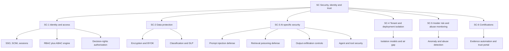
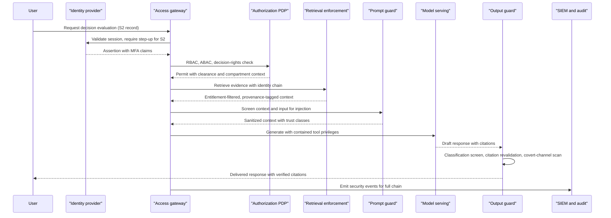

# Security, identity & trust (SC) feature catalog

## 1. Front matter

| Field | Value |
|---|---|
| Doc ID | CAT-SC |
| Pillars covered | SC |
| Owning unit | U9 Catalog SC |
| Version | 1.0 |

## 2. Pillar overview & scope boundary

TrueNorth concentrates a company's most consequential information in one system: strategy, contested decisions, dissent, forecasts, M&A context, and the evidence behind all of them. The SC pillar exists to make that concentration survivable. It provides the identity fabric (who and what is acting), the authorization fabric (what each actor may see and do, including decision-rights-aware rules), data protection (encryption, customer-held keys, classification, loss prevention), AI-specific defenses (prompt injection, retrieval poisoning, output exfiltration, agent containment), isolation guarantees across SaaS/VPC/on-prem/air-gapped deployments, transparent insider-risk and abuse monitoring scoped strictly to the platform itself, and the certification machinery that lets a Fortune-500 buyer verify all of the above. SC is an enforcement pillar: it consumes policy and ontology defined elsewhere and turns them into runtime guarantees with measurable failure behavior, defaulting to deny.

**NOT in this pillar:**

- Decision-rights matrix authoring and policy semantics — GV-1 (SC-1 enforces the matrix at runtime; it does not define it).
- Stakes-tiered human-in-the-loop gate definitions — GV-2 (SC-3 invokes these gates before agent actions; gate logic lives in GV).
- Immutable decision audit, reproducibility, and replay — GV-3 (SC emits security events into that audit fabric).
- Regulatory compliance packs such as GDPR, EU AI Act, and SOX — GV-5 (SC-6 covers security certifications only).
- Prohibited-use and ethics red-line definitions — GV-6 (SC-3 and SC-5 provide technical enforcement points).
- Model risk management, model cards, and drift governance — GV-7.
- PII redaction, consent zones, and minimization applied pre-persistence — DF-4.
- Residency and sovereignty routing decisions — DF-6 (SC-2 places keys and ciphertext consistently with those decisions).
- Retrieval ranking and GraphRAG semantics — KG-4 (SC-2-4 supplies the entitlement verdicts that KG-4 must honor).
- Meeting recording consent and retention governance — MI-6.
- Model gateway routing, RAG infrastructure, and agent orchestration — PL-1, PL-2, PL-3 (SC-3 attaches controls to these planes; it does not build them).
- Multi-region availability and disaster recovery — PL-7.
- Usage and adoption analytics — AD-3 (SC-5 telemetry is segregated from adoption analytics by design).

## 3. L2 index & capability map

| L2 ID | Name | Scope (canonical) |
|---|---|---|
| SC-1 | Identity & access | SSO/SCIM, RBAC+ABAC, decision-rights-aware authorization |
| SC-2 | Data protection | Encryption, BYOK, DLP, classification-aware retrieval |
| SC-3 | AI-specific security | Prompt injection, retrieval poisoning, output exfiltration |
| SC-4 | Tenant & deployment isolation | SaaS/VPC/on-prem/air-gapped |
| SC-5 | Insider risk & abuse monitoring | Platform-scoped, transparent monitoring |
| SC-6 | Certifications | SOC 2, ISO 27001/42001, FedRAMP |

## 4. Feature trees (per L2 group)

### SC-1 Identity & access

Workforce and workload identity via SSO/SCIM, layered RBAC+ABAC authorization, and decision-rights-aware access enforcement, consistent with the shared specification.

#### SC-1-1 Enterprise SSO & session security

- **User story:** As an enterprise IT administrator, I want TrueNorth to federate with our identity provider, so that workforce access inherits our existing credentials, MFA, and conditional-access posture with no parallel password store.
- **Description:** TrueNorth shall authenticate every human user through customer identity providers and shall manage sessions with stakes-aware step-up requirements, because decision records at S1/S2 warrant stronger proof of presence than routine browsing.

##### SC-1-1-1 Identity provider federation

- **Behavior:** Supports SAML 2.0 and OIDC, multiple concurrent IdPs per tenant (subsidiaries, joint ventures), SP- and IdP-initiated flows, automatic signing-certificate rollover, and group-claim mapping into the role model.
- **Data touched:** Identity assertions, group claims, federation metadata; no passwords stored.
- **Model/AI involvement:** None.
- **UX surface:** Administrative configuration via SX-1; sign-in interstitials on all SX surfaces.
- **Acceptance criteria:** A tenant can federate two IdPs and route users by domain; certificate rotation completes without sign-in interruption; local credentials are impossible to create outside break-glass.

##### SC-1-1-2 Session policy & step-up authentication

- **Behavior:** Enforces idle and absolute session timeouts per tenant policy; requires phishing-resistant MFA step-up (e.g., FIDO2 via the IdP) before opening S1/S2 decision records, signing off a verdict, or entering administrative consoles; consumes device-posture signals passed by the IdP.
- **Data touched:** Session tokens, step-up attestations, stakes tier of the target resource.
- **Model/AI involvement:** None.
- **UX surface:** SX-1, SX-2, SX-3, SX-4 (all surfaces honor the same session fabric).
- **Acceptance criteria:** Opening an S1 record without recent step-up triggers re-authentication; explicit session kill propagates to all surfaces within 60 seconds.
- **L5 notes:** Fail closed — if the step-up channel is unavailable, S1/S2 access is denied, not downgraded.

##### SC-1-1-3 Break-glass access

- **Behavior:** Provides sealed emergency accounts usable only when the IdP is unreachable; activation requires dual approval, is time-boxed, records the full session, and pages security contacts in real time.
- **Data touched:** Break-glass credentials (HSM-sealed), activation approvals, session recordings.
- **Model/AI involvement:** None.
- **UX surface:** SX-1 (dedicated, visually distinct emergency console).
- **Acceptance criteria:** Activation without two approvers fails; accounts auto-expire within the configured window; every activation produces an immutable event consumable by GV-3.

#### SC-1-2 SCIM provisioning & identity lifecycle

- **User story:** As an IAM operations lead, I want joiner/mover/leaver events to flow automatically from our HR-driven directory, so that access always matches current employment and role reality.
- **Description:** TrueNorth shall provision, update, and deprovision identities via SCIM 2.0 and shall reconcile entitlement drift continuously, since stale access to decision data is among the platform's highest-impact risks.

##### SC-1-2-1 Automated joiner/mover/leaver processing

- **Behavior:** SCIM 2.0 create/update/deactivate with attribute mapping (department, cost center, region, employment type) feeding ABAC; mover events trigger full entitlement re-evaluation; leaver events revoke sessions and tokens.
- **Data touched:** User and group objects, entitlement assignments, session/token stores.
- **Model/AI involvement:** None.
- **UX surface:** SX-1 (lifecycle dashboards); SX-5 for SCIM endpoints.
- **Acceptance criteria:** Leaver deactivation revokes all active sessions within 15 minutes; mover re-evaluation completes within 5 minutes; the person's authored content persists per KG-3 while their access ends.

##### SC-1-2-2 Orphan and drift reconciliation

- **Behavior:** Nightly reconciliation compares directory truth to local grants; orphaned accounts, unowned service accounts, and grants no longer derivable from any role/attribute are flagged and auto-suspended after a grace period.
- **Data touched:** Directory snapshots, grant inventory, reconciliation reports.
- **Model/AI involvement:** None.
- **UX surface:** SX-1.
- **Acceptance criteria:** A grant with no valid derivation is suspended within the configured grace period; reconciliation reports are exportable as certification evidence (SC-6-2).

##### SC-1-2-3 Access reviews & recertification

- **Behavior:** Periodic campaigns route each user's entitlements to their manager and to data owners for attestation; non-response auto-revokes; high-privilege roles reviewed quarterly, others semi-annually.
- **Data touched:** Entitlement snapshots, attestation records, revocation actions.
- **Model/AI involvement:** Extractive — suggests likely-stale grants from usage patterns to prioritize reviewer attention.
- **UX surface:** SX-1; reminders via SX-3.
- **Acceptance criteria:** Campaign completion and exception rates are reportable; auto-revocation on expiry is verifiable in the audit trail.

#### SC-1-3 RBAC+ABAC authorization engine

- **User story:** As a security architect, I want layered role- and attribute-based authorization with deny-by-default semantics, so that access decisions reflect role, data classification, residency, and context simultaneously.
- **Description:** TrueNorth shall evaluate every access through a central policy decision point combining RBAC roles with ABAC attributes, because role alone cannot express need-to-know across classifications, regions, and stakes tiers.

##### SC-1-3-1 Role catalog & separation of duties

- **Behavior:** Ships role templates (executive, department lead, analyst, contributor, auditor, security administrator, platform administrator) with tenant-defined custom roles; enforces separation-of-duties constraints, e.g., security administrators cannot hold verdict sign-off roles.
- **Data touched:** Role definitions, role-to-permission maps, SoD constraint sets.
- **Model/AI involvement:** None.
- **UX surface:** SX-1.
- **Acceptance criteria:** Assigning a role pair that violates an SoD constraint is blocked with an explanation; role definitions are versioned with effective dates.

##### SC-1-3-2 Attribute & context policy evaluation

- **Behavior:** Evaluates user attributes (department, region, clearance), resource attributes (classification label, stakes tier, residency tag), and context (device posture, network zone, time) at a central PDP with distributed enforcement points in every service; deny by default; all policies versioned.
- **Data touched:** Attribute stores, policy bundles, per-request decision logs.
- **Model/AI involvement:** None (deterministic evaluation only; no model may make an authorization decision).
- **UX surface:** Headless control plane; policy authoring via SX-1.
- **Acceptance criteria:** PDP decision p99 latency ≤ 25 ms; cached enforcement-point decisions ≤ 5 ms; every deny carries a policy-rule identifier for audit.
- **L5 notes:** Enforcement points fail closed for restricted-or-above resources; policy distribution loss freezes the last signed bundle rather than dropping to permissive.

##### SC-1-3-3 Policy simulation & change preview

- **Behavior:** Replays proposed policy changes against a window of historical access logs before activation, reporting who would gain or lose access; high-impact changes require dual approval.
- **Data touched:** Candidate policy bundles, historical decision logs (pseudonymized), impact reports.
- **Model/AI involvement:** None.
- **UX surface:** SX-1.
- **Acceptance criteria:** Preview enumerates affected principals and resources before any change goes live; activation without preview is blocked for rules touching S1/S2 resources.

#### SC-1-4 Decision-rights-aware authorization

- **User story:** As a chief of staff, I want access to decision records to follow our decision-rights matrix and stakes tiers, so that an S1 board deliberation is visible only to the people our governance says may see it.
- **Description:** TrueNorth shall bind authorization for decision records to the decision-rights matrix defined in GV-1 and the org model in KG-6, making "who may view, contribute to, or sign off this decision" a first-class, enforced property of every record.

##### SC-1-4-1 Decision-record entitlement enforcement

- **Behavior:** Derives per-record entitlements from stakes tier, decision-rights roles, committee membership, and explicit participant lists; entitlements recompute automatically when the org model or matrix changes.
- **Data touched:** Decision-record ACL derivations, decision-rights bindings, org-model snapshots.
- **Model/AI involvement:** None.
- **UX surface:** Enforcement is invisible; entitlement explanations appear in SX-1.
- **Acceptance criteria:** A user outside the derived set cannot retrieve the record via any path including search, citations, or the conversational surface; org-model changes propagate to entitlements within 5 minutes.

##### SC-1-4-2 Delegation & temporary elevation

- **Behavior:** Permits scoped, time-boxed delegation of decision-record access (e.g., vacation coverage, deal-team additions) with mandatory expiry, delegator accountability, and automatic notification to record owners.
- **Data touched:** Delegation grants, expiry schedules, notification events.
- **Model/AI involvement:** None.
- **UX surface:** SX-1; delegation requests via SX-3.
- **Acceptance criteria:** Delegations cannot exceed delegator scope; all delegations expire automatically and appear in access-review campaigns (SC-1-2-3).

#### SC-1-5 Privileged access management

- **User story:** As a CISO, I want administrative power over TrueNorth to be just-in-time, dual-controlled, and recorded, so that no standing super-user can silently read or alter decision data.
- **Description:** TrueNorth shall eliminate standing administrative privilege through just-in-time elevation and shall make all vendor or operator access to customer content contingent on customer consent.

##### SC-1-5-1 Just-in-time administrative elevation

- **Behavior:** Administrative roles are activated on request, bound to a ticket/justification, time-boxed, and require dual approval when the scope includes customer content; zero standing access to tenant data for operators.
- **Data touched:** Elevation requests, approvals, time-boxed grants.
- **Model/AI involvement:** None.
- **UX surface:** SX-1.
- **Acceptance criteria:** No principal holds a permanently active content-scoped admin role; elevation without justification is rejected; expiry is enforced server-side.

##### SC-1-5-2 Consent-gated support access & session recording

- **Behavior:** Vendor support access to tenant content requires explicit customer approval per incident, is scoped and time-boxed, and produces full session recordings; administrative consoles log every command.
- **Data touched:** Consent grants, support-session recordings, admin command logs.
- **Model/AI involvement:** None.
- **UX surface:** Consent prompts and access-transparency log in SX-1.
- **Acceptance criteria:** Support access without an active customer grant is technically impossible in SaaS and VPC modes; customers can review a complete access-transparency log.

#### SC-1-6 Non-human & agent identity

- **User story:** As a platform security engineer, I want every service, connector, and AI agent to act under a verifiable identity with least privilege, so that automation can never exceed the human it serves.
- **Description:** TrueNorth shall issue short-lived workload identities and shall propagate the originating user's identity through every agent and tool invocation, because an agent without an identity chain is an unauditable deputy.

##### SC-1-6-1 Workload & service identity

- **Behavior:** Services and connectors authenticate with short-lived, automatically rotated credentials over mutual TLS; static long-lived secrets are prohibited by policy scanning; each connector identity is scoped to its source system.
- **Data touched:** Workload certificates, token issuance logs.
- **Model/AI involvement:** None.
- **UX surface:** Headless; inventory in SX-1.
- **Acceptance criteria:** Credential lifetime ≤ 24 hours; a leaked workload credential is useless outside its mTLS context; secret scanning blocks deploys containing static credentials.

##### SC-1-6-2 On-behalf-of propagation for AI agents

- **Behavior:** Every agent run orchestrated by PL-3 carries the originating user's identity and entitlement context end to end; agents and their tools are constrained to the intersection of the agent's scoped manifest and the caller's entitlements, never the union.
- **Data touched:** Identity-chain tokens, agent run metadata, tool-call authorization decisions.
- **Model/AI involvement:** None (identity is deterministic; the model never selects its own privileges).
- **UX surface:** Headless; identity chains visible in audit views via SX-1.
- **Acceptance criteria:** An agent acting for a user denied a document cannot retrieve that document through any tool; identity chains are present on 100% of tool-call audit events.

### SC-2 Data protection

Encryption everywhere, customer-managed keys, classification labeling that survives derivation, classification-aware retrieval enforcement, and loss prevention, consistent with the shared specification.

#### SC-2-1 Encryption & key hierarchy baseline

- **User story:** As a security engineer, I want all TrueNorth data encrypted with a per-tenant key hierarchy, so that storage compromise and tenant cross-contamination are both cryptographically bounded.
- **Description:** TrueNorth shall encrypt all data at rest with envelope encryption keyed per tenant and shall require modern TLS for every hop, including service-to-service traffic.

##### SC-2-1-1 Envelope encryption at rest

- **Behavior:** AES-256 envelope encryption with per-tenant data-encryption keys wrapped by KMS-held key-encryption keys; covers primary stores, search and vector indexes, caches that persist, and backups; key placement follows residency decisions from DF-6.
- **Data touched:** All persisted tenant content including embeddings and derived artifacts.
- **Model/AI involvement:** None.
- **UX surface:** Headless; key inventory in SX-1.
- **Acceptance criteria:** 100% of persistent stores enumerate under an encrypted-store inventory; an unencrypted store class cannot pass deployment policy checks.
- **L5 notes:** Field-level encryption is additionally applied to the highest-sensitivity attributes (e.g., recorded dissent on S1 records) so that even index operators cannot read plaintext.

##### SC-2-1-2 Transport encryption & service mesh

- **Behavior:** TLS 1.2+ (1.3 preferred) on all external endpoints with HSTS; mutual TLS between internal services tied to SC-1-6-1 identities; plaintext internal listeners prohibited.
- **Data touched:** All data in motion.
- **Model/AI involvement:** None.
- **UX surface:** Headless.
- **Acceptance criteria:** External scans show no endpoint below TLS 1.2; internal traffic capture in a test cell yields no plaintext tenant content.

#### SC-2-2 Customer-managed keys (BYOK/HYOK)

- **User story:** As a CISO, I want to hold the keys to our tenant, so that I can cryptographically revoke the vendor's ability to process our decision data at any time.
- **Description:** TrueNorth shall support customer-provided keys in the customer's KMS (BYOK) and externally held keys never imported into TrueNorth (HYOK), with revocation that renders tenant data unreadable on a defined clock.

##### SC-2-2-1 Key onboarding & rotation

- **Behavior:** Tenants register customer KMS keys as the root of their key hierarchy; rotation re-wraps data keys without downtime; HYOK mode performs wrap/unwrap calls against the customer's external key store with availability fallbacks defined by the customer.
- **Data touched:** Key references and wrap/unwrap operations only; customer root keys never persist in TrueNorth.
- **Model/AI involvement:** None.
- **UX surface:** SX-1.
- **Acceptance criteria:** Rotation completes with zero data-plane downtime; key-usage logs are mirrored to the customer's KMS audit trail.

##### SC-2-2-2 Revocation & crypto-shredding

- **Behavior:** Customer key revocation halts all decryption within the SLA; tenant offboarding destroys data-encryption keys (crypto-shredding) covering primary data, indexes, embeddings, caches, and backups on their expiry schedule.
- **Data touched:** Key material lifecycle records, destruction attestations.
- **Model/AI involvement:** None.
- **UX surface:** SX-1.
- **Acceptance criteria:** Revocation takes effect platform-wide within 1 hour; offboarding produces a destruction attestation enumerating every covered store class, usable as audit evidence.
- **L5 notes:** Edge case — in-flight model inference at revocation time is allowed to complete or is terminated per tenant policy; the choice is recorded.

#### SC-2-3 Data classification & label propagation

- **User story:** As a data protection officer, I want every artifact in TrueNorth — including AI-derived ones — to carry a sensitivity label, so that controls can key off classification rather than guesswork.
- **Description:** TrueNorth shall maintain a tenant-extensible classification taxonomy, ingest labels from source systems, suggest labels where absent, and propagate labels to every derived artifact, because an unlabeled summary of a restricted document is a leak waiting to happen.

##### SC-2-3-1 Label taxonomy & assignment

- **Behavior:** Default four-level taxonomy (public / internal / confidential / restricted) plus tenant-defined compartments (e.g., deal rooms); inherits source labels (e.g., sensitivity labels arriving through DF-1 connectors); proposes labels for unlabeled content with human confirmation required at confidential and above.
- **Data touched:** Classification labels, compartment definitions, label provenance.
- **Model/AI involvement:** Extractive — label suggestion classifier; never auto-applies restricted without confirmation.
- **UX surface:** SX-1 for taxonomy administration; inline label chips on all SX surfaces.
- **Acceptance criteria:** 100% of ingested artifacts carry a label or sit in a labeling queue blocked from retrieval; label suggestions report precision/recall against a tenant validation set.

##### SC-2-3-2 Derived-artifact label propagation

- **Behavior:** Embeddings, graph nodes, summaries, simulation outputs, and recommendations inherit the high-water mark of their source labels, computed over lineage from DF-5; lineage changes trigger relabeling of downstream artifacts.
- **Data touched:** Derivation lineage, labels on derived stores.
- **Model/AI involvement:** None (deterministic propagation over lineage).
- **UX surface:** Headless; lineage-with-labels views in SX-1.
- **Acceptance criteria:** A recommendation citing one restricted source is itself restricted; relabeling after lineage change completes within 15 minutes; no derived store class is exempt from propagation.

#### SC-2-4 Classification-aware retrieval enforcement

- **User story:** As a knowledge platform owner, I want retrieval to be security-trimmed before ranking, so that a user's question can never surface content beyond their clearance — not even as a snippet, embedding match, or citation.
- **Description:** TrueNorth shall enforce entitlement and classification filters at query time inside the retrieval path used by KG-4 and PL-2, treating the vector index as a protected store rather than a side channel.

##### SC-2-4-1 Query-time entitlement filtering

- **Behavior:** Every retrieval request carries the caller's identity chain (SC-1-6-2); candidate sets are filtered by ACL, classification, compartment, and residency before ranking or context assembly; restricted vectors are partitioned so unentitled queries never touch them.
- **Data touched:** Entitlement context, index partitions, filter decisions.
- **Model/AI involvement:** None (deterministic trimming; ranking models run only on the post-filter set).
- **UX surface:** Headless; serves KG-4 and PL-2.
- **Acceptance criteria:** Red-team probes (synonyms, embeddings of restricted text, citation-walking) return zero above-clearance content; filter overhead p95 ≤ 50 ms.

##### SC-2-4-2 Clearance-mismatch handling & existence disclosure

- **Behavior:** When relevant evidence exists above the caller's clearance, behavior follows tenant policy: silent omission, or a generic notice that additional restricted evidence informed confidence, without titles, counts, or owners.
- **Data touched:** Mismatch events, disclosure policy configuration.
- **Model/AI involvement:** Generative — the notice phrasing is generated under a fixed template that cannot include restricted tokens.
- **UX surface:** SX-1, SX-2 (recommendation views).
- **Acceptance criteria:** No mismatch notice ever contains identifying metadata of the restricted artifact; policy default is silent omission.
- **L5 notes:** Existence disclosure is itself an inference channel; see Open questions for the proposed global default.

#### SC-2-5 Data loss prevention & egress control

- **User story:** As a security operations lead, I want exports and downstream sharing of decision content to be governed and traceable, so that a single user cannot quietly move the company's decision history outside the boundary.
- **Description:** TrueNorth shall govern exports, downloads, and API egress by classification and role, and shall watermark released artifacts for traceability.

##### SC-2-5-1 Export & download controls

- **Behavior:** Classification-based export rules (e.g., restricted content cannot leave the platform; confidential requires data-owner approval); bulk export always requires approval and produces a manifest; SX-5 API egress passes the same policy.
- **Data touched:** Export requests, approvals, manifests.
- **Model/AI involvement:** None.
- **UX surface:** SX-1; approval requests via SX-3.
- **Acceptance criteria:** Export of a restricted artifact is blocked on every surface including the API; every approved export has an immutable manifest entry.

##### SC-2-5-2 Watermarking & release traceability

- **Behavior:** Exported briefs and reports carry visible and forensic per-recipient watermarks; a released-artifact registry supports tracing a leaked document back to its export event.
- **Data touched:** Watermark registry, export-event metadata.
- **Model/AI involvement:** None.
- **UX surface:** Headless; trace lookups in SX-1.
- **Acceptance criteria:** A leaked watermarked PDF resolves to a unique export event; watermark survives print-and-scan at defined quality thresholds (assumption-marked target).

#### SC-2-6 Secrets & connector credential custody

- **User story:** As an integration administrator, I want the credentials TrueNorth holds for our ERP, CRM, and collaboration systems vaulted and least-scoped, so that the connector fabric does not become a skeleton key to the enterprise.
- **Description:** TrueNorth shall custody all DF-1 connector credentials in an HSM-backed vault with scoped grants, automatic rotation where source systems allow, and anomaly alerts on credential use.

##### SC-2-6-1 Vaulting & rotation

- **Behavior:** OAuth tokens, API keys, and service credentials are stored in an HSM-backed vault, encrypted per tenant, released only to the owning connector identity (SC-1-6-1); rotation is automated where the source supports it and tracked as risk where it does not.
- **Data touched:** Connector credentials, rotation schedules.
- **Model/AI involvement:** None.
- **UX surface:** SX-1.
- **Acceptance criteria:** No connector credential exists outside the vault; credentials are unreadable by operators; rotation status is reportable per connector.

##### SC-2-6-2 Scope minimization & usage attestation

- **Behavior:** At registration, requested scopes are checked against the connector's declared minimum; over-scoped grants are flagged; credential usage is baselined and deviations (volume, endpoints, hours) raise alerts to SC-5.
- **Data touched:** Scope declarations, usage telemetry.
- **Model/AI involvement:** Extractive — usage anomaly scoring.
- **UX surface:** SX-1.
- **Acceptance criteria:** Registering a connector with scopes beyond its manifest requires explicit override with justification; credential-use anomalies generate events within 5 minutes.

### SC-3 AI-specific security

Defenses for the AI pipeline itself — prompt injection, retrieval poisoning, output exfiltration — plus agent containment, AI supply-chain integrity, misuse resistance, and AI-specific detection and response, consistent with the shared specification.

#### SC-3-1 Prompt injection defense

- **User story:** As a CISO, I want instructions embedded in ingested content to be inert, so that a malicious document, calendar invite, transcript, or external news item cannot steer a recommendation or trigger an action.
- **Description:** TrueNorth shall treat all retrieved and ingested content as untrusted data, never as instructions. This is the pillar's signature threat: TrueNorth reads everything the company reads, so anyone who can write a document the company ingests can attempt to program the advisor. Defense is layered — structural isolation, detection, privilege containment, and continuous adversarial testing — because no single layer is reliable.

##### SC-3-1-1 Untrusted-content isolation & trust-class tagging

- **Behavior:** Every prompt segment assembled by PL-1/PL-2 carries a trust class (system, operator, end-user, retrieved-internal, retrieved-external); templates structurally separate instruction channels from data channels (delimited and spotlighted), and system prompts explicitly instruct models to refuse instruction-following from data segments; external-feed content from DF-7 is always lowest-trust.
- **Data touched:** Prompt assembly metadata, trust-class tags, template registry.
- **Model/AI involvement:** None at this layer (deterministic assembly); the protected models are downstream.
- **UX surface:** Headless; template and trust-class inspection via SX-1.
- **Acceptance criteria:** 100% of prompt segments carry a trust class; an assembled prompt missing trust tags is rejected by the gateway; templates bypassing the structured assembler cannot be deployed (SC-3-5-1).

##### SC-3-1-2 Injection detection & content sanitization

- **Behavior:** A screening ensemble (pattern rules for known payloads and encodings — base64, homoglyph, markdown tricks — plus ML classifiers for novel imperative/manipulative content) scans retrieved content and user input before prompt assembly; suspect spans are stripped, neutralized, or the source quarantined, with the action annotated in the context; detection thresholds tighten with stakes tier.
- **Data touched:** Candidate context, detection verdicts, quarantine queue.
- **Model/AI involvement:** Judge — classifier ensemble scoring injection likelihood per span.
- **UX surface:** Headless; detections in SX-1 security console.
- **Acceptance criteria:** ≥ 99% block rate on the known-attack corpus at ≤ 1% false positives on a benign corpus (targets assumption-marked, measured per release via PL-4); screening latency p95 ≤ 150 ms per request.
- **L5 notes:** Failure mode — if the screening service is down, S1/S2 requests fail closed; S3/S4 may proceed with retrieved-external content excluded, per tenant policy.

##### SC-3-1-3 Privilege containment for model-initiated actions

- **Behavior:** Tool invocation authority is derived exclusively from the caller's identity chain (SC-1-6-2) and the agent manifest (SC-3-4-1), never from model output; state-changing tools demand an allowlisted manifest entry plus the GV-2 gate for the applicable stakes tier; text arriving in any data channel can therefore alter at most what the model says, never what the system does.
- **Data touched:** Tool-call authorization decisions, capability tokens.
- **Model/AI involvement:** None (containment is deterministic around the model).
- **UX surface:** Headless; confirmation prompts surface via SX-2/SX-3 when GV-2 gates fire.
- **Acceptance criteria:** Red-team exercises where injected text requests tool calls show zero unauthorized invocations; capability tokens are absent from model-visible context.

##### SC-3-1-4 Injection red-team corpus & regression gates

- **Behavior:** A curated, versioned attack corpus (direct, indirect, multilingual, multi-turn, encoding-based) runs in the PL-4 evaluation harness on every model, template, or screening change; regressions block release; the corpus grows from production detections, external threat intelligence, and scheduled internal red-team campaigns.
- **Data touched:** Attack corpus, evaluation results, release gates.
- **Model/AI involvement:** Judge — automated grading of attack success in eval runs.
- **UX surface:** SX-1 (security release dashboard).
- **Acceptance criteria:** No model/template change ships without a passing injection eval; corpus refresh cadence at least monthly; every production-detected novel attack is added within one week.

#### SC-3-2 Retrieval poisoning defense

- **User story:** As a head of security engineering, I want the knowledge corpus protected against deliberate contamination, so that an adversary cannot plant content today to bias an S1 recommendation next quarter.
- **Description:** TrueNorth shall defend the integrity of its retrieval corpus across the full lifecycle — ingestion vetting, drift detection, quarantine and rollback, and corroboration requirements for high-stakes evidence — because poisoning is the patient attacker's route to influencing decisions without ever touching the model.

##### SC-3-2-1 Ingestion integrity & provenance scoring

- **Behavior:** Each ingested artifact receives a provenance score from source authenticity, author plausibility (e.g., a "finance policy" authored by an account with no finance affiliation per KG-6), ACL anomalies, and source-reliability scores carried by DF-7 for external feeds; low-provenance content is ingestible but demoted and flagged for retrieval.
- **Data touched:** Provenance scores, author/ACL metadata, lineage records via DF-5.
- **Model/AI involvement:** Extractive — plausibility scoring; no generative rewriting of sources.
- **UX surface:** Headless; provenance visible on citations in SX-1/SX-2.
- **Acceptance criteria:** 100% of corpus items carry a provenance score; authorship-anomaly detection is exercised by seeded test artifacts each release.

##### SC-3-2-2 Corpus drift & outlier detection

- **Behavior:** Embedding-space monitoring detects outlier insertions and abnormal semantic shifts in frequently cited or policy-class documents; newly ingested or newly modified content enters a probation window during which it cannot serve as primary evidence for S1/S2 evaluations unless validated through KG-5.
- **Data touched:** Embedding distributions, citation frequency stats, probation flags.
- **Model/AI involvement:** Judge — statistical and learned outlier detection.
- **UX surface:** SX-1 security console.
- **Acceptance criteria:** Seeded poisoning canaries are detected within 24 hours; probation enforcement is verifiable in evidence-assembly logs; probation duration is tenant-configurable with a default of 7 days.

##### SC-3-2-3 Quarantine & index rollback

- **Behavior:** Suspect artifacts are quarantined out of retrieval without altering the source system; the retrieval index supports point-in-time rollback to excise a contamination window; quarantined items route to KG-5 curation queues for adjudication; recommendations that cited later-quarantined evidence are flagged for re-evaluation.
- **Data touched:** Quarantine sets, index snapshots, affected-recommendation lists.
- **Model/AI involvement:** None.
- **UX surface:** SX-1.
- **Acceptance criteria:** Quarantine takes effect across all retrieval paths within 5 minutes; index rollback for a 30-day window completes within 4 hours; affected recommendations are enumerable by quarantined-source ID.

##### SC-3-2-4 Evidence corroboration for high-stakes citations

- **Behavior:** For S1/S2 evaluations, evidence assembled by DI-2 must be corroborated across independent sources or validated by an SME through KG-5; single-source, uncorroborated claims are admissible only with an explicit "uncorroborated" tag that the recommendation must surface; independence is computed over provenance (same author/system/feed is not independent).
- **Data touched:** Corroboration graphs, independence metadata, evidence tags.
- **Model/AI involvement:** Extractive — claim matching across sources to establish corroboration.
- **UX surface:** Evidence panels in SX-1.
- **Acceptance criteria:** No S1 recommendation cites untagged single-source evidence; independence computation demonstrably rejects same-origin pairs.

#### SC-3-3 Output exfiltration controls

- **User story:** As a CISO, I want every model output screened before delivery, so that generation can never become a path around access control — neither by paraphrasing restricted content nor by smuggling data to an attacker-controlled endpoint.
- **Description:** TrueNorth shall apply response-side controls symmetrical to its input-side controls: classification screening, citation revalidation, covert-channel defense, and aggregation limits. Retrieval filtering (SC-2-4) is necessary but insufficient, because models can recombine fragments and attackers can use outputs as an egress channel.

##### SC-3-3-1 Response-side classification screening

- **Behavior:** An output classifier estimates the sensitivity of each generated response and compares it to the caller's clearance and the labels of the supplied context; above-clearance spans are redacted or the response is blocked with a policy notice; screening covers all surfaces including SX-5 API responses and SX-3 plugin cards.
- **Data touched:** Generated responses, context labels, screening verdicts.
- **Model/AI involvement:** Judge — output sensitivity classifier.
- **UX surface:** Headless; policy notices render on the requesting surface.
- **Acceptance criteria:** Screening latency p95 ≤ 300 ms; seeded above-clearance generations are caught at ≥ 99% on the test corpus (assumption-marked); no surface ships without screening enabled.

##### SC-3-3-2 Citation & quotation entitlement revalidation

- **Behavior:** Every citation, quotation, and attachment in a response is re-checked against the caller's entitlements at render time — independently of retrieval-time filtering — catching entitlement changes mid-session and any context that entered assembly through a non-standard path.
- **Data touched:** Citation lists, entitlement decisions, render-time logs.
- **Model/AI involvement:** None (deterministic re-check).
- **UX surface:** Headless; affects citation rendering on all surfaces.
- **Acceptance criteria:** Revoking an entitlement mid-session removes the artifact from subsequent renders within 60 seconds; revalidation coverage is 100% of cited artifacts.

##### SC-3-3-3 Covert-channel & active-content defense

- **Behavior:** Outputs are stripped of active content; external links and images render only against tenant-allowlisted domains, blocking the classic markdown-image exfiltration channel (data encoded in a URL fetched on render); encoded payloads in outputs (base64 blobs, zero-width characters, steganographic markers) are detected and stripped; web surfaces enforce a strict content-security policy.
- **Data touched:** Response bodies, allowlist configuration, strip/block events.
- **Model/AI involvement:** Judge — encoded-payload detector; deterministic sanitization otherwise.
- **UX surface:** All SX surfaces inherit sanitized rendering.
- **Acceptance criteria:** A response containing a non-allowlisted image URL renders with the URL inert; zero-width and base64 payload tests are stripped; CSP violations are reported to SC-3-7-1.

##### SC-3-3-4 Aggregation & inference-risk limits

- **Behavior:** Per-user budgets and pattern detection govern repeated narrow queries that could reconstruct restricted material (e.g., enumerating an S1 record by asking many small questions); systematic enumeration patterns throttle the session and raise an SC-5 event; budgets scale with role and stakes tier.
- **Data touched:** Query pattern telemetry, budget counters, throttle events.
- **Model/AI involvement:** Judge — enumeration-pattern scoring across sessions.
- **UX surface:** Throttle notices on the requesting surface; alerts in SX-1.
- **Acceptance criteria:** A scripted reconstruction probe trips throttling before recovering a defined fraction of a restricted record in red-team tests; false-throttle rate on benign heavy users ≤ 1% (assumption-marked).

#### SC-3-4 Agent & tool-use security

- **User story:** As a platform owner, I want every autonomous step an agent takes to be least-privileged, sandboxed, and attributable, so that orchestration (PL-3) can scale without scaling blast radius.
- **Description:** TrueNorth shall constrain agents with minimal tool manifests, gate state-changing actions through policy and GV-2 human gates, sandbox execution, and log every step for replay.

##### SC-3-4-1 Least-privilege tool manifests

- **Behavior:** Each agent type declares a minimal tool manifest (default read-only); manifests are reviewed artifacts under SC-3-5-1 signing; effective permissions are the intersection of manifest and caller entitlements per SC-1-6-2.
- **Data touched:** Tool manifests, scope grants.
- **Model/AI involvement:** None.
- **UX surface:** Manifest registry in SX-1.
- **Acceptance criteria:** An agent invoking a tool outside its manifest is denied and the run is flagged; manifest changes require security review sign-off.

##### SC-3-4-2 Action gating & sandboxed execution

- **Behavior:** State-changing tool calls (writing to source systems, sending communications, committing records) require a deterministic policy check and the GV-2 gate appropriate to the stakes tier; code execution and simulation tools run in network-isolated sandboxes with no default egress and resource ceilings.
- **Data touched:** Gate decisions, sandbox execution logs.
- **Model/AI involvement:** None at the control layer.
- **UX surface:** Human confirmations via SX-2/SX-3.
- **Acceptance criteria:** No state-changing call executes without a recorded gate decision; sandbox escape tests are part of release evals; sandbox egress attempts generate SC-3-7-1 events.

##### SC-3-4-3 Agent action audit trail

- **Behavior:** Every tool call records the identity chain, input/output content hashes, manifest version, and gate decisions, emitted into the GV-3 audit fabric to support full replay of any agent run.
- **Data touched:** Tool-call audit events.
- **Model/AI involvement:** None.
- **UX surface:** Audit exploration via SX-1.
- **Acceptance criteria:** 100% of tool calls produce audit events before results return to the agent (write-ahead); a sampled agent run can be replayed step-for-step from the trail.

#### SC-3-5 Model & AI supply-chain integrity

- **User story:** As a head of AI platform, I want every model, prompt template, lens configuration, and eval set we run to be signed and verified, so that a tampered prompt cannot silently change how the company is advised.
- **Description:** TrueNorth shall treat AI artifacts as supply-chain assets with signing, verification, and provenance, because modifying a judge's instructions is as damaging as modifying its code.

##### SC-3-5-1 Signed AI artifact registry

- **Behavior:** Models, prompt templates, lens configurations, screening rules, and eval sets are versioned and cryptographically signed; the serving plane verifies signatures at load; unsigned or tampered artifacts refuse to load and raise alerts.
- **Data touched:** Artifact signatures, registry metadata, verification logs.
- **Model/AI involvement:** None.
- **UX surface:** Registry views in SX-1.
- **Acceptance criteria:** A modified template fails verification and never serves; every production response is attributable to exact signed artifact versions.

##### SC-3-5-2 Third-party model & dependency assurance

- **Behavior:** External foundation models and libraries undergo vendor security assessment, version pinning, and an AI bill of materials per release; air-gapped model delivery (SC-4-3-1) verifies bundle signatures before installation; fine-tuned models from PL-5 require PL-4 leakage and safety evals before promotion.
- **Data touched:** AI BOM records, assessment artifacts, promotion gates.
- **Model/AI involvement:** None.
- **UX surface:** SX-1.
- **Acceptance criteria:** No unpinned model version serves production; promotion of a fine-tuned model without a passing leakage eval is blocked.

#### SC-3-6 Jailbreak & misuse resistance

- **User story:** As a security and ethics stakeholder, I want the platform to resist attempts to bend it toward prohibited or extractive uses, so that red lines hold under adversarial pressure, not just good faith.
- **Description:** TrueNorth shall detect and resist jailbreak techniques and shall technically enforce the prohibited-use red lines defined in GV-6, including refusing individual-surveillance-style queries.

##### SC-3-6-1 Adversarial input resistance

- **Behavior:** Detects jailbreak patterns (role-play framing, obfuscation, multi-turn escalation, system-prompt extraction attempts) on user inputs across SX-2 and SX-5; responses scale with stakes and confidence: sanitize, refuse with explanation, or escalate to SC-5; conversation-level (not just message-level) analysis covers gradual attacks.
- **Data touched:** Conversation telemetry, detection verdicts.
- **Model/AI involvement:** Judge — jailbreak classifier with conversation context.
- **UX surface:** Refusal messaging via SX-2; events in SX-1.
- **Acceptance criteria:** Known-jailbreak corpus block rate ≥ 98% (assumption-marked, PL-4 measured); system-prompt extraction attempts never yield template contents.

##### SC-3-6-2 Red-line enforcement hooks

- **Behavior:** Prohibited-use definitions from GV-6 (e.g., individual surveillance scoring, covert monitoring) compile into enforceable query/output policies; matching requests are refused, logged, and reported per GV-6 escalation rules; enforcement points cover retrieval, generation, and API paths.
- **Data touched:** Red-line policy bundles, refusal events.
- **Model/AI involvement:** Judge — intent classification against prohibited-use categories.
- **UX surface:** Refusals on requesting surface; reporting via SX-1.
- **Acceptance criteria:** Seeded prohibited-use prompts are refused on all paths including SX-5; refusal events are queryable for ethics review.

##### SC-3-6-3 Training-data & memorization extraction resistance

- **Behavior:** Detects systematic probing aimed at extracting memorized content from fine-tuned models; rate-limits suspicious extraction patterns; PL-5 models pass memorization-leakage evals (canary extraction tests) before release.
- **Data touched:** Probe telemetry, canary eval results.
- **Model/AI involvement:** Judge — extraction-pattern detection.
- **UX surface:** Headless; events in SX-1.
- **Acceptance criteria:** Canary strings planted in fine-tuning corpora are not recoverable in release evals; extraction probing trips rate limits in red-team exercises.

#### SC-3-7 AI security telemetry & incident response

- **User story:** As a SOC manager, I want AI-specific detections in my SIEM and a kill switch I trust, so that an AI security incident is handled with the same rigor as any other intrusion.
- **Description:** TrueNorth shall emit normalized AI-security events, provide scoped containment controls, and ship incident-response playbooks for the novel incident classes this platform creates.

##### SC-3-7-1 Detection events & SIEM integration

- **Behavior:** Injection, poisoning, exfiltration-screening, jailbreak, and sandbox events are normalized into a documented schema and streamed to customer SIEMs; events carry identity chain, artifact versions, and tenant scope; PL-6 observability and GV-3 audit each receive their slice.
- **Data touched:** Security event stream, SIEM delivery state.
- **Model/AI involvement:** None.
- **UX surface:** SX-1 security console; SX-5 for streaming endpoints.
- **Acceptance criteria:** Event delivery p95 ≤ 60 seconds; schema is versioned and documented; air-gapped deployments write the identical stream locally.

##### SC-3-7-2 Containment & kill switches

- **Behavior:** Tenant-scoped kill switches disable, individually: a connector corpus, a tool, a model route, an agent type, or external-feed retrieval; severity-thresholded automation can trigger containment (e.g., auto-quarantine a corpus on confirmed poisoning) with mandatory human notification.
- **Data touched:** Containment state, activation events.
- **Model/AI involvement:** None.
- **UX surface:** SX-1 with dual-control activation for broad switches.
- **Acceptance criteria:** Each switch takes effect platform-wide within 2 minutes; activation requires recorded justification; recovery procedures are tested quarterly.

##### SC-3-7-3 AI incident playbooks & forensics

- **Behavior:** Ships runbooks for poisoning, injection-with-impact, exfiltration, and model-compromise incidents; forensics reconstruct the exact prompt, context, artifact versions, and output of any interaction via the GV-3 replay fabric; customer notification obligations and timelines are defined per deployment model.
- **Data touched:** Forensic snapshots, incident records.
- **Model/AI involvement:** None.
- **UX surface:** SX-1.
- **Acceptance criteria:** A tabletop exercise per quarter exercises at least one AI-specific playbook; any flagged interaction is reconstructable within 1 hour.

### SC-4 Tenant & deployment isolation

Isolation guarantees across multi-tenant SaaS, customer VPC, on-prem, and air-gapped deployments, with hard-isolation options, consistent with the shared specification.

#### SC-4-1 Tenant isolation architecture

- **User story:** As a CISO evaluating a multi-tenant deployment, I want isolation enforced by cryptography and architecture rather than by query filters alone, so that another tenant's incident cannot become mine.
- **Description:** TrueNorth shall isolate tenants with per-tenant key hierarchies, namespace-partitioned stores and indexes, tenant-pinned compute paths, and continuous adversarial verification.

##### SC-4-1-1 Logical isolation with tenant-scoped cryptography

- **Behavior:** Every store, index, queue, and cache partitions by tenant; tenant ID is a mandatory dimension of every authorization decision; data keys are tenant-scoped (SC-2-1-1) so a logic fault yields ciphertext, not content.
- **Data touched:** All tenant data partitions, key bindings.
- **Model/AI involvement:** None.
- **UX surface:** Headless.
- **Acceptance criteria:** Static analysis blocks deploys with non-tenant-scoped queries on tenant data; cross-tenant decryption is cryptographically impossible without crossing the KMS boundary.

##### SC-4-1-2 Dedicated-cell hard isolation

- **Behavior:** Offers single-tenant cells — dedicated compute, storage, indexes, queues, and model-serving capacity — for customers requiring hard isolation; cell assignment is contractual and verifiable; no shared caches or batch jobs cross cell boundaries.
- **Data touched:** Cell topology, placement attestations.
- **Model/AI involvement:** None.
- **UX surface:** Placement attestation reports via SX-1.
- **Acceptance criteria:** A cell inventory report enumerates every shared dependency (target: none on the data plane); cell customers can verify placement via signed attestations.

##### SC-4-1-3 Cross-tenant contamination testing & learning boundaries

- **Behavior:** Continuously running synthetic canary tenants attempt cross-tenant retrieval, cache bleed, citation leakage, and prompt-context mixing; tenant content is never used to train or fine-tune models shared with other tenants by default — improvement uses only aggregate, non-content telemetry unless a tenant explicitly opts in.
- **Data touched:** Canary tenant data, test results, opt-in records.
- **Model/AI involvement:** None (tests target the AI path but the control is deterministic).
- **UX surface:** Results summarized in the SC-6-3 trust portal.
- **Acceptance criteria:** Canary suite runs at least daily with zero tolerated leaks; any detection triggers SC-3-7-2 containment; the no-shared-training default is contractually attestable.

#### SC-4-2 Deployment hardening profiles

- **User story:** As a platform engineer, I want SaaS, VPC, and on-prem deployments to run from the same hardened baseline, so that control parity holds wherever the customer puts us.
- **Description:** TrueNorth shall maintain CIS-aligned hardened baselines, infrastructure-as-code policy scanning, and a published control-parity matrix across deployment models.

##### SC-4-2-1 Hardened baselines & parity matrix

- **Behavior:** Minimal hardened images, IaC policy scanning in the deployment pipeline, default-deny network policy, and a published matrix stating which SC controls are identical, equivalent, or customer-responsibility per deployment model.
- **Data touched:** Baseline definitions, scan results, parity matrix.
- **Model/AI involvement:** None.
- **UX surface:** Parity matrix in the SC-6-3 trust portal.
- **Acceptance criteria:** A deployment failing baseline scan cannot promote; the parity matrix has no "undefined" cells across SaaS/VPC/on-prem/air-gapped.

##### SC-4-2-2 Customer-controlled VPC & on-prem operations

- **Behavior:** In VPC and on-prem modes the customer holds infrastructure and KMS control; vendor access follows SC-1-5-2 consent gating; updates ship as signed bundles the customer applies on their schedule with staged rollback.
- **Data touched:** Update bundles, consent grants, version inventory.
- **Model/AI involvement:** None.
- **UX surface:** SX-1 deployment operations views.
- **Acceptance criteria:** Vendor cannot reach the data plane without an active customer grant; update signatures are verified before any installation.

#### SC-4-3 Air-gapped operations

- **User story:** As a defense-sector or sovereign customer, I want TrueNorth to run with no external connectivity at all, so that classified-adjacent decision data never depends on an internet path.
- **Description:** TrueNorth shall operate fully disconnected: offline delivery of software and models, no call-home, and local equivalents of telemetry, evaluation, and licensing.

##### SC-4-3-1 Offline update & model delivery

- **Behavior:** Software, models, screening rules, and attack-corpus updates ship as signed, hash-manifested bundles over approved transfer media; installation verifies signatures offline against pre-provisioned trust roots; staged rollout and rollback function without connectivity.
- **Data touched:** Update bundles, trust roots, installation logs.
- **Model/AI involvement:** None.
- **UX surface:** SX-1 (local instance).
- **Acceptance criteria:** A bundle with an invalid signature cannot install; rollback to the prior version completes within 1 hour; security-content (rules/corpus) updates are installable independently of full releases.

##### SC-4-3-2 Telemetry-free & local-only operation

- **Behavior:** No outbound traffic of any kind; observability, the SC-3-7-1 event stream, PL-4 evaluation, and license enforcement all run locally; external/market ingestion (DF-7) is disabled or fed via approved one-way import.
- **Data touched:** Local telemetry stores, license state.
- **Model/AI involvement:** None.
- **UX surface:** SX-1 (local instance).
- **Acceptance criteria:** Network capture at the boundary during a full operational cycle shows zero outbound packets; all SC detections function identically against local stores.

#### SC-4-4 Network & perimeter controls

- **User story:** As a network security engineer, I want private connectivity in and default-deny egress out, so that the platform's network surface is as small as its data is sensitive.
- **Description:** TrueNorth shall support private-connectivity ingress, IP restrictions, and default-deny egress with brokered, allowlisted external access.

##### SC-4-4-1 Private connectivity & ingress restriction

- **Behavior:** Private-link-style connectivity from customer networks; tenant-level IP allowlists; a no-public-ingress option for VPC and dedicated-cell customers; ingress posture is reportable per tenant.
- **Data touched:** Network configuration, connection logs.
- **Model/AI involvement:** None.
- **UX surface:** SX-1.
- **Acceptance criteria:** With no-public-ingress enabled, the tenant's endpoints are unreachable from the public internet in external scans.

##### SC-4-4-2 Default-deny egress & brokered external access

- **Behavior:** Workloads have no general outbound access; external calls (model APIs where applicable, DF-7 feeds, webhook deliveries via SX-5) pass through brokered egress proxies with destination allowlists, content logging, and per-destination kill switches tied to SC-3-7-2.
- **Data touched:** Egress allowlists, proxy logs.
- **Model/AI involvement:** None.
- **UX surface:** SX-1.
- **Acceptance criteria:** An unallowlisted egress attempt from any workload is blocked and raises an event; the egress allowlist is exportable for customer review.

### SC-5 Insider risk & abuse monitoring

Detection of misuse of TrueNorth itself — anomalous access, exfiltration attempts, privilege misuse — implemented transparently and scoped to platform protection, consistent with the shared specification and its red lines.

Scope note: SC-5 monitors interactions with the TrueNorth platform to protect decision data. It is disclosed to the workforce, configured with worker-representative input where applicable, and is not an employee-performance, productivity, or general-conduct surveillance system; those uses are red-lined by GV-6 and technically refused via SC-3-6-2.

#### SC-5-1 Anomalous access & usage detection

- **User story:** As a security analyst, I want platform access patterns baselined by role and peer group, so that a compromised account or an out-of-role trawl through decision records surfaces as an alert, not an audit finding months later.
- **Description:** TrueNorth shall model normal platform usage per role and peer group and shall alert on statistically and contextually anomalous access, with detection logic disclosed in tenant policy documentation.

##### SC-5-1-1 Behavioral baselines & peer-group anomaly scoring

- **Behavior:** Builds per-role and peer-group baselines over access volume, breadth (distinct records/topics), classification mix, and time patterns; scores deviations; baselines exclude any off-platform behavior by design.
- **Data touched:** Platform access telemetry, baseline models, anomaly scores.
- **Model/AI involvement:** Judge — unsupervised anomaly scoring; scores never feed any performance or HR system.
- **UX surface:** SX-1 security console (restricted to authorized security roles).
- **Acceptance criteria:** Simulated compromised-account scenarios are detected within 24 hours in red-team tests; detection categories are enumerated in customer-facing policy documentation.

##### SC-5-1-2 Contextual risk-condition alerting

- **Behavior:** Tenant-configurable risk conditions raise alert sensitivity for defined contexts (e.g., access from unmanaged devices, dormant-account reactivation, access outside derived role scope); conditions are policy objects reviewed under GV-1 governance and visible to workforce representatives where required.
- **Data touched:** Risk-condition policies, contextual signals, alerts.
- **Model/AI involvement:** None (deterministic conditions over SC-5-1-1 scores).
- **UX surface:** SX-1.
- **Acceptance criteria:** Every active risk condition is documented and dated; condition changes are themselves audited; no condition may target an individual by name.

#### SC-5-2 Exfiltration & scraping detection

- **User story:** As a SOC analyst, I want bulk and systematic harvesting of decision content detected and throttled in real time, so that the platform's value cannot walk out the door in one session.
- **Description:** TrueNorth shall detect bulk access, scripted scraping, and reconstruction-by-aggregation across UI and API paths, correlating with SC-3-3-4 inference signals.

##### SC-5-2-1 Bulk-access throttles & velocity detection

- **Behavior:** Velocity limits on record opens, searches, exports, and API reads scale by role; exceeding thresholds throttles the session, requires step-up authentication, and raises an alert; thresholds are tuned against legitimate heavy-use personas (e.g., auditors).
- **Data touched:** Access velocity counters, throttle events.
- **Model/AI involvement:** None.
- **UX surface:** Throttle notices in-product; alerts in SX-1.
- **Acceptance criteria:** A scripted bulk-read of decision records is throttled within the first 5% of corpus coverage in red-team tests; auditor-persona workflows complete without throttling at documented volumes.

##### SC-5-2-2 Cross-channel harvesting correlation

- **Behavior:** Correlates UI reads, conversational queries (SX-2), plugin access (SX-3), API calls (SX-5), and export events into per-principal harvesting scores, catching attacks distributed across channels and sessions; feeds SC-3-3-4 and receives its enumeration signals.
- **Data touched:** Cross-channel access telemetry, harvesting scores.
- **Model/AI involvement:** Judge — cross-channel pattern scoring.
- **UX surface:** SX-1.
- **Acceptance criteria:** A red-team harvest split across three channels is detected at equal or better sensitivity than a single-channel harvest.

#### SC-5-3 Privilege misuse & SoD monitoring

- **User story:** As an internal-controls owner, I want administrative and high-privilege actions continuously checked against separation-of-duties and normality, so that the people who run the platform are as observable as its users.
- **Description:** TrueNorth shall monitor privileged sessions, policy edits, and entitlement grants for misuse patterns and standing SoD violations.

##### SC-5-3-1 Privileged action anomaly review

- **Behavior:** All SC-1-5 elevations and admin actions are scored for anomaly (out-of-window elevation, unusual policy or key operations, access following denied requests); high scores open mandatory review items.
- **Data touched:** Admin action logs, anomaly scores, review queue.
- **Model/AI involvement:** Judge — anomaly scoring on admin telemetry.
- **UX surface:** SX-1.
- **Acceptance criteria:** Every high-score admin event is dispositioned within the tenant's SLA; disposition outcomes are retained as SC-6-2 evidence.

##### SC-5-3-2 Continuous SoD & toxic-combination detection

- **Behavior:** Continuously evaluates effective entitlements (including delegations and group inheritance) against SoD constraints (SC-1-3-1) and tenant-defined toxic combinations; violations open remediation items with auto-revoke deadlines.
- **Data touched:** Effective entitlement graph, violation records.
- **Model/AI involvement:** None.
- **UX surface:** SX-1.
- **Acceptance criteria:** A violating grant combination is detected within 24 hours regardless of how it arose; unremediated violations auto-revoke at deadline.

#### SC-5-4 Investigation workflow & privacy safeguards

- **User story:** As a security investigator working with a works council, I want alert triage to be pseudonymous with dual-controlled unmasking, so that protecting the platform never becomes monitoring people.
- **Description:** TrueNorth shall pseudonymize subjects through triage, require dual-control to unmask identity, manage cases with chain of custody, and structurally separate SC-5 outputs from any people-evaluation process.

##### SC-5-4-1 Pseudonymized triage & dual-control unmasking

- **Behavior:** Alerts present pseudonymous subject tokens; unmasking requires concurrent approval by a security lead and a designated privacy/works-council-nominated approver, with documented justification; unmasking itself is an audited event visible in periodic transparency reports.
- **Data touched:** Pseudonym maps (sealed), unmasking approvals.
- **Model/AI involvement:** None.
- **UX surface:** SX-1 investigation console.
- **Acceptance criteria:** No single role can unmask; transparency reports count unmaskings per period; triage workflows are fully operable without identity.

##### SC-5-4-2 Case management & evidence handling

- **Behavior:** Investigation cases carry chain-of-custody for evidence, retention limits with automatic purge of unsubstantiated-case data, outcome recording, and a hard export boundary: SC-5 data is technically non-exportable to HR-performance or productivity systems.
- **Data touched:** Case records, evidence items, purge schedules.
- **Model/AI involvement:** None.
- **UX surface:** SX-1.
- **Acceptance criteria:** Unsubstantiated-case data purges on schedule with attestation; attempted export of SC-5 data through any standard egress path is blocked and alarmed.
- **L5 notes:** Jurisdictional variance (works-council co-determination, two-party-consent analogues) is configuration, not code forks; defaults per jurisdiction are an open question below.

### SC-6 Certifications

Security certification programs — SOC 2, ISO 27001, ISO 42001, FedRAMP — with continuous evidence automation and customer-facing assurance, consistent with the shared specification.

#### SC-6-1 Control framework & certification lifecycle

- **User story:** As a compliance program manager, I want one control catalog mapped to every framework we certify against, so that a single implemented control yields evidence for SOC 2, ISO 27001, and ISO 42001 simultaneously.
- **Description:** TrueNorth shall maintain a unified internal control catalog with normalized mappings to SOC 2 Trust Services Criteria, ISO 27001 Annex A, ISO 42001 (AI management systems), and NIST CSF, and shall manage audit cycles and findings against it.

##### SC-6-1-1 Unified control catalog & framework mapping

- **Behavior:** Each SC/GV technical control registers once with owner, implementation reference, test procedure, and mappings to each framework clause; gap analysis per framework is generated from the catalog.
- **Data touched:** Control catalog, framework mappings.
- **Model/AI involvement:** Extractive — suggests mappings for new framework versions; human-confirmed.
- **UX surface:** SX-1 compliance views.
- **Acceptance criteria:** Every catalog control maps to at least one framework clause or carries an explicit rationale; new-framework gap analysis is producible within one week of mapping load.

##### SC-6-1-2 Audit cycle & finding remediation

- **Behavior:** Schedules external audits (SOC 2 Type II annually, ISO surveillance/recertification), tracks evidence requests, manages findings with owners and deadlines, and verifies remediation before closure.
- **Data touched:** Audit schedules, findings, remediation records.
- **Model/AI involvement:** None.
- **UX surface:** SX-1.
- **Acceptance criteria:** No finding closes without verified remediation evidence; audit-readiness status is reportable at any time, not assembled at audit time.

#### SC-6-2 Continuous control monitoring & evidence automation

- **User story:** As a security compliance engineer, I want control evidence collected by machines on a schedule, so that audits sample a living record rather than triggering a quarterly fire drill.
- **Description:** TrueNorth shall automatically collect, timestamp, and retain control evidence — configuration snapshots, access-review artifacts, key-rotation logs, test results — and shall alert when a control drifts out of conformance.

##### SC-6-2-1 Automated evidence collection

- **Behavior:** Scheduled collectors snapshot control states (encryption inventory, SoD status, recertification completion, canary-test results, screening-eval pass rates) into a tamper-evident evidence store with framework-clause tagging.
- **Data touched:** Evidence artifacts, collection schedules.
- **Model/AI involvement:** None.
- **UX surface:** SX-1.
- **Acceptance criteria:** ≥ 90% of catalog controls have automated evidence (assumption-marked target); evidence artifacts are hash-chained and exportable per audit request.

##### SC-6-2-2 Control drift detection & alerts

- **Behavior:** Evaluates each collection against control conformance rules; drift (e.g., a store missing from the encryption inventory, an overdue recertification) opens an alert with owner and SLA; persistent drift escalates.
- **Data touched:** Conformance rules, drift alerts.
- **Model/AI involvement:** None.
- **UX surface:** SX-1.
- **Acceptance criteria:** Seeded drift conditions alert within one collection cycle; drift-to-remediation time is a tracked metric per control.

#### SC-6-3 Customer trust & assurance portal

- **User story:** As an enterprise buyer's security assessor, I want self-service access to TrueNorth's attestations, test summaries, and shared-responsibility matrix, so that vendor review takes days, not quarters.
- **Description:** TrueNorth shall operate a trust portal distributing certifications, penetration-test summaries, the SC-4-2-1 parity matrix, isolation-test results, and automated security-questionnaire responses, NDA-gated where required.

##### SC-6-3-1 Attestation & report distribution

- **Behavior:** Publishes current certificates, SOC 2 reports (NDA-gated), pen-test executive summaries, the AI-security testing summary (SC-3 eval posture), and subprocessor lists with change notifications.
- **Data touched:** Assurance artifacts, NDA records, subscription lists.
- **Model/AI involvement:** None.
- **UX surface:** Trust portal (public web + authenticated area); admin via SX-1.
- **Acceptance criteria:** Artifacts carry validity dates and supersession history; subprocessor changes notify subscribed customers ≥ 30 days ahead where contractually required.

##### SC-6-3-2 Questionnaire automation & shared-responsibility matrix

- **Behavior:** Maintains a curated answer library mapped to the control catalog for standard questionnaires (SIG, CAIQ and similar); generates draft responses with citations into evidence; publishes a shared-responsibility matrix per deployment model.
- **Data touched:** Answer library, generated responses, responsibility matrix.
- **Model/AI involvement:** Generative — drafts responses from the answer library; human review before release.
- **UX surface:** Trust portal; SX-1 for curation.
- **Acceptance criteria:** Generated answers cite catalog controls; no response ships without human approval; matrix covers all four deployment models without gaps.

#### SC-6-4 Government & regional accreditation

- **User story:** As a public-sector or regulated-industry buyer, I want TrueNorth accredited for my jurisdiction's framework, so that procurement is legally possible at all.
- **Description:** TrueNorth shall pursue FedRAMP authorization for a dedicated government boundary and shall track readiness for regional equivalents, sequenced with U26 roadmap decisions.

##### SC-6-4-1 FedRAMP boundary & continuous monitoring

- **Behavior:** Defines a dedicated authorization boundary (built on SC-4-1-2 cells), maintains the system security plan against NIST 800-53 controls, operates monthly continuous monitoring, and manages POA&M items to closure.
- **Data touched:** SSP artifacts, conmon scans, POA&M records.
- **Model/AI involvement:** None.
- **UX surface:** SX-1 compliance views.
- **Acceptance criteria:** Conmon deliverables produced monthly without manual assembly; POA&M aging is tracked against authorization thresholds.

##### SC-6-4-2 Regional & sectoral equivalence readiness

- **Behavior:** Maintains readiness assessments for regional schemes (e.g., IRAP, C5, and sector frameworks) using SC-6-1-1 mappings; publishes a current accreditation roadmap to the trust portal; air-gapped evidence collection (SC-4-3) supports sovereign assessments.
- **Data touched:** Readiness assessments, roadmap artifacts.
- **Model/AI involvement:** None.
- **UX surface:** Trust portal.
- **Acceptance criteria:** Each targeted scheme has a current gap analysis; roadmap dates are owned and reviewed quarterly.

The pillar's single most important end-to-end flow is the security control chain wrapped around one assisted decision query — the path on which SC-1, SC-2, and SC-3 controls all fire:

## 5. Cross-pillar dependencies

L2 capabilities this pillar CONSUMES:

| Canonical ID | Consumed for |
|---|---|
| GV-1 | Decision-rights matrix that SC-1-4 enforces at runtime |
| GV-2 | HITL gate definitions invoked by SC-3-1-3 and SC-3-4-2 before state-changing actions |
| GV-3 | Immutable audit fabric receiving SC security events and powering SC-3-7-3 forensics |
| GV-6 | Prohibited-use red-line definitions compiled into SC-3-6-2 enforcement |
| GV-7 | Model risk context informing SC-3-5 artifact assurance |
| KG-4 | Retrieval layer in which SC-2-4 entitlement trimming executes |
| KG-5 | Curation queues adjudicating SC-3-2-3 quarantined content |
| KG-6 | Org model used for decision-rights derivation and author-plausibility scoring |
| DF-1 | Connector fabric whose credentials SC-2-6 custodies |
| DF-4 | Pre-persistence minimization upstream of SC-2-3 classification |
| DF-5 | Lineage powering SC-2-3-2 label propagation and poisoning forensics |
| DF-6 | Residency decisions that SC-2 key and storage placement must honor |
| DF-7 | External-feed reliability scores feeding SC-3-2-1 provenance |
| MI-6 | Consent state that access to meeting-derived content must respect |
| PL-1 | Model gateway acting as SC-3-1 enforcement point |
| PL-2 | RAG infrastructure hosting SC-2-4 index partitions |
| PL-3 | Agent orchestration carrying SC-1-6-2 identity chains |
| PL-4 | Evaluation harness running SC-3 security regression corpora |
| PL-5 | Fine-tuning pipeline gated by SC-3-6-3 leakage evals |
| PL-6 | Observability pipeline carrying SC telemetry |
| PL-7 | DR and multi-region capabilities under which key and security services must survive |
| SX-1 | Administrative and security-console surfaces |
| SX-5 | API platform on which SC authorization and egress controls apply |

What this pillar PROVIDES that other pillars cite:

| Provided capability | Cited by (canonical IDs) |
|---|---|
| Authentication, session, and authorization decisions (SC-1) | All pillars; notably DI-7 sign-off, SX-1…6, KG-4 |
| Classification labels and entitlement verdicts (SC-2-3, SC-2-4) | KG-4, PL-2, DF-5, DI-2 |
| Identity chains for agents and workloads (SC-1-6) | PL-3, DI-3, SF-4 |
| Input/output screening verdicts (SC-3-1, SC-3-3) | PL-1, SX-2, SX-5 |
| Corpus integrity signals and quarantine state (SC-3-2) | KG-2, KG-5, DI-2 |
| Security event stream (SC-3-7-1) | GV-3, PL-6, AD-3 (boundary-respecting aggregates only) |
| Isolation attestations and parity matrix (SC-4) | GV-5, AD-2 |
| Certification evidence and trust-portal artifacts (SC-6) | GV-5, AD-2 |

## 6. Pillar-level NFRs

- **Authorization latency:** PDP decision p99 ≤ 25 ms; enforcement-point cached decision ≤ 5 ms; retrieval entitlement filtering overhead p95 ≤ 50 ms. Authorization availability 99.99%; restricted-or-above resources fail closed on PDP unavailability.
- **Revocation propagation:** explicit session kill ≤ 60 s platform-wide; leaver deprovisioning ≤ 15 min; entitlement recomputation after org-model change ≤ 5 min; BYOK revocation effective ≤ 1 h.
- **Encryption coverage:** 100% of persistent store classes under SC-2-1-1 inventory; 0 plaintext internal listeners; key rotation without data-plane downtime.
- **AI-security screening:** input screening p95 ≤ 150 ms; output screening p95 ≤ 300 ms; combined SC-3 latency overhead ≤ 500 ms p95 per assisted interaction. Detection efficacy targets (assumption-marked, measured via PL-4 each release): ≥ 99% block on known injection corpus at ≤ 1% benign false positives; ≥ 98% on known jailbreak corpus; ≥ 99% catch rate on seeded above-clearance output tests.
- **Poisoning response:** quarantine effective ≤ 5 min; 30-day index rollback ≤ 4 h; seeded canary detection ≤ 24 h.
- **Containment:** any SC-3-7-2 kill switch effective ≤ 2 min platform-wide.
- **Telemetry:** SIEM event delivery p95 ≤ 60 s; zero outbound packets in air-gapped mode.
- **Isolation assurance:** cross-tenant canary suite daily with zero tolerated leaks; dedicated cells share zero data-plane dependencies.
- **Certification cadence:** SOC 2 Type II annually; ISO 27001/42001 surveillance on schedule; ≥ 90% of controls with automated evidence (assumption-marked).
- **Cost envelope (assumption-marked):** SC runtime controls (authz, screening, watermarking, telemetry) target ≤ 15% of per-interaction compute cost and ≤ 10% of platform infrastructure spend at steady state.

## 7. Open questions

1. **Existence disclosure default (proposed global assumption — not asserted elsewhere):** when restricted evidence influences confidence but cannot be shown (SC-2-4-2), should the platform-wide default be silent omission or a generic notice? Either choice affects recommendation trustworthiness (GV-4 concerns) and inference risk; a single global default is needed.
2. **No-shared-training default (proposed global assumption):** SC-4-1-3 assumes tenant content is never used for cross-tenant model improvement absent explicit opt-in. This needs ratification as a platform-wide commitment since it constrains PL-5 and commercial packaging.
3. **Compartment standardization:** do tenant-defined compartments (SC-2-3-1, e.g., M&A deal rooms) need a platform-standard model so that workbenches can rely on consistent semantics, or do they remain pure tenant configuration?
4. **SC-5 jurisdictional defaults:** which risk conditions and retention periods ship as defaults per jurisdiction (works-council regimes vs. at-will regimes), and who owns keeping them current?
5. **Step-up authentication dependency:** SC-1-1-2 assumes customer IdPs can perform phishing-resistant step-up on demand; fallback behavior for IdPs that cannot must be defined (deny vs. compensating control).
6. **FedRAMP target level and sequencing:** Moderate vs. High, and timing relative to the delivery phases owned by U26.
7. **Watermark robustness target:** the print-and-scan survivability threshold for SC-2-5-2 forensic watermarks needs an evidence-based specification.
8. **Aggregation-limit calibration:** SC-3-3-4 budgets risk throttling legitimate intensive users (analysts, auditors); calibration methodology and exemption governance need definition with AD-3 usage data.
9. **In-flight inference at key revocation:** SC-2-2-2 allows tenant policy to choose terminate-vs-complete; a recommended default is needed.

## 8. Dependencies & references

| Reference | Type | Why |
|---|---|---|
| GV-1, GV-2, GV-3, GV-6, GV-7 (U8 Catalog GV) | Pillar L2s / work unit | Policy, gates, audit fabric, red lines, and model risk that SC enforces or feeds |
| PL-1, PL-2, PL-3, PL-4, PL-5, PL-6, PL-7 (U10 Catalog PL+AD) | Pillar L2s / work unit | AI planes on which SC-3 controls mount; eval harness for security regression |
| KG-4, KG-5, KG-6 (U4 Catalog DF+KG) | Pillar L2s / work unit | Retrieval layer, curation queues, and org model SC depends on |
| DF-1, DF-4, DF-5, DF-6, DF-7 (U4 Catalog DF+KG) | Pillar L2s / work unit | Connectors, minimization, lineage, residency, and external-feed provenance |
| MI-6 (U5 Catalog MI+GA) | Pillar L2 / work unit | Consent state governing access to meeting-derived content |
| DI-2, DI-7 (U6 Catalog DI+SF) | Pillar L2s / work unit | Evidence assembly subject to corroboration rules; sign-off flows requiring step-up |
| SX-1, SX-2, SX-3, SX-5 (U7 Catalog SX+WB-0) | Pillar L2s / work unit | Surfaces hosting SC administration, refusals, and API enforcement |
| AD-2, AD-3 (U10 Catalog PL+AD) | Pillar L2s / work unit | Trust-building collateral consumers; usage-data boundary with SC-5 |
| U15 Perspective CISO | Work unit | Primary buyer/operator perspective validating SC priorities |
| U25 Responsible-AI Deep Dive | Work unit | Red-team scenarios and oversight structures intersecting SC-3/SC-5 |
| U3 Architecture C4 L4 | Work unit | Data and API surfaces where SC enforcement points attach |
| U26 Roadmap & Delivery | Work unit | Sequencing of certifications (SC-6) and deployment-model rollout (SC-4) |
