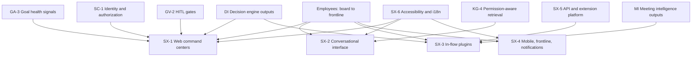
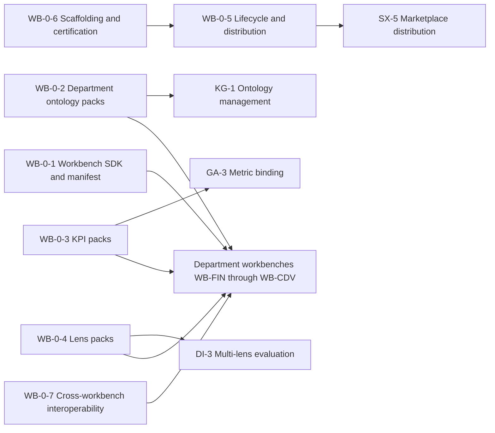
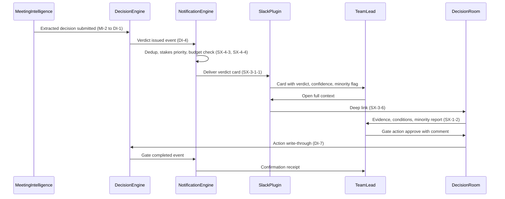
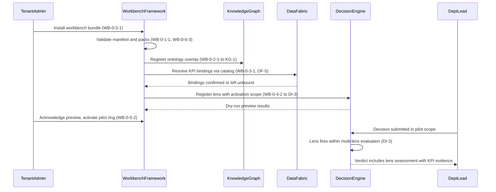

# SX and WB-0 feature catalog

## 1. Front matter

| Field | Value |
|---|---|
| Doc ID | CAT-SX-WB0 |
| Pillars covered | SX (Surfaces & Workflow Integration); WB-0 (Workbench framework) only — department workbenches excluded |
| Owning unit | U7 Catalog SX+WB-0 |
| Version | 1.0 |

## 2. Pillar overview & scope boundary

**SX — Surfaces & Workflow Integration.** SX is every place a human meets TrueNorth: web command centers, the conversational assistant, plugins inside chat/email/calendar/document tools, mobile and frontline surfaces, the public API and extension platform, and the accessibility and internationalization layer that makes all of the above usable by every employee from boardroom to factory floor. SX owns presentation, interaction, notification delivery, and developer-facing extension surfaces. It deliberately owns no judgment, no data ingestion, and no knowledge persistence: SX renders what other pillars produce, captures human input faithfully, and routes it to the owning pillar. The value of SX is adoption — a recommendation that is never seen, or seen too late, or seen in a surface the user does not inhabit, creates no decision value.

**WB-0 — Workbench framework.** WB-0 is the build platform on which every department workbench (WB-FIN, WB-HR, WB-OPS, WB-GTM, WB-ENG, WB-LGL, WB-CS, WB-CDV) is constructed. It comprises the workbench SDK and manifest model, department ontology packs (typed extensions over the core knowledge graph), KPI packs (metric definitions, bindings, and benchmarks), lens packs (department-specific judge configurations contributed to the evaluation engine), plus lifecycle, certification, and cross-workbench interoperability machinery. WB-0 specifies *how* a workbench is declared, validated, installed, upgraded, and certified — never *what* any specific department workbench contains. The value of WB-0 is consistency and leverage: eight first-party workbenches and any number of tenant- or partner-built ones share one contract, one quality bar, and one upgrade path.

**NOT in this pillar (SX):**

- Decision capture schema, options, criteria, and stakes assignment — DI-1.
- Verdict computation, reasoning, confidence, conditions, and minority reports — DI-4 and DI-5.
- Stakes-tiered review gates and sign-off policy — DI-7 and GV-2 (SX renders gates; it does not define them).
- Meeting capture, transcription, and decision extraction — MI-1 and MI-2; pre-meeting brief content — MI-4.
- Permission-aware retrieval and graph queries behind search and chat — KG-4.
- Authentication, SSO/SCIM, RBAC+ABAC enforcement — SC-1; prompt-injection and output-exfiltration defense — SC-3.
- LLM routing, agent orchestration, and conversation model serving — PL-1 and PL-3.
- Recording consent, retention, and off-the-record zones — MI-6.
- Usage analytics computation and adoption scoring — AD-3 (SX emits telemetry; AD-3 owns analysis).

**NOT in this L2 (WB-0):**

- All department-specific feature trees, KPIs, ontologies, and lenses — WB-FIN, WB-HR, WB-OPS, WB-GTM, WB-ENG, WB-LGL, WB-CS, WB-CDV.
- Core ontology types and tenant schema versioning — KG-1 (ontology packs extend it; they do not redefine it).
- Lens execution and multi-lens verdict synthesis — DI-3 and DI-4 (lens packs configure judges; the engine runs them).
- Metric ingestion and live binding infrastructure — DF-1/DF-2 and GA-3 (KPI packs declare; data pillars deliver).
- Evaluation harness mechanics for judge calibration — PL-4.
- Marketplace listing, billing, and third-party distribution surface — SX-5 (WB-0 packages artifacts; SX-5 distributes them).

## 3. L2 index & capability map

| L2 ID | Name | Scope (per shared specification) |
|---|---|---|
| SX-1 | Web command centers | Role-aware exec/lead/IC views |
| SX-2 | Conversational interface | Org-aware assistant |
| SX-3 | In-flow plugins | Slack/Teams/Outlook/calendar |
| SX-4 | Mobile, frontline & notifications | Deskless/factory-floor surfaces, digests, interruption budgets |
| SX-5 | API & extension platform | APIs, webhooks, marketplace |
| SX-6 | Accessibility & internationalization | Conformance, localization, inclusive interaction |
| WB-0 | Workbench framework | SDK, department ontology packs, KPI packs, lens packs |

## 4. Feature trees (per L2 group)

### SX-1 Web command centers

Role-aware web views that give executives, leads, and individual contributors a single command center over decisions, goals, commitments, and signals relevant to their scope.

#### SX-1-1 Role-aware home command center

- **User story:** As any employee, I want a home view assembled for my role, scope, and open obligations, so that I see the decisions and signals that need me without configuring anything.
- **Description:** TrueNorth shall render an adaptive home page composed of widgets (decision queue, goal health, commitments, signal feed) whose selection, ordering, and default scope derive from the user's role, reporting position, and decision rights. The same framework serves a board member (S1/S2 portfolio view), a department lead (team decisions and goal drift), and an IC (assigned actions and decisions awaiting their input).

##### SX-1-1-1 Role profile resolution & adaptive layout

- **Behavior:** On session start, TrueNorth shall resolve the user's role archetype (exec / lead / IC / frontline) and scope from org-model data, select a layout template, and allow per-user overrides (pin, hide, reorder) that persist and never override permission boundaries.
- **Data touched:** Org-model attributes and decision rights (read, from KG-6); user layout preferences (read/write, SX-owned).
- **Model/AI involvement:** None for resolution; optional extractive ranking to order widgets by recent relevance.
- **UX surface:** SX-1.
- **Acceptance criteria:** A user with no prior configuration sees a populated home within one page load; changing org role updates the default layout within 24 hours; overrides survive re-login; no widget ever displays an item the user cannot open.

##### SX-1-1-2 Decision queue widget

- **Behavior:** TrueNorth shall list decisions awaiting the user's input — review, sign-off, condition acknowledgment, or outcome confirmation — sorted by stakes tier then deadline, with verdict, confidence, and stakes badge visible at a glance and one-click entry to the decision room (SX-1-2).
- **Data touched:** Decision records and gate states (read, from DI-1 and DI-7); read receipts (write, SX-owned).
- **Model/AI involvement:** None; ordering is rule-based on stakes and deadline.
- **UX surface:** SX-1; mirrored counts in SX-3 and SX-4.
- **Acceptance criteria:** Queue state matches gate state in DI-7 within 30 seconds; S1/S2 items are visually distinct; an emptied queue shows verified-empty state, not a loading stub.
- **L5 notes:** Failure mode — if gate state cannot be fetched, the widget shall show last-known state with a staleness timestamp rather than an empty queue, because a falsely empty queue silently blocks governance.

##### SX-1-1-3 Goal & commitment health strip

- **Behavior:** TrueNorth shall display a compact strip of the user's in-scope goals and commitments with health status, trend arrow, and drill-through; status values and inference come from goal-tracking, not from SX.
- **Data touched:** Goal/commitment health (read, from GA-3 and MI-3).
- **Model/AI involvement:** None in SX; health inference is upstream.
- **UX surface:** SX-1.
- **Acceptance criteria:** Strip reflects upstream status within 5 minutes; every status chip drills into the explorer (SX-1-3) pre-filtered to that goal.

##### SX-1-1-4 "What changed" signal feed

- **Behavior:** TrueNorth shall present a reverse-chronological feed of material changes in the user's scope — new verdicts, contested facts, forecast revisions, external signals — each entry carrying source attribution and a deep link; the feed is deduplicated against notifications already delivered via SX-4-3.
- **Data touched:** Event stream of graph and decision changes (read); per-user seen-state (write, SX-owned).
- **Model/AI involvement:** Extractive — one-line change summaries generated per entry, with citation to the underlying record.
- **UX surface:** SX-1.
- **Acceptance criteria:** Feed entries appear within 2 minutes of the underlying event; each entry's summary links to its evidence; muting a topic suppresses future entries for that topic only.

#### SX-1-2 Decision room workspace

- **User story:** As a decision owner or reviewer, I want a full-screen workspace for one decision record, so that I can examine the verdict, evidence, dissent, and conditions and act on my gate in one place.
- **Description:** TrueNorth shall provide the canonical reading-and-acting surface for a decision record: framing, options, criteria, the verdict with reasoning and confidence, conditions, the minority report, evidence citations, simulation outputs, deliberation history, and the user's available gate actions. The decision room is the reference rendering that all compact surfaces (cards in SX-3, mobile in SX-4, embeds in SX-5-3) summarize and deep-link into.

##### SX-1-2-1 Evidence & citation panel

- **Behavior:** TrueNorth shall render every evidence citation attached to the verdict as an inspectable item: source, as-of time, lineage link, and quality indicator; clicking opens the underlying artifact in context where the user is permitted, or an explicit permission notice where not.
- **Data touched:** Evidence bundles and citations (read, from DI-2); lineage references (read, from DF-5).
- **Model/AI involvement:** None; SX renders citations verbatim.
- **UX surface:** SX-1.
- **Acceptance criteria:** Zero citations render as plain unlinked text; permission-denied evidence shows an explicit redaction notice naming the policy class, never a broken link; as-of timestamps display in the viewer's locale (SX-6-4).

##### SX-1-2-2 Verdict & minority report presentation

- **Behavior:** TrueNorth shall present the verdict (Endorse / Endorse-with-conditions / Caution / Oppose), confidence, reasoning chain, and conditions in a fixed canonical arrangement, with the minority report always visible at equal typographic weight — never collapsed by default, never below the fold on desktop.
- **Data touched:** Recommendation payload (read, from DI-4 and DI-5).
- **Model/AI involvement:** None; presentation only. Plain-language re-rendering is delegated to SX-6-5.
- **UX surface:** SX-1; canonical layout contract reused by SX-3-1-1 and SX-4-1-1.
- **Acceptance criteria:** All four verdict values are distinguishable without color alone (SX-6-1); the minority report is reachable in one interaction or fewer; confidence is shown with its calibration framing as supplied by DI-6, not reformatted by SX.
- **L5 notes:** Edge case — when DI-4 returns a verdict with zero conditions, the conditions region collapses entirely rather than showing an empty heading; when confidence is withheld by the engine, SX shall display "confidence unavailable" rather than a default value.

##### SX-1-2-3 Deliberation & sign-off rail

- **Behavior:** TrueNorth shall provide a side rail for threaded comments, formal dissent registration, @-mentions, and the user's gate actions (approve, approve with comment, reject, escalate, request more evidence); gate actions are executed by review-workflow services, and the rail reflects gate state transitions live.
- **Data touched:** Deliberation threads (read/write, SX-owned content routed to the decision record); gate actions (write-through to DI-7).
- **Model/AI involvement:** Optional extractive thread summarization on demand.
- **UX surface:** SX-1; the same action set exposed in SX-3-1-4 with parity (SX-3-6).
- **Acceptance criteria:** A gate action confirmed in the rail is durable in DI-7 (no fire-and-forget); registered dissent is permanently attached and visible to all subsequent reviewers; concurrent reviewers see each other's actions within 10 seconds.

##### SX-1-2-4 Scenario & simulation view

- **Behavior:** TrueNorth shall render scenario comparisons and sensitivity outputs attached to the decision — option-by-option projections, ranges, and key drivers — as interactive read-only visualizations; "what would change my mind" thresholds from the engine are highlighted on the relevant axes.
- **Data touched:** Simulation result sets (read, from SF-2 and SF-3); calibration thresholds (read, from DI-6).
- **Model/AI involvement:** None in SX; simulation is upstream.
- **UX surface:** SX-1.
- **Acceptance criteria:** Charts degrade to accessible data tables (SX-6-2); every figure carries its forecast vintage; absence of simulation for a routine S4 decision renders no empty panel.

#### SX-1-3 Portfolio & drill-down explorer

- **User story:** As a leader, I want to navigate from an org-wide portfolio view down through departments, teams, goals, and individual decisions, so that I can locate concentrations of risk, drift, or stalled decisions.
- **Description:** TrueNorth shall provide a hierarchy explorer over the organization's decision and goal portfolio with cross-filtering (by stakes, verdict, status, time window, department) and cohort comparison (this quarter vs. last; team A vs. team B). All aggregates are computed over records the viewer is permitted to see, and aggregate counts shall not leak the existence of records the viewer cannot open beyond policy-approved rollup thresholds defined by GV-1.

##### SX-1-3-1 Hierarchy navigator

- **Behavior:** TrueNorth shall render the org tree (from the org model) with per-node decision and goal rollups, supporting expand/collapse, breadcrumb navigation, and pivot from org dimension to goal dimension at any node.
- **Data touched:** Org structure (read, from KG-6); decision/goal rollups (read).
- **Model/AI involvement:** None.
- **UX surface:** SX-1.
- **Acceptance criteria:** Navigating a 100,000-employee org tree keeps interaction under 2 seconds per expansion at p95; pivoting preserves active filters.

##### SX-1-3-2 Cross-filter & cohort comparison

- **Behavior:** TrueNorth shall support stacking filters across stakes, verdict, lens flags, and time, and rendering two cohorts side by side with deltas; any filtered view is shareable as a saved view (SX-1-4) carrying its filter definition, not its result snapshot.
- **Data touched:** Decision/goal indexes (read); saved filter definitions (write, SX-owned).
- **Model/AI involvement:** None.
- **UX surface:** SX-1.
- **Acceptance criteria:** Shared views re-evaluate against the recipient's permissions; cohort deltas label their computation window explicitly.

#### SX-1-4 Saved views, dashboard composer & sharing

- **User story:** As a lead, I want to compose and share custom dashboard views from approved widgets, so that my team has a shared operating picture without exporting data to outside tools.
- **Description:** TrueNorth shall offer a composer over a governed widget registry (decision queues, goal strips, KPI tiles from installed workbenches, signal feeds), with layout editing, scoping, and permission-aware sharing to people, teams, or roles. Workbench-contributed widgets register through WB-0-1-2 and are indistinguishable in composition mechanics from first-party widgets.

##### SX-1-4-1 Composer canvas & widget registry

- **Behavior:** TrueNorth shall provide drag-and-drop composition from a registry where every widget declares its data scope, refresh cadence, and minimum permission; widgets failing entitlement for the composing user are hidden, not disabled.
- **Data touched:** View definitions (write, SX-owned); widget registry (read).
- **Model/AI involvement:** None.
- **UX surface:** SX-1.
- **Acceptance criteria:** Composition is keyboard-operable end to end (SX-6-2); a view referencing a later-uninstalled workbench widget renders an explicit placeholder naming the missing pack, not a blank region.

##### SX-1-4-2 Permission-aware sharing & subscriptions

- **Behavior:** TrueNorth shall let view owners share by person/team/role and let recipients subscribe to scheduled snapshots delivered through the digest engine; every render re-evaluates the viewer's permissions so two recipients of one view may lawfully see different data.
- **Data touched:** Share grants and subscriptions (write, SX-owned); rendered content (read, permission-filtered).
- **Model/AI involvement:** None.
- **UX surface:** SX-1; delivery via SX-4-3.
- **Acceptance criteria:** Revoking a share stops scheduled deliveries before the next cycle; shared-view URLs are unguessable and authenticate via SC-1; no cached render is ever served across users.

#### SX-1-5 Universal search & command palette

- **User story:** As any user, I want one omnibox that finds decisions, goals, people, meetings, metrics, and documents and executes commands, so that navigation never requires memorizing the information architecture.
- **Description:** TrueNorth shall provide permission-aware universal search with typed-entity filtering, recents, and a command palette for navigation and safe actions (open, follow, snooze, start a question to the assistant). Retrieval ranking and permission trimming are performed by the semantic retrieval layer (KG-4); SX owns query UX, result presentation, and action invocation.

##### SX-1-5-1 Typed-entity search & filters

- **Behavior:** TrueNorth shall return grouped results by entity type with inline metadata (stakes, status, owner, as-of date), type-ahead under 200 ms perceived latency, and scoped operators (type:, owner:, after:, stakes:).
- **Data touched:** Search queries (transient); result sets (read via KG-4).
- **Model/AI involvement:** Retrieval ranking upstream in KG-4; none in SX beyond presentation.
- **UX surface:** SX-1; same engine backs SX-2 grounding result display and SX-3 plugin search.
- **Acceptance criteria:** Zero-result queries offer scope-widening suggestions; result snippets never reveal content from records the user cannot open.

##### SX-1-5-2 Command palette actions

- **Behavior:** TrueNorth shall expose a curated action vocabulary in the palette; actions with side effects show a confirm step, and actions gated by stakes or decision rights are visible but disabled with the gating reason stated.
- **Data touched:** Action invocations (write-through to owning pillars).
- **Model/AI involvement:** None.
- **UX surface:** SX-1.
- **Acceptance criteria:** Every palette action has a stable keyboard path; disabled actions name their gate (e.g., "requires S2 sign-off rights per GV-1").

#### SX-1-6 Briefing & presentation mode

- **User story:** As a meeting presenter, I want a clean projection mode for a decision room or dashboard, so that I can walk a leadership group through a recommendation without exposing my queue, notifications, or navigation chrome.
- **Description:** TrueNorth shall provide a presentation rendering of decision rooms and saved views — large type, suppressed chrome, paginated sections (context, options, verdict, minority report, conditions), presenter-controlled reveal — plus expiring read-only access links for attendees, generated under the sharing rules of SX-1-4-2 and logged to the audit trail (GV-3). Export to static formats is included, with every export watermarked with as-of time and viewer identity.

### SX-2 Conversational interface

An org-aware assistant that answers questions about the organization's goals, decisions, metrics, and history with citations, and that can drive decision workflows conversationally — across web, plugins, and mobile.

#### SX-2-1 Grounded org-aware Q&A

- **User story:** As any employee, I want to ask questions in natural language about goals, decisions, metrics, and history, so that I get cited, permission-correct answers without learning query tools.
- **Description:** TrueNorth shall answer natural-language questions by retrieving from the knowledge graph through the permission-aware retrieval layer (KG-4), generating answers via the model gateway (PL-1), and attaching citations for every material claim. The assistant answers only from organizational ground truth plus clearly labeled general knowledge; it never asserts uncited organizational facts.

##### SX-2-1-1 Retrieval grounding & citation rendering

- **Behavior:** TrueNorth shall ground each answer in retrieved evidence, render inline citation markers resolving to source cards (title, source system, as-of time, lineage link), and visibly separate "from your organization's records" content from general-knowledge content.
- **Data touched:** Retrieval results (read via KG-4); conversation transcripts (write, SX-owned, governed per SX-2-6).
- **Model/AI involvement:** Generative — answer synthesis over retrieved context via PL-1; retrieval is upstream.
- **UX surface:** SX-2 across SX-1, SX-3, SX-4 hosts.
- **Acceptance criteria:** Every organizational factual claim carries at least one citation; clicking a citation opens the source or an explicit permission notice; answers with no sufficient evidence say so rather than improvising.

##### SX-2-1-2 Permission & scope enforcement

- **Behavior:** TrueNorth shall enforce the asking user's permissions at retrieval time for every turn, and shall not let conversational phrasing widen scope; injection attempts via quoted content are handled by AI-security controls (SC-3) and surfaced to the user as a declined request with a stated reason.
- **Data touched:** Authorization context (read via SC-1); no SX-side permission state.
- **Model/AI involvement:** None in SX; enforcement is in KG-4/SC-1; SC-3 screens adversarial input.
- **UX surface:** SX-2.
- **Acceptance criteria:** A user asking about an unpermitted decision receives a uniform "not available to you" response that does not confirm or deny record existence beyond policy; red-team suites from SC-3 pass against the conversational path before each release.
- **L5 notes:** Failure mode — if the authorization service is unreachable, the assistant shall refuse organizational queries entirely (fail closed) while continuing to function for general assistance, and shall say why.

##### SX-2-1-3 Uncertainty, refusal & escalation behavior

- **Behavior:** TrueNorth shall express calibrated uncertainty ("the latest figure I can cite is from March 14"), refuse out-of-policy requests (red lines: no individual surveillance scoring), and offer escalation paths — open the decision room, ask a curator (KG-5), or route to a human owner — instead of dead-ending.
- **Data touched:** Confidence/freshness metadata on retrieved items (read).
- **Model/AI involvement:** Generative with templated refusal scaffolds; refusal policy is configuration from GV-6, not model discretion alone.
- **UX surface:** SX-2.
- **Acceptance criteria:** Refusals state the governing policy class; stale-data answers always disclose data age; every "I don't know" includes at least one concrete next step.

#### SX-2-2 Decision conversation skills

- **User story:** As a decision participant, I want to interrogate, challenge, and initiate decision records in conversation, so that the decision workflow meets me in dialogue instead of forms.
- **Description:** TrueNorth shall provide named conversational skills bound to decision workflows: explain a verdict, compare options, surface precedent, challenge the recommendation, and draft a new decision record. Skills invoke the owning pillar's services through governed tool calls orchestrated by PL-3; the assistant never computes verdicts itself.

##### SX-2-2-1 Verdict explanation & precedent skill

- **Behavior:** On request, TrueNorth shall walk through a verdict's reasoning, lens assessments, conditions, and minority report conversationally, and retrieve similar past decisions with outcomes (via DI-2) on follow-up, each cited.
- **Data touched:** Recommendation payloads and precedent sets (read, DI-4/DI-2).
- **Model/AI involvement:** Generative re-narration constrained to the engine's stated reasoning; no new judgments introduced.
- **UX surface:** SX-2 from within SX-1-2 and SX-3-1.
- **Acceptance criteria:** Re-narration introduces no claims absent from the recommendation payload (verified by the evaluation harness PL-4); precedent answers cite decision IDs and realized outcomes.

##### SX-2-2-2 Challenge & "what would change my mind" skill

- **Behavior:** TrueNorth shall accept a user's counter-argument, route it to devil's-advocate processing (DI-5), and report back whether and how it affects the recommendation; the user can request the engine's own sensitivity thresholds (DI-6) in plain terms.
- **Data touched:** Challenge submissions (write-through to DI-5); sensitivity outputs (read, DI-6).
- **Model/AI involvement:** Generative framing of the user's challenge into structured form; judgment remains in DI.
- **UX surface:** SX-2.
- **Acceptance criteria:** Every submitted challenge is durably attached to the decision record; the user is notified of the engine's disposition (accepted, rebutted, verdict revised) through SX-4-3.

##### SX-2-2-3 Decision drafting skill

- **Behavior:** TrueNorth shall interview the user to draft a structured decision record — context, options, criteria, assumptions, proposed stakes tier — and submit the draft to decision capture (DI-1) for canonical structuring; the assistant proposes, the user confirms each field before submission.
- **Data touched:** Draft decision content (transient in SX; persisted by DI-1 on submit).
- **Model/AI involvement:** Generative structuring of free-form input into the DI-1 schema.
- **UX surface:** SX-2; also reachable from SX-3-1-2.
- **Acceptance criteria:** Nothing persists to the decision graph without explicit user confirmation of the full draft; stakes tier is always confirmed by the human, consistent with the human-decides invariant.

#### SX-2-3 Session context & cross-surface continuity

- **User story:** As a user moving between Slack, web, and mobile, I want the assistant to retain the thread of my work session, so that I never re-establish context after switching surfaces.
- **Description:** TrueNorth shall maintain per-user conversational session state — active decision, pinned entities, recent answers — synchronized across surfaces, with explicit user controls to pin, clear, or fork context. Session memory is user-scoped working state, distinct from the organizational knowledge graph; it is never used to widen retrieval permissions and is retained per the conversation-governance policy (SX-2-6).

#### SX-2-4 Proactive assistant prompts

- **User story:** As a decision owner, I want the assistant to proactively surface time-critical items in conversation — a gate I am blocking, an assumption that just broke — so that I act before deadlines pass.
- **Description:** TrueNorth shall allow the assistant to initiate messages only for event classes the user has subscribed to, with all proactive volume charged against the user's interruption budget (SX-4-4) and routed through the notification engine's deduplication (SX-4-3) so the same event never arrives as both a notification and an assistant message. Each proactive prompt carries its trigger ("because assumption A3 on decision D-1182 was invalidated") and a one-tap mute for its class.

#### SX-2-5 Voice interaction mode

- **User story:** As a mobile or frontline user, I want to talk to the assistant hands-free, so that I can get briefings and answer simple prompts while driving, walking a floor, or wearing PPE.
- **Description:** TrueNorth shall support push-to-talk and continuous-dictation voice input with spoken responses, optimized for briefing playback (SX-4-1-2) and short confirmations. Voice in shared physical spaces follows recording-governance policy (MI-6); voice commands that trigger gate actions require an explicit spoken-plus-visual confirm at stakes S3 and above, and are unavailable by policy default for S1/S2 (configurable downward only by GV-1 administrators).

#### SX-2-6 Conversation transparency, logging & feedback

- **User story:** As a compliance officer and as an end user, I want conversations clearly disclosed as AI, logged appropriately, and rateable, so that the assistant is auditable and improvable without becoming covert surveillance.
- **Description:** TrueNorth shall disclose assistant identity in every surface ("TrueNorth assistant — AI-generated, verify citations"), log conversations to the audit trail (GV-3) under retention policies set by governance, exclude conversation logs from any individual performance scoring (red line), and capture per-answer feedback (helpful / wrong / missing context) routed to the evaluation harness (PL-4) and curation queues (KG-5). Users can view their own conversation history and request deletion subject to legal-hold rules owned by GV-5.

### SX-3 In-flow plugins

TrueNorth embedded in the tools where work already happens — Slack, Teams, Outlook, Gmail, calendar, and document editors — so that decision intelligence reaches people without a context switch.

#### SX-3-1 Slack & Teams apps

- **User story:** As a team member who lives in chat, I want TrueNorth's verdicts, briefs, and actions inside Slack/Teams, so that decision work happens where my team already coordinates.
- **Description:** TrueNorth shall ship first-party Slack and Microsoft Teams applications with feature parity across both: link unfurling into verdict cards, slash commands, channel subscriptions, decision threads, and in-chat gate actions. The chat apps are renderers and action routers; all state lives in the owning pillars.

##### SX-3-1-1 Link unfurls & verdict cards

- **Behavior:** When a TrueNorth decision or goal link is posted in a permitted channel, TrueNorth shall unfurl a compact card — title, stakes badge, verdict, confidence, minority-report indicator, deep link — rendered per-viewer where the platform allows, and falling back to a minimal "open in TrueNorth" card in channels with mixed permissions.
- **Data touched:** Decision summary payloads (read); unfurl events (telemetry to AD-3).
- **Model/AI involvement:** None.
- **UX surface:** SX-3, layout contract inherited from SX-1-2-2.
- **Acceptance criteria:** Cards never expose verdict content to channel members lacking record access; unfurl latency p95 under 1.5 seconds; card and decision room never disagree on verdict value.
- **L5 notes:** Edge case — public/shared channels with external guests always receive the minimal card regardless of individual permissions.

##### SX-3-1-2 Slash commands & message actions

- **Behavior:** TrueNorth shall provide commands (/truenorth find, /truenorth decide, /truenorth brief) and message-context actions ("capture as commitment", "attach to decision") that open modal flows pre-filled from the message content; commitment extraction semantics belong to MI-2 — the plugin captures candidate text and routes it.
- **Data touched:** Command payloads (transient); captured candidates (write-through to MI-2/DI-1).
- **Model/AI involvement:** Extractive pre-fill of modal fields from message text.
- **UX surface:** SX-3.
- **Acceptance criteria:** Every modal submission confirms what was created with a deep link; commands degrade gracefully with a stated reason when the user lacks rights.

##### SX-3-1-3 Channel subscriptions & decision threads

- **Behavior:** TrueNorth shall let channel owners subscribe a channel to a decision, goal, team, or topic scope; subscribed events post as threaded updates (one thread per decision) so chat history preserves decision narrative without flooding the channel.
- **Data touched:** Subscription configs (write, SX-owned); event payloads (read).
- **Model/AI involvement:** Extractive one-line update summaries.
- **UX surface:** SX-3; volume governed by SX-4-4 channel-level budgets.
- **Acceptance criteria:** Unsubscribing stops posts before the next event; thread updates link to the decision room; per-channel daily post caps are enforced and visible to the channel owner.

##### SX-3-1-4 In-chat gate actions

- **Behavior:** TrueNorth shall allow permitted reviewers to execute gate actions from the card (approve, request changes, escalate) for stakes S3/S4; S1/S2 actions deep-link to the decision room where fuller context is mandatory, per stakes-tiered control policy (GV-2).
- **Data touched:** Gate actions (write-through to DI-7); action receipts (read).
- **Model/AI involvement:** None.
- **UX surface:** SX-3; parity contract SX-3-6.
- **Acceptance criteria:** Chat-originated actions are indistinguishable in the audit trail (GV-3) from web-originated ones except for surface attribution; double-submission is idempotent; an action on a stale card (verdict since revised) is rejected with a refresh prompt.

#### SX-3-2 Email add-ins (Outlook & Gmail)

- **User story:** As an email-centric manager, I want TrueNorth context beside my email threads, so that commitments and decisions discussed over email enter the system without copy-paste.
- **Description:** TrueNorth shall provide Outlook and Gmail add-ins showing a context panel for the open thread — related decisions, goals, prior commitments involving these participants — and offering capture actions that route candidate commitments and decision triggers to the owning pillars (MI-2, DI-1). The add-in reads the open thread only on explicit user invocation; it shall not scan mailboxes in the background (no covert monitoring).

##### SX-3-2-1 Thread context panel

- **Behavior:** On user invocation, TrueNorth shall resolve thread participants and subject entities against the graph and display related records the user is permitted to see, ranked by recency and relevance.
- **Data touched:** Open-thread metadata and selected text (transient, user-invoked); graph lookups (read via KG-4).
- **Model/AI involvement:** Extractive entity resolution on invoked content.
- **UX surface:** SX-3.
- **Acceptance criteria:** No network call containing thread content occurs before invocation; panel honors residency routing (DF-6) for content processing; empty-context states suggest a search instead of showing nothing.

##### SX-3-2-2 Commitment & decision capture from email

- **Behavior:** TrueNorth shall let the user select thread text and capture it as a commitment candidate or decision trigger, pre-filling owner/date suggestions for human confirmation before anything persists.
- **Data touched:** Selected text and confirmed captures (write-through to MI-2/DI-1).
- **Model/AI involvement:** Extractive — owner/deadline suggestion from selected text.
- **UX surface:** SX-3.
- **Acceptance criteria:** Persisted captures store provenance (thread ID, capturer, timestamp); suggestions are editable and never auto-committed.

#### SX-3-3 Calendar surfaces

- **User story:** As a meeting participant, I want TrueNorth briefs and follow-ups attached to calendar events, so that preparation and follow-through travel with the meeting itself.
- **Description:** TrueNorth shall attach pre-meeting brief links (content from MI-4) to calendar events it is authorized to annotate, surface agenda-quality and required-data flags as event sidecars, and post post-meeting outputs (summaries and extracted decisions from MI-2/MI-3) back to the event thread. Calendar write access is tenant-configurable and off by default; consent and recording posture indicators come from MI-6 and are displayed, not computed, by SX.

#### SX-3-4 Document companion panels

- **User story:** As an author of a proposal in Google Docs, Word, or Confluence, I want a TrueNorth side panel while I write, so that I can pull cited facts, check strategy alignment, and spawn a decision record from the document.
- **Description:** TrueNorth shall provide editor companions exposing assistant Q&A (SX-2) scoped to the document's subject, one-click insertion of cited facts and KPI snapshots (each insertion carrying a live-reference token with as-of time), an alignment check that submits the document's stated intent for scoring against the strategy graph (GA-4), and "create decision record from this doc" which routes structured content to DI-1. Inserted citations remain inspectable by downstream readers of the document where the host platform supports smart chips, and degrade to plain text plus link elsewhere.

#### SX-3-5 Embedded panels in systems of record

- **User story:** As a CRM or Jira user, I want TrueNorth context panels inside the record I am viewing, so that decision intelligence appears next to the operational object it concerns.
- **Description:** TrueNorth shall offer embeddable context panels for common systems of record (CRM opportunity, Jira epic, ServiceNow change, ERP purchase order), built on the embeddable component framework (SX-5-3) and mapped to graph entities via the connector identity mappings owned by DF-1. Each panel shows linked decisions, relevant verdicts, goal alignment, and a capture action. Panels authenticate the host user through SC-1 federation; an unmapped record shows a "link this record" affordance rather than guessing.

#### SX-3-6 Deep-link fabric & action parity

- **User story:** As a user on any surface, I want every TrueNorth object to have one canonical link and every compact surface to offer a predictable action subset, so that switching surfaces never strands me or silently changes what I am allowed to do.
- **Description:** TrueNorth shall define canonical, stable, permission-checked deep links for every addressable object (decision, goal, meeting, view, conversation) with graceful fallbacks (app → web → mobile web), and shall maintain a published action-parity matrix declaring which actions exist on which surfaces at which stakes tiers. The parity matrix is a governed artifact: a surface may offer fewer actions than the decision room, never more, and never weaker confirmation steps than GV-2 requires for the tier.

### SX-4 Mobile, frontline & notifications

Surfaces and delivery for people away from desks — executives between meetings, plant supervisors on the floor, field staff — plus the notification, digest, and interruption-budget machinery that governs all outbound contact across every surface.

#### SX-4-1 Mobile companion app

- **User story:** As a traveling executive or moving manager, I want a phone app for my queue, briefs, and approvals, so that decisions do not wait for my laptop.
- **Description:** TrueNorth shall ship iOS and Android apps centered on the decision queue, briefing consumption, the assistant, and stakes-appropriate approvals — a companion optimized for triage and review, not full authoring.

##### SX-4-1-1 Mobile decision queue & approvals

- **Behavior:** TrueNorth shall render the queue (SX-1-1-2 contract) with swipe triage, full verdict cards including the minority report, and gate actions for S3/S4; S1/S2 review on mobile requires the full mobile decision-room view with mandatory evidence scroll-through before the action enables, per GV-2 tier policy.
- **Data touched:** Queue and recommendation payloads (read); gate actions (write-through to DI-7).
- **Model/AI involvement:** None.
- **UX surface:** SX-4.
- **Acceptance criteria:** Action set never exceeds the parity matrix (SX-3-6); approvals captured offline queue locally and sync with server-side conflict detection (SX-4-5); minority report is never truncated out of the mobile card.

##### SX-4-1-2 Briefing reader & audio briefings

- **Behavior:** TrueNorth shall present daily/pre-meeting briefs in a swipeable reader with an audio mode (synthesized narration) for commutes; audio renditions disclose AI narration and include section markers for skip navigation.
- **Data touched:** Brief content (read, from MI-4 and digest assembly SX-4-3-2); playback position (write, SX-owned).
- **Model/AI involvement:** Generative text-to-speech rendering via PL-1; content is upstream.
- **UX surface:** SX-4; audio also exposed via SX-2-5.
- **Acceptance criteria:** Briefs are readable offline once fetched; audio matches text content exactly (no improvised narration); playback resumes across devices.

##### SX-4-1-3 Device security posture

- **Behavior:** TrueNorth shall require biometric or PIN re-authentication per tenant policy, support remote session revocation and MDM/MAM integration, and watermark screenshots of S1/S2 content where the OS permits; identity and policy enforcement are owned by SC-1/SC-2, surfaced here.
- **Data touched:** Session tokens, device posture attestations (read/write via SC-1).
- **Model/AI involvement:** None.
- **UX surface:** SX-4.
- **Acceptance criteria:** A revoked session terminates within 60 seconds; jailbreak/root detection downgrades the app to notification-only mode with a stated reason.

#### SX-4-2 Frontline & shared-device mode

- **User story:** As a factory-floor supervisor without a personal workstation, I want TrueNorth on shared terminals and team boards in glanceable form, so that frontline teams see goals, decisions affecting them, and their input requests without desks or email.
- **Description:** TrueNorth shall provide a frontline mode: large-type glanceable layouts, badge/QR fast login with aggressive auto-logout on shared kiosks, a read-mostly team board (shift goals, decisions affecting this line, open input requests), and simple structured input (acknowledge, flag concern, answer a posed question). Frontline mode shall never display individual performance comparisons (red line) and follows works-council display constraints configured through GV-1.

##### SX-4-2-1 Kiosk & shared-terminal sessions

- **Behavior:** TrueNorth shall support kiosk enrollment by location/line, per-interaction badge authentication for any personalized or write action, automatic session clearing after configurable idle (default 30 seconds), and a no-auth ambient mode showing only team-level, non-personal content.
- **Data touched:** Kiosk registrations (write, SX-owned); badge auth events (via SC-1).
- **Model/AI involvement:** None.
- **UX surface:** SX-4.
- **Acceptance criteria:** No personal data is visible in ambient mode; abandoning a session mid-action discards the action; kiosk content honors site residency rules (DF-6).

##### SX-4-2-2 Glanceable team boards

- **Behavior:** TrueNorth shall render wall-display boards — shift goal health, decisions pending team input, safety/quality signals routed from the operations domain — legible at 5 meters, auto-rotating at a configurable cadence, with a QR deep link per panel for follow-up on mobile.
- **Data touched:** Team-scoped goal/decision summaries (read).
- **Model/AI involvement:** Extractive headline summarization sized to display constraints.
- **UX surface:** SX-4.
- **Acceptance criteria:** Boards function on commodity HDMI sticks at 1080p; content updates within 5 minutes of upstream change; a board never names an individual in a negative context.

#### SX-4-3 Notification routing & digest engine

- **User story:** As any user, I want one engine deciding what reaches me, where, and when, so that I trust TrueNorth's pings instead of muting them.
- **Description:** TrueNorth shall operate a single outbound-contact engine for all pillars: every notification-worthy event from any pillar is submitted here, then deduplicated, prioritized by stakes and deadline, batched or delivered immediately per class, and routed to the best channel (push, chat, email, in-app, digest). No pillar or workbench may contact users outside this engine — this is the architectural choke point that makes interruption budgets (SX-4-4) enforceable.

##### SX-4-3-1 Channel selection & deduplication

- **Behavior:** TrueNorth shall select delivery channels using user preference, presence signals, event class, and stakes (S1 escalations may override channel preferences per SX-4-6); identical or superseding events collapse into a single updated delivery rather than repeat pings.
- **Data touched:** Event submissions from all pillars (read); delivery records and receipts (write, SX-owned); preference data (read).
- **Model/AI involvement:** None for routing decisions (deterministic, auditable rules); optional extractive compression of event text per channel size limits.
- **UX surface:** SX-4 governing deliveries into SX-1, SX-2, SX-3.
- **Acceptance criteria:** The same logical event never reaches one user twice across channels within its dedup window; routing decisions are reconstructable in the audit trail (GV-3); a superseded notification (verdict revised) visibly updates rather than appending.

##### SX-4-3-2 Daily & weekly digests

- **Behavior:** TrueNorth shall assemble per-user digests — what changed in my scope, what awaits me, what resolved and how — at user-chosen times, composed from events that were below immediate-delivery priority; digest assembly orders items by stakes and personal relevance.
- **Data touched:** Undelivered low-priority event backlog (read); digest renders (write, ephemeral).
- **Model/AI involvement:** Generative — narrative digest composition with every item linked to its source record.
- **UX surface:** SX-4; readable in email, mobile (SX-4-1-2), and web.
- **Acceptance criteria:** Every digest line deep-links to its record; items already seen interactively are marked, not repeated as new; an empty digest is suppressed, not sent hollow.

##### SX-4-3-3 Subscription & preference center

- **Behavior:** TrueNorth shall provide one preference center covering all surfaces: per-event-class channel and urgency settings, per-entity follows/mutes, quiet hours, digest timing, and delegation of notifications during absence (delegation respects permissions — content the delegate cannot see routes as "an item awaits the absent owner" only).
- **Data touched:** Preference and delegation records (write, SX-owned).
- **Model/AI involvement:** None.
- **UX surface:** SX-4, embedded in SX-1 settings.
- **Acceptance criteria:** Preference changes apply to the next event, no redeploy or cache lag beyond 60 seconds; mandatory governance classes (e.g., S1 gates assigned to the user) are visibly non-mutable with the policy source cited.

#### SX-4-4 Interruption budgets & quiet hours

- **User story:** As a user and as a tenant administrator, I want hard caps on how often TrueNorth may interrupt people, so that attention is treated as a governed resource and alert fatigue never erodes trust.
- **Description:** TrueNorth shall enforce per-user interruption budgets — a configurable maximum of immediate (non-digest) contacts per day per channel, with tenant defaults and user tightening — plus quiet hours honoring the user's local timezone and working pattern. Events exceeding budget defer to the next digest unless they carry an S1/S2 urgent override (SX-4-6), and every override is logged with its policy justification. Budget consumption is visible to the user ("3 of 6 interruptions used today"), and chronic budget exhaustion by one event class is flagged to AD-3 as a tuning signal.

#### SX-4-5 Offline & degraded-connectivity behavior

- **User story:** As a field or factory user with unreliable connectivity, I want the app to keep working on cached content and queue my actions, so that connectivity gaps do not stall decisions.
- **Description:** TrueNorth shall cache the user's queue, open decision rooms, and recent briefs for offline reading; capture actions (approvals, comments, acknowledgments) into a durable local outbox; and reconcile on reconnect with server-side conflict detection — if the decision changed materially while offline (new verdict version, gate reassigned), the queued action is held and the user is asked to reconfirm against current state rather than applying a stale action. All cached content is encrypted at rest per SC-2 and purged on session revocation.

#### SX-4-6 Urgent escalation delivery & acknowledgment

- **User story:** As an executive on-call for S1 matters, I want urgent items delivered through escalating channels until acknowledged, so that existential-stakes decisions never sit unseen in a muted app.
- **Description:** TrueNorth shall implement an escalation ladder for events flagged urgent by review workflows (DI-7) or crisis paths: in-app and push first, then chat DM, then SMS/voice call, with configurable inter-step delays; acknowledgment at any step halts the ladder and is recorded with timestamp and channel. Unacknowledged expiry routes to the designated alternate from the org model (KG-6) and is reported to the initiating workflow. Escalation ladders are the only mechanism permitted to pierce quiet hours and interruption budgets, are restricted to S1/S2 classes defined in GV-1 policy, and every pierce is audit-logged (GV-3).

### SX-5 API & extension platform

The programmable surface of TrueNorth: public APIs, webhooks, embeddable components, a governed third-party app framework, a marketplace, and the developer experience around them.

#### SX-5-1 Public API (REST & GraphQL)

- **User story:** As an enterprise developer, I want stable, documented APIs over decisions, goals, and recommendations, so that I can integrate TrueNorth with internal systems the connector library does not cover.
- **Description:** TrueNorth shall expose a public API — REST for resource operations, GraphQL for graph-shaped reads — covering decision records, recommendations, goals, commitments, search, and notification submission. Every call executes under a token whose permissions are derived from SC-1 (user-delegated or service principal); the API can never see more than its principal.

##### SX-5-1-1 Read APIs for decisions & recommendations

- **Behavior:** TrueNorth shall serve decision records, verdict payloads (including conditions and minority reports), evidence citation references, goal/commitment objects, and as-of historical reads delegated to the temporal layer (KG-3); list endpoints support filtering by stakes, status, verdict, and time window with cursor pagination.
- **Data touched:** Permission-filtered reads across decision and graph stores.
- **Model/AI involvement:** None.
- **UX surface:** SX-5; consumed by SX-3-5 and external systems.
- **Acceptance criteria:** Response schemas are versioned and validated; a recommendation payload retrieved via API is field-identical to the decision-room rendering source; rate-limit headers are present on every response.

##### SX-5-1-2 Write & action APIs

- **Behavior:** TrueNorth shall accept decision-record drafts (routed to DI-1), evidence attachments, commitment updates, and gate actions where the principal holds the right; write APIs enforce the same stakes-tier confirmation semantics as interactive surfaces — S1/S2 gate actions are not executable by pure service principals, preserving the human-decides invariant.
- **Data touched:** Write-throughs to DI-1, DI-7, MI-3 owners; idempotency key store (write, SX-owned).
- **Model/AI involvement:** None.
- **UX surface:** SX-5.
- **Acceptance criteria:** All writes are idempotent under client retry; rejected writes return machine-readable policy reasons; no API path can create or approve a decision without an attributable human principal at S2 and above.

#### SX-5-2 Webhooks & event subscriptions

- **User story:** As an integrator, I want signed event deliveries when decisions, verdicts, or goals change, so that downstream systems react without polling.
- **Description:** TrueNorth shall provide webhook subscriptions on a governed event taxonomy (decision created, verdict issued, verdict revised, gate actioned, goal status changed, commitment overdue), with per-subscription scoping no broader than the owning principal's permissions, HMAC-signed payloads, ordered delivery per entity, at-least-once semantics with exponential retry and a dead-letter view, and replay of up to 7 days of missed events. Payloads carry references plus minimal summary fields; consumers fetch full records via SX-5-1 so permission evaluation always happens at fetch time.

#### SX-5-3 Embeddable UI components

- **User story:** As an internal-tools developer, I want certified embeddable TrueNorth components — verdict card, decision timeline, goal health tile, assistant panel — so that I can put governed decision UI inside our portals without rebuilding it.
- **Description:** TrueNorth shall publish a library of embeddable components (web components and sandboxed iframe variants) that render permission-correct, fully accessible (SX-6) TrueNorth UI inside third-party hosts, authenticating the end user via SC-1 token exchange. Embeds are render-complete: hosts cannot restyle verdict semantics (e.g., recolor Oppose), suppress the minority-report indicator, or strip AI-disclosure labels — these are contractual invariants enforced by the component, and embeds carry the same audit attribution as first-party surfaces. This is the substrate for SX-3-5 panels.

#### SX-5-4 App framework, manifests & scopes

- **User story:** As a partner or tenant developer, I want a declared, sandboxed app model with explicit scopes, so that extensions are powerful for users and legible to security reviewers.
- **Description:** TrueNorth shall define a third-party app framework: a signed manifest declaring identity, requested scopes, surfaces extended, data egress endpoints, and residency posture; runtime enforcement of those declarations; and an installation consent flow for tenant admins showing exactly what the app may read, write, and where data may flow.

##### SX-5-4-1 Manifest & scope model

- **Behavior:** TrueNorth shall validate manifests against a published schema; scopes are fine-grained (e.g., decisions:read:S3-S4, goals:read, notifications:submit) and deny-by-default; requesting surveillance-adjacent scopes that violate red lines is rejected at validation, not at review.
- **Data touched:** App registrations and grants (write, SX-owned); enforcement decisions (logged to GV-3).
- **Model/AI involvement:** None.
- **UX surface:** SX-5.
- **Acceptance criteria:** An app calling outside its granted scopes receives a uniform denial and the violation is logged; scope grants are revocable per-tenant with effect within 60 seconds.

##### SX-5-4-2 Sandboxed execution & data boundaries

- **Behavior:** TrueNorth shall run app UI in sandboxed frames with a postMessage bridge limited to granted scopes, and app backends shall access data only via SX-5-1 tokens; apps shall not receive raw evidence content for records their installing tenant marks export-restricted (classification from SC-2), receiving references instead.
- **Data touched:** Bridged payloads (transient); egress logs (write, to SC-5 monitoring).
- **Model/AI involvement:** None.
- **UX surface:** SX-5.
- **Acceptance criteria:** Sandbox escape attempts in the certification suite all fail; export-restricted content never appears in app-bound payloads (verified by DLP test fixtures from SC-2).

##### SX-5-4-3 App review & certification

- **Behavior:** TrueNorth shall require listed apps to pass automated certification (scope/manifest conformance, accessibility of contributed UI per SX-6, abuse-pattern checks) plus human review for marketplace listing; tenant-private apps require automated certification only, with tenant-admin acceptance of residual risk recorded.
- **Data touched:** Certification results and review records (write, SX-owned).
- **Model/AI involvement:** Extractive static-analysis assistance in review tooling.
- **UX surface:** SX-5.
- **Acceptance criteria:** No app reaches the marketplace without a passing certification record; re-certification triggers on every manifest change touching scopes or egress.

#### SX-5-5 Marketplace & distribution

- **User story:** As a tenant administrator, I want a curated marketplace of certified apps, workbench packs, and connectors with clear provenance, so that I can extend TrueNorth without bespoke security review of every artifact.
- **Description:** TrueNorth shall operate a marketplace listing certified apps (SX-5-4), packaged workbench artifacts produced through WB-0-5, and partner extensions — with listing pages showing publisher identity, scopes, data-flow summary, residency compatibility, deployment-model compatibility (SaaS/VPC/on-prem/air-gapped availability flags), version history, and tenant-visible install counts. Air-gapped deployments consume the marketplace as a signed offline bundle feed. Tenant admins can restrict installation to an allowlist, require dual-admin approval, and pin versions; all install/uninstall events are audit-logged (GV-3).

#### SX-5-6 Developer portal, sandbox & SDKs

- **User story:** As a developer, I want documentation, a safe sandbox tenant with synthetic data, and client SDKs, so that I can build against TrueNorth without touching production decisions.
- **Description:** TrueNorth shall provide a developer portal with reference docs generated from API schemas, runnable examples, client SDKs (TypeScript, Python, Java at minimum), and self-service sandbox tenants seeded with a synthetic organization — fictional people, goals, decisions with verdicts and minority reports — so every API and surface behavior is exercisable without real data. Sandbox tenants enforce the same permission and red-line behavior as production so developers cannot build patterns that production will reject.

#### SX-5-7 API lifecycle: versioning, rate limits & deprecation

- **User story:** As a platform owner and as an integrator, I want explicit versioning, fair-use limits, and predictable deprecation, so that integrations stay reliable across TrueNorth releases.
- **Description:** TrueNorth shall version its public API with a minimum 18-month support window per major version, publish per-principal rate limits with burst allowances and 429 + Retry-After semantics, provide per-tenant usage dashboards (consumption data shared with AD-3), and run a deprecation pipeline — announcement, dual-running, per-tenant usage detection of deprecated calls with targeted warnings, and final shutoff only after usage falls below threshold or the window expires. Breaking changes outside a major version are prohibited; emergency security exceptions require GV-1-recorded approval.

### SX-6 Accessibility & internationalization

The conformance, localization, and inclusive-interaction layer applied across every SX surface and inherited by every workbench built on WB-0.

#### SX-6-1 Accessibility conformance program

- **User story:** As an accessibility lead and as a user with a disability, I want every TrueNorth surface conformant to WCAG 2.2 AA, so that decision participation never depends on ability.
- **Description:** TrueNorth shall maintain WCAG 2.2 AA conformance as a release gate across web, mobile, plugins, embeds, and workbench-contributed UI, with automated and manual assurance and published conformance reports.

##### SX-6-1-1 Component-level conformance & testing automation

- **Behavior:** TrueNorth shall enforce conformance at the design-system component level (the same kit consumed by WB-0-1-2), run automated accessibility checks in CI for every surface build, and block release on regressions; quarterly manual audits with assistive-technology users cover the top journeys (queue triage, decision-room review, gate action, assistant conversation).
- **Data touched:** Audit findings and conformance status (write, SX-owned program records).
- **Model/AI involvement:** None.
- **UX surface:** SX-6 across all SX L2s.
- **Acceptance criteria:** No component ships below AA; workbench certification (WB-0-6-3) fails on accessibility violations in contributed UI; keyboard-only completion of all top journeys is demonstrated each release.

##### SX-6-1-2 Conformance reporting (VPAT/ACR)

- **Behavior:** TrueNorth shall publish per-release Accessibility Conformance Reports for procurement, with known-issue registers and remediation dates.
- **Data touched:** Conformance documentation (write, SX-owned).
- **Model/AI involvement:** None.
- **UX surface:** SX-6.
- **Acceptance criteria:** ACR is available at most 30 days after each major release; every "partially supports" entry has a tracked remediation item.

#### SX-6-2 Assistive-technology-optimized decision flows

- **User story:** As a screen-reader user reviewing a recommendation, I want the verdict, confidence, conditions, evidence, and minority report exposed as structured, navigable semantics, so that I can review with the same rigor as a sighted colleague.
- **Description:** TrueNorth shall define semantic patterns for its decision-specific artifacts: verdicts announced with value, stakes, and confidence as structured text (never color or icon alone); minority report as a labeled landmark; evidence citations as a navigable list with source and as-of metadata; live gate-state changes announced via polite live regions; charts (including SX-1-2-4 simulation views) backed by equivalent data tables; and full keyboard operability with visible focus and skip patterns on dense screens. These patterns are mandatory in the component kit so plugins, mobile, embeds, and workbenches inherit them.

#### SX-6-3 Localization pipeline & language coverage

- **User story:** As a global-enterprise user, I want the interface and AI-generated content in my language, so that decision participation is not gated on English.
- **Description:** TrueNorth shall localize both the static interface and dynamic AI-generated content, with explicit quality tiers per language and visible machine-translation labeling where human review has not occurred.

##### SX-6-3-1 Interface localization infrastructure

- **Behavior:** TrueNorth shall externalize all strings (including workbench manifests via WB-0-1-1 string tables), support ICU pluralization/gender rules, ship a tier-1 language set (assumption: English, German, French, Spanish, Portuguese, Japanese, Mandarin) at full human-reviewed quality, and provide pseudo-localization builds to catch truncation and concatenation defects pre-release.
- **Data touched:** String catalogs and translation memories (write, SX-owned).
- **Model/AI involvement:** Generative machine translation drafts for human review in the translation workflow.
- **UX surface:** SX-6 across all surfaces.
- **Acceptance criteria:** No hardcoded user-facing strings in any certified surface or workbench; tier-1 languages reach 100% string coverage before a release ships to tenants with that language default.

##### SX-6-3-2 AI-content language policy

- **Behavior:** TrueNorth shall generate assistant answers, digests, and brief renderings in the user's preferred language regardless of source-evidence language, with citations remaining in source language plus on-demand translation labeled as machine translation; verdict terms (Endorse / Endorse-with-conditions / Caution / Oppose) use a single canonical translation per language from a governed terminology base so the verdict scale is never paraphrased inconsistently.
- **Data touched:** Terminology base (write, SX-owned); generation language preferences (read).
- **Model/AI involvement:** Generative multilingual output via PL-1; translation quality sampling routed to PL-4 evaluation.
- **UX surface:** SX-6 across SX-2, SX-4.
- **Acceptance criteria:** Verdict terminology renders only from the terminology base; translated evidence is always labeled with its source language and translation provenance; cross-language citation links resolve to original sources.

#### SX-6-4 Locale formatting & RTL support

- **User story:** As a user in any locale, I want dates, numbers, currencies, units, calendars, and text direction rendered correctly, so that quantitative decision content is never misread.
- **Description:** TrueNorth shall apply locale-correct formatting to every rendered value — dates with timezone disclosure on decision deadlines, currency with explicit ISO code on all financial figures (a misread currency on a verdict is a decision-integrity defect, not cosmetic), unit conversion display preferences, and full right-to-left mirroring for RTL languages including chart axes and the decision-room layout. Locale derives from user preference with tenant default fallback, never from IP geolocation alone.

#### SX-6-5 Plain-language & reading-level controls

- **User story:** As an entry-level employee or non-native speaker, I want a plain-language rendering of recommendations and briefs, so that I can understand and act on decision content without specialized vocabulary.
- **Description:** TrueNorth shall offer an on-demand plain-language mode that re-renders verdict reasoning, conditions, and briefs at a target reading level, expands organizational jargon from a tenant glossary, and always co-presents the canonical text on demand — the plain-language rendering is a labeled derived view, never a replacement of record, and material omissions relative to the canonical text are treated as generation defects measured by the evaluation harness (PL-4). Glossary content is curated through KG-5; explanation fidelity requirements align with GV-4.

### WB-0 Workbench framework

The SDK, pack model (ontology, KPI, lens), lifecycle, certification, and interoperability machinery on which all department workbenches are built; this L2 specifies the framework only — no department content.

#### WB-0-1 Workbench SDK & manifest

- **User story:** As a workbench builder (first-party team, partner, or tenant developer), I want a declarative SDK and manifest model, so that I can assemble a department workbench from governed primitives instead of bespoke UI and plumbing.
- **Description:** TrueNorth shall provide the workbench SDK: a signed manifest that declares everything a workbench is (identity, packs included, surfaces contributed, scopes required, residency and deployment-model compatibility), a UI component kit for building workbench views inside SX surfaces, server-side extension points for domain logic, and a compatibility model that keeps installed workbenches working across platform releases. A workbench is data plus configuration plus declared extensions — never a fork of the platform.

##### WB-0-1-1 Workbench manifest schema

- **Behavior:** TrueNorth shall validate every workbench against a versioned manifest schema declaring: workbench identity and publisher; included ontology packs (WB-0-2), KPI packs (WB-0-3), and lens packs (WB-0-4); contributed views, widgets (for SX-1-4-1), and assistant skills; required scopes using the SX-5-4-1 scope vocabulary; localized string tables (SX-6-3-1); and deployment/residency compatibility flags. Manifest validation is the first certification gate.
- **Data touched:** Manifest documents and validation results (write, WB-0-owned registry).
- **Model/AI involvement:** None.
- **UX surface:** Developer tooling per SX-5-6; admin review per SX-5.
- **Acceptance criteria:** A manifest omitting any required declaration fails validation with a precise error; undeclared capabilities are unreachable at runtime (enforcement, not convention); manifests are content-signed and tamper-evident.

##### WB-0-1-2 UI component kit & layout primitives

- **Behavior:** TrueNorth shall supply the workbench UI kit — the same accessibility-certified components used by first-party surfaces (per SX-6-1-1): KPI tiles, decision lists, verdict cards, goal strips, entity tables, drill-down panels, and layout templates for workbench home, entity detail, and review screens. Workbenches compose these primitives; custom visual components are permitted only inside sandboxed regions and are flagged for extra certification scrutiny (WB-0-6-3).
- **Data touched:** None directly; components bind to data through declared queries.
- **Model/AI involvement:** None.
- **UX surface:** Rendered within SX-1, SX-3, SX-4 host surfaces.
- **Acceptance criteria:** A workbench built only from kit components passes accessibility certification automatically at the component level; verdict-semantics invariants (canonical verdict rendering, minority-report visibility per SX-1-2-2) cannot be overridden by workbench layout choices.
- **L5 notes:** Edge case — kit version skew: a workbench pinned to kit v(N-1) renders correctly on platform vN for the full compatibility window declared in WB-0-1-4; visual drift is acceptable, behavioral or accessibility drift is not.

##### WB-0-1-3 Server-side extension points & data scopes

- **Behavior:** TrueNorth shall expose declared server-side extension points for workbench domain logic: computed-field definitions over graph entities, domain validation rules on decision capture (e.g., a department-specific required criterion, enforced through DI-1's extension contract), scheduled jobs for KPI refresh orchestration, and event handlers on the governed event taxonomy (same taxonomy as SX-5-2). Extensions execute in resource-isolated runtimes with per-workbench quotas; all data access flows through scoped tokens so an extension can never read beyond its manifest scopes.
- **Data touched:** Extension code/config (write, WB-0 registry); runtime execution logs (write, to PL-6 observability).
- **Model/AI involvement:** Extensions may call assistant/generation capabilities only through the model gateway (PL-1) under their own scopes and cost quotas — no direct model access.
- **UX surface:** Not user-facing; effects surface through SX hosts.
- **Acceptance criteria:** An extension exceeding CPU/memory/cost quota is throttled then suspended with publisher notification, without degrading neighboring workbenches; extension-originated writes carry workbench attribution in the audit trail (GV-3).

##### WB-0-1-4 Compatibility & version pinning

- **Behavior:** TrueNorth shall maintain a compatibility contract: each platform release declares supported manifest schema versions and kit versions (minimum N-2); workbenches declare pinned versions; the framework runs pre-upgrade compatibility checks per tenant (WB-0-5-3) and blocks platform-side breaking changes from activating against tenants running incompatible workbench versions until the declared window allows.
- **Data touched:** Compatibility matrices and per-tenant pin state (write, WB-0-owned).
- **Model/AI involvement:** None.
- **UX surface:** Admin consoles per SX-1; developer portal per SX-5-6.
- **Acceptance criteria:** No platform upgrade proceeds for a tenant with a hard-incompatible installed workbench without explicit admin acknowledgment; compatibility check results are retained for audit.

#### WB-0-2 Department ontology packs

- **User story:** As a workbench builder, I want to extend the core ontology with department-specific entity types, attributes, and relationships as a versioned pack, so that my workbench's domain model is first-class in the knowledge graph without forking it.
- **Description:** TrueNorth shall define ontology packs: declarative overlays that add department entity types (e.g., a supplier-qualification record, a campaign object — examples only; content belongs to department units), attributes on core types, and relationship types — registered into ontology management (KG-1) as governed tenant extensions. Packs declare mappings so graph construction (KG-2) can populate the new types from connector data, and retrieval (KG-4) and the assistant gain the new vocabulary automatically.

##### WB-0-2-1 Overlay schema & KG binding

- **Behavior:** TrueNorth shall validate ontology packs against an overlay schema (types, attributes, relationships, cardinality, classification labels per SC-2 for every new attribute, and retention class per attribute), then register accepted packs with KG-1 as versioned extensions; new types automatically participate in temporal versioning (KG-3) and permission-aware retrieval (KG-4) with no per-type custom code.
- **Data touched:** Pack definitions (write, WB-0 registry); registered schema extensions (write-through to KG-1).
- **Model/AI involvement:** None at registration; extraction onto new types is upstream in KG-2.
- **UX surface:** Developer tooling per SX-5-6.
- **Acceptance criteria:** A pack attribute without a classification label fails validation; registered types are queryable by the assistant (SX-2) within one indexing cycle; pack registration never mutates or shadows core ontology types.

##### WB-0-2-2 Pack validation & collision governance

- **Behavior:** TrueNorth shall detect collisions at install time — two packs defining overlapping type names, semantically duplicate attributes, or conflicting relationship constraints — and resolve them by namespace isolation (every pack type is namespaced by pack identity) plus an explicit equivalence-mapping mechanism when two packs genuinely describe the same real-world concept; equivalence mappings require tenant-admin or curator approval through the curation workflow (KG-5).
- **Data touched:** Collision reports and equivalence mappings (write, WB-0-owned).
- **Model/AI involvement:** Extractive similarity detection to propose candidate equivalences for human approval.
- **UX surface:** Admin console per SX-1.
- **Acceptance criteria:** No silent merging of types across packs ever occurs; an approved equivalence is reversible with full history; collision reports enumerate every conflict before install completes.

##### WB-0-2-3 Tenant customization layer

- **Behavior:** TrueNorth shall let tenant administrators customize an installed ontology pack — relabeling terms to house vocabulary, hiding unused attributes, adding tenant-local attributes — as a tenant delta layered above the pack, preserved across pack upgrades; deltas that conflict with an upgrade are surfaced in the upgrade preview (WB-0-5-3) for human resolution.
- **Data touched:** Tenant delta documents (write, WB-0-owned, tenant-scoped).
- **Model/AI involvement:** None.
- **UX surface:** Admin console per SX-1.
- **Acceptance criteria:** Pack upgrades never silently drop tenant deltas; a delta cannot relax a classification or retention setting declared by the pack (tighten only).

#### WB-0-3 KPI packs

- **User story:** As a workbench builder, I want to ship a department's metric definitions, source bindings, and benchmarks as a versioned pack, so that KPI tiles, goal tracking, and lens evaluations all compute from one governed definition per metric.
- **Description:** TrueNorth shall define KPI packs: declarative metric specifications (name, formula over graph entities and connector fields, grain, units, directionality of good, refresh cadence, owner role) plus binding templates that map each metric's inputs to tenant data sources during installation, plus optional benchmark and target libraries. KPI packs make metric semantics portable while leaving ingestion to the data fabric and live goal binding to GA-3.

##### WB-0-3-1 Metric definition & binding specification

- **Behavior:** TrueNorth shall validate metric definitions (formula type-checking against ontology types, unit coherence, explicit handling declaration for nulls and partial periods) and drive a guided binding flow at install: each declared input is matched to tenant sources via the catalog (DF-5), with unresolved bindings leaving the metric in a visible "unbound" state rather than computing on partial data.
- **Data touched:** Metric definitions (write, WB-0 registry); tenant bindings (write, tenant-scoped); metric values (read, computed by data/goal pillars).
- **Model/AI involvement:** Extractive binding suggestions from catalog metadata, human-confirmed.
- **UX surface:** Admin binding flow per SX-1; KPI tiles per SX-1-4-1.
- **Acceptance criteria:** An unbound or partially bound metric never renders a number — it renders its unbound state with what is missing; every displayed KPI value can show its definition, formula, sources, and as-of time on demand (lineage via DF-5); two workbenches binding the same canonical metric resolve to one definition or are flagged as a governed discrepancy.

##### WB-0-3-2 Benchmark & target libraries

- **Behavior:** TrueNorth shall let KPI packs include benchmark ranges (industry reference values with provenance and applicability conditions) and target templates that tenants instantiate into goals (handed to GA-1 as goal candidates, never auto-created); benchmarks render as labeled context on KPI tiles, visually distinct from tenant targets.
- **Data touched:** Benchmark datasets and provenance (write, WB-0 registry); instantiated targets (write-through to GA-1 on human confirmation).
- **Model/AI involvement:** None.
- **UX surface:** SX-1 tiles and goal-creation flows.
- **Acceptance criteria:** Every benchmark displays its source and vintage; benchmarks never silently become targets; out-of-applicability benchmarks (wrong industry/scale per tenant profile) are suppressed with a stated reason.

##### WB-0-3-3 KPI quality & freshness signaling

- **Behavior:** TrueNorth shall propagate data-quality and freshness signals (from DF-3) onto every KPI surface: each tile, citation, and lens input carries a freshness timestamp and a quality grade, and metrics breaching their declared refresh SLA enter a visible "stale" state that also flows to any lens (WB-0-4) consuming them so evaluations degrade explicitly rather than silently.
- **Data touched:** Quality/freshness metadata (read, from DF-3); stale-state flags (write, WB-0-owned).
- **Model/AI involvement:** None.
- **UX surface:** SX-1, SX-3, SX-4 wherever the metric renders.
- **Acceptance criteria:** A stale metric is visually distinguishable everywhere it appears, including inside evidence citations; staleness reasons link to the responsible data contract (DF-3).

#### WB-0-4 Lens packs

- **User story:** As a workbench builder, I want to define my department's evaluation lens — rubric, evidence requirements, thresholds, and escalation triggers — as a configuration pack, so that the decision engine evaluates decisions touching my domain with codified departmental judgment.
- **Description:** TrueNorth shall define lens packs: governed configurations that instantiate a domain judge inside multi-lens evaluation (DI-3). A lens pack declares its rubric (criteria, weights, scoring guidance), required evidence types per stakes tier, KPI inputs (bound via WB-0-3), precedent query templates (against DI-2), threshold rules that map rubric outcomes to lens positions, and conditions/escalation templates. The framework owns the pack contract and registration; lens execution, weighting across lenses, and verdict synthesis belong entirely to DI-3 and DI-4.

##### WB-0-4-1 Lens configuration schema

- **Behavior:** TrueNorth shall validate lens packs against a schema requiring: scope predicate (which decisions the lens applies to, by entity types and stakes tiers); rubric with criteria definitions and scoring anchors; per-tier evidence requirements (what must be present for the lens to evaluate rather than abstain); threshold logic expressed in an auditable rule form, not free prose; and mandatory abstention semantics — a lens that lacks its required evidence reports "cannot assess" with reasons, never a low-confidence guess presented as assessment.
- **Data touched:** Lens pack definitions (write, WB-0 registry).
- **Model/AI involvement:** None at validation; lens execution by DI-3 may be judge-type AI as that pillar specifies.
- **UX surface:** Developer tooling per SX-5-6; lens contributions render in SX-1-2-2 context.
- **Acceptance criteria:** A lens pack without explicit abstention rules fails validation; every threshold rule is renderable as human-readable explanation text supporting GV-4 transparency; scope predicates cannot target individuals (red line — no person-scoring lenses), enforced at schema validation.

##### WB-0-4-2 Lens registration & engine integration

- **Behavior:** TrueNorth shall register validated lens packs with the evaluation engine (DI-3) per tenant, carrying activation scope (which org units, which stakes tiers), and shall expose to admins exactly which lenses will fire for a given decision class before activation (a dry-run preview against recent historical decisions, executed by the engine, results displayed by the framework).
- **Data touched:** Registration records and activation scopes (write, WB-0-owned); dry-run results (read, from DI-3).
- **Model/AI involvement:** None in the framework; dry-run evaluation is DI-3's.
- **UX surface:** Admin console per SX-1.
- **Acceptance criteria:** A lens never fires outside its registered activation scope; deactivating a lens takes effect for all not-yet-evaluated decisions immediately and is audit-logged (GV-3); dry-run previews never alter live decision records.

##### WB-0-4-3 Lens calibration & quality hooks

- **Behavior:** TrueNorth shall connect every registered lens to the evaluation harness (PL-4) and outcome learning loop (DI-8): lens packs declare golden-case expectations (decision fixtures with expected lens positions) used in certification and regression, and post-deployment lens-position-versus-outcome statistics flow back to the pack publisher as calibration reports without exposing tenant-confidential decision content (aggregated, k-anonymized per DF-4 minimization rules).
- **Data touched:** Golden fixtures (write, WB-0 registry); calibration aggregates (read, from PL-4/DI-8).
- **Model/AI involvement:** None in the framework; calibration measurement is upstream.
- **UX surface:** Developer portal per SX-5-6; admin quality views per SX-1.
- **Acceptance criteria:** A lens pack ships with a minimum golden-case set (assumption: 20 cases per stakes tier in scope) or fails certification; calibration reports contain no row-level tenant decision data; a lens whose realized calibration degrades past a declared threshold is flagged to tenant admins automatically.

#### WB-0-5 Workbench lifecycle & distribution

- **User story:** As a tenant administrator, I want governed install, configuration, staged rollout, upgrade, and rollback for workbenches and packs, so that extending TrueNorth to a new department is an operation, not a project.
- **Description:** TrueNorth shall manage the full workbench lifecycle: entitlement and install with scope consent, guided configuration (bindings, activation scopes, tenant deltas), staged rollout to pilot groups before org-wide activation, upgrade with impact preview, and rollback that cleanly reverts configuration while preserving all decision records and graph data created during the workbench's operation (data created is tenant data; uninstall removes capability, never history).

##### WB-0-5-1 Install, entitlement & configuration flow

- **Behavior:** TrueNorth shall execute install as a transaction: entitlement check, scope consent (per SX-5-4-1 vocabulary), ontology pack registration (WB-0-2), KPI binding (WB-0-3-1), lens activation scoping (WB-0-4-2), and pilot-group selection — with a completeness checklist showing what remains before the workbench is functional, and partial installs resumable rather than abandoned.
- **Data touched:** Install state machines and consent records (write, WB-0-owned, audit-logged to GV-3).
- **Model/AI involvement:** None.
- **UX surface:** Admin console per SX-1; distribution via SX-5-5.
- **Acceptance criteria:** A failed install step leaves no partial runtime activation (atomic activation); consent records capture exactly the scope text shown to the admin; install on air-gapped deployments works from signed offline bundles with identical validation.

##### WB-0-5-2 Staged rollout & rollback

- **Behavior:** TrueNorth shall support rollout rings (pilot team → department → organization) with per-ring activation of surfaces, lenses, and notifications; rollback at any ring reverts activation and configuration to the prior state, preserves all created records, and notifies affected users with a stated reason; lens deactivations during rollback follow WB-0-4-2 semantics so in-flight evaluations are handled deterministically.
- **Data touched:** Ring definitions and activation states (write, WB-0-owned).
- **Model/AI involvement:** None.
- **UX surface:** Admin console per SX-1.
- **Acceptance criteria:** Rollback completes without data loss in under 15 minutes for any workbench (assumption-marked target); users in non-activated rings see no workbench surfaces or notifications; every ring transition is audit-logged.

##### WB-0-5-3 Upgrade impact preview

- **Behavior:** TrueNorth shall generate a pre-upgrade impact report per tenant: schema changes against tenant deltas (WB-0-2-3), KPI definition changes against existing bindings and any goals targeting those metrics (flagged to GA-3 owners), lens rubric changes with dry-run deltas on recent decisions (via WB-0-4-2 preview), and compatibility findings (WB-0-1-4) — requiring admin acknowledgment of material changes, with lens rubric changes at S1/S2 scope additionally requiring governance sign-off per GV-1 policy.
- **Data touched:** Impact reports (write, WB-0-owned, retained for audit).
- **Model/AI involvement:** Extractive summarization of diff reports; all findings deterministic.
- **UX surface:** Admin console per SX-1.
- **Acceptance criteria:** No upgrade applies without a generated and acknowledged impact report; the report explicitly lists every goal, saved view (SX-1-4), and active lens affected; a lens-changing upgrade never applies mid-evaluation to an in-flight decision.

#### WB-0-6 Scaffolding, testing & certification tooling

- **User story:** As a workbench developer, I want a scaffolder, local preview, test harness, and automated certification, so that building a high-quality workbench is fast and the quality bar is enforced by tooling rather than review opinion.
- **Description:** TrueNorth shall provide developer tooling for the full build loop: a CLI that scaffolds a valid manifest and pack skeletons, a local preview environment rendering workbench surfaces against a synthetic organization (the same synthetic data substrate as SX-5-6 sandboxes), a test harness for packs (ontology validation, KPI computation against fixtures, lens golden-case execution through a DI-3-conformant test runner), and the certification pipeline whose passing record is a precondition for distribution (SX-5-5) and, for first-party workbenches, for release.

##### WB-0-6-1 Scaffolder & local preview

- **Behavior:** TrueNorth shall generate runnable skeletons (manifest, empty packs, example view) from a single CLI command, and serve a local preview that renders contributed views in emulated SX-1/SX-3/SX-4 hosts with permission simulation (preview as exec / lead / IC / frontline roles) so role-dependent behavior is testable before deployment.
- **Data touched:** Local development artifacts only; synthetic data fixtures (read).
- **Model/AI involvement:** None required; assistant-skill previews may call PL-1 in a metered dev mode.
- **UX surface:** Developer tooling per SX-5-6.
- **Acceptance criteria:** Scaffold output passes manifest validation unmodified; preview renders all four role archetypes; no path in the dev loop touches production tenant data.

##### WB-0-6-2 Pack test harness & golden fixtures

- **Behavior:** TrueNorth shall execute pack test suites: ontology packs against schema and collision rules; KPI packs against numeric fixtures with declared expected values including null/partial-period cases; lens packs against their golden decision cases (WB-0-4-3) with expected positions and expected abstentions; failures block certification with precise diffs.
- **Data touched:** Test fixtures and results (write, developer/registry scoped).
- **Model/AI involvement:** Judge-type execution where lens evaluation under test uses AI judges — runs against pinned model versions from PL-1 so results are reproducible.
- **UX surface:** Developer tooling per SX-5-6; CI integration.
- **Acceptance criteria:** Test runs are reproducible across machines given pinned versions; a lens that fails any expected-abstention case (i.e., guesses when it should abstain) cannot certify; harness results attach to the certification record.

##### WB-0-6-3 Certification pipeline

- **Behavior:** TrueNorth shall run automated certification covering: manifest and scope conformance (WB-0-1-1), accessibility of contributed UI (SX-6-1-1 standards), localization completeness for declared languages (SX-6-3-1), red-line static checks (no person-scoring lens scopes, no surveillance-pattern data access), performance budgets for contributed views, and pack test-suite passage (WB-0-6-2); marketplace listing additionally requires the human review of SX-5-4-3. Certification records are versioned, public to installing admins, and invalidated by any pack change.
- **Data touched:** Certification records (write, WB-0 registry).
- **Model/AI involvement:** Extractive assistance in static analysis; pass/fail criteria deterministic.
- **UX surface:** Developer portal per SX-5-6; admin-visible per SX-5-5.
- **Acceptance criteria:** No uncertified workbench is installable outside explicitly flagged developer tenants; every certification failure states the failing check and remediation reference; red-line check failures are non-waivable by any role.

#### WB-0-7 Cross-workbench interoperability

- **User story:** As a user whose decision spans departments (a pricing change touching finance, operations, and sales), I want workbenches to share entities, links, and context coherently, so that cross-functional decisions are not fragmented across departmental silos.
- **Description:** TrueNorth shall define interoperability contracts between workbenches: shared-entity conventions (core graph entities are the join points — a decision, goal, supplier, or customer referenced by multiple workbenches is one node, with each workbench contributing its overlay attributes per WB-0-2 namespacing); cross-workbench deep links and embeddable context panels (a finance view can embed an operations context tile for a shared entity, rendered under the viewing user's permissions via the SX-5-3 substrate); and multi-lens coexistence rules — when multiple workbenches' lenses fire on one decision, each lens contributes independently to DI-3 and the framework guarantees none can suppress, reorder, or rewrite another's contribution; reconciliation of conflicting lens positions is exclusively the synthesis engine's role (DI-4). Cross-workbench KPI references resolve to the single governed definition (WB-0-3-1) so two departments never present different numbers for the same named metric.

## 5. Cross-pillar dependencies

**L2 capabilities this document's scope CONSUMES:**

| Canonical L2 | Consumed for |
|---|---|
| DI-1 | Decision record schema behind drafting (SX-2-2-3), capture routing (SX-3-1-2, SX-3-2-2), and workbench validation extension points (WB-0-1-3) |
| DI-2 | Evidence bundles and precedent sets rendered in SX-1-2-1 and queried by lens templates (WB-0-4-1) |
| DI-3 | Lens execution and registration target for lens packs (WB-0-4-2) |
| DI-4 / DI-5 | Verdict, conditions, minority report payloads rendered across SX-1-2-2, SX-3-1-1, SX-4-1-1 |
| DI-6 | Confidence framing and sensitivity thresholds surfaced in SX-1-2-4 and SX-2-2-2 |
| DI-7 | Gate states and action execution behind every approval surface |
| DI-8 | Outcome statistics feeding lens calibration reports (WB-0-4-3) |
| KG-1 / KG-2 / KG-3 | Ontology registration target for overlay packs; population and as-of reads |
| KG-4 | Permission-aware retrieval behind search (SX-1-5) and assistant grounding (SX-2-1) |
| KG-5 / KG-6 | Curation routing for contested facts and glossaries; org model for role resolution, escalation alternates |
| MI-2 / MI-3 / MI-4 / MI-6 | Extraction targets for in-flow capture; follow-through and brief content; consent posture display |
| GA-1 / GA-3 / GA-4 | Goal candidates from benchmark targets; goal health rendering; alignment scoring in document companions |
| SF-2 / SF-3 | Simulation result sets rendered in SX-1-2-4 |
| DF-3 / DF-4 / DF-5 / DF-6 | Quality/freshness signals on KPIs; minimization rules for calibration aggregates; catalog-driven binding and lineage; residency routing of surface processing |
| GV-1 / GV-2 / GV-3 / GV-4 / GV-5 / GV-6 | Policy sources for budgets, gates, parity, audit logging of all surface actions, explanation fidelity, retention/deletion, red-line configuration |
| SC-1 / SC-2 / SC-3 / SC-5 | Identity and authorization on every surface and token; classification and encryption of cached/embedded content; conversational threat screening; app egress monitoring |
| PL-1 / PL-3 / PL-4 / PL-6 | Model gateway for all generation; skill orchestration; evaluation of re-narration fidelity, translation, plain language, and lens golden cases; extension runtime observability |
| AD-3 / AD-5 | Telemetry destination for surface usage and budget-exhaustion signals; feedback routing |

**What this scope PROVIDES that other pillars cite:**

| Provided capability | Provider ID(s) | Expected citing pillars |
|---|---|---|
| Canonical rendering surfaces for verdicts, evidence, gates | SX-1 | DI, GV, all WB units |
| Conversational access with grounding and disclosure guarantees | SX-2 | DI, KG, AD |
| In-flow capture and delivery inside chat/email/calendar/docs | SX-3 | MI, DI, GA |
| Single notification/digest/interruption-budget engine for all outbound contact | SX-4 | every pillar emitting user-facing events |
| Public APIs, webhooks, embeds, app framework, marketplace | SX-5 | DF, PL, AD, all WB units |
| Accessibility and localization standards inherited platform-wide | SX-6 | all surface-contributing units |
| Workbench SDK, pack contracts, lifecycle, certification | WB-0 (all L3s) | WB-FIN, WB-HR, WB-OPS, WB-GTM, WB-ENG, WB-LGL, WB-CS, WB-CDV |

## 6. Pillar-level NFRs

- **Availability:** Web command centers, notification engine, and public API: 99.9% monthly (SaaS); decision-room read path and SX-4-6 escalation delivery: 99.95% target because gate latency is governance-critical (assumption — final tiers owned with PL-7). Plugins degrade independently: a chat-platform outage never blocks web/mobile paths.
- **Latency:** Command-center first meaningful render p95 ≤ 2.5 s; decision-room render p95 ≤ 2 s on cached evidence references; search type-ahead p95 ≤ 200 ms (SX-side, excluding KG-4 budget which is consumed within it — assumption: KG-4 grants ≤ 120 ms p95); assistant first token p95 ≤ 2 s with streaming; unfurl p95 ≤ 1.5 s; notification submission-to-delivery p95 ≤ 30 s for immediate class, S1 escalation ladder step-1 ≤ 60 s.
- **Scale:** 100,000 named users per tenant; 25,000 concurrent web sessions; 5 M notification deliveries/day/tenant with dedup; 10,000 kiosk/board devices; API sustained 500 rps/tenant default (raisable), webhook fan-out 200 events/s/tenant; 50 installed workbenches/apps per tenant; ontology packs adding ≤ 500 types/tenant without retrieval degradation (assumption to validate with KG-1).
- **Quality & calibration targets:** Assistant grounded-answer citation coverage ≥ 99% of organizational factual claims (measured by PL-4); re-narration fidelity defects (SX-2-2-1) ≤ 0.5% of sampled answers; translation terminology-base conformance 100% for verdict terms; plain-language material-omission rate ≤ 1% sampled; notification duplicate rate ≤ 0.1%; WCAG 2.2 AA: zero known blockers at release, full ACR within 30 days.
- **Workbench framework SLOs:** Manifest validation ≤ 60 s; full certification pipeline ≤ 30 min per workbench; install transaction ≤ 15 min excluding human binding steps; upgrade impact report generation ≤ 30 min for tenants with ≤ 10 M graph nodes (assumption); rollback ≤ 15 min with zero record loss.
- **Cost envelopes (assumptions, to be validated with PL-6):** Generation cost ceiling per active user per day for assistant + digests + audio enforced via PL-1 quotas; per-workbench extension runtime quotas with suspension thresholds; embed and API consumers metered per token principal.
- **Offline:** Mobile/kiosk cached operation ≥ 8 hours; outbox durability across app restarts; reconciliation conflict-detection false-negative target ~0 (stale gate action must never auto-apply).

## 7. Open questions

1. **Default interruption budgets.** This document assumes a default of 6 immediate interruptions/user/day (tightenable by users, override only via SX-4-6). Whether a platform-wide default belongs in global policy canon, and at what value, needs a cross-unit decision with GV-1 and AD-2 owners.
2. **Voice gate actions floor.** SX-2-5 sets the policy default that voice cannot execute S1/S2 gate actions. Should this be elevated from tenant-configurable policy to an immutable platform red line? Recorded here rather than asserted globally.
3. **Aggregate non-leakage thresholds.** SX-1-3 requires rollups that do not reveal the existence of unpermitted records. The k-threshold and exact semantics ("hide node vs. show count-suppressed") need a canonical rule, likely owned by GV-1 with SC-2; this document does not assert one.
4. **Tier-1 language set.** The seven-language tier-1 assumption in SX-6-3-1 is a placeholder; the canonical launch language list should be set globally with AD and GTM-facing units.
5. **Marketplace commercial model.** SX-5-5 deliberately omits pricing, revenue share, and publisher agreements — a global commercial assumption that no unit should mint locally.
6. **Lens golden-case minimum.** WB-0-4-3 assumes 20 golden cases per in-scope stakes tier as the certification floor; the right number should be calibrated with PL-4 evidence and may need to become a shared standard for all judge-type configurations.
7. **Derived-rendering auditability.** Plain-language renderings (SX-6-5), audio narrations (SX-4-1-2), and translations (SX-6-3-2) are derived views of governed records. Whether each derived rendering must itself be retained/replayable under GV-3, or only its generation parameters, is an open audit-scope question with material storage cost.
8. **External-guest surfaces.** Whether suppliers, dealers, or auditors ever receive direct SX surfaces (beyond SX-1-6 expiring links and API access) is unresolved; it interacts with tenancy and identity assumptions and is not assumed anywhere in this document.
9. **Kiosk consent in works-council jurisdictions.** Frontline ambient displays (SX-4-2-2) showing team-level goal health may require works-council agreements in some jurisdictions even with no personal data; the configuration ownership (GV-5 pack vs. tenant legal) needs assignment.

## 8. Dependencies & references

| Reference | Type | Why |
|---|---|---|
| DI-1, DI-2, DI-4, DI-5, DI-6, DI-7, DI-8 | Canonical L2 (U6 Catalog DI+SF) | Decision payloads, gates, calibration consumed by all SX surfaces; capture and outcome integration |
| DI-3 | Canonical L2 (U6 Catalog DI+SF) | Lens pack registration and execution target (WB-0-4) |
| SF-2, SF-3 | Canonical L2 (U6 Catalog DI+SF) | Simulation outputs rendered in SX-1-2-4 |
| KG-1, KG-2, KG-3, KG-4, KG-5, KG-6 | Canonical L2 (U4 Catalog DF+KG) | Ontology pack registration; retrieval behind search/assistant; org model; curation |
| DF-3, DF-4, DF-5, DF-6 | Canonical L2 (U4 Catalog DF+KG) | KPI quality/freshness, minimization, catalog binding, residency routing |
| MI-2, MI-3, MI-4, MI-6 | Canonical L2 (U5 Catalog MI+GA) | In-flow capture targets, brief content, consent posture |
| GA-1, GA-3, GA-4 | Canonical L2 (U5 Catalog MI+GA) | Goal candidates, health rendering, alignment checks |
| GV-1, GV-2, GV-3, GV-4, GV-5, GV-6 | Canonical L2 (U8 Catalog GV) | Policy, gate tiers, audit of surface actions, explanation fidelity, retention, red-line enforcement |
| SC-1, SC-2, SC-3, SC-5 | Canonical L2 (U9 Catalog SC) | Identity on every surface; classification/encryption; conversational threat defense; app egress monitoring |
| PL-1, PL-3, PL-4, PL-6 | Canonical L2 (U10 Catalog PL+AD) | Model gateway, skill orchestration, fidelity/calibration evaluation, runtime observability |
| AD-2, AD-3, AD-5 | Canonical L2 (U10 Catalog PL+AD) | Budget defaults co-design, surface telemetry, feedback loops |
| WB-FIN, WB-HR, WB-OPS, WB-GTM, WB-ENG, WB-LGL, WB-CS, WB-CDV | Canonical WB codes (U17, U18, U19, U20, U21, U16, U20, U11) | Consumers of every WB-0 contract; their content is owned by those units |
| U1 Architecture C4 L1+L2, U3 Architecture C4 L4 | Work units | Container boundaries and API/ER detail for SX-5 surface contracts |
| U24 Perspective Product & UX | Work unit | Journey and design-principle inputs governing SX interaction standards |
| U25 Responsible-AI Deep Dive | Work unit | Red-team scenarios exercising SX-2 and SX-5 abuse paths |
