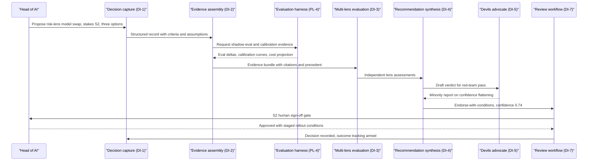
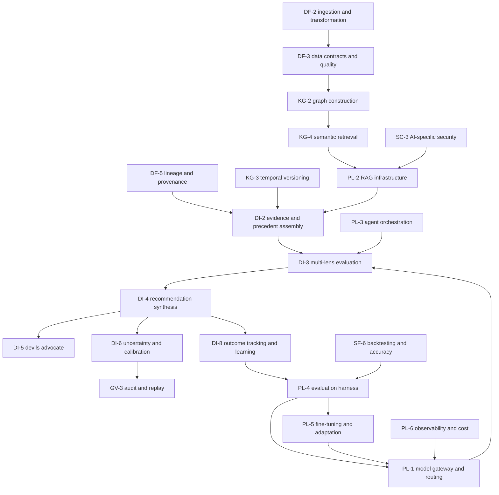

# AI/ML engineering perspective

## 1. Front matter

| Field | Value |
|---|---|
| Doc ID | PERS-AIML |
| Role | Head of AI and senior ML engineers (judgment-engine builders and operators) |
| Owning unit | U13 Perspective AI/ML Engineering |
| Pillars referenced | PL-1, PL-2, PL-3, PL-4, PL-5, PL-6, PL-7, DI-1, DI-2, DI-3, DI-4, DI-5, DI-6, DI-7, DI-8, KG-3, KG-4, DF-3, DF-5, SF-6, GV-3, GV-4, GV-7, SC-3, AD-3 |
| Version | 1.0 |

## 2. Role & mandate

The head of AI owns every verdict TrueNorth issues. This role and the senior ML engineers reporting to it are accountable for the design, evaluation, calibration, deployment, and continuous operation of the judgment engine: the multi-lens judge models (DI-3), the synthesis layer that converts lens assessments into an Endorse / Endorse-with-conditions / Caution / Oppose verdict (DI-4), the devil's-advocate generator (DI-5), and the confidence and calibration machinery (DI-6). The team also owns the engineering relationship with the platform layer that makes any of this operable at enterprise scale: model routing (PL-1), retrieval (PL-2), agent orchestration (PL-3), the evaluation harness (PL-4), fine-tuning pipelines (PL-5), and observability (PL-6).

The mandate is blunt: no verdict reaches a customer unless the team can demonstrate, with held-out evidence, that the verdict pipeline producing it is calibrated, regression-tested, reproducible, and resistant to the known failure modes of LLM-as-judge systems. The team is the internal counterweight to product pressure. When a release deadline collides with an eval gate, the eval gate wins, because a single confidently wrong Oppose on a sound S1 decision — or a sycophantic Endorse on a doomed one — destroys more enterprise trust than a year of feature velocity can rebuild.

Success in three years looks like this: every production lens carries a published calibration record; expected calibration error on the verdict confidence scale stays within agreed bounds per stakes tier; verdict reproducibility from the audit log (GV-3) is exact for pinned-model replays and statistically characterized for non-deterministic components; cost per verdict sits inside tier budgets without quality erosion; drift is detected by the team's own monitors before any customer notices; and the outcome-learning loop (DI-8) measurably improves judge accuracy quarter over quarter on backtested decision cohorts. Equally important: in three years the team has never once been the reason a regulator, auditor, or board lost confidence in a TrueNorth recommendation.

## 3. Decisions I face today

| Decision | Cadence | Stakes | Current pain |
|---|---|---|---|
| Which base model family powers each lens, per stakes tier and deployment mode (SaaS through air-gapped) | Quarterly, plus event-driven on model releases | S2 | Vendor benchmarks are useless for judgment tasks; I have no decision-domain eval that transfers across model swaps without weeks of revalidation |
| Whether a given lens improvement ships as prompt revision, retrieval change, or fine-tune | Monthly per lens | S3 | No standing cost/benefit framework; fine-tunes solidify behavior but freeze in training-data bias and complicate air-gapped parity |
| Setting and defending eval-gate thresholds that block a verdict pipeline release | Quarterly review, enforced per release | S2 | Thresholds are negotiated under deadline pressure; I need them codified as policy, not argued per release |
| Pulling a lens or model route out of production after a regression or drift alarm | Ad hoc, hours matter | S2 | Rollback today risks silent behavior change for in-flight decisions; I need versioned routing with decision-level pinning |
| Allocating the inference budget across stakes tiers (how much deliberation an S4 verdict deserves versus an S1) | Quarterly | S3 | Without per-tier cost/latency budgets, S4 volume cannibalizes the compute that S1 deliberation needs |
| Curating and refreshing golden decision sets, including adjudicated ground truth for contested verdicts | Monthly | S3 | Outcome labels arrive months after decisions; the golden set skews toward short-horizon, easily-labeled cases |
| Recalibrating confidence mappings after model swaps, tenant onboarding, or domain shift | Monthly and event-driven | S3 | Calibration measured on aggregate data hides per-tenant and per-domain miscalibration where decision counts are small |
| Approving any cross-tenant learning signal (never raw data) into shared model improvements | Quarterly | S2 | Legal boundaries are clear; the statistical boundary between "aggregate pattern" and "tenant-identifying signal" is not |
| Whether to trust the engine's own self-calibration report (DI-6) when it disagrees with the offline harness | Ad hoc | S3 | Online self-assessment and offline evals disagree regularly; I lack a principled arbitration rule |

## 4. Jobs-to-be-done

Ranked by importance.

1. JTBD-1 — When any change touches a verdict pipeline (model, prompt, retrieval index, lens weighting, orchestration graph), I want the change blocked until it passes the full regression suite on golden decision sets (PL-4), so I can guarantee that no verdict-quality regression ever ships silently.
2. JTBD-2 — When TrueNorth attaches a confidence number to a verdict, I want that number backed by a measured calibration record per stakes tier and decision domain (DI-6, PL-4), so I can defend the number to an auditor rather than apologize for it.
3. JTBD-3 — When a lens evaluates a proposal, I want the evaluation structurally isolated from knowledge of who proposed it and what verdict other lenses are leaning toward (DI-3, PL-3), so I can suppress sycophancy and inter-judge anchoring at the architecture level rather than hoping prompts fix it.
4. JTBD-4 — When an auditor or customer asks why a verdict was issued, I want byte-exact replay of the full pipeline — model versions, prompts, retrieved evidence, lens outputs, synthesis trace (GV-3, PL-1) — so I can reproduce any verdict months later.
5. JTBD-5 — When precedent is assembled for a new decision (DI-2), I want machine-generated content — especially TrueNorth's own past verdicts — labeled with provenance and weighted separately from primary human evidence (DF-5, KG-3), so I can prevent the engine from citing itself into a feedback loop.
6. JTBD-6 — When decision outcomes mature (DI-8), I want them flowing automatically into golden sets, calibration refits, and backtests (PL-4, SF-6), so I can close the learning loop without a manual labeling campaign every quarter.
7. JTBD-7 — When inference cost or latency for a stakes tier trends toward budget, I want per-tier, per-lens, per-tenant attribution (PL-6), so I can act on the offending component before the budget breaches.
8. JTBD-8 — When a model vendor deprecates or revises an endpoint, I want routing abstraction with shadow evaluation of the candidate replacement on live traffic (PL-1, PL-4), so I can swap models with quantified rather than hoped-for equivalence.
9. JTBD-9 — When retrieval feeds a judge (PL-2, KG-4), I want adversarial-content screening and permission-aware filtering applied before the context window, not after (SC-3), so I can treat prompt injection via ingested documents as a blocked attack class, not a residual risk.
10. JTBD-10 — When a domain needs adaptation (legal lens, manufacturing lens), I want a fine-tuning pipeline with dataset lineage, contamination checks against eval sets, and rollback (PL-5), so I can specialize models without losing the ability to explain or undo the specialization.
11. JTBD-11 — When I run the engine in air-gapped mode, I want the eval harness to publish the measured quality delta between the air-gapped model stack and the SaaS reference stack (PL-4, PL-7), so I can set customer expectations with numbers instead of adjectives.

## 5. A day with TrueNorth

07:40. I open the overnight harness digest before coffee. Two items: the risk lens drifted 1.8 points on the supply-chain golden subset after yesterday's retrieval index rebuild, and the calibration monitor flags that S3 verdicts in one manufacturing tenant are running overconfident — stated 0.80, realized 0.68 over the trailing ninety outcomes. The drift is inside tolerance but trending; the calibration gap is not. I open a remediation ticket to refit that tenant's confidence mapping and pin the cause: a burst of newly matured outcomes from a product-recall cohort the original calibration never saw.

09:15. The real decision of my day: our primary vendor released a new model generation, and the senior ML engineers want it behind the risk lens for S2 and S3 decisions. Two years ago this would have been a Slack argument and a YOLO deploy. Now it is a decision record. I propose it through decision capture as stakes S2 — a judgment-engine swap touches every customer — with three options: full swap, staged swap with two-week shadow evaluation, or hold.

09:40. Evidence assembly pulls what I would have spent a week compiling: shadow-eval results from the harness showing the candidate model up 3.1 points on risk-lens accuracy but with a flatter confidence distribution; cost projections showing 22% lower inference spend; precedent — our last two model swaps, one clean, one rolled back after a calibration regression that took eleven days to surface. The precedent entry for the rollback is the evidence that matters most, and it is cited with full lineage back to the incident review.

10:30. The verdict lands: Endorse-with-conditions, confidence 0.74. Conditions: staged rollout per the second option, recalibration refit before the candidate serves any S2 verdict, and a pinned fallback route for in-flight decisions. The minority report argues the flatter confidence distribution may indicate the new model hedges rather than discriminates, and that 3.1 points on the golden set may not survive contact with low-resource domains. It is a good argument — it is the argument I would have made — and it earns the new model an extra week of shadow traffic on exactly those domains. I sign the S2 gate with the conditions accepted. The decision record arms outcome tracking: in ninety days the engine will score its own advice about itself.

14:00. Eval review board. We adjudicate twelve contested golden-set labels where the recorded outcome contradicts the panel's verdict label. Three get relabeled, nine stand. Tedious, irreplaceable work — the harness is only as honest as this meeting.

16:30. I reject a product request to "soften Oppose language for executive audiences." Verdict semantics are calibrated artifacts, not tone. If Oppose at 0.8 confidence starts reading like Caution, our calibration record becomes fiction. The request goes back with the calibration evidence attached.

## 6. Feature requirements I own

No owned workbench. This unit mints no feature IDs; its requirements are needs against canonical PL and DI capability groups, stated in section 7 and specified by the owning catalogs. The diagram below is the dependency chain this team lives on: the path a signal travels from ingestion to verdict, and the two feedback loops — outcome learning and eval gating — that the team operates. A failure anywhere upstream of DI-3 surfaces as a judgment failure, and the team gets paged for it; that asymmetry is why data quality (DF-3), provenance (DF-5), and retrieval security (SC-3) appear in an AI team's dependency chain at all.

Three properties of this chain are non-negotiable engineering positions:

- Judge independence is an orchestration property. Lens isolation — no shared context, no visibility into sibling assessments, blinded proposer identity — must be enforced by the orchestration framework (PL-3), not by prompt discipline. Prompts leak; execution graphs do not.
- Both feedback loops must pass through PL-4. Outcome data (DI-8) and forecast accuracy (SF-6) improve models only via the harness, where contamination checks prevent eval data from leaking into training data and vice versa. Any path from production outcomes to model weights that bypasses the harness is a defect.
- The gateway (PL-1) is the only place models are invoked. Every verdict-relevant inference must carry a pinned model version, routed by stakes tier, so that replay (GV-3) and rollback are properties of the platform rather than heroics of the team.

## 7. Cross-pillar needs

| Need | Depends on |
|---|---|
| Stakes-aware routing with pinned model versions per decision, shadow routes for candidate models, and decision-level rollback | PL-1 |
| Permission-aware retrieval with relevance and provenance metadata attached to every chunk entering a judge's context | PL-2 |
| Orchestration primitives that enforce lens isolation, blinded inputs, bounded tool use, and deterministic replay of agent graphs | PL-3 |
| Golden decision sets with adjudicated labels, regression gating on every pipeline change, judge-calibration measurement, and contamination controls between eval and training data | PL-4 |
| Fine-tuning pipelines with dataset lineage, eval-set contamination checks, per-tenant adaptation boundaries, and rollback | PL-5 |
| Per-verdict cost and latency attribution sliced by stakes tier, lens, model route, and tenant, with budget alarms | PL-6 |
| Quality-parity measurement and degradation disclosure across SaaS, VPC, on-prem, and air-gapped model stacks | PL-7 |
| Structured decision records carrying stakes tier, options, criteria, and assumptions as machine-readable judge inputs | DI-1 |
| Evidence and precedent assembly that labels machine-generated content and weights the engine's own prior verdicts separately from primary sources | DI-2 |
| Lens outputs as structured assessments with per-lens confidence and cited evidence, never free-text-only | DI-3 |
| Synthesis that preserves and reports inter-lens disagreement rather than averaging it away | DI-4 |
| Devil's-advocate generation evaluated for argument quality against adversarial baselines, not just for presence | DI-5 |
| Confidence semantics defined per stakes tier, what-would-change-my-mind triggers, and scheduled recalibration | DI-6 |
| Stakes-tiered human gates that capture overrides and override rationales as labeled training signal | DI-7 |
| Outcome capture with maturity windows and attribution quality scores feeding harness refresh automatically | DI-8 |
| Bitemporal as-of retrieval so judges see only evidence that existed at decision time during backtests | KG-3 |
| GraphRAG retrieval that respects the querying decision's permission scope | KG-4 |
| Data quality scores propagated to evidence so judges can discount low-quality sources explicitly | DF-3 |
| Field-level lineage from source system to citation, so a poisoned or corrected source invalidates downstream verdicts identifiably | DF-5 |
| Realized-versus-forecast accuracy series as calibration input for forecast-dependent lenses | SF-6 |
| Immutable logging of model versions, prompts, retrieved context, and lens outputs sufficient for byte-exact or statistically characterized replay | GV-3 |
| Explainability surfaces that render the actual synthesis trace, not a post-hoc narrative | GV-4 |
| Model risk management inventory and validation cadence into which every production lens registers | GV-7 |
| Screening of retrieved and ingested content for prompt-injection payloads before context assembly | SC-3 |
| Usage analytics distinguishing verdict acceptance from verdict quality, so adoption metrics never masquerade as accuracy metrics | AD-3 |

## 8. Red lines & veto conditions

The head of AI will veto, escalate, or shut down the following without negotiation:

- No verdict ships from an ungated pipeline. Any code path that can emit a verdict to a user while bypassing the PL-4 regression gate is a severity-one defect, even if the verdict happens to be correct.
- No unbacked confidence numbers. If a stakes tier or decision domain lacks a current calibration record, verdicts in that slice must say so explicitly — or withhold the numeric confidence entirely. Printing 0.85 because the synthesis model emitted 0.85 is fabrication, not measurement.
- No silent model swaps. Every model or prompt version change behind a live lens must be announced, shadow-evaluated, and pinned. In-flight decisions complete on the version they started with.
- No training on cross-tenant raw data. Tenant isolation is a hard boundary for weights, fine-tuning corpora, and retrieval indexes. Aggregate learning signals require the explicit approval path in section 3, with a documented privacy analysis each time.
- No unreplayable verdicts. If GV-3 cannot reproduce a verdict's full pipeline state, the verdict should never have existed. Replay capability is a launch blocker, not a fast-follow.
- No precedent contamination. The engine's own outputs must never re-enter evidence assembly as if they were independent ground truth. Unlabeled machine-generated precedent is the slow poison of this product: each generation of verdicts trained or conditioned on the last converges on confident self-agreement.
- No sycophancy by design. Any feature that exposes proposer seniority, prior leadership sentiment, or sibling-lens leanings to a judge model is vetoed. The team's own measurements on judge models show systematic verdict shift when proposer status is visible; the only reliable fix is blinding.
- No tone-tuning of verdict semantics. Marketing and customer success do not get to soften Oppose. Verdict labels are calibrated instruments; changing their language without recalibrating is equivalent to relabeling a thermometer.
- No autonomous people decisions and no surveillance scoring, full stop, per the canonical red lines — including "analytics" backdoors that reconstitute individual performance scoring from decision metadata.
- No eval-gamed releases. If a team optimizes a lens against the golden set itself (prompt-tuning to leaked eval cases), the release is frozen and the eval set rotated. Goodhart pressure on the harness is treated as an integrity incident.

## 9. Adoption & workflow integration

What changes in the team's week: the harness digest replaces ad-hoc spot-checking as the morning ritual; model and prompt changes move through decision records when they are S2-grade (anything touching verdict semantics or multiple tenants), which the team initially resented and now relies on for its precedent value; the eval review board becomes a standing meeting with SME adjudicators, because golden-set label quality is the single highest-leverage hour of the week; incident response shifts from log spelunking to replay-first debugging via GV-3 traces.

What the team will use TrueNorth itself for: model-swap decisions, eval-threshold changes, budget reallocations across stakes tiers, and build-versus-buy calls on tooling. Dogfooding the judgment engine on judgment-engine decisions is the cheapest red team available, and the minority reports on the team's own proposals have already caught two staged-rollout gaps.

What the team will ignore: alignment scoring of its own OKRs (GA-4) beyond compliance minimums, and most notification surfaces — engineers live in the observability stack (PL-6) and the harness, not in digest emails. That is fine; SX surfaces are not built for this persona.

What must never be required: the team must never be forced to approve a release on management assertion that "the evals can catch up later"; must never be required to expose raw eval traces containing tenant data to non-cleared staff for debugging convenience; and must never be made the human-in-the-loop signer for customer business decisions — DI-7 gates belong to the decision owners, not to the engineers who built the engine. Engineers signing customer verdicts would convert a technical accountability into a fiduciary one the team is neither authorized nor qualified to hold.

## 10. Success metrics & value model

The team measures itself, and asks to be measured, on the following. Targets are the team's proposed operating points, to be ratified with governance (GV-7) and revised as outcome data accumulates.

- Calibration: expected calibration error on verdict confidence, per stakes tier and per major decision domain, target ≤ 0.05 for S3/S4 and ≤ 0.08 for S1/S2 (where outcome counts are structurally small); Brier score trend on matured outcomes, improving quarter over quarter.
- Discrimination: verdict accuracy on matured golden cohorts — specifically, the realized failure rate of Endorse decisions versus Caution/Oppose decisions must separate cleanly; if Oppose-overridden decisions succeed as often as Endorsed ones, the engine is decoration.
- Sycophancy and bias audits: measured verdict shift under controlled perturbation of proposer identity, seniority cues, and option ordering, target shift statistically indistinguishable from zero; audited quarterly through PL-4.
- Minority-report quality: fraction of matured wrong verdicts where the attached minority report had identified the realized failure mode — the single best measure of whether DI-5 is real or theater.
- Reproducibility: 100% of sampled verdicts replayable from GV-3 within the stated determinism envelope.
- Drift detection: mean time from quality or calibration drift onset to alarm, target under 72 hours, and always shorter than time-to-customer-report.
- Eval-gate integrity: zero ungated production changes to verdict pipelines; gate pass rate tracked but explicitly not targeted (a 100% pass rate means the gates are too soft).
- Cost and latency per verdict, by stakes tier: proposed budgets of order tens of cents and near-real-time response for S4; single-digit dollars and minutes for S3; tens of dollars and hours-scale deliberation including simulation calls for S2; S1 budgeted per decision with no fixed cap but full attribution (PL-6). Budget adherence ≥ 95% monthly.
- Override learning: percentage of human overrides (DI-7) with captured rationales that flow into harness refresh, target ≥ 90% — overrides are the most valuable labels the system collects.

Payback logic from this seat: the engine's value is the delta in realized outcomes between decisions made with and against its verdicts, measured by DI-8 and attributed by AD-4's methodology (owned elsewhere). The team's contribution to that value is precision: every point of calibration error directly inflates either false confidence (bad decisions endorsed) or false alarm (good decisions delayed by Caution), and both are quantifiable drags on the product's core ROI claim.

## 11. Hard questions for the build team

1. HQ-1 — What is ground truth for a verdict on a decision whose outcome takes three years to mature, and what does the harness gate on in the meantime — proxy outcomes, expert panels, or backtested precedent — given that each substitute is gameable in a different way?
2. HQ-2 — How is the counterfactual problem handled honestly: when a team follows an Oppose and abandons the option, the road not taken is never observed, so Oppose verdicts are systematically harder to score than Endorse verdicts — does the calibration methodology correct for this asymmetry or quietly inherit it?
3. HQ-3 — What is the quantitative definition of sycophancy the harness tests for, who maintains the perturbation suite, and what happens when blinding (the architectural fix) collides with lenses that legitimately need to know organizational context, such as the people lens?
4. HQ-4 — How small can a tenant's matured-outcome count be before per-tenant calibration claims become statistically meaningless, and what does the product say about confidence in year one of a deployment when the honest answer is "borrowed priors from other tenants we cannot name"?
5. HQ-5 — When the engine's verdicts become institutional precedent (KG-3) and that precedent feeds future evidence assembly (DI-2), what is the measured half-life of a judgment error as it propagates, and is provenance labeling alone actually sufficient to stop convergence toward self-agreement?
6. HQ-6 — Who wins when the online self-calibration signal (DI-6) and the offline harness (PL-4) disagree about whether a lens is healthy, and is that arbitration rule written down before the first production incident or during it?
7. HQ-7 — What prevents executives from learning to game the engine — framing proposals, curating evidence, timing submissions to exploit known lens behaviors — and does the team treat adversarial proposers as a threat model with red-team coverage, or as a hypothetical?
8. HQ-8 — Where exactly is the boundary between this team's model ownership and governance's model risk management (GV-7): who can unilaterally pull a lens from production, and can governance force a lens to keep running that the team believes is miscalibrated?
9. HQ-9 — What are the data rights for fine-tuning (PL-5) on tenant decision records and override rationales, and does the contractual position survive a tenant's departure and deletion request without invalidating deployed weights?
10. HQ-10 — What measured quality delta between air-gapped model stacks and the SaaS reference is acceptable before the product must refuse to offer S1/S2 verdicts in air-gapped mode, and who owns that refusal threshold?
11. HQ-11 — If verdict semantics are calibrated instruments, how does the product handle model-generation upgrades that improve accuracy but shift the confidence distribution — is there a deprecation protocol for confidence numbers, the way there is for APIs?
12. HQ-12 — Does the immutable assumption set need a future companion assumption on machine-generated-content provenance standards across all pillars? This team believes it does; recording here rather than asserting, per the shared specification.

## 12. Dependencies & references

| Reference | Type | Why |
|---|---|---|
| PL-1, PL-2, PL-3, PL-4, PL-5, PL-6, PL-7 | Canonical L2 capability groups | The platform substrate this team builds the judgment engine on; eval gating, routing, and cost attribution are existential dependencies |
| DI-1 through DI-8 | Canonical L2 capability groups | The judgment core this team designs, calibrates, and operates |
| KG-3, KG-4 | Canonical L2 capability groups | As-of retrieval for honest backtests and permission-aware GraphRAG for judge context |
| DF-3, DF-5 | Canonical L2 capability groups | Quality scores and lineage that let judges discount and invalidate evidence |
| SF-6 | Canonical L2 capability group | Forecast-accuracy series feeding lens calibration |
| GV-3, GV-4, GV-7 | Canonical L2 capability groups | Replay, explainability, and the model-risk boundary with governance |
| SC-3 | Canonical L2 capability group | Prompt-injection and retrieval-poisoning defense ahead of judge context |
| AD-3 | Canonical L2 capability group | Keeping adoption metrics distinct from accuracy metrics |
| U10 Catalog PL+AD | Work unit | Owns the L3+ specifications for every PL need stated here |
| U6 Catalog DI+SF | Work unit | Owns the L3+ specifications for the judgment core and backtesting needs |
| U4 Catalog DF+KG | Work unit | Owns lineage, quality, and retrieval specifications this team depends on |
| U8 Catalog GV | Work unit | Owns audit, explainability, and model-risk specifications |
| U9 Catalog SC | Work unit | Owns AI-specific security specifications |
| U12 Perspective CTO | Work unit | Shares the platform reliability and deployment-parity agenda |
| U25 Responsible-AI Deep Dive | Work unit | Red-team scenarios and oversight structures that consume this team's bias and sycophancy audits |
