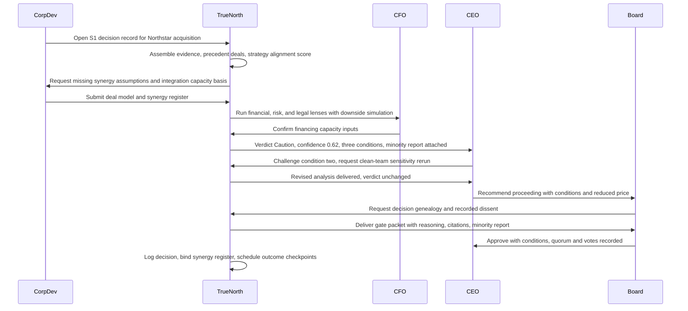
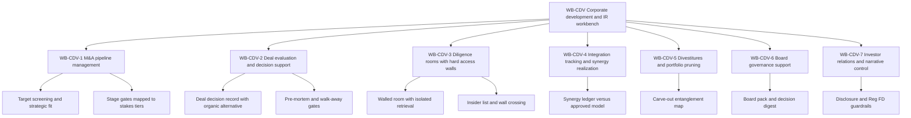

# CEO, board & investors perspective

## 1. Front matter

| Field | Value |
|---|---|
| Doc ID | PERS-CEO-BOARD-INV |
| Role | Chief Executive Officer, independent board member, activist investor, corporate development & investor relations lead (blended voice) |
| Owning unit | U11 Perspective CEO/Board/Investors |
| Pillars referenced | GA-1, GA-3, GA-4, GA-5, DI-1, DI-3, DI-4, DI-5, DI-6, DI-7, DI-8, SF-2, SF-5, SF-6, KG-3, KG-6, MI-2, MI-6, DF-7, GV-1, GV-3, GV-5, GV-7, SC-1, SC-2, SC-5, PL-4, PL-6, AD-4, SX-1, SX-4, WB-CDV |
| Version | 1.0 |

## 2. Role & mandate

This document blends four voices that sit at or above the apex of the decision-rights matrix. They are the buyers, the governors, and the skeptics of TrueNorth simultaneously, and they will not speak in unison. Where they disagree, the disagreement is preserved deliberately.

### The CEO

The CEO is accountable to the board for strategy, capital allocation, executive talent, and results — and accountable to forty thousand employees for not wasting their effort on work that contradicts the strategy. The CEO's core frustration is signal decay: strategy is set at the top with clarity and arrives at the team level as folklore. Decisions that should cascade from strategy are instead made from local incentives, stale data, and whoever spoke last in the meeting. Success in three years looks like this: every material decision in the company is visibly traceable to a strategy node or visibly flagged as a deviation; the time from "question raised" to "decision made with evidence" for executive-tier matters drops by half; and the CEO can answer the board's hardest question — "is the organization actually doing what you said it would?" — with data instead of anecdote. The CEO wants TrueNorth's honesty more than its agreement. An engine that learns to flatter the corner office is worse than no engine at all.

### The independent board member

The independent director is accountable for fiduciary oversight: strategy approval, CEO performance and succession, risk appetite, audit integrity, and major transactions. The director's posture toward TrueNorth is double-edged. As a consumer, the director wants what management has never provided — decision genealogy, recorded dissent, and the same evidence base management saw, not a curated pack. As a governor, the director insists that TrueNorth itself become a governed object: an AI system that scores S1 decisions is a material control under the board's purview, full stop. It gets a charter, an owner, model-risk reporting to the audit committee, calibration disclosure, change control on the judgment core, and a standing right to independent audit. Success in three years: every S1 decision the board approves carries a complete, replayable record; the board's information asymmetry versus management shrinks measurably; and the AI itself has never surprised the audit committee.

### The activist investor

The activist holds a position because the company underearns its potential, and is openly skeptical of paying eight figures a year for "AI judgment." Software that summarizes meetings is a commodity; software that claims to improve decisions must prove it the way a factory proves yield. The activist's stance: value claims are guilty until proven innocent, counterfactuals or it did not happen, and no credit for soft savings. If TrueNorth works, it should show up in numbers an outsider can audit — ROIC trend, forecast accuracy, synergy realization on deals, fewer write-offs from decisions the engine flagged. The activist also sees an upside angle most vendors miss: a credible decision-governance system is a defense against the activist's own playbook, because the standard activist thesis — "management allocates capital by habit and politics" — gets harder to write. Success in three years: the platform either pays back inside eight quarters on hard buckets or it is gone, and the company can show capital discipline with receipts.

### The corporate development & IR lead

The corp-dev and IR lead runs the M&A pipeline, diligence, integration, divestitures, and the company's narrative to the street. The mandate is velocity with control: move deals fast without ever leaking material non-public information, and never tell investors anything the internal data contradicts. This lead owns the WB-CDV workbench specified in section 6. Success in three years: deal cycle time down a third, zero wall breaches, synergy promises tracked to realization against the model the board approved, and an earnings narrative that has never had to be walked back.

## 3. Decisions I face today

### CEO

| Decision | Cadence | Stakes | Current pain |
|---|---|---|---|
| Capital allocation across divisions and the buyback/dividend/invest split | Quarterly | S1 | I arbitrate between division heads armed with dueling spreadsheets; nobody shows me the precedent of our last five reallocations and what they actually returned. |
| M&A go/no-go and walk-away calls | Episodic | S1 | Deal fever is real; by the time a target reaches me, the organization is emotionally committed and the contrary case is whispered, not written. |
| Annual operating plan and external guidance | Annual | S1 | The plan is a negotiation artifact, not a forecast; I cannot see which assumptions are load-bearing until one breaks in Q3. |
| Strategy pivots and major bet kills | Episodic | S1 | Sunk-cost gravity. Killing a flagship initiative requires me to personally absorb the political cost because no neutral record says it is failing. |
| Executive appointments and org design | Episodic | S2 | I get advocacy, not evidence; institutional memory of how similar org changes played out left with the people who made them. |
| Crisis response (recall, breach, geopolitical shock) | Rare | S1 | Decisions made in hours with whatever data is reachable; the record of what we knew when is reconstructed later, badly, for regulators. |
| Pricing architecture and major customer concessions | Annual / episodic | S2 | Each concession is locally rational; nobody totals the strategic erosion across deals. |

### Board member

| Decision | Cadence | Stakes | Current pain |
|---|---|---|---|
| Approve or reject management's major asks (deals, capex, plans) | Per meeting | S1 | I see a 90-page pack curated to a conclusion; dissent inside management is invisible to me. |
| CEO performance evaluation and succession readiness | Annual / continuous | S1 | I judge on results and theater; I cannot see decision quality separated from luck. |
| Risk appetite statement and its enforcement | Annual | S1 | The statement is prose; nothing tells me when actual decisions drift outside it. |
| Dividend, buyback, and balance-sheet posture | Quarterly | S1 | I rely on management's framing of capacity; independent simulation is something I have to buy from bankers. |
| Governance of TrueNorth itself | Quarterly | S1 | Entirely new duty; no playbook exists, and management's instinct will be to treat the AI as an IT purchase rather than a control. |

### Activist investor

| Decision | Cadence | Stakes | Current pain |
|---|---|---|---|
| Initiate, increase, or exit the position | Continuous | S1 | Public disclosures lag operational reality by quarters; capital-allocation discipline is unobservable from outside. |
| Whether to support, pressure, or run a proxy campaign against management | Annual | S1 | Theses rest on inference; a company that can show decision receipts changes my calculus in either direction. |
| Whether to credit claimed TrueNorth value at renewal commentary | Annual | S2 | Vendors and managements both habitually book "productivity" savings nobody can find in the P&L. |

### Corp-dev & IR lead

| Decision | Cadence | Stakes | Current pain |
|---|---|---|---|
| Advance a target from screen to LOI to definitive agreement | Monthly / episodic | S2→S1 | Pipeline lives in slides and bankers' inboxes; strategic fit is asserted, not scored. |
| Walk away from a live deal on diligence findings | Episodic | S1 | Walk-away criteria are never pre-committed, so they get negotiated downward under deal pressure. |
| Guidance language and disclosure timing | Quarterly | S1 | Consistency with prior statements is checked by tired humans at midnight before the call. |
| Divest or retain an underperforming unit | Annual | S1 | Sell-side analysis gets a tenth of buy-side rigor; entanglement costs surface after the decision. |

## 4. Jobs-to-be-done

Ranked by importance across the blended voice.

1. JTBD-1 — When my teams make material decisions after meetings, I want each decision scored against the live strategy cascade, so I can see whether the company actually executes the strategy I set or quietly routes around it. (CEO)
2. JTBD-2 — When a decision reaches an S1 gate, I want the complete record — options, evidence, verdict, confidence, conditions, and minority report — in one replayable artifact, so the board governs on the same facts management saw. (Board)
3. JTBD-3 — When management claims TrueNorth created value, I want decision-level ROI attribution with explicit counterfactual methodology, so I can separate genuine alpha from software theater. (Investor)
4. JTBD-4 — When a deal enters diligence, I want a hard-walled room with insider lists, isolated retrieval, and full audit, so MNPI never contaminates the wider knowledge graph or the wider company. (Corp dev)
5. JTBD-5 — When I disagree with an Oppose verdict, I want a defined override protocol that records my rationale and notifies the board on S1 matters, so authority stays human and accountability stays legible. (CEO)
6. JTBD-6 — When a deal closes, I want the approved deal model to become the integration scoreboard, so synergy promises stay attached to the people who made them. (CEO, Board)
7. JTBD-7 — When earnings approach, I want narrative drafts checked against governed internal metrics and every prior public statement, so we never tell the street something the graph contradicts. (IR)
8. JTBD-8 — When the engine's judgment quality drifts, I want calibration, override rates, and incidents reported to the audit committee on a fixed cadence, so the board governs the AI like any other material control. (Board)
9. JTBD-9 — When renewal approaches, I want total cost of ownership against realized value per decision domain, so the spend can be killed where it does not pay. (Investor)
10. JTBD-10 — When a business unit underperforms, I want keep/fix/sell analysis with buy-side rigor and entanglement costs quantified, so portfolio pruning is not hostage to internal politics. (Investor, CEO)
11. JTBD-11 — When a crisis hits, I want an expedited decision path that preserves the evidentiary record without slowing the response, so speed and auditability stop being a trade-off. (CEO)
12. JTBD-12 — When precedent matters, I want past decisions with realized outcomes retrievable years later, even after every participant has left, so the institution stops paying twice for the same lesson. (Board)

## 5. A day with TrueNorth

It is the second Tuesday of the quarter's last month, which means the day is wall-to-wall: an M&A gate, a capital decision I already know the engine dislikes, and board pre-reads going out Thursday.

06:30. The morning brief on my phone is four items, not forty. Two S2 decisions cleared their gates overnight in Europe with Endorse-with-conditions; one departmental goal in energy storage has drifted into conflict with the pricing strategy we approved in January and is flagged for my staff meeting; and the Northstar acquisition record is ready for today's gate. I read the Northstar minority report first — I always read the minority report first, a habit the board now checks.

10:00. The Northstar gate. Corp dev has run the target through the pipeline for nine weeks; the diligence room has 61 insiders on the list and not one document has touched general retrieval. TrueNorth's verdict is Caution, confidence 0.62. The reasoning is uncomfortable and specific: of the eleven precedent deals it retrieved — including two from before my tenure that I had never heard of — the three closest analogues missed their synergy models by an average of 60 percent, and our own integration capacity is already committed to last year's acquisition through Q2 next year. Three conditions are attached: defer close until the prior integration passes its Day-365 milestone, cut the revenue-synergy line by half unless the clean team validates the channel-overlap assumption, and pre-commit a walk-away price. I challenge the second condition and order a sensitivity rerun with the clean team's actual numbers. The verdict does not move. I decide to proceed — at a price two turns lower than the banker's "final" — and the record shows the verdict, my reasoning, and the price discipline the Caution bought us. That condition set just paid for the platform's quarter, and I will say so to the activist when he calls.

13:00. The harder moment. The Gulf Coast plant expansion — my project, the one I championed in two town halls — comes back Oppose. Confidence 0.71. The engine's case: demand-scenario spread no longer supports the capacity math, two competitor expansions announced since our original analysis, and the simulation shows the expansion cannibalizes a sister plant's utilization below contribution-margin breakeven in three of four scenarios. I think the engine is underweighting a customer commitment I believe will sign. Here is where the system either survives or becomes a toy. I do not bury the verdict and I cannot — it is already in the record, and S1 overrides route to the board automatically. I write the override rationale myself: the specific assumption I dispute, the evidence I have that the engine does not, and what would prove me wrong within two quarters. The lead director will see it Thursday. If I am right, the record will show the engine where its demand model was blind. If I am wrong, the record will show the board exactly what I knew and when I chose. I sign it. This is what I bought: not an oracle, a witness.

15:30. Board pre-read assembly. The decision digest auto-compiles every S1 decision since the last meeting, every override of a Caution or Oppose — there are two, both mine — and the strategy-health view. Management narrative and engine-generated content carry different provenance labels, at the lead director's insistence. The comp committee's materials stay behind their wall; I cannot see them, which is exactly right.

17:00. Earnings prep. IR's draft guidance language gets run against the metric lineage and three years of prior statements. The checker flags one sentence: "margin expansion driven by sustained pricing power" contradicts the pricing-concession trend the engine sees in the order book. We rewrite it before legal ever sees it. Five years ago that sentence ships, and an analyst dismantles it on the call in February.

18:30. Last item: the quarterly calibration report to the audit committee. Engine confidence versus realized outcomes, drift within tolerance, override-outcome tracking still too young to score. The activist on my IR list will ask for this chart. For the first time in my career, I want him to.

## 6. Feature requirements I own

This unit owns **WB-CDV — Corporate Development & IR**, built on the WB-0 workbench framework. The workbench covers the full deal lifecycle (sourcing through post-deal lookback), divestitures, and the governance and narrative surfaces for the board and investors. All feature IDs below are minted under WB-CDV per the shared specification's rules; platform capabilities are consumed, not respecified, and are cited in section 7.

### WB-CDV-1 M&A pipeline management

User story: As a corp-dev lead, I want a single governed pipeline of acquisition targets scored against the strategy graph, so the company pursues deals that serve the strategy cascade rather than whatever bankers mail in.

- **WB-CDV-1-1 Target sourcing & screening workspace.** Behavior: maintains the target universe from manual entry, banker submissions, and external market signals; each target carries a mandatory strategic-rationale field linked to a named strategy or goal node. Data: target company profiles, market and competitor feeds, strategy graph references. AI involvement: drafts screening summaries with source citations and reliability scores; never auto-advances a target. UX: pipeline list and kanban inside the workbench. Acceptance: a target cannot enter the "Evaluate" stage without a linked strategic rationale; every screening claim is citation-backed.
- **WB-CDV-1-2 Strategic-fit & precedent scoring.** Behavior: scores each target against the strategy cascade and retrieves the most similar past deals — internal and, where licensed, market comparables — with their realized outcomes. Data: strategy graph, historical decision records, deal outcome data. AI involvement: similarity retrieval and fit-score decomposition. UX: fit panel on the target record. Acceptance: every fit score decomposes into cited evidence; the precedent set must surface failed analogues when they exist, not only successes.
- **WB-CDV-1-3 Pipeline stage & approval workflow.** Behavior: stage advancement (screen → IOI → LOI → definitive) is gated, with the gate's stakes tier escalating by deal size and strategic significance per the tenant's decision-rights matrix; definitive agreements above the configured threshold are S1. Data: stage history, gate artifacts, approver identities. AI involvement: gate-readiness checks listing missing artifacts. UX: stage rail with blocked-state explanations. Acceptance: stage advance is hard-blocked until required artifacts exist; every advance records who approved and under what authority.
- **WB-CDV-1-4 Deal model & valuation workspace.** Behavior: versioned deal models where every assumption is a first-class object with an owner, basis, and confidence; model versions are diffable and the gate-approved version is frozen. Data: valuation models, assumption registers, financing inputs. AI involvement: assumption-consistency checks against internal data and flagging of assumptions that contradict the graph. UX: model view with assumption ledger. Acceptance: no unattributed numbers — every line traces to an owned assumption; the version approved at gate is immutable thereafter.

### WB-CDV-2 Deal evaluation & decision support

User story: As the CEO, I want every material deal to flow through a structured decision record with a forced contrary case, so deal fever meets organized resistance before it meets the board.

- **WB-CDV-2-1 Deal decision record assembly.** Behavior: instantiates the standard decision record from the pipeline object; the options set must include "do nothing" and at least one organic-build or partnership alternative with comparable analysis. Data: pipeline object, deal model, alternatives analysis. AI involvement: drafts the alternatives comparison from internal capability and cost data. UX: decision record view within the workbench. Acceptance: an S1 deal record cannot reach its gate without a costed organic alternative in the options set.
- **WB-CDV-2-2 Synergy hypothesis register.** Behavior: every synergy claim is a register line with type (cost/revenue/capital), owner, dollar value, timing, confidence, and kill criteria; the register total must reconcile to the deal model's synergy figure. Data: synergy lines, owners, deal model linkage. AI involvement: benchmarks each line against precedent-deal realization rates and flags outliers. UX: register table with reconciliation status. Acceptance: no plug numbers — an unreconciled register blocks the gate; every line has a named owner who persists into integration tracking.
- **WB-CDV-2-3 Deal pre-mortem & walk-away gates.** Behavior: structured pre-mortem captured before LOI; walk-away conditions (price ceiling, diligence-finding triggers, financing terms) are pre-committed and locked. Data: pre-mortem artifacts, walk-away conditions, breach events. AI involvement: generates the devil's-advocate case and checks live deal state against committed conditions. UX: walk-away panel with breach alerts. Acceptance: breaching any pre-committed condition halts the deal workflow and forces explicit re-approval at the original gate's stakes tier — silent renegotiation of walk-aways is impossible.
- **WB-CDV-2-4 Downside simulation packet.** Behavior: assembles the deal's downside case for the gate, including a scenario in which the majority of revenue synergies fail and integration costs overrun at precedent rates. Data: simulation outputs, precedent overrun distributions. AI involvement: scenario configuration and narrative summary of break points. UX: downside tab in the gate packet. Acceptance: no S1 deal packet is gate-complete without a quantified downside case and the balance-sheet consequence of the downside materializing.

### WB-CDV-3 Diligence rooms with hard access walls

User story: As the corp-dev lead and general counsel jointly, I want deal workspaces that are organizationally and technically walled, so material non-public information never leaks into the general knowledge graph, general retrieval, or any non-insider's view.

- **WB-CDV-3-1 Walled room provisioning.** Behavior: each deal gets an isolated enclave; room contents are excluded from tenant-wide retrieval, the general knowledge graph, and all cross-deal learning by default, with no global toggle that weakens this. Data: room documents, room-scoped index. AI involvement: none outside the room boundary. UX: room workspace visually distinct from the general workbench. Acceptance: a retrieval query by a non-insider returns no results and no acknowledgement that the room exists — metadata silence, not just content denial.
- **WB-CDV-3-2 Insider-list & wall-crossing management.** Behavior: named insider list with join/leave timestamps, attestation capture, and a formal wall-crossing workflow; access auto-expires on list removal and on deal close or termination. Data: insider roster, attestations, access events. AI involvement: anomaly flags on access patterns, scoped to the room and within the platform's red lines. UX: insider roster panel for deal counsel. Acceptance: the complete insider list with timestamps is exportable for regulators in minutes; no access path exists outside the list, including for platform administrators without a recorded break-glass event.
- **WB-CDV-3-3 Diligence request & evidence tracker.** Behavior: manages request lists, responses, and open items by workstream (financial, legal, commercial, technical, people); links every finding to its source document. Data: request lists, documents, findings. AI involvement: matches incoming documents to open requests and drafts gap lists. UX: tracker board per workstream. Acceptance: every finding is source-linked; the open-items count at gate time is visible in the gate packet.
- **WB-CDV-3-4 In-room AI document review.** Behavior: AI-assisted review of room documents — change-of-control clauses, consent requirements, liability anomalies, contract concentrations — executing entirely within the room boundary with no cross-deal or cross-tenant learning. Data: room documents only. AI involvement: extraction and anomaly flagging with citations restricted to room contents. UX: review queue with flagged-clause navigation. Acceptance: every AI output cites room documents exclusively; all prompts and outputs are written to the room's audit log.
- **WB-CDV-3-5 Clean-team workspace.** Behavior: a sub-room for competitively sensitive data (pricing, customer-level economics) with a stricter wall; outputs leave only as approved aggregates released by the clean-team lead. Data: competitively sensitive submissions, approved aggregate outputs. AI involvement: aggregation assistance under the release rules. UX: clean-team sub-room with release workflow. Acceptance: raw clean-team data is never visible to the deal team; every release records approver and aggregate definition.
- **WB-CDV-3-6 Red-flag register & gate escalation.** Behavior: diligence findings classified by severity; severity-1 findings are checked automatically against the pre-committed walk-away conditions and surface in the gate packet. Data: findings, severity classifications, waiver records. AI involvement: severity-classification suggestions, human-confirmed. UX: red-flag register with gate-impact indicators. Acceptance: an unresolved severity-1 finding blocks gate advance unless explicitly waived with a named senior sign-off recorded in the decision record.

### WB-CDV-4 Integration tracking & synergy realization

User story: As the CEO and the board, I want the gate-approved deal model to become the integration scoreboard, so synergy promises are tracked to realization and the people who made them remain accountable.

- **WB-CDV-4-1 Integration plan & milestone tracking.** Behavior: Day-1, Day-100, and Year-1 milestones with named owners; milestone status binds to live metrics from connected systems rather than self-reported color codes. Data: integration plans, milestone-metric bindings, owner assignments. AI involvement: status inference and slippage early warnings. UX: integration command view. Acceptance: every milestone has an owner and a metric binding or an explicit "manually attested" label; attested-only milestones are visibly flagged to the board.
- **WB-CDV-4-2 Synergy realization ledger.** Behavior: tracks each synergy register line against actuals from finance systems; variances require owner explanation; reporting reconciles to the register version frozen at gate approval, never to a restated baseline. Data: synergy register, financial actuals, variance narratives. AI involvement: variance detection and draft explanations for owner confirmation. UX: ledger with realization curves. Acceptance: the quarterly synergy report reconciles line-by-line to the gate-frozen register; baseline restatement requires a board-visible amendment record.
- **WB-CDV-4-3 Integration risk & retention watch.** Behavior: aggregate-level indicators of integration health — org-unit retention, engagement trends, customer churn in acquired accounts — with a minimum aggregation threshold; no individual-level scoring, per the platform red lines. Data: aggregated HR and customer metrics. AI involvement: trend detection at the aggregate level only. UX: integration-risk panel. Acceptance: indicators never resolve below the configured aggregation floor; attempts to filter below it are refused and logged.
- **WB-CDV-4-4 Post-deal lookback & deal scorecard.** Behavior: at 12 and 24 months post-close, auto-assembles thesis-versus-outcome scorecards — valuation assumptions, synergy realization, retention, strategic-fit thesis — and files them into the precedent library for future deal scoring. Data: original decision record, realized outcomes. AI involvement: drafts the lookback narrative with citations. UX: scorecard view, board-pack embeddable. Acceptance: lookbacks are mandatory and board-presented for all S1 and S2 deals; a scorecard, once issued, is immutable and permanently linked to the originating decision record.

### WB-CDV-5 Divestitures & portfolio pruning

User story: As the activist investor (and any CEO honest enough to agree), I want selling analyzed with the same rigor as buying, so underperforming assets cannot hide behind incumbency and internal politics.

- **WB-CDV-5-1 Portfolio review workspace.** Behavior: a recurring keep/fix/sell review of every business unit against return thresholds, strategy fit, and best-owner analysis; skipping a unit's review requires an explicit, recorded waiver. Data: unit financials, strategy alignment scores, market comparables. AI involvement: drafts the keep/fix/sell case for each unit, including the case management would prefer not to read. UX: portfolio grid with review status. Acceptance: every unit receives a reviewed verdict at least annually; silent omission is structurally impossible.
- **WB-CDV-5-2 Carve-out entanglement mapping.** Behavior: maps shared systems, contracts, people, sites, IP, and intercompany flows entangled with a candidate unit, producing separation-cost drivers with confidence levels. Data: knowledge graph relationships, contract metadata, systems inventory. AI involvement: entanglement discovery across the graph and stranded-cost estimation. UX: entanglement map view. Acceptance: the map enumerates separation-cost drivers with confidence levels before the divestiture decision reaches its gate, not after signing.
- **WB-CDV-5-3 Sell-side room & buyer management.** Behavior: outbound diligence rooms with the same wall guarantees as WB-CDV-3, plus per-buyer access partitions, buyer-specific watermarking, and Q&A management. Data: disclosure documents, buyer access logs, Q&A threads. AI involvement: consistency checking of answers across buyers. UX: sell-side room with buyer tabs. Acceptance: per-buyer access logs are exportable; an answer given to one buyer that materially contradicts an answer to another is flagged before release.
- **WB-CDV-5-4 TSA & separation tracking.** Behavior: tracks transition service agreements to expiry with cost, service-level, and exit-readiness status; escalating alerts at 180, 90, and 30 days before expiry. Data: TSA terms, service metrics, exit-readiness checklists. AI involvement: exit-readiness gap summaries. UX: TSA dashboard. Acceptance: no TSA reaches expiry without a recorded exit decision (extend, exit, renegotiate) at the appropriate stakes tier.

### WB-CDV-6 Board governance support

User story: As an independent director, I want board materials assembled from decision records rather than curated narratives, so I govern with the same evidence management has — including the evidence management would rather summarize.

- **WB-CDV-6-1 Board pack assembly & decision digest.** Behavior: assembles the pack from decision records, strategy health, deal status, and verdict history; the digest mandatorily includes every S1 decision and every executive override of a Caution or Oppose verdict since the last meeting. Data: decision records, verdict history, override records. AI involvement: digest drafting with provenance labels distinguishing management narrative from engine-generated content. UX: board portal pack view with drill-down to underlying records. Acceptance: overrides cannot be omitted from the digest by any management-side configuration; every digest item links to its full decision record.
- **WB-CDV-6-2 Director pre-read Q&A assistant.** Behavior: directors interrogate the pack conversationally with citation-backed answers; director questions and answers are visible to fellow directors, subject to committee walls. Data: pack contents, underlying decision records the director is entitled to see. AI involvement: permission-aware question answering with citations. UX: conversational panel in the board portal. Acceptance: answers respect committee-level walls (audit, comp, nomination); a director can always see the citation trail; no director query is visible to management without board consent.
- **WB-CDV-6-3 Resolution & minutes integration.** Behavior: board votes, approval conditions, and recorded dissents are captured as structured decision records; conditions attached to approvals become tracked commitments with owners and deadlines. Data: resolutions, votes, conditions, dissents. AI involvement: drafts resolution language from the decision record for secretary review. UX: resolution workflow in the board portal. Acceptance: every condition attached to a board approval is trackable to closure; dissents are preserved verbatim in the permanent record.
- **WB-CDV-6-4 AI governance dashboard.** Behavior: surfaces the engine's own health to the board — calibration trends, override rates and override-outcome deltas, incident log, model-change log, and model-risk reports — refreshed before every audit committee meeting. Data: calibration metrics, override records, model-risk reporting. AI involvement: none in metric computation; the engine does not grade its own homework — metrics come from the platform's independent evaluation layer. UX: audit-committee dashboard. Acceptance: no metric on this dashboard is editable or suppressible by management; the data path is independent of the teams operating the engine day to day.

### WB-CDV-7 Investor relations & narrative control

User story: As the IR lead, I want guidance, earnings narrative, and investor Q&A grounded in the same internal truth executives see, so the company never tells the street something the graph contradicts — and never tells one investor what it has not told all of them.

- **WB-CDV-7-1 Earnings & guidance narrative workspace.** Behavior: drafts and version-controls earnings narratives and guidance language; every quantitative claim carries lineage to a governed internal metric; contradictions with internal trends are flagged pre-release. Data: governed metrics, draft documents, lineage links. AI involvement: drafting assistance and contradiction detection between narrative and internal data. UX: narrative workspace with claim-lineage indicators. Acceptance: a draft with unresolved metric contradictions cannot be marked release-ready; every quantitative claim is lineage-traceable on demand during regulator or auditor review.
- **WB-CDV-7-2 Investor Q&A bank & consistency checker.** Behavior: maintains approved Q&A language; new draft answers are checked against the full disclosure history and the Q&A bank; material divergence requires IR-counsel sign-off before use. Data: Q&A bank, disclosure history, divergence flags. AI involvement: divergence detection and prior-language retrieval. UX: Q&A workspace with consistency status. Acceptance: a divergent answer cannot be published or briefed without a recorded counsel sign-off; the checker covers transcripts of prior earnings calls, not only written filings.
- **WB-CDV-7-3 Disclosure control & Reg FD guardrails.** Behavior: classification-aware screening prevents MNPI from entering external-facing drafts, talking points, or investor correspondence; selective-disclosure risks trigger a pre-clearance workflow. Data: classification labels, draft external content, clearance records. AI involvement: MNPI detection against current material developments known to the graph. UX: clearance workflow embedded in the narrative and Q&A workspaces. Acceptance: in the release-candidate evaluation suite, seeded MNPI test strings must be caught at one hundred percent — this control has no acceptable miss rate.
- **WB-CDV-7-4 Shareholder & activist intelligence.** Behavior: monitors ownership shifts, 13D/13F-equivalent filings, activist campaign patterns, and proxy-advisor positions from public and licensed sources only; produces engagement-ready profiles. Data: public filings, licensed market data, news feeds with reliability scores. AI involvement: pattern summaries and campaign-thesis anticipation, fully citation-backed. UX: shareholder intelligence panel. Acceptance: every signal carries source provenance; no non-public or scraped-personal data enters the profile — this feature operates outside any individual-surveillance gray zone by construction.
- **WB-CDV-7-5 Proxy & annual meeting support.** Behavior: tracks proxy items, projected vote outcomes from public data, and the investor-engagement log with disclosure-safe summaries. Data: proxy materials, engagement records, public vote data. AI involvement: vote-projection synthesis with stated uncertainty. UX: proxy season dashboard. Acceptance: the engagement log is complete per investor; every summary it stores is reviewed as disclosure-safe before persistence.

## 7. Cross-pillar needs

| Need | Depends on |
|---|---|
| Material decisions must be scored against the live strategy and OKR cascade | GA-1, GA-4 |
| Deal and capital decisions require standard decision records, multi-lens evaluation, and verdict synthesis | DI-1, DI-3, DI-4 |
| Stakes-tiered gates, S1 escalation, and an expedited crisis path are the backbone of every workflow above | DI-7 |
| Pre-mortems and devil's-advocate cases for deals must come from the platform's red-team capability | DI-5 |
| Deal scorecards and override-outcome tracking feed and consume the platform learning loop | DI-8 |
| Board-grade calibration reporting requires the engine's confidence-versus-outcome measurement | DI-6 |
| S1 deal packets require downside scenarios, war-gaming, and cross-department impact simulation | SF-2, SF-5 |
| Guidance credibility depends on measured forecast accuracy with backtests | SF-6 |
| Decision genealogy and as-of replay for board and regulator review require bitemporal institutional memory | KG-3 |
| Gates must respect the encoded decision-rights matrix and committee structures | KG-6, GV-1 |
| Decisions and dissent captured in meetings must flow into decision records | MI-2 |
| Board and deal discussions need consent-governed recording with off-the-record zones | MI-6 |
| S1 gate records must be immutable, replayable, and audit-ready | GV-3 |
| The audit committee requires model-risk management reporting on the engine itself | GV-7 |
| SOX, EU AI Act, and disclosure-regulation alignment must come from compliance packs | GV-5 |
| Diligence-room walls require decision-rights-aware authorization and break-glass auditability | SC-1 |
| Deal rooms require encryption, BYOK, and classification-aware retrieval enforcement | SC-2 |
| Room-scoped insider-risk monitoring must operate within the platform's red lines | SC-5 |
| Activist, market, and regulatory signals must arrive with source-reliability scoring | DF-7 |
| Board trust in S1 verdicts is conditional on golden-set evaluation and judge calibration | PL-4 |
| The renewal decision requires full platform cost observability | PL-6 |
| The value case requires decision-level ROI attribution independent of vendor claims | AD-4 |
| Executives need the command center and a disciplined mobile digest, not another inbox | SX-1, SX-4 |

## 8. Red lines & veto conditions

### CEO red lines

- The CEO vetoes any configuration in which TrueNorth's verdict becomes a de facto approval. The verdict scale is advisory; the moment line managers treat "Oppose" as "denied" without a human deciding, the system has silently seized authority it was never granted, and it gets unplugged until that is fixed.
- The CEO vetoes sycophancy. If override patterns show the engine's verdicts drifting toward the known preferences of senior approvers — measurable as verdict distributions that shift after leadership turnover without underlying data shifts — the judgment core is compromised and the contract's remediation clause triggers.
- The CEO vetoes any rollout that makes employees feel scored. The red lines on individual surveillance are not just ethics; they are adoption physics. One credible story of TrueNorth being used to build a case against a named employee and the organization will starve the system of honest input forever.

### Board demands: governance of the AI itself

The board treats TrueNorth as a material control, not an IT purchase. The following are conditions of deployment, not preferences. They rely on platform capabilities cited in section 7 (GV-3, GV-7, DI-6, PL-4); the board's demand is for the outcomes, stated here:

- A written charter places TrueNorth oversight under the audit committee (or a dedicated technology committee), with a named accountable executive — analogous to model-risk governance in banking.
- Quarterly reporting to the audit committee covering calibration against realized outcomes, override rates and override-outcome deltas, security and integrity incidents, and all material changes to the judgment core. Material model changes follow change control with the same discipline as changes to financial-reporting controls.
- A standing right to commission an independent third-party audit of the engine — including access to evaluation sets, calibration history, and the audit trail — without vendor veto.
- An incident-notification obligation: any event that could have corrupted an S1 verdict (retrieval poisoning, prompt injection reaching the judgment path, evaluation-harness failure) reaches the audit committee chair within 24 hours.
- The board's own deliberation records are walled from management by default. A system that shows management how directors interrogate the pack inverts the oversight relationship.

### What the S1 gate must look like

For existential and board-level decisions, the board will accept nothing weaker than the following, delivered through the platform's gate capability (DI-7, GV-2):

- The full decision record — options including the rejected ones, evidence with citations, all lens assessments, verdict, confidence, conditions, and the minority report — is available to every gate participant before the gate convenes, with read receipts on the minority report.
- The gate cannot be satisfied by a single approver. Quorum, named sign-offs, and recorded dissent are mandatory; the record preserves who voted what.
- A mandatory cooling-off interval between verdict issuance and gate decision for non-crisis S1 matters, so no S1 decision is approved in the same meeting where its analysis first appears.
- The crisis fast path compresses time, never evidence: an expedited S1 decision still produces a complete record, reviewed retrospectively at the next board meeting.
- The gate record is immutable and replayable years later, exactly as it stood, for any regulator, court, or successor board.

### Succession of trust: when the CEO disagrees with an Oppose

This is the moment the entire system is designed for, and the board will veto any design that fumbles it. The protocol the board requires:

- The CEO can always override. Human authority is the invariant; an engine that can block the CEO has crossed from advisor to governor and must not exist.
- An override of Caution or Oppose requires a written rationale from the overriding executive in their own words: the specific assumption disputed, the evidence relied upon, and what observable result within a defined horizon would prove the override wrong.
- S1 overrides notify the board automatically and appear, without exception, in the next board pack's decision digest. No management configuration can suppress this.
- The outcome of every override is tracked and attributed. Over time this produces the most consequential dataset in the company: the CEO's judgment versus the engine's, scored by reality. The board explicitly intends to use it — in CEO evaluation, in succession planning, and in deciding how much weight S1 verdicts deserve.
- Symmetrically, the engine is scored on the overrides it lost. If overridden executives are systematically right, that is a calibration failure and a vendor problem, reportable under GV-7.
- The record survives the people. When the CEO departs, the override history does not; the successor and the board inherit the genealogy intact.

### Activist investor red lines

- No soft-dollar value accounting. "Hours saved" and "productivity uplift" do not count unless they appear as headcount, cost, or output changes an auditor can locate. The renewal case is built on hard buckets only (section 10).
- No cost runaway. If platform total cost grows faster than attributed value for two consecutive years, the position is simple: shrink scope or terminate.
- No hostage data. Decision records, the knowledge graph, and outcome histories are the company's property, exportable in usable form. A vendor that makes leaving expensive has made the renewal decision for us — against itself.
- No black-box S1. If the engine cannot show its reasoning and citations on a board-level verdict, the verdict does not enter the boardroom.

## 9. Adoption & workflow integration

What actually changes in the executive week: the Monday staff meeting starts from the strategy-drift and decision-digest view instead of status slides; gate reviews replace the unstructured "deal update" agenda item; the board cycle shifts from pack-writing theater to record-reviewing substance, which cuts pre-board management scramble by days per quarter. The CEO commits to two personal behaviors that make or break organizational adoption: reading the minority report first and visibly thanking the teams whose dissent was recorded — dissent that gets punished once will never be recorded again. Override rationales are written personally, never delegated to chiefs of staff; a ghost-written override defeats the accountability the protocol exists to create.

What will be ignored, deliberately: notification streams beyond the daily digest (the interruption budget is non-negotiable — one digest, escalations only above it); conversational interfaces for casual queries the CEO would rather ask a human; any gamified adoption mechanics, which are beneath this audience and corrosive to the system's seriousness.

What must never be required: the CEO will not type structured data into forms — capture must ride on meetings, documents, and existing workflows or it will not happen at this level. Directors will not install new software or carry a second device; the board portal must meet them where board portals already live. No executive will accept the engine's participation in personnel matters beyond what the red lines already permit, which is effectively nothing individual. And nobody at this level will sit through training longer than one briefing; if the surfaces need a manual for an executive, the surfaces have failed.

## 10. Success metrics & value model

The activist investor writes this section's rules; the CEO and board add their instruments. The framework is deliberately hostile to vendor math.

**Hard value buckets (the only ones that count toward payback):**

1. Decision-cycle compression with a carrying cost: measured days from decision-record opening to gate completion for S1/S2 matters, multiplied by the documented cost of delay (capital committed but idle, market windows, deal-process burn). Baseline measured before deployment, by an internal team, not the vendor.
2. Avoided losses with a documented counterfactual: Caution/Oppose verdicts that were heeded, where the avoided downside can be evidenced — the walk-away that the seller's subsequent results vindicated, the expansion deferred before the demand miss. Attribution methodology approved by internal audit (AD-4 supplies the mechanism; internal audit owns the sign-off).
3. Forecast and synergy accuracy monetized: improvement in guidance accuracy and synergy-realization rates versus the company's own three-year baseline, monetized through reduced earnings surprises, working-capital efficiency, and deal-model discipline (SF-6 supplies the measurement).

**Payback rule:** cumulative hard-bucket value must exceed cumulative total cost of ownership — licenses, infrastructure, model spend (PL-6), integration, and the internal team — within eight quarters of full deployment. Miss the hurdle, and renewal negotiates down or out. Soft benefits may be reported; they purchase exactly nothing at renewal.

**Board and CEO instruments (governance and quality, tracked alongside the money):**

- Coverage: percentage of S1/S2 decisions flowing through complete decision records (target: 100% of S1 within year one; an S1 decision outside the system is a control failure, not an adoption gap).
- Calibration: engine confidence versus realized outcomes, trending toward well-calibrated and never gamed by verdict timidity — a engine that earns calibration by always saying Caution is useless, and the verdict-distribution report exists to catch it.
- Override health: override rate by tier and the override-outcome delta in both directions. A near-zero override rate is as alarming as a high one; it means either sycophancy or rubber-stamping.
- Deal discipline: synergy realization versus gate-frozen models, walk-away conditions honored versus renegotiated, lookback completion rate at 100%.
- Trust integrity: diligence-room wall breaches (tolerance: zero), MNPI guardrail misses in evaluation (tolerance: zero), audit findings on the decision record trail (tolerance: zero material findings).

**Leading indicators (first two quarters, before hard value can mature):** decision-record quality scores on S2 matters, minority-report read rates among approvers, precedent-retrieval usage in live deals, and the percentage of board-pack items tracing to underlying records. These earn continued patience; they do not earn renewal.

## 11. Hard questions for the build team

1. HQ-1 — What is the counterfactual methodology behind every ROI claim, who signs it — the vendor, management, or internal audit — and will the vendor accept fees at risk against it?
2. HQ-2 — When the CEO overrides an Oppose on an S1 decision and the outcome is bad, what exactly does the record show, who is guaranteed to see it, and on what timeline — and can any administrator soften it after the fact?
3. HQ-3 — What artifacts does an independent third-party auditor of the judgment engine actually receive — evaluation sets, calibration history, prompt and retrieval logs — and what is contractually excluded?
4. HQ-4 — What specifically prevents the engine from learning the preferences of senior approvers and drifting into sycophancy, and what measurement would surface it to the board before it costs us a bad billion-dollar yes?
5. HQ-5 — If MNPI escapes a diligence room into general retrieval, what is the guaranteed detection time, what is the containment action, and who decides the disclosure question that follows?
6. HQ-6 — In a divestiture, which decision records and graph history convey with the sold asset and which remain — and how is that separation executed without corrupting the genealogy of either company?
7. HQ-7 — The strategy graph is the yardstick for alignment scoring; what happens when the decision under evaluation is whether the strategy itself is wrong — who judges the yardstick?
8. HQ-8 — Decision records are discoverable in litigation; are we building the best-organized plaintiff's exhibit in corporate history, and what is the retention and privilege design that keeps candor alive anyway?
9. HQ-9 — If calibration degrades for two consecutive quarters, what changes automatically — gate strictness, stakes routing, verdict confidence display — and what requires a human governance decision?
10. HQ-10 — What is the full exit path if we terminate: formats, timelines, and the operational cost of running our decision processes the day after TrueNorth is gone?
11. HQ-11 — If our company is itself acquired or targeted by an activist, can our own TrueNorth records be demanded in their diligence, and how are the board's deliberations walled even then?
12. HQ-12 — Who owns the error when a heeded Endorse precedes a material loss — legally, contractually, and reputationally — and what does the vendor's liability framework actually cover beyond fees?

## 12. Dependencies & references

| Reference | Type | Why |
|---|---|---|
| DI-1, DI-3, DI-4, DI-5, DI-6, DI-7, DI-8 | Pillar capability (L2) | The judgment core this perspective consumes for every gate, verdict, override, and lookback |
| GA-1, GA-3, GA-4, GA-5 | Pillar capability (L2) | Strategy cascade and alignment scoring underpinning the CEO's core job-to-be-done |
| SF-2, SF-5, SF-6 | Pillar capability (L2) | Downside simulation for deals and forecast-accuracy measurement for guidance |
| KG-3, KG-6 | Pillar capability (L2) | Decision genealogy, as-of replay, and decision-rights awareness |
| MI-2, MI-6 | Pillar capability (L2) | Decision and dissent capture from meetings; consent governance for board sessions |
| GV-1, GV-3, GV-5, GV-7 | Pillar capability (L2) | Policy enforcement, immutable audit, compliance packs, and model-risk reporting demanded by the board |
| SC-1, SC-2, SC-5 | Pillar capability (L2) | Identity, encryption, and insider-risk controls that make diligence-room walls real |
| DF-7 | Pillar capability (L2) | External market, regulatory, and activist signal ingestion with reliability scoring |
| PL-4, PL-6 | Pillar capability (L2) | Evaluation/calibration infrastructure and the cost observability behind the renewal decision |
| AD-4 | Pillar capability (L2) | Decision ROI attribution mechanism that the investor's value model audits |
| SX-1, SX-4 | Pillar capability (L2) | Executive command center and the disciplined mobile digest |
| U6 Catalog DI+SF | Work unit | Specifies the decision-engine and simulation features this perspective's gates depend on |
| U7 Catalog SX+WB-0 | Work unit | Owns the workbench framework WB-CDV is built on and the surface specifications |
| U8 Catalog GV | Work unit | Specifies the governance, audit, and model-risk features behind the board's demands |
| U9 Catalog SC | Work unit | Specifies the security features behind diligence-room walls and break-glass auditability |
| U10 Catalog PL+AD | Work unit | Specifies evaluation, cost observability, and value-attribution features cited in section 10 |
| U16 Perspective Legal & Compliance | Work unit | Counsel's view on privilege, discoverability, and disclosure controls raised in HQ-8 and WB-CDV-7 |
| U17 Perspective CFO & Finance | Work unit | Finance ownership of deal models, synergy actuals, and the TCO side of the value model |
| U25 Responsible-AI Deep Dive | Work unit | Red-team scenarios and oversight design relevant to the board's AI-governance charter |
| U26 Roadmap & Delivery | Work unit | Phasing and TCO assumptions the eight-quarter payback hurdle must be tested against |
