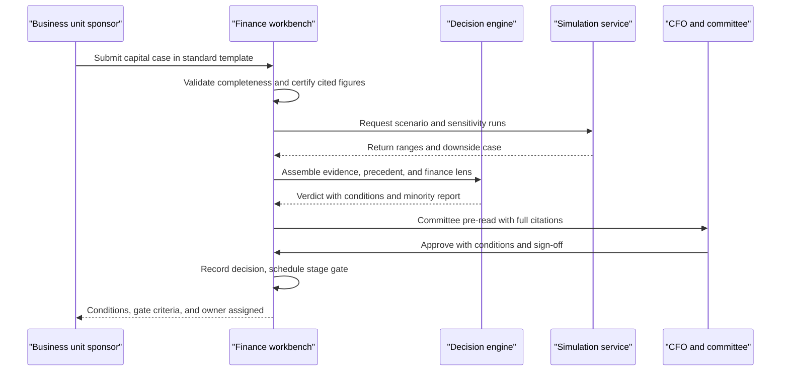
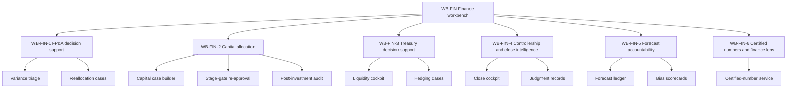

# CFO & Finance perspective

## 1. Front matter

| Field | Value |
|---|---|
| Doc ID | PERS-CFO |
| Role | Chief Financial Officer + FP&A lead |
| Owning unit | U17 Perspective CFO & Finance |
| Pillars referenced | WB-FIN, DF-1, DF-3, DF-5, DF-7, KG-3, KG-5, KG-6, MI-2, GA-1, GA-4, GA-6, DI-1, DI-2, DI-3, DI-4, DI-5, DI-6, DI-7, DI-8, SF-1, SF-2, SF-3, SF-4, SF-6, SX-1, SX-3, GV-1, GV-2, GV-3, GV-4, GV-5, SC-1, SC-2, SC-5, PL-6, AD-4 |
| Version | 1.0 |

## 2. Role & mandate

The CFO is accountable for the integrity of the company's financial statements, the allocation of its capital, the accuracy of its forecasts and external guidance, the liquidity that keeps operations funded, and the controls regime (SOX, external audit, internal audit) that lets the board and markets trust every reported number. The FP&A lead, reporting to the CFO, owns the operating plan, rolling forecasts, variance analysis, and the analytical machinery behind every budget review and capital case.

This perspective is doubly positioned with respect to TrueNorth. First, finance is among the heaviest prospective users: nearly every decision the platform evaluates carries a financial lens, and finance's own decisions — capital allocation, reforecasts, hedging, close-cycle judgments — are exactly the structured, evidence-hungry, precedent-rich decisions the platform claims to improve. Second, the CFO is the economic buyer who must approve TrueNorth's own budget, year after year. The platform will be held to the same standard finance applies to any capital request: a defensible total-cost-of-ownership model, conservative benefit attribution, and a measured payback. A platform that recommends rigor for everyone else but cannot survive its own capital case does not get renewed.

Success in three years looks like this: forecast error on revenue and cash measurably and attributably reduced; every capital case above the materiality threshold carrying a complete decision record with a post-investment audit; close cycle shortened with fewer late adjustments; zero audit findings caused by the platform and at least one finding prevented by it; and a value-realization ledger for TrueNorth itself that internal audit has reviewed and not laughed at. Above all: any number TrueNorth ever cites in a recommendation must be traceable, as of the moment it was cited, back to a governed source. Finance's non-negotiable is that the platform never becomes a second, unauditable version of the truth.

## 3. Decisions I face today

I make or chair the decisions below. The stakes tiers follow the canonical S1–S4 scale.

| Decision | Cadence | Stakes | Current pain |
|---|---|---|---|
| Annual operating plan and budget envelopes | Annual, with mid-year reset | S1 | Six weeks of spreadsheet consolidation; assumptions undocumented; sandbagged targets surface only in Q3 |
| Quarterly reforecast and external guidance | Quarterly | S1 | I cannot see which submitted forecasts have historically been biased, or by whom, without a manual archaeology project |
| Capital approvals above threshold (capex, programs) | Monthly committee | S2 | Every case arrives in a different format; promised benefits are never systematically compared to realized outcomes |
| Continue / kill decisions on in-flight investments | Quarterly stage gates | S2 | Sunk-cost reasoning dominates; nobody surfaces the original approval assumptions that have since broken |
| Treasury: liquidity positioning, facility draws, investment of excess cash | Weekly | S2–S3 | 13-week cash forecast is stitched from emails; counterparty exposure is a Friday spreadsheet |
| FX and commodity hedging program changes | Monthly | S2 | Hedge decisions are made without a structured record of the scenario analysis that justified them |
| Capital structure: debt issuance, buyback, dividend | Episodic | S1 | Board materials take three weeks to assemble; precedent from prior issuances lives in people's heads |
| Close-cycle judgments: reserves, accruals, impairment triggers | Monthly/quarterly | S2 | Judgment memos are inconsistent; auditors ask for support we reconstruct after the fact |
| Budget reallocations between departments mid-year | Monthly | S3 | Requests arrive without alignment context; I cannot see what strategic goal the money serves |
| Approval and renewal of TrueNorth's own budget | Annual | S2 | The vendor's ROI claims are marketing; I need attribution rules I would accept from any other capital case |

## 4. Jobs-to-be-done

Ranked by importance.

- **JTBD-1** — When any TrueNorth recommendation cites a financial figure, I want that figure traced to a governed source system with as-of-date lineage, so I can defend it to auditors and the audit committee without reconstruction.
- **JTBD-2** — When a capital request reaches committee, I want a standardized case with assumptions, scenario ranges, precedent outcomes, and a finance-lens assessment, so I can compare requests on equal footing and approve in one sitting.
- **JTBD-3** — When a forecast is submitted, I want it permanently recorded with its assumptions and later scored against actuals, so I can hold submitters accountable and detect systematic bias before it pollutes guidance.
- **JTBD-4** — When an approved investment passes a stage gate, I want the original approval assumptions automatically re-tested against current data, so I can kill or persevere on evidence rather than momentum.
- **JTBD-5** — When the monthly close runs, I want anomalies, unusual entries, and late adjustments triaged with suggested explanations, so I can close faster with fewer surprises in the audit.
- **JTBD-6** — When I make a treasury decision, I want consolidated liquidity, counterparty, and covenant positions with scenario stress applied, so I can act within hours instead of days.
- **JTBD-7** — When a department requests a budget reallocation, I want the request scored against the strategy graph and prior commitments, so I can see what the money actually buys.
- **JTBD-8** — When I record a material accounting judgment, I want a structured decision record with the evidence considered and the alternatives rejected, so the support exists before the auditor asks.
- **JTBD-9** — When I review TrueNorth's renewal, I want a value ledger of decisions it influenced with conservative attribution and its full run cost, so the platform's own ROI is auditable.
- **JTBD-10** — When external signals move (rates, FX, commodity prices, a customer's credit), I want the affected forecasts, hedges, and open capital cases flagged proactively, so finance reacts before the quarter is lost.

## 5. A day with TrueNorth

It is the second Tuesday of the quarter — capital committee day, with the monthly close finishing in parallel.

At 7:40 I open the finance workbench. The close cockpit shows day 4 of 6: two anomalies overnight. One is a duplicate accrual the system matched against last month's pattern and the controller has already reversed; the other is a $3.1M late adjustment in a regional entity flagged because it exceeds the materiality rule I set. I assign it to the regional controller with the suggested explanation attached. Both flags carry citations to the journal lines and the data-quality score of the feeding system, so when our auditors sample this quarter they will find the triage trail already written.

At 9:00, capital committee. Eleven cases, all in the standard format because the workbench will not route a case to committee without complete assumptions and scenario ranges. Case 7 is a $40M line expansion. TrueNorth's verdict is Endorse-with-conditions: the demand forecast underpinning it sits in the top quartile of historical optimism for that business unit, and two comparable expansions from 2023 delivered 60% of promised volume. The condition is a revised downside case and a 12-month stage gate. The minority report argues the capacity constraint is real and waiting costs more than the downside — a fair point, and I say so. We approve with the conditions. The decision record, my sign-off, the dissent from the BU president, and the gate criteria are captured without anyone writing minutes.

At 13:00, treasury check-in. The 13-week cash view shows a covenant headroom dip in week 9 under the stressed scenario, driven by a customer payment assumption the system flags as stale — the receivable aged past the assumption's review date. We decide to pre-draw nothing but move the facility-draw decision to a tripwire: if the receivable slips past day 75, the draw case auto-assembles for my approval.

At 16:30 I spend twenty minutes on the forecast ledger. Q-2 scoring is in: consolidated revenue forecast error 3.2%, down from 5.1% a year ago, and the scorecard shows which two business units still systematically sandbag. That goes into Friday's business reviews — with the receipts attached, which is the part that changes behavior.

The day ends with nothing reconstructed from memory. Every judgment I made is a record something can learn from, including me.

## 6. Feature requirements I own

The Finance workbench (WB-FIN) is built on the workbench framework (WB-0) and packages finance ontology, KPI definitions, and the finance lens configuration for the rest of the platform. It does not reimplement platform capabilities: forecasting engines belong to SF, verdict synthesis to DI, lineage to DF-5, audit logging to GV-3. WB-FIN owns the finance-specific workflows, templates, accountability ledgers, and the certified-number discipline described below.

### WB-FIN-1 FP&A decision support

**User story:** As an FP&A lead, I want variance analysis, reforecast preparation, and budget-change decisions to start from machine-assembled driver analysis, so my team spends its time on judgment rather than reconciliation.

- **WB-FIN-1-1 Variance triage and driver decomposition.** *Behavior:* on each actuals load, decomposes budget-vs-actual and forecast-vs-actual variances into driver contributions (volume, price, mix, FX, one-offs), ranks by materiality, and drafts explanations from precedent commentary for analyst confirmation. *Data:* GL actuals, budget/forecast versions, driver hierarchies, prior-period commentary. *AI:* driver attribution plus retrieval of similar past variances; explanations are drafts, never auto-published. *UX:* variance worklist in the workbench; push summaries via in-flow surfaces (SX-3). *Acceptance:* every material variance above the configured threshold receives a decomposed, citable explanation candidate within one hour of actuals availability; analyst confirmation rate is tracked.
- **WB-FIN-1-2 Reforecast workspace.** *Behavior:* orchestrates the reforecast cycle — collects driver-level submissions, applies platform forecast baselines as challenger references, highlights submissions diverging materially from both baseline and history, and assembles the consolidation bridge. Forecast model execution itself is consumed from SF-1. *Data:* forecast versions, driver assumptions, submission metadata (who, when, basis). *AI:* divergence detection and assumption-consistency checks across business units. *UX:* cycle dashboard with submission status and challenge flags. *Acceptance:* a complete reforecast cycle is runnable without offline spreadsheet consolidation; every submission is captured into the forecast ledger (WB-FIN-5-1) at submission time.
- **WB-FIN-1-3 Budget reallocation decision cases.** *Behavior:* structures mid-cycle reallocation requests as decision records: source and destination of funds, strategic goal served (scored via GA-4), commitments displaced, and downstream effects. Routes through stakes-appropriate approval per DI-7. *Data:* budget envelopes, strategy graph references, commitment records from MI-2. *AI:* impact summarization and precedent retrieval of similar reallocations with outcomes. *UX:* request form plus committee queue. *Acceptance:* no reallocation above threshold proceeds without a complete record; cycle time from request to ruling is measured.
- **WB-FIN-1-4 Headcount and commitment watch.** *Behavior:* tracks open headcount requisitions, purchase commitments, and contract renewals against budget envelopes; flags decisions that would breach an envelope before they are made. *Data:* HRIS requisitions, procurement commitments, contract milestones. *AI:* none beyond matching and projection; deterministic by design. *UX:* envelope burn-down views per cost center. *Acceptance:* envelope breaches are flagged pre-commitment, not discovered at month end.

### WB-FIN-2 Capital allocation

**User story:** As a CFO, I want every capital request built, evaluated, gated, and audited in one standard pipeline, so committee time goes to the decision and not the formatting, and promised returns are confronted with reality.

- **WB-FIN-2-1 Capital case builder.** *Behavior:* standardized templates per case type (capacity, IT, M&A integration, maintenance) requiring options considered, assumptions registered individually, NPV/IRR/payback computed with the certified finance-lens parameters (WB-FIN-6-2), and scenario ranges attached from SF-2/SF-3. Incomplete cases cannot be routed to committee. *Data:* case drafts, assumption registry, financial parameters. *AI:* drafting assistance from source documents; assumption-plausibility flags against history. *UX:* guided builder with completeness meter. *Acceptance:* 100% of committee cases above threshold pass completeness validation; every figure carries lineage.
- **WB-FIN-2-2 Portfolio ranking and constraint view.** *Behavior:* ranks open cases against capital constraints, hurdle rates, and strategic alignment scores; surfaces the marginal case at the constraint and what displacing it would mean. *Data:* open cases, capital plan, alignment scores from GA-4 and portfolio context from GA-6. *AI:* trade-off summarization with citations. *UX:* committee portfolio screen. *Acceptance:* committee can see, for any approval, which alternative use of capital it displaces.
- **WB-FIN-2-3 Stage-gate re-approval and sunk-cost watch.** *Behavior:* at each gate, re-tests the original approval assumptions against current actuals and forecasts, drafts a continue/kill/restructure case, and explicitly computes the go-forward economics excluding sunk costs; sunk-cost framing flags are requested from DI-5. *Data:* original decision record, assumption registry, current actuals. *AI:* assumption-break detection and gate-case drafting. *UX:* gate calendar with red/amber assumption status. *Acceptance:* no gate passes without an assumption re-test on record; kill decisions cite which assumptions broke.
- **WB-FIN-2-4 Post-investment audit ledger.** *Behavior:* for every completed investment, compares promised benefits (from the approved case) to realized outcomes over the benefit window; aggregates by sponsor, business unit, and case type to expose systematic optimism. Feeds DI-8 so the engine's future finance-lens assessments learn from realization rates. *Data:* decision records, realized financials, benefit-tracking metrics. *AI:* realization attribution drafts for finance review. *UX:* realization scorecards. *Acceptance:* every case above threshold has a realization record at window close; sponsor-level optimism statistics are reportable to the audit committee.

### WB-FIN-3 Treasury decision support

**User story:** As a CFO, I want liquidity, funding, and hedging decisions made from one stress-tested position view with structured records, so treasury actions are fast, justified, and reconstructible.

- **WB-FIN-3-1 Liquidity cockpit.** *Behavior:* consolidates cash positions, the 13-week cash forecast (consumed from SF-1), facility headroom, and covenant calculations; applies configured stress scenarios and flags horizon breaches with the stale or low-quality inputs identified via DF-3 quality scores. Supports tripwire rules that auto-assemble a draw or investment decision case when a threshold is crossed. *Data:* bank/treasury-system balances, facilities, covenants, AR/AP schedules. *AI:* anomaly flagging on cash movements; otherwise deterministic. *UX:* daily cockpit plus alerting. *Acceptance:* covenant headroom under stress is visible daily; every tripwire firing produces a decision case, never an autonomous action.
- **WB-FIN-3-2 Funding and capital-structure cases.** *Behavior:* structures debt issuance, buyback, and dividend decisions as S1 decision records with market-condition evidence from DF-7, precedent transactions from KG-3, and rating-impact considerations; routes through board-level gates per DI-7. *Data:* market data, prior transaction records, rating agency correspondence. *AI:* evidence assembly and board-pack drafting. *UX:* case workspace exportable to board materials. *Acceptance:* a board-ready funding case assembles in days, not weeks, with every market figure timestamped and sourced.
- **WB-FIN-3-3 Hedging decision cases.** *Behavior:* structures FX/commodity hedge program changes with exposure quantification, scenario outcomes from SF-2/SF-3, policy-compliance checks against the treasury policy encoded in GV-1, and effectiveness documentation supporting hedge accounting. *Data:* exposure forecasts, positions, policy parameters. *AI:* exposure summarization; no autonomous trading, ever. *UX:* hedge committee workspace. *Acceptance:* every hedge change carries scenario evidence and a policy-compliance attestation in the record.
- **WB-FIN-3-4 Counterparty and concentration monitor.** *Behavior:* tracks deposit, derivative, and key-customer credit exposures against limits; ingests external credit signals via DF-7 and raises review cases when a counterparty deteriorates. *Data:* exposure positions, limits, external credit feeds. *AI:* signal triage with source-reliability weighting. *UX:* exposure heat map. *Acceptance:* limit breaches and material credit-signal changes raise a case within one business day.

### WB-FIN-4 Controllership and close-cycle intelligence

**User story:** As a controller, I want the close orchestrated, anomalies triaged, and every material judgment documented at decision time, so the close is shorter and the audit file writes itself.

- **WB-FIN-4-1 Close cockpit and anomaly triage.** *Behavior:* tracks close-task progress across entities; screens journal entries and balances for anomalies (duplicates, unusual pairings, late adjustments above materiality, pattern breaks) and drafts triage explanations from precedent; nothing is posted or reversed autonomously. *Data:* close checklists, journal entries, trial balances, prior-period patterns. *AI:* anomaly detection and explanation drafting; flagged items always route to a human. *UX:* close-day dashboard with triage queue. *Acceptance:* all material anomalies are dispositioned by a named person before close sign-off; triage trails are audit-exportable.
- **WB-FIN-4-2 Judgment and estimate decision records.** *Behavior:* structures material accounting judgments (reserves, impairment triggers, revenue-recognition calls, accrual estimates) as decision records capturing evidence considered, alternatives rejected, sensitivity, and approver chain — created at decision time, not reconstructed for the audit. *Data:* supporting schedules, memos, evidence citations. *AI:* drafting support and precedent retrieval of prior treatment of similar items; the accounting conclusion is always human. *UX:* judgment workspace linked to close tasks. *Acceptance:* every judgment above the audit-materiality threshold has a complete record before the close certifies.
- **WB-FIN-4-3 SOX control and evidence binder.** *Behavior:* maps WB-FIN workflows to the SOX control matrix maintained under GV-5; auto-collects control-execution evidence (who approved what, when, with what support) into an examiner-ready binder; flags control gaps such as missing reviews or segregation-of-duties conflicts surfaced via SC-1 role data. *Data:* control matrix, workflow events, access logs from GV-3. *AI:* none in evidence collection — deterministic capture only; AI may draft gap narratives for review. *UX:* control dashboard and binder export. *Acceptance:* for any in-scope control executed through the workbench, evidence is retrievable in under five minutes without manual assembly.
- **WB-FIN-4-4 Policy and technical-accounting watch.** *Behavior:* monitors regulatory and standards changes (via DF-7) relevant to the company's accounting policies, drafts impact assessments against the policy library in the knowledge graph, and opens review cases for the controller. *Data:* standards feeds, policy documents, affected account mappings. *AI:* relevance triage and impact-draft generation. *UX:* watchlist with assessment queue. *Acceptance:* no relevant standards change above a configured significance is unreviewed 30 days after publication.

### WB-FIN-5 Forecast accountability

**User story:** As a CFO, I want every forecast that enters a decision to be permanently recorded and later scored, so accuracy improves because it is measured and bias is visible because it is named.

- **WB-FIN-5-1 Forecast ledger.** *Behavior:* immutably records every submitted forecast version — value, driver assumptions, submitter, timestamp, and the decision contexts that consumed it — using the bitemporal storage of KG-3; supports as-of reconstruction of exactly what was forecast when any decision was made. *Data:* forecast versions, assumption registry, consumption links. *AI:* none; this is a system of record by design. *UX:* ledger browser with as-of queries. *Acceptance:* for any past decision, the consumed forecast and its assumptions are reproducible bit-for-bit.
- **WB-FIN-5-2 Accuracy scorecards and bias detection.** *Behavior:* scores forecasts against actuals using the backtesting service (SF-6); computes error and bias statistics by submitter, business unit, and horizon; detects systematic patterns (sandbagging, hockey-stick phasing, end-of-quarter heroics) and reports them with the underlying evidence. Scorecards measure roles and units in their professional forecasting duty; they are never inputs to individual surveillance scoring, consistent with platform red lines. *Data:* forecast ledger, actuals. *AI:* pattern detection with statistical backing. *UX:* scorecards in business-review packs. *Acceptance:* bias findings are reproducible from the ledger; methodology is published to all scored parties.
- **WB-FIN-5-3 Guidance and external-commitment tracker.** *Behavior:* registers external guidance and analyst commitments as tracked commitments; continuously compares internal forecast trajectory to external commitments and flags divergence early enough to act; access is restricted to a defined insider list given disclosure sensitivity, enforced via SC-1. *Data:* guidance records, consensus data via DF-7, internal forecasts. *AI:* divergence narratives for IR and CFO review only. *UX:* restricted guidance dashboard. *Acceptance:* divergence beyond the configured band alerts the CFO before the quarter's final month begins.
- **WB-FIN-5-4 Driver-assumption registry.** *Behavior:* maintains the canonical registry of planning assumptions (rates, FX, commodity curves, volume drivers) with owners, review dates, and change history; flags stale assumptions and propagates change notifications to every forecast, case, and hedge that consumed them. *Data:* assumption entities in the knowledge graph. *AI:* staleness and inconsistency detection across consumers. *UX:* registry with dependency views. *Acceptance:* any assumption change identifies all downstream consumers within minutes.

### WB-FIN-6 Certified numbers and finance lens

**User story:** As a CFO, I want one governed service that defines which financial figures the whole platform may cite and with what parameters financial evaluation runs, so finance controls financial truth everywhere TrueNorth speaks.

- **WB-FIN-6-1 Certified-number service.** *Behavior:* publishes the certified set of financial figures (actuals, approved budget/forecast versions, official KPI definitions) that any TrueNorth surface or lens must use when citing financial data; each figure carries source, as-of date, certification status, and lineage via DF-5. Uncertified figures may appear in recommendations only with an explicit "unaudited/working" label. *Data:* GL, consolidation system, EPM versions, KPI definitions. *AI:* none; deterministic publication with quality gates from DF-3. *UX:* certification console for the controller. *Acceptance:* zero recommendations cite a financial figure without certification status attached; certified figures reconcile to the books at every close.
- **WB-FIN-6-2 Finance lens configuration.** *Behavior:* maintains the parameters the financial lens (DI-3) applies platform-wide — hurdle rates by risk class, WACC, tax assumptions, depreciation conventions, materiality thresholds by stakes tier — versioned, approved by the CFO, and effective-dated so past evaluations replay with the parameters in force at the time. *Data:* parameter sets with approval records. *AI:* none. *UX:* parameter console with change approval workflow. *Acceptance:* every financial-lens assessment records the parameter version it used; parameter changes require CFO-role approval.
- **WB-FIN-6-3 Finance ontology and KPI pack.** *Behavior:* delivers the finance extension to the workbench framework — chart-of-accounts mapping, entity structures, finance-specific decision types and templates, KPI definitions with calculation provenance — installed and versioned through WB-0 mechanisms. *Data:* ontology definitions, mappings. *AI:* mapping suggestions during onboarding, human-confirmed. *UX:* administration within workbench setup. *Acceptance:* a new tenant reaches a working finance workbench with certified numbers in the first implementation phase using pack defaults plus mapping confirmation.

## 7. Cross-pillar needs

| Need | Depends on |
|---|---|
| Prebuilt, versioned connectors to ERP, EPM, consolidation, and treasury systems | DF-1 |
| Data contracts and quality scores on every feed entering certified numbers | DF-3 |
| Field-level lineage from source to any cited figure in a recommendation | DF-5 |
| Market, rates, commodity, credit, and regulatory feeds with reliability scoring | DF-7 |
| Bitemporal as-of reconstruction for the forecast ledger and decision replay | KG-3 |
| SME validation queues for contested financial facts and KPI definitions | KG-5 |
| Decision-rights and committee structures for capital and treasury approvals | KG-6 |
| Extraction of financial commitments and owners from meetings | MI-2 |
| Strategy graph and alignment scoring for reallocations and capital ranking | GA-1, GA-4 |
| Initiative portfolio and stage-gate signals feeding capital decisions | GA-6 |
| Decision records, evidence assembly, multi-lens evaluation, and verdict synthesis for all finance cases | DI-1, DI-2, DI-3, DI-4 |
| Sunk-cost and optimism-bias flags on gate and capital decisions | DI-5 |
| Confidence calibration and what-would-change-my-mind on financial verdicts | DI-6 |
| Stakes-tiered approval gates and board-level escalation paths | DI-7 |
| Outcome learning from post-investment realization data | DI-8 |
| Cashflow, demand, and headcount forecasting engines | SF-1 |
| Scenario, what-if, and Monte Carlo runs attached to cases and hedges | SF-2, SF-3 |
| Cross-department impact propagation of major finance decisions | SF-4 |
| Backtesting service scoring forecasts against actuals | SF-6 |
| Finance command-center views and in-flow delivery of variance and close alerts | SX-1, SX-3 |
| Treasury and approval policies encoded and enforced | GV-1, GV-2 |
| Immutable audit logs and replay of any recommendation as issued | GV-3 |
| Explainability of any financial-lens assessment to audit-committee standard | GV-4 |
| SOX compliance pack and control-matrix integration | GV-5 |
| Role-based access, insider lists, and segregation-of-duties data | SC-1, SC-5 |
| Encryption and BYOK for financial data in all deployment models | SC-2 |
| Platform run-cost transparency feeding the TrueNorth TCO model | PL-6 |
| Decision-ROI attribution methodology for the platform's own value ledger | AD-4 |

## 8. Red lines & veto conditions

These are the conditions under which the CFO defunds or disconnects the platform. They are not negotiable.

1. **An uncited number is a defect, not a style issue.** If TrueNorth ever presents a financial figure in a recommendation without source, as-of date, and certification status, the finance lens is suspended until root cause is fixed. One hallucinated number in a board pack ends the program.
2. **No second version of the truth.** Certified numbers must reconcile to the books. If the workbench and the GL diverge and the divergence is not flagged as a known quality issue, finance stops trusting everything else.
3. **Non-reproducibility is an audit finding waiting to happen.** Any recommendation, forecast, or judgment record that cannot be replayed as-of its decision date — same inputs, same parameters, same output — fails SOX-adjacent expectations and is grounds for veto of expanded scope.
4. **No autonomous postings, payments, trades, or hedges.** TrueNorth assembles cases and flags conditions; it never executes a financial transaction. A tripwire creates a decision for a human; it never acts.
5. **No MNPI leakage.** Guidance divergence, M&A funding cases, and pre-release results are insider-restricted. If access controls cannot enforce the insider list, those features stay off.
6. **Forecast scorecards measure forecasts, not people's worth.** Accuracy and bias reporting applies to professional forecasting duties at role and unit level with published methodology. The moment scorecards drift toward covert individual surveillance scoring, the CHRO and CFO jointly shut them down — consistent with the platform's canonical red lines.
7. **The platform's own costs must be as transparent as it demands of others.** If TrueNorth's run cost cannot be broken down by workload and department, or the vendor resists conservative benefit attribution, renewal is declined on principle: a decision-intelligence platform that cannot survive its own capital case is selling something else.
8. **No silent parameter drift.** Hurdle rates, WACC, and materiality thresholds change only through the approved console with CFO sign-off. An engine quietly evaluating with different parameters than the approved set is a control failure.

## 9. Adoption & workflow integration

What changes in the CFO's and FP&A lead's week: capital committee runs on standardized, pre-evaluated cases, which converts a half-day of formatting archaeology into an hour of actual deliberation. Variance review starts from decomposed drivers rather than raw ledgers. The reforecast cycle drops its spreadsheet-consolidation tail. Close days gain a triage queue instead of a 6 p.m. surprise. Treasury moves from a Friday spreadsheet to a daily cockpit with tripwires.

What finance will ignore: conversational chat over financial data in the first year — finance trusts worklists and ledgers before it trusts dialogue; generic dashboards duplicating the EPM tool; any "insight" feed not tied to a decision or a control.

What must never be required: re-keying numbers that exist in source systems; using TrueNorth as the system of record for the GL or consolidation (it consumes and certifies, it does not replace); accepting a recommendation as a substitute for the controller's or CFO's accounting judgment; and mandatory engagement quotas — adoption in finance follows demonstrated accuracy, not policy.

Sequencing opinion: deploy certified numbers (WB-FIN-6) and the forecast ledger (WB-FIN-5-1) first — they are the trust foundation; then close intelligence and variance triage, which produce visible weekly wins; capital allocation next, once precedent data exists; treasury and guidance features last, because they carry the highest sensitivity and demand mature access controls.

## 10. Success metrics & value model

KPIs the CFO measures TrueNorth by, with baselines fixed before go-live and measurement methodology agreed with internal audit:

- **Forecast accuracy:** consolidated revenue and cash forecast error (MAPE at one- and two-quarter horizons), with SF-6 backtests as the scoring authority; target a one-third error reduction within two years.
- **Forecast bias:** mean signed error by business unit trending toward zero; count of units with statistically significant sandbagging.
- **Capital realization:** percentage of completed investments achieving ≥80% of promised benefit; sponsor-level optimism ratio trending down.
- **Cycle times:** capital case from submission to ruling; close calendar days; reforecast cycle days; board funding-pack assembly time.
- **Control quality:** audit adjustments after close sign-off; SOX evidence-retrieval time; audit findings attributable to platform data (target: zero).
- **Citation integrity:** percentage of finance-related recommendations with fully certified citations (target: 100%); incidents of uncited figures (target: zero, tracked as defects).
- **Leading indicators:** analyst confirmation rate on drafted variance explanations; share of committee cases passing completeness on first submission; assumption-registry staleness rate.

The platform's own TCO/ROI model — the buyer's math the CFO will personally defend at renewal: TCO includes license/subscription, model-inference and infrastructure cost (transparent via PL-6), integration and connector build, internal platform and data-steward FTEs, change management and training, and audit/assurance overhead for the platform itself. Benefits are admitted only under conservative attribution rules per AD-4: working-capital release from cash-forecast improvement, avoided write-offs from earlier kill decisions (counted at decision-record level with counterfactual documented), close-cost reduction, audit-effort reduction, and FP&A capacity redeployed (counted only when headcount or backfill actually changes). Soft benefits — "better decisions" without a traceable record — score zero. Payback target is 24 months on hard benefits alone; NPV computed at the company hurdle rate using the same WB-FIN-6-2 parameters applied to every other capital case. The value ledger is reviewed annually by internal audit. If year-two hard benefits do not cover run cost, scope is cut, not the methodology.

## 11. Hard questions for the build team

- **HQ-1** — When the external auditor asks to replay a recommendation from eight months ago — same data, same model, same parameters — can the platform reproduce it exactly, and what happens when a model version has since been retired?
- **HQ-2** — How does the engine behave during the close window, when actuals are partially loaded and certified numbers are in flux — does it abstain, label, or guess?
- **HQ-3** — If a certified number is later restated, how are every downstream recommendation, verdict, and forecast score that consumed it identified and flagged, and who is notified?
- **HQ-4** — What stops a business unit from gaming the bias scorecards by managing to the metric — for example, padding assumptions that the detector does not measure — and how will the methodology evolve without becoming retroactively unfair?
- **HQ-5** — How is the insider boundary enforced when the conversational layer can synthesize MNPI from individually innocuous facts the asker is entitled to see?
- **HQ-6** — What is the marginal inference cost of a fully evaluated S2 capital case, and at what case volume does the finance workbench's run cost exceed the FP&A capacity it frees?
- **HQ-7** — When the finance lens and the strategy lens disagree on a flagship initiative, how is that conflict surfaced to committee rather than averaged away inside the verdict?
- **HQ-8** — Whose error is it contractually and reputationally when a recommendation built on a certified-but-wrong number contributes to a bad board decision — the data owner's, the platform's, or the CFO's?
- **HQ-9** — Can the platform operate the finance workbench in an on-prem or air-gapped deployment without degrading the forecasting and evaluation quality the ROI model assumes, and will the vendor warrant that in the contract?
- **HQ-10** — The shared specification does not state who arbitrates when a department disputes finance's certified version of a shared KPI; a global rule may be needed and should be settled before tenant onboarding.

## 12. Dependencies & references

| Reference | Type | Why |
|---|---|---|
| DF-1, DF-3, DF-5, DF-7 | Pillar capability (L2) | Connectors, quality contracts, lineage, and external signals feeding certified numbers and treasury monitoring |
| KG-3, KG-5, KG-6 | Pillar capability (L2) | Bitemporal replay for the forecast ledger, curation of financial facts, decision-rights routing |
| MI-2 | Pillar capability (L2) | Commitment extraction feeding budget and reallocation context |
| GA-1, GA-4, GA-6 | Pillar capability (L2) | Strategy alignment and portfolio signals in capital allocation |
| DI-1 … DI-8 | Pillar capability (L2) | Decision records, evidence, lenses, verdicts, bias flags, gates, and outcome learning for all finance cases |
| SF-1, SF-2, SF-3, SF-4, SF-6 | Pillar capability (L2) | Forecasting engines, scenarios, Monte Carlo, impact propagation, and backtesting consumed by WB-FIN |
| SX-1, SX-3 | Pillar capability (L2) | Command-center and in-flow delivery of finance worklists and alerts |
| GV-1, GV-2, GV-3, GV-4, GV-5 | Pillar capability (L2) | Policy enforcement, HITL gates, audit replay, explainability, and the SOX compliance pack |
| SC-1, SC-2, SC-5 | Pillar capability (L2) | Access control, insider lists, encryption/BYOK, and segregation-of-duties data |
| PL-6 | Pillar capability (L2) | Run-cost transparency required by the platform TCO model |
| AD-4 | Pillar capability (L2) | Attribution methodology for the platform's own value ledger |
| U6 Catalog DI+SF | Work unit | Owns the L3+ specs of the decision and simulation capabilities WB-FIN consumes |
| U7 Catalog SX+WB-0 | Work unit | Owns the workbench framework WB-FIN is built on |
| U8 Catalog GV | Work unit | Owns audit, explainability, and SOX-pack specs WB-FIN's controls rely on |
| U10 Catalog PL+AD | Work unit | Owns cost observability and value-realization specs behind the TCO/ROI model |
| U11 Perspective CEO/Board/Investors | Work unit | Owns WB-CDV; M&A funding cases interface with corporate development |
| U16 Perspective Legal & Compliance | Work unit | Owns WB-LGL; disclosure and regulatory-watch boundaries adjoin controllership |
| U26 Roadmap & Delivery | Work unit | Owns program-level TCO; the CFO's buyer model must reconcile with it |
