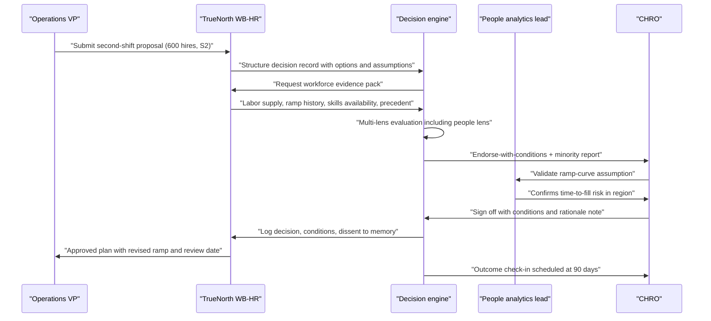

# CHRO & HR perspective

## 1. Front matter

| Field | Value |
|---|---|
| Doc ID | PERS-CHRO |
| Role | Chief Human Resources Officer + people-analytics lead |
| Owning unit | U18 Perspective CHRO & HR |
| Pillars referenced | WB-HR, WB-0, DF-4, DF-1, DF-6, KG-1, KG-3, KG-6, MI-2, MI-6, GA-1, GA-3, DI-1, DI-3, DI-4, DI-5, DI-7, DI-8, SF-1, SF-2, SF-4, SX-1, SX-3, SX-4, GV-1, GV-2, GV-3, GV-5, GV-6, SC-1, SC-2, SC-5, PL-4, AD-1, AD-2, AD-3, AD-5 |
| Version | 1.0 |

## 2. Role & mandate

The CHRO is accountable for the workforce as a system: its size, shape, cost, capability, health, and trust in the institution. At a 100,000-employee enterprise this means owning the annual workforce plan and its quarterly revisions, the talent and succession architecture for several thousand critical roles, a compensation budget in the billions, labor relations across dozens of jurisdictions including co-determined European entities, and the people consequences of every major decision the rest of the executive team makes. The people-analytics lead, reporting to the CHRO, owns the evidence base: headcount and attrition models, skills taxonomies, engagement listening, and pay-equity analytics.

The CHRO holds a second, distinct mandate in the TrueNorth program itself: accountability for the change-management reality of deploying a decision-intelligence system to 100,000 employees. A system that ingests meetings and HR data is, in the eyes of the workforce, an HR matter regardless of which executive sponsors it. If employees believe TrueNorth is surveillance, adoption fails everywhere — not just in HR. The CHRO is therefore both a demanding customer of WB-HR and the enforcer of the program's people red lines.

Success in three years looks like this: workforce plans that reconcile with finance in days instead of months and hold a forecast error under five percent; succession slates that exist and are current for every critical role; compensation cycles that close on schedule with documented, equity-checked exceptions; reorganizations evaluated for second-order impact before announcement rather than after; zero substantiated incidents of the platform being used to monitor or score an individual; and works-council agreements in every co-determined jurisdiction that name TrueNorth explicitly and remain in good standing.

## 3. Decisions I face today

I face a portfolio of decisions where the cost of being wrong is measured in people's livelihoods, not just dollars, and where my current tooling is a patchwork of HRIS reports, spreadsheets, and institutional memory that walks out the door with every departure.

| Decision | Cadence | Stakes | Current pain |
|---|---|---|---|
| Annual workforce plan and quarterly true-ups | Annual + quarterly | S2 | Headcount demand signals arrive late and inconsistent across divisions; reconciliation with finance takes six weeks of spreadsheet ping-pong |
| Reduction-in-force or hiring-freeze proposals | Episodic | S1–S2 | Scenario analysis is manual, slow, and blind to skills lost and to knock-on attrition; legal and works-council sequencing is tracked in email |
| Division-level reorganization design | 2–4 per year | S2 | No way to see cross-department impact before announcement; span-and-layer analysis is a one-off consulting exercise |
| Compensation cycle envelope and guidelines | Annual | S2 | Budget modeling, market-data refresh, and pay-equity checks run on separate timelines; exceptions are negotiated without precedent visibility |
| Succession decisions for critical roles | Quarterly review | S2–S3 | Slates are stale within months; vacancy risk for critical roles is discovered when the resignation letter arrives |
| Executive and critical-role hiring approvals | Weekly | S3 | Offer decisions lack consistent market and internal-equity context; counter-offer responses are ad hoc |
| Engagement intervention choices after survey waves | 2x per year | S3 | Survey synthesis takes weeks; signals are anecdote-driven; no link between interventions and measured outcomes |
| Major policy changes (hybrid work, leave, mobility) | Episodic | S2 | No precedent retrieval; impact modeling on retention and cost is guesswork |
| Works-council and labor negotiation positions | Ongoing | S2 | Commitments made in past agreements are scattered across documents; institutional memory of past negotiations is thin |
| HR technology portfolio consolidation | Annual | S3 | Overlapping tools, unclear usage, weak business cases |

## 4. Jobs-to-be-done

Ranked by importance.

- JTBD-1: When a business unit proposes a headcount change, I want it evaluated against the strategy graph, the financial plan, and skills supply before it reaches my desk, so I can approve or push back in days with cited evidence instead of weeks of analysis.
- JTBD-2: When a reduction-in-force or freeze is contemplated, I want scenario analysis that shows skills lost, critical-role exposure, knock-on attrition risk, jurisdictional sequencing constraints, and precedent outcomes, so I can force the executive team to confront the full cost before deciding.
- JTBD-3: When the compensation cycle opens, I want envelope modeling, market positioning, and aggregate pay-equity diagnostics in one place, so I can set guidelines that are defensible and close the cycle on time.
- JTBD-4: When a critical role becomes at risk of vacancy, I want to be warned at the role level — never via inference about a named individual's intent — so I can refresh the succession slate before the gap opens.
- JTBD-5: When a reorganization is being designed, I want to simulate the structural options and see propagated impact on adjacent departments, decision rights, and delivery commitments, so I can choose a design rather than inherit its surprises.
- JTBD-6: When engagement survey results land, I want synthesis at cohort level with a hard anonymity floor, linked to prior interventions and outcomes, so I can act on patterns rather than anecdotes.
- JTBD-7: When any decision anywhere in the company carries material people impact, I want the people lens to be applied automatically in the decision engine's evaluation, so the workforce consequence is never an afterthought.
- JTBD-8: When a works council or regulator asks what employee data TrueNorth processes and why, I want a complete, current, plain-language answer generated from the system's own metadata, so trust and compliance are demonstrable rather than asserted.
- JTBD-9: When I negotiate with labor representatives, I want every past commitment the company has made retrievable with its context and fulfillment status, so I never contradict an existing agreement.
- JTBD-10: When I roll TrueNorth out to the broader workforce, I want adoption, sentiment about the system itself, and trust signals measured in aggregate, so I can steer the change program with evidence.

## 5. A day with TrueNorth

It is the first Tuesday of the quarter. Before my staff meeting, the WB-HR command center shows me three things: the workforce plan variance for last quarter (we landed 2.1 percent over plan, concentrated in one division's contractor conversions), two critical roles whose succession slates have gone stale because both named successors moved, and a pending S2 decision package from the operations organization — they want to add a second shift at a plant, which means roughly 600 hires in a tight labor market.

I open the shift proposal. TrueNorth has already assembled the evidence: the demand forecast driving the request, local labor-market supply data, our historical ramp-up performance at comparable sites, and a precedent — a similar second-shift decision three years ago that ran four months late on hiring and cost us an expedite penalty. The people lens flags that the proposed timeline assumes a time-to-fill we have never achieved in that region. The verdict is Endorse-with-conditions: endorse the shift, condition on a revised ramp curve and an early-start requisition package. The minority report argues the opposite case — that delaying for a cleaner ramp risks the customer commitment that motivated the shift in the first place. I read both, agree with the conditions, and sign off with a note. The decision record, my conditions, and the dissent are now part of institutional memory; in two years, whoever faces the next ramp decision will find this one in seconds.

Mid-morning, the comp team and I review the cycle envelope. The aggregate pay-equity diagnostic shows a cohort-level gap emerging in one job family after last year's acquisitions; we adjust the guideline budget to fund remediation in this cycle rather than discover it in next year's audit. No individual's data is on the screen — cohorts only, with the anonymity floor indicator visible in the corner, which is exactly how I want my own team to experience the system's limits.

In the afternoon I meet our European works-council liaison. She asks what changed in TrueNorth's processing this quarter. I generate the transparency report from the workbench: two new data fields ingested, purpose tags listed, no change to aggregation floors, zero individual-level inferences. The conversation takes twenty minutes instead of a defensive week. Before I leave, I check the adoption dashboard for the TrueNorth rollout itself: usage is climbing in finance and operations, flat in engineering, and the aggregate trust pulse is stable. I ask the change team to look at the engineering champion network — that, not another feature, is this quarter's adoption problem.

## 6. Feature requirements I own

This unit owns the full feature tree for WB-HR (People), built on the WB-0 workbench framework. Every feature below operates under three non-negotiable constraints inherited from the canonical red lines: no covert monitoring, no individual surveillance scoring, no autonomous people decisions. WB-HR is decision support for organizational and cohort-level people decisions; individual-level workflows (a single promotion, a single termination) remain in the HRIS and outside TrueNorth's recommendation scope.

```mermaid
flowchart TD
    WBHR["WB-HR People workbench"]
    WBHR1["WB-HR-1 Workforce planning and headcount scenarios"]
    WBHR2["WB-HR-2 Talent and succession decision support"]
    WBHR3["WB-HR-3 Compensation cycle decision support"]
    WBHR4["WB-HR-4 Engagement signal interpretation (aggregate-only)"]
    WBHR5["WB-HR-5 Org-design scenario studio"]
    WBHR6["WB-HR-6 People guardrails and transparency pack"]
    WBHR --> WBHR1
    WBHR --> WBHR2
    WBHR --> WBHR3
    WBHR --> WBHR4
    WBHR --> WBHR5
    WBHR --> WBHR6
    WBHR1 --> WBHR11["WB-HR-1-1 Demand-linked headcount forecast"]
    WBHR1 --> WBHR12["WB-HR-1-3 Skills supply-demand gap map"]
    WBHR2 --> WBHR21["WB-HR-2-1 Succession slate workspace"]
    WBHR2 --> WBHR22["WB-HR-2-2 Critical-role vacancy risk"]
    WBHR3 --> WBHR31["WB-HR-3-1 Envelope and guideline modeling"]
    WBHR3 --> WBHR32["WB-HR-3-2 Aggregate pay-equity diagnostic"]
    WBHR4 --> WBHR41["WB-HR-4-1 Cohort engagement index"]
    WBHR4 --> WBHR42["WB-HR-4-3 Listening synthesis"]
    WBHR5 --> WBHR51["WB-HR-5-1 Structure what-if modeling"]
    WBHR6 --> WBHR61["WB-HR-6-2 Works-council transparency reports"]
```

### WB-HR-1 Workforce planning and headcount scenarios

User story: as a CHRO or people-analytics lead, I want demand-linked workforce plans and headcount scenarios evaluated against strategy and budget, so that staffing decisions are made on evidence and reconciled with finance continuously.

TrueNorth shall maintain a living workforce plan bound to the strategy graph (GA-1) and to demand forecasts (SF-1), with scenario tooling for expansion, freeze, redeployment, and reduction cases. Reduction scenarios are analysis-only artifacts gated at S1/S2 with mandatory human sign-off (DI-7); the system never recommends named individuals for any action.

| ID | Sub-feature | Behavior and data touched | AI involvement | UX surface | Acceptance criteria |
|---|---|---|---|---|---|
| WB-HR-1-1 | Demand-linked headcount forecast | Projects headcount need per unit/role family from demand forecasts, attrition base rates, and planned initiatives; reads HRIS positions, requisitions, finance budget lines | Forecast models (SF-1) with stated confidence intervals; narrative explanation of drivers | Workforce plan view in WB-HR command center | Forecast error vs. actuals reported per quarter (SF-6); every projection cites its driver data |
| WB-HR-1-2 | Scenario builder for expansion, freeze, redeployment, reduction | Builds side-by-side scenarios with cost, skills impact, critical-role exposure, jurisdictional constraint flags, and knock-on attrition ranges; reduction scenarios show only role/cohort aggregates, never named individuals | Simulation via SF-2; people-lens evaluation of each scenario; precedent retrieval of comparable past actions and their outcomes | Scenario comparison workspace | Reduction scenarios cannot be exported or shared without an S2 decision record and sign-off; no individual identifiers appear in any scenario output |
| WB-HR-1-3 | Skills supply-demand gap map | Compares declared skills inventory (from HRIS and validated self-declared profiles) against forward skill demand; identifies build/buy/borrow options per gap | Skills taxonomy normalization; gap inference with cited sources | Heat-map view by unit and skill family | Skills data limited to declared and validated sources; inferred skills are labeled as inferred and excluded from any decision evidence by default |
| WB-HR-1-4 | Labor-market and location overlay | Enriches plans with external labor supply, wage trend, and regulation signals per location (DF-7) | Source-reliability-scored external signal summarization | Overlay layer on plan and scenario views | Every external figure carries source and freshness; stale signals (>90 days) are visibly flagged |

### WB-HR-2 Talent and succession decision support

User story: as a CHRO, I want current succession slates and vacancy-risk visibility for critical roles, built only from declared, consented systems-of-record data, so that leadership continuity decisions are timely and defensible.

| ID | Sub-feature | Behavior and data touched | AI involvement | UX surface | Acceptance criteria |
|---|---|---|---|---|---|
| WB-HR-2-1 | Succession slate workspace | Assembles and maintains slates for designated critical roles from HRIS talent-review outcomes, declared mobility preferences, and validated experience records; humans nominate and rank, the system organizes and flags staleness | Evidence assembly and staleness detection only; no model-generated ranking or scoring of individuals | Slate workspace restricted to talent-review participants (SC-1) | Slate contents trace 100% to human-entered talent-review data; access fully audited (GV-3); no slate entry is generated by a model |
| WB-HR-2-2 | Critical-role vacancy risk | Tracks structural vacancy exposure per critical role: incumbent tenure-in-role distributions, slate depth, time-to-fill history, single-point-of-failure flags | Cohort/role-level statistical risk only; explicitly prohibited from inferring any named individual's departure intent from behavior, communications, or activity data | Risk register in WB-HR command center | Risk factors are role-structural only; an audit of model inputs shows zero individual behavioral or communication features |
| WB-HR-2-3 | Internal mobility match (opt-in) | Surfaces open internal roles to employees who have opted in, matching declared skills and stated aspirations; employees control visibility of their profile | Matching over declared data; explanation of each match | Employee-facing card in mobility portal and in-flow surfaces (SX-3) | Strictly opt-in with one-click revocation; managers cannot query who has opted in or whom the system matched |
| WB-HR-2-4 | Leadership pipeline health | Aggregate pipeline analytics: bench depth by level and function, internal-fill rate, slate diversity at cohort level subject to aggregation floors | Descriptive analytics with trend narration | Quarterly pipeline review pack | All demographic cuts respect the k-anonymity floor configured in WB-HR-6-1; suppressed cells are shown as suppressed, never approximated |

### WB-HR-3 Compensation cycle decision support

User story: as a CHRO and comp leader, I want envelope modeling, market positioning, and aggregate equity diagnostics integrated into one cycle workflow, so that the cycle closes on time with defensible, precedent-aware exceptions.

| ID | Sub-feature | Behavior and data touched | AI involvement | UX surface | Acceptance criteria |
|---|---|---|---|---|---|
| WB-HR-3-1 | Envelope and guideline modeling | Models merit/bonus/equity envelopes against budget, market movement, and inflation by geography; tests guideline options against projected distribution outcomes | Scenario modeling (SF-2) with sensitivity analysis on market assumptions | Cycle-planning workspace, finance-shareable view | Envelope scenarios reconcile to the finance plan of record; every assumption is editable and logged |
| WB-HR-3-2 | Aggregate pay-equity diagnostic | Runs cohort-level pay-gap analysis (job family x level x geography) on HRIS compensation data; tracks gap trends and remediation-spend scenarios | Statistical gap analysis with confounder documentation; plain-language methodology note attached to every result | Equity diagnostic view, legal-privileged export mode | Operates only above the aggregation floor; methodology is fully disclosed and reproducible (GV-4); no individual pay recommendation is produced |
| WB-HR-3-3 | Cycle guideline and exception review | Routes off-guideline proposals with context: budget impact, internal-equity effect at cohort level, and precedent exceptions with outcomes; approver decides | Precedent retrieval (DI-2) and consistency flagging; no auto-approval at any threshold | Exception queue for comp partners and approvers | 100% of exceptions show precedent context; approval authority follows the decision-rights matrix (GV-1); zero exceptions decided autonomously |
| WB-HR-3-4 | Offer and counter-offer benchmark brief | Generates a market-and-internal-context brief for critical-role offers: range position, recent comparable offers at cohort level, win/loss history | Retrieval and summarization with citations | One-page brief in recruiter and hiring-leader flow (SX-3) | Briefs contain cohort comparisons only; named-individual comparisons are excluded by construction |

### WB-HR-4 Engagement signal interpretation (aggregate-only)

User story: as a CHRO, I want engagement and organizational-health signals interpreted strictly at cohort level with enforced anonymity floors, so that I can act on workforce patterns without anyone — including me — being able to see or infer an individual.

Aggregate-only is an architectural property of this feature group, not a display setting: individual-level engagement records are never persisted into the knowledge graph, and the aggregation floor is enforced at the privacy-filtering layer (DF-4) before data reaches WB-HR.

| ID | Sub-feature | Behavior and data touched | AI involvement | UX surface | Acceptance criteria |
|---|---|---|---|---|---|
| WB-HR-4-1 | Cohort engagement index | Computes engagement indices from survey instruments per cohort (minimum cohort size enforced); trends over time; correlates with cohort attrition and absence aggregates | Statistical aggregation; anomaly detection at cohort level only | Engagement view in WB-HR command center; HRBP cohort views | No cohort below the configured floor (default n>=8) is ever displayed or queryable; floor value visible on every screen |
| WB-HR-4-2 | Cohort attrition risk and drivers | Models attrition probability ranges per cohort from structural factors (tenure mix, comp position, manager span, market heat); explicitly excludes individual behavior, communications metadata, calendar, or device data as features | Cohort-level predictive modeling with documented feature list (GV-7) | Attrition outlook by unit and role family | Feature inventory is published and audited; any attempt to add individual behavioral features is blocked by the guardrail pack (WB-HR-6-1) and logged |
| WB-HR-4-3 | Listening synthesis | Synthesizes open-text survey responses and sanctioned listening channels into themes with representative paraphrases; raw verbatims are paraphrased above the floor to prevent author re-identification | Theme extraction and paraphrase generation; re-identification risk check on every output | Theme explorer with drill-down stopping at cohort level | Red-team re-identification tests (PL-4) pass before each release; verbatim text is never shown alongside any demographic cut |
| WB-HR-4-4 | Change-fatigue and rollout pulse | Tracks aggregate change-load (concurrent initiatives per unit via GA-3) and rollout sentiment for major programs including TrueNorth itself | Descriptive aggregation with trend narration | Change-load view for CHRO and transformation office | Used only for program steering; contractually and technically excluded from any individual or team performance context |

### WB-HR-5 Org-design scenario studio

User story: as a CHRO, I want to model organizational structure options and see their propagated impact before announcement, so that reorganizations are designed deliberately rather than negotiated reactively.

| ID | Sub-feature | Behavior and data touched | AI involvement | UX surface | Acceptance criteria |
|---|---|---|---|---|---|
| WB-HR-5-1 | Structure what-if modeling | Models span-of-control, layer count, cost, and decision-rights implications of candidate structures against the current org model (KG-6) | Comparative analysis with constraint checking (statutory roles, co-determination notice requirements flagged per jurisdiction) | Scenario canvas restricted to authorized designers | Scenarios are draft-private by default; jurisdiction flags appear before any scenario is shared beyond the design group |
| WB-HR-5-2 | Reorg impact propagation | Propagates a candidate structure through the org digital twin (SF-4): affected commitments, decision bottlenecks, customer/supplier touchpoints, dependent initiatives | Cross-department simulation with confidence-banded impact estimates | Impact report attached to the reorg decision record (DI-1) | Every S2 reorg decision record includes a propagation report or an explicit waiver signed by the CHRO |
| WB-HR-5-3 | Decision-rights redesign aid | Drafts updated RACI and decision-rights matrices for the chosen structure; diffs against current state; routes to governance for encoding | Drafting and diff generation; humans approve every change | Side-by-side rights editor | No decision-rights change takes effect in the policy engine (GV-1) without named human approval and audit entry |

### WB-HR-6 People guardrails and transparency pack

User story: as a CHRO accountable for the program's red lines, I want the people-specific guardrails configured, enforced, and demonstrable in one place, so that compliance with privacy law, co-determination agreements, and the canonical red lines is operational rather than aspirational.

This feature group is the workbench-level configuration and evidence surface; the underlying enforcement mechanisms are the platform's privacy filtering (DF-4), prohibited-use controls (GV-6), and audit infrastructure (GV-3), which WB-HR consumes rather than reimplements.

| ID | Sub-feature | Behavior and data touched | AI involvement | UX surface | Acceptance criteria |
|---|---|---|---|---|---|
| WB-HR-6-1 | Aggregation floor and purpose-limit configuration | Configures per-jurisdiction k-anonymity floors, permitted purposes, and prohibited feature classes for all WB-HR analytics; changes are versioned and dual-approved (CHRO + privacy officer) | None in enforcement path; the configuration constrains all WB-HR model and query behavior | Guardrail admin console | Floor and purpose changes require dual approval; effective configuration is queryable by auditors at any point in time (KG-3) |
| WB-HR-6-2 | Works-council transparency reports | Generates plain-language reports per legal entity: data fields processed, purposes, retention, aggregation floors, model inventory with feature lists, and changes since last report | Report drafting from system metadata and lineage (DF-5); human review before release | Report generator with works-council distribution log | A complete report is producible on demand in under one hour; every report version is retained and diffable |
| WB-HR-6-3 | People lens pack for HR-domain decisions | Maintains the HR domain content consumed by the canonical people lens (DI-3) and the WB-0 lens-pack mechanism: evaluation criteria for workforce impact, labor-relations risk, retention exposure, and change-load, with jurisdiction-specific rule sets | Lens criteria are human-authored and versioned; the engine applies them | Lens-pack editor for the people-analytics team | Lens criteria changes are evaluated against the golden decision set (PL-4) before activation; the people lens fires on 100% of decisions tagged with material workforce impact |
| WB-HR-6-4 | Employee data-rights service window | Handles employee access and explanation requests scoped to TrueNorth: what categories of data about me exist, what purposes apply, and confirmation that no individual score exists | Retrieval and plain-language explanation generation, human-reviewed for contested cases | Self-serve request flow in employee surfaces (SX-4) | Median response under 72 hours; every response includes the standing confirmation that WB-HR holds no individual performance or risk score |

## 7. Cross-pillar needs

| Need | Depends on |
|---|---|
| HRIS, ATS, and learning-system connectors as first-class, versioned integrations | DF-1 |
| PII redaction, consent zones, and purpose tags enforced before any people data persists | DF-4 |
| Field-level lineage so every workforce figure in a recommendation traces to its source | DF-5 |
| Region pinning for employee data in co-determined and data-localized jurisdictions | DF-6 |
| External labor-market, wage, and regulation feeds with reliability scoring | DF-7 |
| Person/Team/Goal/Decision ontology with tenant extensions for HR job architecture | KG-1 |
| Bitemporal memory so past workforce decisions are reviewable as-of their context | KG-3 |
| Org-model awareness (reporting lines, RACI, committees) as the substrate for org design | KG-6 |
| Decision and commitment extraction from talent reviews and labor negotiations | MI-2 |
| Per-jurisdiction recording consent and off-the-record zones for people-sensitive meetings | MI-6 |
| Strategy cascade and live progress so workforce plans bind to real goals | GA-1, GA-3 |
| Decision records, evidence assembly, multi-lens evaluation, and verdict synthesis for people decisions | DI-1, DI-2, DI-3, DI-4 |
| Devil's-advocate challenge on RIF and reorg rationales | DI-5 |
| Stakes-tiered human gates; S1/S2 people decisions require named sign-off | DI-7 |
| Outcome tracking so people-decision quality is measured, not assumed | DI-8 |
| Headcount forecasting, scenario modeling, and the org digital twin | SF-1, SF-2, SF-4 |
| Role-aware command center, in-flow surfaces, and frontline mobile reach for 100k employees | SX-1, SX-3, SX-4 |
| Decision-rights encoding, HITL gates, immutable audit, explainability, and regulatory packs | GV-1, GV-2, GV-3, GV-4, GV-5 |
| Prohibited-use enforcement including the employee-surveillance ban | GV-6 |
| Model risk management for any model touching workforce data | GV-7 |
| Decision-rights-aware access control and insider-risk monitoring for sensitive HR views | SC-1, SC-5 |
| Encryption, classification-aware retrieval, and DLP for compensation and health-adjacent data | SC-2 |
| Golden-set evaluation and re-identification red-teaming before WB-HR releases | PL-4 |
| Training academies, champion networks, maturity model, and co-design loops for the rollout | AD-1, AD-2, AD-5 |
| Aggregate usage and trust analytics for the change program | AD-3 |

## 8. Red lines & veto conditions

The CHRO holds veto authority over the people scope of TrueNorth and will exercise it. These are not preferences; they are conditions of deployment, and several are also legal obligations.

1. **No individual surveillance scoring, ever.** If any component — including a vendor model, a debug feature, or a well-meaning analytics prototype — produces a productivity, engagement, loyalty, sentiment, or flight-risk score attached to a named individual, the CHRO shuts WB-HR down and escalates to the ethics board (GV-6). The canonical red line is absolute and the CHRO is its enforcement owner for people data.
2. **No autonomous people decisions.** TrueNorth must be technically incapable of executing a hire, termination, compensation change, or performance rating. Decision support ends at a recommendation to a named human with sign-off authority (DI-7). Any integration that writes outcomes into the HRIS without a human actor in the transaction is a veto.
3. **No covert capture.** Meeting intelligence applied to any people-related conversation requires visible, per-jurisdiction consent (MI-6). One substantiated incident of recording without disclosure ends meeting capture for HR content company-wide.
4. **No inference of protected attributes.** The system must not infer health status, pregnancy, union sympathy, religion, sexual orientation, political opinion, or disability from any signal, for any purpose, including "improving fairness." Fairness analysis uses only lawfully collected, declared data under the equity diagnostic's documented methodology.
5. **No individual-level behavioral features in any people model.** The feature inventories of WB-HR-2-2 and WB-HR-4-2 are audited artifacts. Calendar density, message volume, badge swipes, keystrokes, and similar telemetry are prohibited features categorically — not because models using them are inaccurate, but because their existence destroys the trust the rest of the platform depends on.
6. **Meeting-derived content never feeds individual evaluation.** What an employee said in a captured meeting must be queryable for decisions and commitments (MI-2), never assembled into a dossier about that employee. Retrieval for people-evaluation purposes must be blocked at the purpose-tag layer (DF-4), and attempted queries logged (SC-5).
7. **Aggregation floors are architectural.** If the k-anonymity floor can be bypassed by query composition, export, or admin override without dual approval, the engagement feature group does not ship.
8. **Bias evidence stops the line.** If golden-set evaluation (PL-4) or the model risk process (GV-7) shows demographic skew in any WB-HR output — for example, succession staleness flags or attrition cohort definitions correlating with protected classes — the affected feature is suspended until remediated, regardless of roadmap cost.
9. **No silent scope creep.** Every new data field, purpose, or model touching employee data goes through the guardrail configuration (WB-HR-6-1) with dual approval. Discovery of an undeclared processing path is treated as an incident, not a backlog item.

### Works council & employee privacy lens

Deployment in co-determined jurisdictions is lawful and sustainable only if worker representation is engaged as a design party, not an approval hurdle. The CHRO commits the program to the following, and treats breach of any of them as a veto condition equal to those above.

- **Co-determination before deployment.** In Germany and comparable regimes, a system capable of monitoring employee behavior or performance triggers works-council co-determination rights (in Germany, Works Constitution Act §87(1)(6)) even if monitoring is not the intent. TrueNorth's meeting capture, communication threading, and any HR analytics therefore require a negotiated works agreement (Betriebsvereinbarung) per entity before activation — scope, purposes, data categories, retention, aggregation floors, and prohibited uses written into the agreement and mirrored in the guardrail configuration (WB-HR-6-1). Activation before agreement is prohibited, and the rollout plan must carry the negotiation timeline as a hard dependency, not a parallel track.
- **GDPR Article 88 and national employment-data law.** Employee-data processing must satisfy the member-state rules adopted under Article 88, which are frequently stricter than baseline GDPR. Consent is rarely a valid basis in employment because of the power imbalance; lawful bases must be established per purpose and documented in the records of processing, with the transparency reports (WB-HR-6-2) serving as the worker-facing articulation. Where the EU AI Act classifies employment-related AI systems as high-risk, the corresponding obligations (risk management, human oversight, logging, conformity) are met through the platform's compliance packs (GV-5) and evidenced per entity.
- **Monitoring fears are the adoption risk, not a communications problem.** Employees will assume the worst about a system that attends their meetings. The countermeasures are structural: visible recording indicators and off-the-record zones (MI-6), the standing "no individual score exists" confirmation available to every employee on demand (WB-HR-6-4), publication of the prohibited-feature list, and works-council access to audit evidence (GV-3). The program budget must fund worker-representative training so scrutiny is informed, not adversarial.
- **Employee data rights are serviced, not deflected.** Access, rectification, and objection requests scoped to TrueNorth are handled through a dedicated flow (WB-HR-6-4) with defined SLAs, and works councils receive aggregate statistics on request volume and resolution.
- **Consultation continues after go-live.** Material changes — new data categories, new model classes, changed floors — reopen consultation. The diffable transparency report exists precisely so "material" is determinable by both sides from evidence.

## 9. Adoption & workflow integration

The CHRO is accountable for landing TrueNorth with 100,000 employees, and the honest planning assumption is that HR features earn trust last, after the platform has proven itself on less sensitive ground. The change program therefore sequences WB-HR behind finance and operations workbenches deliberately: employees should first experience TrueNorth as the system that made the budget process less painful, not as the system that arrived reading their meetings.

What changes in the CHRO's own week: workforce-plan reviews move from a monthly spreadsheet ritual to a standing live view with exception alerts; people-impact assessment of others' decisions arrives pre-assembled through the people lens instead of being requested reactively; works-council preparation compresses from days of document archaeology to report generation plus judgment. What the people-analytics team changes: less time assembling data, more time validating assumptions, owning lens criteria (WB-HR-6-3), and red-teaming the system's own outputs.

What the CHRO will ignore: any feature that gamifies decision-making, any leaderboard of decision activity, and recommendation verdicts on S3/S4 matters that belong to HRBPs — the CHRO reads verdicts on S1/S2 items and samples the rest for calibration. What must never be required: TrueNorth sign-off as a precondition for exercising human judgment (the human can always decide against the verdict, with the disagreement recorded, per the canonical invariant); mandatory meeting capture for sensitive HR conversations (employee-relations cases, medical accommodations, and works-council caucuses remain off-platform by policy); and any adoption metric that pressures individuals — adoption is measured at unit level through AD-3, full stop.

The rollout itself uses the platform's change toolkit (AD-2): a champion network with explicit works-council membership, a maturity model that gates WB-HR activation on demonstrated guardrail operation, training through the academies (AD-1) with a dedicated module on what TrueNorth cannot see or do, and co-design loops (AD-5) where employee feedback demonstrably changes the product. The single most important change-management artifact is the prohibited-use list published internally on day one — trust is built by stating limits before capabilities.

## 10. Success metrics & value model

The CHRO measures TrueNorth on three ledgers: decision quality, operational efficiency, and trust. A people platform that improves the first two while degrading the third is a net failure.

Decision quality (lagging): workforce-plan forecast error (target under 5% absolute at division level within two years, baselined via SF-6); critical-role vacancy duration (target 30% reduction); percentage of S2+ reorg decisions with pre-decision propagation analysis (target 100%); realized outcome of conditioned decisions reviewed at their check-in date (DI-8 coverage target 95%); comp-cycle exception consistency (precedent-aligned exception rate trending up, with calibration tracked).

Operational efficiency: workforce plan-to-finance reconciliation cycle time (six weeks to under one week); comp cycle closed on schedule with zero post-close equity restatements; succession slate freshness (no critical role with a slate older than two quarters); works-council information requests answered within agreed SLAs (target 100%).

Trust (leading, and the veto-adjacent ledger): substantiated misuse incidents (target zero, with any incident triggering section 8 responses); employee trust pulse on TrueNorth itself, measured aggregate-only via WB-HR-4-4 (must not decline as HR features activate); data-rights request volume and resolution time (WB-HR-6-4); works-council agreements in good standing per entity (target 100%); re-identification red-team pass rate per release (PL-4, target 100%).

Payback logic: the hard-dollar case rests on planning efficiency (analyst and HRBP hours released from data assembly), avoided cost of bad workforce decisions (a single mis-scoped RIF or failed plant ramp costs more than the platform's annual run rate), comp-cycle risk reduction (equity remediation done proactively at guideline-setting time is materially cheaper than post-audit settlements), and retention economics at cohort level (a fraction of a point of regretted attrition in critical role families covers the WB-HR investment). The soft case — institutional memory of people decisions surviving leadership turnover — is the one the CHRO personally values most and refuses to monetize dishonestly; it is reported as coverage (decisions captured with outcomes) rather than invented dollars.

## 11. Hard questions for the build team

- HQ-1: The same graph that powers decision support could reconstruct an individual's activity from metadata alone. What is the technical proof — not the policy statement — that purpose-tag enforcement (DF-4) cannot be bypassed by a sufficiently privileged engineer, and who red-teams this quarterly?
- HQ-2: Cohort analytics with a floor of eight can still expose individuals through differencing across overlapping cohorts or time slices. What query-composition defenses exist, and have they been tested by an adversarial privacy auditor rather than the feature team?
- HQ-3: When the CEO asks for "the list of names" behind a reduction scenario, the system must refuse and the refusal must hold. Where exactly is that boundary enforced, and what does the audit trail show when the most powerful person in the company pushes on it?
- HQ-4: Precedent retrieval (DI-2) over past people decisions risks laundering historical bias into future recommendations. How are historical decisions with poor or biased outcomes weighted, labeled, or excluded from evidence packs?
- HQ-5: The people lens (DI-3) will sometimes conflict with the financial lens on the same decision. Who calibrates the synthesis (DI-4) so workforce impact is not systematically discounted, and is that calibration visible in the verdict?
- HQ-6: If a works council demands deactivation of a capability mid-quarter in one entity, can the platform honor entity-scoped deactivation without degrading the tenant, and how fast?
- HQ-7: What happens to meeting-derived content about an employee involved in a later legal dispute — can litigation hold, data-subject rights, and the retention promises in works agreements all be honored simultaneously, and which wins when they conflict?
- HQ-8: Employee trust in the rollout depends on the claim "no individual score exists" being true forever, including across vendor model upgrades and acquisitions of the vendor itself. What contractual and technical commitments make that claim durable beyond the current product team's intentions?
- HQ-9: The canon's assumptions do not state who arbitrates when the CHRO's veto collides with another executive's S1 priority. The governance design needs an explicit answer; this document flags it rather than asserting one.
- HQ-10: How does the evaluation harness (PL-4) acquire a golden set of people decisions when the most instructive examples — failed reorgs, botched RIFs — are precisely the ones organizations are least willing to label honestly?

## 12. Dependencies & references

| Reference | Type | Why |
|---|---|---|
| DF-1, DF-4, DF-5, DF-6, DF-7 | Pillar L2 | HRIS connectivity, privacy filtering and purpose tags, lineage, residency, and labor-market signals underpinning all WB-HR features |
| KG-1, KG-3, KG-6 | Pillar L2 | People ontology, bitemporal memory of people decisions, and the org model for org-design work |
| MI-2, MI-6 | Pillar L2 | Commitment extraction and the consent/recording governance WB-HR depends on |
| GA-1, GA-3 | Pillar L2 | Strategy cascade and progress signals that workforce plans bind to |
| DI-1, DI-2, DI-3, DI-4, DI-5, DI-7, DI-8 | Pillar L2 | Decision records, evidence, people lens, verdicts, devil's advocate, HITL gates, and outcome learning for people decisions |
| SF-1, SF-2, SF-4, SF-6 | Pillar L2 | Headcount forecasting, scenarios, the org digital twin, and forecast-accuracy accountability |
| WB-0 | Pillar L2 | Workbench framework, ontology and lens-pack mechanism WB-HR is built on |
| SX-1, SX-3, SX-4 | Pillar L2 | Command center, in-flow, and frontline surfaces carrying WB-HR to 100k employees |
| GV-1, GV-2, GV-3, GV-4, GV-5, GV-6, GV-7 | Pillar L2 | Decision rights, gates, audit, explainability, compliance packs, red-line enforcement, model risk |
| SC-1, SC-2, SC-5 | Pillar L2 | Access control, data protection, and insider-risk monitoring for sensitive HR views |
| PL-4 | Pillar L2 | Golden-set evaluation and re-identification red-teaming gating WB-HR releases |
| AD-1, AD-2, AD-3, AD-5 | Pillar L2 | Training, change toolkit, aggregate adoption analytics, and co-design for the rollout |
| U7 Catalog SX+WB-0 | Work unit | Owns the workbench framework and surface specs WB-HR builds on |
| U8 Catalog GV | Work unit | Specs the governance and red-line enforcement features this perspective relies on |
| U6 Catalog DI+SF | Work unit | Specs the decision engine and simulation capabilities the people lens and scenarios consume |
| U4 Catalog DF+KG | Work unit | Specs privacy filtering, lineage, and the knowledge graph for people data |
| U16 Perspective Legal & Compliance | Work unit | Shared accountability for employment law, GDPR Article 88, and works-agreement compliance |
| U25 Responsible-AI Deep Dive | Work unit | Red-team scenarios and EU AI Act mapping covering high-risk employment AI |
| U26 Roadmap & Delivery | Work unit | Sequencing of WB-HR behind trust-building phases and works-council negotiation timelines |
