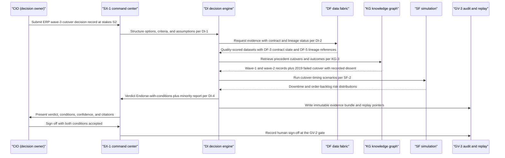
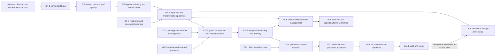

# CIO & CDO perspective

## 1. Front matter

| Field | Value |
|---|---|
| Doc ID | PERS-CIO-CDO |
| Role | Chief Information Officer & Chief Data Officer (combined office) |
| Owning unit | U14 Perspective CIO & CDO |
| Pillars referenced | DF (DF-1…DF-7), KG (KG-1…KG-6), MI-6, GA-3, DI-1, DI-2, DI-8, SF-2, SF-6, SX-5, GV-2, GV-3, GV-5, SC-1, SC-2, SC-4, PL-1, PL-6, PL-7, AD-3 |
| Version | 1.0 |

## 2. Role & mandate

This perspective combines the chief information officer and the chief data officer because, at Fortune-500 scale, these two accountabilities jointly decide TrueNorth's fate before any verdict is ever rendered. The CIO owns the systems TrueNorth must integrate with; the CDO owns the data that becomes its evidence. A decision-intelligence platform that cannot ingest reliably, prove where its facts came from, and account for what it costs to run is — from this office's chair — just another tool that demos well against three clean sources and dies against the real estate.

The estate this office is accountable for is not a diagram; it is an archaeology. It typically includes one or more ERP cores carrying decades of customization — thousands of bespoke tables, user exits, and batch jobs that nobody fully inventories but the business depends on daily — plus CRM, HRIS, PLM, MES instances at dozens of plants, ITSM, procurement, treasury, and a long tail of several hundred departmental SaaS products. Around it sits the integration layer: iPaaS, EDI with suppliers and dealers, message buses, and nightly file drops the business swore were temporary in 2009. On the data side, the office owns the lakehouse and warehouse marts, the master-data hubs for customer, supplier, material, and employee, the enterprise catalog, data quality tooling, the stewardship council, residency compliance, retention and deletion execution, and the data feeding regulatory reporting. Finally, the office answers for IT run cost and the vendor portfolio — every renewal, every exit clause, every lock-in risk.

The mandate toward TrueNorth is therefore double-edged. On one edge, this office is TrueNorth's most important supplier: nothing in the knowledge graph or the evidence chain exists unless connectors, contracts, and pipelines deliver it. On the other edge, this office is TrueNorth's most exposed customer: every gap in lineage, every quietly degraded feed, every unmetered cost spike lands on the CIO's desk as an audit finding, an outage, or a budget overrun. Integration burden is where enterprise software goes to die, and this office has buried enough platforms to know the pattern.

Success in three years, if TrueNorth works, looks like this: every evidence citation in an S1 or S2 verdict resolves to a governed source field that an external auditor can walk unaided; onboarding a new governed source takes days on a paved road, not months of professional services; data quality on the top critical datasets visibly improves because verdict confidence depends on it and the business finally feels quality as a first-order cost; run cost is metered per department, per pillar, and per decision, and chargeback disputes shrink; no second system of record has emerged; and audit evidence preparation that used to take weeks takes hours. The platform will be judged on its hundredth connector, not its first.

## 3. Decisions I face today

I sign off, directly or through delegation, on every pipe into and out of this company's systems, every authoritative definition of customer, supplier, material, and employee, and a nine-figure run budget. These are the decisions that fill my calendar now, before TrueNorth exists here.

| Decision | Cadence | Stakes | Current pain |
|---|---|---|---|
| Approve or deny new SaaS and integration requests from departments | Weekly | S3 | Requests arrive with no data contract and no view of overlap with tools we already own; approval is a security checklist plus gut feel |
| Sequence ERP modernization waves against business calendars | Quarterly | S2 | Dependency mapping is manual; nobody can state with confidence which custom objects are actually used, by whom, for what |
| Choose build vs buy for connectors to legacy and bespoke systems | Monthly | S3 | Vendor claims of ERP support hide our customized reality; effort estimates are folklore |
| Arbitrate master-data ownership disputes across business units | Monthly | S3 | Stewards argue from spreadsheets; there is no shared evidence of what downstream breakage actually costs |
| Grant or refuse cross-department data access requests | Weekly | S3–S4 | Entitlement decisions lack purpose context, so I either over-grant or impose weeks of delay |
| Set retention and deletion execution across the estate | Quarterly | S2 | Legal policy exists on paper; provable execution across hundreds of systems does not |
| Allocate run cost and chargeback for shared data platforms | Monthly | S3 | Cloud and AI spend is visible only in aggregate; every allocation is disputed |
| Prioritize major-incident response and decommissioning actions | Ad hoc | S2–S3 | Blast-radius assessment depends on tribal knowledge of undocumented integrations |
| Renew, consolidate, or exit data and integration vendors | Quarterly | S2–S3 | Switching costs are estimated by anecdote; exit clauses are untested until it is too late |
| Approve each expansion of TrueNorth's own ingestion scope | Weekly | S3 | Every new source enlarges my audit and cost surface; I need contract-first onboarding, not enthusiasm-first |

## 4. Jobs-to-be-done

Ranked by importance to this office.

1. **JTBD-1** — When TrueNorth proposes ingesting a new source, I want contract-first onboarding with declared freshness SLAs, schema versioning, and explicit failure semantics, so I can approve in days without commissioning a bespoke integration project.
2. **JTBD-2** — When an auditor or regulator challenges a verdict's evidence, I want field-level lineage from source system to recommendation citation, so I can produce a defensible trace in hours instead of mounting a forensic reconstruction.
3. **JTBD-3** — When upstream data quality degrades, I want automatic quarantine and visible confidence degradation on every downstream verdict, so bad data never silently becomes a confident recommendation.
4. **JTBD-4** — When systems disagree about a customer, supplier, or material, I want TrueNorth to defer to mastered golden records and route conflicts to my stewards, so the platform reinforces master-data discipline instead of inventing a rival resolution.
5. **JTBD-5** — When a support pack or customization change alters the ERP, I want connector regression detection before business users see wrong evidence, so my team is not debugging the platform's blind spots at quarter close.
6. **JTBD-6** — When finance asks what TrueNorth costs to run, I want metering by tenant, department, pillar, and decision, so chargeback is arithmetic rather than negotiation.
7. **JTBD-7** — When residency or sovereignty rules differ by jurisdiction, I want routing and pinning controls that align with commitments already made to regulators, so deployment review does not reopen settled legal positions.
8. **JTBD-8** — When a department starts feeding TrueNorth through a side channel, I want detection plus an attractive paved road, so shadow ingestion dies of inconvenience rather than enforcement.
9. **JTBD-9** — When I plan to retire or replace a system, I want catalog-driven impact analysis showing every TrueNorth dependency on it, so decommissioning decisions stop relying on tribal memory.
10. **JTBD-10** — When TrueNorth extracts claims from meetings and documents, I want every fact in the graph labeled by provenance class and confidence, so AI-derived assertions never masquerade as system-of-record data.

## 5. A day with TrueNorth

06:45. The data health digest is the first thing I read, before email. Forty-one contracted sources green, two amber. The supplier-risk feed has slipped its freshness window twice this week, and the digest shows me — without my asking — the fourteen open verdicts whose confidence was marked degraded because they cite it. That label is the difference between a platform I trust and one I unplug: when an input goes bad, the output says so.

08:30. Stewardship council. The curation queue has flagged a contested supplier merge: the procurement system and the quality system disagree on whether two entities in Monterrey are the same vendor. TrueNorth did not auto-merge; it deferred to our master-data hub, found no golden record, and routed the conflict to the steward with both lineage trails attached. Twenty minutes, resolved, and the decision is recorded so the next dedupe of this kind cites it as precedent. A year ago this argument would have lived in a spreadsheet for a month.

10:00. An external market feed gets its source-reliability score downgraded after two retracted reports. The platform quarantines new items from it pending review and annotates affected evidence. I approve the quarantine and note, with some satisfaction, that an external signal cannot outrank governed internal data no matter how dramatic its headline.

13:00. The decision that matters today is mine: cut over plant 7 to the new ERP template in wave 3, or defer a quarter. Yesterday's steering meeting was captured, and the extraction surfaced the options, the owners, and — importantly — the logistics lead's recorded dissent about peak-season timing. I submit the structured decision record at stakes S2. TrueNorth assembles evidence with contract and lineage status shown per citation: cutover defect rates from waves 1 and 2, the 2019 cutover that went badly and why, current integration test coverage on the custom EDI flows, and scenario runs on downtime and order-backlog risk under both timings. Ninety minutes later: Endorse-with-conditions, confidence 0.74. Condition one, freeze custom-object changes four weeks before cutover. Condition two, dual-run the supplier EDI flows for two weeks. The minority report argues for deferral on peak-season grounds — essentially the logistics lead's dissent, sharpened with the 2019 precedent. I accept the verdict with both conditions, sign off at the gate, and the whole bundle — evidence, reasoning, my signature — lands in the immutable log.

16:00. Run-cost review. Metering shows one department's embedding refresh jobs tripled this month; the platform attributes it to a workbench team re-indexing a document corpus nightly when weekly would do. I send the report, not an accusation — the numbers argue for themselves. Chargeback closes in one meeting instead of three.

Quarter close. An external auditor samples a finance verdict and asks where a cited cost figure originated. The lineage view walks from the citation back through transformation steps to the source field and the contract version in force on the as-of date. Eleven minutes. Last year, that answer took my team nine days. That is the day I stopped regarding TrueNorth as another integration liability and started regarding it as the first system that pays rent on the estate it lives in.

## 6. Feature requirements I own

No owned workbench. This office mints no feature IDs; its needs map almost entirely onto the canonical capability groups of the Data & Integration Fabric (DF) and the Organizational Knowledge Graph (KG), with supporting dependencies on governance, security, and platform economics. Those capabilities are specified in their catalog documents; this section instead diagrams the cross-pillar dependency chain this office cares about most — the **source-to-citation chain** — because it is the spine on which every audit answer, every quality guarantee, and every cost allocation this office must defend ultimately hangs.

The reading of the diagram is deliberate. Nothing enters the platform except through versioned connectors (DF-1) governed by enforceable contracts (DF-3); privacy filtering (DF-4) runs before persistence so ungoverned copies never exist; residency routing (DF-6) constrains where pipelines (DF-2) may run; everything that lands is cataloged with lineage (DF-5). Graph construction (KG-2) is bounded by the managed ontology (KG-1) and corrected by steward curation (KG-5); temporal versioning (KG-3) preserves what was known when; retrieval (KG-4) is gated by entitlements (SC-1). Only then does evidence assembly (DI-2) and synthesis (DI-4) occur, with audit and replay (GV-3) resolving back through lineage to source fields. Cost observability (PL-6) meters the whole chain. A failure at any hop is not a partial failure — it invalidates every link downstream of it, which is why this office insists the chain be engineered as one accountable system rather than twelve features that happen to be adjacent.

## 7. Cross-pillar needs

| Need | Depends on |
|---|---|
| Prebuilt, versioned connectors that declare their coverage of customized ERP objects and offer a supported extension path for bespoke fields and legacy EDI | DF-1 |
| Batch, CDC, and streaming ingestion that honors source-system load windows and never degrades production OLTP performance | DF-2 |
| Enforceable data contracts with freshness and quality SLAs, anomaly quarantine, and published per-dataset quality scores | DF-3 |
| PII redaction, purpose tagging, and minimization applied before persistence so no ungoverned copy ever exists downstream | DF-4 |
| Field-level lineage from source field to recommendation citation that an external auditor can walk without engineering assistance | DF-5 |
| Region pinning and cross-border transfer controls that match residency commitments already made to regulators | DF-6 |
| Source-reliability scoring on external feeds so market and news signals never carry system-of-record evidentiary weight | DF-7 |
| Versioned tenant ontology extensions so company-specific structures survive product upgrades without remapping projects | KG-1 |
| Entity resolution that defers to master-data golden records and routes conflicts to stewards rather than auto-merging | KG-2 |
| Bitemporal as-of queries so the office can reconstruct exactly what the platform knew when any verdict was issued | KG-3 |
| Permission-aware retrieval that mirrors source-system entitlements with a stated, bounded synchronization latency | KG-4 |
| Steward validation queues and contested-fact workflows that plug into the existing data governance council rather than replacing it | KG-5 |
| Reporting lines, decision rights, and committee structures sourced from systems the CIO already maintains, never re-keyed by hand | KG-6 |
| Recording retention and consent controls consistent with the corporate retention schedule the office must execute | MI-6 |
| Goal and metric bindings that read from governed warehouse marts rather than ad hoc extracts | GA-3 |
| Data-platform decisions — vendor exits, migration waves, MDM rulings — captured as first-class decision records | DI-1 |
| Evidence assembly that displays contract status and lineage completeness for every citation it presents | DI-2 |
| Outcome tracking on the office's own decisions so future migrations inherit precedent instead of folklore | DI-8 |
| Forecast accuracy reporting so model-derived evidence can be challenged with its own track record | SF-6 |
| Stakes-tiered sign-off gates that respect the company's existing change-approval authority for IT decisions | GV-2 |
| Immutable audit and replay that covers ingestion and retrieval events, not only verdict issuance | GV-3 |
| GDPR and sectoral compliance packs mapped onto the data categories already defined in the enterprise catalog | GV-5 |
| SSO, SCIM provisioning, and decision-rights-aware authorization federated with the existing identity provider | SC-1 |
| BYOK encryption and classification-aware retrieval that honors existing data classification labels | SC-2 |
| VPC, on-prem, and air-gapped deployment isolation that satisfies sovereign-cloud commitments | SC-4 |
| Metering of compute, storage, and model spend by tenant, department, pillar, and decision record | PL-6 |
| Disaster recovery and multi-region posture mapped to the corporate RTO and RPO tiers | PL-7 |
| APIs and webhooks that join the integration landscape under iPaaS governance instead of routing around it | SX-5 |
| Usage analytics that surface shadow workflows forming around or beside the product | AD-3 |

## 8. Red lines & veto conditions

These are the conditions under which this office would veto procurement, freeze ingestion, or shut the platform off. They are written as bright lines because ambiguity here is how shadow systems are born.

1. **A second system of record.** TrueNorth shall never hold the authoritative copy of master or transactional data. The moment business users quote a TrueNorth number against the ERP number and TrueNorth wins by default, the platform has become a rival ledger, and this office will disconnect it. Every fact must carry a provenance class that names its system of record, and the product's own surfaces must say so.
2. **Contract-less ingestion.** No source is onboarded without a data contract under DF-3. No screen scraping, no RPA against production user interfaces, no direct credentials to production OLTP databases. A connector that cannot state its failure semantics does not get a network path.
3. **Entitlement bypass.** If permission-aware retrieval (KG-4) ever returns content to a user who cannot see that content in the source system, the platform is shut off for the affected scope until the failure is root-caused and the exposure window is quantified. This is non-negotiable and not subject to a risk-acceptance discussion.
4. **Unmetered run cost.** Spend that cannot be attributed by department and pillar through PL-6 is treated as a defect. Sustained unattributable cost growth triggers an ingestion freeze; this office has watched consumption-priced platforms eat budgets through opacity before.
5. **Lineage gaps on high-stakes citations.** Any S1 or S2 verdict carrying a citation that cannot be traced to a governed source field via DF-5 is invalid for audit purposes, and the office will say so to the auditor rather than defend it.
6. **AI-derived facts masquerading as records.** Claims extracted from meetings or documents that enter the graph without provenance class and confidence labeling are contamination, not enrichment. One confidently wrong "fact" laundered into an executive verdict will cost the platform a year of credibility.
7. **Write-back beyond annotations.** TrueNorth shall not write to systems of record except into explicitly governed, fully logged annotation fields. No "helpful" updates to master data, ever.
8. **Lock-in without exit.** The knowledge graph, decision records, and audit logs must be exportable in documented open formats with proven restore. Absent a tested exit, no S1-tier business dependence on the platform is permitted.
9. **Shadow ingestion side doors.** Department-level upload paths that bypass catalog registration and contract enforcement will be closed, and if the product makes them easier than the paved road, that is a product defect this office will escalate to the vendor's executives.

## 9. Adoption & workflow integration

What this office would actually change: the weekly data health review re-platforms onto contract and quality views (DF-3, DF-5) instead of hand-built dashboards; the stewardship council works the curation queues (KG-5) as its primary backlog; integration intake becomes contract-first, with TrueNorth onboarding requests handled through the same paved road as everything else; chargeback runs off platform metering (PL-6); and the office's own significant decisions — migration sequencing, vendor exits, master-data rulings — are submitted as decision records (DI-1) both to get the evaluation and, frankly, to build the precedent base (DI-8) the next CIO will inherit.

What would be ignored, at least initially: conversational interfaces for casual queries — this office's staff live in the catalog, the pipeline tooling, and the ticket queue, and will adopt chat surfaces only after the underlying answers prove trustworthy; generic executive dashboards that duplicate existing observability; and any recommendation feature aimed at routine S4 operational choices inside IT, where existing runbooks are faster.

What must never be required: re-keying metadata, org structures, or entitlements that already exist in the catalog, the HR system, or the identity provider — the platform reads them or it does without; manual remapping of tenant ontology extensions after product upgrades; migration onto a vendor-preferred lakehouse as a precondition of ingestion; per-connector professional-services engagements as the normal onboarding path; and attendance at vendor ceremonies to keep connectors alive. The integration tax must fall over time, and the office will measure whether it does.

The realistic adoption sequence this office would sponsor: start with read-only ingestion of five contracted sources and lineage proof on one audited report; expand to the meeting and decision-capture loop for the IT steering committee itself; then, only after two clean quarters of SLA adherence and one clean audit walk, open department-by-department expansion with cost metering visible from day one of each wave.

## 10. Success metrics & value model

This office will not fund TrueNorth on the strength of "better decisions" claims alone; the value case must stand partly on hard infrastructure economics it can defend in a budget review.

| Metric | Target / direction | Why it matters here |
|---|---|---|
| Connector SLA adherence | ≥ 99% of contracted freshness windows met monthly | The single best predictor of downstream trust |
| Time to onboard a new governed source | ≤ 10 business days for catalog-registered sources | Measures whether the paved road is real |
| Citations with complete source-field lineage | 100% for S1/S2 verdicts; ≥ 95% overall | Audit defensibility is binary at high stakes |
| Quality score trend, top-50 critical datasets | Improving quarter over quarter | The platform should make quality a felt cost, not a slide |
| Master-data conflict backlog and time-to-resolution | Backlog shrinking; median resolution ≤ 5 days | Tests whether KG-2 reinforces or undermines MDM discipline |
| Run cost per active decision record and per department | Stable or declining unit cost | Consumption platforms drift; this is the leash |
| Audit evidence preparation time | ≥ 80% reduction against pre-TrueNorth baseline | Direct, bankable labor saving |
| Unsanctioned data tools and side-channel feeds detected | Declining count | The shadow-IT thermometer |
| Integration backlog age | Median age declining | The estate should get more governable, not less |

Leading indicators in the first two quarters: steward queue throughput (are the curation loops actually being worked), the ratio of contract-first to exception onboarding requests, and the fraction of verdicts displaying degraded-confidence labels during source incidents (a healthy nonzero number — zero means the labeling is not working).

The payback logic, in the order this office would present it to the CFO: integration cost avoidance, as each paved-road source onboarding replaces a bespoke point integration with its own multi-year maintenance tail; audit and compliance labor reduction from lineage-backed evidence; decommissioning gains, because catalog-and-lineage truth about what is actually used finally makes retirement decisions safe; incident cost reduction from accurate blast-radius analysis; and only then the decision-quality dividend, counted conservatively via outcome tracking (DI-8) rather than asserted. If the first four do not cover a meaningful share of run cost by year two, the platform is over-scoped for this estate.

## 11. Hard questions for the build team

1. **HQ-1** — When an ERP support pack breaks a connector at 02:00 on quarter-close weekend, whose pager rings, what is the contractual restore SLA, and where is that written?
2. **HQ-2** — What fraction of DF-1 coverage claims survives first contact with thousands of custom objects, user exits, and bespoke EDI — and who pays for the mapping gap the sales demo did not mention?
3. **HQ-3** — What are the restatement semantics when source data is corrected after a verdict ships: is the verdict flagged, recomputed, or merely annotated, and who is notified?
4. **HQ-4** — What is the realistic storage and compute envelope for bitemporal history (KG-3) at billions of edges over a decade, and how does the commercial model absorb that growth?
5. **HQ-5** — Under exactly what conditions can a meeting-derived claim outrank a system-of-record value in evidence assembly (DI-2), and where is that precedence rule documented and testable?
6. **HQ-6** — When the product upgrades, who migrates, tests, and rolls back versioned tenant ontology extensions (KG-1) — the vendor, the tenant, or a services invoice?
7. **HQ-7** — What is the documented exit: export formats for graph, decision records, and audit logs, dependence on proprietary embeddings, and demonstrated time-to-restore on independent infrastructure?
8. **HQ-8** — When the model gateway (PL-1) swaps or upgrades models, who pays for re-embedding and retrieval revalidation, and how is regression caught before business users see it?
9. **HQ-9** — How do air-gapped deployments receive connector updates and external signals (DF-7) — at what cadence, over what medium, with what validation?
10. **HQ-10** — What is the guaranteed maximum staleness between an entitlement revocation in the identity provider (SC-1) and its enforcement in retrieval (KG-4), and what compensating control covers the window?
11. **HQ-11** — During a prolonged source outage, does the platform label evidence stale, suppress affected verdicts, or degrade silently — and who chose that default?
12. **HQ-12** — What prevents a department from using the API platform (SX-5) to assemble a shadow decision flow that bypasses governance gates, and how would this office detect it within a week?

## 12. Dependencies & references

| Reference | Type | Why |
|---|---|---|
| DF-1, DF-2, DF-3, DF-4, DF-5, DF-6, DF-7 | Canonical L2 | Primary dependency surface: connectors, pipelines, contracts, privacy, lineage, residency, external signals |
| KG-1, KG-2, KG-3, KG-4, KG-5, KG-6 | Canonical L2 | Ontology, entity resolution, temporal memory, governed retrieval, curation, org model |
| MI-6 | Canonical L2 | Recording retention and consent execution this office must evidence |
| GA-3 | Canonical L2 | Metric bindings must read from governed marts |
| DI-1, DI-2, DI-8 | Canonical L2 | Decision records for IT decisions; lineage-visible evidence; outcome precedent |
| SF-2, SF-6 | Canonical L2 | Migration scenario runs; forecast accuracy accountability |
| GV-2, GV-3, GV-5 | Canonical L2 | Sign-off gates, audit and replay, compliance packs |
| SC-1, SC-2, SC-4 | Canonical L2 | Entitlements, encryption and classification, deployment isolation |
| PL-1, PL-6, PL-7 | Canonical L2 | Model change management, cost metering, DR posture |
| SX-5 | Canonical L2 | API governance within the integration landscape |
| AD-3 | Canonical L2 | Shadow-usage detection |
| Catalog DF+KG | Work unit | Specifies the capability groups this office depends on most |
| Catalog DI+SF | Work unit | Specifies evidence assembly, outcome tracking, and simulation |
| Catalog GV | Work unit | Specifies audit, replay, and regulatory packs |
| Catalog SC | Work unit | Specifies entitlement, encryption, and isolation behavior |
| Catalog PL+AD | Work unit | Specifies metering, reliability, and usage analytics |
| Catalog MI+GA | Work unit | Specifies retention controls and metric binding |
| Catalog SX+WB-0 | Work unit | Specifies the API and extension platform |
| Architecture C4 L4 | Work unit | Data schemas and API surface this office must review for contract fit |
| Perspective CTO | Work unit | Adjacent infrastructure and build-vs-buy perspective |
| Perspective CISO | Work unit | Shared red lines on entitlements and isolation |
| Roadmap & Delivery | Work unit | Connector wave sequencing and TCO assumptions |
