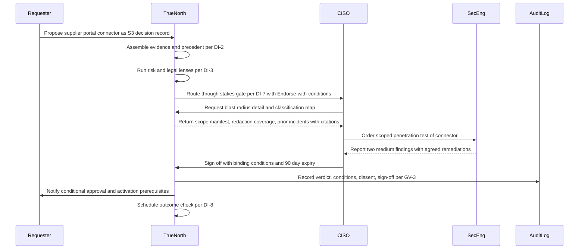
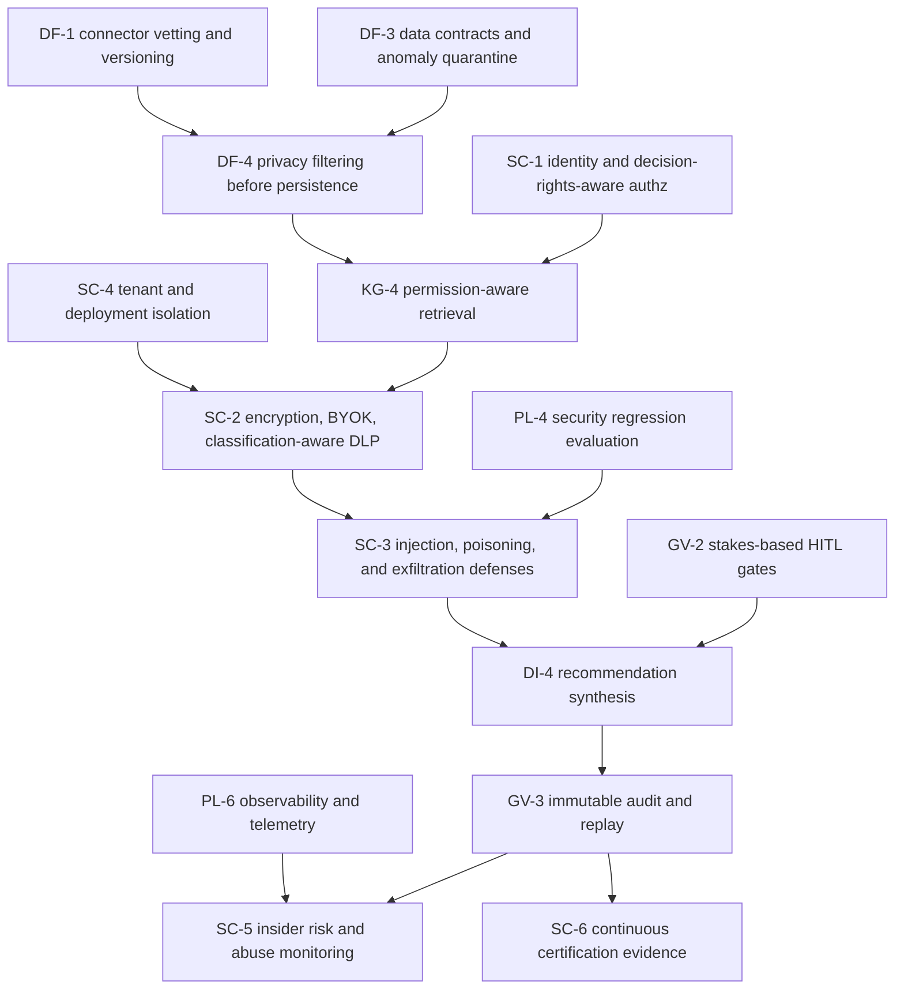

# CISO perspective

## 1. Front matter

| Field | Value |
|---|---|
| Doc ID | PERS-CISO |
| Role | Chief Information Security Officer |
| Owning unit | U15 Perspective CISO |
| Pillars referenced | SC-1, SC-2, SC-3, SC-4, SC-5, SC-6; GV-1, GV-2, GV-3, GV-4, GV-5, GV-6, GV-7; DF-1, DF-3, DF-4, DF-6; KG-3, KG-4; MI-6; DI-2, DI-3, DI-7, DI-8; SF-5; PL-1, PL-4, PL-5, PL-6, PL-7; SX-2, SX-5; AD-3 |
| Version | 1.0 |

## 2. Role & mandate

The CISO is accountable for the confidentiality, integrity, and availability of the company's information assets, for the security architecture of every system that processes them, and for the defensibility of those choices in front of the board, regulators, cyber insurers, and — after an incident — opposing counsel. The CISO owns the corporate threat model, the security operations center, identity and access policy, incident response, third-party and supply-chain risk, and the certification portfolio that customers and auditors demand.

TrueNorth changes the shape of that job. Most enterprise systems hold a slice of the company's sensitive material; TrueNorth's entire value proposition is the deliberate concentration of all of it. Strategy and board deliberation, M&A pipeline activity that is material non-public information, recorded dissent and minority reports, pre-decisional reasoning, workforce and compensation plans consulted by lenses, supplier vulnerabilities, litigation posture, and the genealogy of every consequential decision the company has made — all of it linked, indexed, and queryable in natural language by anyone holding a valid credential. From a defender's chair, the organizational knowledge graph is the single most valuable target the company has ever assembled, and the conversational surface turns exfiltration from a technical exercise into the act of asking good questions. The CISO's working assumption is therefore fixed: TrueNorth will be targeted by the most capable adversaries the company faces, an unmitigated compromise is an existential (S1) event, and the platform must be engineered, certified, and operated accordingly.

Three adversary classes drive the requirements in this document.

**External attackers.** Nation-state and organized-crime actors for whom a single successful intrusion yields the strategy, M&A, and negotiation material that would otherwise require years of espionage. Primary vectors: credential theft and session hijacking against SC-1 surfaces, compromise of the connector supply chain (DF-1), compromise of upstream model providers or their APIs (PL-1), and exploitation of the marketplace and extension surface (SX-5).

**Insiders.** Curious employees probing beyond their need-to-know through the assistant; departing executives bulk-harvesting institutional memory in their final weeks; administrators whose infrastructure access bypasses application-layer controls; coerced or compromised insiders acting for an external sponsor. The red lines on individual surveillance scoring are accepted and endorsed — but they make behavioral anomaly detection (SC-5) one of the few lawful instruments left, so it must be excellent.

**AI-specific vectors.** Prompt injection carried in ingested documents, meeting transcripts, emails, and external feeds, instructing the engine to alter verdicts or disclose content; retrieval poisoning, in which an adversary plants plausible falsehoods into sources the knowledge graph trusts so that future recommendations are steered (SC-3, DF-3); exfiltration through generated outputs, where a model is induced to summarize or paraphrase material the viewer is not entitled to see, defeating perimeter DLP because the secret leaves as a fluent sentence rather than a file; cross-tenant and cross-enclave leakage through shared models, caches, or embedding stores (SC-4); and memorization risk in fine-tuning, where tenant secrets become weights (PL-5).

With respect to TrueNorth specifically, the CISO is the accountable authority for granting, scoping, conditioning, and revoking the platform's authority to operate. Success in three years looks like this: TrueNorth operating at full data scope under continuously verified controls; zero material security incidents attributable to the platform; security review embedded as a routine lens inside decision flows rather than bolted on after them; the certification portfolio (SC-6) maintained with automated evidence collection; and a tested, rehearsed kill switch that has never been needed in anger.

## 3. Decisions I face today

I make or co-sign the following decisions today, and each one becomes harder — and higher-stakes — once TrueNorth is in scope.

| Decision | Cadence | Stakes | Current pain |
|---|---|---|---|
| Grant, expand, or revoke TrueNorth's authority to operate over a data domain | Quarterly | S2 | No precedent for a system whose blast radius is "everything"; risk assessments are manual and stale within weeks |
| Approve a new connector or integration into a sensitive system of record | Weekly | S3 | Vendor questionnaires are theater; I cannot see actual data flows or scope creep after go-live |
| Declare and run incident response for suspected prompt injection, poisoning, or output exfiltration | Episodic | S1–S2 | No playbooks exist for AI-native incidents; forensics tooling assumes files moved, not sentences generated |
| Adjudicate security exception requests (retrieval scope overrides, expedited access) | Weekly | S3–S4 | Exceptions accumulate silently and never expire; nobody tracks aggregate exposure |
| Accept or reject model-provider and AI supply-chain risk | Quarterly | S2 | Model providers disclose little; provider changes ship without notice or security regression evidence |
| Set certification scope and pass external audits (SOC 2, ISO 27001/42001, FedRAMP where applicable) | Annual | S2 | Evidence collection consumes hundreds of engineer-hours; AI-specific controls have no settled audit norms |
| Escalate or close insider-risk investigations within red-line constraints | Monthly | S2–S3 | Signals are fragmented across systems; lawful basis for each investigative step must be documented by hand |
| Approve compartmentation design for board, M&A, and dissent material | Quarterly | S2 | Enclave boundaries erode under business pressure; no technical enforcement of need-to-know in search tools |
| Decide breach notification and disclosure posture with legal | Episodic | S1 | Without reliable audit of what was actually retrieved and generated, I must over-disclose or gamble |
| Allocate security budget across detection, isolation, and assurance | Annual | S3 | I cannot quantify how much risk each control retires; spend follows fear, not evidence |

## 4. Jobs-to-be-done

Ranked by importance.

- **JTBD-1.** When any user receives a generated answer or recommendation, I want entitlement enforcement applied at retrieval time against that viewer's identity, so I can guarantee the model never synthesizes from content the viewer could not lawfully open directly.
- **JTBD-2.** When TrueNorth requests access to a new data domain or connector, I want a quantified blast-radius and classification assessment before activation, so I can scope its authority to operate deliberately instead of discovering exposure after the fact.
- **JTBD-3.** When ingested content carries adversarial instructions or implausible facts, I want detection, quarantine, and provenance flagging before persistence, so prompt injection and retrieval poisoning cannot silently steer verdicts.
- **JTBD-4.** When a security incident is declared, I want immutable, replayable records of every retrieval, prompt, and generation involved, so I can reconstruct exactly what an attacker or insider saw and bound disclosure obligations precisely.
- **JTBD-5.** When an identity queries in patterns inconsistent with its role — breadth, volume, sensitivity, or timing — I want risk-based detection and step-up friction that targets behavior rather than scoring individuals, so exfiltration-by-questioning is caught without violating red lines.
- **JTBD-6.** When the company deploys TrueNorth, I want hard tenant isolation and customer-held keys in every deployment model, so a compromise of the vendor is not automatically a compromise of us.
- **JTBD-7.** When board, M&A, or dissent material enters the knowledge graph, I want compartmented enclaves with explicit membership and no cross-enclave inference, so the most explosive material keeps a need-to-know boundary even inside the graph.
- **JTBD-8.** When a model, prompt template, or provider changes, I want security regression evaluation gates before promotion to production, so yesterday's injection defenses are not silently undone by today's upgrade.
- **JTBD-9.** When auditors arrive, I want control evidence generated continuously from the platform's own telemetry and mapped to certification frameworks, so audit season stops consuming my engineering capacity.
- **JTBD-10.** When generated outputs leave the platform — exports, API responses, plugin messages, notifications — I want classification-aware inspection of that egress, so the answer channel does not become the exfiltration channel.
- **JTBD-11.** When a third-party connector or marketplace extension updates, I want integrity verification and a reviewable change manifest before the new version touches data, so supply-chain compromise is caught at the gate.
- **JTBD-12.** When I face my own security decisions — vendor acceptance, exception approval, architecture trade-offs — I want them captured as decision records with evidence and outcome tracking, so security governance benefits from the same rigor TrueNorth gives everyone else.

## 5. A day with TrueNorth

07:40. I open the overnight digest. Three anomaly flags from abuse monitoring: two are service accounts retried after a token rotation — closed with a note. The third is a finance analyst whose query breadth tripled in a week, touching supplier-risk material outside her cost-center scope. The system has already applied step-up authentication and shows me the policy basis for each step it took; nothing about the person, everything about the behavior. I assign it to the insider-risk lead with a documented lawful basis attached. Ten minutes, fully evidenced. A year ago this was a week of log archaeology.

09:00. My approval queue holds an S3 decision routed to me through the stakes gate: operations wants a new connector to a supplier quality portal. TrueNorth has already assembled the evidence — the connector's scope manifest, the classification map of fields it will touch, redaction coverage at ingestion, and three precedents including a 2024 incident at a peer firm ingested from external feeds. The risk lens returned Endorse-with-conditions: scope the credential to read-only, exclude two free-text defect fields until redaction is verified, and re-review in 90 days. I agree with the verdict but not the gap: I order a scoped penetration test of the connector before activation. The condition is recorded against the decision, and the system will not let activation proceed until the test result is attached. I did not write a single email to enforce that.

11:30. Tabletop exercise. We run a war-game: an adversary has poisoned the graph with a fabricated supplier insolvency signal to push a sourcing decision toward their preferred vendor. The simulation propagates the planted fact and shows me which downstream verdicts would have cited it, how the contested-fact queue would have surfaced the conflict, and where our detection actually fires. Two gaps go on the remediation register as decision records with owners and dates.

14:00. Quarterly authority-to-operate review, the meeting I prepare hardest for. Corporate development wants the M&A pipeline enclave expanded to include integration-planning material. I walk the board-level summary TrueNorth prepared: current enclave membership, every access in the last quarter with purpose tags, zero cross-enclave inference events, and the residual-risk delta of the expansion. I grant it with two conditions — membership attestation every 30 days and an egress block on any generated output containing enclave material leaving to mobile surfaces. Both conditions become machine-enforced policy, not bullet points in minutes.

16:30. The external auditors' portal request lands. Last year this kicked off a six-week evidence scramble. Now I review the continuously collected control evidence mapped to our SOC 2 and ISO 42001 criteria, spot-check four artifacts against raw logs myself — trust, then verify — and release the package. I am home by seven, and I know, rather than hope, what the system disclosed to whom today.

The sequence below shows the 09:00 connector decision end to end.

## 6. Feature requirements I own

No owned workbench. The CISO mints no feature IDs; every capability this perspective requires is canonical to the SC and GV pillars, with supporting dependencies in DF, KG, MI, DI, PL, and SX, and is cited — not specified — in section 7.

What the CISO does own is an assurance argument: a chain of controls that must hold end to end for an authority to operate to be granted. The chain below is the top cross-pillar dependency path this perspective depends on. Reading top to bottom: nothing enters the graph except through vetted connectors and pre-persistence minimization; nothing is retrieved except through identity-bound, classification-aware retrieval; nothing reaches a model without AI-specific threat controls; nothing is generated for a human without human-in-the-loop gates at the stakes tier; and everything that happens is immutably recorded, monitored for abuse, and converted into certification evidence. A break at any link invalidates every link below it — which is why the CISO evaluates TrueNorth as a chain, not as a feature list.

## 7. Cross-pillar needs

| Need | Depends on |
|---|---|
| Single sign-on, SCIM-driven lifecycle, and authorization that understands decision rights, so entitlements track the org in near real time | SC-1 |
| Encryption everywhere, customer-held keys, and retrieval that respects data classification so sensitive material is protected in use, not just at rest | SC-2 |
| Purpose-built defenses against prompt injection, retrieval poisoning, and exfiltration through generated outputs | SC-3 |
| Hard isolation options across SaaS, VPC, on-prem, and air-gapped deployments with no shared-fate components for regulated workloads | SC-4 |
| Behavioral abuse and insider-risk monitoring that detects anomalous access patterns without individual surveillance scoring | SC-5 |
| SOC 2, ISO 27001, ISO 42001, and FedRAMP certification with continuously collected, auditor-consumable evidence | SC-6 |
| The decision-rights matrix encoded as enforceable policy so security approvals cannot be routed around | GV-1 |
| Human-in-the-loop gates scaled to stakes tiers so no S1 or S2 action completes on machine authority alone | GV-2 |
| Immutable, replayable audit of every retrieval, prompt, generation, and sign-off for forensics and disclosure decisions | GV-3 |
| Explainability sufficient for an investigator to trace any verdict to its evidence during an incident | GV-4 |
| Regulatory compliance packs so security controls map cleanly to EU AI Act, GDPR, and sectoral obligations | GV-5 |
| Ethics-board enforcement of prohibited uses so red lines are technical controls, not policy memos | GV-6 |
| Model risk management so model failures and drift are governed like any other operational risk | GV-7 |
| A vetted, versioned connector library so third-party integration risk is assessed once and re-verified on every update | DF-1 |
| Data contracts with anomaly quarantine so poisoned or malformed sources are held out of the graph pending review | DF-3 |
| PII redaction and minimization applied before persistence so the graph never stores what it does not need | DF-4 |
| Residency and sovereignty routing so cross-border transfer controls are enforced by the platform, not by procedure | DF-6 |
| Bitemporal versioning and retention so investigators can reconstruct graph state as of any incident date | KG-3 |
| Permission-aware semantic retrieval so generation is grounded only in content the requesting identity may access | KG-4 |
| Per-jurisdiction consent, off-the-record zones, and retention governance for meeting capture | MI-6 |
| Evidence and precedent assembly so the CISO's own risk decisions arrive with citations and prior outcomes | DI-2 |
| A risk lens contributing security assessments to every multi-lens evaluation | DI-3 |
| Stakes-tiered review workflows with an expedited path for security incidents | DI-7 |
| Outcome tracking so accepted risks and exceptions are revisited against what actually happened | DI-8 |
| War-gaming and crisis simulation to rehearse AI-native attack scenarios before adversaries run them live | SF-5 |
| Model gateway routing so provider exposure is controlled, logged, and substitutable by policy | PL-1 |
| Evaluation harness gates so security regressions block model and prompt promotion | PL-4 |
| Fine-tuning governance so tenant data used in adaptation cannot leak through model weights | PL-5 |
| Observability and telemetry feeding security monitoring at the platform layer | PL-6 |
| Multi-region disaster recovery that preserves key custody and isolation guarantees under failover | PL-7 |
| API, webhook, and marketplace controls so extensions are authenticated, scoped, and revocable | SX-5 |
| Usage analytics scoped to aggregate health so adoption measurement never becomes covert monitoring | AD-3 |

## 8. Red lines & veto conditions

The CISO will veto procurement, refuse an authority to operate, or order the kill switch pulled under the following conditions. These are positions, not preferences.

**Veto at procurement.**

- Any architecture in which authorization is applied to generated output after synthesis rather than to retrieval before it. Post-hoc filtering of model output is a screen door on a vault: the model has already read the secret, and paraphrase defeats string matching. Entitlement enforcement must bind at KG-4 retrieval against the requesting identity, with SC-2 classification awareness, or the platform is unacceptable for sensitive domains.
- Any multi-tenant design without a hard-isolation option — dedicated compute, storage, embedding stores, and caches — for regulated and high-sensitivity workloads (SC-4). Logical separation enforced solely in application code is insufficient for a system holding M&A material.
- No customer-held key option (SC-2). If the vendor can read the graph, the vendor's breach is the company's breach, and the company inherits every subpoena served on the vendor.
- Tenant data used to train or fine-tune models serving other customers, under any framing (PL-5). Opt-out is not acceptable; the default and only mode is no cross-tenant learning.
- Inability to deploy on-prem or air-gapped for the most sensitive enclaves when the business requires it (SC-4), including a credible story for model and signature updates across the air gap.
- No SOC 2 Type II and ISO 27001 at contract, with a funded, dated commitment to ISO 42001 (SC-6). A vendor asking to hold this material on a roadmap promise has not understood the asset.

**Veto at authority to operate.**

- No demonstrated red-team results against prompt injection, retrieval poisoning, and output exfiltration (SC-3), reproduced by the company's own testers, not just the vendor's slide deck.
- Audit logging (GV-3) that is mutable by platform administrators, incomplete across retrieval and generation, or unable to support as-of replay. If the record of what the system saw and said can be edited, no disclosure decision made on top of it is defensible.
- Security regression gates absent from the model and prompt promotion path (PL-4). A platform that can silently swap the model underneath my controls has no stable control surface at all.
- Connectors or marketplace extensions (DF-1, SX-5) that cannot present integrity verification and a change manifest before touching data.
- No tested kill switch: a rehearsed, role-gated mechanism to suspend ingestion, retrieval, or generation per domain within minutes, with a documented blast radius of its own.

**Shut-off triggers in operation.**

- Confirmed cross-enclave or cross-tenant leakage of any magnitude — a single sentence of M&A material in the wrong answer suspends the affected scope pending root cause.
- Evidence that abuse monitoring (SC-5) has been repurposed toward individual surveillance scoring or covert monitoring. The red lines protect employees, but they also protect the security program's legitimacy; the CISO will not run instruments that poison the trust the program depends on.
- Discovery of undisclosed subprocessors or model providers in the inference path (PL-1).
- A vendor security incident communicated to the public before it is communicated to the company.

## 9. Adoption & workflow integration

What changes in the CISO's week: exception and connector approvals move out of email and ticket queues into stakes-gated decision records (DI-7) with evidence attached on arrival, so each approval starts at the analysis rather than at the information-gathering. Quarterly risk reporting to the board is assembled from decision records and outcome data (DI-8) instead of hand-built slides. Audit preparation becomes review of continuously collected evidence (SC-6) rather than a seasonal evidence hunt. Incident response gains a forensic substrate — replayable retrieval and generation logs (GV-3) — that the team rehearses against in scheduled war-games (SF-5).

What the CISO will pilot deliberately before trusting: the risk lens (DI-3) as an input to the team's own assessments. It earns weight only as its track record accumulates; for the first year its verdicts are read as a well-prepared junior analyst's, checked rather than adopted.

What the CISO will ignore: productivity-flavored features that expand the security team's data exposure without a control payoff, and any dashboard that ranks people rather than risks.

What must never be required: TrueNorth must never sit in the critical path of incident response. When the platform itself is the suspected victim, responders need out-of-band runbooks, communications, and credentials that function with TrueNorth fully suspended. The kill switch cannot live solely inside the thing being killed. Likewise, no security control may exist only as TrueNorth policy with no underlying enforcement; the platform encodes and audits controls, it does not replace them.

Rollout posture: scope expands one data domain at a time, each expansion a recorded S2 decision with conditions, expiry, and an outcome check. The CISO's office runs adversarial testing against each new domain before and after activation, and twice yearly thereafter.

## 10. Success metrics & value model

The CISO measures TrueNorth on two ledgers: the risk it adds and the risk it retires. The platform pays for itself, in security terms, only if the second ledger demonstrably exceeds the first.

**Risk added — containment metrics.**

- Confirmed cross-tenant or cross-enclave leakage events: target zero; any event is board-reportable.
- Injection and poisoning attempts detected versus succeeded in red-team exercises (SC-3, PL-4): success rate trending to zero across releases, with no regression on model or prompt changes.
- Entitlement enforcement accuracy: zero confirmed instances of generation grounded in content outside the requester's entitlements (KG-4), validated by continuous sampled probes, not just incident absence.
- Percentage of egress channels (exports, APIs, plugins, notifications) covered by classification-aware inspection (SC-2, SX-5): 100 percent before full-scope ATO.
- Kill-switch drill performance: time from order to suspension of a domain, rehearsed quarterly, under 15 minutes.

**Risk retired — leverage metrics.**

- Mean time to detect and to scope insider-driven data access anomalies (SC-5, PL-6), against the pre-TrueNorth baseline.
- Forensic reconstruction time for a defined incident scenario using audit replay (GV-3): from weeks of log correlation to hours.
- Security exception half-life: percentage of exceptions with enforced expiry and completed outcome review (DI-7, DI-8); target 100 percent, against a current state near zero.
- Audit evidence effort: engineer-hours consumed per certification cycle (SC-6), with a target reduction above 60 percent by year two.
- Connector risk turnaround: elapsed time from integration request to conditioned approval, with evidence quality scored by the team.

**Leading indicators** that the program is healthy: ratio of security decisions captured as decision records rather than email threads; war-game findings closed before the same technique appears in the wild; calibration of the risk lens against the security team's own retrospective judgments.

**Payback logic.** The CISO does not claim revenue. The value model is avoided loss and reclaimed capacity: one materially faster incident scoping on a real event can exceed the platform's annual security cost; the certification-evidence and exception-hygiene savings are recurring and measurable; and the concentration risk is acceptable only while the containment ledger stays clean. If the containment metrics degrade, the leverage metrics do not matter — that asymmetry is the CISO's value model in one sentence.

## 11. Hard questions for the build team

- **HQ-1.** Where exactly in the pipeline is the viewer's entitlement enforced, and can the team prove a model can never attend to a token retrieved outside those entitlements — including through caches, embeddings, and conversation memory?
- **HQ-2.** What is the measured exfiltration bandwidth of the answer channel — how much restricted content per day could a patient, entitled-looking insider extract through plausible questions before SC-5 fires?
- **HQ-3.** How does the platform defend a verdict against retrieval poisoning that was planted months earlier in a trusted upstream source, and what is the recall procedure for every recommendation that cited the poisoned fact?
- **HQ-4.** Minority reports and recorded dissent are among the most explosive artifacts in the graph; who can query them, under what compartmentation, and what stops dissent records from becoming a target list after a leadership change?
- **HQ-5.** Can audit logs themselves leak secrets — do GV-3 records contain retrieved content verbatim, and if so, who guards the guards' archive?
- **HQ-6.** When BYOK keys must move during a PL-7 regional failover, who holds custody at each instant, and has the team rehearsed key revocation mid-failover?
- **HQ-7.** What is the air-gapped update story for models, injection-defense signatures, and connector versions — and how is integrity proven across the gap?
- **HQ-8.** If a model provider in the PL-1 gateway is compromised or subpoenaed, what tenant material has transited their infrastructure, and can the company answer that question for any 90-day window within 24 hours?
- **HQ-9.** How are the GV-6 red lines enforced technically rather than contractually — what physically prevents a determined administrator from configuring individual surveillance scoring?
- **HQ-10.** What prevents memorization of tenant secrets during PL-5 fine-tuning, how is that tested before deployment, and what is the rollback when a probe extracts training data?
- **HQ-11.** Meeting capture (MI-1) trusts audio and transcripts as evidence; what authenticates that input against synthetic-voice injection of a fabricated commitment into the record?
- **HQ-12.** The canonical assumptions promise hard isolation options, but the economics of multi-tenant AI push toward shared models and caches; which isolation guarantees survive contact with the cost model, stated precisely enough to contract against?
- **HQ-13.** What is the platform's own insider story — vendor employees with production access, their session recording, and the customer's visibility into both?
- **HQ-14.** If the company orders the kill switch pulled on a domain for 30 days, what decision-making capability degrades, and has anyone designed the company's safe-mode operation rather than assuming availability?

## 12. Dependencies & references

| Reference | Type | Why |
|---|---|---|
| SC-1, SC-2, SC-3, SC-4, SC-5, SC-6 | Canonical L2 | The control set this perspective depends on most directly; specified by U9 Catalog SC |
| GV-1, GV-2, GV-3, GV-4, GV-5, GV-6, GV-7 | Canonical L2 | Policy, gates, audit, and model-risk governance underpinning every ATO decision; specified by U8 Catalog GV |
| DF-1, DF-3, DF-4, DF-6 | Canonical L2 | Ingestion-side trust boundary: connector vetting, quarantine, minimization, residency; specified by U4 Catalog DF+KG |
| KG-3, KG-4 | Canonical L2 | As-of forensics and permission-aware retrieval, the keystone control; specified by U4 Catalog DF+KG |
| MI-6 | Canonical L2 | Consent and recording governance for captured meetings; specified by U5 Catalog MI+GA |
| DI-2, DI-3, DI-7, DI-8 | Canonical L2 | Evidence assembly, risk lens, stakes-gated review, and outcome tracking for security decisions; specified by U6 Catalog DI+SF |
| SF-5 | Canonical L2 | War-gaming for AI-native attack rehearsal; specified by U6 Catalog DI+SF |
| PL-1, PL-4, PL-5, PL-6, PL-7 | Canonical L2 | Model supply chain, security regression gates, fine-tuning governance, telemetry, and DR; specified by U10 Catalog PL+AD |
| SX-2, SX-5 | Canonical L2 | The conversational and extension attack surfaces; specified by U7 Catalog SX+WB-0 |
| AD-3 | Canonical L2 | Usage analytics bounded away from covert monitoring; specified by U10 Catalog PL+AD |
| U1 Architecture C4 L1+L2 | Work unit | Trust boundaries and deployment topologies this threat model must map onto |
| U12 Perspective CTO | Work unit | Shared ownership of platform isolation and supply-chain posture |
| U14 Perspective CIO & CDO | Work unit | Shared ownership of data classification, minimization, and connector governance |
| U16 Perspective Legal & Compliance | Work unit | Joint authority on disclosure decisions, lawful basis, and regulatory mapping |
| U25 Responsible-AI Deep Dive | Work unit | Red-team scenarios and red-line enforcement design that this perspective's veto conditions rely on |
