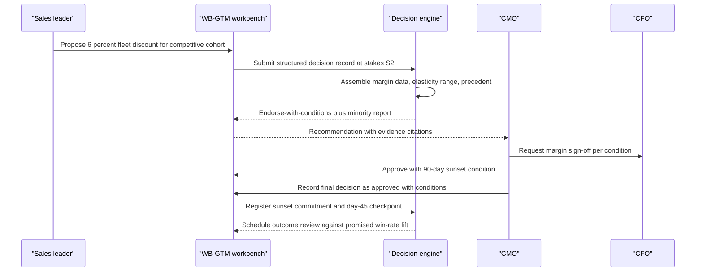
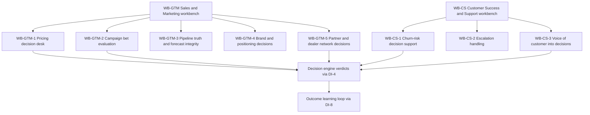

# CMO & GTM perspective

## 1. Front matter

| Field | Value |
|---|---|
| Doc ID | PERS-CMO-GTM |
| Role | Chief Marketing Officer, plus sales leader and customer-success leader |
| Owning unit | U20 Perspective CMO & GTM |
| Pillars referenced | WB-GTM, WB-CS, WB-0, DF-1, DF-7, KG-3, KG-4, KG-6, MI-2, MI-3, MI-4, GA-3, GA-4, GA-6, DI-1, DI-2, DI-3, DI-4, DI-5, DI-6, DI-7, DI-8, SF-1, SF-2, SF-4, SX-2, SX-3, SX-4, GV-1, GV-2, GV-6, SC-4, AD-4 |
| Version | 1.0 |

## 2. Role & mandate

This perspective is written by a composite go-to-market leadership team: the CMO, who owns brand, demand generation, pricing strategy, and the marketing budget; a sales leader, who owns the revenue number, the pipeline, the deal desk, and the partner and dealer network; and a customer-success leader, who owns retention, escalations, and the voice of the customer. Together they are accountable for new revenue, retained revenue, gross margin realized through pricing discipline, and the credibility of the forecast the CEO carries to the board.

The shared frustration is structural. GTM is the part of the company where decisions are made fastest, with the least evidence, under the most emotional pressure. Pricing decisions burn margin in minutes and are discovered at quarter close. Campaign bets are placed on gut feel and defended with whichever attribution model flatters them. Pipeline forecasts are negotiated theater — sandbagging below, happy ears above. Churn saves start when the renewal date appears on a calendar, not when the customer started disengaging two quarters earlier. Partner and dealer conflicts fester because nobody owns the evidence needed to settle them.

Success in three years, if TrueNorth works: every material pricing move carries a quantified margin impact and a precedent record before sign-off; the forecast the sales leader commits is built on deal-level evidence rather than rep sentiment; campaign bets are pre-registered with kill criteria and actually killed when they trip; churn interventions open while saves are still cheap; and the GTM organization can show, decision by decision, that its judgment is measurably improving. Creative judgment remains human and respected — the system kills wishful thinking, not taste.

## 3. Decisions I face today

I face these decisions every week, and most of them are made with less evidence than I would demand from a junior analyst's slide.

| Decision | Cadence | Stakes | Current pain |
|---|---|---|---|
| Approve or deny non-standard discounts and pricing exceptions | Weekly | S3 | Approved on deal momentum and end-of-quarter pressure; cumulative margin erosion is invisible until the close |
| Change list prices or launch promotions | Monthly–quarterly | S2 | Elasticity is guessed, competitor reaction is unmodeled, no exit criteria; the post-mortem never happens |
| Allocate the quarterly campaign budget | Quarterly | S2 | Last year's plan plus gut feel; attribution wars between channels decide who gets funded |
| Kill or persevere on in-flight campaigns | Monthly | S3 | Sunk cost wins; nobody kills a campaign they proposed, and underperformance is reframed as "brand building" |
| Commit the revenue forecast to the CEO and CFO | Weekly roll-up, quarterly commit | S2 | The roll-up is negotiated theater; I adjust by feel because I cannot see deal-level evidence at scale |
| Invest in a save play for an at-risk account | Weekly | S3 | Triggered by renewal date, not risk signal; by the time we act, the customer has already shortlisted a replacement |
| Approve concessions on customer escalations | Weekly | S3–S4 | Each concession looks small; cumulative exposure and precedent inconsistency are invisible |
| Re-tier, expand, or terminate partners and dealers; change territories | Quarterly | S2–S3 | Settled by politics and anecdote; channel conflict disputes run for quarters without an evidence base |
| Approve a brand repositioning or major creative platform | Annual | S2 | Subjective debate with no decision record; success is declared retroactively by whoever survived the meeting |

## 4. Jobs-to-be-done

Ranked by importance.

1. **JTBD-1** — When a discount or price change is proposed in a deal review, I want the margin impact, cumulative erosion context, and precedent shown before approval, so I can stop margin leakage before it compounds.
2. **JTBD-2** — When I build the quarterly forecast, I want an evidence-based forecast displayed beside the rep roll-up with the gap explained, so I can commit a number built on facts instead of theater.
3. **JTBD-3** — When an account's churn-risk signals cross a threshold, I want a save decision opened automatically with intervention economics attached, so I can retain revenue while a save is still cheap.
4. **JTBD-4** — When I place a large campaign bet, I want the hypothesis, audience, expected lift, kill criteria, and comparable past campaigns recorded before budget release, so I can defend or kill the bet on evidence.
5. **JTBD-5** — When a customer escalation reaches an executive, I want the full relationship history, open commitments, and cumulative concession exposure in one brief, so I can resolve it without overpaying.
6. **JTBD-6** — When partner and direct teams collide on a deal or territory, I want the conflict detected and routed to the holder of decision rights with the evidence attached, so disputes are settled in days instead of quarters.
7. **JTBD-7** — When attribution models disagree about a channel's contribution, I want the disagreement range shown explicitly, so I never reallocate budget on the most flattering number.
8. **JTBD-8** — When a repositioning or brand change is proposed, I want it checked for contradictions against active commitments, pricing strategy, and partner messaging, so creative moves do not contradict the company.
9. **JTBD-9** — When customer feedback themes become material, I want them packaged as weighted, citation-backed evidence into product, operations, and pricing decisions, so the voice of the customer influences decisions rather than decorating dashboards.
10. **JTBD-10** — When a decision I sponsored resolves, I want the realized outcome recorded against what was promised, so my organization's judgment gets measurably better each quarter.

## 5. A day with TrueNorth

7:40. The forecast-call brief is waiting. Instead of fourteen spreadsheet tabs, I get one page: the roll-up sits at 104 percent of plan, the evidence-based forecast sits at 96 percent, and the gap is explained — eleven commit-stage deals are single-threaded with no paper process started. Three of them belong to one region whose deals have slipped two quarters running. I walk into the 9:00 call knowing exactly which deals to pressure-test, and the call takes thirty minutes instead of ninety.

10:30. My sales leader proposes a 6 percent fleet discount to defend a cohort of competitive deals. Two years ago this would have been approved in the hallway. Today it becomes a decision record before the meeting ends. TrueNorth assembles the evidence: the affected cohort's current margin, the elasticity range, and the precedent — we ran a near-identical defensive discount eight quarters ago, retention of those accounts was fine, but the discount never sunset and cost us 140 basis points the following year. Verdict: Endorse-with-conditions. Conditions: a 90-day sunset, CFO sign-off on the margin envelope, and a win-rate checkpoint at day 45. The minority report argues the competitor is discounting from weakness and we should hold price entirely. I read it, disagree, and approve with the conditions. The whole exchange took twenty minutes, and the sunset is now a tracked commitment, not a good intention.

2:00. A campaign tripped its pre-registered kill criterion: cost per qualified opportunity is 2.3 times the declared threshold at the halfway spend mark. The recommendation is Caution on continuing, with a reallocation option toward the campaign archetype that has outperformed in three of the last four quarters. My demand-gen lead argues the creative needs two more weeks to mature — a legitimate creative judgment, and the system does not overrule it. But the argument is now on the record next to the threshold she set herself. She kills it. That conversation used to take three weeks and a vendor deck.

4:15. A top-20 account crossed its churn-risk threshold: support escalations doubled, the executive sponsor went quiet, usage in the flagship module fell 30 percent. TrueNorth opened a save decision automatically — renewal is still seven months out, which is the point. The recommended play costs an estimated 40,000 dollars in services credits and an executive visit; expected retained value is 1.9 million. The concession ledger shows we have already granted this account two credits this year, so the verdict is Endorse-with-conditions: the credit requires a mutual success plan signed by the customer. My CS leader takes the action with a named owner and a deadline.

5:30. Last quarter's promotion outcome review lands: realized lift was 60 percent of the promise, and a third of the volume was pull-forward. That promotion's sponsor sees the same record I do. Next quarter's promotion proposal will be better, because it has to be.

## 6. Feature requirements I own

This unit owns WB-GTM (Sales & Marketing) and WB-CS (Customer Success & Support). Both workbenches are built on the WB-0 workbench framework and exist to do one thing: convert the fastest, most emotional decisions in the company into structured, evidence-backed, outcome-tracked decision records — without slowing the field down or scoring individuals.

### WB-GTM Sales & Marketing workbench

**WB-GTM-1 Pricing decision desk.** As a CMO or pricing owner, when anyone proposes a price change, discount structure, or promotion, I want it captured as a structured decision record with margin, elasticity, and precedent evidence, so that pricing moves stop burning margin invisibly.

- **WB-GTM-1-1 Price move structuring.** Behavior: converts a proposed price change, discount band change, or promotion into a decision record with affected products and segments, competitive trigger, duration, exit criteria, and an auto-suggested stakes tier; decision structuring itself is provided by DI-1. Data touched: price books, cost and margin data, CRM quotes, competitor pricing signals. AI involvement: extraction of pricing proposals from deal-review meeting notes via MI-2; auto-population of affected scope. Surface: workbench form plus in-flow capture from CRM and chat. Acceptance: a pricing proposal raised in a recorded meeting becomes a draft decision record within 15 minutes with scope and stakes pre-filled.
- **WB-GTM-1-2 Margin and elasticity impact preview.** Behavior: before sign-off, displays the gross-margin and volume effect as a range with confidence, including competitor-response scenarios; scenario math is supplied by SF-2. Data touched: historical price-volume pairs, cost structure, win-loss records. AI involvement: elasticity estimation with explicit uncertainty bands; refuses a point estimate when data is thin. Surface: impact panel embedded in the decision record. Acceptance: every S2 and S3 pricing record carries a quantified margin impact range and named assumptions before it can be approved.
- **WB-GTM-1-3 Discount guardrail monitor.** Behavior: continuously aggregates field discounting against approved bands by segment, region, and product; when cumulative erosion crosses a declared threshold, it opens an emergent decision record rather than a report nobody reads. Data touched: quote and order data, approved discount matrices. AI involvement: pattern detection on erosion trends and end-of-quarter clustering. Surface: deal-desk view plus alerting. Acceptance: erosion is flagged at segment or desk level only; the feature never produces an individual-rep score, consistent with GV-6 red lines. L5 note: false-positive alert rate must stay below an agreed budget or the deal desk will mute it.
- **WB-GTM-1-4 Promotion outcome ledger.** Behavior: every promotion and price move closes with a structured outcome record — realized lift versus promised lift, pull-forward share, margin cost — feeding the learning loop in DI-8. Data touched: order data, baseline forecasts, the original decision record. AI involvement: baseline counterfactual estimation with stated method. Surface: outcome review card delivered to the sponsor and approver. Acceptance: 100 percent of S2/S3 pricing decisions receive an outcome record within one quarter of their end date.

**WB-GTM-2 Campaign bet evaluation.** As a CMO, when my team proposes a campaign bet above a spend threshold, I want the hypothesis, kill criteria, and comparable precedent recorded before budget release, so campaigns are managed as a stage-gated portfolio rather than a faith-based one.

- **WB-GTM-2-1 Campaign hypothesis record.** Behavior: requires declared audience, channel mix, expected lift with a measurable definition, attribution plan, spend schedule, and pre-registered kill criteria before budget is released; bets above threshold enter the initiative portfolio per GA-6. Data touched: marketing automation and ad-platform spend data, audience definitions. AI involvement: flags unmeasurable success criteria and vague audiences at submission. Surface: campaign brief workflow in the workbench. Acceptance: no campaign above the spend threshold launches without pre-registered kill criteria and an attribution plan.
- **WB-GTM-2-2 Campaign precedent retrieval.** Behavior: surfaces comparable past campaigns by archetype, audience, and channel with their realized outcomes and post-mortems, using evidence assembly from DI-2 and institutional memory from KG-3. Data touched: historical campaign records and outcomes. AI involvement: similarity matching across campaign archetypes; honest "no usable precedent" output when history does not match. Surface: precedent panel in the hypothesis record. Acceptance: every campaign decision record above threshold cites at least its top-three precedents or an explicit no-precedent statement.
- **WB-GTM-2-3 Kill-or-persevere triggers.** Behavior: monitors in-flight campaigns against their own pre-registered thresholds; on a trip, opens a kill-or-persevere decision with a reallocation option toward better-performing archetypes. Data touched: live campaign performance, spend pacing. AI involvement: trigger evaluation and reallocation candidate ranking. Surface: alert plus a one-screen decision card. Acceptance: a tripped kill criterion produces a decision record within 24 hours; perseverance requires a recorded rationale from the sponsor.
- **WB-GTM-2-4 Attribution honesty panel.** Behavior: displays the contribution range across all configured attribution models side by side, flags when a claimed ROI depends on the single most favorable model, and labels channels whose true contribution is currently unknowable. Data touched: touchpoint data, model outputs from marketing analytics stacks. AI involvement: cross-model disagreement quantification. Surface: budget-allocation view. Acceptance: any budget reallocation decision citing channel ROI must display the full model disagreement range in the decision record.

**WB-GTM-3 Pipeline truth and forecast integrity.** As a sales leader, when I commit a forecast, I want an evidence-based number beside the roll-up with the gap explained at deal level, so the number I carry to the CEO is built on verifiable facts.

- **WB-GTM-3-1 Deal evidence scoring.** Behavior: scores each commit- and best-case-stage deal on verifiable evidence — multithreading, paper process started, mutual close plan, economic buyer engaged — rather than rep sentiment; scores attach to deals, never to people, and aggregate analytics stop at team level. Data touched: CRM activity, email and meeting metadata under consented capture per MI-2, contract-stage signals. AI involvement: evidence extraction and rubric scoring with citations to the underlying signal. Surface: deal inspection view. Acceptance: every commit deal shows its evidence score and missing-evidence list; no individual-rep ranking is derivable from the surface.
- **WB-GTM-3-2 Forecast-versus-evidence deviation.** Behavior: produces an evidence-based forecast using SF-1 and displays it beside the management roll-up, decomposing the gap into named deal clusters and systematic bias (persistent sandbagging or optimism by segment, not by named individual). Data touched: pipeline snapshots, historical conversion by stage and evidence score. AI involvement: forecast generation and gap decomposition. Surface: forecast workspace. Acceptance: the gap between roll-up and evidence forecast is fully attributable to listed deal clusters; unexplained residual is labeled as such.
- **WB-GTM-3-3 Slip pattern analysis.** Behavior: mines decision genealogy and pipeline history for recurring slip archetypes — deals that slip twice, late-stage single-threading, procurement-stage stalls — and feeds them into deal-review checklists. Data touched: historical opportunity lifecycles. AI involvement: pattern clustering with examples cited. Surface: quarterly pipeline-quality review pack. Acceptance: each named slip archetype links to at least five historical examples and a falsifiable indicator.
- **WB-GTM-3-4 Forecast call brief.** Behavior: before each forecast call, generates a one-page brief — deltas since last call, contested deals, evidence gaps, decisions required — using pre-meeting intelligence from MI-4. Data touched: pipeline deltas, prior call commitments. AI involvement: brief synthesis with citations. Surface: delivered to attendees via in-flow channels per SX-3. Acceptance: brief is delivered at least two hours before the call and every contested deal in it links to its evidence record.

**WB-GTM-4 Brand and positioning decisions.** As a CMO, when a brand or repositioning move is proposed, I want measurable claims evaluated and subjective creative criteria explicitly fenced off, so the system kills contradictions and wishful projections without ruling on taste.

- **WB-GTM-4-1 Brand decision record with declared subjective criteria.** Behavior: structures brand decisions so that measurable claims (awareness lift, consideration, traffic) are separated from declared-subjective criteria (tone, aesthetics, brand fit); the engine evaluates only the measurable portion and explicitly marks the subjective portion out of scope. Data touched: brand tracker data, market research. AI involvement: claim classification into measurable versus subjective at drafting time. Surface: brand decision workflow. Acceptance: no verdict ever cites a declared-subjective criterion as grounds for Caution or Oppose.
- **WB-GTM-4-2 Brand health signal binding.** Behavior: binds brand-tracker metrics, share of voice, and sentiment feeds to brand goals so progress is inferred from live data per GA-3 rather than quarterly agency decks. Data touched: tracker panels, social and media monitoring via DF-7. AI involvement: anomaly detection on brand health movements with source-reliability weighting. Surface: brand health view in the workbench. Acceptance: brand goal status updates within one week of underlying tracker data landing.
- **WB-GTM-4-3 Repositioning consistency check.** Behavior: checks a proposed positioning or messaging change against active customer commitments, pricing strategy, partner messaging, and in-flight campaigns recorded in the knowledge graph, and lists concrete contradictions. Data touched: knowledge-graph commitments and policy nodes via KG-4 retrieval. AI involvement: contradiction detection with citations. Surface: consistency report attached to the brand decision record. Acceptance: every flagged contradiction cites the specific commitment or artifact it conflicts with.

**WB-GTM-5 Partner and dealer network decisions.** As a sales leader, when partner conflicts arise or network changes are proposed, I want evidence-based conflict resolution and simulated network impact, so channel decisions stop being settled by whoever shouts loudest.

- **WB-GTM-5-1 Channel conflict detection.** Behavior: detects direct-versus-partner deal collisions, territory overlaps, and systematic price-undercut patterns; opens a conflict record routed to the decision-rights holder defined in KG-6. Data touched: CRM deal registration, partner portal data, quote data. AI involvement: collision matching across noisy account identifiers. Surface: conflict queue with aging. Acceptance: median conflict resolution cycle is measurable and conflicts older than 30 days escalate automatically per DI-7.
- **WB-GTM-5-2 Partner evidence pack.** Behavior: for partner tiering, expansion, or termination decisions, assembles a citation-backed pack — performance trend, co-investment, dispute and concession history, customer-satisfaction signals in the partner's accounts. Data touched: partner transactions, dispute records, support data. AI involvement: evidence assembly and gap flagging via DI-2. Surface: partner decision workspace. Acceptance: every S2/S3 partner decision record contains the standard evidence pack with sources resolvable to lineage.
- **WB-GTM-5-3 Coverage change evaluation.** Behavior: evaluates proposed territory, segmentation, or program changes by simulating revenue and conflict impact across the affected network, drawing on SF-2 scenarios and cross-department propagation from SF-4. Data touched: territory maps, historical productivity by coverage model. AI involvement: scenario comparison with stated assumptions. Surface: coverage planning workspace. Acceptance: every coverage decision record presents at least two modeled alternatives with the trade-offs quantified.
- **WB-GTM-5-4 Incentive program evaluation.** Behavior: evaluates proposed SPIFs, rebates, and co-op programs against the outcomes and gaming patterns of past programs, and pre-registers the behavior the program is supposed to change. Data touched: past program payouts and outcomes, claim data. AI involvement: gaming-pattern detection (channel stuffing, claim clustering) at program level only. Surface: incentive design workflow. Acceptance: every program proposal cites the realized outcome of the most similar past program or an explicit no-precedent statement.

### WB-CS Customer Success & Support workbench

**WB-CS-1 Churn-risk decision support.** As a CS leader, when an account shows risk, I want a decision opened with evidence and intervention economics while a save is still cheap, so retention is managed proactively instead of forensically.

- **WB-CS-1-1 Renewal risk evidence pack.** Behavior: consolidates per-account risk signals — usage trend, escalation history, sponsor changes, sentiment from support interactions, open commitments — into one citation-backed pack refreshed continuously. Data touched: product telemetry, support tickets, CRM, meeting-derived commitments via MI-2. AI involvement: risk synthesis with every claim citable to a source signal. Surface: account risk view. Acceptance: every signal in the pack opens to its source; packs refresh within 24 hours of new material signals.
- **WB-CS-1-2 Save-play economics.** Behavior: when a save is proposed, computes intervention cost against expected retained value and recommends a verdict on the proposed concession mix, including the account's cumulative concession history. Data touched: contract value, cost of proposed concessions, historical save-play outcomes. AI involvement: expected-value estimation with confidence; recommendation synthesis via DI-4. Surface: save decision card. Acceptance: every save play above a cost threshold carries an expected-value calculation and a comparison to at least one precedent save.
- **WB-CS-1-3 Early-warning intervention triggers.** Behavior: declared risk-threshold crossings automatically open a save decision record with a named owner and clock, independent of renewal date. Data touched: composite risk signals from WB-CS-1-1. AI involvement: threshold evaluation; no autonomous customer outreach is ever taken. Surface: alert plus decision queue. Acceptance: median time from threshold crossing to opened decision is under one business day; no customer-facing action occurs without a human owner.
- **WB-CS-1-4 Churn post-mortem loop.** Behavior: every churned account closes with a structured outcome record — root causes, missed signals, what the save attempt cost and why it failed — feeding DI-8 so the risk models and save plays improve. Data touched: full account history, exit interview notes. AI involvement: root-cause drafting for human validation. Surface: post-mortem workflow. Acceptance: 100 percent of churned accounts above a revenue threshold receive a validated post-mortem within 30 days.

**WB-CS-2 Escalation handling.** As a CS leader, when an escalation lands, I want it routed by severity and decision rights with concession economics attached, so resolution is fast, consistent, and not silently expensive.

- **WB-CS-2-1 Escalation decision record and routing.** Behavior: structures an escalation into a decision record with severity, revenue at risk, and required approvers derived from decision rights in KG-6 and policy in GV-1; stakes-tiered gates apply per GV-2. Data touched: support tickets, contract terms, account hierarchy. AI involvement: severity classification and routing suggestion. Surface: escalation queue. Acceptance: misrouted escalations (rerouted after opening) stay below an agreed rate; every escalation has a named decision owner within four business hours.
- **WB-CS-2-2 Concession evaluation.** Behavior: evaluates proposed credits, penalty waivers, and contract exceptions against precedent concessions for similar situations and against the account's and segment's cumulative concession exposure; issues a verdict with conditions. Data touched: concession ledger, contract terms, precedent records via KG-3. AI involvement: precedent matching and exposure aggregation. Surface: concession decision card. Acceptance: every concession above threshold displays cumulative twelve-month exposure for the account and the closest three precedents.
- **WB-CS-2-3 Executive escalation brief.** Behavior: when an escalation reaches executive level, generates a single brief — relationship history, every open commitment we have made to this customer, prior escalations and their resolutions, current decision options with the engine's assessment. Data touched: knowledge-graph account history, commitment records via MI-3. AI involvement: brief synthesis with citations. Surface: delivered to the executive via SX-4 mobile and digest channels. Acceptance: brief available within one hour of executive escalation; every stated commitment links to its source meeting or document.

**WB-CS-3 Voice of customer into decisions.** As a CS leader, I want aggregated customer evidence to flow into decisions across the company as weighted, citable input, so the customer's voice carries the same evidentiary standing as financial data.

- **WB-CS-3-1 VoC evidence stream.** Behavior: aggregates support tickets, NPS verbatims, QBR notes, win-loss interviews, and community signals into ranked themes weighted by volume, severity, and revenue exposure; every theme decomposes into cited examples. Data touched: support, survey, and CRM text corpora ingested via DF-1. AI involvement: theme clustering, weighting, and deduplication; only aggregated themes are produced — no individual employee analytics. Surface: VoC theme explorer. Acceptance: every theme exposes its example set and revenue weighting; themes are reproducible from cited sources.
- **WB-CS-3-2 Customer-impact evidence service.** Behavior: packages relevant VoC themes and account-level impact estimates as evidence inputs available to any decision record in the company, so the customer lens evaluation in DI-3 draws on department-curated evidence rather than raw text. Data touched: VoC themes, affected-account lists. AI involvement: relevance matching between a decision's scope and customer themes. Surface: evidence panel inside any decision record. Acceptance: when a decision's scope matches a material theme, the evidence attaches automatically and the match rationale is visible.
- **WB-CS-3-3 Customer commitment ledger.** Behavior: tracks promises made to customers in meetings and documents — roadmap commitments, SLA exceptions, executive promises — to closure, with aging and owner, built on extraction from MI-2 and follow-through tracking from MI-3. Data touched: meeting records, contract side letters, account plans. AI involvement: commitment extraction with human confirmation for externally binding items. Surface: commitment view per account and rolled up per segment. Acceptance: every extracted external commitment is human-confirmed before it enters the ledger; aging breaches alert the account owner.

## 7. Cross-pillar needs

| Need | Depends on |
|---|---|
| Prebuilt connectors for CRM, marketing automation, ad platforms, support desks, and partner portals | DF-1 |
| Competitor pricing, market, and media signals with source-reliability scoring | DF-7 |
| Decision genealogy and as-of history for pricing, campaign, and concession precedent | KG-3 |
| Permission-aware retrieval of commitments and policies for consistency checks | KG-4 |
| Decision-rights and committee model for deal desk, conflict, and escalation routing | KG-6 |
| Extraction of decisions, commitments, owners, and dissent from deal reviews and QBRs | MI-2, MI-3 |
| Pre-meeting briefs for forecast calls and executive escalations | MI-4 |
| Alignment scoring of GTM decisions against company strategy | GA-4 |
| Campaign bets managed as a stage-gated initiative portfolio | GA-6 |
| Decision structuring, evidence assembly, lens evaluation, verdict synthesis, devil's advocate, escalation, and outcome loop | DI-1, DI-2, DI-3, DI-4, DI-5, DI-7, DI-8 |
| Published calibration of engine confidence on GTM verdicts | DI-6 |
| Demand forecasting, pricing what-ifs, and cross-department propagation of pricing moves | SF-1, SF-2, SF-4 |
| In-flow capture and delivery inside CRM, chat, and mobile surfaces | SX-2, SX-3, SX-4 |
| Decision-rights policy, stakes-tiered HITL gates, and enforcement of anti-surveillance red lines | GV-1, GV-2, GV-6 |
| Hard tenant isolation so pricing and win-loss data never trains shared models | SC-4 |
| Decision ROI attribution for the GTM value model | AD-4 |
| Workbench framework, ontology packs, and KPI packs underlying both workbenches | WB-0 |

## 8. Red lines & veto conditions

These are the conditions under which I shut the system off, and I mean it.

- **No individual surveillance, full stop.** Evidence scores attach to deals, concession patterns attach to segments, gaming detection attaches to programs. The moment any surface, export, or API makes a rep-level or agent-level performance score derivable, the field will treat TrueNorth as a policing tool, data quality will collapse within a quarter, and I will pull it. This is also a canonical red line, and I expect GV-6 to enforce it technically, not contractually.
- **No verdicts on taste.** If the engine issues Caution or Oppose against a declared-subjective brand criterion even once, my creative organization will never trust it again. The measurable/subjective boundary in WB-GTM-4-1 is a hard contract, not a styling preference.
- **No uncited claims.** Every number in a verdict must open to its source. A single fabricated precedent or unverifiable elasticity figure in a pricing decision ends the engine's credibility with my deal desk permanently.
- **Confidence must be earned.** If TrueNorth is confidently wrong on two consecutive S2 pricing or forecast calls and the published calibration does not visibly adjust, I stop reading the confidence field — and a confidence field nobody reads is worse than none.
- **Speed is a veto condition.** If routine S4 discount approvals take longer through TrueNorth than through the old email chain, the field routes around it within weeks and the pipeline data becomes fiction. Decision support that slows decisions is decision theater.
- **No autonomous customer contact.** The system never emails, calls, or messages a customer on its own — not for churn saves, not for surveys triggered by risk scores. Every customer-facing act has a human owner.
- **Our pricing and win-loss data trains nobody else's model.** Cross-tenant leakage of pricing strategy is a competitive catastrophe; hard isolation is a precondition of deployment, not a roadmap item.
- **Hindsight weaponization.** If decision records and overruled minority reports start being used primarily to assign blame after misses rather than to learn, my leaders will stop recording honest assumptions and the whole evidentiary chain rots. Governance of retrospective use must exist before rollout.

## 9. Adoption & workflow integration

What changes in my week: forecast call preparation collapses from a day of spreadsheet archaeology to reading one brief. Deal-desk reviews start from a pre-assembled decision record instead of a Slack thread. QBR preparation pulls the commitment ledger instead of reconstructing promises from memory. The Monday pipeline call, the monthly campaign review, and the quarterly partner review all run against decision records with verdicts already attached, so meeting time goes to judgment instead of data assembly.

What I will ignore: long-form analytical reports, any dashboard that requires a login detour, and any insight not attached to a decision I actually face. If it is not in the flow of a decision, it does not exist.

What must never be required: new form-filling for routine S4 decisions. Capture must come from where work already happens — CRM updates, deal-review meetings, support tickets — through in-flow surfaces per SX-3, with the workbench form reserved for S2/S3 moves that deserve the ceremony. My sellers will tolerate exactly zero additional administrative minutes per deal; CS managers slightly more, but only if the evidence packs visibly save them hours.

Rollout opinion: start with the pricing decision desk and the forecast brief, because both produce visible wins inside one quarter and neither requires the field to change behavior. Campaign pre-registration comes second and needs my personal enforcement, because nobody volunteers for kill criteria. Partner conflict and VoC integration come third, once the graph has enough history to make precedent retrieval credible.

## 10. Success metrics & value model

KPIs I would measure TrueNorth by:

- **Margin leakage:** basis points of realized discount erosion versus approved bands, trending down; target 50–100 bps recovered within four quarters of the pricing desk going live.
- **Forecast integrity:** signed forecast error (bias) and absolute error on quarterly commits, both narrowing; the bias number matters more than the accuracy number, because bias is the theater.
- **Campaign discipline:** share of above-threshold campaigns with pre-registered kill criteria (target 100 percent); share of tripped criteria that result in an actual kill or a recorded perseverance rationale within a week.
- **Retention economics:** gross revenue retention trend; median lead time from risk-threshold crossing to opened save decision; save-play cost per retained dollar.
- **Escalation cost:** median executive-escalation resolution time and twelve-month cumulative concession exposure per segment, both trending down.
- **Channel health:** median partner-conflict resolution cycle time, from quarters to days.

Leading indicators, before financial results land: percentage of S2/S3 pricing moves passing through decision records; evidence-score coverage on commit-stage deals; percentage of churned accounts with completed post-mortems; brief-read rates before forecast calls.

Payback logic: at Fortune-500 GTM scale, recovered margin leakage alone plausibly covers the platform — 75 bps on a multi-billion revenue base is tens of millions. Add one to two points of gross revenue retention and avoided dead campaign spend, and the GTM workbenches should be among the fastest-payback surfaces in the deployment. Attribution of these gains must run through AD-4 with honest counterfactuals; I will not claim credit the methodology cannot support, and I expect the same discipline from the vendor.

## 11. Hard questions for the build team

1. **HQ-1** — How does pricing precedent decay when the market regime shifts? A discount that worked pre-commodity-shock is not evidence today; what is the mechanism that prevents stale precedent from carrying live weight?
2. **HQ-2** — Reps learned to game forecast categories in every CRM ever deployed. What stops them from learning the evidence-scoring rubric and gaming deal hygiene signals the same way, and how would we detect it?
3. **HQ-3** — When finance, marketing ops, and the agency each run a different attribution model, which one does the engine treat as ground truth — and is it willing to output "this channel's contribution is currently unknowable"?
4. **HQ-4** — How is the creative-judgment boundary enforced technically, so that an aggressively tuned risk lens never issues Oppose against a declared-subjective criterion?
5. **HQ-5** — What is the cold-start story? How many quarters of outcome data are needed before pipeline-truth verdicts beat a competent RevOps analyst, and what does the workbench honestly do in the meantime?
6. **HQ-6** — After the anti-surveillance constraints strip individual-level behavioral signals, how much churn-prediction and forecast accuracy actually remains, measured, not asserted?
7. **HQ-7** — Partner and dealer data is governed by partner contracts that often prohibit exactly the sharing WB-GTM-5 needs. What is the ingestion and consent model that keeps channel-conflict detection legal across hundreds of partner agreements?
8. **HQ-8** — When the quarter is missed and the CEO asks why, the minority report I overruled is sitting in the record. What governance prevents decision records from becoming primarily instruments of hindsight blame — and if none is planned, that is a global-assumption gap this document is flagging rather than asserting.

## 12. Dependencies & references

| Reference | Type | Why |
|---|---|---|
| DI-1…DI-8 — Decision Intelligence Engine | Pillar capability (Catalog DI+SF unit) | All GTM and CS verdicts, evidence assembly, devil's advocate, escalation, and outcome learning run on the engine |
| SF-1, SF-2, SF-4 — Simulation & Forecasting | Pillar capability (Catalog DI+SF unit) | Evidence-based forecasts, pricing what-ifs, and network change simulation |
| WB-0 — Workbench framework | Pillar capability (Catalog SX+WB-0 unit) | WB-GTM and WB-CS are built as packs on this framework |
| SX-2, SX-3, SX-4 — Surfaces | Pillar capability (Catalog SX+WB-0 unit) | In-flow capture and delivery in CRM, chat, and mobile |
| DF-1, DF-7 — Data fabric | Pillar capability (Catalog DF+KG unit) | GTM system connectors and external market signals |
| KG-3, KG-4, KG-6 — Knowledge graph | Pillar capability (Catalog DF+KG unit) | Precedent, retrieval, and decision-rights routing |
| MI-2, MI-3, MI-4 — Meeting intelligence | Pillar capability (Catalog MI+GA unit) | Decision and commitment extraction, follow-through, and briefs |
| GA-3, GA-4, GA-6 — Goal alignment | Pillar capability (Catalog MI+GA unit) | Brand health binding, alignment scoring, and campaign portfolio gates |
| GV-1, GV-2, GV-6 — Governance | Pillar capability (Catalog GV unit) | Decision rights, HITL gates, and anti-surveillance enforcement |
| SC-4 — Tenant isolation | Pillar capability (Catalog SC unit) | Hard isolation of pricing and win-loss data |
| AD-4 — Value realization | Pillar capability (Catalog PL+AD unit) | Honest attribution of GTM value claims in section 10 |
| Perspective CFO & Finance | Work unit | CFO sign-off conditions on pricing and concession envelopes |
| Perspective COO & Operations | Work unit | Supply and capacity constraints on promotions and demand-shaping moves |
| Perspective Legal & Compliance | Work unit | Contract exceptions, partner agreement constraints, and concession legality |
| Responsible-AI Deep Dive | Work unit | Red-team coverage of surveillance and hindsight-blame failure modes raised in sections 8 and 11 |
