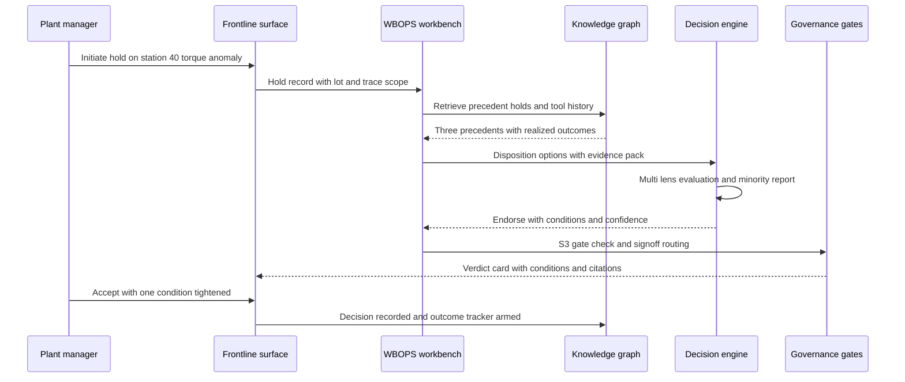
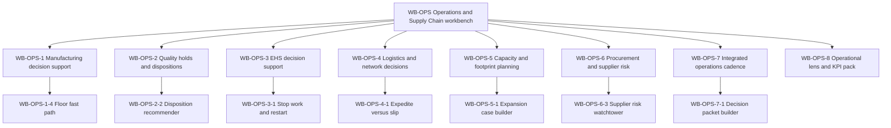

# COO & operations perspective

## 1. Front matter

| Field | Value |
|---|---|
| Doc ID | PERS-COO |
| Role | Chief Operating Officer, with plant manager, supply-chain VP, and chief procurement officer voices |
| Owning unit | U19 Perspective COO & Operations |
| Pillars referenced | WB-OPS, WB-0, DF-1, DF-2, DF-3, DF-7, KG-3, KG-6, MI-2, MI-4, GA-4, DI-1, DI-2, DI-4, DI-5, DI-7, DI-8, SF-1, SF-2, SF-4, SF-5, SX-2, SX-3, SX-4, GV-1, GV-2, GV-3, GV-6, SC-4, PL-7, AD-2, AD-4 |
| Version | 1.0 |

## 2. Role & mandate

The COO is accountable for everything that converts orders into delivered, conforming product: factories, supply chain, quality, logistics, environmental health and safety (EHS), and procurement. This document blends four voices: the COO who owns the integrated operating plan; a plant manager who lives at takt time and makes ten-minute calls on the floor; a supply-chain VP who balances inventory, freight, and supplier continuity; and the chief procurement officer (CPO), who awards sourcing contracts — and who will also be the buyer-side gatekeeper when TrueNorth itself goes through the company's supplier qualification gauntlet.

Operations differs from every other function TrueNorth serves in one decisive way: the cost of decision latency is measured in minutes, not weeks. A stopped final-assembly line burns six figures per hour. A quality hold that is dispositioned a day late strands a week of shipments. If TrueNorth's recommendation arrives after the line restarted, it is not late advice — it is noise that trains the floor to ignore the system.

Success in three years looks like this: every recurring operational decision class — rate changes, holds, dispositions, expedites, supplier awards — flows through a structured decision record with evidence attached; disposition cycle time falls by half; supplier disruptions are flagged before purchase orders are affected rather than after; capacity-expansion cases reach the executive committee pre-stress-tested; and the floor trusts the system because it has earned the right to be consulted in ten minutes, and it knows when to stay silent.

## 3. Decisions I face today

I make or chair these decisions today, mostly with stale spreadsheets, hallway escalations, and tribal memory.

| Decision | Cadence | Stakes | Current pain |
|---|---|---|---|
| Change line rate on a constrained line (e.g., lift General Assembly from 52 to 56 jobs/hour) | Weekly | S3 | Downstream effects on logistics, supplier releases, and quality fallout are guessed, not modeled; no record of what happened last time |
| Disposition a quality hold (use-as-is, rework, scrap) | Daily | S3–S4 | Precedent lives in retired engineers' heads; containment scope is argued, not derived from traceability |
| Escalate a hold to stop-ship or field action | Event-driven | S1–S2 | Escalation criteria are implicit; minutes matter and the evidence pack takes days to assemble |
| Authorize stop-work after an EHS incident or near-miss | Event-driven | S2–S3 | Stop-work is correctly instant, but the restart decision lacks structured risk evidence |
| Approve a new supplier through qualification (PPAP-style gate) | Weekly | S3 | Audit findings, financial health, and capacity claims sit in disconnected systems; conditional approvals are forgotten |
| Award sourcing contract; single- vs dual-source a critical part | Monthly | S2–S3 | Total-cost and continuity-risk trade-offs are debated without shared precedent or simulation |
| Expedite premium freight vs slip a customer commitment | Daily | S4 | Decided by whoever is on shift; cumulative expedite spend invisible until month-end |
| Rebalance inventory and safety stock across the network | Weekly | S4 | Forecast, lead-time variability, and open holds are reconciled by hand |
| Approve overtime, added shift, or crew-pattern change | Weekly | S4 | Labor cost vs throughput trade-off untracked against the operating plan |
| Capacity expansion: new line, new plant, major tooling | Quarterly | S1–S2 | Business cases take months, assumptions go stale mid-approval, and nobody back-tests the last expansion's promises |
| Make-vs-buy / insourcing of a component | Quarterly | S2 | Strategic-control arguments and cost arguments are never weighed in the same frame |
| Allocate constrained supply across plants and customers in S&OP | Monthly | S2 | Demand, supply, and finance arrive with three different numbers; the meeting relitigates data instead of deciding |

## 4. Jobs-to-be-done

1. JTBD-1: When a quality anomaly triggers a hold, I want containment scope, precedent dispositions with outcomes, and a recommended disposition within minutes, so I can release conforming product fast and quarantine only what is actually suspect.
2. JTBD-2: When a rate change is proposed, I want its propagated impact on supplier releases, logistics, headcount, and quality risk simulated before I commit, so I can avoid starving or flooding the rest of the system.
3. JTBD-3: When a supplier shows early distress signals (financial, geopolitical, weather, labor), I want an alert tied to my exposed parts and a pre-built mitigation decision record, so I can act before the line feels it.
4. JTBD-4: When I must choose expedite versus slip, I want the true cost of each option including contractual penalties and cumulative expedite spend, so I can stop paying premium freight by reflex.
5. JTBD-5: When a sourcing award is on the table, I want single- vs dual-source continuity risk priced into the comparison, so I can defend resilience spend against unit-cost pressure.
6. JTBD-6: When I sponsor a capacity expansion, I want the case stress-tested against demand scenarios and checked against the outcomes of past expansions, so I can bring the board a case that survives scrutiny.
7. JTBD-7: When a hold risks becoming a stop-ship, I want an expedited escalation path with the evidence pack already assembled, so I can make an S2 call in hours, not days.
8. JTBD-8: When production meetings end, I want commitments and decisions captured with owners and deadlines automatically, so I can stop chasing actions from memory.
9. JTBD-9: When I approve a supplier conditionally, I want the conditions tracked to closure and surfaced at the next award decision, so conditional approvals stop becoming permanent exceptions.
10. JTBD-10: When the restart decision follows a stop-work, I want a structured risk checklist with evidence of corrective actions, so the restart is as defensible as the stop.

## 5. A day with TrueNorth

05:40. My phone shows the overnight digest: two items, not forty. The watchtower flagged a tier-2 chemical supplier in financial distress — exposure mapped to two part numbers, ten days of cover, a draft mitigation decision record already attached. I forward it to the supply-chain VP with a deadline.

07:15. Station 40 in body shop starts throwing torque anomalies. The line lead initiates a quality hold from the floor terminal — scope auto-derived from traceability: 312 units, two lots. By the time I join the morning production meeting at 07:30, TrueNorth has assembled three precedent holds on the same joint family, two of which were dispositioned use-as-is after engineering review and held up in the field; one became a rework. Its recommendation: Endorse-with-conditions — rework the two lots, audit the torque-tool calibration record, release everything outside the trace scope now. The minority report argues the calibration drift pattern resembles a 2024 case that later surfaced warranty claims, and says so with citations. The plant manager accepts the disposition, tightens one condition, signs at the S3 gate. Total elapsed time: 22 minutes. Two years ago this was a day and a half of stranded WIP.

10:00. S&OP pre-read. The decision packet shows one reconciled demand-supply picture, the three allocation options scored against the operating plan, and what each option does to the two customers we shorted last quarter. The meeting decides in forty minutes instead of arguing about whose number is right.

14:00. The capacity case for a second drive-unit line comes back from simulation: the base case holds, but the downside demand scenario pushes payback out two years, and TrueNorth notes our last expansion ramped four months slower than promised — with the realized curve attached. I send it back with conditions before it ever reaches the CFO. Better to be embarrassed by the machine in private than by the board in public.

16:30. The CPO pings me, amused: she is running TrueNorth's own contract renewal through the supplier gauntlet, and the vendor's resilience answers are thinner than the recommendations it writes for us. The irony is noted in the decision record.

## 6. Feature requirements I own

This unit owns the full feature tree of the Operations & Supply Chain workbench (WB-OPS), built on the workbench framework (WB-0). Every feature below produces or consumes structured decision records (DI-1) and routes verdicts through stakes-tiered gates (DI-7, GV-2). A non-negotiable design constraint applies workbench-wide: features marked floor-latency must return a usable recommendation, or an explicit "insufficient evidence — proceed on judgment" signal, within minutes on frontline surfaces (SX-4), and must degrade gracefully when plant connectivity drops.

### WB-OPS-1 Manufacturing decision support

User story: as a plant manager, when a rate change, schedule deviation, or downtime event forces a call, I want options evaluated against live plant data and precedent so the call is made fast and on evidence.

- **WB-OPS-1-1 Line-rate change evaluator.** Behavior: structures a proposed rate change as a decision record; projects effects on supplier release schedules, logistics capacity, labor, and historical quality-fallout-per-rate-step. Data: MES line rates, ERP supplier schedules, quality fallout history. AI: scenario projection via SF-2; precedent retrieval via DI-2. Surface: workbench web view and SX-3 plugin. Acceptance: verdict with quantified downstream deltas in under 15 minutes for S3/S4 changes; every cited number carries lineage.
- **WB-OPS-1-2 Downtime triage assistant.** Behavior: on unplanned downtime, assembles probable causes from maintenance history and similar events, and frames the repair-now vs run-degraded vs swap-tooling decision with cost-per-hour context. Data: CMMS work orders, MES andon events, spare-parts inventory. AI: similarity retrieval, no autonomous action. Surface: SX-4 frontline. Acceptance: first usable option set within 5 minutes of the andon escalation; floor-latency class.
- **WB-OPS-1-3 Changeover and schedule deviation evaluator.** Behavior: evaluates pulling forward or deferring a model-mix changeover or maintenance window against order book and material availability. Data: production schedule, order book, material on hand. AI: constraint check plus what-if via SF-2. Acceptance: flags any deviation that breaks a committed customer date before sign-off.
- **WB-OPS-1-4 Floor fast path.** Behavior: a stripped verdict mode for S4 floor decisions — one screen, three options maximum, evidence one tap deep, ten-minute service objective; auto-records the decision even when the human overrides. Data: minimum viable evidence set defined per decision class. AI: cached precedent and pre-computed risk bounds; falls back to "insufficient evidence" rather than guessing. Surface: SX-4 only. Acceptance: p95 time-to-verdict under 10 minutes; offline mode records the decision locally and syncs.

### WB-OPS-2 Quality holds and dispositions

User story: as a quality director, when nonconforming product is detected, I want containment scoped from traceability and disposition recommended from precedent so conforming product keeps shipping.

- **WB-OPS-2-1 Hold initiation and containment scoping.** Behavior: creates a hold record from floor or lab input; derives suspect population from lot, serial, and process traceability; proposes containment scope with confidence bounds. Data: traceability genealogy, lot data, shipment status. AI: graph traversal over KG-2-resolved entities; scope is recommended, never auto-executed. Acceptance: containment proposal within 10 minutes; over- and under-containment rates tracked via DI-8.
- **WB-OPS-2-2 Disposition recommender.** Behavior: evaluates use-as-is, rework, repair, scrap, and return-to-supplier options against precedent dispositions and their realized field outcomes; produces verdict, conditions, minority report. Data: nonconformance history, warranty/field data, engineering specs. AI: DI-3 multi-lens evaluation with the operational lens pack (WB-OPS-8). Acceptance: every recommendation cites at least the nearest precedents and their outcomes, or states that no precedent exists.
- **WB-OPS-2-3 Containment and rework tracking.** Behavior: tracks execution of disposition conditions (rework completion, sorting results, supplier corrective actions) and closes the loop into the decision record. Data: rework orders, inspection results. AI: commitment tracking via MI-2 patterns. Acceptance: no hold closes with open conditions without an explicit waiver signature.
- **WB-OPS-2-4 Stop-ship and field-action escalation.** Behavior: monitors holds for escalation triggers (recurrence, field signal, regulatory exposure); assembles the S1/S2 escalation pack — affected population, customer exposure, cost envelope, regulatory clock — and routes through DI-7 expedited review. Data: field quality, shipment, regulatory-reporting metadata. AI: trigger detection and pack assembly; escalation decision is human-only. Acceptance: escalation pack ready within 2 hours of trigger; legal review need is flagged to WB-LGL by reference.

### WB-OPS-3 EHS decision support

User story: as a plant manager, when a safety event occurs or a process change carries EHS risk, I want the stop and restart decisions structured and evidence-backed so safety calls are fast, defensible, and never second-guessed by cost pressure.

- **WB-OPS-3-1 Stop-work and restart support.** Behavior: stop-work is always instant and human; TrueNorth never gates it. Post-stop, assembles the restart decision record: corrective actions, risk re-assessment, precedent incidents, and required sign-offs. Data: incident reports, corrective-action status, permit records. AI: evidence assembly only; the system shall never recommend against a stop-work. Acceptance: restart record complete before restart sign-off is technically possible; zero instances of cost arguments injected into stop-work framing.
- **WB-OPS-3-2 Management-of-change evaluator.** Behavior: scores proposed process, chemical, or equipment changes for EHS risk against the hazard register and incident precedent; routes high-risk changes to the appropriate gate per KG-6 decision rights. Data: change requests, hazard register, SDS metadata. Acceptance: no S2+ change reaches approval without an EHS lens assessment attached.
- **WB-OPS-3-3 Incident pattern surfacing.** Behavior: clusters near-misses and incidents across plants to surface systemic risks as candidate decisions (e.g., retrofit decision for a guard design recurring in three sites). Data: aggregated, de-identified incident records — never individual worker behavior profiles, per GV-6 red lines. Acceptance: pattern alerts cite only event-level evidence; no individual-level scoring exists anywhere in the feature.

### WB-OPS-4 Logistics and network decisions

User story: as a supply-chain VP, when freight, lanes, or inventory positions need a call, I want true total cost and service impact computed so reflexive expediting stops.

- **WB-OPS-4-1 Expedite versus slip evaluator.** Behavior: for each at-risk shipment, compares expedite cost (premium freight, handling) against slip cost (contractual penalty, customer-relationship signal, downstream line risk); shows month-to-date cumulative expedite spend against budget. Data: TMS rates, order commitments, contract penalty terms, line schedules. AI: cost modeling plus precedent of past expedite decisions and whether they were retrospectively justified (DI-8). Acceptance: floor-latency class; decision recorded even when made by reflex, to build the learning base.
- **WB-OPS-4-2 Lane, mode, and carrier decisions.** Behavior: structures recurring lane awards and mode shifts (air-to-sea, rail-to-truck) as decision records with cost, lead-time variability, emissions, and disruption-exposure lenses. Data: carrier performance, rate cards, DF-7 logistics signals. Acceptance: every award includes a continuity assessment, not just rate comparison.
- **WB-OPS-4-3 Inventory positioning and safety-stock review.** Behavior: recommends rebalancing and safety-stock changes from demand forecast (SF-1), lead-time variability, and open quality holds; frames each material class change as an S4 batch decision with exception review. Data: inventory positions, forecast, supplier lead-time actuals. Acceptance: recommendations explainable to a planner in one screen; batch approval never silently auto-applies.

### WB-OPS-5 Capacity and footprint planning

User story: as the COO, when capacity must grow or shift, I want the case built, stress-tested, and checked against our own expansion track record before it reaches the executive committee.

- **WB-OPS-5-1 Expansion case builder.** Behavior: assembles a capacity-expansion decision record — demand scenarios, ramp curves, capex phasing, hiring plan — and runs it through SF-2 scenarios and SF-5 stress tests; attaches realized ramp curves from past expansions as calibration evidence. Data: demand plans, capex models, historical ramp actuals. AI: scenario synthesis; explicitly lists assumptions that would change the verdict (DI-6). Acceptance: no S1/S2 capacity case advances without a downside scenario and a precedent-ramp comparison attached.
- **WB-OPS-5-2 Shift-pattern and overtime evaluator.** Behavior: evaluates added shifts, crew patterns, and sustained overtime against throughput gain, labor cost, fatigue-related quality and safety history at the aggregate level, and the operating plan. Data: labor schedules, throughput, aggregate quality and EHS rates by shift pattern. Acceptance: people-impact assessments stay at crew/aggregate level; works-council-relevant changes flagged to the HR domain via WB-HR by reference.
- **WB-OPS-5-3 Make-vs-buy and insourcing evaluator.** Behavior: frames insourcing/outsourcing with total landed cost, strategic-control value, capacity consumption, and supplier-market consequences in a single comparable structure; retrieves outcomes of past make-vs-buy calls. Data: should-cost models, capacity models, supplier market data via DF-7. Acceptance: strategic-control arguments must be stated as explicit, reviewable assumptions rather than absorbed into the financials.

### WB-OPS-6 Procurement and supplier risk

User story: as the CPO, when I qualify, award, or rescue a supplier, I want risk and total cost in one frame, conditions tracked to closure, and distress visible before it hits the line.

- **WB-OPS-6-1 Supplier qualification gates.** Behavior: structures qualification (audit findings, capability runs, financial health, sub-tier mapping) as a staged decision record; conditional approvals carry tracked conditions with expiry; lapsed conditions resurface automatically at the next award involving that supplier. Data: audit reports, PPAP-style submissions, financial data, sub-tier declarations. Acceptance: zero "permanent conditional" suppliers — every condition closes, escalates, or expires visibly.
- **WB-OPS-6-2 Sourcing award and source-strategy evaluator.** Behavior: evaluates awards including single- vs dual-source structure; prices continuity risk (disruption probability times line-impact cost) into the comparison alongside piece price, tooling, and switching cost; minority report defaults to arguing the resilience case when unit cost wins, and vice versa. Data: quotes, should-cost, capacity statements, watchtower risk scores. Acceptance: every award record shows the resilience-vs-cost trade-off explicitly; awards above threshold route to S2 gates per GV-1 decision rights.
- **WB-OPS-6-3 Supplier risk watchtower.** Behavior: continuously correlates external signals (financial distress, sanctions, geopolitics, weather, port congestion, labor actions via DF-7) with the supplier and sub-tier graph; on trigger, computes exposed parts, days of cover, and line-down date, and opens a draft mitigation decision record with options (buffer build, alternate source, spec deviation). Data: supplier master, sub-tier map, inventory cover, in-transit. AI: signal-to-exposure mapping with source-reliability weighting. Acceptance: alert precision tracked and reported; alerts arrive before first affected PO date in the large majority of true events, measured via DI-8.
- **WB-OPS-6-4 Supplier recovery and exit decisions.** Behavior: when a supplier deteriorates, frames the support-vs-exit decision — recovery investment, dual-source ramp time, contractual position — with precedent recoveries and their outcomes. Data: supplier performance trend, contract terms metadata, recovery-plan status. Acceptance: contract-interpretation questions are flagged to WB-LGL by reference, never answered by this workbench.

### WB-OPS-7 Integrated operations cadence

User story: as the COO, when S&OP and daily operating reviews convene, I want one reconciled picture and pre-built decision packets so meetings decide instead of relitigating data.

- **WB-OPS-7-1 S&OP decision packet builder.** Behavior: assembles the monthly packet — reconciled demand-supply gaps, allocation options scored against the operating plan and GA-4 alignment, financial bridge inputs — with each gap framed as a discrete decision record. Data: demand plan (SF-1), supply plan, plant capacities, order book. Acceptance: one number set, with disagreements between sources shown explicitly with lineage rather than silently averaged.
- **WB-OPS-7-2 Daily operating review board.** Behavior: a standing surface listing yesterday's operational decisions, overnight verdicts awaiting sign-off, open conditions nearing breach, and commitments extracted from production meetings (MI-2). Data: decision records, commitment tracker. Acceptance: review preparation time measurably reduced; no decision discussed in the meeting escapes capture.

### WB-OPS-8 Operational lens and KPI pack

User story: as the workbench owner, I want operations-specific judgment and metrics packaged on WB-0 so verdicts speak the language of the floor.

- **WB-OPS-8-1 Operational lens pack.** Behavior: configures the DI-3 lens set for operations decisions — throughput, quality, safety, continuity, landed cost — with safety as a non-tradable lens that can force Caution/Oppose regardless of other lenses. Acceptance: lens weights are tenant-configurable except the safety override, which is fixed.
- **WB-OPS-8-2 Operations KPI bindings.** Behavior: binds workbench metrics (OEE, first-pass yield, OTIF, days of cover, expedite spend, hold cycle time) to GA-3 progress tracking so verdict context always shows current operational health. Data: MES/ERP/TMS metric feeds under DF-3 quality contracts. Acceptance: stale metrics are visibly flagged with age; no silently stale number ever appears in a verdict card.

## 7. Cross-pillar needs

| Need | Depends on |
|---|---|
| Prebuilt connectors for ERP, MES, PLM, CMMS, TMS, and quality systems | DF-1 |
| Streaming/CDC ingestion fast enough for floor-latency decision classes | DF-2 |
| Data-quality contracts so verdicts never cite silently stale plant data | DF-3 |
| External signal feeds (weather, geopolitics, ports, commodity, supplier financials) with reliability scoring for the watchtower | DF-7 |
| Bitemporal precedent retrieval: what did we decide, and what actually happened | KG-3 |
| Decision-rights awareness so verdicts route to the person who can actually sign | KG-6 |
| Decision and commitment extraction from production and S&OP meetings | MI-2 |
| Pre-meeting briefs for daily operating reviews and S&OP | MI-4 |
| Alignment scoring of allocation and capacity options against strategy | GA-4 |
| Evidence assembly, multi-lens evaluation, verdict synthesis, minority report | DI-2, DI-3, DI-4 |
| Expedited review path for stop-ship and crisis escalations | DI-7 |
| Outcome tracking to grade dispositions, expedites, and watchtower alerts | DI-8 |
| Demand/capacity forecasting and what-if scenarios for rate and expansion cases | SF-1, SF-2 |
| Cross-department impact propagation of rate changes and allocation calls | SF-4 |
| Stress tests for expansion cases and supply-disruption war-gaming | SF-5 |
| Frontline surfaces with offline degradation for plant-floor verdicts | SX-4 |
| Stakes-tiered HITL gates and decision-rights policy enforcement | GV-1, GV-2 |
| Immutable audit trail for dispositions exposed to regulators and customers | GV-3 |
| Enforcement of no-individual-surveillance red lines in EHS and shift analytics | GV-6 |
| On-prem/air-gapped deployment for plants with restricted connectivity | SC-4 |
| Reliability targets compatible with 24/7 manufacturing | PL-7 |
| Floor-level change management and champion programs | AD-2 |

## 8. Red lines & veto conditions

These are the conditions under which operations shuts the system off — and the floor will shut it off faster than any executive.

- **Latency over completeness, always, for floor decisions.** If the fast path (WB-OPS-1-4) cannot answer in ten minutes, it must say "insufficient evidence" and step aside. A late verdict that arrives after the line restarted, even a correct one, is a strike against the system. Three strikes and the floor stops opening the app; no executive mandate will reverse that.
- **TrueNorth never touches an actuator.** It does not stop lines, release holds, change rates, or transmit supplier releases. It recommends; humans and existing OT systems act. Any integration that blurs this boundary is vetoed unseen.
- **Stop-work is sacred.** The system shall never gate, slow, or argue against a human stop-work call, and shall never present cost data in the stop-work moment. Cost belongs in the restart record, after the area is safe.
- **No worker surveillance laundered as safety or productivity analytics.** Shift, fatigue, and incident analytics operate at crew and process aggregate only. The first individual-level operator score discovered anywhere in WB-OPS is a contract-termination event, consistent with GV-6.
- **No silently stale evidence.** A verdict citing yesterday's inventory as if it were live is worse than no verdict; it manufactures false confidence at industrial speed. Every cited figure carries a visible age and lineage (DF-3, DF-5).
- **Recommendation quality must be auditable by outcome.** If realized outcomes (DI-8) show disposition or expedite recommendations performing worse than the floor's unaided judgment for two consecutive quarters, the affected feature is demoted to evidence-assembly-only mode.
- **The CPO's buyer-side veto.** TrueNorth itself must survive the same gauntlet it administers: security and continuity qualification, data-egress terms, exit and escrow provisions, no pricing structures that tax decision volume in a crisis. A vendor whose own resilience answers would earn a Caution from its own engine does not get the renewal.

## 9. Adoption & workflow integration

What changes: the daily operating review starts from the WB-OPS-7-2 board instead of a slide deck; holds are initiated and dispositioned in the workbench because that is where the traceability scope and precedent live; sourcing awards and expansion cases are born as decision records, not assembled into them after the fact. Plant managers get the fast path on the terminals and devices they already use (SX-4), and the conversational interface (SX-2) for "what happened last time" questions.

What gets ignored: any surface that demands data entry the MES or ERP already holds. Operations people will not type context twice; if the connectors (DF-1) do not carry the load, the workbench dies of friction within a quarter. Long-form verdict prose is also ignored on the floor — the verdict card, the conditions, and one-tap evidence are what get read.

What must never be required: a TrueNorth sign-off as a precondition for physical action in an emergency; mandatory recommendation requests for S4 routine calls (the system earns its way into those by being useful, per AD-2's trust-building approach); and meeting capture in plants or jurisdictions where consent rules are not cleanly satisfied (MI-6 boundary respected without exception).

Rollout opinion: start with quality holds at two plants. Holds are frequent, painful, precedent-rich, and measurable — the ideal trust-building wedge. Procurement watchtower second, because it proves value without asking anyone to change an in-meeting habit. Capacity cases last, once calibration history exists.

## 10. Success metrics & value model

| Metric | Type | Target direction |
|---|---|---|
| Quality-hold disposition cycle time (initiation to signed disposition) | Outcome | Down 50% within 12 months at pilot plants |
| Over-containment rate (units held but later released unchanged) | Outcome | Down materially without under-containment rising |
| Expedite spend as % of freight, and % of expedites retrospectively justified | Outcome | Spend down; justified share up |
| Supplier disruptions detected before first affected PO date | Outcome | Majority of true events; precision reported alongside |
| p95 time-to-verdict for floor-latency decision classes | Leading | Under 10 minutes, measured continuously |
| Share of operational decisions in scope captured as decision records | Leading | Rising quarter over quarter |
| Floor voluntary-use rate of the fast path for S4 calls | Leading | Rising; the honest trust signal |
| Verdict calibration on WB-OPS decisions (confidence vs realized outcome) | Trust | Within engine-wide calibration bands |
| Capacity-case ramp accuracy (promised vs realized, via DI-8) | Outcome | Error shrinking case over case |

Payback logic: a single avoided line-down day on a constrained line typically covers a plant-year of the workbench. The recurring economics come from hold cycle time (released working capital and recovered shipments), expedite discipline (premium-freight reduction), and disruption pre-emption (one pre-empted supplier failure per year on a critical part is the difference between a buffer build and an allocation crisis). Value attribution flows through AD-4 so these claims are audited, not asserted.

## 11. Hard questions for the build team

1. HQ-1: What is the architectural latency floor, end to end, for a floor decision in an on-prem plant with degraded connectivity — and will the team commit to a p95 SLO per decision class before we commit plants to the rollout?
2. HQ-2: When MES and ERP disagree about inventory during a containment scoping, what exactly does the verdict card show, and who is accountable for the reconciliation rule?
3. HQ-3: How does the engine avoid precedent bias in dispositions — if the last three use-as-is calls were wrong but field data lags by months, what stops the system from confidently repeating the error before DI-8 catches it?
4. HQ-4: Can the safety-lens override in WB-OPS-8-1 be weakened by any tenant configuration path, including WB-0 lens-pack customization? The required answer is no; show the enforcement mechanism.
5. HQ-5: What is the failure posture when the platform is down at 3 a.m. and a hold must be dispositioned — and how does the decision get back-captured so the record stays complete without punishing the people who acted?
6. HQ-6: How is watchtower alert fatigue managed quantitatively — what precision threshold demotes a signal source, and who reviews it?
7. HQ-7: Aggregate shift-level safety analytics sit one query away from individual surveillance. What technical control — not policy promise — makes the de-aggregation impossible?
8. HQ-8: Does the commercial model penalize crisis usage — per-decision or per-token pricing that spikes exactly when a stop-ship event makes us most dependent? The CPO requires crisis-cost predictability in contract terms.
9. HQ-9: What does the system do when the recommended disposition conflicts with a customer-mandated quality procedure that lives in a contract the engine has only partially ingested?
10. HQ-10: A possible global assumption gap: the canon defines stakes tiers but not decision-latency classes. Operations needs latency to be a first-class, cross-pillar property of a decision record, not a workbench-local convention — where is that decided?

## 12. Dependencies & references

| Reference | Type | Why |
|---|---|---|
| DF-1, DF-2, DF-3, DF-5, DF-7 | Pillar L2 | Connectors, ingestion latency, data quality, lineage, and external signals underpin every WB-OPS verdict |
| KG-2, KG-3, KG-6 | Pillar L2 | Traceability graph, precedent with outcomes, and decision-rights routing |
| MI-2, MI-4, MI-6 | Pillar L2 | Meeting commitment capture, review briefs, and consent boundaries in plants |
| GA-3, GA-4 | Pillar L2 | KPI bindings and alignment scoring of allocation and capacity options |
| DI-1 through DI-8 | Pillar L2 | Decision records, evidence, lenses, verdicts, devil's advocate, expedited gates, outcome learning |
| SF-1, SF-2, SF-4, SF-5 | Pillar L2 | Forecasts, what-ifs, cross-department propagation, stress tests |
| WB-0 | Pillar L2 | Framework, ontology packs, and lens packs WB-OPS is built on |
| SX-2, SX-3, SX-4 | Pillar L2 | Conversational, in-flow, and frontline surfaces carrying verdicts to the floor |
| GV-1, GV-2, GV-3, GV-6 | Pillar L2 | Policy engine, HITL gates, audit, and surveillance red lines |
| SC-4 | Pillar L2 | On-prem and air-gapped plant deployments |
| PL-7 | Pillar L2 | 24/7 reliability for manufacturing |
| AD-2, AD-4 | Pillar L2 | Floor change management and audited value attribution |
| U7 Catalog SX+WB-0 | Work unit | Owns the workbench framework and surface specs WB-OPS builds on |
| U6 Catalog DI+SF | Work unit | Owns the decision-engine and simulation features WB-OPS invokes |
| U4 Catalog DF+KG | Work unit | Owns connector, quality, and knowledge-graph features WB-OPS depends on |
| U16 Perspective Legal & Compliance | Work unit | Owns WB-LGL, referenced for contract and regulatory questions raised by holds and supplier exits |
| U18 Perspective CHRO & HR | Work unit | Owns WB-HR, referenced for works-council-relevant shift-pattern changes |
| U23 Perspective Frontline & Entry-Level | Work unit | The floor users whose trust decides whether the fast path lives |
