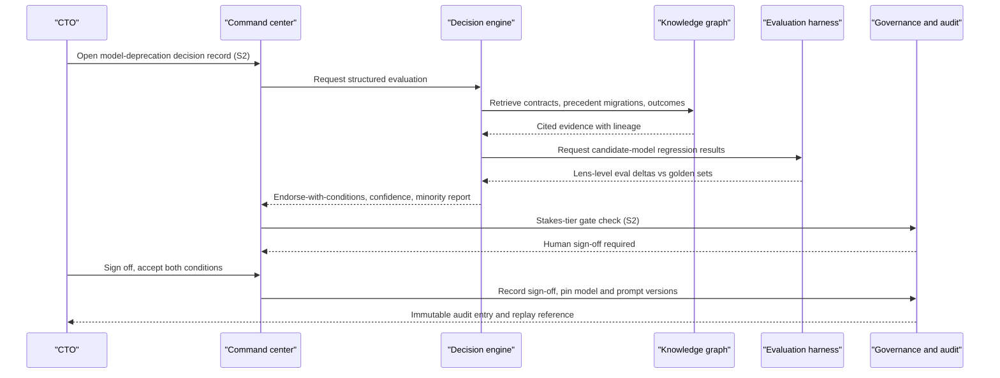
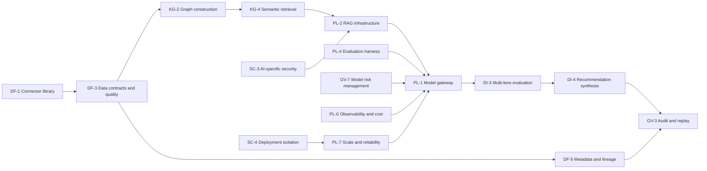

# CTO perspective

## 1. Front matter

| Field | Value |
|---|---|
| Doc ID | PERS-CTO |
| Role | Chief Technology Officer |
| Owning unit | U12 Perspective CTO |
| Pillars referenced | PL-1, PL-2, PL-3, PL-4, PL-5, PL-6, PL-7, SC-1, SC-2, SC-3, SC-4, SC-5, SC-6, DF-1, DF-2, DF-3, DF-5, DF-6, GV-1, GV-2, GV-3, GV-4, GV-5, GV-7, KG-1, KG-2, KG-3, KG-4, KG-6, DI-1, DI-2, DI-3, DI-4, DI-6, DI-7, DI-8, SF-2, SF-6, SX-1, SX-3, SX-5, MI-4, AD-3, AD-4 |
| Version | 1.0 |

## 2. Role & mandate

The CTO of a Fortune-500 enterprise is accountable for the company's technology strategy, the architecture and reliability of its platforms, the productivity of several thousand engineers, the technology dimension of corporate risk, and a technology budget measured in billions. The CTO chairs the architecture review board, owns the build-versus-buy doctrine, signs off on every strategic vendor commitment, and is the executive who is paged when a platform fails in a way that stops production lines, closes the order book, or makes the front page.

For TrueNorth specifically, the CTO sits on both sides of the table. As a customer-executive, the CTO is one of the heaviest users of decision support: architecture bets, vendor consolidation, capacity planning, and incident-driven decisions are exactly the class of choices the system claims to improve. As the platform owner, the CTO is the executive who must operate TrueNorth inside the existing estate, integrate it without creating a parallel data empire, defend its security posture to the CISO and the board, and guarantee that the company can leave the vendor without losing a decade of institutional memory.

Success in three years looks like this: TrueNorth runs as a first-class workload in the company's standard landing zones, consuming governed data products rather than duplicating pipelines; every S1 and S2 technology decision has a reproducible decision record with cited evidence and a tracked outcome; the model layer beneath the engine has been swapped at least twice without measurable verdict-quality regression, proving that no single AI vendor holds the company hostage; and the total cost per evaluated decision is known, budgeted, and trending down. Failure looks like a second shadow data platform, a verdict engine nobody can reproduce, and an exit bill nobody can pay.

## 3. Decisions I face today

| Decision | Cadence | Stakes | Current pain |
|---|---|---|---|
| Build-versus-buy rulings on major platform components | Monthly | S2 | Each ruling is re-litigated from scratch; prior rulings and their outcomes live in slide decks nobody can find |
| Strategic vendor selection and renewal (cloud, AI models, data platforms) | Quarterly | S2 | TCO models are hand-built per deal; lock-in risk is asserted, never quantified; past renewal concessions are forgotten |
| Architecture review board approvals and exceptions | Weekly | S3 | Inconsistent precedent; exceptions granted under deadline pressure are never revisited |
| Tech-debt versus feature capacity allocation across portfolios | Quarterly | S2–S3 | No defensible link between debt paydown and incident or velocity outcomes |
| Major incident response and post-incident remediation commitments | Episodic | S2–S3 | Remediation commitments decay silently; the same root causes recur across business units |
| Cloud and AI spend commitments (multi-year commits, GPU reservations) | Annual | S2 | Forecasts come from advocates of the spend; nobody runs the downside scenario |
| Technical diligence on acquisitions | Episodic | S1–S2 | Diligence findings are not connected to integration outcomes; lessons are not institutionalized |
| Platform consolidation and decommissioning | Quarterly | S3 | Dependency mapping is tribal knowledge; decommission dates slip without visibility |
| Engineering organization design and senior staffing | Annual | S2 | Re-org effects on delivery are argued by anecdote |
| Security architecture exceptions escalated past the CISO | Weekly | S3 | Risk acceptance is informal and the registry of accepted risks is stale |

## 4. Jobs-to-be-done

1. JTBD-1: When any model, prompt, retrieval index, or routing policy under the recommendation engine is about to change, I want regression evidence from a tenant-visible evaluation harness before the change reaches production, so I can guarantee verdict quality never silently degrades.
2. JTBD-2: When a model vendor raises prices, deprecates a model, or fails, I want a rehearsed, evidence-backed swap path to an alternative provider, so I can change the AI substrate without renegotiating my architecture under duress.
3. JTBD-3: When a team brings a build-versus-buy or vendor decision to the architecture board, I want precedent, outcome data from similar past decisions, and a cited TCO baseline assembled before the meeting, so I can rule consistently instead of re-deriving doctrine each time.
4. JTBD-4: When TrueNorth is deployed, I want it to consume the company's existing governed data products through supported connectors and contracts, so I can prevent the emergence of a second, ungoverned data platform.
5. JTBD-5: When an auditor, regulator, or incident commander asks why the system recommended something, I want any historical verdict replayed with the exact model, prompt, index, and evidence versions that produced it, so I can treat the engine like any other auditable production system.
6. JTBD-6: When AI spend scales with adoption, I want per-decision and per-tenant unit-cost telemetry exported into my existing observability and FinOps stack, so I can govern this workload with the same instruments as every other workload.
7. JTBD-7: When a remediation commitment is made in a post-incident review, I want it captured as a tracked commitment with an owner and a deadline, so I can stop paying for the same root cause twice.
8. JTBD-8: When the company's deployment posture requires VPC, on-prem, or air-gapped operation, I want a written capability-parity statement against the SaaS edition, so I can plan around degradation instead of discovering it.
9. JTBD-9: When my engineers extend TrueNorth, I want a supported API and extension surface with versioning guarantees, so internal platform teams build on it rather than around it.
10. JTBD-10: When I eventually leave the vendor, I want the knowledge graph, decision records, and evaluation sets exportable in documented open formats, so the exit cost is an engineering project, not a hostage negotiation.

## 5. A day with TrueNorth

07:10. I open the command center before the standup. Overnight, our primary frontier-model provider announced the deprecation of the model family that backs roughly 60 percent of our verdict synthesis traffic, with nine months' notice. TrueNorth has already opened a decision record for it — stakes S2, because verdict quality across every department rides on this — and the pre-meeting brief is waiting: current routing mix, the contract terms we signed two years ago, the two prior model migrations with their measured quality deltas, and the clause my predecessor negotiated that I had honestly forgotten, giving us 180 days of extended support.

09:00. Architecture review board. First item is a business unit asking to build a bespoke forecasting service. The decision record shows three precedents: two prior "build it ourselves" rulings whose outcome tracking shows both services were decommissioned within 30 months, and one "buy" ruling that is still in production. The engine's recommendation is Caution on building, with a minority report arguing the unit's latency requirement genuinely is unusual. We rule buy-with-exception-review in 20 minutes instead of 90, and the ruling itself becomes precedent.

11:30. The model-deprecation decision. Before the meeting, I asked the platform team to run the candidate replacement models through the evaluation harness against our tenant-owned golden decision sets. The results are attached to the record as evidence: candidate A matches the incumbent within noise on financial and risk lenses but regresses 4 points on legal-lens citation fidelity; candidate B is at parity everywhere but costs 1.8 times more per evaluated decision. TrueNorth's verdict is Endorse-with-conditions on a phased migration to candidate A: condition one, legal-lens traffic stays pinned to the incumbent until a prompt revision closes the citation gap and passes regression; condition two, a 5 percent shadow-traffic comparison runs for four weeks with automatic rollback triggers. The minority report argues we should pay for candidate B and buy simplicity. I sign off on the conditions, and the sign-off, the eval results, and the routing change all land in the same immutable audit trail. This is the only way I will ever allow a model swap to happen.

14:00. A vice president pings me through the chat plugin: can we accelerate the air-gapped pilot for the defense subsidiary? I ask TrueNorth what the current parity gap is; it answers with the capability-parity statement and the three capabilities that degrade without SaaS-side models, cited to source. I forward the answer instead of scheduling a meeting.

16:30. Quarterly vendor-swap drill. We rehearse failing the model gateway over to the secondary provider for one business unit's S4 traffic. Drill time: 41 minutes, down from 3 hours two quarters ago. The drill result is recorded against the decision record that mandated the drills, so when someone proposes cancelling them next budget cycle, the outcome data will be sitting there waiting.

## 6. Feature requirements I own

No owned workbench. The CTO mints no features; the role's value to the plan is the hard dependency chain it will be operated against. The chain below is the one the CTO will inspect first in any architecture review of TrueNorth itself: governed data in, permission-aware retrieval through, vendor-neutral model access under, evaluated and audited verdicts out. A failure anywhere on this chain is a platform incident, not a product bug.

The reading of this diagram is deliberately one-directional: the CTO will not accept a deployment in which a downstream node compensates for an upstream one. Retrieval security (SC-3) cannot be patched after synthesis; lineage (DF-5) cannot be reconstructed after the audit question arrives; and no quantity of audit logging (GV-3) excuses an un-evaluated change passing through PL-1.

## 7. Cross-pillar needs

| Need | Depends on |
|---|---|
| The model gateway shall be vendor-neutral, supporting at least two independent frontier-model providers plus customer-supplied model endpoints, with stakes- and cost-based routing controlled by tenant policy. | PL-1 |
| Every change to a model, prompt template, retrieval configuration, or routing policy shall pass tenant-visible regression evaluation against golden decision sets before reaching production traffic. | PL-4 |
| Golden decision sets and judge-calibration baselines shall be tenant-owned, tenant-extendable, and exportable. | PL-4 |
| Retrieval infrastructure shall support pluggable index and vector stores so the company can reuse its existing lakehouse-adjacent infrastructure where it meets SLOs. | PL-2 |
| Agent orchestration shall enforce sandboxed execution with explicitly scoped tool permissions and no write access to systems of record absent a human-gated decision record. | PL-3 |
| Fine-tuning shall be justified case-by-case by measured eval deltas over retrieval-augmented baselines, and tenant adapters shall survive base-model version changes or be flagged for re-validation. | PL-5 |
| Observability shall export traces, metrics, and per-decision unit cost in OpenTelemetry-compatible form into the company's existing APM and FinOps tooling, with hard budget circuit breakers. | PL-6 |
| The platform shall publish RTO/RPO commitments, support multi-region deployment aligned to the company's cloud regions, and demonstrate DR through joint failover exercises. | PL-7 |
| Ingestion shall consume existing systems of record through versioned, prebuilt connectors rather than requiring bespoke extraction agents on company infrastructure. | DF-1 |
| Pipelines shall honor the company's existing data contracts and quarantine contract-violating data rather than silently ingesting it. | DF-3 |
| Lineage shall trace every recommendation citation back to source system and field so that evidence disputes resolve in minutes. | DF-5 |
| Residency routing shall pin tenant data and inference to declared regions, including regional inference endpoints for cross-border subsidiaries. | DF-6 |
| Identity shall federate through the company's existing OIDC/SAML provider with SCIM provisioning, and authorization shall honor decision-rights as first-class policy. | SC-1 |
| Encryption shall support customer-held keys (BYOK) with key-revocation as an enforceable kill switch, and retrieval shall respect data classification labels. | SC-2 |
| Prompt-injection, retrieval-poisoning, and output-exfiltration defenses shall be continuously tested, with red-team results shared under NDA before each major release. | SC-3 |
| SaaS, VPC, on-prem, and air-gapped editions shall ship with a written capability-parity statement updated every release. | SC-4 |
| SOC 2 Type II and ISO 27001/42001 evidence shall be current before production data is connected, with FedRAMP-equivalent posture for regulated subsidiaries. | SC-6 |
| Every verdict shall be replayable with the exact model, prompt, index, and evidence versions pinned at issuance, in an immutable audit store with externally verifiable integrity. | GV-3 |
| Model inventory, change management, and performance monitoring shall integrate with the company's existing model-risk-management framework rather than running a parallel registry. | GV-7 |
| Stakes-tiered human gates shall be configurable against the company's encoded decision-rights matrix, including an expedited path for incident-time decisions. | GV-2 |
| The knowledge graph, decision records, and institutional memory shall be exportable in full, in documented open formats, within a contractual time bound. | KG-3 |
| Semantic retrieval shall enforce source-system permissions at query time so no user can read through the graph what they cannot read at the source. | KG-4 |
| The ontology shall version tenant extensions so that company-specific schema survives product upgrades without migration freezes. | KG-1 |
| A supported API, webhook, and extension platform with semantic versioning and deprecation windows shall let internal platform teams build on TrueNorth. | SX-5 |
| In-flow plugins shall operate inside the company's existing collaboration estate rather than forcing context switches to a separate surface. | SX-3 |
| Pre-meeting briefs for architecture and vendor reviews shall assemble precedent and required data ahead of the meeting. | MI-4 |
| Outcome tracking shall close the loop on technology decisions so build-versus-buy and remediation rulings accumulate measurable precedent. | DI-8 |
| Forecast accuracy shall be backtested and reported against realized outcomes so simulation outputs carry credibility statements, not just point estimates. | SF-6 |
| Usage and health analytics shall be exportable so the CTO can independently verify adoption claims rather than relying on vendor dashboards. | AD-3 |

## 8. Red lines & veto conditions

These are veto conditions, not preferences. Each one names the behavior that triggers it.

1. **No un-evaluated model or prompt change in production.** Any change to a model version, prompt template, retrieval index, embedding model, or routing policy that reaches production without passing PL-4 regression gates — including silent upstream vendor model updates, which shall be treated as breaking changes and pinned against — is grounds for suspending the deployment. If the vendor cannot pin model versions or detect upstream drift, the product is not operable.
2. **An exit strategy for every model vendor, demonstrated, not asserted.** Contractual and technical second-sourcing through PL-1 is mandatory: portable prompts and eval sets, a warm-standby alternative provider, and a quarterly swap drill with measured drill time. A model gateway that is vendor-neutral on the marketing page but couples synthesis quality to one provider's undocumented behaviors fails this test.
3. **On-prem and air-gapped parity, in writing.** SC-4 editions ship with a capability-parity statement per release. If the air-gapped edition lags the SaaS edition by more than one quarterly release, or if parity gaps are discovered in operation rather than disclosed in the statement, the regulated-subsidiary deployment stops.
4. **No second data platform.** TrueNorth consumes governed sources through DF-1 connectors under DF-3 contracts, with DF-5 lineage. The moment it requires bulk raw replication outside the company's lineage and catalog, or its ingestion tier starts being used as a general-purpose ETL system, it gets shut off. The company has one data platform; TrueNorth is a consumer of it.
5. **No black-box verdicts.** Every verdict must be reproducible via GV-3 replay and explainable via GV-4 at the depth an external auditor requires. "The model said so" is not an explanation; a verdict that cannot be replayed did not happen.
6. **Data egress freedom.** Full export of the knowledge graph, decision records, audit trail, and tenant eval sets (KG-3, GV-3, PL-4) in documented open formats, within 30 contractual days, at no punitive cost. Institutional memory held hostage is the single largest strategic risk this product creates, and it is negotiated before the first connector is enabled.
7. **No autonomous writes to systems of record.** Agents under PL-3 may read broadly within permission-aware retrieval; they write to ERP, HRIS, PLM, MES, or code repositories nowhere, ever, without a human-gated decision record under GV-2. An "agentic" roadmap item that loosens this is a contract renegotiation event.
8. **Key revocation is a real kill switch.** BYOK under SC-2 must mean that revoking customer-held keys renders tenant data cryptographically inert on vendor infrastructure, verified in a joint exercise — not a support ticket.
9. **Security evidence precedes data.** SOC 2 Type II, ISO 27001 and 42001 (SC-6), tenant-isolation test evidence (SC-4), and AI-attack red-team results (SC-3) are delivered before production data is connected. Subprocessor and model-provider changes carry a notification-and-objection window; zero-retention inference terms with model providers are contractual, not best-effort.
10. **Hard cost circuit breakers.** PL-6 must enforce tenant-set token and inference budgets with automatic degradation to lower-cost routing rather than open-ended overage billing. An AI system whose marginal cost is unbounded by policy does not run in this estate.
11. **No surveillance creep, including of engineers.** The canonical red lines stand, and the CTO adds a specific one: meeting intelligence and usage analytics shall never be queryable as individual engineer productivity scoring. The first dashboard that ranks named individuals by AI-inferred output ends the program's social license, and shortly after that, the program.

## 9. Adoption & workflow integration

What changes in the CTO's working week: the architecture review board moves onto decision records as its native artifact — submissions arrive as structured DI-1 records with DI-2 evidence and precedent attached, and board rulings become precedent automatically through DI-8 outcome tracking. Vendor renewals begin with the engine's brief instead of a procurement deck. Post-incident reviews register remediation commitments as tracked commitments rather than action items in a document. The quarterly tech-debt allocation argument is conducted against outcome data from the previous quarters' allocations. The CTO expects to spend less time reconstructing context and more time exercising judgment, which is the only honest pitch for this product.

What the CTO will ignore: conversational summaries of content already well-served by existing dashboards; alignment scores on decisions whose strategy linkage is obvious; any notification stream that has not earned its interruption budget. The engine earns attention by being right with citations, and loses it permanently by being confidently wrong twice.

What must never be required: TrueNorth shall never be a synchronous gate on incident response — the expedited path under GV-2 must allow humans to act first and reconcile the record afterward, because no advisory system gets to stand between an incident commander and a mitigation. Engineers shall never be required to consult the engine before routine S4 decisions; mandated usage is how adoption programs die. And no workflow shall require the CTO's organization to enter data into TrueNorth that already exists in a system of record — if the connector cannot fetch it, the integration is the deficiency, not the user.

Rollout stance: the CTO's organization pilots first, on its own decisions, before any other function is asked to trust the system — architecture rulings, vendor renewals, and incident remediations are a high-volume, outcome-measurable decision stream and the engineering organization is best placed to detect platform-level failure modes early. Champions come from staff engineers, not from a transformation office, and AD-3 analytics are reviewed by the CTO's own platform team, not only by the vendor's customer-success function.

## 10. Success metrics & value model

The CTO measures TrueNorth as a platform first and an advisor second; an advisor running on an un-operable platform is worthless at this scale.

Platform KPIs:

- **Verdict reproducibility rate:** percentage of historical verdicts that replay bit-faithfully under GV-3 audit; target effectively 100 percent, with any failure treated as a Sev-2.
- **Eval-gated change rate:** percentage of model/prompt/index/routing changes that passed PL-4 regression before production; target 100 percent, measured independently from vendor reporting.
- **Vendor-swap drill time:** time to fail over S4 verdict traffic to the secondary provider under PL-1; target under one hour, trending down quarter over quarter.
- **Cost per evaluated decision:** fully loaded inference plus platform cost per verdict by stakes tier from PL-6, with budget adherence and zero uncontrolled overruns.
- **Availability and DR:** measured against published PL-7 RTO/RPO in joint exercises, not vendor attestation.
- **Integration footprint:** number of bespoke pipelines built outside DF-1/DF-3 to feed TrueNorth; target zero — every exception is a defect against the no-second-data-platform red line.

Advisor KPIs:

- **Calibration on technology decisions:** measured agreement between stated confidence and realized outcomes (DI-6, DI-8) on the architecture board's decision stream, reported quarterly.
- **Precedent hit rate:** share of board submissions arriving with relevant precedent attached via DI-2 that the reviewers judge material.
- **Decision cycle time:** elapsed time from architecture-board submission to ruling, against the pre-TrueNorth baseline.
- **Commitment survival rate:** percentage of post-incident remediation commitments completed by their deadline, against the historical baseline.
- **Forecast credibility:** SF-6 backtest accuracy on capacity and spend forecasts used in CTO decisions.

Payback logic: the value model the CTO will defend at budget time is narrow and falsifiable. Take the architecture board's annual decision stream, the vendor-renewal stream, and the post-incident remediation stream; measure cycle time, decision reversal rate, repeat-root-cause incident cost, and renewal concessions captured, before and after. AD-4 attribution is welcome as supporting evidence, but the CTO's case rests on these three streams because they are the ones the CTO controls end to end. If the platform cannot show payback on the decision streams of the organization operating it, claims about the rest of the enterprise are not credible.

## 11. Hard questions for the build team

1. HQ-1: When the primary frontier model behind DI-4 is swapped, what is the measured verdict-quality delta on tenant golden sets, lens by lens — and will you publish that delta to customers before, not after, the migration?
2. HQ-2: Which components of the platform are proprietary and which are replaceable — the graph store under KG, the vector index under PL-2, the gateway under PL-1 — and what exactly does the export under KG-3 contain when we leave?
3. HQ-3: What is the fully loaded cost per evaluated decision at S3/S4 volume for a 100,000-employee tenant, and what is the cost curve as meeting capture under MI scales — linear, sublinear, or unknown?
4. HQ-4: In the air-gapped edition under SC-4, which models actually run, on what hardware envelope, and what is the measured quality gap against the SaaS edition on the same golden sets?
5. HQ-5: How does the platform detect retrieval poisoning introduced through a compromised upstream source behind a legitimate DF-1 connector — and what is the blast radius of one poisoned document on verdicts already issued?
6. HQ-6: Can a tenant pin model versions indefinitely against provider deprecation, and what happens to PL-5 fine-tuned adapters when the base model beneath them is retired?
7. HQ-7: What is the contractual reproducibility window for GV-3 replay — can a verdict be replayed three years later during litigation, including the retrieval index state at issuance?
8. HQ-8: What are the binding data-usage terms with each upstream model provider — zero retention, no training on tenant data, and what audit rights do we hold over those subprocessors?
9. HQ-9: What breaks in the knowledge graph when the company re-organizes — does the org-model context under KG-6 survive a structural re-org, and who pays for the re-mapping work?
10. HQ-10: What is the latency budget for a full multi-lens evaluation at each stakes tier, and is in-meeting evaluation a real capability or a demo artifact?
11. HQ-11: If TrueNorth becomes load-bearing for operations, what is its blast radius when it is down — and does the platform degrade to read-only institutional memory, or to nothing?
12. HQ-12: How is judge calibration under PL-4 protected from drifting toward agreement with whatever executives historically preferred — who audits the judges, and with what independence?
13. HQ-13: The shared canon assumes hard multi-tenant isolation options; what evidence beyond certification — penetration results, isolation test artifacts under SC-4 — will be shared with tenant security teams each release?
14. HQ-14: Where is the boundary of PL-3 agent autonomy in the roadmap, who controls movements of that boundary, and is a tenant veto on autonomy expansion contractual?

## 12. Dependencies & references

| Reference | Type | Why |
|---|---|---|
| PL-1, PL-2, PL-3, PL-4, PL-5, PL-6, PL-7 | Pillar capabilities (L2) | The AI platform substrate the CTO operates and the locus of vendor-lock-in, eval-gating, and cost red lines |
| SC-1, SC-2, SC-3, SC-4, SC-5, SC-6 | Pillar capabilities (L2) | Security, isolation, and certification preconditions for production data |
| DF-1, DF-2, DF-3, DF-5, DF-6 | Pillar capabilities (L2) | Integration with the existing data estate; the no-second-data-platform doctrine |
| GV-1, GV-2, GV-3, GV-4, GV-5, GV-7 | Pillar capabilities (L2) | Auditability, replay, gates, and model-risk integration the CTO must defend to auditors |
| KG-1, KG-3, KG-4 | Pillar capabilities (L2) | Ontology versioning, exit-grade export, and permission-aware retrieval |
| DI-1, DI-2, DI-3, DI-4, DI-6, DI-7, DI-8 | Pillar capabilities (L2) | The decision streams the CTO runs through the engine and the learning loop that proves value |
| SF-2, SF-6 | Pillar capabilities (L2) | Scenario modeling for spend commitments and backtested forecast credibility |
| SX-1, SX-3, SX-5 | Pillar capabilities (L2) | Surfaces the CTO's organization uses and the extension platform internal teams build on |
| MI-4 | Pillar capability (L2) | Pre-meeting briefs for architecture and vendor reviews |
| AD-3, AD-4 | Pillar capabilities (L2) | Independently verifiable adoption analytics and value attribution |
| U10 Catalog PL+AD | Work unit | Owns the L3+ specifications for the platform capabilities this perspective constrains hardest |
| U9 Catalog SC | Work unit | Owns the L3+ security specifications behind the security red lines |
| U8 Catalog GV | Work unit | Owns the L3+ governance specifications behind replay and model-risk requirements |
| U4 Catalog DF+KG | Work unit | Owns the L3+ data-fabric and knowledge-graph specifications behind integration and exit requirements |
| U6 Catalog DI+SF | Work unit | Owns the L3+ decision-engine specifications the CTO's decision streams depend on |
| U13 Perspective AI/ML Engineering | Work unit | Adjacent deep needs on PL and DI; the CTO's platform team executes against both perspectives |
| U15 Perspective CISO | Work unit | Co-owner of the security red lines and evidence requirements stated here |
| U14 Perspective CIO & CDO | Work unit | Co-owner of the no-second-data-platform doctrine on DF and KG |
| U1 Architecture C4 L1+L2 | Work unit | System-context and container decisions must satisfy the dependency chain in section 6 |
