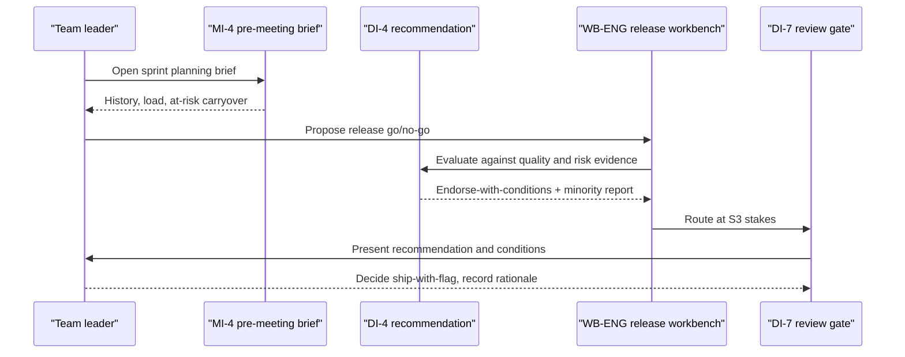
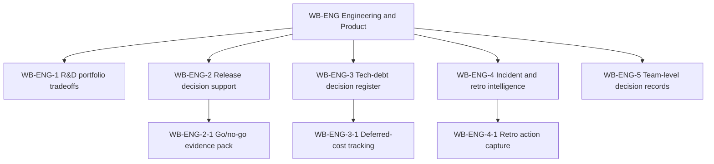

# Engineering team leader perspective

## 1. Front matter

| Field | Value |
|---|---|
| Doc ID | PERS-ENG-LEAD |
| Role | Engineering team lead / line manager (8 direct reports) |
| Owning unit | U21 Perspective Engineering Team Leader |
| Pillars referenced | WB-ENG, MI-2, MI-3, MI-4, GA-1, GA-4, DI-1, DI-4, DI-7, KG-3, SX-3 |
| Version | 1.0 |

## 2. Role & mandate

The engineering team leader runs a single team of roughly eight engineers and is accountable for what the team ships, the quality of what it ships, and the health of the people shipping it. This is the management layer where most of a company's decisions actually happen — not the board, not the executive committee, but the daily and weekly calls about scope, sequencing, risk, and people. In three years, if TrueNorth works for this role, the team leader spends measurably less time assembling context for decisions and writing decision rationale after the fact, makes fewer decisions that a known precedent would have warned against, and feels that the system reduces meeting and reporting load rather than adding a layer of surveillance. If TrueNorth fails for this role, it becomes one more dashboard the team performs for, and a camera pointed at the team's judgment.

## 3. Decisions I face today

| Decision | Cadence | Stakes | Current pain |
|---|---|---|---|
| Sprint scope and commitment | Weekly/biweekly | S4 | I commit based on gut and noisy velocity; I forget which past commitments slipped and why |
| Release go/no-go | Per release | S3 | I weigh incomplete signals (test coverage, open incidents, on-call load) under time pressure |
| Tech-debt vs. feature tradeoff | Continuous | S3–S4 | I cannot quantify the cost of deferring debt, so it always loses to features |
| Incident response and retro actions | Per incident | S3 | Retro actions evaporate; the same class of incident recurs |
| Hiring and team-fit picks | Per req | S3 | I decide on thin signal and rationalize after |
| Who works on what | Continuous | S4 | I balance growth, delivery, and morale with no memory of past assignments' outcomes |

## 4. Jobs-to-be-done

- JTBD-1: When I am about to commit sprint scope, I want a grounded read on whether the commitment is realistic given our history and current load, so I can commit honestly.
- JTBD-2: When a release is pending, I want the go/no-go evidence assembled and a recommendation with its minority report, so I can decide fast without missing a known risk.
- JTBD-3: When I defer tech debt, I want the deferred cost made visible and tracked, so the tradeoff is conscious and revisitable.
- JTBD-4: When we finish a retro, I want the actions captured as tracked commitments, so they do not evaporate.
- JTBD-5: When I make a team decision, I want my rationale captured from what I already say and write, so I am not doing decision homework.
- JTBD-6: When my team disagrees with me, I want the dissent recorded, so we can learn from who was right.

## 5. A day with TrueNorth

I start the week with a pre-meeting brief for sprint planning: TrueNorth has assembled our last six sprints' commit-vs-deliver history, current on-call and incident load, and the two carryover items at risk. In planning, I propose a scope; TrueNorth flags that a similar scope under similar on-call load slipped twice (precedent), and I trim it. Mid-week a release is pending; I open the go/no-go and get an Endorse-with-conditions: ship, but gate the one module with thin test coverage behind a flag, with the minority report noting an open intermittent failure. I decide to ship with the flag and record why. Friday, our incident retro's actions become tracked commitments automatically from the meeting, with owners and checkpoints. I never opened a form all week.

## 6. Feature requirements I own

This unit owns WB-ENG (Engineering & Product). WB-ENG is the department workbench built on the WB-0 framework; it composes platform pillars (DI, MI, GA, SF, KG) into engineering-leader-shaped decision support and does not re-implement them.

### WB-ENG-1 R&D portfolio tradeoffs

- **User story:** As a team leader, I want feature-vs-feature and feature-vs-debt tradeoffs framed with evidence, so that sequencing is deliberate.
- **Description:** Frames the team's candidate work as a portfolio, scoring items against team goals (GA-4 alignment) and capacity forecasts (SF-1).

#### WB-ENG-1-1 Tradeoff framing

- **Behavior:** Presents candidate work items with alignment scores, rough effort, and dependency risk; highlights items that block others.
- **Data touched:** Team backlog, goal links, capacity forecast.
- **Model/AI involvement:** Judge over alignment and dependencies.
- **UX surface:** SX-1 team command center.
- **Acceptance criteria:** Each candidate shows its goal alignment and the cost of deferral; "do nothing" is always an option.

### WB-ENG-2 Release decision support

- **User story:** As a team leader, I want a go/no-go recommendation grounded in our quality and operational signals, so that I decide fast and safely.
- **Description:** Assembles release evidence and invokes DI for a stakes-tiered recommendation with conditions.

#### WB-ENG-2-1 Go/no-go evidence pack

- **Behavior:** Gathers test coverage, open incidents, change risk, on-call load, and prior similar releases' outcomes into a decision record routed through DI.
- **Data touched:** CI/CD signals, incident records, release history (via DF connectors and KG).
- **Model/AI involvement:** Evidence assembly + DI judge.
- **UX surface:** SX-1, SX-3 (in the team's chat/CI flow).
- **Acceptance criteria:** Recommendation carries conditions and a minority report; the leader can ship against a Caution with a recorded reason.

### WB-ENG-3 Tech-debt decision register

- **User story:** As a team leader, I want deferred tech debt to carry a visible, tracked cost, so that it is not invisibly free to defer.
- **Description:** Records debt-deferral decisions and tracks their accumulating cost and realized consequences.

#### WB-ENG-3-1 Deferred-cost tracking

- **Behavior:** Each deferral becomes a decision record with an estimated carrying cost and a revisit checkpoint; DI-8 later binds realized consequences (incidents, slowdowns).
- **Data touched:** Debt register, decision records, outcomes.
- **Model/AI involvement:** Judge (cost estimate) + outcome binding.
- **Acceptance criteria:** Every deferral has a revisit date; recurring incidents trace back to the deferral that allowed them.

### WB-ENG-4 Incident and retro intelligence

- **User story:** As a team leader, I want retro actions to become tracked commitments, so that they actually happen.
- **Description:** Turns incident retros into tracked commitments and surfaces incident-class patterns.

#### WB-ENG-4-1 Retro action capture

- **Behavior:** Extracts retro actions (via MI-2) as commitments with owners and checkpoints; clusters recurring incident classes.
- **Data touched:** Meeting extraction, commitment tracking, incident history.
- **Model/AI involvement:** Extractive + clustering judge.
- **Acceptance criteria:** Retro actions appear as tracked commitments without manual entry; recurring classes are flagged.

### WB-ENG-5 Team-level decision records

- **User story:** As a team leader, I want my decisions captured from what I already say, so that I am not writing rationale documents.
- **Description:** Generates lightweight decision records for team decisions from meetings and chat, with my dissent and my team's dissent recorded.

#### WB-ENG-5-1 Low-burden decision capture

- **Behavior:** Creates S4/S3 decision records from meeting and chat context with minimal prompting; records who dissented.
- **Data touched:** Meeting/chat extraction, decision records.
- **Model/AI involvement:** Extractive + generative summary.
- **Acceptance criteria:** A typical team decision is captured with zero forms; the leader edits rather than authors; dissent is preserved.

## 7. Cross-pillar needs

| Need | Depends on |
|---|---|
| Pre-meeting briefs and agenda quality for planning and retros | MI-4 |
| Extraction of decisions, actions, and dissent from team meetings | MI-2 |
| Meeting summaries that cut my reporting load | MI-3 |
| Team goal cascade and alignment scoring | GA-1, GA-4 |
| Recommendation, conditions, and minority report for go/no-go | DI-4 |
| Stakes-tiered review routing at S3/S4 | DI-7 |
| Capacity and velocity forecasting | SF-1 |
| Precedent of similar past team decisions and outcomes | KG-3 |
| In-flow actions inside chat and CI tools | SX-3 |

## 8. Red lines & veto conditions

- Any per-engineer productivity scoring, ranking, or "decision quality" leaderboard is an absolute veto — it violates the canonical red lines and would destroy trust on the team overnight.
- If using TrueNorth means more meetings or more forms than today, I will not adopt it; net meeting and reporting load must go down.
- If my team's recorded decisions are surfaced to my management as a performance instrument rather than a learning tool, I will stop recording real rationale and the system becomes theater.
- If the system blocks me from shipping when I judge it right, it is broken; it advises, I decide.
- If dissent capture is used to single out individuals rather than to learn, I veto dissent capture.

## 9. Adoption & workflow integration

I would adopt the pre-meeting brief, go/no-go evidence pack, and retro-action capture immediately — they remove work I already do badly. I would let decision capture run passively from meetings and chat and edit rather than author. I would ignore anything that asks my engineers to feed the system manually. The system must live in the tools we already use (chat, CI, the planning board) via SX-3, not in a separate destination I have to remember to visit.

## 10. Success metrics & value model

- Reduction in time I spend assembling context and writing rationale (target: meaningful weekly hours back).
- Fewer repeat incidents of a previously-retro'd class.
- Commitment follow-through rate up (retro actions actually closed).
- Decisions that a surfaced precedent warned against, and were avoided.
- Team-reported sense that meeting/reporting load went down, not up (leading trust indicator).
- No increase — ideally a decrease — in total meeting hours per sprint.

## 11. Hard questions for the build team

- HQ-1: How do you guarantee, technically and contractually, that team-level decision records cannot be repurposed into individual performance evaluation?
- HQ-2: When the recommendation is wrong and I ship against it correctly, does the system learn from my override, or does it quietly hold it against my "calibration"?
- HQ-3: How light is "low-burden" capture really — what exactly do I have to do per decision, in seconds?
- HQ-4: If two of my engineers dissent and are later proven right, how is that surfaced without turning into blame?
- HQ-5: What happens to all of this in an air-gapped or restricted deployment where chat/CI integration is limited?

## 12. Dependencies & references

| Reference | Type | Why |
|---|---|---|
| WB-ENG | Owned WB code | Engineering & product workbench specced here |
| MI-2, MI-3, MI-4 | Canonical L2 | Meeting extraction, summaries, and pre-meeting briefs |
| GA-1, GA-4 | Canonical L2 | Goal cascade and alignment scoring |
| DI-1, DI-4, DI-7 | Canonical L2 | Decision capture, recommendation, and review gates |
| KG-3 | Canonical L2 | Precedent and institutional memory |
| SF-1 | Canonical L2 | Capacity/velocity forecasting |
| SX-3 | Canonical L2 | In-flow integration with chat and CI |
| U6 Catalog DI+SF | Work unit | Owns the decision engine this workbench invokes |
| U5 Catalog MI+GA | Work unit | Owns meeting intelligence and alignment |
| U7 Catalog SX+WB-0 | Work unit | Owns the workbench framework WB-ENG is built on |
