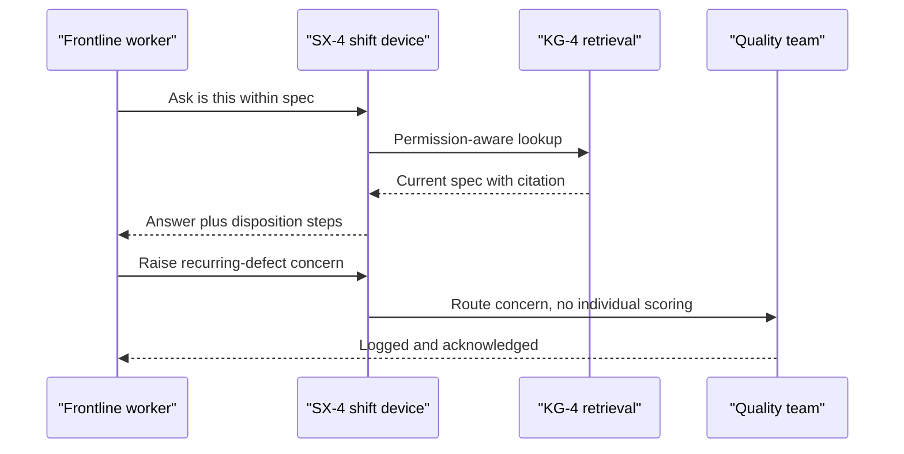
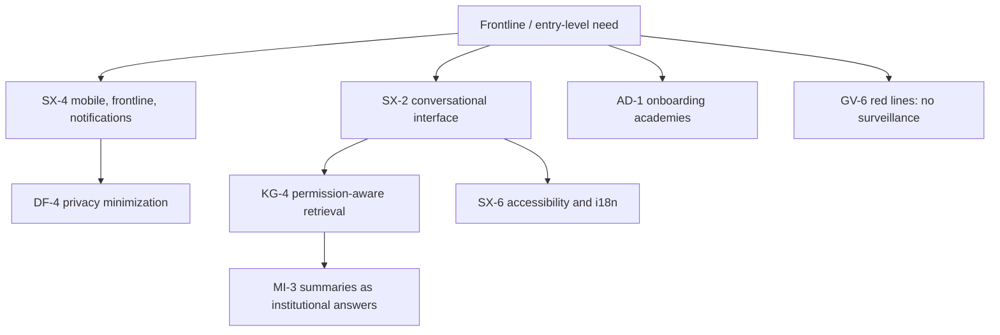

# Frontline & entry-level employee perspective

## 1. Front matter

| Field | Value |
|---|---|
| Doc ID | PERS-FRONTLINE |
| Role | New graduate, factory-floor worker, and intern (blended) |
| Owning unit | U23 Perspective Frontline & Entry-Level |
| Pillars referenced | SX-4, SX-2, SX-6, KG-4, MI-3, AD-1, GV-6, DF-4, DI-4 |
| Version | 1.0 |

## 2. Role & mandate

This perspective speaks for the largest population in any Fortune-500 company and the one with the least power over the tools imposed on it: the new graduate three weeks into a first job, the production-line operator who does not sit at a desk, and the intern who does not yet know what they are allowed to ask. These people rarely make S1–S2 decisions, but they make and execute thousands of S4 decisions a day, they are the first to see when a plan meets reality, and they are the most exposed to a system that could be turned into surveillance. In three years, if TrueNorth works for them, a new hire reaches competence faster because institutional knowledge is answerable on demand, a floor worker can raise a concern safely and see it taken seriously, and no one feels watched. If it fails for them, it becomes an instrument of monitoring that teaches everyone to perform for the machine and hide problems.

## 3. Decisions I face today

| Decision | Cadence | Stakes | Current pain |
|---|---|---|---|
| Is this part/output within spec or do I flag it | Continuous | S4 (occasionally S3) | I am unsure of the threshold and afraid flagging will look like I am slow |
| Who do I ask when I am stuck | Many times daily | S4 | I do not know who knows, so I guess or stay stuck |
| Should I raise a safety or quality concern | As it arises | S3–S4 | I fear being seen as a troublemaker; the channel is unclear |
| How do I do this task correctly the first time | Daily | S4 | Tribal knowledge lives in people's heads, not anywhere I can reach |
| Am I prioritizing the right thing today | Daily | S4 | I cannot see how my task connects to anything larger |

## 4. Jobs-to-be-done

- JTBD-1: When I am stuck, I want to ask a plain question and get a correct, sourced answer, so I am not blocked or guessing.
- JTBD-2: When I need a human expert, I want to know who actually knows, so I ask the right person.
- JTBD-3: When I see a problem on the floor, I want a safe, simple way to raise it that I trust will be heard, so I speak up.
- JTBD-4: When I am new, I want to absorb how things are done here without reading 200 pages, so I become useful fast.
- JTBD-5: When I do a task, I want to know the standard and whether I met it, so I can do it right without fear.

## 5. A day with TrueNorth

On the line, I am unsure whether a finished unit meets the tolerance. On the shared floor terminal — no personal login tracking me, a shift device — I ask in plain language and get the current spec with the source document, plus the disposition steps if it is out of tolerance. Later I notice a recurring defect; I raise it through a one-tap concern flow that routes it to quality without my name being used to score me, and I get a confirmation that it was logged and to whom. As a new grad on another team, I ask "why did we choose this vendor last year?" and get the decision record and its rationale from institutional memory, so I stop re-asking questions everyone is tired of. Nothing I did was used to rank me; it was used to help me.

## 6. Feature requirements I own

No owned workbench. This perspective owns no WB code and specs no platform features. Its value is in stating what the frontline and entry-level population needs from existing pillars, and where it draws hard lines. The dependency chain that matters most to this role:

## 7. Cross-pillar needs

| Need | Depends on |
|---|---|
| Deskless/factory-floor surfaces on shared and shift devices | SX-4 |
| Plain-language question answering | SX-2 |
| Correct, sourced answers from institutional memory | KG-4 |
| Digestible "how we do this" knowledge instead of raw documents | MI-3 |
| Fast, guided onboarding | AD-1 |
| Enforced red lines against monitoring and individual scoring | GV-6 |
| Privacy minimization so my questions are not retained against me | DF-4 |
| Accessibility, multiple languages, and units for a global frontline | SX-6 |
| Clear, plain recommendations when I do face a real decision | DI-4 |

## 8. Red lines & veto conditions

- If anything I ask, flag, or do is used to score, rank, or surveil me as an individual, the system is unacceptable — this is the canonical red line, and I am the person it protects.
- If raising a concern can be traced back to punish me, no one will raise concerns, and the floor becomes more dangerous, not less.
- If the system only works for desk workers with personal logins and English fluency, it excludes most of the company.
- If asking a "dumb" question is recorded as a competence signal, people will stop asking and stay ignorant.
- If a shared shift device silently attributes activity to whoever last logged in, that is covert monitoring by accident, and I veto it.

## 9. Adoption & workflow integration

I will use a plain-language assistant on a shared floor terminal or shift device the moment it gives correct, sourced answers faster than asking around. I will use a one-tap concern flow if I trust it is not a trap. I will not carry another personal app that tracks me, and I cannot use anything that assumes a desk, a personal login, perfect connectivity, or fluent English. Onboarding help has to be in the flow of the actual work, not a separate course I am told to complete after hours.

## 10. Success metrics & value model

- Time-to-competence for new hires (faster ramp).
- Questions answered without escalating to a busy senior (deflection that helps, not hides).
- Concerns raised and resolved (safety/quality signal going up because people feel safe, not because problems increased).
- Frontline adoption among deskless workers (not just desk staff).
- Zero individual-surveillance incidents — a hard gate, not a metric to optimize.

## 11. Hard questions for the build team

- HQ-1: On a shared shift device, how do you give me useful answers without attributing my activity to me as an individual?
- HQ-2: What concrete, verifiable guarantee do I have that my questions and flags will never feed a performance or ranking system?
- HQ-3: How does the concern flow protect me from retaliation, technically — not just in policy?
- HQ-4: How well does this work with no/poor connectivity, in my language, for someone who is not at a computer?
- HQ-5: When the assistant does not know, does it clearly say so and point me to a human, or does it guess and risk getting me hurt?

## 12. Dependencies & references

| Reference | Type | Why |
|---|---|---|
| SX-4 | Canonical L2 | Frontline/deskless surfaces, shared and shift devices |
| SX-2 | Canonical L2 | Plain-language assistant |
| SX-6 | Canonical L2 | Accessibility, language, and units for a global frontline |
| KG-4 | Canonical L2 | Permission-aware, sourced answers from institutional memory |
| MI-3 | Canonical L2 | Digestible institutional answers |
| AD-1 | Canonical L2 | In-flow onboarding |
| GV-6 | Canonical L2 | Red lines forbidding surveillance and individual scoring |
| DF-4 | Canonical L2 | Privacy minimization at ingest |
| DI-4 | Canonical L2 | Plain recommendations for the decisions I do face |
| U7 Catalog SX+WB-0 | Work unit | Owns the surfaces this role depends on |
| U8 Catalog GV | Work unit | Owns the red lines that protect this role |
