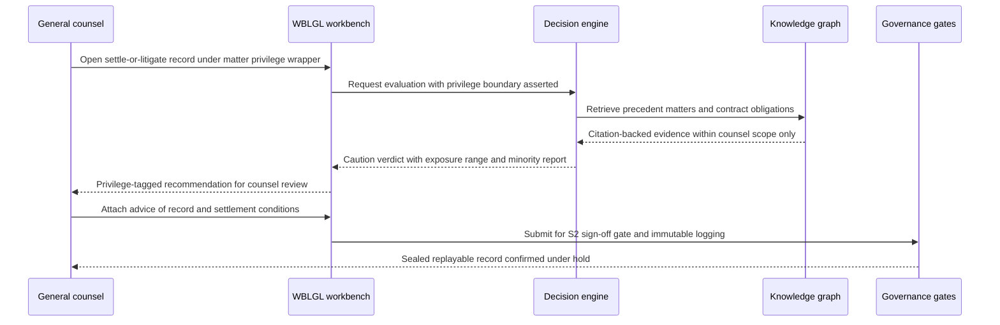
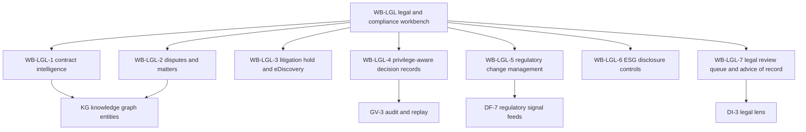

# Legal & compliance perspective

## 1. Front matter

| Field | Value |
|---|---|
| Doc ID | PERS-LGL |
| Role | General counsel & chief compliance officer |
| Owning unit | U16 Perspective Legal & Compliance |
| Pillars referenced | DF-4, DF-5, DF-6, DF-7, KG-1, KG-3, KG-4, MI-2, MI-6, GA-1, DI-2, DI-3, DI-4, DI-5, DI-7, SF-3, WB-LGL, SX-3, GV-1, GV-2, GV-3, GV-4, GV-5, GV-6, GV-7, SC-1, SC-2, SC-5, PL-4, AD-2 |
| Version | 1.0 |

## 2. Role & mandate

The general counsel and the chief compliance officer are jointly accountable for the company's legal risk posture: litigation and disputes, contracts, regulatory compliance across every jurisdiction the company operates in, corporate governance, privilege and records management, investigations, and the legal accuracy of public disclosures including ESG reporting. They co-certify (with the CFO) the control environment that supports SOX certifications, own the litigation hold and eDiscovery program, and answer personally to regulators, external auditors, and the board's audit committee.

This role views TrueNorth differently from every other buyer in the building. To the rest of the company, TrueNorth is a decision-support platform. To legal, it is the single largest concentration of discoverable evidence the company has ever created: every decision record, every meeting transcript, every recommendation, every minority report, every confidence score is a potential exhibit. A platform that records why the company did what it did is enormously valuable in defense — and catastrophic if privilege, retention, and hold obligations are bolted on after the fact. The mandate is therefore twofold: extract the genuine legal-department value (contract intelligence, regulatory change management, dispute support, disclosure controls) and ensure the platform as a whole is built so that its records help the company in court and before regulators rather than ambush it.

Success in three years looks like this: every material decision carries a defensible, privilege-correct, replayable record; litigation holds are issued and enforced across all connected systems within hours, not weeks; regulatory change reaches an accountable owner with a gap analysis within days of publication; ESG and securities disclosures trace every figure to source data with a signed review trail; no privilege waiver, spoliation finding, or audit qualification has ever been attributable to the platform; and outside counsel spend on document review and early case assessment has fallen by a third because institutional memory is queryable.

## 3. Decisions I face today

| Decision | Cadence | Stakes | Current pain |
|---|---|---|---|
| Settle, arbitrate, or litigate a significant dispute | Monthly | S2 | Exposure estimates are gut-feel plus one outside counsel memo; prior similar matters and their outcomes live in departed lawyers' heads |
| Approve or escalate contract terms deviating from playbook | Daily | S3–S4 | No systematic view of which deviations we have already accepted with the same counterparty, or aggregate indemnity exposure |
| Scope and issue a litigation hold | Event-driven | S2 | Custodian identification is manual guesswork; suspending disposition across dozens of systems takes weeks and is never provably complete |
| Decide whether a new regulation applies to us and how fast to comply | Weekly | S2–S3 | Horizon scanning is a spreadsheet of newsletters; applicability triage starts months late |
| Sign off on ESG and securities disclosure language | Quarterly | S1–S2 | Disclosed figures arrive without lineage; verifying a single climate number takes days of email archaeology |
| Determine whether an incident triggers a disclosure obligation | Event-driven | S1 | Reconstructing who knew what when is a forensic project rather than a query |
| Grant or refuse a policy exception | Weekly | S3 | Exceptions are granted in email and forgotten; nobody can list the open exceptions when the auditor asks |
| Approve legal positions in M&A diligence | Event-driven | S1 | Diligence findings are not connected to the contract obligations and disputes already in our records |

## 4. Jobs-to-be-done

- JTBD-1: When litigation is reasonably anticipated, I want a graph-aware litigation hold that identifies likely custodians and data sources and provably suspends disposition everywhere, so I can defeat any spoliation argument.
- JTBD-2: When legal analysis enters a decision record, I want privilege asserted, segregated, and access-enforced at creation, so discovery produces exactly what it must and nothing it must not.
- JTBD-3: When a dispute strategy decision is due, I want exposure ranges grounded in our own precedent matters and contract terms with citations, so settle-versus-litigate is an evidence-based call.
- JTBD-4: When a regulation is published or amended, I want applicability triage and a mapping to the affected policies, controls, contracts, and pending decisions, so implementation starts the same week.
- JTBD-5: When a contract is negotiated, I want deviations from playbook flagged with severity and our historical concessions to that counterparty, so counsel attention goes where risk is.
- JTBD-6: When disclosure documents are drafted, I want every quantitative claim traced to its source and every unsupported claim flagged, so my sign-off rests on evidence rather than trust.
- JTBD-7: When any decision trips a legal-risk trigger, I want it routed to a counsel queue where formal advice of record is attached, so the company can demonstrate it sought and followed counsel.
- JTBD-8: When a regulator or auditor demands to know how a decision was made, I want a sealed, replayable record of inputs, model versions, evidence, and sign-offs as of that date, so the response is a production rather than a reconstruction.
- JTBD-9: When public ESG commitments are made, I want them tracked as commitments with drift alerts, so we are never surprised by our own prior statements at the next disclosure cycle.

## 5. A day with TrueNorth

07:40. The overnight digest in my workbench shows three items: a proposed amendment to an EU platform-liability directive scored as likely applicable to two of our subsidiaries, a contract deviation queue with one severity-red item (a supplier demanding an uncapped indemnity), and a reminder that the hold in the Meridian warranty matter has four custodians who have not re-certified.

09:00. The Meridian settle-or-litigate decision is on today's litigation committee agenda. I open the decision record — created under the matter's privilege wrapper, visible only to the legal team and the two executives I designated. TrueNorth has assembled the evidence: the warranty clauses across the affected contract family, three prior matters with comparable fact patterns and their outcomes, and an exposure simulation showing a P10–P90 range. The verdict is Caution on proceeding to trial, with conditions; the minority report argues that settling now establishes a pricing anchor for two pending follow-on claims. That minority report is exactly the kind of analysis I used to pay outside counsel to produce in week six. I add my formal advice of record — distinct from the engine's legal lens output, and labeled as such — recommending a structured settlement with a confidentiality term, and route the record to the committee with the S2 sign-off gate.

11:30. The uncapped-indemnity deviation. The workbench shows we have rejected this exact ask from this counterparty twice, and that our aggregate uncovered exposure to them already exceeds the threshold I set last year. I reject with the playbook fallback language attached; the negotiating team gets the reasoning, not just a no.

14:00. The compliance officer and I triage the EU directive item. TrueNorth has mapped the draft obligations to four existing policies, one control gap, and seventeen in-flight decisions that would be affected if the directive passes as written. We assign owners and set a re-review trigger on the next legislative milestone. What used to be a quarter of committee meetings is a forty-minute working session.

16:30. The external auditor's interim fieldwork request arrives: evidence for the controls around AI-assisted decisions feeding the revenue forecast. I generate the replay package for the sampled decisions — inputs, retrieval citations, model and policy versions, gate sign-offs — without touching a single privileged annex, because the privilege boundary is enforced at the storage layer, not by my diligence at export time. Before TrueNorth, that request was a three-week scramble.

## 6. Feature requirements I own

This unit owns WB-LGL, the legal and compliance workbench, built on the WB-0 framework. All IDs below are minted under WB-LGL per the shared specification's rules. Platform capabilities (audit replay, policy engine, retrieval, lenses) are consumed by canonical L2 ID and are not re-specified here.

### WB-LGL-1 Contract intelligence

User story: as deputy GC for commercial, I want every executed contract parsed into obligations, rights, and risk-scored clauses linked to counterparties in the knowledge graph, so that renewal, supplier, and deal decisions run on actual contract terms rather than tribal memory.

TrueNorth shall ingest the contract corpus from CLM and document repositories, structure it against the KG-1 Contract entity, and keep extraction provenance to the clause level.

- WB-LGL-1-1 Repository ingestion & clause extraction. Behavior: ingest executed contracts and amendments, classify document type, extract parties, term, renewal mechanics, governing law, and a configurable clause taxonomy (indemnity, limitation of liability, IP, data protection, termination, audit rights). Data: contract files, clause library, counterparty entities. AI: layout-aware extraction with per-field confidence; sub-threshold extractions route to a paralegal verification queue. UX: review queue with side-by-side source page. Acceptance: every extracted field cites the source page and passage; extraction precision on the tenant golden set is measured and reported per release.
- WB-LGL-1-2 Obligation & commitment register. Behavior: extracted obligations become commitment nodes with owner, due date, and trigger conditions; breach-risk alerts fire ahead of deadlines. Data: commitments linked to contracts and owning teams. AI: obligation phrasing normalization only; no AI-set deadlines without source text. Acceptance: every registered obligation is traceable to clause text; alert lead time is configurable per obligation class.
- WB-LGL-1-3 Playbook deviation scoring. Behavior: draft contracts are compared against the negotiation playbook; deviations are flagged with severity, the approved fallback language, and the history of concessions to that counterparty. AI: clause similarity and deviation classification. UX: deviation queue ranked by severity inside the workbench and via the SX-3 in-flow plugin. Acceptance: the system never auto-accepts or auto-redlines terms; every severity-red deviation requires counsel disposition before signature workflow proceeds.
- WB-LGL-1-4 Counterparty exposure radar. Behavior: aggregate exposure per counterparty and contract family — uncapped indemnities, liability cap totals, change-of-control triggers, concentration of critical terms — surfaced to dispute, supplier, and M&A decisions. Acceptance: exposure figures decompose to the underlying clauses on demand.

### WB-LGL-2 Disputes & litigation matters

User story: as head of litigation, I want each matter to be a structured workspace with exposure ranges, precedent outcomes, and decision support for strategy calls, so reserves and settlement positions are evidence-based and consistently recorded.

- WB-LGL-2-1 Matter workspace & timeline. Behavior: matter records hold parties, claims, key dates, related contracts and decisions, and the matter's privilege wrapper; the timeline assembles filings, internal milestones, and linked decision records. Acceptance: matter creation automatically instantiates the privilege wrapper of WB-LGL-4-1.
- WB-LGL-2-2 Exposure quantification & precedent retrieval. Behavior: retrieve comparable prior matters with outcomes from institutional memory and present exposure as a probability range; simulation of damages scenarios is consumed from SF-3. AI: similarity retrieval over matter facts with citations; counsel can strike non-comparable precedents and the strike is recorded. Acceptance: every precedent shown carries its outcome, date, and a comparability rationale.
- WB-LGL-2-3 Settle-versus-litigate decision support. Behavior: a privileged decision-record template structures options (settle, arbitrate, litigate, default judgment posture), criteria, and assumptions; the DI-4 verdict and DI-5 minority report attach inside the privilege wrapper; counsel's work-product designation is recorded on analytical artifacts prepared in anticipation of litigation. Acceptance: nothing in the record is visible outside the wrapper's access list; the verdict text is labeled as decision-support analysis, not legal advice.
- WB-LGL-2-4 Outside counsel & spend analytics. Behavior: matter budgets versus actuals, rate and outcome benchmarking across firms, staffing review prompts at budget thresholds. Data: e-billing feeds. Acceptance: spend anomalies route to the matter owner, never to automated fee actions.

### WB-LGL-3 Litigation hold & eDiscovery

User story: as chief compliance officer, when litigation or an investigation is reasonably anticipated, I want to issue a hold in minutes that provably suspends disposition across connected systems and TrueNorth's own records, so spoliation is impossible and release is defensible.

- WB-LGL-3-1 Hold issuance & graph-aware scoping. Behavior: counsel opens a hold from a matter; TrueNorth proposes custodians and data sources from knowledge-graph relationships (who participated in the relevant decisions, meetings, contracts, and projects), with the reasoning shown; counsel edits and approves scope. AI: custodian suggestion only. Acceptance: holds are never auto-issued; the approved scope, the proposal, and counsel's edits are all preserved.
- WB-LGL-3-2 Preservation enforcement & retention override. Behavior: hold flags propagate to the retention engine and suspend disposition for in-scope decision records, transcripts, graph snapshots, attachments, and connector-reachable sources that support preservation-in-place; an immutable hold ledger records every suspension and every system that could not be programmatically held (triggering manual preservation tasks). Acceptance: no purge job can delete held material; attempted deletions are logged and surfaced.
- WB-LGL-3-3 Acknowledgment & compliance tracking. Behavior: hold notices, acknowledgment capture, escalating reminders, periodic re-certification, and a custodian-status dashboard. Acceptance: non-acknowledgment past the configured window escalates to the custodian's manager and the matter owner.
- WB-LGL-3-4 Production workspace & defensible release. Behavior: build privilege-filtered export sets for discovery or regulator productions with privilege logs and redaction support; on hold release, disposition resumes per schedule with documented counsel authorization. Acceptance: a production set can be reproduced byte-identically from its manifest; release without recorded authorization is impossible.

### WB-LGL-4 Privilege-aware decision records

User story: as general counsel, I want privilege asserted, segregated, and enforced the moment legal analysis enters a decision record, so the platform strengthens rather than erodes the company's privilege posture.

- WB-LGL-4-1 Privilege tagging at creation. Behavior: matter-linked privilege wrappers apply attorney-client or work-product designation to records, annexes, and analysis threads, with a counsel-directed flag for analyses commissioned by legal; designation requires a named attorney. Acceptance: privilege cannot be applied retroactively without an audited counsel action explaining the basis.
- WB-LGL-4-2 Segregated storage & privilege-aware retrieval. Behavior: privileged content is segregated and excluded from general semantic retrieval and from evidence assembly for non-privileged decisions; only wrapper-authorized counsel and designated clients retrieve it. Cross-pillar enforcement is consumed from SC-2 and KG-4. Acceptance: a retrieval test suite proves privileged passages never appear in answers, citations, or training data for users outside the wrapper.
- WB-LGL-4-3 Waiver risk detection. Behavior: alerts when privileged material is shared beyond the wrapper's need-to-know list, exported, or pasted into non-privileged channels; access trails are queryable per artifact. Acceptance: detection covers exports and surface integrations, not only in-app shares; alerts route to the matter attorney within minutes.
- WB-LGL-4-4 Privilege log & redacted export generation. Behavior: generate privilege logs (document, date, author, recipients, basis) and redacted versions for production sets. AI: first-draft log entries and redaction suggestions; counsel approves every entry. Acceptance: no log entry or redaction ships without attorney approval recorded against it.

### WB-LGL-5 Regulatory change management

User story: as chief compliance officer, I want regulatory developments triaged for applicability and mapped to the policies, controls, contracts, and decisions they affect, so implementation starts the week a rule lands.

- WB-LGL-5-1 Horizon scanning & applicability triage. Behavior: regulatory, legislative, and enforcement feeds (consumed from DF-7) are filtered by jurisdiction, entity, and business activity; an applicability assessment with reasoning and confidence routes to counsel for confirmation. Acceptance: every triage outcome (applicable, not applicable, watch) is recorded with the confirming attorney; misses against a quarterly benchmark feed are reported.
- WB-LGL-5-2 Obligation-to-control mapping. Behavior: confirmed obligations map to existing policies, controls, contract clauses, and in-flight decisions in the graph; gaps generate a remediation list with proposed owners. Acceptance: each mapping is citable to the obligation text; the gap list distinguishes confirmed gaps from unmapped uncertainty.
- WB-LGL-5-3 Implementation tracking & attestation. Behavior: remediation tasks with deadlines, completion evidence, and owner attestations; status rolls up to a compliance-posture view per regulation. Acceptance: attestations are immutable and individually attributable.
- WB-LGL-5-4 Regulator interaction log. Behavior: examinations, inquiries, filings, and commitments made to regulators are recorded as tracked commitments with owners and deadlines. Acceptance: an open-commitments view per regulator is producible on demand.

### WB-LGL-6 ESG disclosure & reporting controls

User story: as the executive co-signing CSRD and securities ESG disclosures, I want every disclosed figure traceable to its source with a controlled review trail, so sign-off rests on audit-grade evidence.

- WB-LGL-6-1 Disclosure datapoint inventory & lineage. Behavior: each required datapoint (ESRS, SEC climate, and tenant-configured frameworks) maps to its source metric with end-to-end lineage consumed from DF-5; stale or estimated figures are flagged with their basis. Acceptance: any disclosed number resolves to source systems and transformation steps in one query.
- WB-LGL-6-2 Drafting workspace with claim-to-evidence checking. Behavior: disclosure drafts are checked claim-by-claim against the datapoint inventory; unsupported or overstated claims (greenwashing risk) are flagged with the gap explained. AI: claim extraction and evidence matching with citations. Acceptance: a draft cannot advance to sign-off with unresolved red flags unless counsel records an override rationale.
- WB-LGL-6-3 Review, sign-off & version control. Behavior: stakes-tiered review chain with immutable versioning; who approved which figure and which language, and when, is permanently recorded. Acceptance: the sign-off trail for any published disclosure is exportable for the external auditor without manual assembly.
- WB-LGL-6-4 Public-commitment tracking. Behavior: published ESG targets and statements become tracked commitments; drift between trajectory and commitment alerts legal and the owning executive ahead of the next disclosure cycle. Acceptance: every public target has an owner and a measurable binding or an explicit "unbound" flag visible to sign-off.

### WB-LGL-7 Legal review queue & advice of record

User story: as general counsel, I want every decision that trips a legal-risk trigger routed to a counsel queue where formal advice is attached as the advice of record, so the company can show it sought and followed counsel, and counsel attention is triaged by risk.

- WB-LGL-7-1 Legal-risk triggered routing. Behavior: triggers (contract value thresholds, jurisdictions, sanctions and export-control indicators, antitrust-sensitive topics, regulated-product changes) route decision records to the legal queue; trigger rules are maintained by the GC and enforced through GV-1. Acceptance: trigger changes are versioned and auditable; queue SLAs are tracked per trigger class.
- WB-LGL-7-2 Advice-of-record attachment. Behavior: counsel's formal position attaches to the decision record as a privileged annex, explicitly distinct from the DI-3 legal lens output; the rendered verdict must label machine analysis as such and never present it as legal advice. Acceptance: any record with a legal trigger but no advice of record is visibly flagged at sign-off.
- WB-LGL-7-3 Escalation, conflicts & ethical walls. Behavior: counsel disagreement with the engine's legal lens escalates to the GC with both positions preserved; ethical walls prevent attorneys on adverse internal matters from seeing each other's wrappers. Acceptance: wall violations are technically prevented, not merely logged.

## 7. Cross-pillar needs

| Need | Depends on |
|---|---|
| Privilege and classification labels must be enforced in retrieval so privileged passages never reach unauthorized users or prompts | SC-2 |
| Permission-aware semantic retrieval must respect privilege wrappers during evidence assembly | KG-4 |
| Any recommendation affecting legal exposure must be reproducible as of its date, with model and policy versions | GV-3 |
| EU AI Act, GDPR, SOX, and sectoral evidence packs must be producible at the platform level | GV-5 |
| Legal-risk routing and decision-rights rules must execute in the policy engine | GV-1 |
| Stakes-tiered sign-off gates must block S1/S2 legal decisions pending counsel action | GV-2 |
| The legal lens must consume playbooks and positions maintained in WB-LGL | DI-3 |
| PII minimization must run before persistence so records do not over-collect | DF-4 |
| Privileged and regulated content must honor residency pinning and transfer controls | DF-6 |
| Regulatory, legislative, and sanctions feeds with source-reliability scoring | DF-7 |
| Field-to-citation lineage must back every disclosed ESG figure | DF-5 |
| Bitemporal as-of queries must support hold scoping and regulator replay | KG-3 |
| Contract, Policy, and Risk entities must exist in the core ontology | KG-1 |
| Per-jurisdiction recording consent and off-the-record zones for counsel conversations | MI-6 |
| Damages and exposure simulations for dispute decisions | SF-3 |
| Explainability artifacts fit for regulator submission, not just internal debugging | GV-4 |

## 8. Red lines & veto conditions

The general counsel will veto deployment, or order capabilities disabled, on any of the following.

- Privilege leakage by design. If privileged content can reach general retrieval, model fine-tuning corpora, cross-tenant telemetry, or any user outside a wrapper's access list, the platform is shut off for legal content immediately. One waiver event can taint an entire matter.
- Retention without governance. Every artifact must carry a retention class and disposition schedule; "keep everything forever" is as unacceptable as silent deletion. Any purge path that can defeat a litigation hold — including vendor-side log rotation, cache eviction of cited evidence, or model-version retirement that breaks replay — is a veto condition.
- Discoverability blindness. Features that encourage casual speculation in permanent records (free-text "risk musings," unreviewed AI conjecture about liability stored as fact) create exhibits. Draft and deliberative states must be clearly separated from records of decision, with retention rules appropriate to each, within what the law permits.
- The engine practicing law. If any surface presents the DI-3 legal lens or a DI-4 verdict as legal advice, or routes around the advice-of-record requirement on triggered decisions, that surface is disabled. Machine analysis is decision support; advice comes from a named attorney.
- Unmanaged adverse inference. Every verdict is evidence. If the company proceeds against an Oppose verdict, that record will be plaintiff's exhibit one; if it follows an Endorse verdict into harm, the verdict is evidence of process. The platform must make counsel's review and rationale capture possible at these moments — not silently accumulate un-contextualized verdicts. The shared red lines (no covert monitoring, no individual surveillance scoring, no autonomous people decisions) are also strict legal red lines under GV-6; insider-risk monitoring under SC-5 must remain within disclosed, policy-bound scope.
- Cross-border contamination. Privileged or regulated content leaving its pinned jurisdiction, or EU personal data processed against purpose limitations, triggers immediate scope reduction. GDPR exposure includes the meeting corpus: transcripts are personal data, and data-subject access requests will reach them.
- Silent model change. Any model, prompt, or policy change that alters recommendations relevant to financial reporting or disclosure, made without change control visible to compliance, is a SOX problem and a veto condition under GV-7 model risk management.

### Regulator & external auditor lens

An SEC examiner, an EU market-surveillance authority under the AI Act, a data protection authority, and the external financial auditor will each demand to replay and inspect the system. The platform must satisfy all four or it will not survive its first serious examination.

What they will demand to replay and inspect:

- Reproduction on demand. For any sampled decision: the inputs, retrieved evidence with lineage to source fields, model and prompt versions, policy configuration, lens outputs, verdict, conditions, minority report, human sign-offs, and the as-of state of the knowledge graph — reproducible years later (GV-3, KG-3). "The model was deprecated" is not an answer; replay obligations must drive model and configuration retention schedules.
- Change control evidence. SOX ITGC-grade records of every change to models, prompts, policies, and connectors that touch financial-reporting-relevant decisions: who changed what, who approved, what testing preceded release (GV-7, PL-4 evidence consumed via GV-5 packs).
- EU AI Act technical file. Risk classification rationale for each deployed use, technical documentation, data-governance description, accuracy and robustness testing, human-oversight design, logging adequacy, and — where the company acts as deployer for high-risk uses — fundamental-rights impact assessment records. Workforce-adjacent decision support is the highest-exposure area and must show the human-authority invariant operating in practice, not just on paper.
- GDPR accountability artifacts. Records of processing, DPIAs for meeting capture and profiling-adjacent features, lawful-basis mapping, consent records per jurisdiction (MI-6), minimization evidence (DF-4), data-subject request handling that can locate a person across transcripts and graph nodes, and transfer-mechanism documentation (DF-6).
- Access and integrity proof. Complete access logs over decision records and privileged wrappers, demonstration that audit logs are tamper-evident, and proof that holds actually suspended disposition (the hold ledger of WB-LGL-3-2).

What would make them shut the deployment down: a recommendation that cannot be reproduced; logs that can be edited; a demonstrated privilege or residency breach; records destroyed under hold; an AI Act high-risk use operating without its documentation and oversight measures; or discovery that disclosure-relevant figures flowed through uncontrolled model changes. Each of these converts TrueNorth from the company's best defense into the centerpiece of the enforcement action.

## 9. Adoption & workflow integration

What the legal department would actually change: contract intake and deviation triage move into the workbench on day one — that is where the fastest, least controversial value sits. Regulatory horizon scanning replaces the newsletter spreadsheet in the first quarter. Matter workspaces and hold issuance migrate next, because their value compounds with graph coverage. The advice-of-record queue is adopted as soon as trigger rules are tuned; until then, false-positive routing would poison counsel goodwill.

What would be ignored initially: engine verdicts on questions of pure legal judgment (novel doctrine, regulator relationship strategy). The legal lens earns standing by being right about retrievable facts — our contracts, our precedents, our obligations — before anyone weighs its judgment calls.

What must never be required: counsel must never be forced to deliberate inside recorded, discoverable channels; off-the-record consultation zones (MI-6) are a condition of use, not a preference. No attorney may be required to accept AI-drafted positions, log entries, or redactions without review. No metric may score individual attorneys on agreement with the engine. And no workflow may make legal sign-off a default-approve timeout; silence is not advice.

## 10. Success metrics & value model

KPIs the GC and CCO would measure TrueNorth by:

- Zero privilege waiver incidents, spoliation findings, or audit qualifications attributable to the platform (the license-to-operate metric; one strike materially discounts all other value).
- Hold cycle time: anticipation-to-issuance under 24 hours; issuance-to-provable-preservation under 72 hours; custodian acknowledgment above 95% within one week.
- Regulatory change lead time: publication-to-confirmed-applicability under 7 days; confirmed-obligation-to-owned-remediation-plan under 30 days.
- Contract intelligence coverage: share of active contracts with verified clause extraction and registered obligations; obligation breaches caught before deadline versus after.
- Dispute economics: early-case-assessment cost per matter, settlement variance against the pre-decision exposure range, outside counsel review spend.
- Disclosure quality: sign-off cycle time for ESG and securities disclosures, restatement and correction count, auditor evidence-request turnaround.
- Advice-of-record coverage: share of legally triggered decisions carrying counsel's recorded advice before execution.

Payback logic: hard savings come from outside counsel spend (document review, early case assessment, regulatory mapping) and from contract value leakage avoided (missed renewals, unenforced obligations, concession creep). The larger but lumpier value is avoided tail loss — one prevented spoliation sanction, privilege waiver, or disclosure restatement exceeds years of subscription cost. Leading indicators: extraction coverage, queue adoption by counsel, and replay-package turnaround for auditors.

## 11. Hard questions for the build team

- HQ-1: What is the defensible legal theory under which engine-generated analysis commissioned by counsel attracts privilege or work-product protection, in which jurisdictions does it fail, and what does the product do differently where it fails?
- HQ-2: When the company proceeds against an Oppose verdict and is later sued, how does the record show reasoned human judgment rather than recklessness — and whose job was it to design that capture moment?
- HQ-3: Are minority reports and devil's-advocate artifacts discoverable manufactured dissent, and should their retention class differ from the decision record they attach to?
- HQ-4: How long must retired models, prompts, and policy versions be retained to honor replay obligations, who pays for that, and what happens when a model vendor sunsets a hosted model we must replay?
- HQ-5: What is the committed EU AI Act classification position per capability — including workforce-adjacent decision support — and who maintains it as the use-case inventory grows?
- HQ-6: When two internal matters are adverse to each other, can the knowledge graph itself leak across ethical walls through entity resolution or embeddings, and how is that tested?
- HQ-7: How do data-subject erasure rights reconcile with immutable audit logs and litigation holds when the same transcript is subject to all three?
- HQ-8: If a regulator demands the production workspace's own logs, can the eDiscovery tooling produce evidence about itself without privileged contamination?
- HQ-9: What contractual liability does the vendor accept for a privilege breach or hold failure caused by platform defect, and is it commensurate with the loss?

## 12. Dependencies & references

| Reference | Type | Why |
|---|---|---|
| GV-1, GV-2, GV-3, GV-4, GV-5, GV-6, GV-7 | Pillar L2 capabilities | Policy enforcement, gates, replay, explainability, compliance packs, red lines, and model risk underpin every legal control in this document |
| U8 Catalog GV | Work unit | Specifies the governance capabilities this workbench consumes |
| DI-2, DI-3, DI-4, DI-5, DI-7 | Pillar L2 capabilities | Evidence assembly, legal lens, verdicts, minority reports, and review gates feed dispute and triggered-decision workflows |
| U6 Catalog DI+SF | Work unit | Specifies the decision engine and the SF-3 exposure simulations consumed by WB-LGL-2 |
| DF-4, DF-5, DF-6, DF-7 | Pillar L2 capabilities | Minimization, lineage, residency, and regulatory feeds are preconditions for privilege, disclosure, and regulatory-change features |
| KG-1, KG-3, KG-4 | Pillar L2 capabilities | Contract and policy ontology, bitemporal memory, and permission-aware retrieval carry the legal record |
| U4 Catalog DF+KG | Work unit | Specifies the data fabric and knowledge graph capabilities above |
| MI-2, MI-6 | Pillar L2 capabilities | Commitment extraction feeds obligations; consent governance and off-the-record zones are conditions of counsel use |
| U5 Catalog MI+GA | Work unit | Specifies meeting capture governance this perspective constrains |
| SC-1, SC-2, SC-5 | Pillar L2 capabilities | Authz, classification-aware protection, and bounded insider-risk monitoring enforce privilege and red lines |
| U9 Catalog SC | Work unit | Specifies the security controls privilege enforcement depends on |
| U25 Responsible-AI Deep Dive | Work unit | EU AI Act mapping and oversight organization must align with the regulator lens in section 8 |
| U17 Perspective CFO & Finance | Work unit | SOX certification and disclosure controls are co-owned with finance |
| U11 Perspective CEO/Board/Investors | Work unit | M&A diligence (WB-CDV) consumes contract and dispute exposure from WB-LGL |
| U7 Catalog SX+WB-0 | Work unit | WB-LGL is built on the WB-0 workbench framework and SX-3 in-flow surfaces |
