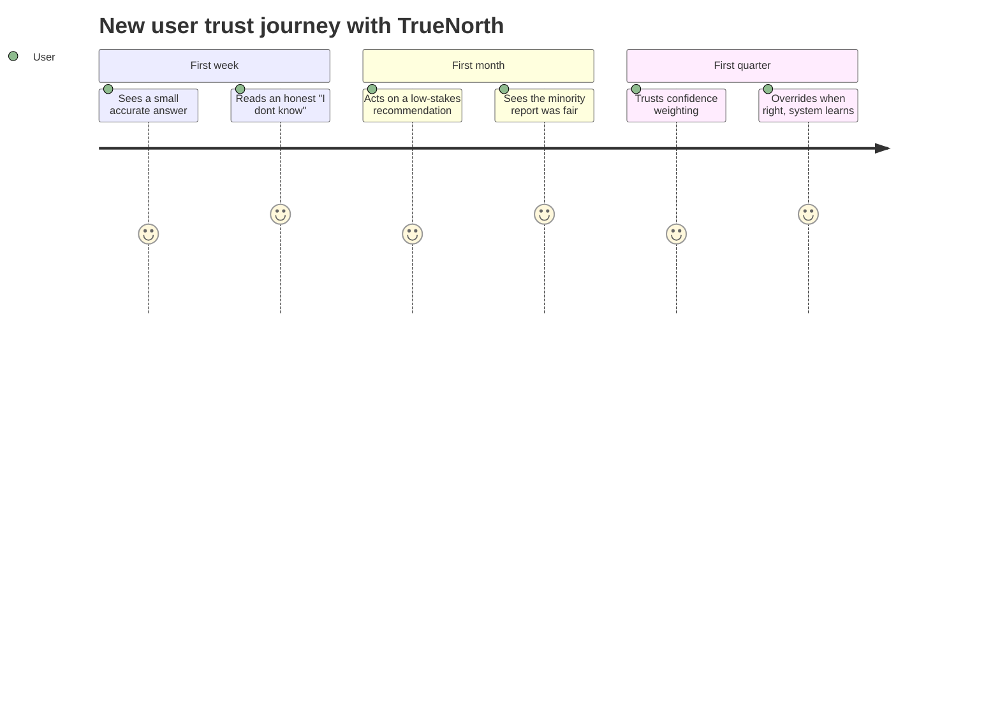
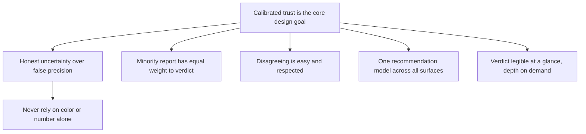

# Product & UX perspective

## 1. Front matter

| Field | Value |
|---|---|
| Doc ID | PERS-PRODUCT-UX |
| Role | Chief product officer & head of design (blended) |
| Owning unit | U24 Perspective Product & UX |
| Pillars referenced | SX-1, SX-2, SX-3, SX-4, DI-4, DI-5, GV-4, AD-2, AD-5 |
| Version | 1.0 |

## 2. Role & mandate

The CPO and head of design own whether TrueNorth is something people actually use to make better decisions, or a powerful engine no one trusts enough to act on. The hardest product problem here is not features; it is trust calibration — getting humans to rely on the system exactly as much as it deserves, no more and no less. Over-trust produces automation bias and abdication; under-trust produces an ignored tool. In three years, success looks like decision-makers who treat TrueNorth as a sharp, honest advisor whose minority report they read first, whose confidence they have learned to weight correctly, and whose presence has measurably improved decision quality without flattening the diversity of human judgment. This document owns journeys, design principles, and interaction heuristics only; it does not specify SX features (those belong to the SX catalog).

## 3. Decisions I face today

| Decision | Cadence | Stakes | Current pain |
|---|---|---|---|
| How much to surface vs. withhold in a recommendation | Per design cycle | S3 | Too much detail buries the verdict; too little hides the reasoning |
| How to show confidence and uncertainty honestly | Per design cycle | S3 | Numbers imply false precision; words are vague |
| How to make the minority report impossible to ignore | Per design cycle | S3 | The dissent gets collapsed and skipped |
| Where decision support should live | Continuous | S3 | A separate destination gets abandoned; embedding everywhere dilutes focus |
| How to onboard trust without overselling | Per launch | S3 | Demos overpromise; reality underwhelms and trust never recovers |

## 4. Jobs-to-be-done

- JTBD-1: When a user receives a recommendation, I want the verdict, its confidence, and its strongest counter-argument legible at a glance, so they neither over-trust nor dismiss it.
- JTBD-2: When the system is uncertain, I want the interface to communicate that honestly, so users calibrate.
- JTBD-3: When a user disagrees, I want disagreeing to be easy and respected, so the human stays in charge and the system learns.
- JTBD-4: When a new user starts, I want trust built from accurate small wins, so adoption rests on evidence, not hype.
- JTBD-5: When decision support is needed, I want it to appear in the user's existing flow, so it is used rather than visited.

## 5. A day with TrueNorth

As head of design I review a redesign of the recommendation card. The verdict is one of four canonical words, color-coded but never color-only (accessibility). Confidence is shown as a calibrated band with a plain-language qualifier and a link to how well the system has been calibrated for this kind of decision. The minority report sits beside the verdict, not behind a disclosure triangle, with equal visual weight. A one-tap "I disagree" opens a short capture of the human's reasoning that routes to the decision record. Across the product, the same recommendation card renders identically whether it appears in a workbench, in chat, or in an email plugin, so users learn one mental model.

## 6. Feature requirements I own

No owned workbench, and by mandate this unit specifies no SX features. What it owns are the design principles and interaction heuristics that the SX catalog must honor. The principle hierarchy:

Design principles (binding on SX-1, SX-2, SX-3, SX-4):

- P1 Calibrated trust first: every recommendation surface must make the verdict, its calibrated confidence, and its minority report co-visible. Confidence must reference DI-6 calibration history, not raw model probability.
- P2 Honest uncertainty: communicate "I don't know" and low confidence as first-class states, visually distinct, never hidden to look more capable.
- P3 Dissent parity: the minority report (DI-4-2-2) renders with equal prominence to the verdict; collapsing it is prohibited.
- P4 Human authority: disagreeing or overriding is always one clear action away and is treated as legitimate, with rationale capture, never friction designed to discourage it.
- P5 One mental model: the recommendation artifact looks and behaves consistently across web, chat, mobile, and plugins.
- P6 Glance-to-depth: the verdict is legible in seconds; reasoning, lenses, and evidence expand on demand without overwhelming the default view.
- P7 Anti-automation-bias: the UI actively resists abdication — for S1/S2, it requires the human to engage with the minority report before sign-off.
- P8 Inclusive by default: never convey meaning by color or number alone; honor SX-6 accessibility and localization.

## 7. Cross-pillar needs

| Need | Depends on |
|---|---|
| Recommendation rendering in role-aware command centers | SX-1 |
| Conversational surface honoring the design principles | SX-2 |
| In-flow plugin rendering with one consistent model | SX-3 |
| Frontline/mobile rendering of recommendations | SX-4 |
| Verdict, confidence, conditions, minority report to render | DI-4 |
| Devil's-advocate content for the minority report | DI-5 |
| Calibration data to show honest confidence | GV-4 |
| Change-management and trust-building program | AD-2 |
| Co-design feedback loops with users | AD-5 |

## 8. Red lines & veto conditions

- Any design that hides, collapses by default, or de-emphasizes the minority report violates P3 and is vetoed.
- Any confidence display that implies more precision than DI-6 calibration supports is dishonest and vetoed.
- Designing override as a deliberately high-friction "are you really sure" gauntlet to nudge compliance violates the human-decides invariant and is vetoed.
- Any surface that conveys verdict by color alone fails accessibility and is vetoed.
- Dark patterns that steer users toward acting on recommendations they have not understood are prohibited.

## 9. Adoption & workflow integration

Trust is earned through accurate small wins, so the rollout sequence is a design concern: start users on low-stakes, high-frequency decisions where the system can be right often and visibly, and where an honest "I don't know" builds credibility rather than disappointment. Embed in existing tools (SX-3) before asking anyone to adopt a new destination. Make the first month about calibration — teaching users what the confidence band means by showing them outcomes — not about volume.

## 10. Success metrics & value model

- Trust calibration: correlation between user reliance and recommendation correctness (the real north star — neither over- nor under-reliance).
- Minority-report engagement rate on S1/S2 decisions (are people reading the dissent?).
- Override rate and override-correctness (healthy disagreement, not blind acceptance).
- Time-to-verdict-comprehension (glance legibility).
- Cross-surface consistency (same task, same mental model).
- Sustained usage in-flow vs. abandonment of a separate destination.

## 11. Hard questions for the build team

- HQ-1: How do we measure trust calibration in production, not just satisfaction, so we can tell over-trust from healthy reliance?
- HQ-2: What is the interaction that makes a busy executive actually read the minority report before signing off, without it becoming a dismissible nag?
- HQ-3: How do we show confidence such that users build a correct intuition for it over time, given DI-6 calibration varies by decision class?
- HQ-4: How do we keep one consistent recommendation model across radically different surfaces (factory terminal vs. board portal) without lowest-common-denominator design?
- HQ-5: How do we design against automation bias when the system is usually right — the most dangerous case?

## 12. Dependencies & references

| Reference | Type | Why |
|---|---|---|
| SX-1, SX-2, SX-3, SX-4 | Canonical L2 | Surfaces that must honor these design principles |
| DI-4 | Canonical L2 | Verdict, confidence, conditions, minority report to render |
| DI-5 | Canonical L2 | Devil's-advocate content shown as the minority report |
| GV-4 | Canonical L2 | Calibration and explainability data for honest confidence |
| AD-2, AD-5 | Canonical L2 | Change management and co-design feedback |
| U7 Catalog SX+WB-0 | Work unit | Owns the SX surfaces these principles bind |
| U6 Catalog DI+SF | Work unit | Owns the recommendation content being designed around |
| U10 Catalog PL+AD | Work unit | Owns the adoption and feedback machinery |
