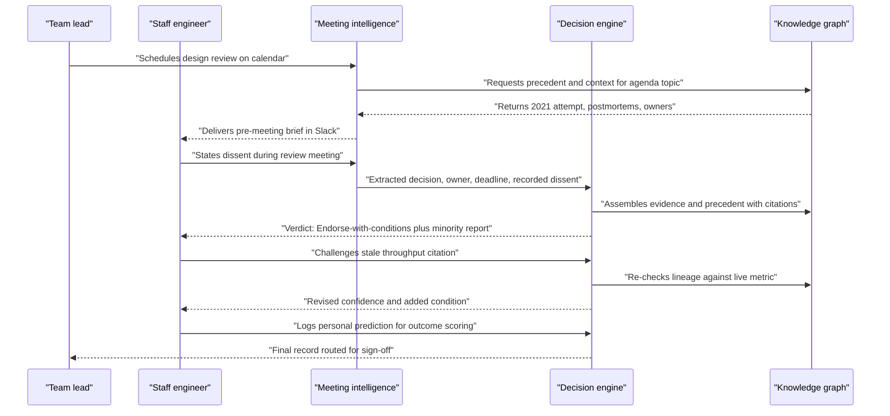
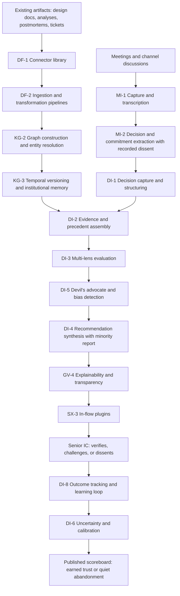

# Senior IC perspective

## 1. Front matter

| Field | Value |
|---|---|
| Doc ID | PERS-SENIOR-IC |
| Role | Staff engineer and senior business analyst (senior individual contributors) |
| Owning unit | U22 Perspective Senior IC |
| Pillars referenced | DF (DF-1, DF-2, DF-3, DF-5), KG (KG-2, KG-3, KG-4, KG-5), MI (MI-1, MI-2, MI-3, MI-4, MI-6), GA (GA-4), DI (DI-1, DI-2, DI-3, DI-4, DI-5, DI-6, DI-7, DI-8), SF (SF-6), SX (SX-2, SX-3), GV (GV-3, GV-4, GV-6), SC (SC-1), PL (PL-4), AD (AD-3, AD-5) |
| Version | 1.0 |

## 2. Role & mandate

This document represents the composite voice of two senior individual contributors: a staff engineer with fifteen-plus years across four companies, and a senior business analyst who owns forecasting models and metric definitions for a large operating division. Neither manages headcount. Both are paid for exactly one thing: judgment — the ability to look at a proposal, a dataset, or a room converging on a comfortable answer and say what is actually true, including when that is unwelcome.

Their accountability is concrete. The staff engineer is the person whose name appears in the design review when the architecture fails three years later. The analyst is the person whose forecast underwrote a capacity commitment. Senior ICs carry asymmetric exposure: they are consulted on decisions they do not control, then held informally accountable when those decisions sour. This shapes everything they want from TrueNorth.

This persona has lived through five "transformational" enterprise tools, and watched each follow the same arc: mandated adoption, an initial burst of dashboard enthusiasm from management, a quietly accumulating documentation tax on the people doing real work, and eventual abandonment to a license-renewal zombie state. The senior IC's default posture toward TrueNorth is therefore not hostility but conservation of energy: the tool gets one honest evaluation, conducted privately, against the IC's own judgment on live decisions. If the tool loses that bake-off, the IC will not file a complaint or attend a feedback session. They will simply stop reading its output, and no usage dashboard will detect the difference between compliance and engagement.

Success in three years, if TrueNorth works, looks like this: the hours per week spent on organizational archaeology — reconstructing why a system is the way it is, finding the postmortem nobody indexed, locating the person who remembers the 2021 attempt — drop to near zero. Dissent registered in a meeting survives the meeting, attached immutably to the decision record, and resurfaces automatically when the outcome lands. The IC's documented judgment compounds into a personal, evidence-backed track record instead of evaporating into hallway folklore. And critically: the IC produces no more documentation than today. TrueNorth earns its keep by reading what senior ICs already write — design documents, analyses, postmortems, review comments, tickets — not by asking them to feed a second system.

The failure mode this persona most fears is not surveillance (though that is a hard red line) but homogenization: a multi-lens engine that averages every sharp position into committee-flavored mush, gives every proposal "Endorse-with-conditions," and trains the organization to substitute a confident-sounding aggregate for the uncomfortable specific judgment that one experienced person was willing to stake their name on.

## 3. Decisions I face today

I do not make S1 or S2 calls, but my fingerprints are on a remarkable number of S3 decisions that executives believe they made alone. Here is my actual decision surface.

| Decision | Cadence | Stakes | Current pain |
|---|---|---|---|
| Technology selection (build vs. buy, datastore, framework, vendor) | Quarterly | S3 | The same debate gets re-litigated every two years; the outcomes of prior attempts live in the heads of people who left. |
| Design review verdicts on other teams' proposals | Weekly | S4 | Assembling context takes longer than the review itself; I review with 40% of the relevant history. |
| Tech debt remediation vs. roadmap features | Monthly | S3–S4 | My evidence is anecdotal ("we keep getting paged") while the feature side has revenue numbers; debt loses by default. |
| Incident remediation scope: patch vs. systemic fix | Per incident | S3 | Postmortem action items evaporate within two sprints; the systemic fix I argued for is never traceable to the repeat incident a year later. |
| Pushing back on infeasible delivery commitments | Sprint / quarterly | S4 | My dissent is verbal, unrecorded, and forgotten; when the date slips, the record shows only that I was "on the team that missed." |
| Canonical metric definition calls (which "revenue" is real) | Monthly | S3 | Three departments report three numbers; whoever escalates loudest wins; my reconciliation analysis is read once and lost. |
| Forecast methodology choice for planning inputs | Quarterly | S3 | No institutional record of realized accuracy by method, so methodology debates are aesthetic, not empirical. |
| Whether to escalate disagreement or disagree-and-commit | Ad hoc | S3 | Escalation burns social capital; silence buys peace but means the record shows consensus that never existed. |
| Deprecation and sunset calls for systems and reports | Annual | S3 | Nobody can enumerate who actually depends on the thing, so everything lives forever or dies by surprise. |
| Vendor and tool evaluations I am drafted into | Semiannual | S3 | Evaluation criteria are reinvented from scratch each time; the last evaluation's scoring sheet is in a departed PM's drive. |

The pattern across every row: the cost is not the decision itself, it is the archaeology before it and the amnesia after it.

## 4. Jobs-to-be-done

Ranked by importance to this persona.

1. **JTBD-1** — When I disagree with a decision being made in a meeting, I want my dissent captured verbatim, timestamped, and immutably attached to the decision record, so I can disagree-and-commit without my position being erased from history.
2. **JTBD-2** — When a team proposes something, I want the full genealogy of prior similar attempts with their actual outcomes surfaced automatically, so the organization stops paying me to re-fight settled battles from memory.
3. **JTBD-3** — When I produce a design document, analysis, model, or postmortem in my existing tools, I want TrueNorth to ingest and link it as-is, so I never duplicate a single sentence into a second system.
4. **JTBD-4** — When a recommendation contradicts my judgment, I want its full evidence chain, confidence, and explicit what-would-change-its-mind conditions, so I can attempt to falsify it instead of being asked to take it on authority.
5. **JTBD-5** — When I walk into a decision meeting, I want a brief assembled from existing artifacts and graph context, so the first thirty minutes are spent deciding rather than reconstructing.
6. **JTBD-6** — When a room is converging too fast, I want a sharp, evidence-specific devil's-advocate argument generated automatically, so dissent stops depending on whether I am willing to spend social capital that day.
7. **JTBD-7** — When I cite a figure in an analysis, I want field-level lineage from source system to citation with a quality score, so I am not held accountable for upstream data rot I cannot see.
8. **JTBD-8** — When outcomes land, I want both my recorded predictions and the engine's tracked and scored side by side, so trust in either direction is earned from evidence rather than mandated by rollout decree.
9. **JTBD-9** — When I query institutional memory, I want permission-aware retrieval that says "insufficient evidence" rather than fabricating a plausible answer, so one confident hallucination does not poison everything else.
10. **JTBD-10** — When the system misattributes a commitment or decision to me from a meeting, I want to correct it in under thirty seconds inside the chat tool I already live in, so accuracy maintenance never becomes a standing chore.

## 5. A day with TrueNorth

This is month seven. The first two months I spent trying to break it — I keep a private log of my own predictions on every decision I touch, and I compared my hit rate against the engine's before I trusted a word it said. What follows is a Tuesday from the period after it earned its seat.

07:40. The pre-meeting brief for the 10:00 design review lands in my Slack, not in some portal I would never open. The proposal: migrate order-event processing to a streaming platform. The brief is four paragraphs and one table, and the third paragraph is why I stopped trying to kill this tool: it has found the 2021 attempt at substantially the same migration — a project I had completely forgotten, run by a team that no longer exists — including the abandonment decision and the postmortem citing driver immaturity and an unbudgeted operational burden. Two of the three blockers have since been resolved upstream; one has not. I did not ask for this. Nobody typed it in. It was assembled from a wiki page, two postmortems, and a meeting transcript that all already existed.

10:00. The review runs. The proposing engineer has read the same brief, so we skip the archaeology and argue about the one unresolved blocker, which is the conversation we should have been having all along. I think the operational burden is still underpriced and I say so, specifically. The team leans toward proceeding. I disagree and commit. The extraction pipeline catches the decision, the owner, the deadline — and my dissent, verbatim, attached to the record. I check the extraction in the channel afterward; it has my position right. Thirty seconds, one emoji-confirm, done.

14:15. The recommendation arrives: Endorse-with-conditions, confidence 0.71. The minority report leads with my argument — and then makes a second argument I had not made, about a capacity assumption in the throughput projection, citing a load-test report from another division I have never met. I check the citation. The load test is real but eleven months old, and I happen to know that workload doubled since. I challenge the citation in-thread. The engine traces lineage, confirms the figure is stale against the live metric, re-runs, and drops confidence to 0.58 with a new condition: re-validate throughput against current load before commit. It did not defend itself. It updated. That is more than I can say for most principal engineers, myself occasionally included.

14:30. I log my own prediction in the same thread: migration succeeds technically, operational cost lands 2x the estimate. The engine records it next to its own. One of us will be right, and in two quarters the outcome tracker will say which, in public, with numbers. I have a standing quarterly review of exactly this — my calibration against the engine's, decision by decision. So far across five months: I am better on operational-cost questions, it is better on cross-division dependency questions, and we are both recalibrating. That scoreboard is the entire basis of my trust. The day it stops being published is the day I stop reading the verdicts.

16:00. An old dissent pays out. A repeat incident fires on a service where, fourteen months ago, I argued the patch-level fix was insufficient and was overruled. The incident record auto-links to that decision, my recorded dissent surfaces in the retrospective brief, and the systemic fix I proposed is back on the table — not because I spent the meeting saying I told you so, but because the system did it for me, neutrally, with timestamps. That feature alone is worth more to me than every dashboard this company has ever bought.

## 6. Feature requirements I own

No owned workbench. The senior IC mints no feature IDs and owns no department surface; this persona is a consumer and stress-tester of capabilities specified elsewhere. Its needs map almost entirely onto the canonical L2s of the Knowledge Graph (KG), Meeting & Communication Intelligence (MI), and Decision Intelligence (DI) pillars, with delivery through in-flow surfaces (SX-3) and trust underwritten by governance (GV-3, GV-4) and calibration (DI-6, PL-4). Section 7 states each need against its canonical L2.

The diagram below is this persona's top cross-pillar dependency chain — the "dissent-to-vindication" path. It is the single chain that, if any link breaks, causes the senior IC to quietly route around the entire product: artifacts the IC already produces must flow into the graph without added effort, meetings must yield faithful decision and dissent records, verdicts must be challengeable with transparent evidence, and outcomes must close the loop back into a public calibration record.

## 7. Cross-pillar needs

| Need | Depends on |
|---|---|
| TrueNorth shall ingest the artifacts senior ICs already produce (design docs, analyses, postmortems, tickets, review threads) from existing tools with zero duplicate entry. | DF-1, DF-2 |
| Every figure cited to a senior IC shall carry field-level lineage and a data-quality score so upstream rot is visible and attributable. | DF-5, DF-3 |
| Prior attempts at substantially similar decisions, with realized outcomes, shall be retrievable as decision genealogy that survives team turnover and departures. | KG-3 |
| Entities across the IC's artifact trail (systems, metrics, people, projects) shall resolve to single graph nodes so precedent search is not defeated by naming drift. | KG-2 |
| Retrieval shall be permission-aware and shall return an explicit insufficient-evidence response rather than a fabricated answer. | KG-4 |
| SME validation queues shall be load-bounded and credited so contested-fact resolution does not become an unpaid second job for the most senior ICs. | KG-5 |
| Decisions, commitments, owners, and explicitly voiced dissent shall be extracted from meetings the IC already attends, with sub-minute correction from the IC's existing chat surface. | MI-2, MI-3 |
| Pre-meeting briefs with precedent and required data shall arrive before the meeting in the IC's existing tools. | MI-4 |
| Recording and capture shall honor consent and off-the-record zones so candor in working sessions is not chilled. | MI-1, MI-6 |
| Every verdict shall expose its evidence chain, confidence, and explicit conditions that would change its conclusion, in a form an expert can attempt to falsify. | DI-4, DI-6, GV-4 |
| The minority report shall preserve the strongest specific human dissent verbatim rather than paraphrasing it into consensus language. | DI-4, DI-5 |
| The devil's-advocate function shall generate evidence-specific counterarguments against converging rooms, not generic risk boilerplate. | DI-5 |
| Engine confidence and named-expert predictions shall be scored against realized outcomes and published on a recurring cadence. | DI-8, DI-6, SF-6 |
| Multi-lens evaluation shall preserve inter-lens disagreement in its output rather than averaging it away. | DI-3 |
| Stakes-tiered review shall keep S4 decisions lightweight so routine team calls are not burdened with enterprise ceremony. | DI-7 |
| Decision records and recorded dissent shall be immutable and replayable, with edits visible as versioned amendments only. | GV-3 |
| Alignment scores on decisions shall never be repurposed as individual performance measures, per the platform's prohibited-use red lines. | GA-4, GV-6 |
| Verdicts, briefs, and corrections shall be deliverable inside Slack/Teams and adjacent flow tools rather than requiring a destination portal. | SX-3, SX-2 |
| Judgment-bearing outputs shall be regression-tested against golden decision sets so model upgrades do not silently degrade verdict quality. | PL-4 |
| The IC's access shall follow existing SSO and role entitlements with no separate credential or access ritual. | SC-1 |
| IC feedback on bad extractions and bad verdicts shall flow into a co-design loop with visible disposition of what was fixed. | AD-5 |

## 8. Red lines & veto conditions

Senior ICs cannot veto a procurement, but they hold a more decisive power: they can make a tool irrelevant by ignoring it, and their disengagement is contagious downward through every engineer and analyst who calibrates on their behavior. The following conditions trigger that outcome.

- **Mutable dissent.** If a recorded dissent can be edited, softened, or deleted by anyone — including the dissenter's management chain — after the fact, the entire value proposition collapses. Dissent records must be append-only with visible amendment history (GV-3). The first verified instance of a sanitized dissent record ends this persona's participation permanently.
- **One fabricated citation at stakes S3 or above.** A wrong answer with honest uncertainty is forgivable; a confident citation to a document that does not say what the engine claims is not. Senior ICs spot-check citations as a matter of professional habit, and they tell each other what they find. Citation integrity is binary trust, not a gradient.
- **Net-new documentation burden.** Any mandatory form, field, tag, or status update that exists solely to feed TrueNorth — beyond what the IC's existing tools already require — will be satisfied with minimum-viable garbage within six weeks, poisoning the graph it was meant to enrich. The tool reads what already exists or it starves.
- **Decision telemetry repurposed for performance management.** If alignment scores, dissent frequency, verdict-agreement rates, or usage analytics about an identified individual ever appear in a performance review, calibration discussion, or promotion packet, the platform's red lines (GV-6) have been breached and ICs will train themselves to perform for the sensor rather than think.
- **"TrueNorth says" as a debate-ender.** The moment managers cite a verdict as an authority that closes discussion — rather than as one calibrated input with stated confidence — the engine has become a laundering mechanism for decisions already made. Verdict surfaces must make uncertainty and the minority report at least as visible as the verdict label itself (GV-4).
- **Verdict-distribution collapse.** If, after a year, eighty percent of recommendations are "Endorse-with-conditions," the multi-lens synthesis has learned to hedge rather than judge, and the output is institutional mush. The verdict distribution by stakes tier should be a published health metric.
- **No epistemic humility.** An engine that never outputs "insufficient evidence to evaluate" is bluffing somewhere. Refusal-to-answer must be an expected, unpunished output class (KG-4, DI-6).
- **Latency that misses the moment.** A pre-meeting brief that arrives after the meeting starts, or a verdict that lands a week after the decision shipped, is archaeology about the present. Flow-of-work timing is a correctness property, not a nicety.
- **Cross-tenant expertise leakage.** If patterns distilled from this company's engineering judgment surface in another tenant's recommendations, the IC's accumulated professional judgment has been expropriated. Hard isolation guarantees must hold for learned behavior, not just raw data.

## 9. Adoption & workflow integration

What this persona would actually change in their week, given the system described above: pre-meeting preparation shifts from forty-five minutes of archaeology to ten minutes of verifying a brief; precedent search becomes a first reflex instead of a last resort; dissent gets registered in one spoken sentence plus a thirty-second extraction check, instead of a politically fraught follow-up email that is never written; postmortem follow-through gets tracked by the system instead of by the IC's guilty conscience. The quarterly self-calibration review — personal predictions versus engine predictions versus outcomes — becomes a standing practice, because for the first time the data to do it exists.

What this persona will ignore, regardless of mandates: executive dashboards and command centers (SX-1 is for other personas); weekly digest emails, which are deleted unread on arrival; gamification, badges, streaks, and adoption nudges of every species; the conversational assistant for anything a code search or SQL query answers faster; and any "insight" that is not attached to a decision currently in motion.

What must never be required: daily or weekly status entry of any kind; re-tagging or re-filing artifacts the IC already wrote; mandatory acknowledgment clicks on recommendations; attendance at training for a tool that claims to live inside existing workflows (an in-flow tool that needs a training academy has already failed this persona — AD-1 effort should target other roles); and rating every recommendation as a recurring chore, as opposed to the voluntary, consequential act of challenging a specific verdict.

The realistic adoption arc for this persona is: two quarters of silent parallel evaluation against a private prediction log, during which the engine's only job is to be right, be honest about uncertainty, and never fabricate; followed either by genuine integration into the IC's working habits, or by polite, undetectable abandonment. Champion programs (AD-2) should understand that senior ICs convert on evidence and convert others by example — one staff engineer publicly saying "it found the 2021 postmortem before I remembered it" is worth a hundred enablement sessions.

## 10. Success metrics & value model

Metrics this persona would accept as honest measures, in priority order.

- **Time-to-context.** Median hours of human archaeology per S3 decision, measured by sampled time studies, not tool telemetry. Baseline at a typical Fortune-500: four to eight hours. Target: under one hour. This is the single most defensible productivity claim.
- **Precedent recall rate.** Share of evaluated decisions where the engine surfaced a genuinely relevant precedent before any participant recalled it unaided (DI-2, KG-3). This measures whether institutional memory is real or decorative.
- **Dissent capture and resurfacing.** Share of contested decisions carrying at least one structured dissent record (MI-2, DI-1), and share of adverse outcomes where prior recorded dissent was automatically resurfaced in the retrospective (DI-8). The second number is the one ICs care about.
- **Calibration scoreboard.** Engine Brier score versus named volunteer experts' Brier scores on the same decisions, published quarterly by domain (DI-6, SF-6, PL-4). The engine does not need to beat the best expert everywhere; it needs to be honestly scored and visibly improving.
- **Citation validity rate.** Sampled audit of evidence citations; at S3 and above this must be indistinguishable from perfect, because trust is binary at the citation level.
- **Net documentation delta.** Minutes per week of senior-IC time spent feeding, correcting, or maintaining the system, minus minutes saved. Must be negative from quarter two onward; correction effort (JTBD-10) counts against it.
- **Silent-override rate.** Share of verdicts that decision-makers contradicted without engaging the rebuttal flow (AD-3, DI-8). Rising silent override is the leading indicator of quiet abandonment — the tool's true churn metric, invisible to login analytics.
- **Verdict distribution health.** Distribution across Endorse / Endorse-with-conditions / Caution / Oppose by stakes tier, monitored for hedging collapse (Section 8).

The value model, from the IC's seat: senior judgment is the scarcest renewable resource in the company. Two hours per week of archaeology returned to each of five hundred senior ICs is roughly fifty thousand expert-hours a year — real but not the headline. The headline is avoided repetition of known failures: a single prevented re-run of an already-failed S3 migration, or one capacity commitment corrected by a stale-citation challenge before contract signature, plausibly covers a year of platform cost (AD-4 owns the formal attribution method; this persona only insists the attribution be auditable, because ICs have watched too many tools claim credit for outcomes they merely observed).

## 11. Hard questions for the build team

1. **HQ-1** — What happens, mechanically and publicly, the first time the engine is confidently wrong on an S3 decision: who is notified, what gets retrained, and where does the postmortem of the engine itself live?
2. **HQ-2** — What is the evidence threshold below which the engine refuses to issue a verdict, and what fraction of early-deployment requests do you expect to end in "insufficient evidence" — and will leadership tolerate that honesty?
3. **HQ-3** — Show the immutability guarantee for recorded dissent end to end: who holds delete rights at the storage layer, and what does a subpoena, a retention policy, or an embarrassed VP do to it?
4. **HQ-4** — How does multi-lens synthesis avoid converging on hedged middle verdicts, and what measured verdict-distribution target will you commit to before launch rather than after?
5. **HQ-5** — If a named expert beats the engine's calibration in a domain for four consecutive quarters, does the engine learn from that expert's reasoning — and if it does, what attribution or consent governs the extraction of an individual's professional judgment into a corporate asset?
6. **HQ-6** — What is the measured marginal documentation burden per decision for a senior IC, in minutes, and at what threshold do you commit to cutting features rather than adding fields?
7. **HQ-7** — What product mechanisms prevent "TrueNorth endorsed it" from becoming an accountability shield for managers and an appeal-to-authority that ends technical debate?
8. **HQ-8** — When recorded dissent is vindicated by an outcome, who is notified and how visibly — and conversely, how do you prevent the dissent ledger from becoming a blame instrument or an I-told-you-so leaderboard?
9. **HQ-9** — Can a tenant verify, not merely be assured, that judgment patterns learned from its decisions never influence another tenant's recommendations — and is that guarantee preserved under every deployment model including SaaS?
10. **HQ-10** — What latency budget is contractually promised for pre-meeting briefs and post-meeting verdicts, and what happens to the verdict's standing when the decision could not wait for it?
11. **HQ-11** — Who staffs the SME validation queues, how is that labor budgeted and credited, and what stops contested-fact resolution from defaulting onto the same five most-senior ICs until they burn out?
12. **HQ-12** — What is the sunset criterion: which measured outcome, sustained for how long, would cause you to recommend the customer turn TrueNorth off — and if the answer is "none," why should a person whose entire job is falsifiable judgment trust a system that exempts itself from falsifiability?

## 12. Dependencies & references

| Reference | Type | Why |
|---|---|---|
| KG-2, KG-3, KG-4, KG-5 | Canonical L2 capabilities | Institutional memory, decision genealogy, honest retrieval, and bounded SME load are this persona's core dependencies. |
| MI-1, MI-2, MI-3, MI-4, MI-6 | Canonical L2 capabilities | Meeting capture, dissent extraction, follow-through, briefs, and consent controls define the persona's daily touchpoints. |
| DI-1 through DI-8 | Canonical L2 capabilities | The judgment core: structured records, precedent, lenses, minority reports, calibration, stakes-tiered review, outcome learning. |
| DF-1, DF-2, DF-3, DF-5 | Canonical L2 capabilities | Zero-burden ingestion of existing artifacts plus lineage and quality scoring on every cited figure. |
| GV-3, GV-4, GV-6 | Canonical L2 capabilities | Immutable records, falsifiable explanations, and enforced prohibited-use red lines underwrite all trust. |
| SX-2, SX-3 | Canonical L2 capabilities | All delivery must occur in existing flow tools; no destination portal. |
| GA-4, SF-6, PL-4, SC-1, AD-3, AD-5 | Canonical L2 capabilities | Alignment-score misuse limits, backtesting, eval harness, SSO-native access, honest usage analytics, and feedback loops. |
| Catalog DF+KG | Work unit | Specifies the ingestion and knowledge-graph capabilities this persona depends on but does not spec. |
| Catalog MI+GA | Work unit | Specifies meeting intelligence, including dissent extraction and pre-meeting briefs. |
| Catalog DI+SF | Work unit | Specifies the decision engine and backtesting capabilities central to the calibration scoreboard. |
| Catalog SX+WB-0 | Work unit | Specifies the in-flow surfaces through which all IC interaction occurs. |
| Catalog GV | Work unit | Specifies immutability, explainability, and red-line enforcement. |
| Catalog PL+AD | Work unit | Specifies the evaluation harness and adoption analytics referenced in Sections 9 and 10. |
| Catalog SC | Work unit | Specifies identity and tenant-isolation guarantees behind HQ-9. |
| Perspective Engineering Team Leader | Work unit | Adjacent persona; owns WB-ENG, where many of this persona's decisions surface organizationally. |
| Perspective Frontline & Entry-Level | Work unit | Adjacent persona; junior ICs inherit whatever norms senior ICs model toward the system. |
| Perspective Product & UX | Work unit | Owns the journey principles that determine whether in-flow integration is real or nominal. |
| Responsible-AI Deep Dive | Work unit | Owns red-team scenarios for the surveillance and misuse risks raised in Section 8. |
